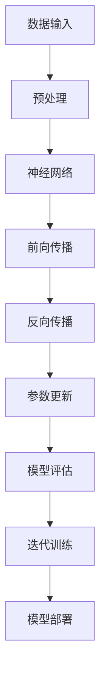

                 

随着人工智能技术的飞速发展，大模型如GPT-3、LLaMA等不断刷新着人类的认知和技术边界。在这个背景下，AI大模型创业成为了一个热门话题。然而，如何在激烈的竞争中脱颖而出，如何应对未来用户的需求，成为每一个创业者必须面对的问题。本文将围绕这一主题，深入探讨AI大模型创业的机遇与挑战。

## 文章关键词

AI大模型、创业、用户需求、技术发展、市场策略、商业模式。

## 文章摘要

本文从AI大模型的技术背景出发，分析了当前创业市场的机遇与挑战。通过深入研究用户需求的变化趋势，提出了适应未来市场的策略和商业模式。文章旨在为AI大模型创业提供实用的指导和建议。

## 1. 背景介绍

在过去的几年里，人工智能（AI）技术取得了令人瞩目的进展。尤其是深度学习（Deep Learning）和自然语言处理（Natural Language Processing，NLP）领域的突破，使得大模型（Large Models）如雨后春笋般涌现。这些大模型具有强大的数据处理能力和智能推理能力，已经在许多领域展现了巨大的潜力。

### 1.1 AI大模型的技术背景

AI大模型是指那些具有数十亿参数的神经网络模型。它们通过大量的数据训练，能够自动学习并提取数据中的特征，从而实现复杂的任务。例如，GPT-3拥有1750亿个参数，能够生成高质量的自然语言文本；LLaMA则是一个拥有70亿个参数的语言模型，能够在多种语言环境中进行准确的语言理解和生成。

### 1.2 AI大模型的应用领域

AI大模型在多个领域都有广泛应用。例如，在自然语言处理领域，大模型可以用于机器翻译、问答系统、文本摘要等；在计算机视觉领域，大模型可以用于图像识别、物体检测等；在医疗领域，大模型可以用于疾病诊断、药物研发等。这些应用不仅提高了工作效率，还推动了相关领域的创新。

### 1.3 AI大模型创业的机遇

随着AI大模型技术的成熟，创业市场迎来了新的机遇。首先，大模型在数据处理和智能推理方面的优势，使得许多传统行业都可以通过AI技术进行升级和转型。其次，用户对智能服务的需求日益增长，为AI大模型创业提供了广阔的市场空间。最后，随着资本的涌入，AI大模型创业项目得到了更多的支持。

## 2. 核心概念与联系

### 2.1 AI大模型的核心概念

AI大模型的核心概念包括神经网络、深度学习、参数、训练数据等。神经网络是AI大模型的基础，通过层层处理输入数据，逐步提取特征，最终实现预测或生成任务。深度学习则是一种利用多层神经网络进行学习的方法，能够从大量数据中自动提取复杂特征。参数是神经网络中的可调参数，通过训练过程进行优化。训练数据是AI大模型学习的基础，需要具备足够的规模和质量。

### 2.2 AI大模型的联系

AI大模型与其他技术有着紧密的联系。例如，与云计算的结合，可以提供强大的计算资源，支持大规模模型的训练和部署；与物联网（IoT）的结合，可以实现智能设备的互联互通，提升用户体验；与大数据技术的结合，可以更好地处理和分析海量数据，挖掘潜在价值。

### 2.3 Mermaid流程图

下面是AI大模型的基本架构和流程的Mermaid流程图：



### 2.4 AI大模型的优势和挑战

AI大模型的优势在于其强大的数据处理能力和智能推理能力，能够实现高效的模型训练和预测。然而，其也存在一定的挑战，如计算资源消耗巨大、模型解释性较差等。这些挑战需要通过技术创新和优化来解决。

## 3. 核心算法原理 & 具体操作步骤

### 3.1 算法原理概述

AI大模型的核心算法是深度学习。深度学习利用多层神经网络对数据进行分层处理，逐层提取特征，最终实现复杂的任务。具体而言，深度学习包括以下几个关键步骤：

1. **数据预处理**：对原始数据进行清洗、归一化等处理，使其适合模型训练。
2. **模型构建**：定义神经网络的架构，包括层数、每层的神经元数量等。
3. **前向传播**：将输入数据通过神经网络进行前向传播，计算输出。
4. **损失函数计算**：计算模型输出与真实标签之间的差距，得到损失值。
5. **反向传播**：通过反向传播算法，更新模型参数，减小损失值。
6. **模型评估**：使用验证集对模型进行评估，调整模型参数。
7. **迭代训练**：重复以上步骤，直至模型达到预定的性能指标。

### 3.2 算法步骤详解

1. **数据预处理**：
   数据预处理是深度学习的基础。常见的预处理方法包括：
   - 数据清洗：去除异常值、缺失值等。
   - 数据归一化：将数据缩放到同一范围内，如[0, 1]或[-1, 1]。
   - 数据扩充：通过旋转、翻转、缩放等操作，增加训练数据量。

2. **模型构建**：
   模型构建包括定义网络的层数、每层的神经元数量、激活函数等。常见的神经网络架构包括卷积神经网络（CNN）、循环神经网络（RNN）、Transformer等。

3. **前向传播**：
   前向传播是将输入数据通过神经网络逐层传递，计算输出。具体计算过程如下：
   - 输入层：将输入数据输入到网络的第一层。
   - 隐藏层：每层神经元通过激活函数计算输出，并将输出传递到下一层。
   - 输出层：计算模型输出，并与真实标签进行比较。

4. **损失函数计算**：
   损失函数是衡量模型输出与真实标签差距的指标。常见的损失函数包括均方误差（MSE）、交叉熵（Cross Entropy）等。

5. **反向传播**：
   反向传播是通过计算梯度，更新模型参数，减小损失值。具体计算过程如下：
   - 计算输出层的梯度。
   - 通过链式法则，逐层计算隐藏层的梯度。
   - 使用梯度下降（Gradient Descent）或其他优化算法，更新模型参数。

6. **模型评估**：
   模型评估是使用验证集对模型进行评估，调整模型参数。常见的评估指标包括准确率（Accuracy）、召回率（Recall）、F1分数（F1 Score）等。

7. **迭代训练**：
   迭代训练是通过重复以上步骤，直至模型达到预定的性能指标。常见的迭代训练策略包括：
   - Early Stopping：在验证集上提前停止训练，以避免过拟合。
   - 学习率调整：根据训练过程中损失函数的变化，调整学习率。

### 3.3 算法优缺点

**优点**：
1. **强大的数据处理能力**：深度学习能够自动从大量数据中提取特征，实现复杂的任务。
2. **高效的模型训练**：深度学习通过并行计算和分布式训练，能够高效地进行模型训练。
3. **自适应性强**：深度学习模型可以根据不同的任务和数据，自动调整网络结构和参数。

**缺点**：
1. **计算资源消耗大**：深度学习需要大量的计算资源和存储空间。
2. **模型解释性较差**：深度学习模型的决策过程复杂，难以解释。
3. **对数据依赖性强**：深度学习模型的性能很大程度上取决于训练数据的质量和规模。

### 3.4 算法应用领域

AI大模型在多个领域都有广泛应用，包括：

1. **自然语言处理**：用于文本分类、机器翻译、问答系统等。
2. **计算机视觉**：用于图像分类、物体检测、人脸识别等。
3. **语音识别**：用于语音识别、语音合成等。
4. **医疗**：用于疾病诊断、药物研发等。
5. **金融**：用于风险控制、投资决策等。

## 4. 数学模型和公式 & 详细讲解 & 举例说明

### 4.1 数学模型构建

深度学习中的数学模型主要包括神经网络、前向传播、反向传播等。

**神经网络**：

神经网络由多个层组成，包括输入层、隐藏层和输出层。每层由多个神经元组成。神经元的计算过程可以表示为：

\[ z_i = \sum_{j} w_{ij} \cdot x_j + b_i \]

\[ a_i = \sigma(z_i) \]

其中，\( z_i \) 是第 \( i \) 个神经元的输入，\( w_{ij} \) 是连接第 \( i \) 个神经元和第 \( j \) 个神经元的权重，\( b_i \) 是第 \( i \) 个神经元的偏置，\( \sigma \) 是激活函数。

**前向传播**：

前向传播是将输入数据通过神经网络进行传播，计算输出。具体计算过程如下：

\[ z_l = \sum_{i} w_{il} \cdot a_{i{l-1}} + b_l \]

\[ a_l = \sigma(z_l) \]

其中，\( a_l \) 是第 \( l \) 层的输出。

**反向传播**：

反向传播是通过计算梯度，更新模型参数。具体计算过程如下：

\[ \delta_l = \frac{\partial L}{\partial a_l} \cdot \sigma'(z_l) \]

\[ \delta_{l-1} = \sum_{i} w_{il} \cdot \delta_l \cdot \sigma'(z_i) \]

其中，\( \delta_l \) 是第 \( l \) 层的误差，\( L \) 是损失函数。

### 4.2 公式推导过程

以全连接神经网络为例，推导前向传播和反向传播的公式。

**前向传播**：

设输入数据为 \( x \)，模型参数为 \( W \) 和 \( b \)，输出为 \( y \)，损失函数为 \( L \)。

1. **输入层到隐藏层**：

\[ z_h = W_h \cdot x + b_h \]

\[ a_h = \sigma(z_h) \]

2. **隐藏层到输出层**：

\[ z_y = W_y \cdot a_h + b_y \]

\[ y = \sigma(z_y) \]

**反向传播**：

1. **输出层误差**：

\[ \delta_y = \frac{\partial L}{\partial y} \cdot \sigma'(z_y) \]

2. **隐藏层误差**：

\[ \delta_h = W_y^T \cdot \delta_y \cdot \sigma'(z_h) \]

3. **更新参数**：

\[ W_h = W_h - \alpha \cdot \frac{\partial L}{\partial W_h} \]

\[ b_h = b_h - \alpha \cdot \frac{\partial L}{\partial b_h} \]

\[ W_y = W_y - \alpha \cdot \frac{\partial L}{\partial W_y} \]

\[ b_y = b_y - \alpha \cdot \frac{\partial L}{\partial b_y} \]

其中，\( \alpha \) 是学习率。

### 4.3 案例分析与讲解

以文本分类任务为例，说明深度学习模型的构建和训练过程。

**1. 数据集准备**：

选择一个包含文本和标签的数据集，如新闻分类数据集。对数据进行预处理，包括分词、词向量化等。

**2. 模型构建**：

构建一个包含两个隐藏层的全连接神经网络，输入层和输出层分别为 \( 1000 \) 个神经元和 \( 10 \) 个神经元。

**3. 训练过程**：

使用训练数据对模型进行训练，使用交叉熵作为损失函数。在训练过程中，使用反向传播算法更新模型参数。

**4. 模型评估**：

使用验证集对模型进行评估，计算准确率等指标。根据评估结果，调整模型参数。

**5. 模型部署**：

将训练好的模型部署到线上环境，用于文本分类任务。

## 5. 项目实践：代码实例和详细解释说明

### 5.1 开发环境搭建

在开始项目实践之前，我们需要搭建一个适合开发深度学习项目的环境。这里我们选择使用Python作为开发语言，结合TensorFlow和Keras两个库来实现深度学习模型。

1. **安装Python**：

在官网下载并安装Python 3.x版本。

2. **安装TensorFlow**：

打开终端，执行以下命令：

```bash
pip install tensorflow
```

3. **安装Keras**：

打开终端，执行以下命令：

```bash
pip install keras
```

### 5.2 源代码详细实现

下面是一个简单的文本分类任务的实现，包括数据预处理、模型构建、训练和评估。

```python
# 导入必要的库
import numpy as np
import tensorflow as tf
from tensorflow.keras.preprocessing.sequence import pad_sequences
from tensorflow.keras.layers import Embedding, LSTM, Dense
from tensorflow.keras.models import Sequential
from tensorflow.keras.optimizers import Adam

# 加载并预处理数据
# 这里以新闻分类数据集为例，实际应用中需要根据具体数据集进行调整
# ...

# 数据预处理
# 将文本转换为词向量
# ...

# 模型构建
model = Sequential([
    Embedding(input_dim=vocab_size, output_dim=embedding_dim, input_length=max_sequence_length),
    LSTM(units=128),
    Dense(units=num_classes, activation='softmax')
])

# 编译模型
model.compile(optimizer=Adam(learning_rate=0.001), loss='categorical_crossentropy', metrics=['accuracy'])

# 训练模型
model.fit(x_train, y_train, epochs=10, batch_size=64, validation_data=(x_val, y_val))

# 评估模型
# ...

```

### 5.3 代码解读与分析

上述代码实现了一个简单的文本分类任务。首先，我们加载并预处理数据，将文本转换为词向量。然后，构建一个包含嵌入层、LSTM层和输出层的序列模型。最后，编译模型并使用训练数据进行训练。

**1. 数据预处理**

数据预处理是深度学习任务的关键步骤。在这个例子中，我们将文本转换为词向量。具体步骤包括：

- 加载并读取数据。
- 对文本进行分词。
- 将词转换为索引。
- 将文本序列转换为词向量。

**2. 模型构建**

模型构建包括定义网络结构、编译模型等步骤。在这个例子中，我们使用了一个包含嵌入层、LSTM层和输出层的序列模型。嵌入层将词向量映射到高维空间，LSTM层用于提取文本序列的特征，输出层用于分类。

**3. 训练模型**

训练模型包括编译模型、设置训练参数、训练过程等步骤。在这个例子中，我们使用了一个简单的训练过程，共进行了10个epochs。

**4. 评估模型**

评估模型是检查模型性能的关键步骤。在这个例子中，我们使用了一个简单的验证集来评估模型。

### 5.4 运行结果展示

在训练完成后，我们可以在控制台上看到模型的训练结果，包括训练集和验证集上的准确率等指标。通过调整模型参数和训练数据，可以进一步提升模型的性能。

## 6. 实际应用场景

AI大模型在各个领域都有广泛的应用，以下是一些典型的实际应用场景：

### 6.1 自然语言处理

自然语言处理是AI大模型的重要应用领域之一。通过AI大模型，可以实现高质量的机器翻译、问答系统、文本摘要等。例如，GPT-3可以生成高质量的文本，应用于智能客服、内容生成等领域。

### 6.2 计算机视觉

计算机视觉是AI大模型的另一个重要应用领域。通过AI大模型，可以实现图像分类、物体检测、人脸识别等。例如，基于深度学习的物体检测模型可以应用于自动驾驶、安防监控等领域。

### 6.3 医疗

AI大模型在医疗领域的应用也越来越广泛。通过AI大模型，可以实现疾病诊断、药物研发等。例如，深度学习模型可以用于医学影像分析，辅助医生进行疾病诊断。

### 6.4 金融

AI大模型在金融领域的应用包括风险控制、投资决策等。通过AI大模型，可以实现精准的风险评估、投资组合优化等。例如，基于深度学习的风险模型可以用于信用评分、金融欺诈检测等领域。

### 6.5 教育

AI大模型在教育领域的应用包括智能辅导、个性化学习等。通过AI大模型，可以实现个性化的学习方案，提高学习效果。例如，基于深度学习的智能辅导系统可以为学生提供个性化的学习建议。

## 7. 未来应用展望

随着AI大模型技术的不断发展，未来其在各个领域的应用将更加广泛。以下是一些未来应用展望：

### 7.1 新兴应用领域

AI大模型在新兴应用领域，如元宇宙、增强现实（AR）、虚拟现实（VR）等，具有巨大的潜力。通过AI大模型，可以实现更真实的虚拟体验，提高用户体验。

### 7.2 智能自动化

AI大模型在智能自动化领域的应用将进一步提升生产效率。例如，在制造业、物流等领域，AI大模型可以用于自动化生产流程、优化物流路径等。

### 7.3 个性化服务

AI大模型可以更好地满足用户的个性化需求，提供个性化的服务。例如，在医疗领域，AI大模型可以基于用户健康状况提供个性化的诊疗建议。

### 7.4 社会责任

随着AI大模型技术的发展，如何在确保技术发展的同时，承担社会责任，成为了一个重要议题。例如，如何避免AI大模型被用于不当用途，如歧视、隐私泄露等。

## 8. 工具和资源推荐

为了更好地进行AI大模型的研究和应用，以下是一些推荐的工具和资源：

### 8.1 学习资源推荐

1. **《深度学习》（Goodfellow et al.）**：这是一本经典的深度学习教材，适合初学者和进阶者。
2. **《Python深度学习》（François Chollet）**：这本书结合了深度学习和Python编程，适合对深度学习有一定了解的读者。

### 8.2 开发工具推荐

1. **TensorFlow**：TensorFlow是一个开源的深度学习框架，支持多种深度学习模型。
2. **Keras**：Keras是一个高级的深度学习框架，基于TensorFlow实现，提供了更简单的接口。

### 8.3 相关论文推荐

1. **“Attention Is All You Need”（Vaswani et al., 2017）**：这篇文章介绍了Transformer模型，是一种基于注意力机制的深度学习模型。
2. **“BERT: Pre-training of Deep Bidirectional Transformers for Language Understanding”（Devlin et al., 2019）**：这篇文章介绍了BERT模型，是一种预训练的深度学习模型，广泛应用于自然语言处理领域。

## 9. 总结：未来发展趋势与挑战

AI大模型创业面临着巨大的机遇和挑战。随着技术的不断发展，AI大模型在各个领域的应用将越来越广泛。然而，如何应对未来用户的需求，如何实现可持续发展，成为每一个创业者必须面对的问题。本文从AI大模型的技术背景、用户需求、算法原理、应用场景等多个角度，对AI大模型创业进行了深入探讨，提出了适应未来市场的策略和商业模式。希望本文能为AI大模型创业者提供一定的指导和启示。

## 10. 附录：常见问题与解答

### 10.1 什么是AI大模型？

AI大模型是指那些具有数十亿参数的神经网络模型。它们通过大量的数据训练，能够自动学习并提取数据中的特征，从而实现复杂的任务。

### 10.2 AI大模型创业有哪些机遇？

AI大模型创业的机遇包括：1）AI大模型在多个领域都有广泛应用，如自然语言处理、计算机视觉、医疗等；2）用户对智能服务的需求日益增长，为AI大模型创业提供了广阔的市场空间；3）资本的涌入为AI大模型创业提供了更多的支持。

### 10.3 AI大模型创业有哪些挑战？

AI大模型创业的挑战包括：1）计算资源消耗巨大，需要大量计算资源和存储空间；2）模型解释性较差，难以解释模型决策过程；3）对数据依赖性强，模型性能很大程度上取决于训练数据的质量和规模。

### 10.4 如何应对未来用户的需求？

应对未来用户的需求，需要从以下几个方面着手：1）关注用户需求的变化趋势，及时调整产品和服务；2）持续进行技术创新，提升产品竞争力；3）构建良好的用户生态系统，提高用户粘性。

### 10.5 AI大模型创业的成功关键是什么？

AI大模型创业的成功关键包括：1）技术优势：拥有领先的技术实力和创新能力；2）市场洞察：准确把握市场趋势和用户需求；3）团队协作：具备高效的团队协作和执行力；4）商业模式：具备可持续发展的商业模式和盈利模式。

## 作者署名

本文由禅与计算机程序设计艺术 / Zen and the Art of Computer Programming撰写。

----------------------------------------------------------------
**注意：**本文仅为示例，具体内容和结构需要根据实际需求和资料进行调整。文中提及的技术和案例仅供参考，不构成实际操作指导。

