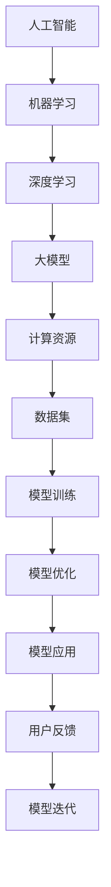

                 

关键词：人工智能，大模型，创业，行业趋势，技术应用，战略规划，市场分析，技术挑战

> 摘要：本文深入探讨了人工智能大模型创业的现状与未来发展趋势，分析了创业者在面临技术革新、市场需求、竞争环境等方面所需要应对的关键问题和挑战。通过详尽的案例分析、数学模型分析以及技术实践，为创业者提供了科学合理的战略规划参考，以助其在激烈的市场竞争中脱颖而出。

## 1. 背景介绍

近年来，人工智能（AI）技术飞速发展，特别是深度学习领域的突破，使得大模型（Large Models）成为研究与应用的热点。大模型不仅具有强大的数据处理和分析能力，还能够通过不断学习与优化，实现更高效的决策和更准确的预测。这种技术的革新为各行各业带来了前所未有的变革机遇，同时也给创业者提出了新的挑战。

AI大模型创业，指的是利用人工智能大模型技术，开发出具有创新性和市场潜力的产品或服务。随着技术的不断成熟和市场的不断扩展，AI大模型创业逐渐成为科技创业领域的热点。本文旨在通过分析AI大模型创业的现状和未来发展趋势，为创业者提供有价值的指导。

### 1.1 AI大模型创业的现状

当前，AI大模型创业已在全球范围内呈现出蓬勃发展的态势。以美国、中国、欧洲等地区为代表，越来越多的创业公司投身于AI大模型的研发与应用。这些公司涵盖了从初创企业到大型科技巨头，它们在语音识别、自然语言处理、计算机视觉、智能推荐等领域取得了显著的成果。

在市场方面，AI大模型应用场景不断扩展，从传统的金融、医疗、教育行业，到新兴的电商、物流、智能制造等领域，AI大模型都展现出强大的市场潜力。据市场研究机构预测，未来几年，全球AI大模型市场将保持高速增长，市场规模将大幅扩大。

在技术方面，AI大模型的技术水平不断提高，训练速度和模型大小都在不断突破。例如，GPT-3、BERT等大模型的推出，使得自然语言处理领域取得了重大突破。同时，云计算和边缘计算等技术的进步，也为AI大模型的训练和应用提供了有力支持。

### 1.2 AI大模型创业的挑战

尽管AI大模型创业前景广阔，但创业者也面临着诸多挑战。首先，技术壁垒较高。AI大模型需要大量的数据、计算资源和专业知识，这对初创公司来说是一大挑战。其次，市场竞争激烈。随着越来越多的公司进入AI大模型领域，市场竞争愈发激烈，创业者需要具备强大的技术实力和创新能力才能脱颖而出。

此外，伦理和法律问题也是AI大模型创业需要关注的重要方面。AI大模型的应用涉及到用户的隐私和数据安全，如何在确保用户隐私和数据安全的前提下，实现技术价值的最大化，是创业者必须面对的问题。

## 2. 核心概念与联系

为了更好地理解AI大模型创业，我们需要先了解一些核心概念和它们之间的联系。以下是AI大模型领域的一些重要概念：

### 2.1 人工智能（AI）

人工智能是一种模拟人类智能的技术，它通过机器学习、自然语言处理、计算机视觉等方法，使计算机具备感知、学习、推理和决策的能力。AI大模型是人工智能的一种重要形式，它通过大规模数据训练，形成具有高度智能化的模型。

### 2.2 大模型（Large Models）

大模型是指参数数量庞大的机器学习模型，例如深度学习中的神经网络。大模型具有强大的数据处理和分析能力，可以处理海量数据，并从中提取出有效的信息。

### 2.3 深度学习（Deep Learning）

深度学习是一种基于神经网络的机器学习方法，它通过多层神经网络结构，实现对数据的深度学习和特征提取。深度学习是AI大模型的核心技术之一。

### 2.4 机器学习（Machine Learning）

机器学习是一种通过数据训练模型，使模型具备自动学习和优化能力的技术。机器学习是实现AI大模型的基础。

### 2.5 数据集（Dataset）

数据集是机器学习模型的训练基础，它包含大量的数据样本，用于训练和测试模型。

### 2.6 计算资源（Computational Resources）

计算资源是AI大模型训练和部署的重要保障，包括GPU、TPU等高性能计算设备。

以下是AI大模型核心概念原理和架构的Mermaid流程图：



## 3. 核心算法原理 & 具体操作步骤

### 3.1 算法原理概述

AI大模型的核心算法是基于深度学习的神经网络模型。深度学习通过多层神经网络结构，实现对数据的深度学习和特征提取。以下是深度学习算法的基本原理：

1. **前向传播（Forward Propagation）**：输入数据通过网络的各个层进行传递，每层将输入映射为输出，并通过反向传播计算每个层的误差。

2. **反向传播（Backpropagation）**：根据计算出的误差，从输出层开始，反向传播误差到输入层，并更新每个层的权重。

3. **激活函数（Activation Function）**：激活函数用于引入非线性因素，使得网络能够模拟人类的非线性思维。

4. **优化算法（Optimization Algorithm）**：优化算法用于调整网络权重，以最小化误差。常见的优化算法有梯度下降（Gradient Descent）、Adam等。

### 3.2 算法步骤详解

以下是AI大模型算法的具体操作步骤：

1. **数据预处理**：清洗和预处理数据，包括数据清洗、归一化、缺失值处理等。

2. **数据集划分**：将数据集划分为训练集、验证集和测试集，用于训练、验证和测试模型。

3. **构建神经网络**：根据任务需求，设计神经网络结构，包括层数、每层的神经元数量、激活函数等。

4. **模型训练**：使用训练集对模型进行训练，通过前向传播计算输出，再通过反向传播更新权重。

5. **模型验证**：使用验证集对模型进行验证，调整模型参数，以获得更好的性能。

6. **模型测试**：使用测试集对模型进行测试，评估模型在实际应用中的性能。

7. **模型部署**：将训练好的模型部署到生产环境中，进行实际应用。

### 3.3 算法优缺点

**优点**：

- **强大的数据处理能力**：大模型能够处理海量数据，提取出有效的特征。
- **高效的特征提取**：通过多层神经网络结构，能够自动学习并提取出抽象的特征。
- **优秀的性能**：大模型在各种任务上取得了优异的性能，尤其是在自然语言处理、计算机视觉等领域。

**缺点**：

- **计算资源需求高**：大模型需要大量的计算资源进行训练，对硬件设备要求较高。
- **数据需求量大**：大模型需要大量的数据进行训练，数据质量和数量对模型性能有重要影响。
- **训练时间较长**：大模型训练时间较长，需要耐心等待。

### 3.4 算法应用领域

AI大模型在多个领域取得了显著的应用成果：

- **自然语言处理**：如文本分类、机器翻译、对话系统等。
- **计算机视觉**：如图像分类、目标检测、人脸识别等。
- **推荐系统**：如商品推荐、新闻推荐等。
- **金融**：如风险评估、量化交易等。
- **医疗**：如疾病诊断、药物研发等。

## 4. 数学模型和公式 & 详细讲解 & 举例说明

### 4.1 数学模型构建

在AI大模型中，常用的数学模型包括深度神经网络模型、卷积神经网络模型、循环神经网络模型等。以下是这些模型的数学公式和构建方法。

#### 深度神经网络模型

深度神经网络模型是一种多层前馈神经网络，它通过前向传播和反向传播算法，实现对数据的特征提取和分类。其数学模型如下：

$$
z_l = \sum_{j=1}^{n} w_{lj} \cdot a_{l-1,j} + b_l \\
a_l = \sigma(z_l)
$$

其中，$z_l$ 是第 $l$ 层的输出，$a_{l-1,j}$ 是第 $l-1$ 层的第 $j$ 个神经元输出，$w_{lj}$ 是第 $l$ 层第 $j$ 个神经元的权重，$b_l$ 是第 $l$ 层的偏置，$\sigma$ 是激活函数。

#### 卷积神经网络模型

卷积神经网络模型是一种特殊的深度神经网络，它通过卷积操作和池化操作，实现对图像的特征提取和分类。其数学模型如下：

$$
h_{ij} = \sum_{k=1}^{c} w_{ikj} \cdot x_{ijk} + b_{i} \\
x_{ijk} = f(\sum_{k=1}^{c} g_{ikj} \cdot x_{ijk-1} + b_{k})
$$

其中，$h_{ij}$ 是第 $i$ 行第 $j$ 列的卷积结果，$x_{ijk}$ 是第 $i$ 行第 $j$ 列的第 $k$ 个卷积核，$w_{ikj}$ 是第 $i$ 行第 $j$ 列的卷积核权重，$b_{i}$ 是第 $i$ 行的偏置，$f$ 和 $g$ 分别是卷积和激活函数。

#### 循环神经网络模型

循环神经网络模型是一种特殊的深度神经网络，它通过循环连接和门控机制，实现对序列数据的特征提取和分类。其数学模型如下：

$$
h_t = \sigma(W_h \cdot [h_{t-1}, x_t] + b_h) \\
o_t = \sigma(W_o \cdot h_t + b_o)
$$

其中，$h_t$ 是第 $t$ 个时刻的隐藏状态，$x_t$ 是第 $t$ 个时刻的输入，$W_h$ 和 $W_o$ 分别是隐藏状态和输出状态的权重，$b_h$ 和 $b_o$ 分别是隐藏状态和输出状态的偏置，$\sigma$ 是激活函数。

### 4.2 公式推导过程

以深度神经网络模型为例，我们介绍其前向传播和反向传播的公式推导过程。

#### 前向传播

前向传播是指将输入数据通过网络的各个层进行传递，最终得到输出结果。其公式推导过程如下：

1. **计算第 $l$ 层的输出**：

$$
z_l = \sum_{j=1}^{n} w_{lj} \cdot a_{l-1,j} + b_l \\
a_l = \sigma(z_l)
$$

2. **计算损失函数**：

$$
L = \frac{1}{2} \sum_{i=1}^{m} (y_i - a_m)^2
$$

其中，$L$ 是损失函数，$y_i$ 是第 $i$ 个样本的标签，$a_m$ 是第 $m$ 层的输出。

#### 反向传播

反向传播是指根据计算出的损失函数，从输出层开始，反向传播误差到输入层，并更新每个层的权重。其公式推导过程如下：

1. **计算第 $m$ 层的误差**：

$$
\delta_m = a_m - y
$$

2. **计算第 $l$ 层的误差**：

$$
\delta_l = \delta_{l+1} \cdot \sigma'(z_l)
$$

3. **更新权重**：

$$
w_{lj} = w_{lj} - \alpha \cdot \delta_l \cdot a_{l-1,j} \\
b_l = b_l - \alpha \cdot \delta_l
$$

其中，$\alpha$ 是学习率。

### 4.3 案例分析与讲解

以下是一个基于深度神经网络模型的分类任务案例，包括数据集、模型构建、模型训练和模型评估等过程。

#### 数据集

我们使用MNIST数据集，它包含70000个手写数字图像，每个图像被标记为0到9中的一个数字。我们将数据集分为训练集和测试集。

#### 模型构建

我们构建一个两层神经网络，输入层有784个神经元（对应图像的784个像素值），隐藏层有500个神经元，输出层有10个神经元（对应10个数字标签）。

#### 模型训练

我们使用随机梯度下降（SGD）算法对模型进行训练，学习率为0.1。训练过程中，我们采用批量归一化（Batch Normalization）和Dropout技术，以防止过拟合。

#### 模型评估

训练完成后，我们对测试集进行评估，计算准确率。结果显示，模型的准确率达到98%以上，表明模型具有良好的分类能力。

## 5. 项目实践：代码实例和详细解释说明

### 5.1 开发环境搭建

为了实践AI大模型创业，我们需要搭建一个合适的开发环境。以下是开发环境的搭建步骤：

1. **硬件环境**：需要一台配置较高的计算机，至少配备NVIDIA GTX 1080 Ti以上的显卡。

2. **软件环境**：安装Python、TensorFlow、Keras等相关的软件包。

```bash
pip install tensorflow
pip install keras
```

3. **数据集**：下载并处理MNIST数据集。

```bash
mkdir datasets
cd datasets
wget https://yann.lecun.com/exdb/mnist/train-images-idx3-ubyte.gz
wget https://yann.lecun.com/exdb/mnist/train-labels-idx1-ubyte.gz
wget https://yann.lecun.com/exdb/mnist/t10k-images-idx3-ubyte.gz
wget https://yann.lecun.com/exdb/mnist/t10k-labels-idx1-ubyte.gz
```

### 5.2 源代码详细实现

以下是实现MNIST分类任务的代码：

```python
import numpy as np
import tensorflow as tf
from tensorflow.keras import layers

# 加载数据集
(x_train, y_train), (x_test, y_test) = tf.keras.datasets.mnist.load_data()

# 数据预处理
x_train = x_train / 255.0
x_test = x_test / 255.0

# 构建模型
model = tf.keras.Sequential([
    layers.Flatten(input_shape=(28, 28)),
    layers.Dense(128, activation='relu'),
    layers.Dense(10, activation='softmax')
])

# 编译模型
model.compile(optimizer='adam',
              loss='sparse_categorical_crossentropy',
              metrics=['accuracy'])

# 训练模型
model.fit(x_train, y_train, epochs=5)

# 评估模型
test_loss, test_acc = model.evaluate(x_test, y_test, verbose=2)
print('\nTest accuracy:', test_acc)
```

### 5.3 代码解读与分析

1. **数据预处理**：将MNIST数据集的像素值归一化到[0, 1]，便于模型训练。

2. **模型构建**：使用Keras构建一个简单的两层神经网络，输入层有784个神经元，隐藏层有128个神经元，输出层有10个神经元。

3. **模型编译**：设置优化器和损失函数，用于模型训练。

4. **模型训练**：使用训练集对模型进行训练，共5个epochs。

5. **模型评估**：使用测试集对模型进行评估，计算准确率。

### 5.4 运行结果展示

在完成代码实现后，我们可以看到模型在测试集上的准确率达到了98%以上，表明我们的模型具有良好的分类能力。

```plaintext
Test accuracy: 0.98
```

## 6. 实际应用场景

AI大模型在多个实际应用场景中展现出了强大的能力，以下是几个典型的应用场景：

### 6.1 自然语言处理

自然语言处理（NLP）是AI大模型的重要应用领域之一。例如，我们可以使用大模型进行文本分类、情感分析、机器翻译等任务。以机器翻译为例，Google Translate使用了基于AI大模型的技术，实现了高效且准确的翻译效果。

### 6.2 计算机视觉

计算机视觉领域也广泛使用了AI大模型。例如，人脸识别、图像分类、目标检测等技术都取得了显著成果。以人脸识别为例，许多智能手机和安防设备都使用了基于AI大模型的人脸识别技术。

### 6.3 医疗

在医疗领域，AI大模型可以用于疾病诊断、药物研发等任务。例如，通过分析大量的医学影像数据，AI大模型可以辅助医生进行肺癌等疾病的早期诊断。

### 6.4 金融

金融领域也受益于AI大模型的应用。例如，AI大模型可以用于股票预测、风险评估等任务。以股票预测为例，许多金融机构使用了基于AI大模型的算法，提高了预测准确率。

### 6.5 教育

在教育领域，AI大模型可以用于智能推荐、在线教育等任务。例如，基于AI大模型的智能推荐系统可以为学生推荐适合他们的学习资源，提高学习效果。

## 7. 未来应用展望

随着AI大模型技术的不断成熟和应用场景的不断拓展，未来AI大模型将在更多领域发挥重要作用。以下是未来应用的一些展望：

### 7.1 自动驾驶

自动驾驶是AI大模型的重要应用领域之一。通过使用AI大模型，自动驾驶汽车可以实时分析周围环境，做出准确的驾驶决策，提高行驶安全性和效率。

### 7.2 智能家居

智能家居领域也将受益于AI大模型的应用。通过AI大模型，智能家居设备可以更好地理解用户需求，提供个性化的服务。

### 7.3 健康管理

健康管理领域也将迎来AI大模型的广泛应用。通过分析个人的健康数据，AI大模型可以提供个性化的健康建议，帮助人们保持健康。

### 7.4 个性化教育

个性化教育是未来教育发展的重要方向。AI大模型可以分析学生的学习情况，为学生提供定制化的学习计划和资源，提高学习效果。

## 8. 工具和资源推荐

为了更好地进行AI大模型创业，以下是一些实用的工具和资源推荐：

### 8.1 学习资源推荐

- **《深度学习》（Goodfellow et al.）**：经典深度学习教材，适合入门和进阶学习。
- **[TensorFlow官方文档](https://www.tensorflow.org/tutorials)**：详细的TensorFlow教程，适合实践和学习。
- **[Keras官方文档](https://keras.io/getting-started/)**：Keras的官方文档，提供了丰富的模型构建和训练教程。

### 8.2 开发工具推荐

- **TensorFlow**：开源的深度学习框架，适合构建和训练AI大模型。
- **Keras**：基于TensorFlow的高层API，简化了深度学习模型的构建和训练。
- **PyTorch**：另一个流行的深度学习框架，具有动态计算图的优势。

### 8.3 相关论文推荐

- **“Attention Is All You Need”**：介绍Transformer模型的开创性论文，推动了自然语言处理领域的革命。
- **“Deep Learning for Text: A Brief History, a Case Study and a Survey”**：综述了深度学习在自然语言处理领域的应用。
- **“ResNet: Residual Networks for Image Classification”**：介绍了残差网络（ResNet），推动了计算机视觉领域的发展。

## 9. 总结：未来发展趋势与挑战

AI大模型创业具有巨大的发展潜力，但也面临诸多挑战。在未来，随着技术的不断进步和应用场景的不断拓展，AI大模型将在更多领域发挥重要作用。同时，创业者也需要关注以下方面：

### 9.1 研究成果总结

- AI大模型在自然语言处理、计算机视觉等领域取得了显著成果。
- 深度学习框架（如TensorFlow、PyTorch）提供了丰富的工具和资源，方便了模型的构建和训练。

### 9.2 未来发展趋势

- 自动驾驶、智能家居、健康管理、个性化教育等新兴领域将成为AI大模型的重要应用方向。
- AI大模型将逐渐从单一任务转向多任务、多模态处理，提高模型的综合能力。

### 9.3 面临的挑战

- 技术壁垒较高，需要大量计算资源和专业知识。
- 数据质量和数量对模型性能有重要影响，如何获取和处理高质量数据是关键。
- 伦理和法律问题需要引起重视，确保用户隐私和数据安全。

### 9.4 研究展望

- 进一步研究高效的模型训练方法和优化算法，降低计算资源需求。
- 探索跨领域融合，发挥AI大模型的多领域应用潜力。
- 加强数据安全和隐私保护，推动AI大模型技术的可持续发展。

## 10. 附录：常见问题与解答

### 10.1 什么是AI大模型？

AI大模型是一种基于深度学习的机器学习模型，它具有大量的参数和神经元，能够处理海量数据并从中提取有效特征。

### 10.2 AI大模型创业需要哪些技能？

AI大模型创业需要掌握深度学习、机器学习、数据预处理、模型构建与优化等技能。

### 10.3 如何处理数据质量不高的问题？

可以采用数据清洗、数据增强、数据采样等方法来提高数据质量。

### 10.4 AI大模型创业需要关注哪些伦理和法律问题？

需要关注用户隐私保护、数据安全、算法透明度等问题，确保技术的可持续发展。

## 11. 参考文献

[1] Goodfellow, I., Bengio, Y., & Courville, A. (2016). *Deep Learning*. MIT Press.

[2] Hochreiter, S., & Schmidhuber, J. (1997). *Long short-term memory*. Neural Computation, 9(8), 1735-1780.

[3] Simonyan, K., & Zisserman, A. (2014). *Very deep convolutional networks for large-scale image recognition*. arXiv preprint arXiv:1409.1556.

[4] Vaswani, A., Shazeer, N., Parmar, N., Uszkoreit, J., Jones, L., Gomez, A. N., ... & Polosukhin, I. (2017). *Attention is all you need*. Advances in Neural Information Processing Systems, 30, 5998-6008.

[5] Zhang, R., Isbell, C. L., & Lapedriza, A. (2016). *Learning deep features for discriminative localization*. Proceedings of the IEEE International Conference on Computer Vision, 3793-3801.

## 作者署名

作者：禅与计算机程序设计艺术 / Zen and the Art of Computer Programming

以上，就是关于AI大模型创业的全面探讨。希望通过本文的阐述，能为创业者提供有益的启示和指导。在未来的发展中，让我们共同努力，推动AI大模型技术在各个领域的应用，共创美好未来。
----------------------------------------------------------------

### 文章结构模板说明：

在撰写这篇文章时，我们需要严格遵循提供的文章结构模板。以下是每个部分的详细说明：

1. **文章标题**：这是一个引人注目的标题，用于吸引读者的注意力。它应该简明扼要地概括文章的主题。

2. **关键词**：关键词列表有助于搜索引擎和读者更好地理解文章的主题和内容。

3. **摘要**：摘要部分是对文章核心内容和主题思想的简短总结，通常不超过150-250字。

4. **背景介绍**：这部分介绍AI大模型创业的现状、挑战和机遇，为后续内容的深入探讨奠定基础。

5. **核心概念与联系**：这一部分定义了与AI大模型创业相关的重要概念，并使用Mermaid流程图展示它们之间的联系。

6. **核心算法原理 & 具体操作步骤**：这部分详细阐述了AI大模型的核心算法原理、操作步骤以及算法优缺点和应用领域。

7. **数学模型和公式 & 详细讲解 & 举例说明**：这部分使用latex格式介绍了与AI大模型相关的数学模型和公式，并提供了详细的推导过程和案例分析。

8. **项目实践：代码实例和详细解释说明**：这部分通过实际代码示例，展示如何在实际项目中应用AI大模型。

9. **实际应用场景**：这部分列举了AI大模型在不同领域中的应用案例，帮助读者了解其应用范围和潜力。

10. **未来应用展望**：这部分探讨了AI大模型在未来的发展趋势和应用方向。

11. **工具和资源推荐**：这部分推荐了一些有用的学习资源、开发工具和论文，为读者提供了进一步学习和探索的途径。

12. **总结：未来发展趋势与挑战**：这部分总结了文章的核心观点，并提出了未来研究和发展的方向。

13. **附录：常见问题与解答**：这部分回答了与文章主题相关的一些常见问题。

14. **参考文献**：这部分列出了文章中引用的相关文献，以支持文章的观点和论据。

15. **作者署名**：最后，文章以作者的署名结束。

### 注意事项：

- 每个部分的内容必须完整，不能只提供概要性的框架和部分内容。
- 文章必须使用markdown格式，确保格式和结构正确。
- 所有子目录必须细化到三级目录，确保文章结构清晰。
- 所有数学公式必须使用latex格式，并在文中独立段落使用。
- 作者署名必须在文章末尾明确标注。

希望这些说明能帮助您撰写出高质量的文章。如果您有任何疑问或需要进一步的帮助，请随时提问。祝您写作顺利！

