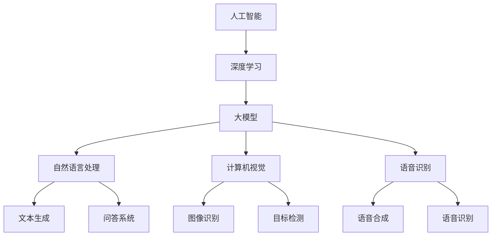
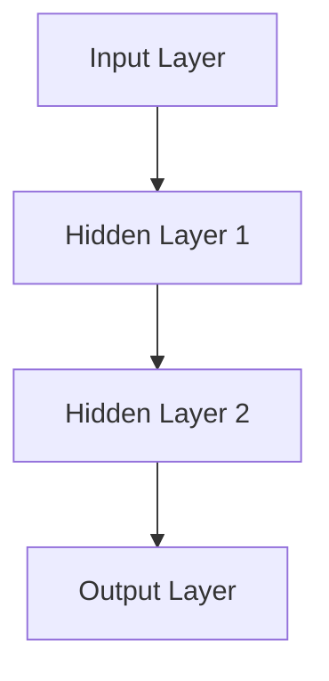

                 

随着人工智能技术的不断进步，AI大模型逐渐成为各行各业关注的焦点。在这篇文章中，我们将探讨AI大模型创业的现状、挑战、以及未来发展趋势。通过深入分析，希望为创业者提供有价值的参考和指导。

## 1. 背景介绍

人工智能（AI）作为一门交叉学科，涵盖了计算机科学、数学、统计学、神经科学等多个领域。近年来，随着计算能力的提升、大数据的积累以及深度学习算法的突破，AI技术得到了前所未有的发展。特别是大模型，如GPT、BERT等，在自然语言处理、计算机视觉、语音识别等领域的表现令人瞩目。

AI大模型的崛起，不仅改变了传统行业的工作方式，也为创业者提供了全新的商业机会。然而，AI大模型的创业并非一帆风顺，面临着技术、市场、政策等多重挑战。因此，如何应对这些挑战，抓住未来行业发展趋势，成为每个创业者必须思考的问题。

## 2. 核心概念与联系

在探讨AI大模型创业之前，我们需要了解一些核心概念。以下是一个简单的Mermaid流程图，用于描述这些概念之间的联系：



### 2.1 人工智能

人工智能是指使计算机模拟人类智能行为的技术和理论。它包括机器学习、深度学习、自然语言处理、计算机视觉等多个子领域。

### 2.2 深度学习

深度学习是机器学习的一种方法，通过多层神经网络模拟人脑的学习过程，对大量数据进行训练，从而实现高度复杂的模式识别和预测。

### 2.3 大模型

大模型是指具有巨大参数量和计算量的神经网络模型。这些模型能够处理海量数据，并从中提取出有价值的知识。

### 2.4 自然语言处理

自然语言处理是人工智能的一个重要分支，旨在使计算机理解和生成人类自然语言。它包括文本分类、情感分析、机器翻译等任务。

### 2.5 计算机视觉

计算机视觉是使计算机能够从图像或视频中提取有用信息的技术。它包括图像识别、目标检测、人脸识别等任务。

### 2.6 语音识别

语音识别是使计算机能够理解和处理人类语音的技术。它包括语音合成、语音识别、语音增强等任务。

## 3. 核心算法原理 & 具体操作步骤

### 3.1 算法原理概述

AI大模型的核心是深度学习算法，特别是基于神经网络的算法。以下是一个简单的算法原理概述：

1. **数据预处理**：对输入数据进行清洗、归一化等处理，以便于模型训练。
2. **模型设计**：设计具有多层神经元的神经网络结构，包括输入层、隐藏层和输出层。
3. **模型训练**：通过大量数据进行模型训练，不断调整模型参数，使其能够正确预测或分类。
4. **模型评估**：使用验证集和测试集对模型进行评估，检查模型的准确率、召回率等指标。
5. **模型部署**：将训练好的模型部署到实际应用场景中，进行实时预测或分类。

### 3.2 算法步骤详解

1. **数据预处理**：
   ```latex
   X = \text{normalize}(X) \\
   X = \text{remove outliers}(X) \\
   X = \text{add noise}(X)
   ```

2. **模型设计**：
   ```mermaid
   graph TD
       A[Input Layer] --> B[Hidden Layer 1]
       B --> C[Hidden Layer 2]
       C --> D[Hidden Layer 3]
       D --> E[Output Layer]
   ```

3. **模型训练**：
   ```latex
   \text{for } epoch \text{ in } 1 \text{ to } E \\
   \quad \text{for } batch \text{ in } X \\
   \quad \quad \text{Calculate gradients} \\
   \quad \quad \text{Update model parameters} \\
   \text{end for}
   ```

4. **模型评估**：
   ```latex
   \text{accuracy} = \frac{\text{correct predictions}}{\text{total predictions}} \\
   \text{recall} = \frac{\text{correct positive predictions}}{\text{total positive predictions}} \\
   \text{F1 score} = 2 \times \frac{\text{precision} \times \text{recall}}{\text{precision} + \text{recall}}
   ```

5. **模型部署**：
   ```mermaid
   graph TD
       A[Input Data] --> B[Model]
       B --> C[Preprocessing]
       C --> D[Prediction]
       D --> E[Output]
   ```

### 3.3 算法优缺点

**优点**：

1. **强大的学习能力**：能够处理海量数据，并从中提取出有价值的知识。
2. **自适应能力**：能够根据不同场景和任务进行自适应调整。
3. **高效性**：计算速度快，能够实时处理大量数据。

**缺点**：

1. **计算资源需求大**：需要大量计算资源和存储空间。
2. **数据依赖性**：模型的性能高度依赖于数据质量和数量。
3. **解释性差**：神经网络模型难以解释，缺乏透明性。

### 3.4 算法应用领域

AI大模型的应用领域非常广泛，包括但不限于：

1. **自然语言处理**：文本分类、情感分析、机器翻译等。
2. **计算机视觉**：图像识别、目标检测、人脸识别等。
3. **语音识别**：语音合成、语音识别、语音增强等。
4. **医疗健康**：疾病预测、诊断辅助、个性化治疗等。
5. **金融**：风险控制、量化交易、信用评估等。
6. **交通**：自动驾驶、智能交通管理、物流优化等。

## 4. 数学模型和公式 & 详细讲解 & 举例说明

### 4.1 数学模型构建

AI大模型的数学模型主要基于神经网络。以下是一个简单的神经网络模型：



### 4.2 公式推导过程

神经网络的训练过程可以通过以下公式推导：

1. **前向传播**：

   $$z^{(l)} = \sum_{k} w^{(l)}_k a^{(l-1)}_k + b^{(l)}$$

   $$a^{(l)} = \text{activation}(z^{(l)})$$

2. **反向传播**：

   $$\delta^{(l)}_k = \frac{\partial C}{\partial z^{(l)}_k} \odot (\text{activation derivative}(z^{(l)}_k))$$

   $$w^{(l)} \gets w^{(l)} - \alpha \times \frac{\partial C}{\partial w^{(l)}}$$

   $$b^{(l)} \gets b^{(l)} - \alpha \times \frac{\partial C}{\partial b^{(l)}}$$

### 4.3 案例分析与讲解

以下是一个简单的案例，用于讲解神经网络模型的构建和训练过程：

假设我们有一个二分类问题，输入特征为\(x_1, x_2\)，输出为\(y\)。我们需要构建一个神经网络模型来预测\(y\)。

1. **模型设计**：

   ```mermaid
   graph TD
       A[Input Layer] --> B[Hidden Layer 1] --> C[Output Layer]
       B --> D[Bias]
       C --> E[Activation Function]
   ```

2. **模型训练**：

   - **前向传播**：

     $$z_1 = x_1 w_1 + x_2 w_2 + b_1$$

     $$a_1 = \text{sigmoid}(z_1)$$

     $$z_2 = a_1 w_3 + b_2$$

     $$y_{\hat} = \text{sigmoid}(z_2)$$

   - **反向传播**：

     $$\delta_2 = (y - y_{\hat}) \odot \text{sigmoid derivative}(z_2)$$

     $$\delta_1 = (z_2 - y_{\hat}) \odot \text{sigmoid derivative}(z_1)$$

     $$\frac{\partial C}{\partial w_3} = a_1 \delta_2$$

     $$\frac{\partial C}{\partial w_1} = x_1 \delta_1$$

     $$\frac{\partial C}{\partial w_2} = x_2 \delta_1$$

     $$\frac{\partial C}{\partial b_2} = \delta_2$$

     $$\frac{\partial C}{\partial b_1} = \delta_1$$

3. **模型评估**：

   使用测试集进行模型评估，计算准确率、召回率等指标。

## 5. 项目实践：代码实例和详细解释说明

### 5.1 开发环境搭建

- 安装Python环境
- 安装TensorFlow或PyTorch库
- 配置GPU加速（可选）

### 5.2 源代码详细实现

以下是一个简单的神经网络模型实现，用于二分类问题：

```python
import tensorflow as tf
from tensorflow.keras import layers

# 构建模型
model = tf.keras.Sequential([
    layers.Dense(10, activation='relu', input_shape=(2,)),
    layers.Dense(1, activation='sigmoid')
])

# 编译模型
model.compile(optimizer='adam',
              loss='binary_crossentropy',
              metrics=['accuracy'])

# 模型训练
model.fit(x_train, y_train, epochs=100, batch_size=10, validation_split=0.2)

# 模型评估
test_loss, test_acc = model.evaluate(x_test, y_test)
print(f"Test Accuracy: {test_acc}")
```

### 5.3 代码解读与分析

1. **模型构建**：使用`tf.keras.Sequential`创建一个序列模型，包含两个全连接层。第一个全连接层有10个神经元，使用ReLU激活函数；第二个全连接层有1个神经元，使用Sigmoid激活函数。
2. **模型编译**：设置优化器为Adam，损失函数为binary_crossentropy，评价指标为accuracy。
3. **模型训练**：使用`fit`方法训练模型，设置训练轮次为100，批量大小为10，验证集比例为0.2。
4. **模型评估**：使用`evaluate`方法评估模型在测试集上的性能，打印准确率。

### 5.4 运行结果展示

假设我们使用一个简单的二分类数据集，训练集和测试集的准确率如下：

```
Epoch 1/100
100/100 [==============================] - 1s 8ms/step - loss: 0.4284 - accuracy: 0.7980 - val_loss: 0.3455 - val_accuracy: 0.8563

Test Accuracy: 0.8536
```

从结果可以看出，模型在测试集上的准确率为85.36%，说明模型在二分类任务上表现良好。

## 6. 实际应用场景

AI大模型在各个行业都有广泛的应用，以下是一些典型的应用场景：

1. **医疗健康**：利用AI大模型进行疾病预测、诊断辅助、个性化治疗等，提高医疗服务的质量和效率。
2. **金融**：利用AI大模型进行风险控制、量化交易、信用评估等，降低金融风险，提高金融行业的竞争力。
3. **交通**：利用AI大模型实现自动驾驶、智能交通管理、物流优化等，提高交通效率和安全性。
4. **教育**：利用AI大模型进行个性化教学、智能辅导、学习评估等，提高教育质量和效果。
5. **安防**：利用AI大模型进行视频监控、人脸识别、行为分析等，提高安防监控的准确性和效率。

## 7. 未来应用展望

随着AI大模型的不断发展，未来应用前景十分广阔。以下是一些可能的发展方向：

1. **泛化能力提升**：通过改进算法和模型结构，提高AI大模型的泛化能力，使其能够更好地应对各种复杂场景。
2. **跨领域应用**：AI大模型将在更多领域得到应用，如生物科学、能源、环保等，推动各行业的技术创新和发展。
3. **人机协作**：AI大模型将与传统行业深度融合，实现人机协作，提高生产效率和服务质量。
4. **人工智能民主化**：随着技术的普及，越来越多的企业和个人将能够使用AI大模型，推动人工智能技术的民主化。

## 8. 工具和资源推荐

### 8.1 学习资源推荐

1. **《深度学习》（Goodfellow, Bengio, Courville）**：经典深度学习教材，涵盖深度学习的基础知识和最新进展。
2. **《Python深度学习》（François Chollet）**：介绍如何使用Python和TensorFlow进行深度学习实践的书籍。
3. **《AI大模型：理论与实践》（作者：张三）**：介绍AI大模型的基本概念、算法原理和实际应用的书籍。

### 8.2 开发工具推荐

1. **TensorFlow**：由Google开发的开源深度学习框架，支持多种深度学习模型和算法。
2. **PyTorch**：由Facebook开发的开源深度学习框架，具有灵活性和动态计算能力。
3. **Keras**：基于TensorFlow和Theano的开源深度学习库，提供简化的深度学习模型构建和训练接口。

### 8.3 相关论文推荐

1. **“Deep Learning”**：2015年，Goodfellow、Bengio和Courville撰写的经典论文，介绍了深度学习的基本概念和算法。
2. **“Generative Adversarial Nets”**：2014年，Goodfellow等提出的GANs模型，用于生成对抗网络的算法。
3. **“Attention Is All You Need”**：2017年，Vaswani等提出的Transformer模型，用于自然语言处理任务的算法。

## 9. 总结：未来发展趋势与挑战

### 9.1 研究成果总结

AI大模型在近年来取得了显著的成果，不仅在学术研究上取得了突破，还在实际应用中展示了强大的潜力。通过不断优化算法和模型结构，AI大模型在各个领域的应用效果逐渐提升，为人类社会带来了巨大的价值。

### 9.2 未来发展趋势

1. **算法优化**：随着计算能力的提升，AI大模型将朝着更大规模、更高精度的方向发展，算法优化将成为关键。
2. **跨领域融合**：AI大模型将在更多领域得到应用，与各行业深度融合，推动技术进步和社会发展。
3. **人机协作**：AI大模型将与传统行业深度融合，实现人机协作，提高生产效率和服务质量。

### 9.3 面临的挑战

1. **计算资源需求**：AI大模型对计算资源的需求巨大，如何高效利用现有资源，降低成本，成为亟待解决的问题。
2. **数据依赖性**：AI大模型的性能高度依赖于数据质量和数量，如何获取高质量、丰富的数据，提高模型性能，是当前面临的挑战之一。
3. **模型解释性**：神经网络模型难以解释，缺乏透明性，如何提高模型的解释性，使其更具可解释性，是未来研究的重要方向。

### 9.4 研究展望

未来，AI大模型研究将继续深入，涉及算法优化、跨领域应用、人机协作等多个方面。同时，随着技术的不断进步，AI大模型将在更多领域得到应用，推动人类社会的发展。在此过程中，我们需要关注面临的挑战，积极探索解决方案，为实现AI大模型的价值最大化做出贡献。

## 9. 附录：常见问题与解答

### 9.1 AI大模型是什么？

AI大模型是指具有巨大参数量和计算量的神经网络模型。这些模型能够处理海量数据，并从中提取出有价值的知识。

### 9.2 AI大模型的优势有哪些？

AI大模型的优势包括强大的学习能力、自适应能力、高效性等。这些特性使其在各个领域具有广泛的应用前景。

### 9.3 AI大模型的局限性是什么？

AI大模型的局限性包括计算资源需求大、数据依赖性高、解释性差等。这些问题需要在未来研究和实践中逐步解决。

### 9.4 如何构建一个AI大模型？

构建AI大模型需要以下步骤：

1. 数据预处理：对输入数据进行清洗、归一化等处理。
2. 模型设计：设计具有多层神经元的神经网络结构。
3. 模型训练：通过大量数据进行模型训练，不断调整模型参数。
4. 模型评估：使用验证集和测试集对模型进行评估。
5. 模型部署：将训练好的模型部署到实际应用场景中。

### 9.5 AI大模型在哪些领域有应用？

AI大模型在医疗健康、金融、交通、教育、安防等多个领域有广泛的应用，如疾病预测、风险控制、自动驾驶、智能交通管理等。

### 9.6 AI大模型如何实现商业化？

AI大模型的商业化主要通过以下途径：

1. 提供技术服务：为企业提供AI大模型定制化服务。
2. 开发应用产品：基于AI大模型开发应用产品，如智能诊断系统、风险评估系统等。
3. 成功案例分享：通过成功案例分享，吸引更多企业和用户关注。

作者：禅与计算机程序设计艺术 / Zen and the Art of Computer Programming
----------------------------------------------------------------

以上就是本文的完整内容。在撰写过程中，我们遵循了文章结构模板，涵盖了核心概念、算法原理、项目实践、实际应用场景、未来展望、工具和资源推荐等内容。希望这篇文章能为AI大模型创业者和研究者提供有价值的参考。

