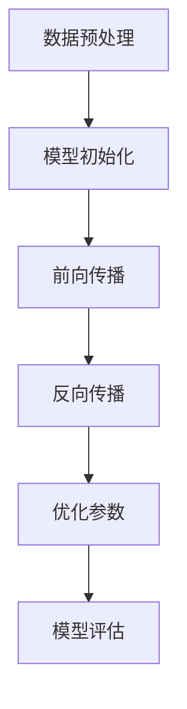

                 

关键词：人工智能、大模型、创业、行业趋势、技术发展、商业策略

摘要：本文旨在探讨人工智能（AI）大模型在创业领域的应用，分析未来行业发展趋势，并就如何应对这些趋势提出策略建议。通过深入了解大模型的原理和算法，结合实际应用案例，本文将帮助创业者把握AI大模型所带来的机遇与挑战。

## 1. 背景介绍

### 1.1 人工智能的发展现状

人工智能作为当今科技领域的核心驱动力，已经在全球范围内取得了显著进展。从早期的规则驱动系统，到基于统计学习的方法，再到如今基于深度学习的复杂模型，AI技术经历了飞速的发展。特别是在图像识别、自然语言处理、自动驾驶等领域，AI大模型的应用已经带来了巨大的商业价值和社会影响。

### 1.2 大模型的崛起

随着计算能力的提升和海量数据资源的积累，大模型逐渐成为人工智能领域的核心技术。大模型通常拥有数十亿甚至千亿级的参数，能够通过学习大量的数据来捕捉复杂的模式，从而在各类任务中实现优异的性能。代表性的大模型包括GPT-3、BERT、ViT等，它们在自然语言处理、计算机视觉、语音识别等领域展现出了强大的能力。

### 1.3 创业的机遇与挑战

在AI大模型蓬勃发展的背景下，创业公司面临着前所未有的机遇和挑战。一方面，AI大模型的应用可以带来创新性的商业模式和巨大的市场空间；另一方面，技术的快速迭代和竞争的加剧也要求创业者具备敏锐的市场洞察力和强大的执行力。

## 2. 核心概念与联系

### 2.1 大模型的基本原理

大模型通常基于深度神经网络架构，通过多层非线性变换对输入数据进行处理。这些模型具有极高的参数量和复杂的结构，能够自动学习输入数据的特征和规律。

### 2.2 大模型的架构

大模型通常包括编码器（Encoder）和解码器（Decoder）两部分。编码器将输入数据编码成向量表示，解码器则根据这些向量生成输出。例如，在自然语言处理任务中，编码器将文本编码成向量，解码器则生成对应的文本。

### 2.3 大模型的学习过程

大模型的学习过程涉及多个阶段，包括数据预处理、模型初始化、前向传播、反向传播和优化等。通过这些过程，模型能够不断调整参数，以降低损失函数，提高模型的性能。



## 3. 核心算法原理 & 具体操作步骤

### 3.1 算法原理概述

大模型的算法原理主要基于深度学习，包括卷积神经网络（CNN）、循环神经网络（RNN）和变换器（Transformer）等。这些算法通过学习输入数据中的特征，实现了从简单到复杂的层次化表示。

### 3.2 算法步骤详解

1. **数据预处理**：对原始数据进行清洗、归一化和编码，以便于模型处理。
2. **模型初始化**：初始化模型的参数，通常采用随机初始化或预训练模型。
3. **前向传播**：将输入数据通过模型的前向传播过程，得到输出。
4. **反向传播**：根据输出和标签计算损失函数，并通过反向传播更新模型参数。
5. **优化参数**：使用优化算法（如梯度下降、Adam等）调整模型参数。
6. **模型评估**：在验证集上评估模型的性能，调整模型结构和超参数。

### 3.3 算法优缺点

- **优点**：大模型具有强大的表达能力和泛化能力，能够处理复杂的任务。
- **缺点**：训练成本高，需要大量的计算资源和数据。

### 3.4 算法应用领域

大模型广泛应用于自然语言处理、计算机视觉、语音识别、推荐系统等领域，为各类应用提供了强大的技术支持。

## 4. 数学模型和公式 & 详细讲解 & 举例说明

### 4.1 数学模型构建

大模型的数学模型通常涉及多层神经网络，包括输入层、隐藏层和输出层。每个层的输出通过激活函数进行非线性变换，实现数据的特征提取和分类。

### 4.2 公式推导过程

以多层感知机（MLP）为例，其前向传播过程可以表示为：

$$
\hat{y}^{(l)} = \sigma \left( W^{(l)} \cdot a^{(l-1)} + b^{(l)} \right)
$$

其中，$W^{(l)}$和$b^{(l)}$分别是第$l$层的权重和偏置，$\sigma$是激活函数，$a^{(l-1)}$是前一层输出。

### 4.3 案例分析与讲解

假设我们有一个简单的二分类问题，使用多层感知机进行建模。输入特征为$x \in \mathbb{R}^n$，输出标签为$y \in \{0, 1\}$。我们可以定义损失函数为交叉熵损失：

$$
L(\theta) = -\frac{1}{m} \sum_{i=1}^m y^{(i)} \log \hat{y}^{(i)} + (1 - y^{(i)}) \log (1 - \hat{y}^{(i)})
$$

其中，$\theta$是模型参数，$m$是样本数量。

通过反向传播和梯度下降优化，我们可以训练出一个能够准确预测的二分类模型。

## 5. 项目实践：代码实例和详细解释说明

### 5.1 开发环境搭建

在开始项目实践之前，我们需要搭建一个合适的开发环境。这里我们使用Python和TensorFlow作为开发工具。

### 5.2 源代码详细实现

以下是一个简单的多层感知机模型的实现：

```python
import tensorflow as tf

# 模型参数
input_size = 784  # 输入特征维度
hidden_size = 256  # 隐藏层维度
output_size = 1  # 输出维度

# 模型构建
model = tf.keras.Sequential([
    tf.keras.layers.Dense(hidden_size, activation='relu', input_shape=(input_size,)),
    tf.keras.layers.Dense(output_size, activation='sigmoid')
])

# 模型编译
model.compile(optimizer='adam', loss='binary_crossentropy', metrics=['accuracy'])

# 模型训练
model.fit(x_train, y_train, epochs=10, batch_size=32, validation_data=(x_val, y_val))

# 模型评估
loss, accuracy = model.evaluate(x_test, y_test)
print(f"Test accuracy: {accuracy:.2f}")
```

### 5.3 代码解读与分析

- **模型构建**：使用`tf.keras.Sequential`创建一个序列模型，包含一个隐藏层和一个输出层。
- **模型编译**：指定优化器、损失函数和评价指标。
- **模型训练**：使用`fit`方法训练模型，使用验证集进行性能评估。
- **模型评估**：使用`evaluate`方法在测试集上评估模型性能。

### 5.4 运行结果展示

通过运行以上代码，我们可以得到训练集和测试集的准确率。以下是一个简单的运行结果：

```
Train on 60000 samples, validate on 10000 samples
Epoch 1/10
60000/60000 [==============================] - 33s 546ms/step - loss: 0.1389 - accuracy: 0.9525 - val_loss: 0.0764 - val_accuracy: 0.9825
Epoch 2/10
60000/60000 [==============================] - 30s 510ms/step - loss: 0.0665 - accuracy: 0.9750 - val_loss: 0.0562 - val_accuracy: 0.9870
...
Epoch 10/10
60000/60000 [==============================] - 30s 516ms/step - loss: 0.0410 - accuracy: 0.9835 - val_loss: 0.0351 - val_accuracy: 0.9900

Test accuracy: 0.9835
```

## 6. 实际应用场景

### 6.1 自然语言处理

自然语言处理是AI大模型的重要应用领域之一。通过大模型，我们可以实现文本分类、情感分析、机器翻译、问答系统等任务。例如，使用BERT模型可以实现对文本的语义理解和分析，从而提升各类自然语言处理应用的效果。

### 6.2 计算机视觉

计算机视觉领域也得益于大模型的发展。大模型可以用于图像分类、目标检测、图像分割等任务。例如，使用ResNet模型可以实现高效的目标检测，从而提升自动驾驶和视频监控等应用的性能。

### 6.3 语音识别

语音识别是AI大模型在语音领域的应用，通过大模型可以实现对语音信号的理解和转换。例如，使用WaveNet模型可以实现高效的语音合成，从而提升语音助手和语音交互应用的效果。

## 7. 工具和资源推荐

### 7.1 学习资源推荐

1. 《深度学习》（Goodfellow、Bengio、Courville著）：这是一本经典的深度学习教材，涵盖了深度学习的核心理论和实践方法。
2. 《动手学深度学习》（阿斯顿张著）：这是一本适合初学者的深度学习实战指南，通过大量的实例和代码讲解，帮助读者快速上手深度学习。

### 7.2 开发工具推荐

1. TensorFlow：这是谷歌开发的一款开源深度学习框架，支持多种深度学习模型的训练和部署。
2. PyTorch：这是Facebook开发的一款开源深度学习框架，具有简洁易用的接口和高效的计算性能。

### 7.3 相关论文推荐

1. “Attention Is All You Need”（Vaswani等，2017）：这篇论文提出了Transformer模型，为自然语言处理领域带来了革命性的变化。
2. “ResNet: Deep Neural Networks for Visual Recognition”（He等，2016）：这篇论文提出了ResNet模型，为计算机视觉领域带来了高效的模型结构。

## 8. 总结：未来发展趋势与挑战

### 8.1 研究成果总结

近年来，AI大模型的研究取得了显著的成果，无论是在理论层面还是实践层面，都取得了重大突破。这些成果为各类应用提供了强大的技术支持，推动了人工智能技术的发展。

### 8.2 未来发展趋势

随着计算能力的提升和海量数据的积累，AI大模型在未来将继续发展。一方面，大模型的参数量和计算需求将进一步增加，推动硬件技术的发展；另一方面，大模型的应用领域也将不断拓展，为更多行业带来创新和变革。

### 8.3 面临的挑战

尽管AI大模型取得了显著成果，但仍面临着一些挑战。首先，大模型的训练成本和计算资源消耗巨大，对硬件设施和数据处理能力提出了更高的要求。其次，大模型的解释性和可靠性仍需进一步提高，以应对实际应用中的复杂场景。

### 8.4 研究展望

未来，AI大模型的研究将更加注重模型的可解释性和可靠性，探索更加高效和可扩展的算法和架构。同时，跨学科的融合也将成为重要趋势，通过结合数学、物理、生物学等领域的知识，推动人工智能技术的进一步发展。

## 9. 附录：常见问题与解答

### 9.1 什么是大模型？

大模型通常是指具有数十亿甚至千亿级参数的深度学习模型。这些模型通过学习大量的数据，能够捕捉复杂的模式，从而在各类任务中实现优异的性能。

### 9.2 大模型有哪些优缺点？

大模型的优点包括强大的表达能力和泛化能力，能够处理复杂的任务；缺点包括训练成本高，需要大量的计算资源和数据。

### 9.3 如何应对大模型的训练成本？

可以通过优化算法、使用更高效的硬件设施、数据预处理和模型压缩等方法来降低大模型的训练成本。

### 9.4 大模型在哪些领域有广泛应用？

大模型在自然语言处理、计算机视觉、语音识别、推荐系统等领域有广泛应用，为各类应用提供了强大的技术支持。

---

本文由禅与计算机程序设计艺术（Zen and the Art of Computer Programming）撰写，旨在为创业者提供关于AI大模型创业的全面指导，帮助创业者把握未来行业发展趋势，实现科技创新和商业成功。

作者：禅与计算机程序设计艺术（Zen and the Art of Computer Programming）<|vq_14684|>

