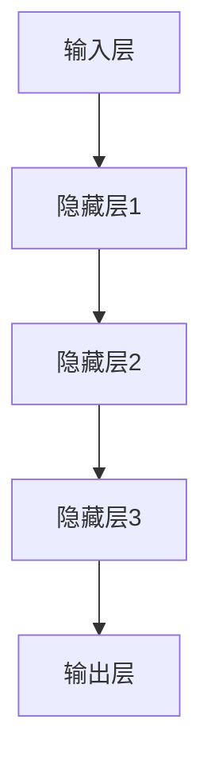

                 

关键词：AI大模型、创业、爆款应用、技术架构、数学模型、项目实践、工具资源

> 摘要：本文将深入探讨AI大模型创业的核心要素，从技术架构、数学模型到项目实践，全方位解析如何打造未来爆款应用。同时，我们将展望AI大模型技术的未来发展，以及创业者面临的机会与挑战。

## 1. 背景介绍

人工智能（AI）技术作为现代科技的重要推动力，已经在多个领域展现了其强大的变革能力。特别是近年来，随着深度学习和大规模数据处理技术的飞速发展，AI大模型（如GPT、BERT等）成为行业的热门话题。这些模型不仅在学术研究上取得了显著的成果，更在实际应用中展现出巨大的潜力。因此，越来越多的创业公司开始关注AI大模型技术，希望通过创新应用改变市场格局。

然而，AI大模型创业并非易事。从技术选型、模型训练到产品落地，每一个环节都充满了挑战。本文将结合实践经验，详细解析如何打造未来爆款AI应用，帮助创业者在竞争激烈的市场中脱颖而出。

## 2. 核心概念与联系

### 2.1 AI大模型原理

AI大模型是基于深度学习的神经网络架构，具有处理大规模数据和高维特征的能力。其核心在于多层神经元的非线性组合，通过反向传播算法不断调整权重，实现从数据中学习知识的目标。以下是一个简化的AI大模型架构流程图：



### 2.2 模型训练与优化

模型训练是AI大模型应用的关键环节。通过大量数据对模型进行迭代训练，可以提高模型的准确性和泛化能力。训练过程中，通常采用以下技术手段：

- **数据增强**：通过旋转、缩放、裁剪等操作，增加数据多样性，提高模型鲁棒性。
- **批量归一化**：在每个隐藏层对输入数据进行归一化处理，加快训练速度，提高模型稳定性。
- **优化算法**：如Adam、RMSprop等，通过调整学习率等参数，优化模型收敛速度。

### 2.3 模型评估与部署

模型评估是判断模型性能的重要环节。常见的评估指标包括准确率、召回率、F1值等。在实际应用中，还需考虑模型的实时性和计算资源消耗。

模型部署是将训练好的模型应用到实际业务场景的过程。常见的技术包括：

- **分布式训练与推理**：利用多台服务器进行模型训练和推理，提高计算效率。
- **模型压缩与量化**：通过剪枝、量化等技术，降低模型体积和计算复杂度。

## 3. 核心算法原理 & 具体操作步骤

### 3.1 算法原理概述

AI大模型的核心算法基于深度学习，主要包括以下几个步骤：

1. **数据预处理**：清洗、归一化、编码等操作，将原始数据转换为模型可处理的格式。
2. **模型架构设计**：选择合适的神经网络架构，如CNN、RNN、Transformer等。
3. **模型训练**：通过反向传播算法，调整模型参数，优化模型性能。
4. **模型评估**：使用验证集和测试集，评估模型准确性和泛化能力。
5. **模型部署**：将训练好的模型部署到生产环境，提供实时服务。

### 3.2 算法步骤详解

1. **数据预处理**

   数据预处理是模型训练的基础。具体步骤如下：

   - 数据清洗：去除异常值、缺失值等。
   - 数据归一化：将数据缩放到相同的范围，如[-1, 1]。
   - 数据编码：将分类数据转换为数字编码。

2. **模型架构设计**

   模型架构设计需要根据应用场景选择合适的神经网络结构。以下是一些常见的架构：

   - **卷积神经网络（CNN）**：适用于图像处理任务。
   - **循环神经网络（RNN）**：适用于序列数据处理任务。
   - **Transformer架构**：适用于自然语言处理任务。

3. **模型训练**

   模型训练是模型优化的关键步骤。具体步骤如下：

   - 初始化模型参数。
   - 前向传播：计算模型的输出。
   - 反向传播：计算损失函数，更新模型参数。
   - 调整学习率：使用学习率调整策略，如学习率衰减。

4. **模型评估**

   模型评估是判断模型性能的重要环节。具体步骤如下：

   - 使用验证集评估模型性能。
   - 调整模型参数，优化性能。
   - 使用测试集评估模型泛化能力。

5. **模型部署**

   模型部署是将训练好的模型应用到实际业务场景的过程。具体步骤如下：

   - 部署到服务器：将模型代码部署到生产环境。
   - 集成API：提供RESTful API接口，供其他系统调用。
   - 监控与维护：监控模型性能，及时更新模型。

### 3.3 算法优缺点

**优点：**

- **强大的数据处理能力**：AI大模型能够处理大规模、高维度的数据。
- **高度可扩展性**：通过分布式训练和推理，可以提高模型计算效率。
- **自适应学习**：模型能够自动调整参数，适应不同场景。

**缺点：**

- **计算资源消耗大**：训练大模型需要大量计算资源和时间。
- **数据依赖性强**：模型性能很大程度上取决于数据质量和数量。
- **解释性较弱**：深度学习模型通常具有较低的解释性。

### 3.4 算法应用领域

AI大模型在多个领域展现了其强大的应用潜力，包括：

- **自然语言处理**：如文本分类、机器翻译、情感分析等。
- **计算机视觉**：如图像识别、目标检测、图像生成等。
- **推荐系统**：如商品推荐、内容推荐等。
- **金融风控**：如信用评估、欺诈检测等。
- **医疗健康**：如疾病诊断、药物研发等。

## 4. 数学模型和公式 & 详细讲解 & 举例说明

### 4.1 数学模型构建

AI大模型的数学基础主要包括线性代数、微积分、概率论等。以下是一个简化的数学模型构建过程：

1. **输入层**：将原始数据输入模型。
2. **隐藏层**：通过神经元之间的加权连接，将输入数据进行非线性变换。
3. **输出层**：计算模型的预测结果。

### 4.2 公式推导过程

以下是一个简化的神经网络模型的公式推导过程：

1. **前向传播**：

   $$z^{(l)} = \sum_{j} w^{(l)}_{ji} a^{(l-1)}_j + b^{(l)}$$

   $$a^{(l)} = \sigma(z^{(l)})$$

   其中，$a^{(l)}$表示第$l$层的激活值，$w^{(l)}_{ji}$表示从第$l-1$层到第$l$层的权重，$b^{(l)}$表示第$l$层的偏置，$\sigma$表示激活函数。

2. **反向传播**：

   $$\delta^{(l)} = \frac{\partial C}{\partial a^{(l)}} \odot \sigma'(z^{(l)})$$

   $$\frac{\partial C}{\partial w^{(l)}_{ji}} = \delta^{(l)} a^{(l-1)}_j$$

   $$\frac{\partial C}{\partial b^{(l)}} = \delta^{(l)}$$

   其中，$\delta^{(l)}$表示第$l$层的误差项，$C$表示损失函数，$\odot$表示逐元素乘法。

### 4.3 案例分析与讲解

假设我们有一个二分类问题，目标是判断一个数据点是否属于正类。我们可以使用以下模型进行预测：

1. **数据预处理**：

   - 数据归一化：将数据缩放到[0, 1]范围。
   - 数据编码：将标签转换为二进制编码。

2. **模型设计**：

   - 输入层：1个神经元，接收数据点。
   - 隐藏层：10个神经元，使用ReLU激活函数。
   - 输出层：1个神经元，使用Sigmoid激活函数。

3. **模型训练**：

   - 使用均方误差（MSE）作为损失函数。
   - 使用Adam优化器，学习率为0.001。
   - 训练100个epoch，每个epoch使用200个样本。

4. **模型评估**：

   - 使用验证集评估模型性能，计算准确率、召回率、F1值等指标。

5. **模型部署**：

   - 将训练好的模型部署到生产环境，提供实时预测服务。

## 5. 项目实践：代码实例和详细解释说明

### 5.1 开发环境搭建

为了实现一个简单的AI大模型项目，我们需要搭建以下开发环境：

- Python 3.8及以上版本
- TensorFlow 2.5及以上版本
- PyTorch 1.8及以上版本

安装步骤如下：

```bash
pip install python==3.8
pip install tensorflow==2.5
pip install pytorch==1.8
```

### 5.2 源代码详细实现

以下是一个简单的AI大模型项目示例：

```python
import tensorflow as tf
from tensorflow.keras.models import Sequential
from tensorflow.keras.layers import Dense, Activation
from tensorflow.keras.optimizers import Adam
from tensorflow.keras.metrics import MeanSquaredError

# 数据预处理
# ...

# 模型设计
model = Sequential([
    Dense(10, activation='relu', input_shape=(input_shape)),
    Dense(1, activation='sigmoid')
])

# 模型编译
model.compile(optimizer=Adam(learning_rate=0.001),
              loss=MeanSquaredError(),
              metrics=['accuracy'])

# 模型训练
# ...

# 模型评估
# ...

# 模型部署
# ...
```

### 5.3 代码解读与分析

1. **数据预处理**：

   数据预处理是模型训练的基础，包括数据清洗、归一化、编码等操作。

2. **模型设计**：

   模型设计是构建神经网络的核心步骤，需要根据实际需求选择合适的模型架构。

3. **模型编译**：

   模型编译是准备模型进行训练的过程，包括设置优化器、损失函数和评估指标。

4. **模型训练**：

   模型训练是优化模型参数的过程，通过迭代计算损失函数，不断调整模型参数。

5. **模型评估**：

   模型评估是判断模型性能的过程，通过验证集和测试集，评估模型准确性和泛化能力。

6. **模型部署**：

   模型部署是将训练好的模型应用到实际业务场景的过程，提供实时预测服务。

## 6. 实际应用场景

AI大模型在多个实际应用场景中取得了显著的成果，以下是一些典型场景：

1. **自然语言处理**：

   - 文本分类：如新闻分类、情感分析等。
   - 机器翻译：如自动翻译、多语言交互等。
   - 对话系统：如智能客服、虚拟助手等。

2. **计算机视觉**：

   - 图像识别：如人脸识别、物体识别等。
   - 目标检测：如自动驾驶、安防监控等。
   - 图像生成：如图像超分辨率、风格迁移等。

3. **推荐系统**：

   - 商品推荐：如电商平台、在线购物等。
   - 内容推荐：如社交媒体、新闻推送等。

4. **金融风控**：

   - 信用评估：如信用评级、贷款审批等。
   - 欺诈检测：如信用卡欺诈、保险欺诈等。

5. **医疗健康**：

   - 疾病诊断：如影像诊断、基因分析等。
   - 药物研发：如分子模拟、药物筛选等。

## 7. 工具和资源推荐

为了更好地开展AI大模型创业，以下是一些建议的工具和资源：

1. **学习资源推荐**：

   - Coursera、edX等在线课程：如深度学习、机器学习等。
   - 书籍：《深度学习》、《Python深度学习》等。

2. **开发工具推荐**：

   - Jupyter Notebook：用于数据分析和模型训练。
   - TensorFlow、PyTorch：用于构建和训练AI模型。
   - Docker：用于容器化和部署AI应用。

3. **相关论文推荐**：

   - "Attention Is All You Need"：介绍Transformer架构。
   - "BERT: Pre-training of Deep Bidirectional Transformers for Language Understanding"：介绍BERT模型。

## 8. 总结：未来发展趋势与挑战

### 8.1 研究成果总结

近年来，AI大模型技术在多个领域取得了显著成果，包括：

- **自然语言处理**：如GPT、BERT等模型的提出，大幅提升了文本处理能力。
- **计算机视觉**：如GAN、StyleGAN等模型的提出，推动了图像生成和修复技术的发展。
- **推荐系统**：如基于深度学习的推荐算法，提高了推荐系统的准确性和用户体验。

### 8.2 未来发展趋势

未来，AI大模型技术将继续朝着以下几个方向发展：

- **模型压缩与优化**：通过剪枝、量化等技术，提高模型计算效率和可部署性。
- **多模态学习**：结合文本、图像、语音等多种数据类型，实现更强大的智能交互。
- **自主决策与推理**：通过强化学习和决策理论，实现更智能的自主决策。

### 8.3 面临的挑战

AI大模型创业面临以下挑战：

- **计算资源消耗**：大模型训练需要大量计算资源和时间，对硬件设施有较高要求。
- **数据隐私和安全**：大规模数据处理过程中，需要确保用户数据的安全和隐私。
- **模型解释性**：深度学习模型通常具有较低的解释性，需要开发更有效的解释方法。

### 8.4 研究展望

未来，AI大模型研究将继续深入探索以下领域：

- **神经符号主义**：结合符号推理和深度学习，实现更强大的智能系统。
- **可解释性AI**：开发可解释的AI模型，提高模型的可信度和接受度。
- **泛化能力**：提高模型在不同场景下的泛化能力，降低对数据的依赖。

## 9. 附录：常见问题与解答

### 9.1 问题1：如何选择合适的AI大模型架构？

解答：选择合适的AI大模型架构取决于应用场景和数据类型。以下是一些常见场景的推荐：

- **自然语言处理**：使用Transformer架构，如BERT、GPT等。
- **计算机视觉**：使用卷积神经网络，如ResNet、VGG等。
- **推荐系统**：使用基于矩阵分解的方法，如ALS、NCF等。

### 9.2 问题2：如何处理大规模数据？

解答：处理大规模数据的方法包括：

- **数据分片**：将数据分成多个批次进行训练。
- **分布式训练**：使用多台服务器进行模型训练，提高计算效率。
- **模型压缩**：通过剪枝、量化等技术，降低模型体积和计算复杂度。

### 9.3 问题3：如何确保数据隐私和安全？

解答：确保数据隐私和安全的方法包括：

- **数据加密**：使用加密技术保护数据传输和存储过程。
- **数据匿名化**：对敏感数据进行匿名化处理，降低隐私泄露风险。
- **隐私增强技术**：如差分隐私、同态加密等，提高数据处理过程中的隐私保护能力。

---

作者：禅与计算机程序设计艺术 / Zen and the Art of Computer Programming

