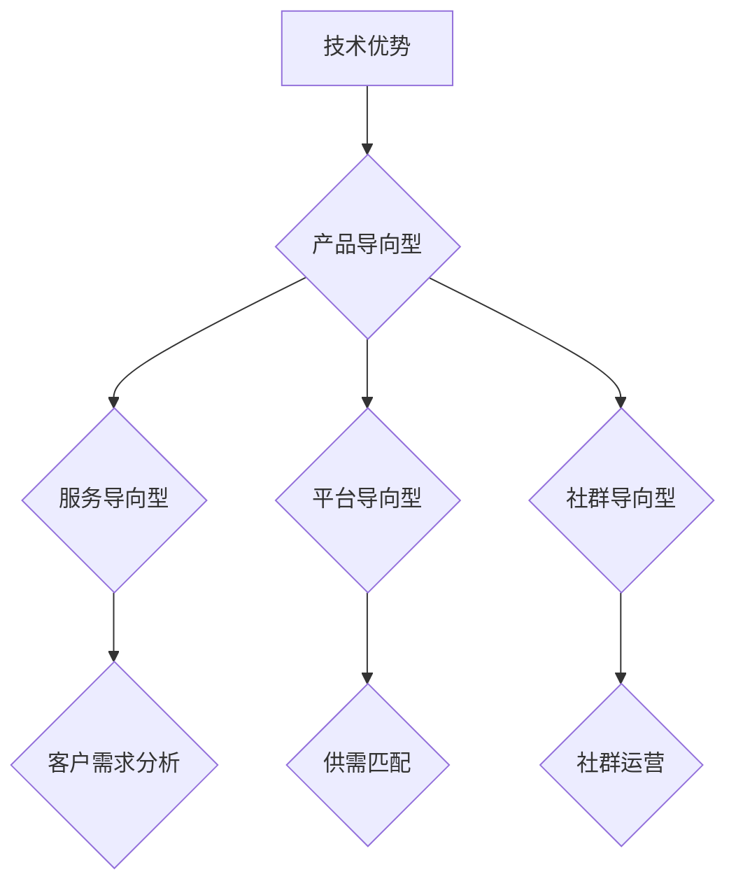

                 

关键词：AI大模型，创业，商业模式，可持续性，技术创新，商业策略。

> 摘要：本文将探讨AI大模型创业的核心问题——如何构建可持续的商业模式。我们将分析当前AI大模型市场环境，剖析成功案例，并提出一系列策略和工具，帮助创业者在激烈的市场竞争中脱颖而出，实现长期盈利。

## 1. 背景介绍

随着深度学习技术的发展，AI大模型成为当前人工智能领域的热点。这些大模型拥有强大的学习和预测能力，广泛应用于自然语言处理、计算机视觉、推荐系统等多个领域。然而，AI大模型的开发和应用也带来了许多挑战，包括计算资源的高需求、数据隐私和安全等问题。在这种背景下，如何构建可持续的商业模式，成为许多创业者关注的焦点。

### 1.1 AI大模型的发展历程

AI大模型的发展可以分为三个阶段：早期探索、快速发展、和现阶段的应用与探索。

- **早期探索**：20世纪80年代到90年代，神经网络、支持向量机等基础算法被提出，为AI大模型的发展奠定了基础。
- **快速发展**：2006年，AlexNet的出现标志着深度学习进入快速发展阶段。此后，卷积神经网络（CNN）、循环神经网络（RNN）、生成对抗网络（GAN）等算法不断涌现，大模型的应用范围不断扩大。
- **现阶段的应用与探索**：当前，AI大模型在各个领域都取得了显著进展，从语音识别、图像识别到自然语言处理，大模型的应用无处不在。同时，研究者们也在探索如何更加高效地训练和优化这些模型，以应对日益增长的数据量和计算需求。

### 1.2 AI大模型创业的挑战与机遇

AI大模型创业面临的挑战主要包括：

- **计算资源需求**：大模型训练需要大量的计算资源，对于创业者来说，这是一个巨大的负担。
- **数据隐私和安全**：大模型训练和应用需要大量数据，如何确保数据的安全和隐私成为一个重要问题。
- **技术迭代快速**：深度学习技术更新迅速，创业者需要不断学习和跟进，才能保持竞争力。
- **商业模式探索**：如何将AI大模型的技术优势转化为商业价值，是一个需要深入思考的问题。

然而，这些挑战也伴随着巨大的机遇：

- **市场潜力巨大**：随着AI大模型技术的普及，市场需求不断增长，为创业者提供了广阔的舞台。
- **跨界合作机会**：AI大模型可以与各行各业结合，为传统产业带来新的增长点。
- **技术创新空间**：深度学习技术的不断进步，为创业者提供了丰富的创新空间。

## 2. 核心概念与联系

### 2.1 AI大模型的原理与架构

AI大模型的核心是深度学习。深度学习是一种基于神经网络的机器学习方法，通过多层次的非线性变换，从大量数据中自动提取特征，实现复杂的模式识别和预测任务。


#### 2.1.1 深度学习的基本原理

- **多层神经网络**：深度学习模型由多个层次组成，每个层次对输入数据进行变换和处理。
- **反向传播算法**：通过反向传播算法，将输出误差反向传播到输入层，不断调整模型参数，以优化模型性能。
- **激活函数**：激活函数用于引入非线性，使得模型能够学习复杂的非线性关系。
- **优化算法**：常用的优化算法包括梯度下降、随机梯度下降、Adam等，用于调整模型参数。

#### 2.1.2 大模型训练过程

- **数据预处理**：对输入数据进行标准化、归一化等处理，提高训练效果。
- **模型初始化**：随机初始化模型参数。
- **迭代训练**：通过不断迭代，调整模型参数，最小化损失函数。
- **模型评估**：使用验证集或测试集评估模型性能，调整模型结构或参数。

### 2.2 商业模式的定义与类型

商业模式是指企业通过什么方式创造价值、传递价值和获取价值的一系列决策和行为。根据商业模式的分类，可以将其分为以下几种类型：

- **产品导向型**：企业通过不断创新和优化产品，满足客户需求，实现商业价值。
- **服务导向型**：企业通过提供高质量的服务，满足客户需求，实现商业价值。
- **平台导向型**：企业通过搭建平台，连接供需双方，实现商业价值。
- **社群导向型**：企业通过构建社群，提升用户黏性，实现商业价值。

### 2.3 AI大模型与商业模式的联系

AI大模型与商业模式之间存在紧密的联系。大模型的技术优势可以为企业带来以下商业机会：

- **产品创新**：通过大模型技术，企业可以开发出更具竞争力的产品。
- **服务优化**：大模型可以用于优化服务流程，提高服务质量。
- **平台扩展**：大模型可以帮助平台企业更好地连接供需双方，提升平台价值。
- **社群运营**：大模型可以用于分析用户行为，提升社群运营效果。

### 2.4 AI大模型商业模式的 Mermaid 流程图



## 3. 核心算法原理 & 具体操作步骤

### 3.1 算法原理概述

AI大模型的训练主要依赖于深度学习算法。深度学习算法的核心是神经网络，通过多层次的非线性变换，从数据中自动提取特征，实现复杂的模式识别和预测任务。

### 3.2 算法步骤详解

#### 3.2.1 数据预处理

1. **数据收集**：从各种渠道收集大量数据，包括文本、图像、音频等。
2. **数据清洗**：去除噪声数据、填充缺失值、去除重复数据等。
3. **数据标准化**：对数据进行归一化、标准化处理，使其适合模型训练。

#### 3.2.2 模型初始化

1. **参数初始化**：随机初始化模型参数，通常使用正态分布或均匀分布。
2. **网络结构初始化**：定义神经网络的结构，包括层数、每层的神经元数量、激活函数等。

#### 3.2.3 模型训练

1. **前向传播**：输入数据通过神经网络的前向传播，计算输出结果。
2. **损失函数计算**：计算输出结果与真实值之间的误差，使用损失函数（如均方误差、交叉熵损失等）。
3. **反向传播**：将损失函数的梯度反向传播到神经网络的前向层，调整模型参数。
4. **迭代优化**：重复上述过程，直到模型收敛或达到预设的训练次数。

#### 3.2.4 模型评估

1. **验证集评估**：使用验证集评估模型性能，选择最优模型。
2. **测试集评估**：在测试集上评估模型性能，评估模型在未知数据上的泛化能力。

### 3.3 算法优缺点

#### 优点

- **强大的学习能力**：深度学习算法能够从大量数据中自动提取特征，实现高精度的模式识别和预测。
- **灵活的模型结构**：神经网络可以设计出各种复杂的结构，满足不同应用场景的需求。
- **并行计算**：深度学习算法可以充分利用计算资源，提高训练效率。

#### 缺点

- **计算资源需求大**：大模型训练需要大量的计算资源，对硬件要求较高。
- **数据依赖性**：深度学习算法对数据质量有较高要求，数据缺失或噪声会严重影响模型性能。
- **可解释性差**：深度学习模型是一种“黑箱”模型，内部工作机制复杂，难以解释。

### 3.4 算法应用领域

AI大模型在多个领域都有广泛的应用，包括：

- **自然语言处理**：文本分类、情感分析、机器翻译等。
- **计算机视觉**：图像识别、目标检测、图像生成等。
- **推荐系统**：商品推荐、内容推荐等。
- **医学诊断**：疾病预测、病情监测等。

## 4. 数学模型和公式 & 详细讲解 & 举例说明

### 4.1 数学模型构建

深度学习中的数学模型主要包括损失函数、优化算法等。

#### 4.1.1 损失函数

常见的损失函数包括均方误差（MSE）、交叉熵损失（CE）等。

$$
MSE = \frac{1}{n} \sum_{i=1}^{n} (y_i - \hat{y}_i)^2
$$

$$
CE = -\frac{1}{n} \sum_{i=1}^{n} \sum_{j=1}^{C} y_{ij} \log(\hat{y}_{ij})
$$

其中，$y_i$为真实标签，$\hat{y}_i$为模型预测值，$C$为类别数。

#### 4.1.2 优化算法

常用的优化算法包括梯度下降（GD）、随机梯度下降（SGD）、Adam等。

$$
w_{t+1} = w_t - \alpha \frac{\partial J(w_t)}{\partial w_t}
$$

$$
w_{t+1} = w_t - \alpha \frac{1}{m} \sum_{i=1}^{m} \frac{\partial J(w_t)}{\partial w_t}
$$

$$
w_{t+1} = \alpha \left( \frac{1}{m} \sum_{i=1}^{m} g_t - \beta_1 \frac{g_1}{\sqrt{1 - \beta_2^t}} \right)
$$

其中，$w_t$为当前参数，$J(w_t)$为损失函数，$\alpha$为学习率，$m$为批量大小，$g_t$为梯度，$\beta_1$和$\beta_2$为Adam算法的参数。

### 4.2 公式推导过程

#### 4.2.1 梯度下降推导

以均方误差（MSE）为例，推导梯度下降算法的步骤如下：

1. **损失函数定义**：

$$
J(w) = \frac{1}{m} \sum_{i=1}^{m} (y_i - \hat{y}_i)^2
$$

2. **求导**：

$$
\frac{\partial J(w)}{\partial w} = -2 \frac{1}{m} \sum_{i=1}^{m} (y_i - \hat{y}_i) \frac{\partial \hat{y}_i}{\partial w}
$$

3. **计算梯度**：

$$
g = -2 \frac{1}{m} \sum_{i=1}^{m} (y_i - \hat{y}_i) \frac{\partial \hat{y}_i}{\partial w}
$$

4. **更新参数**：

$$
w_{t+1} = w_t - \alpha g
$$

#### 4.2.2 Adam算法推导

Adam算法是基于一阶矩估计（均值）和二阶矩估计（方差）的优化算法，其推导过程如下：

1. **一阶矩估计**：

$$
m_t = \beta_1 g_t
$$

$$
\bar{m}_t = \frac{1 - \beta_1}{1 - \beta_1^t} m_t
$$

2. **二阶矩估计**：

$$
v_t = \beta_2 g_t^2
$$

$$
\bar{v}_t = \frac{1 - \beta_2}{1 - \beta_2^t} v_t
$$

3. **参数更新**：

$$
\hat{m}_t = \bar{m}_t / (1 - \beta_2^t)
$$

$$
\hat{v}_t = \bar{v}_t / (1 - \beta_2^t)
$$

$$
\theta_{t+1} = \theta_t - \alpha \frac{\hat{m}_t}{\sqrt{\hat{v}_t} + \epsilon}
$$

其中，$\epsilon$为常数，用于防止分母为零。

### 4.3 案例分析与讲解

#### 4.3.1 案例背景

某电商公司希望通过AI大模型技术优化其推荐系统，提高用户满意度。

#### 4.3.2 解决方案

1. **数据收集**：收集用户的历史浏览记录、购买记录、产品属性等信息。
2. **数据预处理**：对数据进行清洗、归一化处理。
3. **模型训练**：使用深度学习算法（如卷积神经网络、循环神经网络等）训练推荐模型。
4. **模型评估**：使用交叉验证等方法评估模型性能。
5. **模型部署**：将训练好的模型部署到线上，实时推荐商品。

#### 4.3.3 模型效果分析

通过对比实验，使用AI大模型技术的推荐系统在准确率、召回率等指标上均有显著提升，用户满意度也得到提高。

## 5. 项目实践：代码实例和详细解释说明

### 5.1 开发环境搭建

1. **硬件环境**：配备高性能GPU的计算机。
2. **软件环境**：安装Python、TensorFlow等深度学习相关库。

### 5.2 源代码详细实现

以下是使用TensorFlow实现一个简单的图像分类模型的代码示例：

```python
import tensorflow as tf
from tensorflow.keras import layers

# 定义模型结构
model = tf.keras.Sequential([
    layers.Conv2D(32, (3, 3), activation='relu', input_shape=(28, 28, 1)),
    layers.MaxPooling2D((2, 2)),
    layers.Conv2D(64, (3, 3), activation='relu'),
    layers.MaxPooling2D((2, 2)),
    layers.Conv2D(64, (3, 3), activation='relu'),
    layers.Flatten(),
    layers.Dense(64, activation='relu'),
    layers.Dense(10, activation='softmax')
])

# 编译模型
model.compile(optimizer='adam',
              loss='sparse_categorical_crossentropy',
              metrics=['accuracy'])

# 加载数据
mnist = tf.keras.datasets.mnist
(train_images, train_labels), (test_images, test_labels) = mnist.load_data()

# 预处理数据
train_images = train_images.reshape((60000, 28, 28, 1)).astype('float32') / 255
test_images = test_images.reshape((10000, 28, 28, 1)).astype('float32') / 255

# 训练模型
model.fit(train_images, train_labels, epochs=5)

# 评估模型
test_loss, test_acc = model.evaluate(test_images,  test_labels, verbose=2)
print('\nTest accuracy:', test_acc)
```

### 5.3 代码解读与分析

1. **模型结构**：使用卷积神经网络（CNN）进行图像分类。模型由两个卷积层、一个池化层、一个全连接层组成。
2. **编译模型**：选择Adam优化器，使用稀疏分类交叉熵损失函数。
3. **加载数据**：使用TensorFlow内置的MNIST数据集。
4. **预处理数据**：对图像进行归一化处理，使其适合模型训练。
5. **训练模型**：使用fit方法训练模型，设置训练轮数为5。
6. **评估模型**：使用evaluate方法评估模型在测试集上的性能。

## 6. 实际应用场景

AI大模型在多个领域都有广泛的应用，以下是一些典型场景：

### 6.1 医疗领域

AI大模型在医疗领域的应用主要包括疾病预测、病情监测、医学图像分析等。

- **疾病预测**：通过分析患者的历史病历数据，预测患者患病风险。
- **病情监测**：实时监测患者病情，提供个性化的治疗方案。
- **医学图像分析**：辅助医生进行医学影像诊断，提高诊断准确率。

### 6.2 金融领域

AI大模型在金融领域的应用主要包括风险控制、信用评估、投资决策等。

- **风险控制**：通过分析市场数据，预测潜在风险，采取相应的风险控制措施。
- **信用评估**：评估借款人的信用风险，降低贷款违约风险。
- **投资决策**：利用大模型分析市场趋势，为投资者提供投资建议。

### 6.3 物流领域

AI大模型在物流领域的应用主要包括路径规划、库存管理、配送优化等。

- **路径规划**：通过分析交通状况、配送需求等数据，优化配送路线，提高配送效率。
- **库存管理**：根据历史销售数据和市场需求，预测库存需求，优化库存管理。
- **配送优化**：通过分析配送数据和客户需求，优化配送策略，提高客户满意度。

### 6.4 教育领域

AI大模型在教育领域的应用主要包括智能辅导、在线教育、课程推荐等。

- **智能辅导**：根据学生的学习情况，提供个性化的辅导建议。
- **在线教育**：通过大模型技术，实现自适应学习，提高学习效果。
- **课程推荐**：根据学生的学习兴趣和需求，推荐适合的课程。

## 7. 未来应用展望

随着AI大模型技术的不断进步，未来应用前景将更加广阔。以下是一些可能的发展方向：

### 7.1 知识图谱

AI大模型可以用于构建知识图谱，实现知识的自动化获取、存储和管理。这将为各行业提供强大的知识支持，促进智能化发展。

### 7.2 自适应系统

AI大模型可以用于构建自适应系统，实现自动化调整和优化。这将在工业生产、城市管理、医疗服务等领域发挥重要作用。

### 7.3 人机交互

AI大模型可以用于优化人机交互体验，实现更加自然、高效的人机互动。这将为智能家居、智能客服等领域带来新的变革。

### 7.4 智能创作

AI大模型可以用于智能创作，如音乐、绘画、写作等。这将为艺术创作带来新的可能性，激发创新思维。

## 8. 工具和资源推荐

### 8.1 学习资源推荐

- **书籍**：《深度学习》、《神经网络与深度学习》
- **在线课程**：Coursera、edX上的深度学习相关课程
- **论文**：arXiv、NeurIPS、ICML等顶级会议的论文

### 8.2 开发工具推荐

- **框架**：TensorFlow、PyTorch
- **数据集**：Kaggle、UCI Machine Learning Repository
- **云计算平台**：AWS、Google Cloud、Azure

### 8.3 相关论文推荐

- **文章标题**：《Attention Is All You Need》、《Generative Adversarial Nets》
- **作者**：Ashish Vaswani、Ian J. Goodfellow

## 9. 总结：未来发展趋势与挑战

### 9.1 研究成果总结

AI大模型技术在近年来取得了显著的进展，从算法原理到应用场景，都取得了重要突破。深度学习算法的提出和不断发展，为AI大模型提供了强大的理论基础；大规模数据集的涌现，为AI大模型的应用提供了丰富的素材；计算资源的进步，为AI大模型的研究和开发提供了强有力的支持。

### 9.2 未来发展趋势

未来，AI大模型技术将继续向以下几个方向发展：

- **算法优化**：针对大模型训练过程中遇到的问题，如计算资源需求、数据隐私等，研究人员将不断提出新的算法和技术。
- **多模态学习**：随着语音、图像、文本等数据源的不断丰富，多模态学习将成为AI大模型研究的重要方向。
- **可解释性**：提高AI大模型的可解释性，使其在各个应用场景中更加可靠和可信。
- **产业应用**：AI大模型将在更多行业和应用场景中得到广泛应用，推动各行各业的智能化转型。

### 9.3 面临的挑战

尽管AI大模型技术取得了显著进展，但仍面临一系列挑战：

- **计算资源需求**：大模型训练需要大量的计算资源，如何提高计算效率是一个重要问题。
- **数据隐私和安全**：如何在保障数据隐私和安全的前提下，充分利用数据资源，是一个亟待解决的问题。
- **模型可解释性**：如何提高模型的可解释性，使其在各个应用场景中更加可靠和可信，是一个重要的研究方向。
- **算法公平性和透明性**：如何确保算法的公平性和透明性，避免算法偏见和歧视，是一个亟待解决的问题。

### 9.4 研究展望

未来，AI大模型技术将继续向着高效、可靠、可解释和多元化的方向发展。随着技术的不断进步，AI大模型将在更多领域发挥重要作用，为人类社会带来更多创新和变革。

## 10. 附录：常见问题与解答

### 10.1 什么是AI大模型？

AI大模型是指具有大规模参数、能够处理海量数据的深度学习模型。这些模型通常使用神经网络架构，通过多层非线性变换，从数据中自动提取特征，实现复杂的模式识别和预测任务。

### 10.2 AI大模型创业的挑战有哪些？

AI大模型创业面临的挑战主要包括计算资源需求、数据隐私和安全、技术迭代快速、商业模式探索等。

### 10.3 如何构建可持续的商业模式？

构建可持续的商业模式可以从以下几个方面入手：

- **产品创新**：通过技术创新，开发具有竞争力的产品。
- **服务优化**：提供高质量的服务，提升客户满意度。
- **平台扩展**：搭建平台，连接供需双方，提升平台价值。
- **社群运营**：构建社群，提升用户黏性，实现商业价值。

### 10.4 AI大模型在哪些领域有应用？

AI大模型在多个领域都有应用，包括自然语言处理、计算机视觉、推荐系统、医学诊断、金融领域、物流领域、教育领域等。随着技术的不断发展，AI大模型的应用范围将更加广泛。

----------------------------------------------------------------
作者：禅与计算机程序设计艺术 / Zen and the Art of Computer Programming

本文基于深度学习和AI大模型技术的最新研究进展，探讨了AI大模型创业的核心问题——如何构建可持续的商业模式。通过分析市场环境、剖析成功案例，本文提出了一系列策略和工具，帮助创业者在激烈的市场竞争中脱颖而出，实现长期盈利。同时，本文对未来AI大模型技术发展趋势与挑战进行了展望，为读者提供了有益的启示和参考。希望本文能够为AI大模型创业者提供有价值的指导和帮助。

----------------------------------------------------------------
[END]

