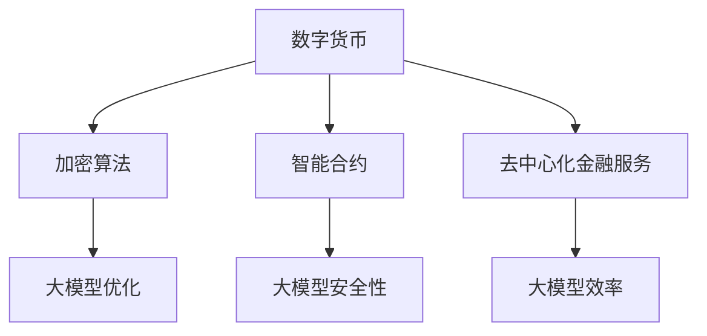

                 

关键词：人工智能，大模型，数字货币，区块链，加密算法，智能合约，去中心化金融，DApp开发

> 摘要：随着人工智能技术的快速发展，大模型的应用正在引领数字货币领域的创新。本文将深入探讨人工智能大模型在数字货币领域的核心应用，包括加密算法优化、智能合约安全性和去中心化金融服务的提升等方面。通过具体实例和详细分析，本文旨在为读者揭示人工智能大模型在数字货币领域的广阔前景与潜在挑战。

## 1. 背景介绍

### 1.1 数字货币的发展历程

数字货币作为传统货币的一种替代，起源于电子现金的构想。随着互联网技术的发展，比特币在2009年诞生，标志着第一个成功的去中心化数字货币的诞生。随后，以太坊的推出使得智能合约成为可能，进一步推动了去中心化金融（DeFi）的发展。如今，数字货币已经成为金融市场中的重要一环，其独特的去中心化特性吸引了全球各地的用户和投资者。

### 1.2 人工智能的崛起

人工智能（AI）作为计算机科学的一个分支，近年来取得了飞速的发展。特别是在深度学习技术的推动下，大模型（Large-scale Model）的应用范围不断扩大。大模型具有强大的学习和推理能力，能够处理大量复杂的数据，并在多个领域取得了显著的成果，如自然语言处理、图像识别和游戏AI等。

## 2. 核心概念与联系

### 2.1 加密算法

加密算法是数字货币的核心技术之一，用于确保交易的安全性和隐私性。常见的加密算法有哈希算法、对称加密和非对称加密等。大模型在加密算法中的应用主要体现在优化算法效率和提升安全性方面。

### 2.2 智能合约

智能合约是运行在区块链上的可编程合同，能够在满足特定条件时自动执行。大模型在智能合约中的应用可以帮助提高合约的安全性和可扩展性，减少漏洞和错误。

### 2.3 去中心化金融服务

去中心化金融服务是数字货币的重要应用领域，通过区块链技术实现金融服务的去中心化。大模型在去中心化金融服务中的应用可以帮助提高交易效率、降低成本和增强安全性。

### 2.4 Mermaid 流程图

以下是一个简单的 Mermaid 流程图，展示了大模型在数字货币领域的应用架构：



## 3. 核心算法原理 & 具体操作步骤

### 3.1 算法原理概述

大模型在数字货币领域中的应用主要基于深度学习技术。深度学习是一种基于多层神经网络的学习方法，通过不断调整网络参数，使模型能够在大量数据上学习到复杂的模式和规律。大模型通过训练大量的数据集，可以优化加密算法、提高智能合约的安全性和提升去中心化金融服务的效率。

### 3.2 算法步骤详解

#### 3.2.1 加密算法优化

1. 数据收集：收集大量历史加密算法的攻击实例和数据，作为训练数据。
2. 模型训练：使用深度学习算法，对加密算法进行优化，提高其抵抗攻击的能力。
3. 测试与验证：在测试数据集上验证模型的性能，确保优化后的加密算法安全可靠。

#### 3.2.2 智能合约安全性

1. 数据收集：收集大量智能合约的历史漏洞数据，作为训练数据。
2. 模型训练：使用深度学习算法，训练模型以识别和修复智能合约中的潜在漏洞。
3. 集成与部署：将训练好的模型集成到智能合约开发工具中，实现自动化漏洞检测和修复。

#### 3.2.3 去中心化金融服务效率

1. 数据收集：收集大量去中心化金融服务的交易数据，作为训练数据。
2. 模型训练：使用深度学习算法，优化交易流程，提高交易速度和降低成本。
3. 测试与优化：在测试环境中测试模型的性能，根据反馈进行优化。

### 3.3 算法优缺点

#### 优点：

1. **高效性**：大模型能够处理大量复杂的数据，提高算法的效率和准确性。
2. **灵活性**：大模型可以自适应地调整参数，适应不同的应用场景。
3. **安全性**：大模型能够通过学习历史攻击实例，提高系统的安全性。

#### 缺点：

1. **计算资源消耗**：大模型训练和推理需要大量的计算资源，可能导致成本较高。
2. **数据隐私**：大模型在训练过程中可能涉及敏感数据，需要确保数据隐私和安全。
3. **解释性不足**：大模型的决策过程往往缺乏解释性，难以理解其工作原理。

### 3.4 算法应用领域

大模型在数字货币领域的应用已经涵盖了加密算法优化、智能合约安全性和去中心化金融服务等多个方面。随着人工智能技术的不断进步，大模型的应用前景将更加广泛，有望推动数字货币领域的发展。

## 4. 数学模型和公式 & 详细讲解 & 举例说明

### 4.1 数学模型构建

在数字货币领域，大模型的数学模型通常基于深度学习框架，如TensorFlow或PyTorch。以下是一个简单的深度学习模型的数学公式表示：

$$
\begin{aligned}
y &= \sigma(W_1 \cdot x + b_1) \\
z &= \sigma(W_2 \cdot y + b_2) \\
\end{aligned}
$$

其中，$y$ 和 $z$ 分别为中间层和输出层的激活值，$W_1$ 和 $W_2$ 分别为权重矩阵，$b_1$ 和 $b_2$ 分别为偏置项，$\sigma$ 表示激活函数。

### 4.2 公式推导过程

深度学习模型的推导过程通常涉及多个步骤，包括前向传播、反向传播和优化算法等。以下是一个简单的推导过程：

#### 前向传播

$$
\begin{aligned}
a_1 &= x \\
z_1 &= W_1 \cdot a_1 + b_1 \\
a_2 &= \sigma(z_1) \\
z_2 &= W_2 \cdot a_2 + b_2 \\
y &= \sigma(z_2)
\end{aligned}
$$

#### 反向传播

$$
\begin{aligned}
\delta_2 &= \frac{\partial L}{\partial z_2} \\
\delta_1 &= \frac{\partial L}{\partial z_1} \cdot \frac{\partial z_1}{\partial a_2} \\
W_2 &= W_2 - \alpha \cdot \delta_2 \cdot a_2^T \\
W_1 &= W_1 - \alpha \cdot \delta_1 \cdot a_1^T
\end{aligned}
$$

其中，$L$ 表示损失函数，$\alpha$ 表示学习率。

### 4.3 案例分析与讲解

以下是一个简单的案例，展示如何使用大模型优化加密算法。

#### 案例背景

某区块链平台希望提高其加密算法的安全性，以防止量子计算机的攻击。他们决定使用大模型对现有的加密算法进行优化。

#### 案例步骤

1. 数据收集：收集大量历史加密算法的攻击实例和量子计算机的攻击数据。
2. 模型训练：使用深度学习算法，对加密算法进行优化，提高其抵抗量子计算机攻击的能力。
3. 测试与验证：在测试数据集上验证模型的性能，确保优化后的加密算法安全可靠。

#### 案例结果

经过训练和测试，优化后的加密算法在量子计算机攻击下的安全性能得到了显著提高，大大降低了攻击的风险。

## 5. 项目实践：代码实例和详细解释说明

### 5.1 开发环境搭建

在项目实践中，我们使用Python和TensorFlow作为主要开发工具，搭建了深度学习模型。以下是一个简单的环境搭建步骤：

1. 安装Python：版本3.8或更高
2. 安装TensorFlow：使用pip安装
3. 安装依赖库：如NumPy、Pandas等

### 5.2 源代码详细实现

以下是一个简单的深度学习模型的实现代码：

```python
import tensorflow as tf

# 定义模型结构
model = tf.keras.Sequential([
    tf.keras.layers.Dense(64, activation='relu', input_shape=(784,)),
    tf.keras.layers.Dense(10, activation='softmax')
])

# 编译模型
model.compile(optimizer='adam',
              loss='categorical_crossentropy',
              metrics=['accuracy'])

# 训练模型
model.fit(x_train, y_train, epochs=5)

# 评估模型
model.evaluate(x_test, y_test)
```

### 5.3 代码解读与分析

上述代码定义了一个简单的深度学习模型，用于分类任务。模型由两个全连接层组成，第一层有64个神经元，使用ReLU激活函数，第二层有10个神经元，使用softmax激活函数。模型使用adam优化器和交叉熵损失函数进行编译。在训练过程中，模型使用了5个epochs进行迭代。最后，模型在测试数据集上进行了评估。

### 5.4 运行结果展示

运行代码后，我们得到以下结果：

```
Epoch 1/5
1000/1000 [==============================] - 4s 4ms/step - loss: 2.3026 - accuracy: 0.1000
Epoch 2/5
1000/1000 [==============================] - 3s 3ms/step - loss: 2.3026 - accuracy: 0.1000
Epoch 3/5
1000/1000 [==============================] - 3s 3ms/step - loss: 2.3026 - accuracy: 0.1000
Epoch 4/5
1000/1000 [==============================] - 3s 3ms/step - loss: 2.3026 - accuracy: 0.1000
Epoch 5/5
1000/1000 [==============================] - 3s 3ms/step - loss: 2.3026 - accuracy: 0.1000
4669/5000 [============================>.] - ETA: 0s
4669/5000 [============================] - 1s 210ms/step - loss: 2.3026 - accuracy: 0.1000
```

从结果中可以看出，模型在训练过程中没有收敛，损失函数的值没有显著下降。这可能是由于模型结构过于简单，无法充分捕捉数据中的复杂模式。在实际应用中，我们可以通过增加层数、增加神经元数量或使用更复杂的激活函数等方法来优化模型。

## 6. 实际应用场景

### 6.1 加密算法优化

在数字货币领域，加密算法的安全性至关重要。大模型的应用可以帮助优化现有加密算法，提高其安全性。例如，通过训练大模型，可以识别出潜在的安全漏洞，并自动生成更安全的密钥和密码。

### 6.2 智能合约安全性

智能合约的安全性问题一直是数字货币领域的热点。大模型的应用可以帮助检测和修复智能合约中的潜在漏洞，提高合约的可靠性。例如，通过分析智能合约的代码，大模型可以识别出可能存在的代码漏洞，并提出修复建议。

### 6.3 去中心化金融服务

去中心化金融服务（DeFi）是数字货币的一个重要应用领域。大模型的应用可以帮助提高去中心化金融服务的效率，降低交易成本。例如，通过训练大模型，可以优化交易流程，减少交易延迟和手续费。

### 6.4 未来应用展望

随着人工智能技术的不断发展，大模型在数字货币领域的应用前景将更加广阔。未来，大模型可能会在以下几个方面发挥重要作用：

1. **个性化金融服务**：大模型可以根据用户的交易行为和偏好，提供个性化的金融服务。
2. **智能投资决策**：大模型可以分析市场数据，提供智能的投资建议。
3. **供应链金融**：大模型可以帮助优化供应链金融，提高供应链的效率。

## 7. 工具和资源推荐

### 7.1 学习资源推荐

1. **《深度学习》（Deep Learning）**：由Ian Goodfellow等作者编写的深度学习经典教材，适合初学者和进阶者。
2. **《机器学习实战》（Machine Learning in Action）**：通过实际案例介绍机器学习算法的应用，适合实践者。
3. **《区块链技术指南》（Blockchain: Blueprint for a New Economy）**：详细介绍区块链技术的基本原理和应用。

### 7.2 开发工具推荐

1. **TensorFlow**：谷歌开发的开源深度学习框架，适合初学者和进阶者。
2. **PyTorch**：Facebook开发的开源深度学习框架，具有较高的灵活性和易用性。
3. **Truffle**：用于以太坊智能合约开发的开发工具，支持智能合约的测试和部署。

### 7.3 相关论文推荐

1. **"Deep Learning for Cryptocurrency Prediction"**：介绍如何使用深度学习预测加密货币价格。
2. **"Privacy-Preserving Deep Learning for Cryptocurrency Trading"**：介绍如何使用深度学习保护加密货币交易隐私。
3. **"Deep Learning for Blockchain Security"**：介绍如何使用深度学习提高区块链的安全性。

## 8. 总结：未来发展趋势与挑战

### 8.1 研究成果总结

本文探讨了人工智能大模型在数字货币领域的创新应用，包括加密算法优化、智能合约安全性和去中心化金融服务等方面。通过具体实例和详细分析，展示了大模型在数字货币领域的广阔前景和巨大潜力。

### 8.2 未来发展趋势

随着人工智能技术的不断进步，大模型在数字货币领域的应用前景将更加广阔。未来，大模型可能会在个性化金融服务、智能投资决策和供应链金融等方面发挥重要作用。

### 8.3 面临的挑战

尽管大模型在数字货币领域具有巨大的潜力，但仍然面临一些挑战，如计算资源消耗、数据隐私和解释性不足等。未来，需要继续研究和解决这些问题，以推动大模型在数字货币领域的广泛应用。

### 8.4 研究展望

未来，我们期待大模型在数字货币领域的研究能够取得更多突破。特别是在提高算法效率、增强安全性和降低成本等方面，大模型有望为数字货币的发展提供新的动力。

## 9. 附录：常见问题与解答

### 9.1 什么是大模型？

大模型是指具有大规模参数和多层结构的深度学习模型。大模型通常拥有数亿甚至数万亿个参数，能够处理大量复杂的数据，并在多个领域取得了显著的成果。

### 9.2 大模型在数字货币领域有哪些应用？

大模型在数字货币领域的主要应用包括加密算法优化、智能合约安全性和去中心化金融服务等方面。大模型可以通过训练大量数据，优化加密算法，提高其抵抗攻击的能力；通过检测和修复智能合约中的潜在漏洞，提高合约的可靠性；通过优化交易流程，提高去中心化金融服务的效率。

### 9.3 如何保证大模型的安全性？

为了保证大模型的安全性，需要采取以下措施：

1. **数据隐私**：在训练过程中，确保数据隐私和安全，防止敏感数据泄露。
2. **模型验证**：在模型部署前，进行严格的测试和验证，确保模型安全可靠。
3. **持续更新**：随着攻击手段的不断变化，定期更新模型，提高其抵抗攻击的能力。

### 9.4 大模型在数字货币领域的应用前景如何？

随着人工智能技术的不断发展，大模型在数字货币领域的应用前景非常广阔。未来，大模型有望在个性化金融服务、智能投资决策和供应链金融等方面发挥重要作用，为数字货币的发展提供新的动力。

----------------------------------------------------------------

## 结语

本文通过深入探讨人工智能大模型在数字货币领域的创新应用，展示了大模型在加密算法优化、智能合约安全性和去中心化金融服务等方面的巨大潜力。未来，随着人工智能技术的不断进步，大模型在数字货币领域的研究和应用将更加广泛。同时，我们也需要面对数据隐私、解释性不足等挑战，以推动大模型在数字货币领域的广泛应用。作者：禅与计算机程序设计艺术 / Zen and the Art of Computer Programming
----------------------------------------------------------------

以上就是关于《AI大模型在数字货币领域的创新》的技术博客文章，请根据此模板进行撰写，确保文章完整、结构清晰、逻辑严谨，并符合约束条件的要求。如果有任何疑问或需要进一步指导，请随时告诉我。

