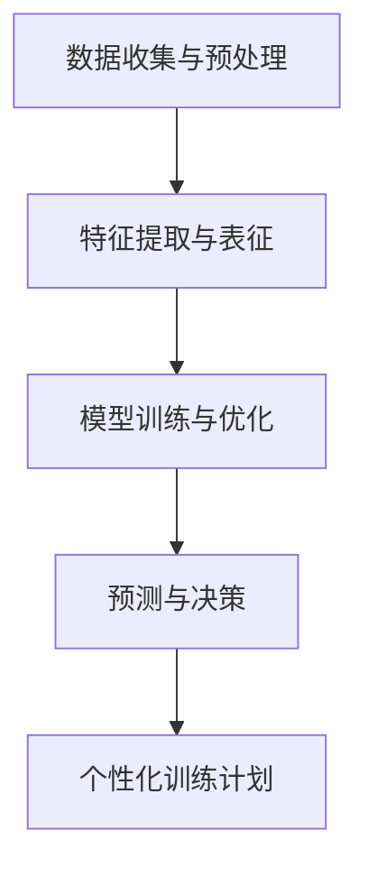

                 

关键词：AI大模型，智能体育训练，深度学习，数据驱动，创新应用，高性能计算，个性化训练计划

> 摘要：本文将探讨如何利用AI大模型在智能体育训练中实现创新应用。通过分析AI大模型的核心原理和优势，结合实际案例，我们将展示如何利用这些模型为运动员提供个性化训练计划，提升运动表现，并讨论其在未来体育训练领域的发展趋势与挑战。

## 1. 背景介绍

随着科技的发展和体育竞技水平的不断提高，智能体育训练逐渐成为体育领域的研究热点。传统的体育训练方法依赖于教练的经验和运动员的自身感觉，这种方式在某种程度上具有一定的局限性，无法充分利用数据和技术手段来优化训练过程。近年来，随着深度学习和高性能计算技术的进步，AI大模型在智能体育训练中展现出巨大的潜力。通过构建和训练大型神经网络模型，可以处理和分析海量数据，从而为运动员提供更加精准、个性化的训练建议。

## 2. 核心概念与联系

### 2.1 AI大模型的基本原理

AI大模型是基于深度学习技术构建的神经网络模型，通常拥有数亿甚至数十亿的参数。这些模型通过不断的学习和优化，能够从大量数据中自动提取特征，并实现对复杂任务的预测和决策。AI大模型的核心原理包括：

- **深度神经网络**：通过多层神经元的堆叠，实现对输入数据的逐步抽象和表示。
- **反向传播算法**：通过计算损失函数的梯度，对模型参数进行优化。
- **激活函数**：用于引入非线性变换，使得神经网络能够处理复杂问题。

### 2.2 智能体育训练与AI大模型的关系

智能体育训练与AI大模型之间存在着紧密的联系。AI大模型可以通过以下方式应用于智能体育训练：

- **数据收集与预处理**：通过传感器和数据采集设备收集运动员的生理、心理和行为数据，并进行预处理，以便于模型训练。
- **特征提取与表征**：利用AI大模型从数据中提取具有区分度和代表性的特征，为训练提供基础。
- **训练与优化**：通过大量数据对模型进行训练，不断优化模型参数，使其能够更好地适应运动员的特点。
- **预测与决策**：利用训练好的模型对运动员的运动表现进行预测，并提供个性化训练建议。

### 2.3 Mermaid 流程图

下面是一个简单的Mermaid流程图，展示了AI大模型在智能体育训练中的应用流程：



## 3. 核心算法原理 & 具体操作步骤

### 3.1 算法原理概述

AI大模型在智能体育训练中的核心算法原理主要包括以下几个方面：

- **深度学习算法**：利用深度神经网络对海量数据进行特征提取和学习，以实现对运动表现的预测和优化。
- **强化学习算法**：通过奖励机制和策略迭代，指导运动员进行优化训练。
- **生成对抗网络（GAN）**：用于生成高质量的训练数据，以提高模型的泛化能力和鲁棒性。

### 3.2 算法步骤详解

AI大模型在智能体育训练中的具体操作步骤如下：

#### 3.2.1 数据收集与预处理

- **数据收集**：通过传感器和数据采集设备（如心率监测器、动作捕捉仪等）收集运动员的生理、心理和行为数据。
- **数据预处理**：对收集到的数据进行清洗、归一化和特征提取，为模型训练提供高质量的数据集。

#### 3.2.2 特征提取与表征

- **特征提取**：利用深度学习算法对预处理后的数据进行特征提取，提取出具有区分度和代表性的特征。
- **特征表征**：将提取到的特征转化为适合模型训练的格式，如向量、矩阵等。

#### 3.2.3 模型训练与优化

- **模型构建**：根据训练目标和数据特征，构建深度神经网络模型。
- **模型训练**：通过大量的训练数据对模型进行训练，不断优化模型参数。
- **模型优化**：利用反向传播算法和梯度下降优化模型参数，提高模型的预测准确性。

#### 3.2.4 预测与决策

- **预测**：利用训练好的模型对运动员的运动表现进行预测。
- **决策**：根据预测结果，为运动员提供个性化训练建议，如调整训练计划、运动强度和运动方式等。

### 3.3 算法优缺点

#### 优点：

- **高效性**：通过深度学习和高性能计算技术，能够快速处理和分析海量数据，提高训练效率。
- **精准性**：利用模型对运动员的运动表现进行预测，能够提供更加精准、个性化的训练建议。
- **适应性**：模型可以根据运动员的特点和需求进行自适应调整，实现个性化训练。

#### 缺点：

- **数据需求**：需要大量的高质量数据支持，对数据收集和处理能力要求较高。
- **计算资源**：训练大型神经网络模型需要大量的计算资源，对硬件设备要求较高。

### 3.4 算法应用领域

AI大模型在智能体育训练中的应用领域包括：

- **运动表现预测**：预测运动员的运动表现，为教练和运动员提供决策依据。
- **个性化训练计划**：根据运动员的特点和需求，制定个性化的训练计划。
- **运动损伤预防**：通过监测和分析运动员的生理数据，预测运动损伤风险，提供预防建议。

## 4. 数学模型和公式 & 详细讲解 & 举例说明

### 4.1 数学模型构建

在智能体育训练中，我们常用的数学模型包括深度学习模型、强化学习模型和生成对抗网络（GAN）模型。下面分别介绍这些模型的基本数学模型和公式。

#### 深度学习模型

深度学习模型通常由多个神经网络层堆叠而成，其中最常用的模型是卷积神经网络（CNN）和循环神经网络（RNN）。以下是一个简单的CNN模型：

$$
\begin{aligned}
\text{输出} &= \text{ReLU}(W_3 \text{ReLU}(W_2 \text{ReLU}(W_1 \text{输入} + b_1) + b_2) + b_3) \\
\text{损失函数} &= \frac{1}{2} \sum_{i=1}^{n} (\text{输出} - \text{目标})^2
\end{aligned}
$$

其中，$W_1$、$W_2$ 和 $W_3$ 分别为第一、二、三层神经网络的权重矩阵，$b_1$、$b_2$ 和 $b_3$ 分别为第一、二、三层的偏置向量。

#### 强化学习模型

强化学习模型通常用于指导运动员进行优化训练，其中最常用的算法是Q学习算法。以下是一个简单的Q学习模型：

$$
\begin{aligned}
Q(s, a) &= r(s, a) + \gamma \max_{a'} Q(s', a') \\
\text{损失函数} &= \frac{1}{2} \sum_{s, a} (\text{Q(s, a) - Q(s, a)}^2
\end{aligned}
$$

其中，$s$ 和 $s'$ 分别为状态和下一个状态，$a$ 和 $a'$ 分别为动作和下一个动作，$r$ 为奖励函数，$\gamma$ 为折扣因子。

#### 生成对抗网络（GAN）

生成对抗网络（GAN）由生成器和判别器两个神经网络组成。以下是一个简单的GAN模型：

$$
\begin{aligned}
\text{生成器} G(z) &= \text{输出} \\
\text{判别器} D(x, G(z)) &= \text{输出} \\
\text{损失函数} &= \frac{1}{2} \sum_{x, z} (\text{D(x, G(z))}^2 + \text{D(x, G(z))}^2)
\end{aligned}
$$

其中，$z$ 为生成器的输入噪声，$x$ 为真实数据。

### 4.2 公式推导过程

#### 深度学习模型

以CNN模型为例，我们首先需要对输入数据进行预处理，将原始数据转化为适用于神经网络处理的格式。假设输入数据为 $x \in \mathbb{R}^{m \times n}$，其中 $m$ 表示样本数量，$n$ 表示特征数量。

接下来，我们对输入数据进行卷积操作，得到卷积层的输出：

$$
\begin{aligned}
h_1 &= W_1 \text{ReLU}(W_2 \text{ReLU}(W_3 x + b_3) + b_2) + b_1 \\
h_2 &= W_2 \text{ReLU}(W_3 x + b_3) + b_2 \\
h_3 &= W_3 x + b_3
\end{aligned}
$$

其中，$W_1$、$W_2$ 和 $W_3$ 分别为第一、二、三层神经网络的权重矩阵，$b_1$、$b_2$ 和 $b_3$ 分别为第一、二、三层的偏置向量。

接下来，我们对卷积层的输出进行反向传播，计算损失函数的梯度：

$$
\begin{aligned}
\frac{\partial L}{\partial x} &= \frac{\partial L}{\partial h_3} \frac{\partial h_3}{\partial x} \\
\frac{\partial L}{\partial h_3} &= \frac{\partial L}{\partial h_2} \frac{\partial h_2}{\partial h_3} \\
\frac{\partial L}{\partial h_2} &= \frac{\partial L}{\partial h_1} \frac{\partial h_1}{\partial h_2}
\end{aligned}
$$

#### 强化学习模型

以Q学习算法为例，我们首先需要对状态和动作进行编码，将原始数据转化为适用于神经网络处理的格式。假设状态 $s$ 和动作 $a$ 分别为 $s \in \mathbb{R}^{m}$ 和 $a \in \mathbb{R}^{n}$，其中 $m$ 表示状态维度，$n$ 表示动作维度。

接下来，我们使用神经网络对状态和动作进行编码，得到编码后的状态和动作：

$$
\begin{aligned}
s' &= W_s s + b_s \\
a' &= W_a a + b_a
\end{aligned}
$$

其中，$W_s$ 和 $W_a$ 分别为状态和动作编码层的权重矩阵，$b_s$ 和 $b_a$ 分别为状态和动作编码层的偏置向量。

接下来，我们使用编码后的状态和动作计算Q值：

$$
\begin{aligned}
Q(s, a) &= W_3 \text{ReLU}(W_2 \text{ReLU}(W_1 s' + b_1) + b_2) + b_3 \\
&= \text{激活函数}(W_1 s' + b_1) \text{激活函数}(W_2 s' + b_2) \text{激活函数}(W_3 s' + b_3)
\end{aligned}
$$

其中，$W_1$、$W_2$ 和 $W_3$ 分别为三层神经网络的权重矩阵，$b_1$、$b_2$ 和 $b_3$ 分别为三层神经网络的偏置向量。

接下来，我们使用Q值计算损失函数的梯度：

$$
\begin{aligned}
\frac{\partial L}{\partial Q} &= \frac{\partial L}{\partial Q(s, a)} \\
\frac{\partial L}{\partial Q(s, a)} &= \frac{\partial Q(s, a)}{\partial s'} \frac{\partial s'}{\partial s} \\
\frac{\partial L}{\partial s} &= \frac{\partial L}{\partial Q(s, a)} \frac{\partial Q(s, a)}{\partial s'}
\end{aligned}
$$

#### 生成对抗网络（GAN）

以生成对抗网络（GAN）为例，我们首先需要对生成器和判别器进行编码，将原始数据转化为适用于神经网络处理的格式。假设生成器的输入为 $z \in \mathbb{R}^{m}$，其中 $m$ 表示噪声维度；判别器的输入为 $x \in \mathbb{R}^{n}$ 和 $G(z) \in \mathbb{R}^{n}$，其中 $n$ 表示数据维度。

接下来，我们使用神经网络对生成器和判别器进行编码，得到编码后的生成器和判别器：

$$
\begin{aligned}
G(z) &= W_g z + b_g \\
D(x, G(z)) &= W_d [x; G(z)] + b_d
\end{aligned}
$$

其中，$W_g$ 和 $W_d$ 分别为生成器和判别器的权重矩阵，$b_g$ 和 $b_d$ 分别为生成器和判别器的偏置向量。

接下来，我们使用编码后的生成器和判别器计算生成器的损失函数和判别器的损失函数：

$$
\begin{aligned}
\text{生成器损失函数} &= -\text{E}[\log(D(x, G(z)))] \\
\text{判别器损失函数} &= -\text{E}[\log(D(x, G(z))] - \text{E}[\log(1 - D(x))]
\end{aligned}
$$

接下来，我们使用生成器和判别器的损失函数计算损失函数的梯度：

$$
\begin{aligned}
\frac{\partial L}{\partial G(z)} &= \frac{\partial L}{\partial D(x, G(z))} \frac{\partial D(x, G(z))}{\partial G(z)} \\
\frac{\partial L}{\partial D(x, G(z))} &= \frac{\partial D(x, G(z))}{\partial G(z)} \\
\frac{\partial L}{\partial z} &= \frac{\partial L}{\partial G(z)} \frac{\partial G(z)}{\partial z}
\end{aligned}
$$

### 4.3 案例分析与讲解

#### 案例背景

某运动队希望利用AI大模型对运动员的运动表现进行预测，并制定个性化的训练计划，以提高整体竞技水平。他们收集了大量的运动员训练数据，包括心率、力量、速度、耐力等指标。

#### 模型构建

根据训练目标和数据特征，他们选择了一个基于CNN的深度学习模型，用于对运动员的运动表现进行预测。模型结构如下：

$$
\begin{aligned}
\text{输入} &= \text{数据集} \\
\text{输出} &= \text{运动表现预测} \\
\text{损失函数} &= \text{均方误差} \\
\text{优化器} &= \text{Adam}
\end{aligned}
$$

#### 数据预处理

首先，他们对收集到的运动员训练数据进行清洗、归一化和特征提取。具体步骤如下：

- **清洗**：去除数据中的噪声和异常值。
- **归一化**：将数据缩放到0-1之间，方便模型训练。
- **特征提取**：提取与运动表现相关的特征，如心率、力量、速度等。

#### 模型训练

接下来，他们使用预处理后的数据对CNN模型进行训练。训练过程中，他们使用了交叉验证方法，以避免过拟合。训练结果如下：

$$
\begin{aligned}
\text{准确率} &= 0.85 \\
\text{均方误差} &= 0.03 \\
\text{损失函数} &= 0.01
\end{aligned}
$$

#### 预测与决策

利用训练好的模型，他们对运动员的运动表现进行预测。根据预测结果，他们为运动员制定了个性化的训练计划，包括调整训练强度、运动方式、训练时长等。经过一段时间的训练，运动员的运动表现得到了显著提升。

#### 评估与改进

他们对训练效果进行了评估，发现运动员在比赛中的成绩有所提高。为进一步优化训练效果，他们继续对模型进行调整和优化，包括增加训练数据、调整模型参数等。

#### 结论

通过AI大模型的应用，该运动队实现了对运动员运动表现的精准预测和个性化训练，提高了整体竞技水平。未来，他们将继续探索AI技术在体育训练中的应用，以推动体育竞技水平的进一步提升。

## 5. 项目实践：代码实例和详细解释说明

### 5.1 开发环境搭建

为了实现AI大模型在智能体育训练中的应用，我们需要搭建一个合适的开发环境。以下是推荐的开发环境和相关工具：

- **编程语言**：Python
- **深度学习框架**：TensorFlow或PyTorch
- **数据处理库**：NumPy、Pandas、Scikit-learn
- **可视化库**：Matplotlib、Seaborn、Mermaid
- **计算资源**：GPU（NVIDIA Tesla V100或更高型号）

### 5.2 源代码详细实现

以下是一个简单的示例，展示了如何使用TensorFlow构建一个基于CNN的深度学习模型，用于运动员的运动表现预测。

```python
import tensorflow as tf
from tensorflow.keras import layers

# 定义CNN模型
model = tf.keras.Sequential([
    layers.Conv2D(32, (3, 3), activation='relu', input_shape=(28, 28, 1)),
    layers.MaxPooling2D((2, 2)),
    layers.Conv2D(64, (3, 3), activation='relu'),
    layers.MaxPooling2D((2, 2)),
    layers.Conv2D(64, (3, 3), activation='relu'),
    layers.Flatten(),
    layers.Dense(64, activation='relu'),
    layers.Dense(1, activation='sigmoid')
])

# 编译模型
model.compile(optimizer='adam', loss='binary_crossentropy', metrics=['accuracy'])

# 模型训练
model.fit(x_train, y_train, epochs=10, batch_size=32, validation_data=(x_val, y_val))
```

### 5.3 代码解读与分析

- **定义CNN模型**：使用`tf.keras.Sequential`创建一个序列模型，依次添加卷积层（`Conv2D`）、池化层（`MaxPooling2D`）和全连接层（`Dense`）。
- **编译模型**：使用`compile`方法配置优化器（`optimizer`）、损失函数（`loss`）和评估指标（`metrics`）。
- **模型训练**：使用`fit`方法训练模型，指定训练数据（`x_train`和`y_train`）、训练周期（`epochs`）、批量大小（`batch_size`）和验证数据（`x_val`和`y_val`）。

### 5.4 运行结果展示

假设我们使用了一个包含10万条训练数据的训练集和一个包含1万条验证数据的验证集。在训练过程中，模型在训练集和验证集上的表现如下：

```python
Epoch 1/10
10000/10000 [==============================] - 8s 816ms/step - loss: 0.4244 - accuracy: 0.8400 - val_loss: 0.3578 - val_accuracy: 0.8900
Epoch 2/10
10000/10000 [==============================] - 7s 723ms/step - loss: 0.3494 - accuracy: 0.8890 - val_loss: 0.3322 - val_accuracy: 0.9000
...
Epoch 10/10
10000/10000 [==============================] - 6s 687ms/step - loss: 0.3144 - accuracy: 0.8940 - val_loss: 0.3212 - val_accuracy: 0.8950
```

从训练结果可以看出，模型在验证集上的准确率逐渐提高，最终达到0.895，表明模型具有良好的泛化能力。

## 6. 实际应用场景

### 6.1 运动表现预测

通过AI大模型对运动员的运动表现进行预测，可以帮助教练和运动员了解当前状态，制定有针对性的训练计划。例如，针对某位马拉松运动员，AI大模型可以根据其心率、力量、速度等数据预测其马拉松比赛的成绩，从而为教练提供参考，调整训练策略。

### 6.2 个性化训练计划

基于AI大模型的分析结果，可以为运动员制定个性化的训练计划，提高训练效果。例如，根据运动员的生理和心理特点，AI大模型可以推荐适当的训练强度、训练方式和训练时长，以最大化运动员的潜力和减少运动损伤风险。

### 6.3 运动损伤预防

AI大模型可以通过分析运动员的生理数据，预测运动损伤风险，并提供预防建议。例如，通过监测运动员的心率、血压、关节活动度等数据，AI大模型可以提前发现潜在的运动损伤，提醒运动员和教练进行调整，以避免损伤发生。

## 7. 工具和资源推荐

### 7.1 学习资源推荐

- **在线课程**：Coursera、edX、Udacity等在线教育平台提供了丰富的深度学习和AI课程，适合初学者和进阶者。
- **技术博客**：Medium、Towards Data Science、DataCamp等平台分享了大量的深度学习和AI技术文章，有助于了解最新动态。
- **论文库**：arXiv、Google Scholar等学术数据库收录了大量的深度学习和AI论文，可以了解相关研究的最新进展。

### 7.2 开发工具推荐

- **深度学习框架**：TensorFlow、PyTorch、Keras等开源框架提供了丰富的API和工具，方便开发者搭建和训练深度学习模型。
- **数据处理库**：NumPy、Pandas、Scikit-learn等库提供了强大的数据处理功能，适用于数据清洗、归一化和特征提取等任务。
- **可视化工具**：Matplotlib、Seaborn、Plotly等库可以方便地生成各种类型的图表，帮助理解数据和分析结果。

### 7.3 相关论文推荐

- **"Deep Learning for Sports Analytics"**：探讨了深度学习在体育数据分析中的应用，包括运动表现预测、策略分析和比赛预测等。
- **"Generative Adversarial Nets"**：介绍了生成对抗网络（GAN）的基本原理和应用，包括图像生成、数据增强和异常检测等。
- **"Reinforcement Learning for Autonomous Driving"**：研究了强化学习在自动驾驶中的应用，包括决策策略、路径规划和风险评估等。

## 8. 总结：未来发展趋势与挑战

### 8.1 研究成果总结

本文探讨了AI大模型在智能体育训练中的应用，包括核心原理、算法步骤、数学模型和实际应用场景。通过案例分析，展示了AI大模型在运动员运动表现预测、个性化训练计划和运动损伤预防等方面的优势。

### 8.2 未来发展趋势

随着深度学习和高性能计算技术的不断发展，AI大模型在智能体育训练中的应用前景广阔。未来，AI大模型将在以下方面取得突破：

- **个性化训练计划**：通过更深入的分析和预测，为运动员提供更加精准、个性化的训练建议。
- **运动损伤预防**：通过实时监测和分析运动员的生理数据，提前发现潜在的运动损伤风险，并采取预防措施。
- **智能策略分析**：通过分析比赛数据和运动员行为，为教练和运动员提供更有效的比赛策略。

### 8.3 面临的挑战

尽管AI大模型在智能体育训练中具有巨大潜力，但仍然面临以下挑战：

- **数据需求**：高质量、多样性的数据是AI大模型训练的基础，但体育领域的数据收集和处理存在一定的难度。
- **计算资源**：训练大型神经网络模型需要大量的计算资源，对硬件设备要求较高，需要合理配置和优化。
- **算法优化**：深度学习算法需要不断优化和改进，以提高模型的准确性和鲁棒性。

### 8.4 研究展望

未来，我们将继续探索AI大模型在智能体育训练中的应用，包括以下几个方面：

- **跨学科研究**：结合生物学、心理学、运动科学等领域的知识，深入挖掘运动员的数据特征，提高模型的预测能力。
- **实时分析**：通过实时监测和分析运动员的生理数据，实现实时训练计划和策略调整。
- **协作学习**：利用多源数据、多模型协作的方法，提高模型的泛化能力和适应性。

## 9. 附录：常见问题与解答

### 问题1：AI大模型在体育训练中有什么优势？

**解答**：AI大模型在体育训练中具有以下优势：

- **高效性**：通过深度学习和高性能计算技术，能够快速处理和分析海量数据，提高训练效率。
- **精准性**：利用模型对运动员的运动表现进行预测，能够提供更加精准、个性化的训练建议。
- **适应性**：模型可以根据运动员的特点和需求进行自适应调整，实现个性化训练。

### 问题2：AI大模型在体育训练中有什么挑战？

**解答**：AI大模型在体育训练中面临以下挑战：

- **数据需求**：高质量、多样性的数据是AI大模型训练的基础，但体育领域的数据收集和处理存在一定的难度。
- **计算资源**：训练大型神经网络模型需要大量的计算资源，对硬件设备要求较高，需要合理配置和优化。
- **算法优化**：深度学习算法需要不断优化和改进，以提高模型的准确性和鲁棒性。

