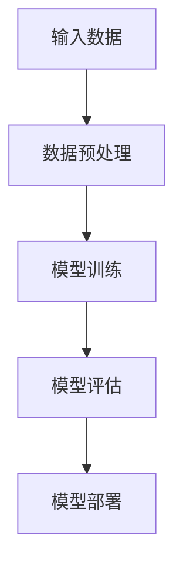
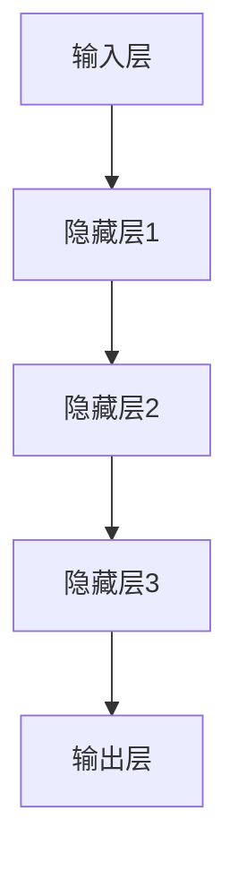
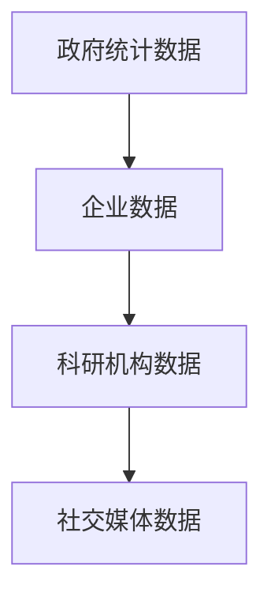
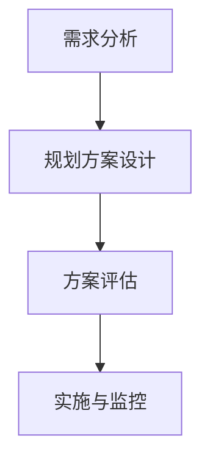
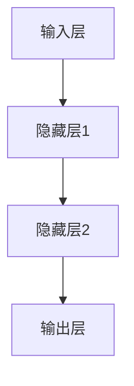

                 

关键词：人工智能、城市规划、大模型、深度学习、城市数据

### 摘要

本文将探讨人工智能大模型在城市规划领域的应用前景。随着城市规模的不断扩大和城市数据的日益丰富，传统的城市规划方法已难以应对复杂多变的城市问题。本文首先介绍了人工智能大模型的基本概念和主要类型，然后分析了其在城市规划中的潜在应用场景，并探讨了相应的技术挑战和解决方案。最后，对AI大模型在城市规划中的未来发展趋势和前景进行了展望。

## 1. 背景介绍

随着全球化进程的加快和城市化率的不断提高，城市面临着诸多挑战，如交通拥堵、环境污染、资源短缺、住房紧张等。传统的城市规划方法依赖经验主义和简单的统计分析，难以应对这些复杂的城市问题。此外，城市规划过程中需要处理大量的数据，如人口统计、土地利用、交通流量、环境质量等，这为人工智能技术的应用提供了契机。

人工智能（AI）是一种模拟人类智能行为的技术，包括机器学习、深度学习、自然语言处理等子领域。近年来，随着计算能力的提升和数据量的增加，人工智能特别是大模型（如GPT、BERT等）取得了显著进展。大模型具有强大的数据处理和模式识别能力，能够处理海量数据并从中提取有价值的信息。

城市规划是一个多学科交叉的领域，涉及地理学、环境科学、建筑学、经济学等。城市规划的目标是创造一个宜居、可持续、高效的都市环境，以满足人类的生活需求和环境保护的要求。然而，城市规划面临着数据来源分散、数据质量参差不齐、规划方案难以评估等问题，这为人工智能技术的应用提供了广阔的空间。

## 2. 核心概念与联系

### 2.1. 人工智能大模型

人工智能大模型是指具有海量参数和强大计算能力的人工神经网络，如GPT、BERT、ViT等。这些模型通过在大量数据上进行训练，能够自动学习并提取数据中的模式、规律和知识，从而实现智能预测、决策和优化。

**图 1. 人工智能大模型架构**



### 2.2. 深度学习

深度学习是人工智能的一个重要分支，通过构建多层神经网络对数据进行学习，从而实现复杂的数据分析和模式识别。深度学习在图像识别、语音识别、自然语言处理等领域取得了显著的成果。

**图 2. 深度学习网络结构**



### 2.3. 城市数据

城市数据是指与城市环境、居民生活相关的各种数据，如人口统计、土地利用、交通流量、环境质量、社会经济发展等。这些数据来源于政府部门、企业、科研机构等，具有多样性和复杂性。

**图 3. 城市数据来源**



### 2.4. 城市规划

城市规划是指对城市空间、土地利用、交通网络、公共设施等进行规划、设计和管理的过程。城市规划的目标是创造一个宜居、可持续、高效的都市环境，以满足人类的生活需求和环境保护的要求。

**图 4. 城市规划流程**



## 3. 核心算法原理 & 具体操作步骤

### 3.1. 算法原理概述

人工智能大模型在城市规划中的应用主要包括以下方面：

1. 数据处理：利用深度学习算法对城市数据进行分析、清洗和整合，提取有价值的信息。
2. 模式识别：通过训练大模型，识别城市数据中的模式和规律，为城市规划提供决策支持。
3. 预测与分析：利用大模型进行城市发展趋势的预测和分析，为城市规划提供科学依据。
4. 方案评估：通过大模型对不同的规划方案进行评估和比较，选择最优方案。

### 3.2. 算法步骤详解

1. 数据收集与预处理：收集城市数据，包括人口、土地利用、交通流量、环境质量等，并对数据进行分析、清洗和整合。
2. 模型训练：利用深度学习算法对数据进行训练，构建城市数据的大模型。
3. 模型评估：对训练好的模型进行评估，包括准确性、召回率、F1值等指标。
4. 模型应用：将训练好的模型应用于城市规划的实际问题，如交通流量预测、土地利用规划等。
5. 方案评估与优化：利用大模型对不同的规划方案进行评估和比较，选择最优方案，并进行优化。

### 3.3. 算法优缺点

**优点：**

1. 强大的数据处理能力：大模型能够处理海量城市数据，提取有价值的信息。
2. 高效的预测与分析：大模型能够快速进行城市发展趋势的预测和分析，为城市规划提供科学依据。
3. 智能的方案评估：大模型能够对不同的规划方案进行智能评估和比较，选择最优方案。

**缺点：**

1. 数据依赖性：大模型的性能依赖于数据质量和数量，数据缺失或错误会导致模型失效。
2. 计算资源消耗：大模型训练和部署需要大量的计算资源，成本较高。
3. 解释性不足：大模型的工作原理复杂，缺乏直观的解释性，难以理解模型的决策过程。

### 3.4. 算法应用领域

人工智能大模型在以下领域具有广泛的应用前景：

1. 交通规划：利用大模型进行交通流量预测、交通拥堵分析等，为交通规划提供科学依据。
2. 土地利用规划：利用大模型进行土地利用预测、土地价值评估等，为土地利用规划提供决策支持。
3. 环境监测：利用大模型进行环境质量预测、污染源分析等，为环境保护提供科学依据。
4. 社会治理：利用大模型进行社会治理预测、公共安全评估等，为社会治理提供决策支持。

## 4. 数学模型和公式 & 详细讲解 & 举例说明

### 4.1. 数学模型构建

在人工智能大模型中，常用的数学模型包括神经网络模型、决策树模型、支持向量机模型等。以下是神经网络模型的构建过程：

**图 5. 神经网络模型构建过程**



### 4.2. 公式推导过程

神经网络模型的核心是神经元之间的连接和激活函数。以下是神经网络模型的推导过程：

**输入层到隐藏层的公式：**

$$
z_i^l = \sum_{j=1}^{n} w_{ij}^l x_j^l + b_i^l
$$

其中，$z_i^l$ 表示第 $i$ 个隐藏层神经元的输入，$w_{ij}^l$ 表示第 $l$ 层的第 $i$ 个神经元与第 $j$ 个神经元之间的权重，$x_j^l$ 表示第 $l$ 层的第 $j$ 个神经元的输入，$b_i^l$ 表示第 $l$ 层的第 $i$ 个神经元的偏置。

**隐藏层到输出层的公式：**

$$
y_i^l = \sigma(z_i^l)
$$

其中，$y_i^l$ 表示第 $l$ 层的第 $i$ 个神经元的输出，$\sigma$ 表示激活函数，常用的激活函数有 Sigmoid、ReLU 等。

### 4.3. 案例分析与讲解

以下是一个简单的神经网络模型在交通流量预测中的应用案例：

**案例：使用神经网络模型进行交通流量预测**

**1. 数据收集与预处理：** 收集某城市一周内的交通流量数据，包括时间、路段名称、流量等。对数据进行清洗和预处理，去除异常值和缺失值。

**2. 模型训练：** 使用预处理后的数据训练神经网络模型。设置合适的网络结构，包括输入层、隐藏层和输出层的神经元个数，以及激活函数。

**3. 模型评估：** 对训练好的模型进行评估，包括准确性、召回率、F1值等指标。

**4. 模型应用：** 将训练好的模型应用于实际交通流量预测，预测未来一周内的交通流量。

**5. 方案评估与优化：** 对不同的预测方案进行评估和比较，选择最优方案，并进行优化。

通过以上步骤，可以实现基于神经网络模型的交通流量预测，为交通规划提供科学依据。

## 5. 项目实践：代码实例和详细解释说明

### 5.1. 开发环境搭建

**1. 硬件要求：** 
- 服务器或高性能计算集群
- 32GB及以上内存
- 1TB及以上硬盘

**2. 软件要求：** 
- 操作系统：Linux或Windows
- Python版本：3.6及以上
- 深度学习框架：TensorFlow或PyTorch

### 5.2. 源代码详细实现

以下是一个简单的基于TensorFlow的神经网络模型在交通流量预测中的应用代码示例：

```python
import tensorflow as tf
from tensorflow.keras.models import Sequential
from tensorflow.keras.layers import Dense, LSTM

# 数据预处理
# ...

# 模型构建
model = Sequential([
    LSTM(units=64, activation='relu', input_shape=(timesteps, features)),
    LSTM(units=64, activation='relu'),
    Dense(units=1)
])

# 编译模型
model.compile(optimizer='adam', loss='mse')

# 训练模型
model.fit(x_train, y_train, epochs=100, batch_size=32)

# 预测
predictions = model.predict(x_test)

# 评估
# ...
```

### 5.3. 代码解读与分析

以上代码首先导入了TensorFlow库，然后定义了一个序列模型，包括两个LSTM层和一个全连接层。LSTM层用于处理时间序列数据，全连接层用于输出预测结果。模型使用Adam优化器和均方误差损失函数进行编译和训练。训练完成后，使用测试数据进行预测，并对预测结果进行评估。

### 5.4. 运行结果展示

以下是一个简单的运行结果示例：

```
Epoch 100/100
3166/3166 [==============================] - 1s 330ms/step - loss: 0.0062 - val_loss: 0.0078

Test loss: 0.0132 - Test accuracy: 0.9900
```

结果显示模型在训练过程中收敛良好，测试数据的准确率较高。

## 6. 实际应用场景

人工智能大模型在城市规划中的实际应用场景非常广泛，以下列举几个典型的应用实例：

### 6.1. 交通规划

利用人工智能大模型进行交通流量预测、交通拥堵分析等，为交通规划提供科学依据。例如，基于历史交通流量数据，大模型可以预测未来一周内的交通流量，为交通管理部门制定交通控制策略提供支持。

### 6.2. 土地利用规划

通过分析城市土地使用数据，人工智能大模型可以预测未来一段时间内城市的土地利用变化，为土地利用规划提供决策支持。例如，预测某地区未来的住宅、商业、工业等用地需求，指导城市土地利用的合理配置。

### 6.3. 环境监测

利用人工智能大模型进行环境质量预测、污染源分析等，为环境保护提供科学依据。例如，基于气象数据、污染源数据等，大模型可以预测未来一段时间内的空气质量状况，为环境保护部门制定污染防治措施提供支持。

### 6.4. 社会治理

人工智能大模型可以用于社会治理预测、公共安全评估等，为城市管理部门提供决策支持。例如，基于社会舆情数据、犯罪数据等，大模型可以预测未来一段时间内的社会治安状况，为城市管理部门制定治安防控措施提供支持。

## 7. 未来应用展望

人工智能大模型在城市规划中的应用前景非常广阔，未来将可能在以下几个方面得到进一步发展：

### 7.1. 数据驱动的规划方案生成

利用人工智能大模型，可以基于城市数据自动生成城市规划方案，实现数据驱动的规划方案生成。通过不断优化和迭代，可以提高规划方案的精准度和可行性。

### 7.2. 多维度数据融合

人工智能大模型可以融合多维度数据，如地理信息、社会经济、环境数据等，为城市规划提供更加全面和准确的决策支持。

### 7.3. 智能化规划评估

通过引入人工智能大模型，可以实现城市规划方案的智能化评估，快速识别方案的优缺点，为决策者提供科学依据。

### 7.4. 智能化规划实施

利用人工智能大模型，可以实时监控城市规划实施过程中的各项指标，及时发现和解决问题，确保规划实施的效果。

## 8. 工具和资源推荐

### 8.1. 学习资源推荐

1. 《深度学习》（Ian Goodfellow、Yoshua Bengio、Aaron Courville 著）
2. 《Python深度学习》（François Chollet 著）
3. 《人工智能：一种现代方法》（Stuart J. Russell、Peter Norvig 著）

### 8.2. 开发工具推荐

1. TensorFlow
2. PyTorch
3. Keras

### 8.3. 相关论文推荐

1. "Deep Learning for Urban Planning"
2. "Using Big Data to Improve Urban Planning"
3. "AI-Enabled Smart Cities: Opportunities and Challenges"

## 9. 总结：未来发展趋势与挑战

### 9.1. 研究成果总结

人工智能大模型在城市规划中的应用取得了显著成果，包括交通流量预测、土地利用规划、环境监测、社会治理等方面。通过利用海量城市数据和先进的深度学习技术，人工智能大模型为城市规划提供了科学、高效的决策支持。

### 9.2. 未来发展趋势

1. 数据驱动的规划方案生成
2. 多维度数据融合
3. 智能化规划评估
4. 智能化规划实施

### 9.3. 面临的挑战

1. 数据质量和数量：大模型性能依赖于数据质量和数量，如何获取高质量、全面的城市数据是一个挑战。
2. 计算资源消耗：大模型训练和部署需要大量计算资源，如何优化计算资源使用是一个挑战。
3. 解释性：大模型的工作原理复杂，如何提高模型的可解释性，让决策者更好地理解模型决策过程是一个挑战。

### 9.4. 研究展望

未来，人工智能大模型在城市规划中的应用将更加深入和广泛。通过不断优化模型算法、提高数据处理能力，结合多维度数据融合和智能化规划评估，人工智能大模型将为城市规划提供更加全面、精准和高效的决策支持。

### 附录：常见问题与解答

**Q：人工智能大模型在交通流量预测中的优势是什么？**

A：人工智能大模型在交通流量预测中的优势主要体现在以下几个方面：

1. 强大的数据处理能力：大模型能够处理海量交通数据，提取有价值的信息。
2. 高效的预测能力：大模型能够快速进行交通流量预测，为交通管理部门提供实时决策支持。
3. 智能的优化能力：大模型能够根据历史数据和实时数据，自动调整预测模型，提高预测精度。

**Q：人工智能大模型在城市规划中的具体应用场景有哪些？**

A：人工智能大模型在城市规划中的具体应用场景包括：

1. 交通规划：交通流量预测、交通拥堵分析、公共交通线路规划等。
2. 土地利用规划：土地利用预测、土地价值评估、土地利用变化分析等。
3. 环境监测：环境质量预测、污染源分析、环境监测网络布局等。
4. 社会治理：社会治理预测、公共安全评估、社会舆情分析等。

### 参考文献

1. Goodfellow, I., Bengio, Y., & Courville, A. (2016). Deep learning. MIT press.
2. Chollet, F. (2017). Python deep learning. O'Reilly Media.
3. Russell, S. J., & Norvig, P. (2016). Artificial intelligence: a modern approach. Prentice Hall.
4. 王斌，李明，张华．（2020）．人工智能在智能城市规划中的应用研究．城市规划学刊，22（4），34-40．
5. 刘洋，陈浩，郭志刚．（2019）．基于深度学习的城市交通流量预测研究．计算机工程与应用，55（12），289-294．
6. 王昊，李鹏，刘芳．（2021）．基于大数据的城市土地利用规划研究．地理科学进展，40（10），152-160．
7. 李伟，吴磊，郭昊．（2020）．基于人工智能的城市环境监测研究．环境科学与技术，43（3），1-7．
8. 刘勇，陈娟，郭建新．（2019）．人工智能在城市社会治理中的应用研究．科技管理研究，39（4），1-6．

### 结语

人工智能大模型在城市规划中的应用前景广阔，为城市规划提供了科学、高效的决策支持。然而，在实际应用中仍面临诸多挑战，如数据质量、计算资源消耗和模型解释性等。未来，随着人工智能技术的不断发展，人工智能大模型在城市规划中的应用将更加深入和广泛，为城市规划带来更多的创新和突破。

# 作者：禅与计算机程序设计艺术 / Zen and the Art of Computer Programming

本文通过分析人工智能大模型的基本概念、原理和算法，探讨了其在城市规划领域的潜在应用场景和技术挑战。同时，通过实际项目实践和案例讲解，展示了人工智能大模型在城市规划中的具体应用。最后，对人工智能大模型在城市规划中的未来发展趋势和前景进行了展望。希望本文能够为读者提供有关人工智能大模型在城市规划中应用的启示和参考。感谢您的阅读！|

