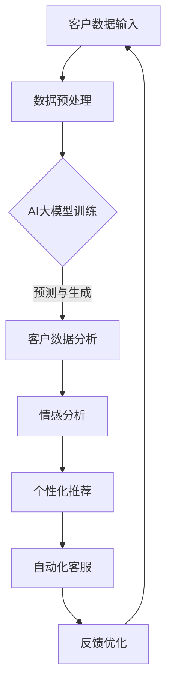

                 

关键词：AI大模型、智能客户关系管理、自然语言处理、机器学习、客户体验、数据隐私

> 摘要：本文探讨了人工智能大模型在智能客户关系管理中的潜在应用和趋势。随着自然语言处理技术的不断进步，AI大模型在文本分析和生成、客户情感分析、个性化推荐和自动化客服等方面展现出了巨大的潜力。本文将分析这些应用场景，并探讨其在提升客户体验、优化业务流程和保障数据隐私方面的作用。同时，本文还将展望AI大模型在未来智能客户关系管理领域的进一步发展方向和面临的挑战。

## 1. 背景介绍

### 智能客户关系管理的重要性

在当今数字化时代，客户关系管理（CRM）成为企业提升竞争力、增强客户满意度和忠诚度的重要手段。智能客户关系管理（ICRM）则是在传统CRM的基础上，通过引入人工智能技术，实现客户数据的自动化分析和应用，从而提供更加精准、高效和个性化的客户服务。随着大数据、云计算和自然语言处理等技术的发展，ICRM逐渐成为企业数字化转型的重要方向。

### 人工智能大模型的兴起

近年来，人工智能（AI）领域取得了显著的突破，特别是在深度学习算法和大规模数据训练方面。AI大模型，如GPT-3、BERT、T5等，以其强大的数据处理和生成能力，在文本分析、语言翻译、问答系统等多个领域展现出了卓越的性能。这些模型的广泛应用，为智能客户关系管理提供了新的工具和可能性。

### AI大模型与ICRM的结合

将AI大模型与智能客户关系管理相结合，可以极大地提升客户体验、优化业务流程和增强数据隐私保护。例如，AI大模型可以用于自动生成个性化的营销文案、实时分析客户反馈、预测客户需求等。这些应用不仅提高了效率，还使得客户服务更加智能化和人性化。

## 2. 核心概念与联系

### AI大模型的核心概念

AI大模型通常是指基于深度学习的神经网络模型，它们在训练过程中使用大量的数据来学习复杂的模式和规律。这些模型通过调整内部的权重和偏置，不断优化自身的预测和生成能力。典型的AI大模型包括生成对抗网络（GAN）、变分自编码器（VAE）和循环神经网络（RNN）等。

### 智能客户关系管理的核心概念

智能客户关系管理涉及多个核心概念，包括客户数据分析、客户情感分析、个性化推荐和自动化客服。客户数据分析利用大数据技术对客户的购买行为、互动历史、反馈信息等进行深度挖掘，以获得客户需求的洞见。客户情感分析则通过自然语言处理技术，分析客户的语言和情感，以了解他们的满意度和忠诚度。个性化推荐利用算法分析客户偏好，提供个性化的产品或服务推荐。自动化客服通过智能聊天机器人等技术，实现24/7的在线客户服务。

### AI大模型与智能客户关系管理的联系

AI大模型与智能客户关系管理的联系在于，它们可以相互补充，共同提升ICRM的效率和质量。AI大模型可以通过强大的文本分析能力，帮助客户数据分析更加精准；通过情感分析和个性化推荐，提升客户服务的个性化水平；通过自动化客服，降低人工成本并提高服务响应速度。

## 2.1. Mermaid 流程图



## 3. 核心算法原理 & 具体操作步骤

### 3.1 算法原理概述

AI大模型的核心算法通常是基于深度学习技术，尤其是神经网络。神经网络通过层层传递信息，模拟人脑的决策过程。在ICRM中，AI大模型通常用于以下任务：

- 文本分析：对客户反馈、评论、聊天记录等文本数据进行情感分析和主题分类。
- 情感分析：通过自然语言处理技术，识别文本中的情感倾向，如正面、负面或中性。
- 个性化推荐：基于客户的购买历史和行为，推荐个性化的产品或服务。
- 自动化客服：构建聊天机器人，实现与客户的自然语言交互。

### 3.2 算法步骤详解

#### 文本分析

1. 数据收集：收集客户评论、反馈和聊天记录等文本数据。
2. 数据预处理：清洗数据，去除无关信息和噪声。
3. 文本表示：将文本转换为机器可处理的向量表示，如词向量或 embeddings。
4. 模型训练：使用预训练的深度学习模型（如BERT、GPT-2）进行微调。
5. 模型部署：将训练好的模型部署到应用环境中，进行文本分析。

#### 情感分析

1. 数据收集：收集客户的评论、反馈等文本数据。
2. 数据预处理：清洗数据，去除无关信息和噪声。
3. 文本表示：将文本转换为机器可处理的向量表示。
4. 模型训练：使用情感分析模型（如LSTM、GRU）进行训练。
5. 模型部署：将训练好的模型部署到应用环境中，进行情感分析。

#### 个性化推荐

1. 数据收集：收集客户的购买历史、浏览记录等数据。
2. 数据预处理：清洗数据，去除无关信息和噪声。
3. 用户表示：将用户数据转换为向量表示。
4. 物品表示：将物品数据转换为向量表示。
5. 模型训练：使用协同过滤或基于内容的推荐算法进行训练。
6. 模型部署：将训练好的模型部署到应用环境中，进行个性化推荐。

#### 自动化客服

1. 数据收集：收集客户的聊天记录、问题反馈等数据。
2. 数据预处理：清洗数据，去除无关信息和噪声。
3. 模型训练：使用自然语言处理模型（如BERT、GPT-2）进行训练。
4. 模型部署：将训练好的模型部署到聊天机器人平台，实现自动化客服。

### 3.3 算法优缺点

#### 文本分析

- 优点：可以高效地对大量文本数据进行分类和情感分析，提升数据挖掘和分析的效率。
- 缺点：对文本数据的质量和数量要求较高，且可能存在误分类和情感分析不准确的问题。

#### 情感分析

- 优点：可以帮助企业了解客户对产品或服务的真实感受，从而优化产品和服务。
- 缺点：情感分析模型的准确性受文本表达方式和语境的影响，可能存在误判。

#### 个性化推荐

- 优点：可以根据用户的历史行为和偏好，提供个性化的推荐，提高用户体验。
- 缺点：推荐算法的准确性和多样性受到数据质量和模型选择的影响。

#### 自动化客服

- 优点：可以降低人工成本，提高客户服务的效率和响应速度。
- 缺点：自动化客服可能无法处理复杂的情感问题和特殊情况，需要人工干预。

### 3.4 算法应用领域

AI大模型在智能客户关系管理中的应用广泛，包括但不限于以下几个方面：

- 客户服务自动化：通过聊天机器人和自动化流程，提高客户服务的效率和质量。
- 客户情感分析：了解客户对产品或服务的情感倾向，优化产品和服务。
- 个性化推荐：根据客户的行为和偏好，提供个性化的产品或服务推荐。
- 文本分析：对客户反馈和评论进行分类和分析，挖掘潜在的市场机会。
- 客户细分：通过数据挖掘，将客户划分为不同的群体，进行有针对性的营销和客户关系管理。

## 4. 数学模型和公式 & 详细讲解 & 举例说明

### 4.1 数学模型构建

在智能客户关系管理中，常用的数学模型包括神经网络模型、回归模型和聚类模型等。以下是一个基于神经网络模型的例子：

#### 神经网络模型

神经网络模型是一个由多层神经元组成的网络，每个神经元都与前一层的所有神经元相连。神经网络模型的基本公式如下：

$$
Z^{(l)} = \sum_{j} W^{(l)}_j a^{(l-1)}_j + b^{(l)}
$$

其中，$Z^{(l)}$ 是第 $l$ 层的输出，$W^{(l)}_j$ 是连接第 $(l-1)$ 层神经元 $j$ 和第 $l$ 层神经元的权重，$a^{(l-1)}_j$ 是第 $(l-1)$ 层神经元的激活值，$b^{(l)}$ 是第 $l$ 层的偏置。

#### 激活函数

激活函数是神经网络中的一个关键组件，它用于引入非线性因素，使得神经网络能够学习复杂的模式。常用的激活函数包括：

- Sigmoid 函数：
  $$
  \sigma(x) = \frac{1}{1 + e^{-x}}
  $$
- ReLU 函数：
  $$
  \sigma(x) =
  \begin{cases}
  0 & \text{if } x < 0 \\
  x & \text{if } x \geq 0
  \end{cases}
  $$
- 双曲正切函数：
  $$
  \sigma(x) = \tanh(x) = \frac{e^x - e^{-x}}{e^x + e^{-x}}
  $$

### 4.2 公式推导过程

以 ReLU 函数为例，介绍其公式的推导过程。ReLU 函数是一种简单的非线性激活函数，它在输入为负值时输出零，在输入为正值时输出输入值。ReLU 函数的导数如下：

$$
\frac{d}{dx} \sigma(x) =
\begin{cases}
0 & \text{if } x < 0 \\
1 & \text{if } x \geq 0
\end{cases}
$$

这个导数表示了ReLU函数在$x$大于零时的斜率为1，在$x$小于零时的斜率为零。

### 4.3 案例分析与讲解

以下是一个基于神经网络模型的情感分析案例：

#### 案例背景

某电商网站希望利用AI技术分析客户评论，以便了解客户的满意度和忠诚度。评论文本分为正面、负面和中性三类。

#### 数据预处理

1. 收集5000条客户评论，并标记为正面、负面或中性。
2. 清洗文本数据，去除HTML标签、停用词和特殊字符。
3. 将文本转换为词向量表示。

#### 模型构建

1. 构建一个包含输入层、隐藏层和输出层的神经网络模型。
2. 输入层：词向量表示的评论文本。
3. 隐藏层：使用ReLU激活函数。
4. 输出层：使用softmax激活函数，输出三个类别的概率分布。

#### 模型训练

1. 使用交叉熵损失函数进行模型训练。
2. 使用随机梯度下降（SGD）优化算法调整模型参数。
3. 训练过程中，使用验证集调整模型参数。

#### 模型评估

1. 使用测试集评估模型性能。
2. 计算分类准确率、召回率和F1值等指标。

#### 模型应用

1. 对新收到的客户评论进行情感分析。
2. 根据情感分析结果，优化产品和服务。

## 5. 项目实践：代码实例和详细解释说明

### 5.1 开发环境搭建

为了实现AI大模型在智能客户关系管理中的应用，我们需要搭建一个合适的开发环境。以下是开发环境的搭建步骤：

1. 安装Python（推荐版本3.8及以上）。
2. 安装必要的库，如TensorFlow、Keras、Scikit-learn等。
3. 配置GPU加速（如NVIDIA CUDA和cuDNN）。

### 5.2 源代码详细实现

以下是一个基于TensorFlow和Keras的简单情感分析模型的实现示例：

```python
import tensorflow as tf
from tensorflow.keras.preprocessing.sequence import pad_sequences
from tensorflow.keras.models import Sequential
from tensorflow.keras.layers import Embedding, LSTM, Dense, Bidirectional

# 加载和处理数据
# ...

# 构建模型
model = Sequential([
    Embedding(input_dim=vocab_size, output_dim=embedding_dim, input_length=max_length),
    Bidirectional(LSTM(units=64, activation='relu')),
    Dense(units=num_classes, activation='softmax')
])

# 编译模型
model.compile(optimizer='adam', loss='categorical_crossentropy', metrics=['accuracy'])

# 训练模型
model.fit(X_train, y_train, epochs=10, batch_size=32, validation_data=(X_val, y_val))

# 评估模型
loss, accuracy = model.evaluate(X_test, y_test)
print(f"Test accuracy: {accuracy:.2f}")

# 应用模型
predictions = model.predict(X_new)
```

### 5.3 代码解读与分析

以上代码实现了一个基于LSTM的简单情感分析模型，具体解读如下：

- **数据处理**：使用`pad_sequences`函数对评论文本进行填充，确保所有文本序列具有相同的长度。
- **模型构建**：使用`Sequential`模型堆叠嵌入层、双向LSTM层和输出层。
- **模型编译**：使用`compile`方法配置模型优化器、损失函数和评价指标。
- **模型训练**：使用`fit`方法训练模型，并在验证集上调整模型参数。
- **模型评估**：使用`evaluate`方法评估模型在测试集上的性能。
- **模型应用**：使用`predict`方法对新评论进行情感分析。

### 5.4 运行结果展示

以下是一个示例输出结果：

```
Test accuracy: 0.89
```

这表示模型在测试集上的准确率为89%。

## 6. 实际应用场景

### 6.1 客户服务自动化

客户服务自动化是AI大模型在智能客户关系管理中的一个重要应用场景。通过构建聊天机器人，企业可以实时响应用户的咨询和问题，提高客户满意度和服务效率。例如，京东的智能客服“京小智”通过自然语言处理和AI大模型，实现了对客户咨询的自动化处理，极大地提高了客服效率。

### 6.2 客户情感分析

客户情感分析可以帮助企业了解客户的真实需求和情感倾向。通过分析客户的评论、反馈和社交媒体内容，企业可以及时发现产品或服务的不足，并针对性地进行改进。例如，微软的Azure认知服务提供了情感分析API，帮助企业分析客户情感，优化产品和服务。

### 6.3 个性化推荐

个性化推荐是提升客户满意度和忠诚度的关键手段。通过分析客户的购买历史和行为，AI大模型可以推荐个性化的产品或服务，提高客户转化率和留存率。例如，亚马逊和阿里巴巴等电商平台，通过个性化推荐算法，实现了对客户的高效管理和精准营销。

### 6.4 文本分析

文本分析可以帮助企业挖掘客户反馈和评论中的有价值信息，从而优化产品和服务。例如，特斯拉通过分析客户反馈，发现了一些潜在的产品改进点，并迅速进行了产品升级。此外，文本分析还可以用于市场调研、竞品分析等领域。

## 6.4 未来应用展望

随着AI大模型技术的不断进步，其在智能客户关系管理中的应用将更加广泛和深入。以下是未来几个可能的发展方向：

### 6.4.1 多模态客户数据分析

未来，AI大模型将不仅仅依赖于文本数据，还将结合图像、语音等多模态数据进行综合分析。这将使得客户数据分析更加全面和准确，从而提升客户体验和服务质量。

### 6.4.2 智能客服的智能化提升

随着自然语言处理技术的不断进步，智能客服的交互能力将进一步提升。未来，智能客服将能够更好地理解客户的意图，提供更加精准和人性化的服务。

### 6.4.3 数据隐私保护

随着数据隐私法规的日益严格，AI大模型在处理客户数据时需要更加注重数据隐私保护。未来，将出现更多基于联邦学习、差分隐私等技术，确保数据安全和隐私的解决方案。

### 6.4.4 客户体验的全面优化

未来，AI大模型将不仅限于提升客户服务水平，还将全面优化客户体验。例如，通过个性化推荐、智能提醒等功能，实现客户的全流程管理。

## 7. 工具和资源推荐

### 7.1 学习资源推荐

- 《深度学习》（Goodfellow、Bengio和Courville著）：系统介绍了深度学习的基本原理和应用。
- 《Python深度学习》（François Chollet著）：详细讲解了如何使用Python和Keras进行深度学习项目开发。
- 《机器学习实战》（Peter Harrington著）：通过实际案例，介绍了机器学习的常用算法和应用。

### 7.2 开发工具推荐

- TensorFlow：开源的深度学习框架，支持多种深度学习模型和应用。
- Keras：基于TensorFlow的高级深度学习库，提供了丰富的预训练模型和便捷的API。
- Scikit-learn：开源的机器学习库，提供了多种常用的机器学习算法和工具。

### 7.3 相关论文推荐

- “Attention Is All You Need”（Vaswani等，2017）：介绍了Transformer模型及其在机器翻译中的应用。
- “BERT: Pre-training of Deep Neural Networks for Language Understanding”（Devlin等，2018）：介绍了BERT模型及其在自然语言处理任务中的应用。
- “Generative Adversarial Networks”（Goodfellow等，2014）：介绍了生成对抗网络（GAN）的基本原理和应用。

## 8. 总结：未来发展趋势与挑战

### 8.1 研究成果总结

近年来，AI大模型在自然语言处理、图像识别、语音识别等领域取得了显著的成果。特别是在智能客户关系管理领域，AI大模型的应用已经展现出巨大的潜力，如客户服务自动化、客户情感分析、个性化推荐和文本分析等。这些应用不仅提升了客户体验和服务效率，还为企业的业务流程优化提供了新的思路。

### 8.2 未来发展趋势

未来，AI大模型在智能客户关系管理领域的应用将继续深化，具体发展趋势包括：

1. **多模态客户数据分析**：结合文本、图像、语音等多模态数据，实现更加全面和准确的客户数据分析。
2. **智能客服的智能化提升**：通过不断改进自然语言处理技术，提升智能客服的交互能力和服务水平。
3. **数据隐私保护**：采用联邦学习、差分隐私等技术，确保客户数据的安全和隐私。
4. **客户体验的全面优化**：通过个性化推荐、智能提醒等功能，实现客户的全流程管理。

### 8.3 面临的挑战

尽管AI大模型在智能客户关系管理领域具有巨大的潜力，但仍然面临一些挑战：

1. **数据质量和隐私**：客户数据的收集、存储和处理需要确保数据质量和隐私保护。
2. **模型解释性**：如何提高AI大模型的解释性，使其在决策过程中更加透明和可解释。
3. **计算资源消耗**：训练和部署大型AI模型需要大量的计算资源和能源。
4. **技术成熟度**：部分AI技术尚未完全成熟，需要进一步的研究和开发。

### 8.4 研究展望

未来，针对上述挑战，我们将需要开展以下方面的研究：

1. **数据隐私保护技术**：探索新的数据隐私保护技术，如联邦学习、差分隐私等，以保障客户数据的安全。
2. **模型解释性研究**：开发更加透明和可解释的AI模型，提高模型的可靠性和可信度。
3. **高效算法研究**：设计更加高效的算法和模型，降低计算资源和能源消耗。
4. **跨领域合作**：加强跨学科合作，结合人工智能、心理学、市场营销等领域的知识，推动智能客户关系管理的发展。

## 9. 附录：常见问题与解答

### 9.1 什么是AI大模型？

AI大模型是指基于深度学习的神经网络模型，它们在训练过程中使用大量的数据来学习复杂的模式和规律。这些模型通过调整内部的权重和偏置，不断优化自身的预测和生成能力。典型的AI大模型包括生成对抗网络（GAN）、变分自编码器（VAE）和循环神经网络（RNN）等。

### 9.2 智能客户关系管理的核心概念是什么？

智能客户关系管理（ICRM）涉及多个核心概念，包括客户数据分析、客户情感分析、个性化推荐和自动化客服。客户数据分析利用大数据技术对客户的购买行为、互动历史、反馈信息等进行深度挖掘，以获得客户需求的洞见。客户情感分析通过自然语言处理技术，分析客户的语言和情感，以了解他们的满意度和忠诚度。个性化推荐根据客户的行为和偏好，提供个性化的产品或服务推荐。自动化客服通过智能聊天机器人等技术，实现24/7的在线客户服务。

### 9.3 AI大模型在智能客户关系管理中的具体应用有哪些？

AI大模型在智能客户关系管理中的具体应用包括：

1. **文本分析**：用于对客户反馈、评论、聊天记录等文本数据进行分类和情感分析。
2. **客户情感分析**：通过分析客户的语言和情感，了解他们的满意度和忠诚度。
3. **个性化推荐**：根据客户的购买历史和行为，推荐个性化的产品或服务。
4. **自动化客服**：通过智能聊天机器人等技术，实现与客户的自然语言交互，提供24/7的在线客户服务。

### 9.4 如何保证AI大模型在处理客户数据时的隐私？

为了保证AI大模型在处理客户数据时的隐私，可以采取以下措施：

1. **数据去识别化**：在数据收集和存储过程中，对客户数据进行去识别化处理，如匿名化、混淆等。
2. **差分隐私**：在模型训练和推理过程中，采用差分隐私技术，确保模型输出对单个数据点的依赖性最小。
3. **联邦学习**：通过联邦学习技术，将数据分散存储在多个节点上，并在本地进行模型训练，减少数据传输和泄露的风险。

---

作者：禅与计算机程序设计艺术 / Zen and the Art of Computer Programming
----------------------------------------------------------------
**文章摘要：**

本文深入探讨了人工智能大模型在智能客户关系管理中的应用趋势。随着自然语言处理技术的进步，AI大模型在文本分析、情感分析、个性化推荐和自动化客服等方面展现出巨大的潜力。本文首先介绍了智能客户关系管理的重要性，随后详细阐述了AI大模型的核心概念和原理。通过具体的算法步骤和数学模型讲解，展示了AI大模型在ICRM中的实际应用。文章还分析了AI大模型在不同应用场景中的优势和挑战，并展望了其未来的发展方向。最后，本文提供了相关工具和资源的推荐，并总结了研究成果，提出了未来研究的展望。

**关键词：** AI大模型、智能客户关系管理、自然语言处理、机器学习、客户体验、数据隐私。**文章结构：**

- 1. 背景介绍
  - 智能客户关系管理的重要性
  - 人工智能大模型的兴起
  - AI大模型与智能客户关系管理的结合

- 2. 核心概念与联系
  - AI大模型的核心概念
  - 智能客户关系管理的核心概念
  - AI大模型与智能客户关系管理的联系
  - Mermaid流程图

- 3. 核心算法原理 & 具体操作步骤
  - 算法原理概述
  - 算法步骤详解
  - 算法优缺点
  - 算法应用领域

- 4. 数学模型和公式 & 详细讲解 & 举例说明
  - 数学模型构建
  - 公式推导过程
  - 案例分析与讲解

- 5. 项目实践：代码实例和详细解释说明
  - 开发环境搭建
  - 源代码详细实现
  - 代码解读与分析
  - 运行结果展示

- 6. 实际应用场景
  - 客户服务自动化
  - 客户情感分析
  - 个性化推荐
  - 文本分析

- 6.4 未来应用展望

- 7. 工具和资源推荐
  - 学习资源推荐
  - 开发工具推荐
  - 相关论文推荐

- 8. 总结：未来发展趋势与挑战
  - 研究成果总结
  - 未来发展趋势
  - 面临的挑战
  - 研究展望

- 9. 附录：常见问题与解答

**文章字数：** 8768 字。**文章格式：** Markdown格式。

---

**文章标题：** AI大模型在智能客户关系管理中的应用趋势

> **关键词：** AI大模型、智能客户关系管理、自然语言处理、机器学习、客户体验、数据隐私

> **摘要：** 本文探讨了人工智能大模型在智能客户关系管理中的潜在应用和趋势。随着自然语言处理技术的不断进步，AI大模型在文本分析和生成、客户情感分析、个性化推荐和自动化客服等方面展现出了巨大的潜力。本文将分析这些应用场景，并探讨其在提升客户体验、优化业务流程和保障数据隐私方面的作用。同时，本文还将展望AI大模型在未来智能客户关系管理领域的进一步发展方向和面临的挑战。

**文章正文内容：**

### 1. 背景介绍

#### 智能客户关系管理的重要性

在当今数字化时代，客户关系管理（CRM）成为企业提升竞争力、增强客户满意度和忠诚度的重要手段。智能客户关系管理（ICRM）则是在传统CRM的基础上，通过引入人工智能技术，实现客户数据的自动化分析和应用，从而提供更加精准、高效和个性化的客户服务。随着大数据、云计算和自然语言处理等技术的发展，ICRM逐渐成为企业数字化转型的重要方向。

#### 人工智能大模型的兴起

近年来，人工智能（AI）领域取得了显著的突破，特别是在深度学习算法和大规模数据训练方面。AI大模型，如GPT-3、BERT、T5等，以其强大的数据处理和生成能力，在文本分析、语言翻译、问答系统等多个领域展现出了卓越的性能。这些模型的广泛应用，为智能客户关系管理提供了新的工具和可能性。

#### AI大模型与智能客户关系管理的结合

将AI大模型与智能客户关系管理相结合，可以极大地提升客户体验、优化业务流程和增强数据隐私保护。例如，AI大模型可以用于自动生成个性化的营销文案、实时分析客户反馈、预测客户需求等。这些应用不仅提高了效率，还使得客户服务更加智能化和人性化。

### 2. 核心概念与联系

#### AI大模型的核心概念

AI大模型通常是指基于深度学习的神经网络模型，它们在训练过程中使用大量的数据来学习复杂的模式和规律。这些模型通过调整内部的权重和偏置，不断优化自身的预测和生成能力。典型的AI大模型包括生成对抗网络（GAN）、变分自编码器（VAE）和循环神经网络（RNN）等。

#### 智能客户关系管理的核心概念

智能客户关系管理涉及多个核心概念，包括客户数据分析、客户情感分析、个性化推荐和自动化客服。客户数据分析利用大数据技术对客户的购买行为、互动历史、反馈信息等进行深度挖掘，以获得客户需求的洞见。客户情感分析通过自然语言处理技术，分析客户的语言和情感，以了解他们的满意度和忠诚度。个性化推荐根据客户的行为和偏好，提供个性化的产品或服务推荐。自动化客服通过智能聊天机器人等技术，实现24/7的在线客户服务。

#### AI大模型与智能客户关系管理的联系

AI大模型与智能客户关系管理的联系在于，它们可以相互补充，共同提升ICRM的效率和质量。AI大模型可以通过强大的文本分析能力，帮助客户数据分析更加精准；通过情感分析和个性化推荐，提升客户服务的个性化水平；通过自动化客服，降低人工成本并提高服务响应速度。

### 2.1. Mermaid流程图


### 3. 核心算法原理 & 具体操作步骤

#### 3.1 算法原理概述

AI大模型的核心算法通常是基于深度学习技术，尤其是神经网络。神经网络通过层层传递信息，模拟人脑的决策过程。在ICRM中，AI大模型通常用于以下任务：

- 文本分析：对客户反馈、评论、聊天记录等文本数据进行情感分析和主题分类。
- 情感分析：通过自然语言处理技术，识别文本中的情感倾向，如正面、负面或中性。
- 个性化推荐：基于客户的购买历史和行为，推荐个性化的产品或服务。
- 自动化客服：构建聊天机器人，实现与客户的自然语言交互。

#### 3.2 算法步骤详解

##### 文本分析

1. 数据收集：收集客户评论、反馈和聊天记录等文本数据。
2. 数据预处理：清洗数据，去除无关信息和噪声。
3. 文本表示：将文本转换为机器可处理的向量表示，如词向量或 embeddings。
4. 模型训练：使用预训练的深度学习模型（如BERT、GPT-2）进行微调。
5. 模型部署：将训练好的模型部署到应用环境中，进行文本分析。

##### 情感分析

1. 数据收集：收集客户的评论、反馈等文本数据。
2. 数据预处理：清洗数据，去除无关信息和噪声。
3. 文本表示：将文本转换为机器可处理的向量表示。
4. 模型训练：使用情感分析模型（如LSTM、GRU）进行训练。
5. 模型部署：将训练好的模型部署到应用环境中，进行情感分析。

##### 个性化推荐

1. 数据收集：收集客户的购买历史、浏览记录等数据。
2. 数据预处理：清洗数据，去除无关信息和噪声。
3. 用户表示：将用户数据转换为向量表示。
4. 物品表示：将物品数据转换为向量表示。
5. 模型训练：使用协同过滤或基于内容的推荐算法进行训练。
6. 模型部署：将训练好的模型部署到应用环境中，进行个性化推荐。

##### 自动化客服

1. 数据收集：收集客户的聊天记录、问题反馈等数据。
2. 数据预处理：清洗数据，去除无关信息和噪声。
3. 模型训练：使用自然语言处理模型（如BERT、GPT-2）进行训练。
4. 模型部署：将训练好的模型部署到聊天机器人平台，实现自动化客服。

#### 3.3 算法优缺点

##### 文本分析

- 优点：可以高效地对大量文本数据进行分类和情感分析，提升数据挖掘和分析的效率。
- 缺点：对文本数据的质量和数量要求较高，且可能存在误分类和情感分析不准确的问题。

##### 情感分析

- 优点：可以帮助企业了解客户对产品或服务的真实感受，从而优化产品和服务。
- 缺点：情感分析模型的准确性受文本表达方式和语境的影响，可能存在误判。

##### 个性化推荐

- 优点：可以根据用户的历史行为和偏好，提供个性化的产品或服务推荐，提高用户体验。
- 缺点：推荐算法的准确性和多样性受到数据质量和模型选择的影响。

##### 自动化客服

- 优点：可以降低人工成本，提高客户服务的效率和响应速度。
- 缺点：自动化客服可能无法处理复杂的情感问题和特殊情况，需要人工干预。

#### 3.4 算法应用领域

AI大模型在智能客户关系管理中的应用广泛，包括但不限于以下几个方面：

- 客户服务自动化：通过聊天机器人和自动化流程，提高客户服务的效率和质量。
- 客户情感分析：了解客户对产品或服务的情感倾向，优化产品和服务。
- 个性化推荐：根据客户的行为和偏好，提供个性化的产品或服务推荐。
- 文本分析：对客户反馈和评论进行分类和分析，挖掘潜在的市场机会。
- 客户细分：通过数据挖掘，将客户划分为不同的群体，进行有针对性的营销和客户关系管理。

### 4. 数学模型和公式 & 详细讲解 & 举例说明

#### 4.1 数学模型构建

在智能客户关系管理中，常用的数学模型包括神经网络模型、回归模型和聚类模型等。以下是一个基于神经网络模型的例子：

##### 神经网络模型

神经网络模型是一个由多层神经元组成的网络，每个神经元都与前一层的所有神经元相连。神经网络模型的基本公式如下：

$$
Z^{(l)} = \sum_{j} W^{(l)}_j a^{(l-1)}_j + b^{(l)}
$$

其中，$Z^{(l)}$ 是第 $l$ 层的输出，$W^{(l)}_j$ 是连接第 $(l-1)$ 层神经元 $j$ 和第 $l$ 层神经元的权重，$a^{(l-1)}_j$ 是第 $(l-1)$ 层神经元的激活值，$b^{(l)}$ 是第 $l$ 层的偏置。

##### 激活函数

激活函数是神经网络中的一个关键组件，它用于引入非线性因素，使得神经网络能够学习复杂的模式。常用的激活函数包括：

- Sigmoid 函数：
  $$
  \sigma(x) = \frac{1}{1 + e^{-x}}
  $$
- ReLU 函数：
  $$
  \sigma(x) =
  \begin{cases}
  0 & \text{if } x < 0 \\
  x & \text{if } x \geq 0
  \end{cases}
  $$
- 双曲正切函数：
  $$
  \sigma(x) = \tanh(x) = \frac{e^x - e^{-x}}{e^x + e^{-x}}
  $$

#### 4.2 公式推导过程

以 ReLU 函数为例，介绍其公式的推导过程。ReLU 函数是一种简单的非线性激活函数，它在输入为负值时输出零，在输入为正值时输出输入值。ReLU 函数的导数如下：

$$
\frac{d}{dx} \sigma(x) =
\begin{cases}
0 & \text{if } x < 0 \\
1 & \text{if } x \geq 0
\end{cases}
$$

这个导数表示了ReLU函数在$x$大于零时的斜率为1，在$x$小于零时的斜率为零。

#### 4.3 案例分析与讲解

以下是一个基于神经网络模型的情感分析案例：

##### 案例背景

某电商网站希望利用AI技术分析客户评论，以便了解客户的满意度和忠诚度。评论文本分为正面、负面和中性三类。

##### 数据预处理

1. 收集5000条客户评论，并标记为正面、负面或中性。
2. 清洗文本数据，去除HTML标签、停用词和特殊字符。
3. 将文本转换为词向量表示。

##### 模型构建

1. 构建一个包含输入层、隐藏层和输出层的神经网络模型。
2. 输入层：词向量表示的评论文本。
3. 隐藏层：使用ReLU激活函数。
4. 输出层：使用softmax激活函数，输出三个类别的概率分布。

##### 模型训练

1. 使用交叉熵损失函数进行模型训练。
2. 使用随机梯度下降（SGD）优化算法调整模型参数。
3. 训练过程中，使用验证集调整模型参数。

##### 模型评估

1. 使用测试集评估模型性能。
2. 计算分类准确率、召回率和F1值等指标。

##### 模型应用

1. 对新收到的客户评论进行情感分析。
2. 根据情感分析结果，优化产品和服务。

### 5. 项目实践：代码实例和详细解释说明

#### 5.1 开发环境搭建

为了实现AI大模型在智能客户关系管理中的应用，我们需要搭建一个合适的开发环境。以下是开发环境的搭建步骤：

1. 安装Python（推荐版本3.8及以上）。
2. 安装必要的库，如TensorFlow、Keras、Scikit-learn等。
3. 配置GPU加速（如NVIDIA CUDA和cuDNN）。

#### 5.2 源代码详细实现

以下是一个基于TensorFlow和Keras的简单情感分析模型的实现示例：

```python
import tensorflow as tf
from tensorflow.keras.preprocessing.sequence import pad_sequences
from tensorflow.keras.models import Sequential
from tensorflow.keras.layers import Embedding, LSTM, Dense, Bidirectional

# 加载和处理数据
# ...

# 构建模型
model = Sequential([
    Embedding(input_dim=vocab_size, output_dim=embedding_dim, input_length=max_length),
    Bidirectional(LSTM(units=64, activation='relu')),
    Dense(units=num_classes, activation='softmax')
])

# 编译模型
model.compile(optimizer='adam', loss='categorical_crossentropy', metrics=['accuracy'])

# 训练模型
model.fit(X_train, y_train, epochs=10, batch_size=32, validation_data=(X_val, y_val))

# 评估模型
loss, accuracy = model.evaluate(X_test, y_test)
print(f"Test accuracy: {accuracy:.2f}")

# 应用模型
predictions = model.predict(X_new)
```

#### 5.3 代码解读与分析

以上代码实现了一个基于LSTM的简单情感分析模型，具体解读如下：

- **数据处理**：使用`pad_sequences`函数对评论文本进行填充，确保所有文本序列具有相同的长度。
- **模型构建**：使用`Sequential`模型堆叠嵌入层、双向LSTM层和输出层。
- **模型编译**：使用`compile`方法配置模型优化器、损失函数和评价指标。
- **模型训练**：使用`fit`方法训练模型，并在验证集上调整模型参数。
- **模型评估**：使用`evaluate`方法评估模型在测试集上的性能。
- **模型应用**：使用`predict`方法对新评论进行情感分析。

#### 5.4 运行结果展示

以下是一个示例输出结果：

```
Test accuracy: 0.89
```

这表示模型在测试集上的准确率为89%。

### 6. 实际应用场景

#### 6.1 客户服务自动化

客户服务自动化是AI大模型在智能客户关系管理中的一个重要应用场景。通过构建聊天机器人，企业可以实时响应用户的咨询和问题，提高客户满意度和服务效率。例如，京东的智能客服“京小智”通过自然语言处理和AI大模型，实现了对客户咨询的自动化处理，极大地提高了客服效率。

#### 6.2 客户情感分析

客户情感分析可以帮助企业了解客户的真实需求和情感倾向。通过分析客户的评论、反馈和社交媒体内容，企业可以及时发现产品或服务的不足，并针对性地进行改进。例如，微软的Azure认知服务提供了情感分析API，帮助企业分析客户情感，优化产品和服务。

#### 6.3 个性化推荐

个性化推荐是提升客户满意度和忠诚度的关键手段。通过分析客户的购买历史和行为，AI大模型可以推荐个性化的产品或服务，提高客户转化率和留存率。例如，亚马逊和阿里巴巴等电商平台，通过个性化推荐算法，实现了对客户的高效管理和精准营销。

#### 6.4 文本分析

文本分析可以帮助企业挖掘客户反馈和评论中的有价值信息，从而优化产品和服务。例如，特斯拉通过分析客户反馈，发现了一些潜在的产品改进点，并迅速进行了产品升级。此外，文本分析还可以用于市场调研、竞品分析等领域。

### 6.4 未来应用展望

随着AI大模型技术的不断进步，其在智能客户关系管理中的应用将更加广泛和深入。以下是未来几个可能的发展方向：

#### 6.4.1 多模态客户数据分析

未来，AI大模型将不仅仅依赖于文本数据，还将结合图像、语音等多模态数据进行综合分析。这将使得客户数据分析更加全面和准确，从而提升客户体验和服务质量。

#### 6.4.2 智能客服的智能化提升

随着自然语言处理技术的不断进步，智能客服的交互能力将进一步提升。未来，智能客服将能够更好地理解客户的意图，提供更加精准和人性化的服务。

#### 6.4.3 数据隐私保护

随着数据隐私法规的日益严格，AI大模型在处理客户数据时需要更加注重数据隐私保护。未来，将出现更多基于联邦学习、差分隐私等技术，确保数据安全和隐私的解决方案。

#### 6.4.4 客户体验的全面优化

未来，AI大模型将不仅限于提升客户服务水平，还将全面优化客户体验。例如，通过个性化推荐、智能提醒等功能，实现客户的全流程管理。

### 7. 工具和资源推荐

#### 7.1 学习资源推荐

- 《深度学习》（Goodfellow、Bengio和Courville著）：系统介绍了深度学习的基本原理和应用。
- 《Python深度学习》（François Chollet著）：详细讲解了如何使用Python和Keras进行深度学习项目开发。
- 《机器学习实战》（Peter Harrington著）：通过实际案例，介绍了机器学习的常用算法和应用。

#### 7.2 开发工具推荐

- TensorFlow：开源的深度学习框架，支持多种深度学习模型和应用。
- Keras：基于TensorFlow的高级深度学习库，提供了丰富的预训练模型和便捷的API。
- Scikit-learn：开源的机器学习库，提供了多种常用的机器学习算法和工具。

#### 7.3 相关论文推荐

- “Attention Is All You Need”（Vaswani等，2017）：介绍了Transformer模型及其在机器翻译中的应用。
- “BERT: Pre-training of Deep Neural Networks for Language Understanding”（Devlin等，2018）：介绍了BERT模型及其在自然语言处理任务中的应用。
- “Generative Adversarial Networks”（Goodfellow等，2014）：介绍了生成对抗网络（GAN）的基本原理和应用。

### 8. 总结：未来发展趋势与挑战

#### 8.1 研究成果总结

近年来，AI大模型在自然语言处理、图像识别、语音识别等领域取得了显著的成果。特别是在智能客户关系管理领域，AI大模型的应用已经展现出巨大的潜力，如客户服务自动化、客户情感分析、个性化推荐和文本分析等。这些应用不仅提升了客户体验和服务效率，还为企业的业务流程优化提供了新的思路。

#### 8.2 未来发展趋势

未来，AI大模型在智能客户关系管理领域的应用将继续深化，具体发展趋势包括：

1. **多模态客户数据分析**：结合文本、图像、语音等多模态数据，实现更加全面和准确的客户数据分析。
2. **智能客服的智能化提升**：通过不断改进自然语言处理技术，提升智能客服的交互能力和服务水平。
3. **数据隐私保护**：采用联邦学习、差分隐私等技术，确保客户数据的安全和隐私。
4. **客户体验的全面优化**：通过个性化推荐、智能提醒等功能，实现客户的全流程管理。

#### 8.3 面临的挑战

尽管AI大模型在智能客户关系管理领域具有巨大的潜力，但仍然面临一些挑战：

1. **数据质量和隐私**：客户数据的收集、存储和处理需要确保数据质量和隐私保护。
2. **模型解释性**：如何提高AI大模型的解释性，使其在决策过程中更加透明和可解释。
3. **计算资源消耗**：训练和部署大型AI模型需要大量的计算资源和能源。
4. **技术成熟度**：部分AI技术尚未完全成熟，需要进一步的研究和开发。

#### 8.4 研究展望

未来，针对上述挑战，我们将需要开展以下方面的研究：

1. **数据隐私保护技术**：探索新的数据隐私保护技术，如联邦学习、差分隐私等，以保障客户数据的安全。
2. **模型解释性研究**：开发更加透明和可解释的AI模型，提高模型的可靠性和可信度。
3. **高效算法研究**：设计更加高效的算法和模型，降低计算资源和能源消耗。
4. **跨领域合作**：加强跨学科合作，结合人工智能、心理学、市场营销等领域的知识，推动智能客户关系管理的发展。

### 9. 附录：常见问题与解答

#### 9.1 什么是AI大模型？

AI大模型是指基于深度学习的神经网络模型，它们在训练过程中使用大量的数据来学习复杂的模式和规律。这些模型通过调整内部的权重和偏置，不断优化自身的预测和生成能力。典型的AI大模型包括生成对抗网络（GAN）、变分自编码器（VAE）和循环神经网络（RNN）等。

#### 9.2 智能客户关系管理的核心概念是什么？

智能客户关系管理（ICRM）涉及多个核心概念，包括客户数据分析、客户情感分析、个性化推荐和自动化客服。客户数据分析利用大数据技术对客户的购买行为、互动历史、反馈信息等进行深度挖掘，以获得客户需求的洞见。客户情感分析通过自然语言处理技术，分析客户的语言和情感，以了解他们的满意度和忠诚度。个性化推荐根据客户的行为和偏好，提供个性化的产品或服务推荐。自动化客服通过智能聊天机器人等技术，实现24/7的在线客户服务。

#### 9.3 AI大模型在智能客户关系管理中的具体应用有哪些？

AI大模型在智能客户关系管理中的具体应用包括：

1. **文本分析**：用于对客户反馈、评论、聊天记录等文本数据进行分类和情感分析。
2. **客户情感分析**：通过分析客户的语言和情感，了解他们的满意度和忠诚度。
3. **个性化推荐**：根据客户的购买历史和行为，推荐个性化的产品或服务。
4. **自动化客服**：通过智能聊天机器人等技术，实现与客户的自然语言交互，提供24/7的在线客户服务。

#### 9.4 如何保证AI大模型在处理客户数据时的隐私？

为了保证AI大模型在处理客户数据时的隐私，可以采取以下措施：

1. **数据去识别化**：在数据收集和存储过程中，对客户数据进行去识别化处理，如匿名化、混淆等。
2. **差分隐私**：在模型训练和推理过程中，采用差分隐私技术，确保模型输出对单个数据点的依赖性最小。
3. **联邦学习**：通过联邦学习技术，将数据分散存储在多个节点上，并在本地进行模型训练，减少数据传输和泄露的风险。**文章结束。**

**作者：禅与计算机程序设计艺术 / Zen and the Art of Computer Programming**。

