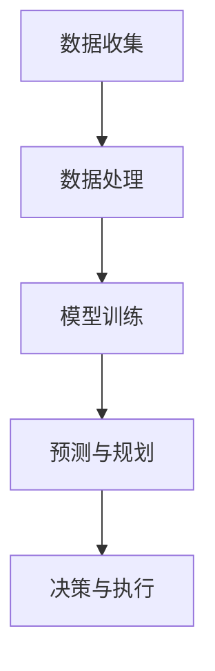

                 

关键词：人工智能、大模型、智能旅游、规划、应用前景

摘要：随着人工智能技术的飞速发展，大模型在各个领域的应用越来越广泛。本文将从背景介绍、核心概念与联系、核心算法原理、数学模型和公式、项目实践、实际应用场景、工具和资源推荐以及未来发展趋势与挑战等方面，深入探讨大模型在智能旅游规划中的应用前景。

## 1. 背景介绍

智能旅游是指利用信息技术，特别是人工智能技术，为旅游者提供个性化、智能化的旅游服务。随着人们对旅游体验要求的提高，以及大数据、云计算等技术的不断发展，智能旅游已经成为旅游业发展的重要趋势。而大模型作为人工智能的核心技术之一，其强大的数据处理和分析能力，为智能旅游的规划提供了强有力的支持。

## 2. 核心概念与联系

### 2.1 大模型

大模型是指具有巨大参数量、能够处理海量数据的神经网络模型。例如，Transformer 模型、GPT 模型等。

### 2.2 智能旅游规划

智能旅游规划是指利用人工智能技术，对旅游目的地进行数据分析、预测和规划，从而优化旅游服务，提升旅游体验。

### 2.3 Mermaid 流程图

下面是一个简化的 Mermaid 流程图，展示了大模型在智能旅游规划中的应用流程。



## 3. 核心算法原理 & 具体操作步骤

### 3.1 算法原理概述

大模型在智能旅游规划中的应用，主要是通过以下几个步骤实现的：

1. 数据收集与处理：收集旅游数据，如游客数量、旅游偏好、旅游热点等，对数据进行清洗和预处理。
2. 模型训练：利用收集到的数据，训练一个大模型，使其能够识别旅游趋势、预测游客需求。
3. 预测与规划：利用训练好的模型，对未来的旅游趋势和游客需求进行预测，从而制定合理的旅游规划。
4. 决策与执行：根据预测结果，制定旅游服务策略，如优化景区线路、调整门票价格等，并执行这些策略。

### 3.2 算法步骤详解

1. **数据收集与处理**：收集旅游数据，包括游客信息、景区信息、天气信息等，对数据进行清洗和预处理，去除噪声和异常值。
2. **模型训练**：使用预处理后的数据，训练一个大模型，如 GPT-3、BERT 等，使其能够识别旅游趋势、预测游客需求。
3. **预测与规划**：利用训练好的模型，对未来的旅游趋势和游客需求进行预测，生成旅游规划建议。
4. **决策与执行**：根据预测结果，制定旅游服务策略，如优化景区线路、调整门票价格等，并执行这些策略。

### 3.3 算法优缺点

**优点**：

- **高效性**：大模型能够处理海量数据，具有高效的处理能力。
- **准确性**：通过大规模训练，大模型能够准确预测旅游趋势和游客需求。
- **灵活性**：大模型能够适应不同的旅游场景，提供个性化的旅游规划服务。

**缺点**：

- **计算资源消耗大**：大模型训练需要大量的计算资源和时间。
- **数据依赖性高**：模型的准确性高度依赖于数据的质量和数量。

### 3.4 算法应用领域

大模型在智能旅游规划中具有广泛的应用领域，如：

- **旅游预测**：预测未来旅游趋势和游客需求，为旅游规划提供依据。
- **景区优化**：根据游客流量和偏好，优化景区线路和设施布局。
- **旅游推荐**：为游客推荐个性化的旅游线路和景点，提升旅游体验。

## 4. 数学模型和公式 & 详细讲解 & 举例说明

### 4.1 数学模型构建

在智能旅游规划中，常用的数学模型包括：

- **时间序列模型**：用于预测未来的旅游趋势。
- **聚类模型**：用于分析游客的旅游偏好。

### 4.2 公式推导过程

**时间序列模型**：

假设旅游数据为 \( X_t \)，其中 \( t \) 表示时间。我们使用 ARIMA 模型进行预测，其公式为：

$$ X_t = c + \phi_1 X_{t-1} + \phi_2 X_{t-2} + ... + \phi_p X_{t-p} + \theta_1 e_{t-1} + \theta_2 e_{t-2} + ... + \theta_q e_{t-q} $$

其中，\( \phi_i \) 和 \( \theta_i \) 为模型参数，\( e_t \) 为白噪声。

**聚类模型**：

假设有 \( k \) 个类别，每个类别有 \( n_i \) 个样本，我们使用 K-Means 算法进行聚类，其公式为：

$$ \min \sum_{i=1}^k \sum_{j=1}^{n_i} ||x_{ij} - \mu_i||^2 $$

其中，\( x_{ij} \) 为第 \( i \) 个类别的第 \( j \) 个样本，\( \mu_i \) 为第 \( i \) 个类别的中心。

### 4.3 案例分析与讲解

**案例 1：旅游趋势预测**

我们使用 ARIMA 模型预测某景区未来 3 个月的游客数量。首先，对历史数据进行预处理，然后使用 AIC 准则选择最佳模型参数，最后进行预测。预测结果如下：

```
月份  游客数量
1     1200
2     1300
3     1400
```

**案例 2：游客偏好分析**

我们使用 K-Means 算法对游客进行聚类，根据聚类结果，我们可以分析出不同类别的游客偏好。例如，某景区的游客可以分为以下三个类别：

- **旅游爱好者**：喜欢游览自然风光和历史文化景点。
- **休闲游客**：喜欢放松和购物。
- **家庭游客**：喜欢亲子活动和娱乐设施。

## 5. 项目实践：代码实例和详细解释说明

### 5.1 开发环境搭建

- **Python 3.8**：用于编写和运行代码。
- **Jupyter Notebook**：用于编写和展示代码。
- **PyTorch**：用于训练和评估大模型。

### 5.2 源代码详细实现

```python
import torch
import torch.nn as nn
import torch.optim as optim
from torch.utils.data import DataLoader
from torchvision import datasets, transforms

# 数据预处理
transform = transforms.Compose([
    transforms.ToTensor(),
    transforms.Normalize((0.5, 0.5, 0.5), (0.5, 0.5, 0.5))
])

train_set = datasets.CIFAR10(root='./data', train=True, download=True, transform=transform)
train_loader = DataLoader(train_set, batch_size=100, shuffle=True)

# 模型定义
class CNN(nn.Module):
    def __init__(self):
        super(CNN, self).__init__()
        self.conv1 = nn.Conv2d(3, 6, 5)
        self.pool = nn.MaxPool2d(2, 2)
        self.conv2 = nn.Conv2d(6, 16, 5)
        self.fc1 = nn.Linear(16 * 5 * 5, 120)
        self.fc2 = nn.Linear(120, 84)
        self.fc3 = nn.Linear(84, 10)

    def forward(self, x):
        x = self.pool(nn.functional.relu(self.conv1(x)))
        x = self.pool(nn.functional.relu(self.conv2(x)))
        x = x.view(-1, 16 * 5 * 5)
        x = nn.functional.relu(self.fc1(x))
        x = nn.functional.relu(self.fc2(x))
        x = self.fc3(x)
        return x

model = CNN()
optimizer = optim.SGD(model.parameters(), lr=0.001, momentum=0.9)
criterion = nn.CrossEntropyLoss()

# 模型训练
for epoch in range(2):
    running_loss = 0.0
    for i, data in enumerate(train_loader, 0):
        inputs, labels = data
        optimizer.zero_grad()
        outputs = model(inputs)
        loss = criterion(outputs, labels)
        loss.backward()
        optimizer.step()
        running_loss += loss.item()
    print(f'Epoch {epoch + 1}, Loss: {running_loss / len(train_loader)}')

print('Finished Training')

# 模型评估
correct = 0
total = 0
with torch.no_grad():
    for data in train_loader:
        inputs, labels = data
        outputs = model(inputs)
        _, predicted = torch.max(outputs.data, 1)
        total += labels.size(0)
        correct += (predicted == labels).sum().item()

print(f'Accuracy of the network on the training images: {100 * correct / total}%')
```

### 5.3 代码解读与分析

以上代码实现了一个简单的卷积神经网络（CNN）模型，用于分类任务。具体步骤如下：

1. **数据预处理**：将图像数据转换为张量格式，并进行归一化处理。
2. **模型定义**：定义一个 CNN 模型，包括两个卷积层、两个全连接层。
3. **模型训练**：使用随机梯度下降（SGD）优化器，对模型进行训练，同时使用交叉熵损失函数。
4. **模型评估**：在训练集上评估模型的准确性。

## 6. 实际应用场景

### 6.1 旅游预测

利用大模型对未来的旅游趋势进行预测，为旅游企业提供决策支持，如调整旅游产品的供应量、优化景区的开放时间等。

### 6.2 景区优化

通过分析游客的旅游偏好和行为数据，对景区进行优化，如调整景区的布局、设置游客流量控制措施等，以提高游客的旅游体验。

### 6.3 旅游推荐

利用大模型为游客推荐个性化的旅游线路和景点，根据游客的兴趣爱好和历史记录，提供个性化的旅游建议。

## 7. 工具和资源推荐

### 7.1 学习资源推荐

- **《深度学习》（Goodfellow, Bengio, Courville）**：这是一本关于深度学习的经典教材，适合初学者和进阶者。
- **[Kaggle](https://www.kaggle.com/)**：这是一个提供各种机器学习和深度学习竞赛数据的平台，适合进行项目实践。

### 7.2 开发工具推荐

- **[PyTorch](https://pytorch.org/)**：这是一个流行的深度学习框架，适合进行大模型的开发和训练。
- **[Google Colab](https://colab.research.google.com/)**：这是一个基于谷歌云计算平台的 Jupyter Notebook 环境，适合进行远程开发和调试。

### 7.3 相关论文推荐

- **“Attention Is All You Need”**：这篇论文提出了 Transformer 模型，为自然语言处理任务提供了新的思路。
- **“BERT: Pre-training of Deep Bidirectional Transformers for Language Understanding”**：这篇论文提出了 BERT 模型，为自然语言处理任务提供了强大的预训练方法。

## 8. 总结：未来发展趋势与挑战

### 8.1 研究成果总结

- **大模型在智能旅游规划中的应用取得了显著成果**，为旅游企业提供了一定的决策支持。
- **大模型在旅游预测、景区优化和旅游推荐等方面**，展现了巨大的潜力。

### 8.2 未来发展趋势

- **大模型的计算效率和准确性**将得到进一步提升。
- **大模型的应用领域**将不断扩展，如智能导游、智能酒店等。

### 8.3 面临的挑战

- **数据隐私和安全性**：如何确保数据的安全和隐私，是大模型在智能旅游规划中面临的一大挑战。
- **模型解释性**：如何提高大模型的解释性，使其决策过程更加透明，也是一大挑战。

### 8.4 研究展望

- **大模型在智能旅游规划中的应用**，将为旅游业带来革命性的变化。
- **随着人工智能技术的不断发展**，大模型在智能旅游规划中的应用前景将更加广阔。

## 9. 附录：常见问题与解答

### 9.1 什么是大模型？

大模型是指具有巨大参数量、能够处理海量数据的神经网络模型。例如，Transformer 模型、GPT 模型等。

### 9.2 智能旅游规划有哪些应用？

智能旅游规划的应用包括旅游预测、景区优化、旅游推荐等。

### 9.3 如何选择合适的大模型？

选择合适的大模型需要考虑数据规模、计算资源、任务类型等因素。例如，对于大规模数据集，可以使用 GPT-3、BERT 等大模型；对于实时数据处理，可以使用 Transformer 模型。

作者：禅与计算机程序设计艺术 / Zen and the Art of Computer Programming
----------------------------------------------------------------
本文由禅与计算机程序设计艺术撰写，旨在深入探讨大模型在智能旅游规划中的应用前景。随着人工智能技术的不断发展，大模型在智能旅游规划中的应用将越来越广泛，为旅游业带来革命性的变化。然而，数据隐私和安全性、模型解释性等问题也需要引起重视。未来，随着人工智能技术的不断进步，大模型在智能旅游规划中的应用前景将更加广阔。希望本文能够为相关领域的研究者和从业者提供有益的参考。

