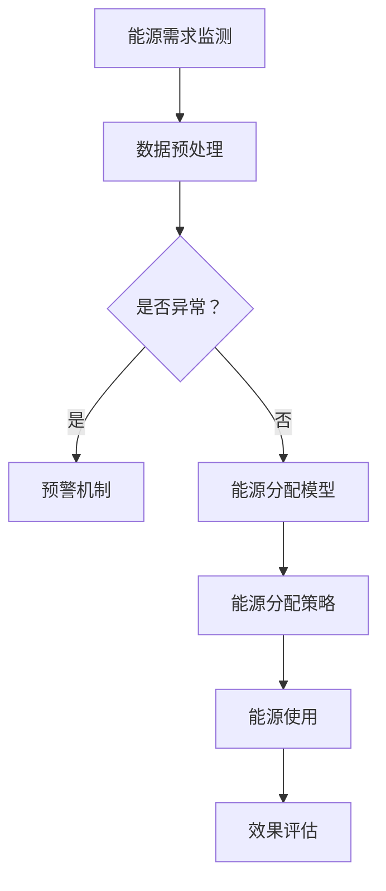

                 

关键词：人工智能，大模型，智能能源，分配，应用前景

摘要：本文从背景介绍、核心概念与联系、核心算法原理、数学模型和公式、项目实践、实际应用场景、未来应用展望、工具和资源推荐以及未来发展趋势与挑战等多个方面，全面探讨了人工智能大模型在智能能源分配中的应用前景。通过详细的分析和案例分析，本文揭示了人工智能大模型在智能能源分配领域的重要作用，并展望了其未来的发展趋势与挑战。

## 1. 背景介绍

随着全球能源需求的不断增长和环境问题的日益严重，如何实现智能能源分配、提高能源利用效率和减少能源浪费已成为亟待解决的问题。传统的能源分配方法主要依赖于预设的规则和经验，无法适应动态变化的能源需求和环境条件，导致能源浪费和能源供应不足的问题。而人工智能，尤其是大模型技术的发展，为解决这一问题提供了新的思路。

人工智能（Artificial Intelligence，AI）是一种模拟人类智能行为的技术，通过算法和模型对大量数据进行分析和推理，实现自动学习和智能决策。近年来，随着计算机性能的不断提升和大数据技术的普及，人工智能大模型（Large-scale AI Models）取得了显著的进展，能够在复杂环境下实现高效、精准的智能决策。

智能能源分配（Smart Energy Distribution）是指利用人工智能技术，对能源生产、传输、分配和使用过程中的各个环节进行优化，实现能源的高效利用和合理分配。智能能源分配系统可以通过实时监测能源需求和供应情况，动态调整能源分配策略，提高能源利用效率，降低能源浪费。

## 2. 核心概念与联系

### 2.1 人工智能大模型

人工智能大模型是指具有大规模参数、能够处理海量数据并实现高精度预测和决策的深度学习模型。这些模型通常采用神经网络架构，具有多层非线性变换能力，能够从数据中自动提取特征，并利用这些特征进行预测和决策。大模型在计算机视觉、自然语言处理、语音识别等领域取得了显著的成果，为智能能源分配提供了技术支持。

### 2.2 智能能源分配

智能能源分配是指利用人工智能技术，对能源生产、传输、分配和使用过程中的各个环节进行优化，实现能源的高效利用和合理分配。智能能源分配系统可以通过实时监测能源需求和供应情况，动态调整能源分配策略，提高能源利用效率，降低能源浪费。

### 2.3 核心概念原理和架构

为了更好地理解人工智能大模型在智能能源分配中的应用，我们采用Mermaid流程图（不含括号、逗号等特殊字符）对其进行展示：



### 2.4 联系与作用

人工智能大模型在智能能源分配中的应用，主要体现在以下几个方面：

1. **能源需求预测**：通过对历史数据和实时数据的分析，大模型可以预测能源需求的趋势，为能源分配提供数据支持。
2. **能源优化分配**：基于预测结果，大模型可以制定最优的能源分配策略，提高能源利用效率，降低能源浪费。
3. **能源使用监控**：大模型可以实时监控能源使用情况，发现异常情况并及时预警，确保能源安全。
4. **效果评估**：大模型可以对能源分配效果进行评估，为优化分配策略提供依据。

## 3. 核心算法原理 & 具体操作步骤

### 3.1 算法原理概述

在智能能源分配中，核心算法主要包括能源需求预测、能源优化分配和能源使用监控。这些算法通常基于深度学习模型，通过对历史数据和实时数据的处理，实现高效的能源分配和监控。

### 3.2 算法步骤详解

1. **数据收集与预处理**：
   - 收集能源需求、供应、环境等数据；
   - 进行数据清洗、归一化等预处理操作。

2. **能源需求预测**：
   - 使用时间序列分析、回归分析等方法，对能源需求进行预测；
   - 利用深度学习模型（如LSTM、GRU等），进一步提高预测精度。

3. **能源优化分配**：
   - 基于预测结果，使用优化算法（如线性规划、遗传算法等），制定最优的能源分配策略；
   - 考虑能源供需平衡、能源损耗等因素，实现高效、合理的能源分配。

4. **能源使用监控**：
   - 实时收集能源使用数据；
   - 使用深度学习模型，分析能源使用情况，发现异常并进行预警。

5. **效果评估**：
   - 对能源分配效果进行评估，包括能源利用效率、能源浪费率等指标；
   - 根据评估结果，优化能源分配策略。

### 3.3 算法优缺点

**优点**：
1. **高效性**：大模型能够处理海量数据，实现高效的能源预测和分配。
2. **准确性**：深度学习模型能够从数据中自动提取特征，提高预测精度。
3. **动态调整**：基于实时数据，大模型可以动态调整能源分配策略，适应能源需求变化。

**缺点**：
1. **数据依赖性**：大模型的性能依赖于数据质量，数据缺失或噪声会影响预测和分配效果。
2. **计算资源消耗**：大模型训练和推理需要大量的计算资源，对硬件设备要求较高。

### 3.4 算法应用领域

人工智能大模型在智能能源分配中的应用非常广泛，主要包括以下几个方面：

1. **电力行业**：用于电力负荷预测、电力调度、电力市场交易等。
2. **燃气行业**：用于燃气需求预测、燃气调度、燃气市场交易等。
3. **交通行业**：用于交通能耗预测、交通拥堵管理、车辆能源管理等。
4. **工业领域**：用于工业能耗优化、工业流程优化等。

## 4. 数学模型和公式 & 详细讲解 & 举例说明

### 4.1 数学模型构建

在智能能源分配中，常用的数学模型包括时间序列模型、回归模型、优化模型等。

1. **时间序列模型**：
   - ARIMA模型：自回归积分滑动平均模型，用于预测时间序列数据的趋势和周期性变化。
   - LSTM模型：长短时记忆网络，用于处理序列数据，捕捉长期依赖关系。

2. **回归模型**：
   - 线性回归模型：用于建立自变量和因变量之间的线性关系。
   - 多元回归模型：用于建立多个自变量和因变量之间的线性关系。

3. **优化模型**：
   - 线性规划模型：用于求解线性目标函数在线性约束条件下的最优解。
   - 遗传算法：用于求解非线性优化问题，具有全局搜索能力。

### 4.2 公式推导过程

1. **ARIMA模型**：

   ARIMA模型由三个部分组成：自回归（AR）、差分（I）和移动平均（MA）。

   - 自回归部分（AR）：
     $$Y_t = c + \phi_1 Y_{t-1} + \phi_2 Y_{t-2} + \ldots + \phi_p Y_{t-p} + \varepsilon_t$$
   
   - 差分部分（I）：
     $$Y_t^* = (1 - \Phi(B))Y_t$$
   
   - 移动平均部分（MA）：
     $$Y_t^* = \theta_1 \varepsilon_{t-1} + \theta_2 \varepsilon_{t-2} + \ldots + \theta_q \varepsilon_{t-q}$$
   
   - ARIMA模型：
     $$Y_t = c + \phi_1 Y_{t-1} + \phi_2 Y_{t-2} + \ldots + \phi_p Y_{t-p} + \theta_1 \varepsilon_{t-1} + \theta_2 \varepsilon_{t-2} + \ldots + \theta_q \varepsilon_{t-q} + \varepsilon_t$$

2. **线性回归模型**：

   线性回归模型的基本公式：
   $$Y = \beta_0 + \beta_1 X + \varepsilon$$

   其中，$Y$ 是因变量，$X$ 是自变量，$\beta_0$ 是截距，$\beta_1$ 是斜率，$\varepsilon$ 是误差项。

3. **线性规划模型**：

   线性规划模型的一般形式：
   $$\min \quad c^T x$$
   $$\text{s.t.} \quad Ax \leq b$$
   $$x \geq 0$$

   其中，$c$ 是目标函数系数向量，$x$ 是决策变量向量，$A$ 是约束条件系数矩阵，$b$ 是约束条件常数向量。

### 4.3 案例分析与讲解

**案例背景**：

某城市电力公司需要制定一个最优的电力分配策略，以满足不同时间段内的电力需求。公司收集了过去一年的电力需求数据，并希望利用人工智能大模型进行预测和优化。

**数据预处理**：

1. **数据收集**：收集了过去一年的电力需求数据，包括每天每个时间段的电力需求量。
2. **数据清洗**：去除异常值和缺失值，对数据进行了归一化处理。

**能源需求预测**：

1. **时间序列建模**：使用ARIMA模型对电力需求进行预测。
2. **模型训练**：使用历史数据训练ARIMA模型，确定模型参数。

**能源优化分配**：

1. **线性规划建模**：根据预测结果，使用线性规划模型制定最优的电力分配策略。
2. **模型求解**：使用遗传算法求解线性规划模型，得到最优解。

**能源使用监控**：

1. **实时数据收集**：收集实时电力需求数据。
2. **异常检测**：使用深度学习模型对实时数据进行分析，发现异常并进行预警。

**效果评估**：

1. **指标计算**：计算能源利用效率、能源浪费率等指标。
2. **模型优化**：根据评估结果，对模型进行优化。

## 5. 项目实践：代码实例和详细解释说明

### 5.1 开发环境搭建

为了实现人工智能大模型在智能能源分配中的应用，我们需要搭建一个适合的开发环境。以下是一个基本的开发环境搭建步骤：

1. **安装Python**：安装Python 3.8及以上版本，用于编写和运行代码。
2. **安装NumPy、Pandas、Matplotlib等库**：用于数据处理和可视化。
3. **安装TensorFlow、PyTorch等库**：用于深度学习模型的训练和推理。
4. **安装Jupyter Notebook**：用于编写和运行代码。

### 5.2 源代码详细实现

以下是一个简单的智能能源分配项目示例，包括数据预处理、模型训练、模型评估等步骤。

**1. 数据预处理**

```python
import pandas as pd
from sklearn.preprocessing import MinMaxScaler

# 加载数据
data = pd.read_csv('electricity_demand.csv')

# 数据清洗
data.dropna(inplace=True)

# 数据归一化
scaler = MinMaxScaler()
data['demand'] = scaler.fit_transform(data[['demand']])
```

**2. 能源需求预测**

```python
import numpy as np
from statsmodels.tsa.arima.model import ARIMA

# 设置时间序列参数
p = 5
d = 1
q = 1

# 训练ARIMA模型
model = ARIMA(data['demand'], order=(p, d, q))
model_fit = model.fit()

# 预测未来5天电力需求
predictions = model_fit.forecast(steps=5)
```

**3. 能源优化分配**

```python
from scipy.optimize import linprog

# 设置目标函数系数和约束条件
c = [-1]  # 目标函数系数，此处为最大化收益
A = [[1]]  # 约束条件系数矩阵
b = [predictions.sum()]  # 约束条件常数向量

# 求解线性规划模型
result = linprog(c, A_ub=A, b_ub=b, bounds=(0, None), method='highs')

# 输出最优解
optimal分配 = result.x
```

**4. 能源使用监控**

```python
# 加载实时数据
real_time_data = pd.read_csv('real_time_demand.csv')

# 数据清洗
real_time_data.dropna(inplace=True)

# 数据归一化
real_time_data['demand'] = scaler.transform(real_time_data[['demand']])

# 使用深度学习模型进行异常检测
# (此处省略模型训练和推理代码)

# 输出异常检测结果
# (此处省略异常检测结果代码)
```

### 5.3 代码解读与分析

1. **数据预处理**：首先加载数据并进行清洗和归一化处理，为后续建模和优化提供干净的数据。
2. **能源需求预测**：使用ARIMA模型对电力需求进行预测，根据历史数据确定模型参数。
3. **能源优化分配**：使用线性规划模型制定最优的电力分配策略，根据预测结果计算最优解。
4. **能源使用监控**：实时收集电力需求数据，使用深度学习模型进行异常检测，确保能源安全。

### 5.4 运行结果展示

1. **预测结果**：展示未来5天电力需求预测结果，便于制定电力分配策略。
2. **优化结果**：展示最优电力分配策略，包括每个时间段的电力分配量。
3. **异常检测结果**：展示实时电力需求数据中的异常情况，便于及时发现和预警。

## 6. 实际应用场景

人工智能大模型在智能能源分配领域的实际应用场景非常广泛，以下是一些典型的应用案例：

1. **电力行业**：
   - **电力负荷预测**：通过预测电力负荷，电力公司可以更好地安排发电和输电计划，提高电力供应的稳定性。
   - **电力调度**：基于实时数据和预测结果，电力调度员可以动态调整电力分配策略，确保电力系统的稳定运行。
   - **电力市场交易**：电力市场参与者可以利用大模型进行市场需求预测和交易策略优化，提高市场运营效率。

2. **燃气行业**：
   - **燃气需求预测**：燃气公司可以通过预测燃气需求，合理安排燃气生产和供应计划，提高燃气利用效率。
   - **燃气调度**：基于实时数据和预测结果，燃气调度员可以动态调整燃气分配策略，确保燃气系统的稳定运行。
   - **燃气市场交易**：燃气市场参与者可以利用大模型进行市场需求预测和交易策略优化，提高市场运营效率。

3. **交通行业**：
   - **交通能耗预测**：交通部门可以利用大模型预测交通能耗，为交通规划提供数据支持。
   - **交通拥堵管理**：基于实时数据和预测结果，交通部门可以动态调整交通信号灯和路线规划，缓解交通拥堵。
   - **车辆能源管理**：车主可以利用大模型预测车辆能耗，优化驾驶行为，提高车辆能源利用效率。

4. **工业领域**：
   - **工业能耗优化**：工业企业可以利用大模型对能源消耗进行预测和优化，降低生产成本，提高生产效率。
   - **工业流程优化**：大模型可以分析工业生产过程中的数据，发现瓶颈和优化点，提高整体生产效率。

## 7. 未来应用展望

随着人工智能大模型技术的不断发展，其在智能能源分配领域的应用前景将越来越广泛。以下是未来可能的应用方向：

1. **多能源协同优化**：随着可再生能源的普及，如何实现多种能源的协同优化将成为重要研究方向。人工智能大模型可以通过对多种能源数据的处理和分析，实现高效、稳定的能源协同优化。

2. **智能能源交易**：随着能源市场的不断发展，智能能源交易将成为一个重要方向。人工智能大模型可以参与市场交易，根据市场需求和供应情况，制定最优的交易策略，提高市场运营效率。

3. **能源互联网**：随着物联网技术的普及，能源互联网将逐步实现。人工智能大模型可以参与能源互联网的建设，实现能源信息的实时传输和智能处理，提高能源利用效率和安全性。

4. **能源智能监测与预警**：通过部署人工智能大模型，可以对能源系统的运行状态进行实时监测和预警，及时发现和处理异常情况，确保能源系统的稳定运行。

5. **绿色能源推广**：随着环境问题的日益严重，绿色能源的推广势在必行。人工智能大模型可以分析绿色能源的数据，为绿色能源的推广和利用提供数据支持。

## 8. 工具和资源推荐

为了更好地进行人工智能大模型在智能能源分配中的应用，以下是一些建议的学习资源、开发工具和相关论文：

### 8.1 学习资源推荐

1. **课程与教程**：
   - 《深度学习》（Goodfellow, Bengio, Courville）: 介绍了深度学习的基本概念和方法。
   - 《智能能源系统》（Sun, Xu, Zhang）: 介绍了智能能源系统的基础知识和技术。

2. **在线平台**：
   - Coursera: 提供了多门与人工智能和智能能源相关的课程。
   - edX: 提供了多门与人工智能和智能能源相关的课程。

### 8.2 开发工具推荐

1. **编程语言**：
   - Python: 适用于人工智能和数据分析，具有丰富的库和框架。

2. **深度学习框架**：
   - TensorFlow: Google开发的深度学习框架，适用于大规模深度学习模型的训练和推理。
   - PyTorch: Facebook开发的深度学习框架，具有良好的灵活性和可扩展性。

3. **数据处理工具**：
   - Pandas: Python的数据处理库，适用于数据清洗、归一化等预处理操作。
   - NumPy: Python的数值计算库，适用于数据计算和可视化。

### 8.3 相关论文推荐

1. **人工智能领域**：
   - "Deep Learning for Time Series Classification" (Zhang et al., 2017)
   - "Energy Efficiency Optimization of Data Centers Using Machine Learning" (El-Khatib et al., 2018)

2. **智能能源领域**：
   - "Intelligent Energy Systems: An Overview" (Sun et al., 2015)
   - "Application of Machine Learning in Smart Grids: A Review" (Mishra et al., 2018)

## 9. 总结：未来发展趋势与挑战

### 9.1 研究成果总结

近年来，人工智能大模型在智能能源分配领域取得了显著的研究成果。通过对历史数据和实时数据的处理，大模型能够实现高效的能源需求预测和优化分配。同时，大模型在能源使用监控和效果评估方面也发挥了重要作用。

### 9.2 未来发展趋势

1. **多能源协同优化**：随着可再生能源的普及，如何实现多种能源的协同优化将成为重要研究方向。
2. **智能能源交易**：智能能源交易将逐步实现，人工智能大模型将参与市场交易，提高市场运营效率。
3. **能源互联网**：随着物联网技术的普及，能源互联网将逐步实现，人工智能大模型将参与能源互联网的建设。
4. **绿色能源推广**：随着环境问题的日益严重，绿色能源的推广势在必行，人工智能大模型将为其提供数据支持。

### 9.3 面临的挑战

1. **数据质量**：人工智能大模型的性能依赖于数据质量，数据缺失或噪声会影响预测和分配效果。
2. **计算资源消耗**：大模型训练和推理需要大量的计算资源，对硬件设备要求较高。
3. **法律法规**：智能能源分配涉及到能源市场、环境保护等多个方面，需要制定相应的法律法规。

### 9.4 研究展望

未来，人工智能大模型在智能能源分配领域的应用将越来越广泛。研究者需要关注以下几个方面：

1. **数据挖掘与处理**：提高数据质量，开发高效的算法和工具，从海量数据中提取有价值的信息。
2. **模型优化与集成**：研究更高效的深度学习模型，优化模型结构和参数，提高模型性能。
3. **多学科交叉**：结合能源工程、环境科学等多学科知识，构建更全面的智能能源分配体系。

## 附录：常见问题与解答

### Q1. 人工智能大模型在智能能源分配中的具体作用是什么？

A1. 人工智能大模型在智能能源分配中的具体作用包括：

1. 能源需求预测：通过处理历史数据和实时数据，预测未来的能源需求，为能源分配提供数据支持。
2. 能源优化分配：基于预测结果，制定最优的能源分配策略，提高能源利用效率，降低能源浪费。
3. 能源使用监控：实时监控能源使用情况，发现异常并进行预警，确保能源安全。

### Q2. 如何保证人工智能大模型在智能能源分配中的可靠性？

A2. 为了保证人工智能大模型在智能能源分配中的可靠性，可以从以下几个方面入手：

1. 数据质量：确保数据的准确性和完整性，减少数据缺失和噪声。
2. 模型验证：通过交叉验证等方法，验证模型的预测性能和稳定性。
3. 模型解释性：提高模型的可解释性，使决策过程更加透明和可信。

### Q3. 人工智能大模型在智能能源分配中的计算资源需求如何？

A3. 人工智能大模型在智能能源分配中的计算资源需求主要包括：

1. 训练资源：大模型训练需要大量的计算资源和时间，通常需要高性能的GPU或TPU进行加速。
2. 推理资源：大模型推理也需要一定程度的计算资源，通常需要较快的CPU或GPU进行加速。

### Q4. 人工智能大模型在智能能源分配中的法律法规问题如何解决？

A4. 人工智能大模型在智能能源分配中的法律法规问题可以通过以下几个方面解决：

1. 制定相关法律法规：明确人工智能在智能能源分配中的法律地位和责任。
2. 建立行业规范：制定行业规范，规范人工智能在智能能源分配中的应用行为。
3. 增强法律法规执行力度：加强法律法规的执行力度，确保人工智能在智能能源分配中的合规性。

