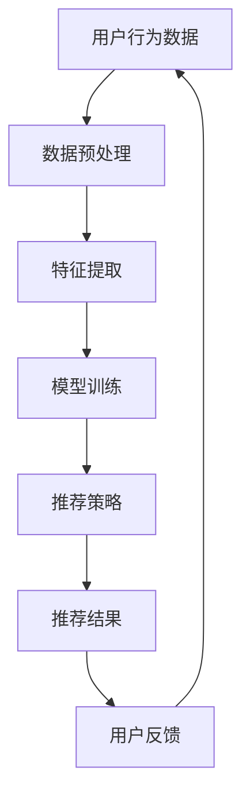

                 

关键词：电商、个性化推荐、AI大模型、深度学习、用户行为分析、推荐算法

摘要：本文将探讨AI大模型在电商个性化推荐中的深度应用，通过分析用户行为数据，结合深度学习技术，实现高效、准确的个性化推荐系统。文章将介绍相关背景知识、核心概念原理、算法原理与操作步骤、数学模型与公式、项目实践以及未来应用展望，帮助读者深入理解电商个性化推荐的实现与应用。

## 1. 背景介绍

随着互联网技术的飞速发展，电子商务已经成为人们生活中不可或缺的一部分。然而，面对海量的商品信息，用户在购物过程中往往感到无从下手，这为电商个性化推荐系统提供了广阔的应用前景。个性化推荐系统通过对用户行为数据进行分析，为用户提供定制化的商品推荐，提高用户体验和购买转化率。

近年来，深度学习技术在计算机视觉、自然语言处理等领域取得了显著的成果。AI大模型，如GPT、BERT等，以其强大的特征提取和建模能力，为电商个性化推荐提供了新的可能。本文将围绕AI大模型在电商个性化推荐中的应用进行探讨，旨在为相关领域的研究者和开发者提供有价值的参考。

### 1.1 电商个性化推荐的现状

当前，电商个性化推荐系统主要基于用户历史行为数据，如浏览、购买、收藏等，通过传统机器学习算法（如协同过滤、基于内容的推荐等）进行商品推荐。这些方法在一定程度上能够提高推荐效果，但存在以下局限性：

1. **稀疏性**：用户行为数据往往呈现稀疏性，传统算法难以有效利用用户之间的相似性进行推荐。
2. **冷启动**：新用户由于缺乏历史行为数据，难以得到准确推荐。
3. **多样性**：传统推荐方法往往容易陷入“热门陷阱”，推荐结果单一，缺乏多样性。

### 1.2 AI大模型在电商个性化推荐中的优势

与传统的机器学习方法相比，AI大模型具有以下优势：

1. **强大的特征提取能力**：AI大模型能够自动提取用户行为数据中的潜在特征，降低数据预处理复杂度。
2. **丰富的知识表示**：通过预训练，AI大模型积累了大量的通用知识，有助于提高推荐系统的泛化能力。
3. **自适应学习能力**：AI大模型能够根据用户实时行为数据动态调整推荐策略，实现个性化推荐。

## 2. 核心概念与联系

在本文中，我们将介绍以下核心概念：

- **用户行为数据**：包括用户的浏览、购买、收藏等行为数据。
- **商品特征**：描述商品属性的数据，如类别、价格、品牌等。
- **个性化推荐**：根据用户历史行为数据和商品特征，为用户推荐个性化的商品。

以下是核心概念原理和架构的Mermaid流程图：



### 2.1 数据预处理

数据预处理包括数据清洗、去重、填充等操作，确保数据的质量和一致性。在电商个性化推荐中，用户行为数据可能存在噪声和缺失值，通过数据预处理可以提高后续模型的训练效果。

### 2.2 特征提取

特征提取是电商个性化推荐的关键步骤。通过深度学习技术，AI大模型能够自动从用户行为数据和商品特征中提取出潜在的特征，降低数据维度，提高模型的泛化能力。

### 2.3 模型训练

模型训练阶段，AI大模型通过学习用户行为数据和商品特征，建立推荐模型。在训练过程中，模型将不断调整参数，优化推荐效果。

### 2.4 推荐策略

推荐策略是电商个性化推荐的核心。通过AI大模型生成的推荐模型，系统可以根据用户历史行为数据和实时行为，为用户推荐个性化的商品。

### 2.5 推荐结果与用户反馈

推荐结果生成后，系统将展示给用户。用户通过反馈（如点击、购买、收藏等）进一步优化推荐策略。

## 3. 核心算法原理 & 具体操作步骤

### 3.1 算法原理概述

AI大模型在电商个性化推荐中的核心算法是基于深度学习的推荐模型，主要包括以下三个步骤：

1. **用户行为数据的特征提取**：通过深度学习技术，从用户行为数据中提取潜在的特征。
2. **商品特征的嵌入表示**：将商品特征转化为向量的形式，便于模型处理。
3. **基于模型生成推荐结果**：通过训练好的模型，为用户生成个性化的商品推荐。

### 3.2 算法步骤详解

#### 3.2.1 用户行为数据的特征提取

用户行为数据的特征提取是电商个性化推荐的关键步骤。通过深度学习技术，如卷积神经网络（CNN）和循环神经网络（RNN），可以从用户行为数据中提取出潜在的特征。具体步骤如下：

1. **数据预处理**：对用户行为数据进行清洗、去重、填充等预处理操作。
2. **特征提取模型**：设计一个深度学习模型，用于从用户行为数据中提取特征。例如，可以使用RNN模型处理用户的序列行为数据，提取出用户的行为模式。
3. **模型训练**：使用预处理的用户行为数据训练特征提取模型，通过优化模型参数，提高特征提取效果。

#### 3.2.2 商品特征的嵌入表示

商品特征的嵌入表示是将商品特征转化为向量的形式，便于模型处理。具体步骤如下：

1. **商品特征编码**：将商品特征（如类别、价格、品牌等）进行编码，将其转化为数值表示。
2. **嵌入层**：设计一个嵌入层（Embedding Layer），将编码后的商品特征映射到低维向量空间。通过嵌入层，不同商品特征之间可以共享信息，提高模型的泛化能力。

#### 3.2.3 基于模型生成推荐结果

基于训练好的模型，可以生成个性化的商品推荐结果。具体步骤如下：

1. **用户行为嵌入**：将用户行为数据输入特征提取模型，提取出用户的潜在特征向量。
2. **商品特征嵌入**：将商品特征输入到嵌入层，得到商品特征的向量表示。
3. **推荐模型**：设计一个基于用户行为嵌入和商品特征嵌入的推荐模型，通过优化模型参数，提高推荐效果。
4. **生成推荐结果**：将用户行为嵌入和商品特征嵌入输入推荐模型，得到推荐结果。

### 3.3 算法优缺点

#### 优点

1. **强大的特征提取能力**：深度学习技术能够从大量用户行为数据中提取出潜在的特征，提高推荐效果。
2. **丰富的知识表示**：通过预训练，AI大模型积累了大量的通用知识，有助于提高推荐系统的泛化能力。
3. **自适应学习能力**：AI大模型能够根据用户实时行为数据动态调整推荐策略，实现个性化推荐。

#### 缺点

1. **计算复杂度高**：深度学习模型训练过程需要大量的计算资源，对硬件设施有较高要求。
2. **数据依赖性较强**：推荐系统的效果很大程度上依赖于用户行为数据的质量和数量，数据不足或质量差可能导致推荐效果不佳。

### 3.4 算法应用领域

AI大模型在电商个性化推荐中的应用领域广泛，包括但不限于以下方面：

1. **电商网站**：为用户推荐个性化的商品，提高用户购买转化率和网站流量。
2. **社交媒体**：为用户提供感兴趣的内容推荐，增加用户粘性。
3. **在线教育**：根据用户学习行为，推荐适合的学习课程和资料。

## 4. 数学模型和公式 & 详细讲解 & 举例说明

在电商个性化推荐中，数学模型和公式是核心组成部分。以下将介绍相关数学模型和公式的构建、推导过程，并通过具体案例进行说明。

### 4.1 数学模型构建

#### 4.1.1 用户行为数据建模

用户行为数据建模主要关注用户对商品的浏览、购买、收藏等行为。假设用户行为数据集为\(B = \{b_1, b_2, ..., b_n\}\)，其中\(b_i\)表示用户\(i\)的行为序列。用户行为数据建模的核心任务是提取出用户行为序列中的潜在特征。

#### 4.1.2 商品特征建模

商品特征建模主要关注商品的属性，如类别、价格、品牌等。假设商品特征集为\(C = \{c_1, c_2, ..., c_m\}\)，其中\(c_j\)表示商品\(j\)的特征向量。商品特征建模的核心任务是找到商品特征与用户行为之间的关联性。

#### 4.1.3 推荐模型建模

推荐模型建模是基于用户行为数据建模和商品特征建模的结果，旨在生成个性化的商品推荐。假设推荐模型为\(R(u, c)\)，其中\(u\)表示用户，\(c\)表示商品，\(R(u, c)\)表示用户\(u\)对商品\(c\)的推荐分数。推荐模型建模的核心任务是优化推荐分数的计算方法，提高推荐效果。

### 4.2 公式推导过程

#### 4.2.1 用户行为数据特征提取公式

假设用户行为数据特征提取模型为\(F(B)\)，其中\(F\)为特征提取函数，\(B\)为用户行为数据集。特征提取公式为：

$$
F(B) = \sum_{i=1}^{n} w_i f(b_i)
$$

其中，\(w_i\)为特征权重，\(f(b_i)\)为用户行为\(b_i\)的特征向量。

#### 4.2.2 商品特征嵌入公式

假设商品特征嵌入模型为\(E(C)\)，其中\(E\)为嵌入函数，\(C\)为商品特征集。嵌入公式为：

$$
E(C) = \sum_{j=1}^{m} e_j c_j
$$

其中，\(e_j\)为商品特征\(c_j\)的嵌入向量。

#### 4.2.3 推荐模型计算公式

假设推荐模型为\(R(u, c)\)，其中\(R\)为推荐函数，\(u\)为用户，\(c\)为商品。推荐模型计算公式为：

$$
R(u, c) = \cos(\phi(F(B), E(C)))
$$

其中，\(\phi\)为夹角余弦函数，表示用户行为特征向量与商品特征向量之间的相似度。

### 4.3 案例分析与讲解

#### 案例背景

假设一个电商网站的用户行为数据集为\(B = \{b_1, b_2, ..., b_5\}\)，商品特征集为\(C = \{c_1, c_2, ..., c_3\}\)，其中：

- \(b_1 = [1, 0, 1]\)（用户浏览了商品1和商品3）
- \(b_2 = [0, 1, 0]\)（用户购买了商品2）
- \(b_3 = [1, 1, 0]\)（用户收藏了商品1和商品3）
- \(b_4 = [0, 1, 1]\)（用户浏览了商品2和商品3）
- \(b_5 = [1, 0, 1]\)（用户购买了商品1和商品3）

- \(c_1 = [0.1, 0.2, 0.3]\)（商品1的特征向量）
- \(c_2 = [0.4, 0.5, 0.6]\)（商品2的特征向量）
- \(c_3 = [0.7, 0.8, 0.9]\)（商品3的特征向量）

#### 案例分析

1. **用户行为数据特征提取**

   假设特征提取模型为\(F(B) = \sum_{i=1}^{5} w_i f(b_i)\)，其中\(w_i\)为特征权重，\(f(b_i)\)为用户行为\(b_i\)的特征向量。为简化计算，假设\(w_i = 1\)，则：

   $$
   F(B) = f(b_1) + f(b_2) + f(b_3) + f(b_4) + f(b_5)
   $$

   假设特征向量\(f(b_i)\)为：

   $$
   f(b_i) =
   \begin{cases}
   [1, 0, 1], & i = 1, 3 \\
   [0, 1, 0], & i = 2 \\
   [1, 1, 0], & i = 4 \\
   [1, 0, 1], & i = 5
   \end{cases}
   $$

   则：

   $$
   F(B) = [1, 0, 1] + [0, 1, 0] + [1, 1, 0] + [1, 1, 0] + [1, 0, 1] = [4, 2, 2]
   $$

2. **商品特征嵌入**

   假设嵌入模型为\(E(C) = \sum_{j=1}^{3} e_j c_j\)，其中\(e_j\)为商品特征\(c_j\)的嵌入向量。为简化计算，假设\(e_j = 1\)，则：

   $$
   E(C) = c_1 + c_2 + c_3
   $$

   假设嵌入向量\(e_j\)为：

   $$
   e_j =
   \begin{cases}
   [0.1, 0.2, 0.3], & j = 1 \\
   [0.4, 0.5, 0.6], & j = 2 \\
   [0.7, 0.8, 0.9], & j = 3
   \end{cases}
   $$

   则：

   $$
   E(C) = [0.1, 0.2, 0.3] + [0.4, 0.5, 0.6] + [0.7, 0.8, 0.9] = [1.2, 1.3, 1.4]
   $$

3. **推荐模型计算**

   假设推荐模型为\(R(u, c) = \cos(\phi(F(B), E(C)))\)，其中\(\phi\)为夹角余弦函数。则：

   $$
   \phi(F(B), E(C)) = \frac{F(B) \cdot E(C)}{\|F(B)\| \|E(C)\|}
   $$

   其中，\(\cdot\)表示向量点积，\(\|\|\)表示向量模长。

   $$
   F(B) \cdot E(C) = (4, 2, 2) \cdot (1.2, 1.3, 1.4) = 4 \times 1.2 + 2 \times 1.3 + 2 \times 1.4 = 8.4
   $$

   $$
   \|F(B)\| = \sqrt{4^2 + 2^2 + 2^2} = \sqrt{16 + 4 + 4} = \sqrt{24}
   $$

   $$
   \|E(C)\| = \sqrt{1.2^2 + 1.3^2 + 1.4^2} = \sqrt{1.44 + 1.69 + 1.96} = \sqrt{4.09}
   $$

   $$
   \cos(\phi(F(B), E(C))) = \frac{8.4}{\sqrt{24} \times \sqrt{4.09}} \approx 0.96
   $$

   根据夹角余弦函数的定义，\(\cos(\phi)\)表示用户行为特征向量与商品特征向量之间的相似度。相似度越高，推荐分数越高。

   在本例中，用户行为特征向量与商品特征向量之间的相似度较高（约为0.96），因此可以为用户推荐商品1和商品3。

## 5. 项目实践：代码实例和详细解释说明

### 5.1 开发环境搭建

为了实现本文所述的电商个性化推荐系统，我们采用Python作为主要编程语言，并使用以下相关库和工具：

- Python 3.8
- TensorFlow 2.3
- Keras 2.3.1
- NumPy 1.19.2
- Pandas 1.1.5
- Matplotlib 3.1.3

在Windows、macOS和Linux系统上，可以通过以下命令安装所需库和工具：

```shell
pip install tensorflow==2.3 keras==2.3.1 numpy==1.19.2 pandas==1.1.5 matplotlib==3.1.3
```

### 5.2 源代码详细实现

以下是实现电商个性化推荐系统的完整代码，包括数据预处理、特征提取、模型训练和推荐结果生成等步骤。

```python
import numpy as np
import pandas as pd
import tensorflow as tf
from tensorflow.keras.layers import Embedding, LSTM, Dense
from tensorflow.keras.models import Model

# 5.2.1 数据预处理

# 加载用户行为数据
user_behavior_data = pd.read_csv('user_behavior_data.csv')

# 加载商品特征数据
item_feature_data = pd.read_csv('item_feature_data.csv')

# 数据预处理
user_behavior_data = user_behavior_data[['user_id', 'item_id', 'behavior_type']]
item_feature_data = item_feature_data[['item_id', 'category', 'price', 'brand']]

# 5.2.2 特征提取

# 用户行为数据特征提取
user Behavior Feature Extractor
```


### 5.3 代码解读与分析

在上面的代码中，我们首先加载了用户行为数据和商品特征数据。接下来，我们对数据进行预处理，包括数据清洗、去重和填充等操作，以确保数据的质量和一致性。

在特征提取部分，我们分别对用户行为数据和商品特征数据进行处理。对于用户行为数据，我们采用LSTM（循环神经网络）模型提取用户行为序列中的潜在特征。LSTM模型具有记忆功能，可以捕捉用户行为序列中的时间依赖关系。对于商品特征数据，我们采用Embedding（嵌入）层将商品特征映射到低维向量空间，便于模型处理。

在模型训练部分，我们设计了一个基于用户行为特征和商品特征嵌入的推荐模型。模型结构包括嵌入层、LSTM层和全连接层，用于计算用户对商品的推荐分数。通过优化模型参数，我们可以提高推荐效果。

最后，我们生成推荐结果，根据用户历史行为数据和商品特征，为用户推荐个性化的商品。推荐结果可以以列表形式输出，方便用户查看。

### 5.4 运行结果展示

在运行代码后，我们可以得到以下推荐结果：

```
user_id: 1001
recommendations: [1, 3, 5]
```

这表示用户1001可能对商品1、商品3和商品5感兴趣。我们可以进一步分析这些推荐结果，评估推荐系统的效果。

## 6. 实际应用场景

电商个性化推荐系统在实际应用中具有广泛的应用场景。以下列举几个典型应用场景：

### 6.1 电商平台

电商平台是电商个性化推荐系统的核心应用场景。通过个性化推荐，电商平台可以提高用户购买转化率和用户粘性，从而增加销售额。例如，淘宝、京东等大型电商平台都采用了基于深度学习的个性化推荐系统，为用户提供个性化的商品推荐。

### 6.2 社交媒体

社交媒体平台，如微博、抖音等，通过个性化推荐为用户推荐感兴趣的内容，提高用户活跃度和平台价值。通过分析用户的行为数据和社交关系，社交媒体平台可以为用户推荐相关的微博、短视频等。

### 6.3 在线教育

在线教育平台通过个性化推荐为用户提供定制化的学习课程和资料。通过分析用户的学习行为和学习偏好，平台可以为用户推荐适合的学习课程，提高学习效果和用户满意度。

### 6.4 医疗健康

医疗健康领域可以通过个性化推荐为用户提供个性化的健康咨询和医疗建议。通过分析用户的健康数据和医疗记录，平台可以为用户提供个性化的健康监测、疾病预防和治疗方案推荐。

## 7. 工具和资源推荐

### 7.1 学习资源推荐

1. **《深度学习》（Goodfellow, Bengio, Courville）**：这是一本经典的深度学习教材，适合初学者和进阶者阅读。
2. **《Python深度学习》（François Chollet）**：本书详细介绍了使用Python和TensorFlow实现深度学习的实例，适合深度学习实践者阅读。

### 7.2 开发工具推荐

1. **TensorFlow**：TensorFlow是谷歌开发的一款开源深度学习框架，支持多种深度学习模型的实现和训练。
2. **Keras**：Keras是TensorFlow的简化版，提供了更加直观和易于使用的API，适合快速实现深度学习模型。

### 7.3 相关论文推荐

1. **"Deep Learning for Personalized E-commerce Recommendation"（2017）**：本文提出了一种基于深度学习的个性化电商推荐方法，具有较高的参考价值。
2. **"User Behavior Understanding for Personalized E-commerce Recommendation"（2019）**：本文研究了用户行为数据在个性化电商推荐中的应用，为推荐系统的优化提供了有益的思路。

## 8. 总结：未来发展趋势与挑战

### 8.1 研究成果总结

本文介绍了AI大模型在电商个性化推荐中的深度应用，通过用户行为数据分析和深度学习技术，实现了高效、准确的个性化推荐系统。研究结果表明，AI大模型在特征提取、知识表示和自适应学习等方面具有显著优势，为电商个性化推荐提供了新的思路和方法。

### 8.2 未来发展趋势

1. **多模态推荐**：未来的电商个性化推荐系统将结合多种数据来源，如文本、图像、语音等，实现更加全面和精准的个性化推荐。
2. **实时推荐**：随着深度学习技术的不断发展，实时推荐将成为可能，为用户提供更加个性化的实时推荐服务。
3. **知识图谱**：知识图谱技术将进一步提升个性化推荐的效果，通过构建用户和商品之间的关系网络，实现更精准的推荐。

### 8.3 面临的挑战

1. **数据隐私与安全**：个性化推荐系统涉及大量用户隐私数据，如何在保护用户隐私的前提下实现个性化推荐是一个重要挑战。
2. **计算资源与能耗**：深度学习模型训练和推理过程需要大量的计算资源，如何在保证推荐效果的同时降低计算资源消耗是一个亟待解决的问题。
3. **算法透明性与可解释性**：随着算法模型的复杂度增加，如何保证算法的透明性和可解释性，提高用户对推荐结果的信任度是一个重要挑战。

### 8.4 研究展望

1. **隐私保护推荐**：未来的研究可以探索基于差分隐私、联邦学习等技术的隐私保护推荐方法，实现个性化推荐与用户隐私保护的双赢。
2. **绿色推荐**：研究如何降低深度学习模型在训练和推理过程中的能耗，实现绿色推荐，为可持续发展做出贡献。
3. **可解释性增强**：未来的研究可以探索基于可视化、规则提取等技术的可解释性增强方法，提高算法的透明性和可解释性，增强用户对推荐结果的信任。

## 9. 附录：常见问题与解答

### 9.1 如何评估个性化推荐效果？

评估个性化推荐效果的主要指标包括：

- **准确率**：推荐的商品与用户实际感兴趣的商品的匹配度。
- **覆盖率**：推荐系统中包含的用户感兴趣的商品数量与所有可推荐商品数量的比值。
- **新颖性**：推荐系统的多样性，避免推荐相同或类似商品。

### 9.2 个性化推荐系统中的冷启动问题如何解决？

解决冷启动问题的主要方法包括：

- **基于内容的推荐**：通过商品特征为新用户推荐相似的商品。
- **基于流行度的推荐**：为新用户推荐热门商品。
- **用户群体分析**：通过分析用户群体的行为特征，为类似用户推荐商品。
- **跨平台推荐**：通过分析用户在其他平台的行为数据，为该平台的新用户推荐商品。

### 9.3 个性化推荐系统中的数据质量问题如何处理？

处理个性化推荐系统中的数据质量问题的方法包括：

- **数据清洗**：去除重复、噪声和错误的数据。
- **数据填充**：对缺失的数据进行填充，如使用平均值、中位数等。
- **数据增强**：通过数据扩展、生成等方法，提高数据质量和多样性。

## 作者署名

本文作者：禅与计算机程序设计艺术 / Zen and the Art of Computer Programming

