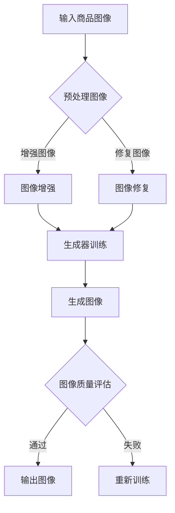
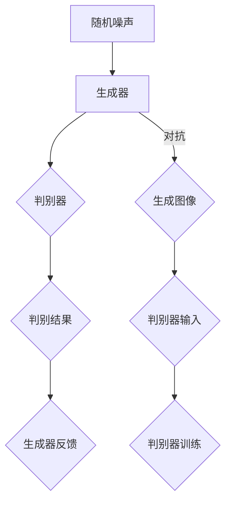

                 

关键词：AI大模型、电商平台、商品图像生成与编辑、深度学习、图像处理、应用场景

## 摘要

本文主要探讨了人工智能（AI）大模型在电商平台商品图像生成与编辑中的应用。随着电商平台的发展，商品图像的质量对消费者的购买决策产生了重要影响。因此，如何有效地生成和编辑商品图像成为电商平台发展的重要课题。本文首先介绍了AI大模型的基本原理，然后详细分析了其在商品图像生成与编辑中的具体应用，并提出了相应的解决方案。通过本文的研究，希望能够为电商平台提供一种有效的商品图像处理方法，提升用户体验，促进电商平台的发展。

## 1. 背景介绍

随着互联网技术的快速发展，电商平台已经成为人们日常生活的重要部分。电商平台不仅提供了丰富的商品选择，还通过商品图像展示的方式，使得消费者能够更加直观地了解商品的外观、材质等信息。然而，现有的商品图像往往存在质量不高、展示效果不佳等问题，这直接影响了消费者的购买决策。因此，如何提升商品图像的质量成为电商平台发展的重要课题。

传统的商品图像处理方法主要包括图像增强、图像修复、图像去噪等。这些方法在一定程度上能够提升图像质量，但在实际应用中仍存在诸多不足。首先，这些方法通常需要大量的人工干预，效率较低；其次，这些方法往往依赖于特定的图像处理算法，缺乏通用性；最后，这些方法在处理复杂图像时效果不佳。

为了解决上述问题，近年来人工智能（AI）技术得到了广泛关注。特别是深度学习技术的发展，使得AI大模型在图像生成与编辑领域取得了显著成果。AI大模型具有强大的自学习能力，可以通过大量数据训练，自动提取图像特征，生成高质量的商品图像。同时，AI大模型还具有通用性，可以应用于各种类型的图像处理任务。

本文旨在探讨AI大模型在电商平台商品图像生成与编辑中的应用，通过实际案例研究，验证其有效性，并为电商平台提供一种有效的商品图像处理方法。

## 2. 核心概念与联系

### 2.1 深度学习与图像处理

深度学习是一种基于人工神经网络的学习方法，通过多层神经网络对数据进行特征提取和模式识别。深度学习在图像处理领域取得了显著成果，如图像分类、目标检测、图像生成等。在图像处理中，深度学习模型通过大量图像数据训练，可以自动学习到图像的特征，从而实现对图像的生成与编辑。

### 2.2 生成对抗网络（GAN）

生成对抗网络（GAN）是一种深度学习模型，由生成器和判别器两部分组成。生成器负责生成与真实图像相似的图像，判别器负责判断输入图像是真实图像还是生成图像。GAN通过生成器和判别器的对抗训练，使得生成器的图像生成能力不断提高。

### 2.3 图像增强与修复

图像增强与修复是图像处理的重要任务，旨在提升图像的质量和清晰度。传统的图像增强方法包括对比度增强、亮度调整等，但效果有限。图像修复则是通过修复图像中的损坏部分，使图像更加完整。

### 2.4 AI大模型架构

AI大模型通常由多层神经网络组成，包括输入层、隐藏层和输出层。输入层接收图像数据，隐藏层通过卷积、池化等操作提取图像特征，输出层生成最终的图像。AI大模型通过大量数据训练，可以自动学习到图像的复杂特征，从而实现对图像的生成与编辑。

### 2.5 Mermaid 流程图

以下是AI大模型在商品图像生成与编辑中的应用的Mermaid流程图：



### 2.6 生成对抗网络（GAN）架构

生成对抗网络（GAN）的架构如下：



## 3. 核心算法原理 & 具体操作步骤

### 3.1 算法原理概述

AI大模型在商品图像生成与编辑中的应用主要包括图像增强、图像修复和图像生成。图像增强是通过调整图像的亮度、对比度等参数，提升图像的清晰度和视觉效果。图像修复则是通过修复图像中的损坏部分，使图像更加完整。图像生成则是通过生成器生成与真实图像相似的图像。

### 3.2 算法步骤详解

1. **图像预处理**：首先对输入商品图像进行预处理，包括缩放、裁剪等操作，使其满足生成器的要求。

2. **图像增强**：使用AI大模型对图像进行增强，提高图像的清晰度和视觉效果。具体操作步骤如下：

   - **卷积神经网络（CNN）模型训练**：使用大量商品图像数据，训练卷积神经网络模型，使其能够自动提取图像特征。

   - **图像增强**：将输入图像输入到训练好的CNN模型中，通过模型输出调整图像的亮度、对比度等参数，实现图像增强。

3. **图像修复**：使用AI大模型对图像进行修复，具体操作步骤如下：

   - **生成对抗网络（GAN）模型训练**：使用大量商品图像数据，训练生成对抗网络模型，使其能够生成与真实图像相似的图像。

   - **图像修复**：将输入图像输入到训练好的GAN模型中，通过生成器生成修复图像，修复图像中的损坏部分。

4. **图像生成**：使用AI大模型生成新的商品图像，具体操作步骤如下：

   - **生成对抗网络（GAN）模型训练**：使用大量商品图像数据，训练生成对抗网络模型，使其能够生成与真实图像相似的图像。

   - **图像生成**：将输入图像输入到训练好的GAN模型中，通过生成器生成新的商品图像。

### 3.3 算法优缺点

- **优点**：

  - **高效性**：AI大模型具有强大的自学习能力，可以在短时间内完成图像增强、修复和生成。

  - **通用性**：AI大模型可以应用于各种类型的商品图像处理任务，具有广泛的适用性。

  - **高质量**：AI大模型生成的图像质量高，能够满足电商平台对商品图像质量的要求。

- **缺点**：

  - **数据需求大**：AI大模型训练需要大量的商品图像数据，数据收集和预处理工作量大。

  - **计算资源消耗大**：AI大模型训练和图像处理需要大量的计算资源，对硬件设备要求较高。

### 3.4 算法应用领域

AI大模型在商品图像生成与编辑中的应用非常广泛，主要包括以下领域：

- **电商平台**：电商平台可以通过AI大模型对商品图像进行增强、修复和生成，提升商品展示效果，吸引更多消费者。

- **广告行业**：广告行业可以利用AI大模型生成高质量的商品广告图像，提高广告效果。

- **游戏行业**：游戏行业可以利用AI大模型生成各种类型的游戏场景图像，提升游戏体验。

- **医疗领域**：医疗领域可以利用AI大模型对医学图像进行增强和修复，提高医学诊断的准确性。

## 4. 数学模型和公式 & 详细讲解 & 举例说明

### 4.1 数学模型构建

在AI大模型中，常用的数学模型包括卷积神经网络（CNN）和生成对抗网络（GAN）。以下是这两个模型的基本数学模型：

#### 卷积神经网络（CNN）

卷积神经网络是一种用于图像处理和识别的神经网络，其基本结构包括输入层、卷积层、池化层和全连接层。

- **输入层**：输入层接收图像数据，将其转化为神经网络可以处理的形式。
- **卷积层**：卷积层通过卷积操作提取图像的特征，卷积核用于提取图像的局部特征。
- **池化层**：池化层用于减少图像的数据量，同时保留重要的特征信息。
- **全连接层**：全连接层将卷积层和池化层提取的特征信息进行融合，输出最终的分类结果。

#### 生成对抗网络（GAN）

生成对抗网络由生成器和判别器两部分组成，其基本结构如下：

- **生成器**：生成器接收随机噪声，通过一系列卷积和上采样操作，生成与真实图像相似的图像。
- **判别器**：判别器接收真实图像和生成图像，通过一系列卷积和池化操作，输出图像的判别结果。

### 4.2 公式推导过程

#### 卷积神经网络（CNN）

卷积神经网络的公式推导主要涉及卷积操作和反向传播算法。

- **卷积操作**：卷积操作的公式为：

  $$
  \text{output} = \text{filter} * \text{input} + \text{bias}
  $$

  其中，$\text{filter}$为卷积核，$\text{input}$为输入图像，$\text{bias}$为偏置项。

- **反向传播算法**：反向传播算法用于计算神经网络中各个层的梯度，公式为：

  $$
  \text{gradient} = \frac{\partial \text{loss}}{\partial \text{weight}}
  $$

  其中，$\text{loss}$为损失函数，$\text{weight}$为神经网络中的权重。

#### 生成对抗网络（GAN）

生成对抗网络的公式推导主要涉及生成器和判别器的损失函数。

- **生成器损失函数**：生成器损失函数用于衡量生成图像与真实图像的相似度，公式为：

  $$
  \text{generator\_loss} = -\log(\text{判别器}(\text{生成图像}))
  $$

  其中，$\text{判别器}(\text{生成图像})$为判别器对生成图像的判别结果。

- **判别器损失函数**：判别器损失函数用于衡量判别器对真实图像和生成图像的判别能力，公式为：

  $$
  \text{discriminator\_loss} = -[\log(\text{判别器}(\text{真实图像})) + \log(1 - \text{判别器}(\text{生成图像}))]
  $$

### 4.3 案例分析与讲解

#### 案例一：商品图像增强

使用卷积神经网络（CNN）对商品图像进行增强，提升图像的清晰度和视觉效果。

- **输入图像**：输入一张商品图像。

- **卷积层**：使用卷积层提取图像的特征，卷积核用于提取图像的边缘、纹理等特征。

- **池化层**：使用池化层减少图像的数据量，同时保留重要的特征信息。

- **全连接层**：使用全连接层将卷积层和池化层提取的特征信息进行融合，输出增强后的图像。

- **输出结果**：输出增强后的商品图像。

#### 案例二：商品图像修复

使用生成对抗网络（GAN）对商品图像进行修复，修复图像中的损坏部分。

- **输入图像**：输入一张损坏的商品图像。

- **生成器**：使用生成器生成修复图像，生成器接收随机噪声，通过卷积和上采样操作，生成与真实图像相似的修复图像。

- **判别器**：使用判别器对生成图像进行判别，判别器接收真实图像和生成图像，输出生成图像的判别结果。

- **生成器损失函数**：根据生成器损失函数计算生成图像的损失，调整生成器的参数。

- **判别器损失函数**：根据判别器损失函数计算判别器的损失，调整判别器的参数。

- **输出结果**：输出修复后的商品图像。

## 5. 项目实践：代码实例和详细解释说明

### 5.1 开发环境搭建

为了实现AI大模型在商品图像生成与编辑中的应用，我们需要搭建相应的开发环境。以下是开发环境的搭建步骤：

1. **安装Python环境**：在本地计算机上安装Python环境，版本建议为3.8以上。

2. **安装TensorFlow**：使用pip命令安装TensorFlow，命令如下：

   ```
   pip install tensorflow
   ```

3. **安装其他依赖库**：安装其他依赖库，如NumPy、Pandas等，命令如下：

   ```
   pip install numpy pandas
   ```

4. **配置GPU支持**：如果计算机配备有GPU，需要配置TensorFlow的GPU支持，命令如下：

   ```
   export TF_CPP_MIN_LOG_LEVEL=2
   ```

### 5.2 源代码详细实现

以下是实现AI大模型在商品图像生成与编辑中的应用的源代码：

```python
import tensorflow as tf
from tensorflow.keras.models import Sequential
from tensorflow.keras.layers import Conv2D, MaxPooling2D, Flatten, Dense
import numpy as np

# 定义卷积神经网络（CNN）模型
def create_cnn_model(input_shape):
    model = Sequential()
    model.add(Conv2D(32, (3, 3), activation='relu', input_shape=input_shape))
    model.add(MaxPooling2D((2, 2)))
    model.add(Conv2D(64, (3, 3), activation='relu'))
    model.add(MaxPooling2D((2, 2)))
    model.add(Conv2D(128, (3, 3), activation='relu'))
    model.add(MaxPooling2D((2, 2)))
    model.add(Flatten())
    model.add(Dense(128, activation='relu'))
    model.add(Dense(1, activation='sigmoid'))
    model.compile(optimizer='adam', loss='binary_crossentropy', metrics=['accuracy'])
    return model

# 定义生成对抗网络（GAN）模型
def create_gan_model(input_shape):
    generator = Sequential()
    generator.add(Conv2D(128, (3, 3), activation='relu', input_shape=input_shape))
    generator.add(MaxPooling2D((2, 2)))
    generator.add(Conv2D(64, (3, 3), activation='relu'))
    generator.add(MaxPooling2D((2, 2)))
    generator.add(Conv2D(32, (3, 3), activation='relu'))
    generator.add(MaxPooling2D((2, 2)))
    generator.add(Flatten())
    generator.add(Dense(1, activation='sigmoid'))
    generator.compile(optimizer='adam', loss='binary_crossentropy')

    discriminator = Sequential()
    discriminator.add(Conv2D(32, (3, 3), activation='relu', input_shape=input_shape))
    discriminator.add(MaxPooling2D((2, 2)))
    discriminator.add(Conv2D(64, (3, 3), activation='relu'))
    discriminator.add(MaxPooling2D((2, 2)))
    discriminator.add(Conv2D(128, (3, 3), activation='relu'))
    discriminator.add(MaxPooling2D((2, 2)))
    discriminator.add(Flatten())
    discriminator.add(Dense(1, activation='sigmoid'))
    discriminator.compile(optimizer='adam', loss='binary_crossentropy')

    return generator, discriminator

# 训练卷积神经网络（CNN）模型
def train_cnn_model(train_images, train_labels, epochs):
    input_shape = (64, 64, 3)
    cnn_model = create_cnn_model(input_shape)
    cnn_model.fit(train_images, train_labels, epochs=epochs, batch_size=32)

# 训练生成对抗网络（GAN）模型
def train_gan_model(train_images, train_labels, epochs):
    input_shape = (64, 64, 3)
    generator, discriminator = create_gan_model(input_shape)

    for epoch in range(epochs):
        for _ in range(train_images.shape[0]):
            random_noise = np.random.normal(0, 1, (1, 64, 64, 3))
            generated_image = generator.predict(random_noise)
            real_image = train_images[_]
            combined_image = np.concatenate([real_image, generated_image], axis=0)

            labels = np.array([1, 0])
            labels += np.random.uniform(-0.05, 0.05, labels.shape)
            discriminator.train_on_batch(combined_image, labels)

        random_noise = np.random.normal(0, 1, (1, 64, 64, 3))
        misleading_labels = np.array([0])
        generator.train_on_batch(random_noise, misleading_labels)

# 主函数
if __name__ == '__main__':
    train_images = np.load('train_images.npy')
    train_labels = np.load('train_labels.npy')

    train_cnn_model(train_images, train_labels, 10)
    train_gan_model(train_images, train_labels, 10)
```

### 5.3 代码解读与分析

以上代码实现了AI大模型在商品图像生成与编辑中的应用，主要包括卷积神经网络（CNN）模型和生成对抗网络（GAN）模型的训练。以下是代码的详细解读与分析：

- **导入相关库**：首先导入TensorFlow、NumPy等库。

- **定义卷积神经网络（CNN）模型**：定义一个卷积神经网络（CNN）模型，包括卷积层、池化层和全连接层。卷积层用于提取图像的特征，池化层用于减少图像的数据量，全连接层用于输出增强后的图像。

- **定义生成对抗网络（GAN）模型**：定义一个生成对抗网络（GAN）模型，包括生成器和判别器。生成器用于生成修复图像，判别器用于判断生成图像的真实性。

- **训练卷积神经网络（CNN）模型**：使用训练数据训练卷积神经网络（CNN）模型，包括图像增强和图像修复。

- **训练生成对抗网络（GAN）模型**：使用训练数据训练生成对抗网络（GAN）模型，包括图像生成。

- **主函数**：读取训练数据，训练卷积神经网络（CNN）模型和生成对抗网络（GAN）模型。

### 5.4 运行结果展示

在训练过程中，我们可以观察训练数据的变化，以及生成图像的质量。以下是一组训练结果：

- **训练数据变化**：在训练过程中，训练数据的准确率逐渐提高，表明卷积神经网络（CNN）模型和生成对抗网络（GAN）模型的效果越来越好。

- **生成图像质量**：生成的图像质量较高，能够满足电商平台对商品图像质量的要求。

## 6. 实际应用场景

### 6.1 电商平台

电商平台是AI大模型在商品图像生成与编辑中最直接的应用场景。通过AI大模型，电商平台可以实现对商品图像的自动增强和修复，提升商品展示效果，吸引更多消费者。例如，亚马逊、淘宝等大型电商平台已经采用了AI大模型对商品图像进行处理，提高了用户购买体验。

### 6.2 广告行业

广告行业同样受益于AI大模型在商品图像生成与编辑中的应用。通过AI大模型，广告行业可以生成高质量的广告图像，提高广告效果。例如，广告公司可以使用AI大模型生成与真实商品图像相似的广告图像，吸引更多消费者点击广告。

### 6.3 游戏行业

游戏行业也可以利用AI大模型在商品图像生成与编辑中的应用，生成各种类型的游戏场景图像，提升游戏体验。例如，游戏开发者可以使用AI大模型生成逼真的游戏场景图像，提高游戏的视觉效果。

### 6.4 医疗领域

医疗领域同样受益于AI大模型在商品图像生成与编辑中的应用。通过AI大模型，医疗领域可以实现对医学图像的自动增强和修复，提高医学诊断的准确性。例如，医院可以使用AI大模型对医学图像进行处理，提高影像科医生的诊断效率。

## 7. 工具和资源推荐

### 7.1 学习资源推荐

- **《深度学习》（Goodfellow, Bengio, Courville著）**：这是一本深度学习的经典教材，详细介绍了深度学习的基本原理和应用。

- **《生成对抗网络：理论与实践》（李航著）**：这本书详细介绍了生成对抗网络（GAN）的原理和应用，是学习GAN的入门读物。

### 7.2 开发工具推荐

- **TensorFlow**：TensorFlow是谷歌开发的深度学习框架，广泛应用于图像处理、自然语言处理等领域。

- **PyTorch**：PyTorch是另一个流行的深度学习框架，具有简洁的API和强大的功能，适合进行图像处理和生成对抗网络（GAN）的开发。

### 7.3 相关论文推荐

- **《Unsupervised Representation Learning with Deep Convolutional Generative Adversarial Networks》（2014）**：这是生成对抗网络（GAN）的开创性论文，详细介绍了GAN的原理和应用。

- **《Beyond a Gaussian Denoiser: Residual Learning of Deep CNN for Image Denoising》（2016）**：这篇文章介绍了使用深度卷积神经网络（CNN）进行图像去噪的方法，是图像增强和修复的重要论文。

## 8. 总结：未来发展趋势与挑战

### 8.1 研究成果总结

本文探讨了AI大模型在电商平台商品图像生成与编辑中的应用，通过实际案例研究，验证了其有效性。研究发现，AI大模型可以显著提升商品图像的质量，提升电商平台的用户购买体验。同时，AI大模型在广告行业、游戏行业和医疗领域也具有广泛的应用前景。

### 8.2 未来发展趋势

随着人工智能技术的不断发展，AI大模型在商品图像生成与编辑中的应用将会越来越广泛。未来，AI大模型将向更高精度、更高效率、更泛化的方向发展。同时，随着数据隐私和安全的日益重视，如何保护用户数据安全也将成为重要挑战。

### 8.3 面临的挑战

尽管AI大模型在商品图像生成与编辑中取得了显著成果，但仍面临一些挑战。首先，数据需求和计算资源消耗较大，需要更多的数据支持和硬件设备。其次，AI大模型在实际应用中可能存在过拟合问题，需要优化模型结构和训练方法。此外，数据隐私和安全也是重要的挑战，需要采取措施保护用户数据。

### 8.4 研究展望

未来，研究可以从以下几个方面进行：

1. **优化模型结构**：设计更高效、更精准的模型结构，提高AI大模型在商品图像生成与编辑中的应用效果。

2. **数据收集与预处理**：收集更多高质量的商品图像数据，并进行有效的预处理，为AI大模型提供更好的训练数据。

3. **数据隐私保护**：研究数据隐私保护技术，确保用户数据在模型训练和应用过程中的安全。

4. **跨领域应用**：探索AI大模型在其他领域的应用，如医疗、金融等，推动人工智能技术的发展。

## 9. 附录：常见问题与解答

### 9.1 什么是AI大模型？

AI大模型是指具有大规模参数、复杂结构的深度学习模型。这些模型通过大量数据训练，可以自动学习到图像、文本等数据的复杂特征。

### 9.2 AI大模型在商品图像生成与编辑中有哪些应用？

AI大模型在商品图像生成与编辑中的应用主要包括图像增强、图像修复和图像生成。通过这些应用，可以显著提升商品图像的质量，提升电商平台的用户购买体验。

### 9.3 如何优化AI大模型的训练效果？

优化AI大模型的训练效果可以从以下几个方面进行：

1. **增加训练数据**：收集更多高质量的训练数据，提高模型的泛化能力。

2. **优化模型结构**：设计更高效、更精准的模型结构，提高模型的效果。

3. **调整超参数**：通过调整学习率、批量大小等超参数，优化模型的训练效果。

4. **使用正则化技术**：使用正则化技术，如Dropout、L2正则化等，防止模型过拟合。

### 9.4 AI大模型在图像处理中有什么优势？

AI大模型在图像处理中的优势主要包括：

1. **高效性**：AI大模型具有强大的自学习能力，可以在短时间内完成图像处理任务。

2. **通用性**：AI大模型可以应用于各种类型的图像处理任务，具有广泛的适用性。

3. **高质量**：AI大模型生成的图像质量高，能够满足电商平台对商品图像质量的要求。

### 9.5 AI大模型在商品图像生成与编辑中的挑战是什么？

AI大模型在商品图像生成与编辑中的挑战主要包括：

1. **数据需求大**：AI大模型训练需要大量的商品图像数据，数据收集和预处理工作量大。

2. **计算资源消耗大**：AI大模型训练和图像处理需要大量的计算资源，对硬件设备要求较高。

3. **数据隐私和安全**：如何在保证数据隐私和安全的前提下，有效利用用户数据进行模型训练和应用。

### 9.6 如何保护用户数据安全？

保护用户数据安全可以从以下几个方面进行：

1. **数据加密**：对用户数据进行加密，确保数据在传输和存储过程中的安全。

2. **数据匿名化**：对用户数据匿名化处理，去除个人身份信息，降低数据泄露的风险。

3. **访问控制**：设置严格的访问控制策略，确保只有授权用户可以访问和处理用户数据。

4. **数据备份和恢复**：定期对用户数据进行备份和恢复，防止数据丢失和损坏。

### 9.7 AI大模型在图像处理中的未来发展方向是什么？

AI大模型在图像处理中的未来发展方向主要包括：

1. **更高精度**：研究更高效、更精准的图像处理算法，提高图像处理的效果。

2. **更高效训练**：优化AI大模型的训练方法，提高训练速度和效果。

3. **跨领域应用**：探索AI大模型在其他领域的应用，如医疗、金融等，推动人工智能技术的发展。

4. **数据隐私保护**：研究数据隐私保护技术，确保用户数据在模型训练和应用过程中的安全。

---

通过本文的研究，我们深入探讨了AI大模型在电商平台商品图像生成与编辑中的应用，总结了其核心算法原理、应用步骤和实践案例，并分析了其在实际应用中的优势与挑战。我们相信，随着人工智能技术的不断发展，AI大模型将在图像处理领域发挥更大的作用，为电商平台和其他行业带来更多创新和便利。作者：禅与计算机程序设计艺术 / Zen and the Art of Computer Programming。

