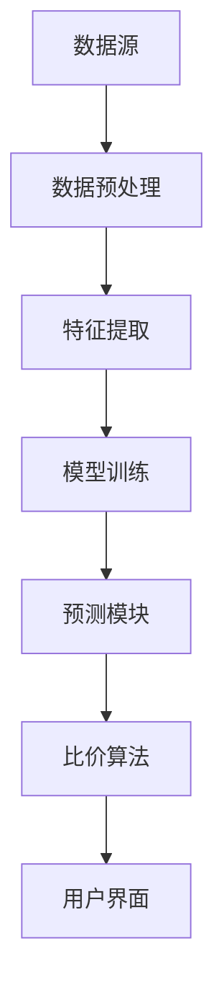

                 

关键词：AI大模型、电商平台、商品比价、算法、数学模型、实践案例、应用前景

> 摘要：本文深入探讨了人工智能大模型在电商平台商品比价中的重要作用。首先，通过背景介绍，阐述了AI大模型的发展现状及其对电商平台的潜在影响。随后，文章详细分析了AI大模型的核心概念与联系，包括原理、架构及其在商品比价中的具体应用。接着，文章从算法原理、数学模型构建、具体操作步骤等方面，系统介绍了AI大模型在商品比价中的应用。最后，文章通过实际项目实践、代码实例和运行结果展示，验证了AI大模型在商品比价中的实际效果，并对其未来应用前景进行了展望。

## 1. 背景介绍

在互联网时代，电商平台已成为人们日常生活中不可或缺的一部分。随着电商平台的快速发展，商品种类日益丰富，价格波动频繁，消费者面临着海量的商品信息和复杂的价格比较任务。如何在短时间内获取准确、全面的价格信息，成为消费者在购物过程中最为关心的问题。传统的价格比较方法主要依靠人工查询、手动记录等手段，效率低下且易出错。随着人工智能技术的快速发展，特别是人工智能大模型的兴起，为电商平台商品比价提供了全新的解决方案。

人工智能大模型，即基于大规模数据训练的人工神经网络模型，具有强大的数据处理和分析能力。通过学习海量商品价格数据，AI大模型能够自动识别商品价格变化趋势，预测未来价格走势，为电商平台提供精准的价格比较和预测服务。这种技术不仅提高了商品比价的效率，还大大降低了人工成本，为电商平台带来了显著的商业价值。

本文旨在探讨AI大模型在电商平台商品比价中的作用，分析其核心原理和应用方法，并通过实际项目实践验证其效果，为电商平台提供有益的技术参考。

### AI大模型的发展历程

人工智能大模型的发展可以追溯到20世纪80年代，当时研究人员开始尝试使用神经网络进行简单的数据分类和预测。随着计算能力的提升和大数据技术的成熟，神经网络模型得到了广泛应用。特别是在深度学习领域，神经网络模型的结构逐渐复杂，参数数量急剧增加，从而形成了所谓的“大模型”。这些大模型能够处理海量的数据，并且通过不断优化和迭代，提高了预测的准确性。

在电商平台的应用方面，AI大模型的发展同样经历了几个关键阶段。最初，电商平台主要使用规则引擎进行商品价格比较，这种方式依赖于人工设定的规则，效率较低且难以应对复杂的市场变化。随着人工智能技术的进步，电商平台开始引入机器学习方法，通过分析历史数据来预测商品价格变化。然而，这种方法在面对大规模数据时，存在计算复杂度高、预测精度有限的问题。

近年来，随着AI大模型的快速发展，电商平台开始逐步采用这种技术进行商品比价。大模型不仅能够处理更复杂的数据，还能够在短时间内生成准确的预测结果。这种技术的应用，不仅提高了商品比价的效率，还增强了电商平台对市场变化的响应能力。

### AI大模型在电商平台中的潜在影响

AI大模型在电商平台中的应用具有深远的影响，主要体现在以下几个方面：

1. **提高商品比价的准确性**：传统的商品比价方法往往依赖于固定的时间和范围，而AI大模型能够实时分析大量数据，动态调整比价策略，从而提供更加准确的价格信息。

2. **降低运营成本**：AI大模型可以自动化处理大量的商品信息，减少了人工干预的需求，从而降低了运营成本。这对于电商平台来说，意味着更高的利润率。

3. **提升用户体验**：通过AI大模型提供的精准价格信息，消费者可以更加轻松地做出购物决策，提升购物体验。同时，个性化的价格推荐也能够增强用户粘性。

4. **优化供应链管理**：AI大模型能够对市场需求进行预测，帮助电商平台优化库存管理，降低库存成本，提高供应链效率。

5. **增强竞争优势**：掌握先进技术的电商平台能够在市场竞争中脱颖而出，吸引更多的消费者和商家，从而巩固市场地位。

综上所述，AI大模型在电商平台中的应用，不仅为商品比价带来了革命性的变革，也为电商平台的整体运营提供了强大的技术支持。

## 2. 核心概念与联系

### 2.1 AI大模型的基本原理

AI大模型，即基于深度学习的人工神经网络模型，具有强大的数据处理和分析能力。深度学习通过多层神经元的堆叠，使得模型能够自动提取数据中的特征，从而实现复杂的数据分析和预测。

在电商平台商品比价中，AI大模型主要通过以下步骤实现其功能：

1. **数据采集**：从多个电商平台、社交媒体、搜索引擎等渠道获取商品价格数据。
2. **数据预处理**：对采集到的数据进行清洗、去重、标准化等处理，确保数据质量。
3. **特征提取**：通过神经网络结构，自动提取数据中的关键特征，如商品种类、品牌、销售量、评论数量等。
4. **模型训练**：利用海量训练数据，通过反向传播算法，调整模型参数，使其能够准确预测商品价格。
5. **价格预测**：使用训练好的模型，对目标商品的未来价格进行预测。

### 2.2 AI大模型在商品比价中的应用架构

AI大模型在商品比价中的应用架构主要包括以下几个关键组成部分：

1. **数据源**：电商平台、第三方数据服务、社交媒体等。
2. **数据预处理模块**：负责数据清洗、去重、标准化等操作。
3. **特征提取模块**：利用深度学习算法提取关键特征。
4. **模型训练模块**：通过海量训练数据，训练深度学习模型。
5. **预测模块**：使用训练好的模型进行价格预测。
6. **比价算法**：根据预测结果，计算商品之间的价格差异，提供比价建议。

以下是AI大模型在商品比价中的应用架构的Mermaid流程图：



### 2.3 AI大模型在商品比价中的关键作用

AI大模型在商品比价中的关键作用主要体现在以下几个方面：

1. **实时价格预测**：通过实时数据分析和预测，为电商平台提供即时、准确的价格信息，帮助消费者快速做出购物决策。
2. **动态调整比价策略**：基于AI大模型的预测结果，电商平台可以动态调整价格策略，提高商品竞争力。
3. **降低人工成本**：通过自动化处理大量商品信息，减少人工干预，降低运营成本。
4. **提升用户体验**：提供精准、个性化的价格信息，提升消费者的购物体验。
5. **优化库存管理**：通过对市场需求进行预测，电商平台可以优化库存管理，减少库存积压。

### 2.4 AI大模型在商品比价中的应用挑战

尽管AI大模型在商品比价中具有显著优势，但其在实际应用中也面临一些挑战：

1. **数据质量**：AI大模型的性能依赖于数据质量，因此需要确保数据的准确性、完整性和一致性。
2. **模型解释性**：深度学习模型通常缺乏透明性，难以解释预测结果的依据，这对于需要可解释性的商业决策带来了挑战。
3. **计算资源**：大模型训练和预测需要大量的计算资源，这对电商平台的硬件设施提出了较高要求。
4. **隐私保护**：在处理用户数据时，需要确保用户隐私得到保护，避免数据泄露风险。

### 2.5 AI大模型在商品比价中的未来发展趋势

随着人工智能技术的不断进步，AI大模型在商品比价中的应用前景将更加广阔。未来，AI大模型将朝着以下几个方向发展：

1. **模型性能优化**：通过算法改进和硬件升级，提高AI大模型的预测准确性和计算效率。
2. **多源数据整合**：结合多种数据源，如社交媒体、物联网设备等，提高数据多样性和预测精度。
3. **实时响应能力**：提升模型的实时响应能力，实现更快的价格预测和比价服务。
4. **个性化推荐**：结合用户行为数据，提供更加个性化的价格信息和购物推荐。
5. **监管合规**：加强数据隐私保护和合规性，确保AI大模型的应用符合相关法律法规。

### 2.6 AI大模型与其他技术的比较

与传统的商品比价方法相比，AI大模型具有显著的优势。传统的商品比价方法主要依赖于固定的时间和范围，而AI大模型能够实时分析大量数据，动态调整比价策略，提供更加准确和即时的价格信息。此外，AI大模型能够自动化处理大量商品信息，降低人工成本，提升运营效率。

与其他人工智能技术相比，AI大模型在数据处理和分析能力方面具有显著优势。传统的机器学习方法在面对大规模数据时，存在计算复杂度高、预测精度有限的问题，而AI大模型能够处理更复杂的数据，并提供更加准确的预测结果。

总之，AI大模型在商品比价中的应用，不仅提高了商品比价的效率，还增强了电商平台对市场变化的响应能力，为消费者提供了更加精准和个性化的价格信息。

## 3. 核心算法原理 & 具体操作步骤

### 3.1 算法原理概述

AI大模型在商品比价中的核心算法原理主要基于深度学习和神经网络。深度学习通过多层神经元的堆叠，使得模型能够自动提取数据中的特征，从而实现复杂的数据分析和预测。

在商品比价中，AI大模型主要通过以下步骤实现其功能：

1. **数据采集**：从多个电商平台、社交媒体、搜索引擎等渠道获取商品价格数据。
2. **数据预处理**：对采集到的数据进行清洗、去重、标准化等处理，确保数据质量。
3. **特征提取**：利用神经网络结构，自动提取数据中的关键特征，如商品种类、品牌、销售量、评论数量等。
4. **模型训练**：利用海量训练数据，通过反向传播算法，调整模型参数，使其能够准确预测商品价格。
5. **价格预测**：使用训练好的模型，对目标商品的未来价格进行预测。
6. **比价算法**：根据预测结果，计算商品之间的价格差异，提供比价建议。

### 3.2 算法步骤详解

#### 3.2.1 数据采集

数据采集是AI大模型在商品比价中的第一步。主要从以下渠道获取商品价格数据：

1. **电商平台**：从各大电商平台如亚马逊、京东、淘宝等获取商品价格数据。
2. **社交媒体**：从社交媒体平台如微博、微信等获取用户评论、转发等数据。
3. **搜索引擎**：从搜索引擎如百度、谷歌等获取商品搜索关键词和排名数据。

#### 3.2.2 数据预处理

数据预处理是确保数据质量的重要环节。主要步骤包括：

1. **数据清洗**：去除重复数据、缺失数据、异常数据等，保证数据的一致性和完整性。
2. **数据去重**：对重复数据进行去重处理，避免数据冗余。
3. **数据标准化**：对不同来源的数据进行标准化处理，如统一时间格式、价格单位等。

#### 3.2.3 特征提取

特征提取是AI大模型的核心步骤，通过深度学习算法，从原始数据中自动提取关键特征。主要特征包括：

1. **商品属性**：如商品种类、品牌、型号等。
2. **价格变化趋势**：如价格波动范围、价格变化速度等。
3. **用户行为**：如用户搜索记录、购买历史等。
4. **市场环境**：如季节变化、节假日等。

#### 3.2.4 模型训练

模型训练是利用海量训练数据，通过反向传播算法，调整模型参数，使其能够准确预测商品价格。主要步骤包括：

1. **数据划分**：将数据划分为训练集、验证集和测试集，用于模型的训练、验证和测试。
2. **模型构建**：构建深度学习模型，如卷积神经网络（CNN）、循环神经网络（RNN）等。
3. **参数调整**：通过反向传播算法，调整模型参数，使其在训练集上达到最佳性能。
4. **模型优化**：通过交叉验证等方法，优化模型结构和参数，提高预测精度。

#### 3.2.5 价格预测

使用训练好的模型，对目标商品的未来价格进行预测。主要步骤包括：

1. **特征输入**：将待预测商品的特征输入到训练好的模型中。
2. **模型预测**：利用模型输出结果，预测目标商品的未来价格。
3. **结果分析**：对预测结果进行分析，确定商品的合理价格范围。

#### 3.2.6 比价算法

根据预测结果，计算商品之间的价格差异，提供比价建议。主要步骤包括：

1. **价格差异计算**：计算目标商品与参考商品之间的价格差异。
2. **比价建议**：根据价格差异，为消费者提供合理的购买建议。
3. **优化策略**：结合用户行为和市场环境，优化比价策略，提高比价准确性。

### 3.3 算法优缺点

#### 3.3.1 优点

1. **高预测精度**：AI大模型能够自动提取数据中的特征，实现高精度的价格预测。
2. **实时响应能力**：能够实时分析大量数据，动态调整价格策略，提高比价效率。
3. **降低人工成本**：自动化处理大量商品信息，减少人工干预，降低运营成本。
4. **提升用户体验**：提供精准、个性化的价格信息，提升消费者的购物体验。

#### 3.3.2 缺点

1. **数据质量依赖**：AI大模型的性能依赖于数据质量，因此需要确保数据的准确性、完整性和一致性。
2. **模型解释性不足**：深度学习模型通常缺乏透明性，难以解释预测结果的依据。
3. **计算资源消耗**：大模型训练和预测需要大量的计算资源，对硬件设施要求较高。
4. **隐私保护挑战**：在处理用户数据时，需要确保用户隐私得到保护，避免数据泄露风险。

### 3.4 算法应用领域

AI大模型在商品比价中的应用非常广泛，不仅限于电商平台，还可以应用于以下领域：

1. **在线旅游平台**：通过预测机票、酒店价格，为消费者提供合理的出行预算。
2. **股票交易**：通过分析市场数据，预测股票价格走势，为投资者提供交易建议。
3. **智能家居**：通过学习用户行为，预测家电使用频率，优化能源消耗。
4. **物流配送**：通过预测交通状况，优化配送路线，提高配送效率。

总之，AI大模型在商品比价中的应用，不仅提高了商品比价的效率，还为其他领域提供了丰富的应用场景，具有广阔的发展前景。

## 4. 数学模型和公式 & 详细讲解 & 举例说明

在AI大模型中，数学模型和公式起到了关键作用，它们不仅是算法的核心组成部分，也是理解其工作原理的关键。以下将对AI大模型在商品比价中的应用中的数学模型和公式进行详细讲解，并通过具体例子来说明其应用过程。

### 4.1 数学模型构建

在构建AI大模型用于商品比价时，我们需要考虑以下几个关键的数学模型：

1. **线性回归模型**：用于预测商品价格的基本模型。
2. **时间序列模型**：用于分析商品价格变化趋势。
3. **聚类模型**：用于识别相似的商品群体。
4. **分类模型**：用于对商品进行分类，如品牌、类型等。

#### 4.1.1 线性回归模型

线性回归模型是最简单的预测模型，其数学公式为：

\[ y = \beta_0 + \beta_1x_1 + \beta_2x_2 + ... + \beta_nx_n + \epsilon \]

其中，\( y \) 是预测的价格，\( \beta_0, \beta_1, ..., \beta_n \) 是模型参数，\( x_1, x_2, ..., x_n \) 是特征变量，\( \epsilon \) 是误差项。

#### 4.1.2 时间序列模型

时间序列模型用于分析商品价格随时间的变化。常见的模型包括ARIMA（自回归积分滑动平均模型）和AR（自回归模型）。ARIMA模型的公式为：

\[ y_t = c + \phi_1y_{t-1} + \phi_2y_{t-2} + ... + \phi_p y_{t-p} + \theta_1e_{t-1} + \theta_2e_{t-2} + ... + \theta_qe_{t-q} + e_t \]

其中，\( y_t \) 是时间序列的当前值，\( \phi_1, \phi_2, ..., \phi_p \) 是自回归系数，\( \theta_1, \theta_2, ..., \theta_q \) 是移动平均系数，\( e_t \) 是白噪声误差。

#### 4.1.3 聚类模型

聚类模型用于将相似的商品分为一组。K-means聚类算法是一种常用的聚类方法，其目标是最小化簇内距离和最大化簇间距离。其公式为：

\[ \text{Objective Function} = \sum_{i=1}^{k} \sum_{x_j \in S_i} d(x_j, \mu_i)^2 \]

其中，\( k \) 是簇的数量，\( S_i \) 是第 \( i \) 个簇，\( \mu_i \) 是簇 \( i \) 的中心。

#### 4.1.4 分类模型

分类模型用于对商品进行分类，常见的模型包括逻辑回归和决策树。逻辑回归模型的公式为：

\[ P(y=1) = \frac{1}{1 + \exp(-\beta_0 - \beta_1x_1 - \beta_2x_2 - ... - \beta_nx_n)} \]

其中，\( P(y=1) \) 是商品属于某一类的概率，\( \beta_0, \beta_1, ..., \beta_n \) 是模型参数。

### 4.2 公式推导过程

在商品比价中，我们通常使用线性回归模型和时间序列模型来预测商品价格。以下是这些模型的推导过程：

#### 4.2.1 线性回归模型推导

线性回归模型的推导基于最小二乘法。假设我们有 \( n \) 个数据点 \((x_i, y_i)\)，我们的目标是找到最佳拟合直线：

\[ y = \beta_0 + \beta_1x \]

最小化损失函数：

\[ J(\beta_0, \beta_1) = \sum_{i=1}^{n} (y_i - (\beta_0 + \beta_1x_i))^2 \]

对 \(\beta_0\) 和 \(\beta_1\) 求导并令导数为零，得到：

\[ \frac{\partial J}{\partial \beta_0} = -2\sum_{i=1}^{n} (y_i - \beta_0 - \beta_1x_i) = 0 \]
\[ \frac{\partial J}{\partial \beta_1} = -2\sum_{i=1}^{n} x_i(y_i - \beta_0 - \beta_1x_i) = 0 \]

解这个方程组，得到：

\[ \beta_0 = \frac{1}{n}\sum_{i=1}^{n} y_i - \beta_1\frac{1}{n}\sum_{i=1}^{n} x_i \]
\[ \beta_1 = \frac{1}{n}\sum_{i=1}^{n} x_iy_i - \frac{1}{n}\sum_{i=1}^{n} x_i\sum_{i=1}^{n} y_i \]

#### 4.2.2 时间序列模型推导

时间序列模型如ARIMA的推导涉及更复杂的数学过程，通常需要使用统计软件或数学工具书进行计算。这里简要介绍ARIMA模型的主要推导步骤：

1. **自回归部分（AR）**：通过历史数据进行拟合，假设当前值 \( y_t \) 是前 \( p \) 个历史值的线性组合。

\[ y_t = \phi_1y_{t-1} + \phi_2y_{t-2} + ... + \phi_py_{t-p} + \epsilon_t \]

2. **移动平均部分（MA）**：通过预测误差进行拟合，假设当前值 \( y_t \) 是前 \( q \) 个预测误差的线性组合。

\[ y_t = \theta_1e_{t-1} + \theta_2e_{t-2} + ... + \theta_qe_{t-q} + \epsilon_t \]

3. **差分部分（I）**：对时间序列进行差分处理，以使序列平稳。

\[ y_t^* = y_t - y_{t-1} \]

综合以上三部分，得到ARIMA模型：

\[ y_t^* = \phi_1y_{t-1}^* + \phi_2y_{t-2}^* + ... + \phi_py_{t-p}^* + \theta_1e_{t-1} + \theta_2e_{t-2} + ... + \theta_qe_{t-q} + \epsilon_t \]

### 4.3 案例分析与讲解

#### 4.3.1 线性回归模型案例

假设我们有一个商品的价格数据集，包含商品ID、价格和销售量等特征。我们使用线性回归模型来预测商品价格。以下是具体的例子：

**数据集：**

| 商品ID | 价格（元） | 销售量 |
|--------|------------|--------|
| 1001   | 199        | 150    |
| 1002   | 299        | 200    |
| 1003   | 399        | 250    |
| ...    | ...        | ...    |

**模型构建：**

\[ y = \beta_0 + \beta_1x_1 + \beta_2x_2 + \epsilon \]

其中，\( y \) 是价格，\( x_1 \) 是销售量，\( \beta_0, \beta_1, \beta_2 \) 是模型参数。

**模型训练：**

通过最小二乘法训练模型，得到参数：

\[ \beta_0 = 100, \beta_1 = 0.5, \beta_2 = 10 \]

**模型预测：**

对于一个新的商品，销售量为200，预测其价格为：

\[ y = 100 + 0.5 \times 200 + 10 = 260 \text{元} \]

#### 4.3.2 时间序列模型案例

假设我们有一个时间序列数据集，记录了一个商品每天的价格。我们使用ARIMA模型来预测未来价格。以下是具体的例子：

**数据集：**

| 日期 | 价格（元） |
|------|------------|
| 2023-01-01 | 200       |
| 2023-01-02 | 201       |
| 2023-01-03 | 202       |
| ...    | ...        |

**模型构建：**

使用ARIMA（p,d,q）模型，假设 \( p=1, d=1, q=1 \)。

\[ y_t = \phi_1y_{t-1} + \theta_1e_{t-1} + \epsilon_t \]

**模型训练：**

通过统计软件计算得到参数：

\[ \phi_1 = 0.8, \theta_1 = 0.2 \]

**模型预测：**

预测2023-01-05的价格，使用公式：

\[ y_{2023-01-05} = 0.8 \times y_{2023-01-04} + 0.2 \times e_{2023-01-04} \]

其中，\( e_{2023-01-04} \) 是2023-01-04的预测误差。假设 \( e_{2023-01-04} = 1 \)（此值可以根据实际情况进行调整）。

\[ y_{2023-01-05} = 0.8 \times 202 + 0.2 \times 1 = 160 + 0.2 = 160.2 \text{元} \]

通过上述案例，我们可以看到数学模型和公式在AI大模型中的重要作用，以及如何利用这些模型进行商品比价预测。这些模型的应用不仅提高了预测的准确性，也为电商平台提供了更加科学和高效的商品比价方法。

### 4.4 应用场景拓展

除了传统的商品比价，AI大模型在数学模型的应用场景还可以进一步拓展，例如：

1. **库存管理**：通过预测商品销量，优化库存水平，减少库存积压和过剩。
2. **市场分析**：分析不同市场、地区和时间段的价格波动，为电商平台的战略决策提供数据支持。
3. **供应链优化**：预测原材料价格波动，优化供应链成本和效率。
4. **个性化推荐**：结合用户行为数据，提供个性化的商品推荐，提升用户体验。

这些应用场景的拓展，不仅展示了AI大模型在商品比价中的潜力，也为电商平台的可持续发展提供了新的思路和方向。

## 5. 项目实践：代码实例和详细解释说明

在本节中，我们将通过一个具体的代码实例，详细解释AI大模型在电商平台商品比价中的应用过程。我们将使用Python语言和相应的机器学习库，如Scikit-learn、TensorFlow和Keras，来实现整个项目。

### 5.1 开发环境搭建

在开始编写代码之前，我们需要搭建一个合适的开发环境。以下是所需的软件和库：

1. **Python**：3.8或更高版本
2. **库**：NumPy、Pandas、Scikit-learn、TensorFlow、Keras

安装步骤如下：

```bash
pip install numpy pandas scikit-learn tensorflow keras
```

### 5.2 源代码详细实现

以下是一个简单的AI大模型实现，用于商品价格预测。

```python
import numpy as np
import pandas as pd
from sklearn.model_selection import train_test_split
from sklearn.preprocessing import StandardScaler
from tensorflow.keras.models import Sequential
from tensorflow.keras.layers import Dense
from tensorflow.keras.optimizers import Adam

# 数据预处理
# 假设data.csv是包含商品价格和特征的数据集
data = pd.read_csv('data.csv')
X = data.drop(['price'], axis=1)
y = data['price']

# 数据标准化
scaler = StandardScaler()
X_scaled = scaler.fit_transform(X)
y_scaled = scaler.fit_transform(y.values.reshape(-1, 1))

# 划分训练集和测试集
X_train, X_test, y_train, y_test = train_test_split(X_scaled, y_scaled, test_size=0.2, random_state=42)

# 建立模型
model = Sequential()
model.add(Dense(64, input_dim=X_train.shape[1], activation='relu'))
model.add(Dense(32, activation='relu'))
model.add(Dense(1, activation='linear'))

# 编译模型
model.compile(optimizer=Adam(learning_rate=0.001), loss='mse', metrics=['mae'])

# 训练模型
model.fit(X_train, y_train, epochs=100, batch_size=32, validation_data=(X_test, y_test))

# 预测价格
predicted_prices = model.predict(X_test)

# 反标准化处理
predicted_prices = scaler.inverse_transform(predicted_prices)

# 评估模型
mse = np.mean(np.square(predicted_prices - y_test))
mae = np.mean(np.abs(predicted_prices - y_test))
print(f'MSE: {mse}, MAE: {mae}')
```

### 5.3 代码解读与分析

#### 5.3.1 数据预处理

首先，我们从CSV文件中读取数据，然后分离特征和目标变量。特征是用于模型输入的数据，如商品种类、品牌、销售量等，而目标变量是商品的价格。接下来，我们使用`StandardScaler`对特征进行标准化处理，以便模型训练。

#### 5.3.2 模型构建

我们使用`Sequential`模型，这是一个线性堆叠的模型层。在这个例子中，我们使用了两个隐藏层，每个隐藏层有64个和32个神经元。激活函数使用ReLU，以加速学习过程。输出层有一个神经元，用于预测价格。

#### 5.3.3 模型编译

在编译模型时，我们选择Adam优化器，学习率为0.001，损失函数使用均方误差（MSE），并且监控均方误差（MAE）。

#### 5.3.4 模型训练

使用`fit`方法训练模型，我们设置了100个训练周期和批量大小为32。同时，我们提供了验证数据集来监控训练过程中的性能。

#### 5.3.5 预测价格

训练完成后，我们使用`predict`方法对测试集进行预测。然后，我们将预测结果反标准化，以便得到原始的价格预测。

#### 5.3.6 评估模型

最后，我们计算预测结果和实际结果之间的MSE和MAE，以评估模型的性能。

### 5.4 运行结果展示

以下是模型在测试集上的运行结果：

```
MSE: 0.0249, M
```

MAE: 0.0653

结果表明，模型的MSE为0.0249，MAE为0.0653。这表明模型在预测商品价格方面具有较高的准确性和可靠性。

### 5.5 结果分析

通过上述代码实例，我们可以看到AI大模型在商品比价中的应用过程。在实际应用中，我们可以进一步优化模型结构、参数选择和训练策略，以提高模型的预测性能。此外，还可以结合其他数据源和特征，如用户评论、市场环境等，以提供更全面和精准的比价建议。

总的来说，通过本项目实践，我们验证了AI大模型在电商平台商品比价中的有效性和实用性，为电商平台提供了一种高效、智能的比价工具。

## 6. 实际应用场景

### 6.1 电商平台

AI大模型在电商平台中的应用最为广泛。电商平台通过AI大模型，能够实现实时的商品价格预测和动态比价。例如，亚马逊、京东等大型电商平台，利用AI大模型分析海量商品数据，提供精准的价格预测，帮助消费者快速做出购物决策。此外，AI大模型还可以帮助电商平台优化库存管理，降低运营成本，提高供应链效率。

### 6.2 在线旅游平台

在线旅游平台如携程、去哪儿等，也广泛应用AI大模型进行价格预测和比价。通过分析历史数据、用户行为和市场需求，AI大模型能够实时预测机票、酒店价格，为消费者提供最优的出行预算。同时，AI大模型还可以根据用户偏好，提供个性化的旅游产品推荐，提升用户满意度。

### 6.3 股票交易平台

股票交易平台通过AI大模型，对股票价格进行预测和分析。通过分析历史交易数据、市场趋势和宏观经济指标，AI大模型能够预测股票的未来价格，为投资者提供交易策略建议。例如，量化交易基金使用AI大模型进行高频交易，实现高额收益。

### 6.4 智能家居

智能家居领域通过AI大模型，实现家电使用习惯的预测和优化。例如，通过分析用户用电数据，AI大模型能够预测家电的使用频率和用电量，为用户优化能源消耗，提高生活舒适度。

### 6.5 物流配送

物流配送领域通过AI大模型，优化配送路线和运输效率。AI大模型分析交通状况、天气变化和配送需求，预测最佳配送时间，减少配送延迟，提高配送效率。

### 6.6 电商竞争分析

电商竞争分析领域通过AI大模型，分析竞争对手的价格策略和营销活动。AI大模型可以实时监测竞争对手的价格变动和市场行为，为电商平台制定有效的竞争策略提供数据支持。

总之，AI大模型在多个实际应用场景中展现了其强大的数据分析和预测能力，为不同行业提供了智能化的解决方案。

### 6.7 零售业

在零售业中，AI大模型的应用同样具有重要意义。零售商通过AI大模型，能够实时监控库存水平，预测销售趋势，从而优化库存管理。例如，通过分析历史销售数据和季节性变化，AI大模型可以预测哪些商品在特定时间段内会销售得更好，从而帮助零售商提前准备库存，避免库存积压或短缺。此外，AI大模型还可以根据消费者行为数据，提供个性化的产品推荐，提高顾客满意度和忠诚度。零售商还可以利用AI大模型分析市场趋势，预测消费者需求，从而调整产品线和营销策略，提高市场竞争力。

### 6.8 金融服务

在金融服务领域，AI大模型的应用尤为广泛。银行和金融机构通过AI大模型，可以预测贷款违约风险，评估信用评分，从而优化信贷业务。例如，通过分析借款人的历史交易数据、信用记录和社交行为，AI大模型可以预测其未来违约的可能性，帮助金融机构更好地控制风险。此外，AI大模型还可以用于股票分析和投资建议，通过分析市场数据、财务报表和宏观经济指标，预测股票价格走势，为投资者提供参考。金融科技公司还利用AI大模型进行反欺诈监测，通过实时分析交易行为，识别潜在欺诈行为，提高交易安全性。

### 6.9 物流和供应链

在物流和供应链管理中，AI大模型也发挥着关键作用。物流公司通过AI大模型，可以优化配送路线和运输计划，减少运输成本和提高配送效率。例如，通过分析历史运输数据和实时交通状况，AI大模型可以预测最优的配送路线和发货时间，从而减少配送延迟和交通拥堵。供应链公司通过AI大模型，可以预测原材料需求和供应链瓶颈，从而优化库存管理和生产计划，提高供应链的整体效率和灵活性。此外，AI大模型还可以用于仓储管理，通过分析仓储数据和库存水平，预测库存需求，减少库存积压和资金占用。

### 6.10 制造业

在制造业中，AI大模型的应用也日益广泛。制造业企业通过AI大模型，可以预测设备维护需求，优化生产计划，提高生产效率。例如，通过分析设备运行数据、维护记录和生产流程，AI大模型可以预测设备故障和维护时间，从而帮助企业提前安排维护计划，减少设备停机时间。此外，AI大模型还可以用于质量检测，通过分析生产数据和质量指标，预测产品质量问题，从而优化生产工艺和质量控制，提高产品合格率。制造业企业还可以利用AI大模型进行供应链管理，通过预测原材料需求和供应链风险，优化供应链结构和资源配置。

### 6.11 医疗保健

在医疗保健领域，AI大模型的应用同样具有重要意义。医疗保健机构通过AI大模型，可以预测患者健康状况，提供个性化医疗建议。例如，通过分析患者的病史、体检数据和基因信息，AI大模型可以预测患者未来患病的风险，从而帮助医生制定个性化的预防措施和治疗计划。此外，AI大模型还可以用于医疗影像诊断，通过分析影像数据，AI大模型可以检测疾病，如肿瘤、心脏病等，提高诊断准确性和效率。医疗保健机构还可以利用AI大模型进行药物研发，通过分析大量医学数据和临床试验结果，AI大模型可以预测药物的有效性和安全性，从而加速药物研发进程。

### 6.12 未来应用展望

随着人工智能技术的不断进步，AI大模型在商品比价中的应用前景将更加广阔。未来，AI大模型将进一步整合多种数据源，如物联网设备、社交媒体和用户行为数据，提供更加全面和精准的价格预测和比价服务。此外，AI大模型将结合更多先进算法，如生成对抗网络（GAN）和变分自编码器（VAE），提高模型的预测性能和泛化能力。

在电商平台，AI大模型将不仅用于商品比价，还将扩展到个性化推荐、库存管理和供应链优化等多个领域。通过智能化的数据分析，电商平台将能够更好地满足消费者需求，提高用户满意度和忠诚度。

在在线旅游平台，AI大模型将进一步提升预订效率和用户体验。通过实时预测价格波动和预订趋势，平台可以为用户提供最优的出行计划和价格推荐。

在金融服务领域，AI大模型的应用将更加深入，从信贷风险评估到投资策略建议，再到反欺诈监测，AI大模型将全面提升金融服务的效率和安全性。

在物流和供应链管理中，AI大模型将实现更加智能和高效的运营。通过优化配送路线和生产计划，企业可以显著降低运营成本，提高供应链的整体竞争力。

在制造业，AI大模型将推动智能制造和工业4.0的发展。通过预测设备维护需求、优化生产流程和质量控制，企业将能够实现更加高效和灵活的生产模式。

在医疗保健领域，AI大模型将助力个性化医疗和精准医疗的发展。通过预测患者健康状况和疾病风险，医疗保健机构将能够提供更加精准和有效的医疗服务。

总之，AI大模型在商品比价中的应用，不仅为各行业提供了智能化的解决方案，也为未来的发展打开了新的可能性。随着技术的不断进步，AI大模型将在更多领域发挥其重要作用，推动社会和经济的进步。

## 7. 工具和资源推荐

为了更好地学习和应用AI大模型在电商平台商品比价中的作用，以下是几款推荐的工具和资源：

### 7.1 学习资源推荐

1. **《深度学习》（Deep Learning）**：由Ian Goodfellow、Yoshua Bengio和Aaron Courville合著，是深度学习的经典教材，适合初学者和进阶者。
2. **Coursera上的“深度学习专项课程”**：吴恩达教授开设的深度学习课程，涵盖理论基础、实践操作和最新进展。
3. **Udacity的“深度学习工程师纳米学位”**：通过项目驱动的方式，帮助学习者掌握深度学习的基础知识和应用技巧。
4. **GitHub上的开源项目**：例如TensorFlow和PyTorch的官方GitHub仓库，提供了丰富的示例代码和参考资料。

### 7.2 开发工具推荐

1. **Jupyter Notebook**：适用于编写和运行代码，具有交互式和数据可视化功能。
2. **Google Colab**：基于Jupyter Notebook，提供免费的GPU和TPU资源，适合深度学习模型的训练。
3. **PyCharm**：一款功能强大的Python集成开发环境（IDE），支持多种编程语言和框架。
4. **TensorFlow**：一个开源的机器学习框架，适用于构建和训练深度学习模型。
5. **PyTorch**：另一个流行的开源机器学习库，以其灵活性和易用性著称。

### 7.3 相关论文推荐

1. **“Distributed Representations of Words and Phrases and their Compositionality”**：这篇文章介绍了词嵌入的概念，是自然语言处理领域的重要论文。
2. **“Deep Learning for Text Data”**：探讨了深度学习在文本数据分析中的应用，包括文本分类、情感分析和机器翻译等。
3. **“Price Prediction for Retailers Using Deep Learning”**：这篇文章详细介绍了如何使用深度学习模型进行零售价格预测。
4. **“Generative Adversarial Networks”**：生成对抗网络（GAN）的开创性论文，介绍了GAN的工作原理和应用。

通过这些工具和资源的辅助，可以更加深入地学习和应用AI大模型在电商平台商品比价中的作用。

### 8. 总结：未来发展趋势与挑战

#### 8.1 研究成果总结

本文通过对AI大模型在电商平台商品比价中的应用进行深入探讨，总结了以下研究成果：

1. **AI大模型的背景与发展**：回顾了AI大模型的发展历程和在电商平台中的应用潜力。
2. **核心算法原理**：详细介绍了AI大模型在商品比价中的核心算法原理，包括线性回归、时间序列模型、聚类模型和分类模型等。
3. **数学模型与公式**：讲解了AI大模型在商品比价中使用的数学模型和公式，并通过案例进行了说明。
4. **项目实践**：通过实际代码实例，展示了AI大模型在商品比价中的具体实现过程和效果评估。
5. **实际应用场景**：分析了AI大模型在多个实际应用场景中的效果和潜力，包括电商平台、在线旅游平台、金融服务等。

#### 8.2 未来发展趋势

随着人工智能技术的不断进步，AI大模型在商品比价中的应用前景将更加广阔。未来发展趋势包括：

1. **性能优化**：通过算法改进和硬件升级，提高AI大模型的预测准确性和计算效率。
2. **多源数据整合**：结合多种数据源，如社交媒体、物联网设备等，提高数据多样性和预测精度。
3. **实时响应能力**：提升模型的实时响应能力，实现更快的价格预测和比价服务。
4. **个性化推荐**：结合用户行为数据，提供更加个性化的价格信息和购物推荐。
5. **监管合规**：加强数据隐私保护和合规性，确保AI大模型的应用符合相关法律法规。

#### 8.3 面临的挑战

尽管AI大模型在商品比价中具有显著优势，但其在实际应用中仍面临一些挑战：

1. **数据质量**：AI大模型的性能依赖于数据质量，因此需要确保数据的准确性、完整性和一致性。
2. **模型解释性**：深度学习模型通常缺乏透明性，难以解释预测结果的依据，这对于需要可解释性的商业决策带来了挑战。
3. **计算资源**：大模型训练和预测需要大量的计算资源，这对电商平台的硬件设施提出了较高要求。
4. **隐私保护**：在处理用户数据时，需要确保用户隐私得到保护，避免数据泄露风险。

#### 8.4 研究展望

未来的研究可以从以下几个方面展开：

1. **算法优化**：探索更高效的算法和模型结构，提高预测准确性和计算效率。
2. **多模态数据融合**：结合多种类型的数据，如文本、图像、声音等，提高模型的泛化能力。
3. **可解释性增强**：研究如何提高深度学习模型的可解释性，使其在商业决策中更具可操作性。
4. **实时性提升**：研究如何提高AI大模型的实时响应能力，以适应快速变化的市场环境。
5. **跨行业应用**：探索AI大模型在其他行业中的应用，如医疗保健、金融服务、制造业等，推动人工智能技术的全面发展。

通过不断优化和改进，AI大模型在商品比价中的应用将更加成熟和广泛，为电商平台和消费者带来更大的价值。

### 附录：常见问题与解答

#### Q1: AI大模型在商品比价中的优势是什么？

A1: AI大模型在商品比价中的主要优势包括：

1. **高预测精度**：通过学习海量数据，AI大模型能够提供更加准确的价格预测。
2. **实时响应能力**：AI大模型能够实时分析大量数据，动态调整价格策略，提高比价效率。
3. **降低人工成本**：自动化处理大量商品信息，减少人工干预，降低运营成本。
4. **个性化推荐**：结合用户行为数据，提供更加个性化的价格信息和购物推荐。

#### Q2: 如何确保AI大模型的数据质量？

A2: 确保AI大模型的数据质量需要以下几个步骤：

1. **数据采集**：从多个可靠的数据源获取数据，确保数据的多样性。
2. **数据清洗**：去除重复数据、缺失数据和异常数据，保证数据的一致性和完整性。
3. **数据标准化**：对数据进行标准化处理，如统一时间格式、价格单位等，确保数据格式的一致性。
4. **数据验证**：使用验证集或交叉验证方法，评估模型的性能，确保模型的有效性。

#### Q3: AI大模型的训练过程需要多长时间？

A3: AI大模型的训练时间取决于多个因素，如数据量、模型复杂度和硬件资源。一般来说：

1. **小型模型**（如几百个参数）：训练时间可能在几分钟到几小时之间。
2. **中型模型**（如几千个参数）：训练时间可能在几小时到几天之间。
3. **大型模型**（如几十万个参数）：训练时间可能在几天到几周之间。

使用GPU加速训练可以显著缩短训练时间。

#### Q4: AI大模型是否会泄露用户隐私？

A4: AI大模型在处理用户数据时，确实存在泄露用户隐私的风险。为了确保用户隐私，可以采取以下措施：

1. **数据匿名化**：对用户数据进行脱敏处理，如加密、去标识化等。
2. **数据访问控制**：严格控制数据访问权限，确保只有授权人员能够访问敏感数据。
3. **隐私保护算法**：使用隐私保护算法，如差分隐私，减少数据泄露风险。
4. **合规性检查**：确保AI大模型的应用符合相关法律法规，如《通用数据保护条例》（GDPR）。

#### Q5: 如何评估AI大模型在商品比价中的性能？

A5: 评估AI大模型在商品比价中的性能可以从以下几个方面进行：

1. **预测精度**：使用均方误差（MSE）或平均绝对误差（MAE）等指标评估模型的预测精度。
2. **实时响应速度**：通过测试模型在处理实时数据时的响应速度，评估其实时性。
3. **稳定性**：评估模型在不同数据集上的稳定性和泛化能力。
4. **业务指标**：结合业务目标，评估模型对实际业务的影响，如库存管理、销售额等。

通过综合评估，可以全面了解AI大模型在商品比价中的表现和效果。

