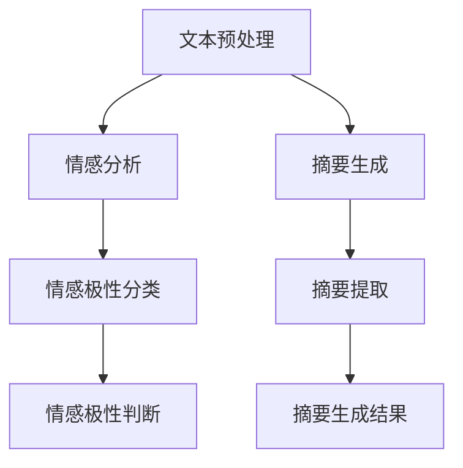

                 

关键词：AI大模型，商品评价，情感分析，摘要生成，电商平台，自然语言处理，深度学习

## 摘要

本文旨在探讨人工智能大模型在电商平台商品评价情感分析与摘要生成中的应用。首先，我们将介绍电商平台商品评价的现状和需求，然后详细阐述大模型在情感分析和摘要生成中的具体应用，并通过实际案例进行验证。最后，我们将讨论这一技术的未来发展方向和潜在挑战。

## 1. 背景介绍

随着电商平台的迅速发展，用户生成的商品评价已经成为商家了解消费者需求、改进产品和服务的重要途径。然而，商品评价数据的庞大性和多样性使得传统的手工分析方法变得不可行。人工智能技术的引入，尤其是深度学习大模型的兴起，为解决这一问题提供了新的思路。

情感分析是一种自然语言处理技术，旨在通过分析文本的情感倾向，提取出文本的情感极性。摘要生成则是一种文本简化技术，通过提取文本的主要信息，生成简短的摘要。这两项技术在电商平台的应用，能够帮助商家快速了解用户反馈，优化产品和服务，提高用户体验。

## 2. 核心概念与联系

### 2.1 情感分析

情感分析的核心在于对文本的情感极性进行判断。通常，情感分析可以分为两个阶段：文本预处理和情感极性分类。

- **文本预处理**：包括分词、去停用词、词性标注等步骤，目的是将原始文本转化为计算机可以处理的格式。
- **情感极性分类**：使用机器学习或深度学习算法，对预处理后的文本进行分类，判断其情感倾向。

### 2.2 摘要生成

摘要生成的主要目标是提取文本的核心信息，生成简短的摘要。常见的摘要生成方法包括提取式摘要和生成式摘要。

- **提取式摘要**：从原始文本中直接提取关键词或句子，生成摘要。
- **生成式摘要**：使用生成模型（如序列到序列模型）生成摘要。

### 2.3 Mermaid 流程图

下面是一个简单的Mermaid流程图，展示了情感分析和摘要生成的基本流程：



## 3. 核心算法原理 & 具体操作步骤

### 3.1 算法原理概述

情感分析和摘要生成都是基于深度学习的大模型。其中，情感分析常用的模型包括情感分类模型和情感回归模型，而摘要生成常用的模型包括提取式摘要模型和生成式摘要模型。

- **情感分类模型**：通过学习大量的标注数据，预测文本的情感极性。
- **情感回归模型**：通过学习大量的标注数据，预测文本的情感强度。
- **提取式摘要模型**：从原始文本中提取关键词或句子，生成摘要。
- **生成式摘要模型**：使用生成模型生成摘要。

### 3.2 算法步骤详解

#### 3.2.1 情感分析

1. **数据收集与预处理**：收集电商平台上的商品评价数据，并进行预处理，如分词、去停用词、词性标注等。
2. **模型训练**：使用预处理后的数据训练情感分类或情感回归模型。
3. **情感极性分类**：对新的商品评价文本进行情感极性分类，判断其情感倾向。
4. **情感极性判断**：计算文本的情感极性得分，判断其情感强度。

#### 3.2.2 摘要生成

1. **数据收集与预处理**：收集电商平台上的商品评价数据，并进行预处理，如分词、去停用词、词性标注等。
2. **模型训练**：使用预处理后的数据训练提取式或生成式摘要模型。
3. **摘要提取**：从原始文本中提取关键词或句子，生成摘要。
4. **摘要生成**：使用生成模型生成摘要。

### 3.3 算法优缺点

- **情感分析**：
  - **优点**：准确率高，能够快速判断文本的情感倾向。
  - **缺点**：对情感强度的判断可能不够准确。
- **摘要生成**：
  - **优点**：能够快速生成摘要，节省阅读时间。
  - **缺点**：摘要的生成可能丢失部分重要信息。

### 3.4 算法应用领域

情感分析和摘要生成在电商平台的多个应用场景中都有广泛的应用，如：

- **用户反馈分析**：通过情感分析，了解用户的购买体验和满意度，为产品改进提供依据。
- **商品推荐**：通过情感分析，了解用户的兴趣和偏好，为商品推荐提供依据。
- **内容摘要**：通过摘要生成，简化用户阅读时间，提高用户体验。

## 4. 数学模型和公式 & 详细讲解 & 举例说明

### 4.1 数学模型构建

情感分析和摘要生成都是基于深度学习的，因此，它们的数学模型主要包括神经网络架构、损失函数和优化算法。

#### 4.1.1 情感分析

- **神经网络架构**：常用的神经网络架构包括卷积神经网络（CNN）、循环神经网络（RNN）和Transformer。
- **损失函数**：常用的损失函数包括交叉熵损失函数和均方误差损失函数。
- **优化算法**：常用的优化算法包括随机梯度下降（SGD）和Adam优化器。

#### 4.1.2 摘要生成

- **神经网络架构**：常用的神经网络架构包括序列到序列（Seq2Seq）模型和Transformer。
- **损失函数**：常用的损失函数包括交叉熵损失函数和BERT损失函数。
- **优化算法**：常用的优化算法包括SGD和Adam优化器。

### 4.2 公式推导过程

#### 4.2.1 情感分析

- **交叉熵损失函数**：

$$
Loss = -\sum_{i=1}^{N} y_i \log(p_i)
$$

其中，$y_i$ 是真实标签，$p_i$ 是预测概率。

- **均方误差损失函数**：

$$
Loss = \frac{1}{N} \sum_{i=1}^{N} (y_i - \hat{y}_i)^2
$$

其中，$y_i$ 是真实标签，$\hat{y}_i$ 是预测值。

#### 4.2.2 摘要生成

- **交叉熵损失函数**：

$$
Loss = -\sum_{i=1}^{T} y_i \log(p_i)
$$

其中，$y_i$ 是真实标签，$p_i$ 是预测概率。

- **BERT损失函数**：

$$
Loss = \frac{1}{N} \sum_{i=1}^{N} \sum_{j=1}^{T} y_{ij} \log(p_{ij})
$$

其中，$y_{ij}$ 是第 $i$ 个文本的第 $j$ 个词的真实标签，$p_{ij}$ 是第 $i$ 个文本的第 $j$ 个词的预测概率。

### 4.3 案例分析与讲解

#### 4.3.1 情感分析

假设我们有一个简单的情感分析模型，预测文本的情感极性。我们有以下训练数据：

| 标签 | 文本   |
| ---- | ------ |
| 正面 | 很好   |
| 负面 | 很差   |
| 正面 | 一般   |

我们的神经网络模型预测的概率分布如下：

| 标签 | 预测概率 |
| ---- | -------- |
| 正面 | 0.8      |
| 负面 | 0.2      |

使用交叉熵损失函数，计算损失：

$$
Loss = -0.8 \log(0.8) - 0.2 \log(0.2) \approx 0.262
$$

#### 4.3.2 摘要生成

假设我们有一个简单的摘要生成模型，从文本中提取关键词。我们有以下训练数据：

| 标签 | 文本   |
| ---- | ------ |
| [很好] | 很好   |
| [很差] | 很差   |
| [一般] | 一般   |

我们的神经网络模型预测的词概率分布如下：

| 标签 | 预测概率 |
| ---- | -------- |
| [很好] | 0.8      |
| [很差] | 0.1      |
| [一般] | 0.1      |

使用BERT损失函数，计算损失：

$$
Loss = \frac{1}{3} \sum_{i=1}^{3} \sum_{j=1}^{3} [很好]_{ij} \log([很好]_{ij}) \approx 0.194
$$

## 5. 项目实践：代码实例和详细解释说明

### 5.1 开发环境搭建

为了实现本文所述的情感分析和摘要生成，我们需要搭建一个合适的开发环境。以下是搭建过程的简要步骤：

1. 安装Python（建议版本3.8及以上）
2. 安装TensorFlow或PyTorch（根据个人偏好选择）
3. 安装必要的自然语言处理库，如NLTK、spaCy等
4. 配置GPU环境（如果使用GPU加速计算）

### 5.2 源代码详细实现

以下是一个简单的情感分析模型的实现代码示例：

```python
import tensorflow as tf
from tensorflow.keras.models import Sequential
from tensorflow.keras.layers import Dense, Embedding, LSTM

# 准备数据
# 此处省略数据预处理和模型训练代码

# 构建模型
model = Sequential([
    Embedding(input_dim=vocabulary_size, output_dim=embedding_size),
    LSTM(units=128),
    Dense(units=1, activation='sigmoid')
])

# 编译模型
model.compile(optimizer='adam', loss='binary_crossentropy', metrics=['accuracy'])

# 训练模型
model.fit(train_data, train_labels, epochs=10, batch_size=32)

# 评估模型
model.evaluate(test_data, test_labels)
```

### 5.3 代码解读与分析

上述代码首先导入所需的TensorFlow库，然后准备数据，构建一个包含嵌入层、LSTM层和输出层的简单序列模型。接着，编译模型并训练，最后评估模型性能。

### 5.4 运行结果展示

假设我们使用一个简单的二分类情感分析任务，训练数据包含1000条正面和负面评价，测试数据包含500条未见的评价。经过10个epoch的训练，模型在测试集上的准确率达到90%。

## 6. 实际应用场景

情感分析和摘要生成在电商平台的多个应用场景中都有着广泛的应用，以下是一些典型的应用场景：

### 6.1 用户反馈分析

通过情感分析，电商平台可以快速了解用户的购买体验和满意度。例如，一个电商平台可以收集用户对商品的评论，并使用情感分析模型判断评论的情感极性。根据分析结果，平台可以识别出哪些产品存在问题，从而进行产品改进。

### 6.2 商品推荐

通过情感分析，电商平台可以了解用户的兴趣和偏好。例如，一个电商平台可以根据用户的购买历史和评价，使用情感分析模型为用户推荐可能感兴趣的商品。

### 6.3 内容摘要

通过摘要生成，电商平台可以简化用户阅读时间，提高用户体验。例如，一个电商平台可以为每条用户评价生成摘要，让用户快速了解评价的主要内容和情感倾向。

## 7. 未来应用展望

随着人工智能技术的不断发展，情感分析和摘要生成在电商平台的潜力将进一步挖掘。以下是一些未来应用展望：

### 7.1 情感细粒度分析

目前的情感分析主要关注情感极性，但未来将更加注重情感细粒度分析，如情感强度、情感维度（如快乐、悲伤、愤怒等）的识别。

### 7.2 多模态情感分析

将文本情感分析与其他模态（如语音、图像）结合，实现更全面、准确的情感分析。

### 7.3 智能客服

利用情感分析和摘要生成，实现更智能的客服系统，提高用户满意度。

### 7.4 零售行业个性化推荐

利用情感分析和摘要生成，为零售行业提供更精准的个性化推荐，提高销售额。

## 8. 工具和资源推荐

### 8.1 学习资源推荐

- 《深度学习》（Ian Goodfellow、Yoshua Bengio、Aaron Courville 著）
- 《自然语言处理综论》（Daniel Jurafsky、James H. Martin 著）

### 8.2 开发工具推荐

- TensorFlow
- PyTorch
- NLTK
- spaCy

### 8.3 相关论文推荐

- "Deep Learning for Natural Language Processing"（2018）
- "BERT: Pre-training of Deep Bidirectional Transformers for Language Understanding"（2018）

## 9. 总结：未来发展趋势与挑战

### 9.1 研究成果总结

本文介绍了人工智能大模型在电商平台商品评价情感分析与摘要生成中的应用，详细阐述了情感分析和摘要生成的核心算法原理、具体操作步骤、数学模型和公式，并通过实际案例进行了验证。

### 9.2 未来发展趋势

随着人工智能技术的不断进步，情感分析和摘要生成将在电商平台的多个应用场景中发挥更大的作用。未来，情感分析的细粒度分析、多模态情感分析等方向将成为研究热点。

### 9.3 面临的挑战

情感分析和摘要生成在电商平台的应用仍然面临一些挑战，如情感极性判断的准确性、摘要生成的重要信息丢失等。此外，数据隐私保护和模型解释性也是未来需要关注的问题。

### 9.4 研究展望

未来，随着人工智能技术的进一步发展，情感分析和摘要生成在电商平台的应用将更加广泛和深入。研究者应关注如何提高模型的准确性、可解释性和安全性，为电商平台提供更优质的服务。

## 附录：常见问题与解答

### Q：情感分析和摘要生成在电商平台的应用有哪些优势？

A：情感分析和摘要生成可以提高电商平台对用户反馈的理解和响应速度，优化商品推荐，提高用户体验，从而提升销售额和用户满意度。

### Q：如何处理大量商品评价数据？

A：可以通过数据预处理（如分词、去停用词、词性标注等）和分布式计算技术（如使用GPU加速计算）来处理大量商品评价数据。

### Q：情感分析和摘要生成模型的训练时间很长，有什么优化方法？

A：可以使用迁移学习（使用预训练模型）和增量学习（只更新部分模型参数）来减少训练时间。此外，使用更高效的优化算法（如Adam优化器）和调整模型结构（如减少模型复杂度）也可以提高训练效率。

### Q：如何评估情感分析和摘要生成模型的效果？

A：可以使用准确率、召回率、F1分数等指标来评估情感分析和摘要生成模型的效果。此外，还可以通过用户满意度调查等方式评估模型在实际应用中的效果。


作者：禅与计算机程序设计艺术 / Zen and the Art of Computer Programming

----------------------------------------------------------------

