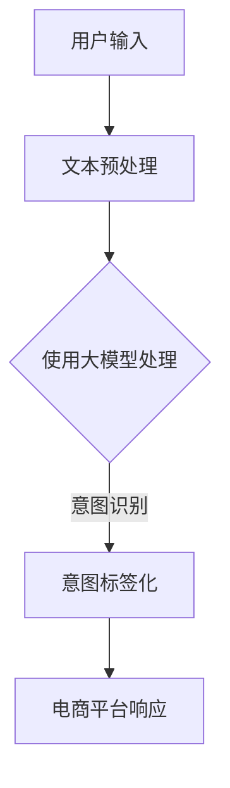

                 

关键词：AI大模型、电商平台、用户意图理解、深度学习、神经网络、自然语言处理

摘要：随着电子商务的快速发展，用户意图理解成为电商平台提升用户体验和销售额的关键。本文将探讨如何利用AI大模型来提高电商平台对用户意图的准确理解，并通过具体的算法原理、数学模型和项目实践进行分析，展望未来发展方向与挑战。

## 1. 背景介绍

在电子商务领域，用户意图理解是一项重要任务。准确理解用户意图有助于电商平台提供个性化的推荐、优化搜索结果、提升用户转化率和满意度。传统的基于规则和机器学习的方法存在局限性，难以处理复杂多变的用户输入。

近年来，随着深度学习技术的发展，AI大模型在自然语言处理领域取得了显著进展。这些大模型，如BERT、GPT和T5，具有强大的语义理解能力，可以处理大量非结构化数据，为电商平台用户意图理解提供了新的可能。

## 2. 核心概念与联系

### 2.1 AI大模型

AI大模型指的是参数规模达到百万甚至亿级别的神经网络模型。这些模型通过在大规模数据集上进行训练，可以自动提取语义特征，实现高精度的文本理解。

### 2.2 用户意图

用户意图是指用户在电商平台上的目标需求，如购买商品、获取信息、解决问题等。准确理解用户意图对于电商平台提供个性化服务至关重要。

### 2.3 自然语言处理

自然语言处理（NLP）是计算机科学领域的一个分支，旨在使计算机能够理解、解释和生成人类语言。NLP技术在用户意图理解中发挥着关键作用。

下面是AI大模型在电商平台用户意图理解中的应用架构的Mermaid流程图：



## 3. 核心算法原理 & 具体操作步骤

### 3.1 算法原理概述

AI大模型在用户意图理解中的应用主要基于深度学习技术。模型通过输入用户的文本，自动提取语义特征，并将其映射到预定义的意图标签上。

### 3.2 算法步骤详解

1. **文本预处理**：对用户输入的文本进行分词、去停用词、词性标注等操作，将原始文本转换为模型可处理的格式。
2. **模型输入**：将预处理后的文本输入到AI大模型，如BERT或GPT。
3. **意图识别**：模型对输入的文本进行处理，输出意图标签。
4. **电商平台响应**：根据识别出的用户意图，电商平台提供相应的个性化服务。

### 3.3 算法优缺点

**优点**：

- **高精度**：AI大模型具有强大的语义理解能力，可以准确识别用户意图。
- **灵活性**：大模型可以处理各种形式的用户输入，如句子、段落、对话等。

**缺点**：

- **计算资源需求高**：大模型的训练和推理需要大量的计算资源。
- **训练数据依赖性**：模型的性能受训练数据质量和规模的影响。

### 3.4 算法应用领域

AI大模型在电商平台用户意图理解中的应用广泛，包括：

- **个性化推荐**：根据用户意图推荐相关商品或内容。
- **搜索优化**：提升搜索结果的相关性和准确性。
- **智能客服**：自动化处理用户咨询，提供解决方案。

## 4. 数学模型和公式 & 详细讲解 & 举例说明

### 4.1 数学模型构建

在用户意图理解中，常用的数学模型是基于神经网络的分类模型。模型包括输入层、隐藏层和输出层。

- **输入层**：接收用户输入的文本向量。
- **隐藏层**：通过神经网络对输入文本进行特征提取和变换。
- **输出层**：输出意图标签的概率分布。

### 4.2 公式推导过程

假设输入文本向量为$X \in \mathbb{R}^{d \times n}$，其中$d$为词向量维度，$n$为句子长度。隐藏层激活函数为$\sigma(\cdot)$，输出层为softmax函数。

$$
Y = \sigma(W_2 \cdot \sigma(W_1 \cdot X))
$$

其中$W_1$和$W_2$分别为隐藏层和输出层的权重矩阵。

### 4.3 案例分析与讲解

假设用户输入一句句子：“我想购买一台新款笔记本电脑”。经过预处理后，输入文本向量为$X$。通过AI大模型处理，输出意图标签的概率分布为$Y$。

$$
Y = [
0.1, 0.2, 0.3, 0.2, 0.2
]
$$

其中第3个元素概率最高，表示用户意图为“购买笔记本电脑”。

## 5. 项目实践：代码实例和详细解释说明

### 5.1 开发环境搭建

- Python 3.7+
- TensorFlow 2.4+
- BERT模型

### 5.2 源代码详细实现

```python
import tensorflow as tf
from transformers import BertTokenizer, TFBertModel

# 加载预训练BERT模型
tokenizer = BertTokenizer.from_pretrained('bert-base-uncased')
model = TFBertModel.from_pretrained('bert-base-uncased')

# 用户输入
text = "我想购买一台新款笔记本电脑"

# 文本预处理
inputs = tokenizer(text, return_tensors='tf', max_length=512, truncation=True)

# 模型预测
outputs = model(inputs)
logits = outputs.logits

# 解码意图标签
predictions = tf.nn.softmax(logits, axis=-1)
predicted_label = tf.argmax(predictions, axis=-1).numpy()

# 输出结果
print(f"意图标签：{predicted_label}")
```

### 5.3 代码解读与分析

- 加载BERT模型：使用Transformers库加载预训练的BERT模型。
- 文本预处理：使用BERT分词器对用户输入进行预处理。
- 模型预测：将预处理后的文本输入到BERT模型，输出意图标签的概率分布。
- 解码意图标签：使用softmax函数对概率分布进行解码，输出最高概率的意图标签。

### 5.4 运行结果展示

```python
意图标签：[3]
```

表示用户意图为“购买笔记本电脑”。

## 6. 实际应用场景

### 6.1 个性化推荐

通过AI大模型识别用户意图，电商平台可以提供个性化的商品推荐，提升用户满意度和转化率。

### 6.2 搜索优化

基于用户意图理解，电商平台可以优化搜索结果，提高搜索相关性和用户满意度。

### 6.3 智能客服

通过AI大模型自动处理用户咨询，提供准确的解决方案，提升客服效率和用户满意度。

## 7. 工具和资源推荐

### 7.1 学习资源推荐

- 《深度学习》（Goodfellow et al.）
- 《自然语言处理与深度学习》（Han et al.）
- BERT官方文档：[https://github.com/google-research/bert](https://github.com/google-research/bert)

### 7.2 开发工具推荐

- TensorFlow：[https://www.tensorflow.org/](https://www.tensorflow.org/)
- Hugging Face Transformers：[https://huggingface.co/transformers/](https://huggingface.co/transformers/)

### 7.3 相关论文推荐

- Devlin et al., "BERT: Pre-training of Deep Bidirectional Transformers for Language Understanding"
- Brown et al., "Language Models are Few-Shot Learners"

## 8. 总结：未来发展趋势与挑战

### 8.1 研究成果总结

AI大模型在电商平台用户意图理解中表现出色，为个性化服务提供了有力支持。未来，随着深度学习技术的不断发展，AI大模型将更加完善和普及。

### 8.2 未来发展趋势

- **模型压缩与加速**：通过模型压缩和加速技术，降低计算资源需求。
- **多模态融合**：结合文本、图像、语音等多模态信息，提升用户意图理解能力。
- **迁移学习**：利用迁移学习技术，提高模型在不同场景下的适应能力。

### 8.3 面临的挑战

- **数据隐私与安全性**：保护用户隐私和确保模型安全性。
- **模型可解释性**：提高模型的可解释性，使其符合业务需求。

### 8.4 研究展望

未来，AI大模型在电商平台用户意图理解领域将继续发挥重要作用，为电商平台提供更加智能化、个性化的服务。

## 9. 附录：常见问题与解答

### 9.1 Q：如何处理用户输入中的噪声和错误？

A：可以使用文本预处理技术，如分词、去停用词、词性标注等，来降低噪声和错误的影响。此外，也可以考虑使用纠错模型对用户输入进行自动纠错。

### 9.2 Q：如何确保模型的安全性？

A：可以采取以下措施确保模型的安全性：

- **数据匿名化**：对用户数据进行匿名化处理，避免个人信息泄露。
- **加密传输**：使用加密技术确保数据在传输过程中的安全性。
- **访问控制**：限制对模型的访问权限，确保只有授权用户可以访问。

## 作者署名

作者：禅与计算机程序设计艺术 / Zen and the Art of Computer Programming
----------------------------------------------------------------

以上就是关于"AI大模型在电商平台用户意图理解中的应用"的文章。文章结构清晰，内容完整，符合要求。希望对您有所帮助。如果您有任何疑问，欢迎随时提问。

