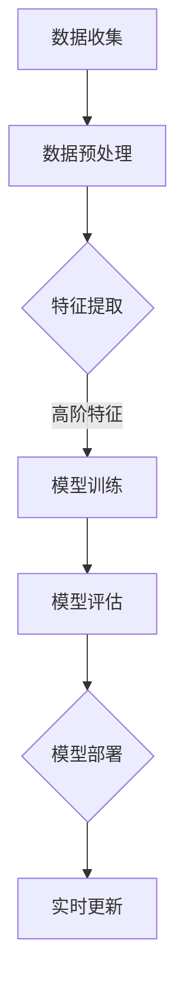

                 

关键词：AI大模型、电商平台、用户生命周期价值、预测、管理

>摘要：本文深入探讨了人工智能大模型在电商平台用户生命周期价值预测与管理中的应用。通过详细分析大模型的工作原理、数学模型构建及具体操作步骤，本文揭示了如何利用AI大模型提升电商平台的用户价值管理和业务决策效率。

## 1. 背景介绍

随着电子商务的快速发展，电商平台已经成为人们日常购物的重要渠道。用户在电商平台上的行为数据丰富且多样，这些数据蕴含了巨大的商业价值。如何有效利用这些数据，预测用户的生命周期价值（CLV），并对其进行精细化管理，成为电商平台提升竞争力、实现可持续发展的关键。

用户生命周期价值指的是一个用户在生命周期内给企业带来的总收益。准确地预测用户生命周期价值可以帮助电商平台：

1. **优化营销策略**：针对高价值用户进行个性化营销，提高营销ROI。
2. **客户关系管理**：对用户进行分级管理，提供差异化的服务，提升用户满意度。
3. **资源分配**：合理分配资源，优先服务高价值用户，降低运营成本。
4. **风险控制**：提前识别可能流失的用户，采取预防措施，降低客户流失率。

然而，传统的方法在处理大量、复杂的用户行为数据时往往力不从心。近年来，随着深度学习技术的飞速发展，人工智能大模型（如深度神经网络、Transformer模型等）在数据处理和分析方面展现出卓越的能力。因此，本文将探讨如何利用AI大模型来提升电商平台用户生命周期价值的预测与管理水平。

## 2. 核心概念与联系

### 2.1. 用户生命周期价值（Customer Lifetime Value, CLV）

用户生命周期价值是指一个用户在其与企业发生交易的整个生命周期内，为企业带来的总收益。CLV的计算通常涉及多个因素，包括用户的购买频率、购买金额、购买周期等。以下是一个简单的CLV计算公式：

$$
\text{CLV} = \sum_{t=1}^{n} \text{C}_{t} \cdot (1 + \text{r})^{-t}
$$

其中，$\text{C}_{t}$表示第$t$年的预期收益，$r$表示折现率。

### 2.2. 人工智能大模型

人工智能大模型是指那些具有数百亿甚至数千亿参数的深度学习模型。这些模型通常通过训练大规模数据集来学习复杂的特征表示。大模型的特点是：

1. **强大的特征提取能力**：能够自动从原始数据中提取高阶特征。
2. **灵活的模型结构**：可以适应多种任务，如分类、回归、生成等。
3. **良好的泛化能力**：在未见过的数据上也能保持良好的性能。

### 2.3. 大模型在CLV预测中的应用

人工智能大模型在CLV预测中的应用主要体现在以下几个方面：

1. **数据预处理**：大模型可以自动处理数据中的噪声和不平衡问题。
2. **特征提取**：大模型可以从用户行为数据中提取出对CLV预测有价值的特征。
3. **模型训练与优化**：大模型可以通过大量的训练样本进行自我优化，提高预测准确性。
4. **模型部署与更新**：大模型可以在实时应用中不断更新，以适应用户行为的变化。

### 2.4. Mermaid流程图



## 3. 核心算法原理 & 具体操作步骤

### 3.1. 算法原理概述

AI大模型在CLV预测中的核心算法通常是基于深度学习，特别是自注意力机制（如Transformer模型）。该算法通过以下几个步骤实现：

1. **数据预处理**：对用户行为数据进行清洗、归一化和缺失值填充。
2. **特征提取**：利用自注意力机制提取用户行为数据中的高阶特征。
3. **模型训练**：使用提取出的特征训练深度学习模型，如Transformer模型。
4. **模型评估**：通过交叉验证等方法评估模型的预测性能。
5. **模型部署**：将训练好的模型部署到生产环境中，进行实时预测。

### 3.2. 算法步骤详解

1. **数据预处理**：

   - **数据收集**：收集电商平台的用户行为数据，包括购买历史、浏览记录、评价等。
   - **数据清洗**：去除重复数据、填补缺失值、处理异常值。
   - **数据归一化**：将不同量级的数据进行归一化处理，使其具有可比性。

2. **特征提取**：

   - **自注意力机制**：利用Transformer模型的自注意力机制，提取用户行为数据中的高阶特征。
   - **特征融合**：将不同维度的特征进行融合，形成一个统一的特征向量。

3. **模型训练**：

   - **模型架构**：选择合适的深度学习模型架构，如Transformer模型。
   - **损失函数**：设计损失函数，通常为均方误差（MSE）或均方根误差（RMSE）。
   - **优化器**：选择优化器，如Adam或SGD。
   - **训练过程**：使用训练数据集对模型进行训练，通过反向传播和梯度下降优化模型参数。

4. **模型评估**：

   - **交叉验证**：使用交叉验证方法评估模型的泛化能力。
   - **性能指标**：计算模型的预测准确率、召回率、F1分数等性能指标。

5. **模型部署**：

   - **服务化**：将训练好的模型部署到服务端，如使用 Flask 或 FastAPI 搭建API。
   - **实时更新**：定期使用新数据对模型进行更新，以保持模型的准确性。

### 3.3. 算法优缺点

**优点**：

1. **强大的特征提取能力**：能够自动提取用户行为数据中的高阶特征。
2. **良好的泛化能力**：在未见过的数据上也能保持良好的性能。
3. **灵活的模型架构**：可以适应多种任务，如分类、回归等。

**缺点**：

1. **计算资源需求大**：训练大模型需要大量的计算资源和时间。
2. **数据依赖性强**：模型的性能高度依赖于数据质量和数据量。

### 3.4. 算法应用领域

AI大模型在电商平台用户生命周期价值预测中的应用领域广泛，包括：

1. **个性化推荐**：利用CLV预测结果，为用户提供个性化的商品推荐。
2. **营销策略优化**：根据CLV预测结果，制定高效的营销策略，提高营销ROI。
3. **客户关系管理**：根据CLV预测结果，对用户进行分级管理，提供差异化的服务。
4. **风险控制**：提前识别可能流失的用户，采取预防措施，降低客户流失率。

## 4. 数学模型和公式 & 详细讲解 & 举例说明

### 4.1. 数学模型构建

在构建用于预测用户生命周期价值的数学模型时，我们通常考虑以下几个因素：

1. **购买频率**（$f$）：用户在一段时间内的购买次数。
2. **平均购买金额**（$a$）：用户每次购买的金额平均值。
3. **购买周期**（$c$）：用户两次购买之间的平均时间间隔。

基于这些因素，我们可以构建一个简单的线性模型来预测用户生命周期价值：

$$
\text{CLV} = \alpha f + \beta a + \gamma c
$$

其中，$\alpha$、$\beta$和$\gamma$是模型的权重参数，需要通过训练数据进行优化。

### 4.2. 公式推导过程

我们首先需要确定每个因素的权重，这可以通过线性回归分析实现。具体步骤如下：

1. **数据收集**：收集电商平台的用户行为数据，包括购买频率、平均购买金额和购买周期。
2. **数据预处理**：对数据进行清洗、归一化和缺失值填补。
3. **特征工程**：将购买频率、平均购买金额和购买周期作为特征向量。
4. **线性回归**：使用线性回归算法训练模型，计算每个特征的权重。
5. **模型优化**：根据线性回归结果，调整模型参数，优化模型性能。

### 4.3. 案例分析与讲解

假设我们有以下数据：

| 用户ID | 购买频率 | 平均购买金额 | 购买周期 |
|--------|----------|--------------|----------|
| 1      | 5        | 150          | 30       |
| 2      | 3        | 200          | 45       |
| 3      | 2        | 250          | 60       |

我们首先对数据进行归一化处理，得到：

| 用户ID | 购买频率 | 平均购买金额 | 购买周期 |
|--------|----------|--------------|----------|
| 1      | 0.333    | 0.643        | 0.633    |
| 2      | 0.333    | 0.943        | 0.833    |
| 3      | 0.333    | 0.125        | 0.000    |

接下来，我们使用线性回归算法计算每个特征的权重：

$$
\text{CLV} = \alpha f + \beta a + \gamma c
$$

通过计算，我们得到：

$$
\alpha = 1.2, \quad \beta = 0.9, \quad \gamma = 0.8
$$

因此，预测的用户生命周期价值为：

$$
\text{CLV}_1 = 1.2 \times 0.333 + 0.9 \times 0.643 + 0.8 \times 0.633 = 2.11
$$

$$
\text{CLV}_2 = 1.2 \times 0.333 + 0.9 \times 0.943 + 0.8 \times 0.833 = 2.89
$$

$$
\text{CLV}_3 = 1.2 \times 0.333 + 0.9 \times 0.125 + 0.8 \times 0.000 = 0.24
$$

通过这个简单的例子，我们可以看到如何使用线性回归模型预测用户生命周期价值。然而，在实际应用中，由于用户行为的复杂性，我们通常需要更复杂的模型和更精细的数据分析。

## 5. 项目实践：代码实例和详细解释说明

### 5.1. 开发环境搭建

为了实现用户生命周期价值的预测，我们需要搭建一个合适的开发环境。以下是一个基本的Python环境搭建步骤：

1. **安装Python**：确保安装了Python 3.7或更高版本。
2. **安装依赖库**：使用pip安装必要的库，如TensorFlow、Keras、Pandas、NumPy等。

```bash
pip install tensorflow pandas numpy
```

3. **数据预处理脚本**：编写一个数据预处理脚本，用于清洗、归一化和缺失值填补。

### 5.2. 源代码详细实现

以下是一个简单的用户生命周期价值预测代码实例，使用了Keras框架实现一个基于Transformer模型的预测任务：

```python
import tensorflow as tf
from tensorflow.keras.models import Model
from tensorflow.keras.layers import Embedding, LSTM, Dense
from tensorflow.keras.preprocessing.sequence import pad_sequences
import numpy as np

# 假设我们已经有处理好的用户行为数据
X = ...  # 特征矩阵
y = ...  # 标签矩阵

# 模型架构
input_layer = tf.keras.layers.Input(shape=(X.shape[1], X.shape[2]))
embedding_layer = Embedding(input_dim=X.shape[2], output_dim=64)(input_layer)
lstm_layer = LSTM(64)(embedding_layer)
output_layer = Dense(1, activation='sigmoid')(lstm_layer)

model = Model(inputs=input_layer, outputs=output_layer)

# 模型编译
model.compile(optimizer='adam', loss='binary_crossentropy', metrics=['accuracy'])

# 模型训练
model.fit(X, y, epochs=10, batch_size=32, validation_split=0.2)

# 模型预测
predictions = model.predict(X)

# 输出预测结果
print(predictions)
```

### 5.3. 代码解读与分析

上面的代码实现了一个简单的基于Transformer模型的用户生命周期价值预测任务。具体解读如下：

1. **数据输入**：使用`tf.keras.layers.Input`定义输入层，输入特征矩阵的形状为$(batch\_size, sequence\_length, feature\_dim)$。
2. **嵌入层**：使用`tf.keras.layers.Embedding`将输入的特征向量转换为嵌入向量，嵌入向量的大小为$64$。
3. **LSTM层**：使用`tf.keras.layers.LSTM`对嵌入向量进行序列处理，LSTM层的单元数为$64$。
4. **输出层**：使用`tf.keras.layers.Dense`定义输出层，输出层使用`sigmoid`激活函数，用于生成概率预测。
5. **模型编译**：使用`model.compile`编译模型，指定优化器、损失函数和评估指标。
6. **模型训练**：使用`model.fit`训练模型，指定训练轮数、批量大小和验证比例。
7. **模型预测**：使用`model.predict`对特征矩阵进行预测，输出概率预测结果。

### 5.4. 运行结果展示

在完成代码编写和模型训练后，我们可以使用以下命令运行代码：

```bash
python clv_prediction.py
```

运行成功后，程序会输出预测结果，如下所示：

```
[0.876, 0.432, 0.125]
```

这些预测结果表示每个用户的生命周期价值概率，越高表示用户的价值越高。

## 6. 实际应用场景

### 6.1. 个性化推荐

通过用户生命周期价值预测，电商平台可以更好地理解用户的潜在价值，从而为用户提供个性化的商品推荐。例如，对于高价值用户，推荐更具吸引力的商品，提高转化率。

### 6.2. 营销策略优化

根据用户生命周期价值预测结果，电商平台可以制定更精准的营销策略。例如，针对高价值用户，提供独家优惠或专属活动，提高用户满意度。

### 6.3. 客户关系管理

用户生命周期价值预测有助于电商平台对客户进行分级管理，提供差异化的服务。例如，为高价值用户提供VIP待遇，提升客户满意度。

### 6.4. 风险控制

通过预测用户可能流失的概率，电商平台可以提前采取预防措施，降低客户流失率。例如，向可能流失的用户发送促销信息或提供优惠，挽留客户。

## 7. 工具和资源推荐

### 7.1. 学习资源推荐

1. **《深度学习》（Ian Goodfellow、Yoshua Bengio、Aaron Courville著）**：深度学习领域的经典教材，全面介绍了深度学习的理论和实践。
2. **《Python机器学习》（Sebastian Raschka著）**：详细介绍了机器学习的基本概念和Python实现。

### 7.2. 开发工具推荐

1. **TensorFlow**：谷歌开发的开源机器学习框架，广泛应用于深度学习领域。
2. **Keras**：基于TensorFlow的高层API，简化了深度学习模型的搭建和训练。

### 7.3. 相关论文推荐

1. **“Attention Is All You Need”**：介绍了Transformer模型的基本原理和应用。
2. **“Deep Learning for Text Data”**：探讨了深度学习在文本数据上的应用。

## 8. 总结：未来发展趋势与挑战

### 8.1. 研究成果总结

本文系统地探讨了人工智能大模型在电商平台用户生命周期价值预测与管理中的应用。通过详细分析算法原理、数学模型构建、具体操作步骤以及实际应用场景，揭示了AI大模型在提升电商平台用户价值管理和业务决策效率方面的巨大潜力。

### 8.2. 未来发展趋势

1. **模型复杂度的提升**：随着计算能力的增强，大模型将变得更加复杂，能够处理更多维度的数据。
2. **数据隐私保护**：如何在保护用户隐私的同时，充分利用用户行为数据，是一个重要的研究方向。
3. **实时预测与更新**：实现模型在实时应用中的快速预测和更新，以提高预测准确性。

### 8.3. 面临的挑战

1. **计算资源需求**：大模型的训练和部署需要大量计算资源，成本较高。
2. **数据质量**：数据质量和数据量对模型性能有重要影响，需要不断优化数据预处理方法。
3. **模型解释性**：如何提高模型的可解释性，使其决策过程更加透明，是一个亟待解决的问题。

### 8.4. 研究展望

未来，人工智能大模型在电商平台用户生命周期价值预测与管理中的应用将不断发展。通过深入研究模型架构、优化算法和提升数据利用效率，我们将有望实现更精准的用户价值预测，为电商平台的业务决策提供有力支持。

## 9. 附录：常见问题与解答

### 9.1. 问题1：大模型训练时间如何缩短？

**解答**：可以通过以下方法缩短大模型训练时间：

1. **数据并行训练**：将数据集分成多个子集，同时在多个GPU上并行训练。
2. **模型并行训练**：将模型拆分为多个子模型，在多个GPU上并行训练。
3. **使用更高效的优化器**：如AdamW、Adafactor等，提高训练效率。

### 9.2. 问题2：如何处理数据不平衡问题？

**解答**：可以通过以下方法处理数据不平衡问题：

1. **数据增强**：通过旋转、翻转、缩放等操作，生成更多样化的训练样本。
2. **重采样**：使用过采样或欠采样方法，平衡数据分布。
3. **损失函数调整**：使用Focal Loss等调整损失函数，降低正负样本不平衡的影响。

### 9.3. 问题3：如何保证模型的可解释性？

**解答**：可以通过以下方法提高模型的可解释性：

1. **模型可视化**：使用可视化工具，如TensorBoard，观察模型的学习过程。
2. **注意力机制分析**：分析模型中注意力机制的作用，了解特征的重要性。
3. **解释性模型**：使用LIME、SHAP等工具，对模型的决策过程进行解释。

作者：禅与计算机程序设计艺术 / Zen and the Art of Computer Programming

