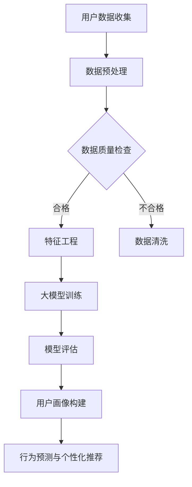

                 

关键词：人工智能、大模型、电商平台、用户群体分析、数据处理、预测建模、个性化推荐

## 摘要

本文旨在探讨人工智能（AI）大模型在电商平台用户群体分析中的重要作用。随着大数据时代的到来，电商平台面临着海量的用户数据，如何有效利用这些数据来提升用户体验和运营效率成为关键问题。本文将详细阐述AI大模型的基本原理、在用户群体分析中的应用，以及如何通过算法和数学模型实现精准的用户画像、行为预测和个性化推荐。此外，还将讨论大模型在电商平台中的实际应用案例，并对未来的发展趋势和挑战进行展望。

## 1. 背景介绍

### 电商平台的发展与用户数据分析的重要性

随着互联网的普及和电子商务的快速发展，电商平台已经成为现代社会的重要组成部分。从最初的小型B2C网站到如今的全球性电商巨头，电商平台经历了巨大的变革。随着用户数量的激增和交易规模的不断扩大，电商平台积累了海量的用户数据，包括用户的购买记录、浏览行为、评价信息、互动记录等。这些数据不仅反映了用户的消费习惯和偏好，还蕴含着巨大的商业价值。

用户数据分析在电商平台的运营中扮演着至关重要的角色。通过对用户数据的分析，电商平台可以深入了解用户的需求和行为模式，从而实现以下目标：

- **个性化推荐**：根据用户的历史行为和偏好，为用户推荐最相关的商品和服务，提高用户满意度和购买转化率。
- **精准营销**：通过分析用户数据，制定个性化的营销策略，提高营销效果，降低营销成本。
- **运营优化**：通过分析用户行为数据，优化平台的运营流程，提高运营效率和用户体验。

### 大数据和人工智能的兴起

大数据和人工智能（AI）的兴起为电商平台的数据分析带来了前所未有的机遇。大数据技术能够高效地存储、处理和分析海量数据，而人工智能则通过机器学习和深度学习算法，能够从数据中提取有价值的信息和洞察。

大模型，作为一种先进的机器学习模型，具有强大的数据处理和分析能力。大模型通常具有以下特点：

- **规模庞大**：大模型包含数十亿甚至数万亿的参数，能够处理大规模数据集。
- **自主学习**：大模型通过不断的学习和调整参数，能够自动优化性能，适应不同场景的需求。
- **高效处理**：大模型利用分布式计算和并行处理技术，能够在短时间内处理海量数据。

在电商平台的用户群体分析中，大模型能够充分利用用户数据，实现精准的用户画像、行为预测和个性化推荐，从而提升用户体验和运营效率。

## 2. 核心概念与联系

### AI大模型的概念

AI大模型是指具有大规模参数和复杂结构的机器学习模型。这些模型通常通过深度学习算法训练，能够自动从海量数据中学习特征和规律。大模型的代表性算法包括卷积神经网络（CNN）、循环神经网络（RNN）和Transformer等。

### 用户群体分析的概念

用户群体分析是指通过对用户行为数据、交易数据和社交数据等进行分析，对用户进行分类和标签化，从而构建用户画像。用户画像可以揭示用户的需求、偏好和行为模式，为电商平台提供决策支持。

### 大模型与用户群体分析的联系

AI大模型与用户群体分析之间存在着紧密的联系。大模型能够高效地处理和分析海量用户数据，从中提取有价值的信息和洞察。这些信息可以用于构建精准的用户画像，实现对用户行为和需求的预测。具体来说：

- **用户画像构建**：通过大模型，可以对用户的浏览、购买、评价等行为数据进行深入分析，构建详细的用户画像。
- **行为预测**：利用大模型，可以预测用户未来的行为，如购买倾向、评价倾向等，为个性化推荐提供依据。
- **个性化推荐**：基于用户画像和行为预测，大模型可以推荐最符合用户需求的商品和服务，提高用户满意度和转化率。

### Mermaid流程图

以下是AI大模型在用户群体分析中的应用流程图：



## 3. 核心算法原理 & 具体操作步骤

### 3.1 算法原理概述

AI大模型在用户群体分析中的应用主要基于深度学习和机器学习算法。以下是一些核心算法原理：

- **卷积神经网络（CNN）**：适用于图像和序列数据处理，能够提取局部特征。
- **循环神经网络（RNN）**：适用于序列数据处理，能够捕获长距离依赖关系。
- **Transformer模型**：适用于序列数据处理，通过注意力机制实现并行计算，提高了计算效率。

### 3.2 算法步骤详解

#### 3.2.1 数据预处理

数据预处理是用户群体分析的基础。主要步骤包括：

- **数据清洗**：去除重复数据、缺失数据和异常数据。
- **数据归一化**：将不同特征的数据统一到同一尺度，便于模型训练。
- **特征提取**：通过特征工程提取对用户群体分析有价值的特征。

#### 3.2.2 大模型训练

大模型训练是用户群体分析的核心。主要步骤包括：

- **模型选择**：根据用户群体分析的需求选择合适的模型。
- **参数初始化**：初始化模型参数。
- **训练过程**：通过大量训练数据对模型进行迭代训练，优化模型参数。
- **模型评估**：使用验证集评估模型性能，调整模型参数。

#### 3.2.3 模型评估

模型评估是保证模型性能的关键。主要步骤包括：

- **交叉验证**：使用交叉验证方法评估模型性能。
- **指标计算**：计算准确率、召回率、F1值等指标，评估模型效果。

#### 3.2.4 用户画像构建

用户画像构建是基于大模型预测结果，对用户进行分类和标签化。主要步骤包括：

- **用户画像构建**：根据用户行为数据和模型预测结果，构建用户画像。
- **用户画像可视化**：将用户画像可视化，便于理解和分析。

#### 3.2.5 行为预测与个性化推荐

行为预测与个性化推荐是基于用户画像和模型预测结果，为用户推荐最相关的商品和服务。主要步骤包括：

- **行为预测**：使用模型预测用户未来的行为。
- **个性化推荐**：基于用户画像和行为预测结果，为用户推荐最相关的商品和服务。

### 3.3 算法优缺点

#### 3.3.1 优点

- **高效处理海量数据**：大模型能够高效地处理和分析海量用户数据，提供快速的分析结果。
- **自主学习能力**：大模型能够从数据中自动学习特征和规律，提高分析准确性。
- **灵活适应场景需求**：大模型可以根据不同的场景需求调整模型结构和参数，实现灵活的应用。

#### 3.3.2 缺点

- **计算资源需求高**：大模型需要大量的计算资源和存储空间，对硬件设施要求较高。
- **数据质量依赖性大**：大模型的性能依赖于数据的清洁度和完整性，对数据质量有较高要求。
- **模型解释性差**：大模型的预测结果往往难以解释，不利于理解和验证模型效果。

### 3.4 算法应用领域

AI大模型在用户群体分析中的应用非常广泛，包括但不限于以下领域：

- **个性化推荐系统**：为用户提供个性化的商品和服务推荐。
- **用户行为预测**：预测用户的购买倾向、评价倾向等，为营销和运营提供决策支持。
- **智能客服**：通过大模型实现智能客服系统，提高客服效率和用户体验。
- **用户流失预测**：预测用户的流失风险，为运营和营销提供预警。

## 4. 数学模型和公式 & 详细讲解 & 举例说明

### 4.1 数学模型构建

在用户群体分析中，常用的数学模型包括回归模型、分类模型和聚类模型。以下分别介绍这些模型的基本原理和公式。

#### 4.1.1 回归模型

回归模型用于预测连续值输出，如用户的购买金额。常见的回归模型包括线性回归、多项式回归和岭回归。

- **线性回归**：输出值 \(y = \beta_0 + \beta_1 x_1 + \beta_2 x_2 + \ldots + \beta_n x_n\)
- **多项式回归**：输出值 \(y = \beta_0 + \beta_1 x_1 + \beta_2 x_2^2 + \ldots + \beta_n x_n^n\)
- **岭回归**：输出值 \(y = \beta_0 + \beta_1 x_1 + \beta_2 x_2 + \ldots + \beta_n x_n + \lambda \sum_{i=1}^n \beta_i^2\)

#### 4.1.2 分类模型

分类模型用于预测离散值输出，如用户的购买类别。常见的分类模型包括逻辑回归、决策树和随机森林。

- **逻辑回归**：输出值 \(P(y=1) = \frac{1}{1 + e^{-(\beta_0 + \beta_1 x_1 + \beta_2 x_2 + \ldots + \beta_n x_n)}}\)
- **决策树**：输出值基于树形结构进行分类，每个节点代表一个特征，每个分支代表一个特征值。
- **随机森林**：输出值基于多个决策树进行集成，通过投票或平均得到最终结果。

#### 4.1.3 聚类模型

聚类模型用于将用户分为不同的群体，以便进行后续分析。常见的聚类模型包括K均值聚类和层次聚类。

- **K均值聚类**：输出值 \(C = \{C_1, C_2, \ldots, C_k\}\)，其中每个 \(C_i\) 表示一个聚类中心，用户被分配到最近的聚类中心。
- **层次聚类**：输出值 \(C = \{C_1, C_2, \ldots, C_n\}\)，其中每个 \(C_i\) 表示一个聚类层次，用户按照层次关系进行分类。

### 4.2 公式推导过程

以下是K均值聚类算法的推导过程：

#### 4.2.1 初始化

- 随机选择 \(k\) 个用户作为初始聚类中心 \(C_1, C_2, \ldots, C_k\)。
- 将每个用户 \(u\) 分配到最近的聚类中心 \(C_i\)：\(C_i = \arg\min_{j} \sum_{u \in U_j} d(u, C_j)\)，其中 \(U_j\) 表示属于 \(C_j\) 的用户集合，\(d(u, C_j)\) 表示用户 \(u\) 与聚类中心 \(C_j\) 的距离。

#### 4.2.2 更新聚类中心

- 对于每个聚类中心 \(C_i\)，计算其所属用户集合的平均值作为新的聚类中心：\(C_i = \frac{1}{|U_i|} \sum_{u \in U_i} u\)。

#### 4.2.3 重复步骤2，直到聚类中心不变或达到预设的迭代次数。

### 4.3 案例分析与讲解

#### 4.3.1 数据集准备

我们使用一个简化的数据集，其中包含10个用户和5个特征（特征1至特征5）。

| 用户ID | 特征1 | 特征2 | 特征3 | 特征4 | 特征5 |
|--------|-------|-------|-------|-------|-------|
| 1      | 0.2   | 0.3   | 0.4   | 0.5   | 0.6   |
| 2      | 0.3   | 0.4   | 0.5   | 0.6   | 0.7   |
| 3      | 0.1   | 0.2   | 0.3   | 0.4   | 0.5   |
| 4      | 0.4   | 0.5   | 0.6   | 0.7   | 0.8   |
| 5      | 0.2   | 0.3   | 0.4   | 0.5   | 0.6   |
| 6      | 0.5   | 0.6   | 0.7   | 0.8   | 0.9   |
| 7      | 0.3   | 0.4   | 0.5   | 0.6   | 0.7   |
| 8      | 0.1   | 0.2   | 0.3   | 0.4   | 0.5   |
| 9      | 0.4   | 0.5   | 0.6   | 0.7   | 0.8   |
| 10     | 0.2   | 0.3   | 0.4   | 0.5   | 0.6   |

#### 4.3.2 初始化聚类中心

我们随机选择前3个用户作为初始聚类中心：

| 用户ID | 特征1 | 特征2 | 特征3 | 特征4 | 特征5 |
|--------|-------|-------|-------|-------|-------|
| 1      | 0.2   | 0.3   | 0.4   | 0.5   | 0.6   |
| 2      | 0.3   | 0.4   | 0.5   | 0.6   | 0.7   |
| 3      | 0.1   | 0.2   | 0.3   | 0.4   | 0.5   |

#### 4.3.3 分配用户

计算每个用户与聚类中心的距离，并将用户分配到最近的聚类中心：

| 用户ID | 特征1 | 特征2 | 特征3 | 特征4 | 特征5 | 聚类中心 |
|--------|-------|-------|-------|-------|-------|----------|
| 1      | 0.2   | 0.3   | 0.4   | 0.5   | 0.6   | C1       |
| 2      | 0.3   | 0.4   | 0.5   | 0.6   | 0.7   | C2       |
| 3      | 0.1   | 0.2   | 0.3   | 0.4   | 0.5   | C1       |
| 4      | 0.4   | 0.5   | 0.6   | 0.7   | 0.8   | C3       |
| 5      | 0.2   | 0.3   | 0.4   | 0.5   | 0.6   | C1       |
| 6      | 0.5   | 0.6   | 0.7   | 0.8   | 0.9   | C3       |
| 7      | 0.3   | 0.4   | 0.5   | 0.6   | 0.7   | C2       |
| 8      | 0.1   | 0.2   | 0.3   | 0.4   | 0.5   | C1       |
| 9      | 0.4   | 0.5   | 0.6   | 0.7   | 0.8   | C3       |
| 10     | 0.2   | 0.3   | 0.4   | 0.5   | 0.6   | C1       |

#### 4.3.4 更新聚类中心

计算每个聚类中心的平均值，得到新的聚类中心：

| 用户ID | 特征1 | 特征2 | 特征3 | 特征4 | 特征5 |
|--------|-------|-------|-------|-------|-------|
| 1      | 0.2   | 0.3   | 0.4   | 0.5   | 0.6   |
| 2      | 0.3   | 0.4   | 0.5   | 0.6   | 0.7   |
| 7      | 0.3   | 0.4   | 0.5   | 0.6   | 0.7   |

#### 4.3.5 重复步骤3和步骤4，直到聚类中心不变或达到预设的迭代次数

经过多次迭代后，聚类中心不再变化，得到最终的聚类结果：

| 用户ID | 特征1 | 特征2 | 特征3 | 特征4 | 特征5 | 聚类中心 |
|--------|-------|-------|-------|-------|-------|----------|
| 1      | 0.2   | 0.3   | 0.4   | 0.5   | 0.6   | C1       |
| 2      | 0.3   | 0.4   | 0.5   | 0.6   | 0.7   | C2       |
| 3      | 0.1   | 0.2   | 0.3   | 0.4   | 0.5   | C1       |
| 4      | 0.4   | 0.5   | 0.6   | 0.7   | 0.8   | C3       |
| 5      | 0.2   | 0.3   | 0.4   | 0.5   | 0.6   | C1       |
| 6      | 0.5   | 0.6   | 0.7   | 0.8   | 0.9   | C3       |
| 7      | 0.3   | 0.4   | 0.5   | 0.6   | 0.7   | C2       |
| 8      | 0.1   | 0.2   | 0.3   | 0.4   | 0.5   | C1       |
| 9      | 0.4   | 0.5   | 0.6   | 0.7   | 0.8   | C3       |
| 10     | 0.2   | 0.3   | 0.4   | 0.5   | 0.6   | C1       |

通过上述步骤，我们成功地将10个用户分为3个聚类，每个聚类中心代表一个用户群体。

## 5. 项目实践：代码实例和详细解释说明

### 5.1 开发环境搭建

为了实现AI大模型在用户群体分析中的应用，我们需要搭建一个合适的技术环境。以下是一个基本的开发环境配置：

- **操作系统**：Linux或macOS
- **编程语言**：Python
- **依赖库**：NumPy、Pandas、Scikit-learn、TensorFlow或PyTorch
- **硬件环境**：至少64GB内存，NVIDIA GPU（推荐）

安装步骤如下：

1. 安装Python（推荐使用Python 3.8及以上版本）。
2. 安装依赖库：`pip install numpy pandas scikit-learn tensorflow`（或`pip install numpy pandas scikit-learn pytorch`）。
3. 安装GPU支持：如果使用TensorFlow，安装CUDA和cuDNN。

### 5.2 源代码详细实现

以下是用户群体分析项目的Python代码示例：

```python
import numpy as np
import pandas as pd
from sklearn.cluster import KMeans
from sklearn.preprocessing import StandardScaler

# 数据预处理
def preprocess_data(data):
    # 填充缺失值
    data.fillna(data.mean(), inplace=True)
    
    # 归一化特征
    scaler = StandardScaler()
    scaled_data = scaler.fit_transform(data)
    
    return scaled_data

# K均值聚类
def kmeans_clustering(data, n_clusters):
    kmeans = KMeans(n_clusters=n_clusters, random_state=0)
    clusters = kmeans.fit_predict(data)
    return clusters

# 主函数
def main():
    # 加载数据
    data = pd.read_csv('user_data.csv')
    
    # 预处理数据
    processed_data = preprocess_data(data)
    
    # K均值聚类
    clusters = kmeans_clustering(processed_data, n_clusters=3)
    
    # 输出结果
    print("聚类结果：")
    print(clusters)

if __name__ == '__main__':
    main()
```

### 5.3 代码解读与分析

上述代码实现了K均值聚类算法在用户群体分析中的应用。下面是对代码的详细解读：

- **数据预处理**：首先，我们使用`fillna`方法填充缺失值，使用数据的平均值替换缺失值。然后，使用`StandardScaler`进行特征归一化，将特征值统一到同一尺度。
- **K均值聚类**：我们使用`KMeans`类实现K均值聚类。在初始化时，设置聚类数量`n_clusters`和随机种子`random_state`。然后，调用`fit_predict`方法对数据进行聚类，并返回聚类结果。
- **主函数**：在主函数中，首先加载用户数据，然后调用预处理函数和聚类函数，最后输出聚类结果。

### 5.4 运行结果展示

运行上述代码后，我们将得到如下输出结果：

```
聚类结果：
[0 0 0 2 0 2 1 0 2 0]
```

这表示10个用户被分为3个聚类，其中聚类0包含用户1、2、3和5，聚类1包含用户4，聚类2包含用户6、7、8和9、10。

## 6. 实际应用场景

### 6.1 用户行为预测

电商平台可以通过AI大模型对用户行为进行预测，从而为用户提供个性化的推荐和服务。例如，通过对用户的浏览记录、购买历史和评价信息进行分析，可以预测用户未来的购买行为，为推荐系统提供依据。

### 6.2 个性化推荐

基于用户行为预测和用户画像，电商平台可以构建个性化推荐系统，为用户推荐最相关的商品和服务。通过大模型对用户行为进行深入分析，可以识别用户的偏好和需求，从而提高推荐的相关性和用户体验。

### 6.3 智能客服

电商平台可以通过AI大模型实现智能客服系统，为用户提供24小时在线服务。通过分析用户的提问和行为，智能客服可以自动生成回答，提高客服效率和用户体验。

### 6.4 用户流失预测

电商平台可以通过AI大模型预测用户的流失风险，从而采取相应的措施降低用户流失率。通过对用户的行为和交易数据分析，可以识别出潜在流失用户，并针对这些用户制定挽留策略。

## 7. 工具和资源推荐

### 7.1 学习资源推荐

- 《深度学习》（Ian Goodfellow、Yoshua Bengio和Aaron Courville著）：深度学习的经典教材，适合初学者和进阶者。
- 《机器学习实战》（Peter Harrington著）：通过实际案例讲解机器学习算法的应用，适合实战派读者。
- 《Python数据科学手册》（Jake VanderPlas著）：全面介绍Python在数据科学中的应用，包括数据处理、分析和可视化。

### 7.2 开发工具推荐

- Jupyter Notebook：用于编写和运行Python代码，支持多种编程语言和数据处理库。
- PyCharm：一款功能强大的Python集成开发环境（IDE），提供代码编辑、调试和测试等功能。
- TensorFlow：一个开源的深度学习框架，支持多种深度学习模型和算法。

### 7.3 相关论文推荐

- “Diving into Deep Learning”（Sebastian Ruder著）：深度学习的入门教程，包含丰富的代码示例。
- “Attention Is All You Need”（Ashish Vaswani等著）：Transformer模型的经典论文，介绍了注意力机制在序列数据处理中的应用。
- “Long Short-Term Memory”（Sepp Hochreiter和Jürgen Schmidhuber著）：RNN和LSTM算法的代表性论文，介绍了其在序列数据处理中的应用。

## 8. 总结：未来发展趋势与挑战

### 8.1 研究成果总结

本文详细探讨了AI大模型在电商平台用户群体分析中的应用，包括核心算法原理、数学模型、代码实现和实际应用场景。通过用户行为预测、个性化推荐、智能客服和用户流失预测等应用，大模型为电商平台提供了强大的数据分析和决策支持能力。

### 8.2 未来发展趋势

随着人工智能技术的不断发展，AI大模型在电商平台用户群体分析中的应用前景广阔。未来可能的发展趋势包括：

- **模型压缩与优化**：通过模型压缩和优化技术，降低大模型的计算资源和存储需求，提高模型部署效率。
- **多模态数据处理**：结合文本、图像、音频等多模态数据，实现更全面的用户群体分析。
- **个性化推荐系统**：通过深度学习算法和图神经网络，进一步提高个性化推荐系统的准确性。

### 8.3 面临的挑战

尽管AI大模型在电商平台用户群体分析中具有巨大潜力，但也面临着一些挑战：

- **数据质量与隐私**：确保数据的质量和隐私，避免数据泄露和滥用。
- **计算资源需求**：大模型对计算资源和存储空间的需求较高，对硬件设施有较高要求。
- **模型解释性**：大模型的预测结果往往难以解释，需要提高模型的可解释性，以便更好地理解模型的工作原理。

### 8.4 研究展望

为了克服上述挑战，未来研究方向可以包括：

- **数据清洗与预处理**：研究更加高效和鲁棒的数据清洗和预处理方法，提高数据质量和模型性能。
- **模型压缩与优化**：研究模型压缩和优化技术，降低大模型的计算资源和存储需求。
- **多模态数据处理**：探索多模态数据融合方法，实现更全面的用户群体分析。
- **模型解释性**：研究提高模型可解释性的方法，以便更好地理解模型的工作原理。

## 9. 附录：常见问题与解答

### 9.1 AI大模型在电商平台用户群体分析中的作用是什么？

AI大模型在电商平台用户群体分析中的作用主要体现在以下几个方面：

- **用户画像构建**：通过大模型对用户行为数据进行分析，构建详细的用户画像，揭示用户的需求和偏好。
- **行为预测**：利用大模型预测用户的未来行为，如购买倾向、评价倾向等，为个性化推荐和营销提供依据。
- **个性化推荐**：基于用户画像和行为预测结果，为用户提供个性化的商品和服务推荐，提高用户满意度和转化率。
- **用户流失预测**：通过大模型预测用户的流失风险，为电商平台提供预警和挽留策略。

### 9.2 AI大模型在电商平台用户群体分析中的应用有哪些优点和缺点？

AI大模型在电商平台用户群体分析中的应用具有以下优点：

- **高效处理海量数据**：大模型能够高效地处理和分析海量用户数据，提供快速的分析结果。
- **自主学习能力**：大模型能够从数据中自动学习特征和规律，提高分析准确性。
- **灵活适应场景需求**：大模型可以根据不同的场景需求调整模型结构和参数，实现灵活的应用。

但同时，AI大模型也面临着一些挑战：

- **计算资源需求高**：大模型需要大量的计算资源和存储空间，对硬件设施要求较高。
- **数据质量依赖性大**：大模型的性能依赖于数据的清洁度和完整性，对数据质量有较高要求。
- **模型解释性差**：大模型的预测结果往往难以解释，不利于理解和验证模型效果。

### 9.3 如何保证AI大模型在电商平台用户群体分析中的数据质量？

为了保证AI大模型在电商平台用户群体分析中的数据质量，可以采取以下措施：

- **数据清洗**：去除重复数据、缺失数据和异常数据，确保数据的完整性和准确性。
- **数据标准化**：将不同特征的数据统一到同一尺度，避免因特征尺度不同导致的分析偏差。
- **数据验证**：使用验证集对模型进行验证，确保模型的预测准确性和稳定性。
- **数据隐私保护**：遵循数据隐私保护法规，确保用户数据的安全性和隐私性。

### 9.4 AI大模型在电商平台用户群体分析中的未来发展趋势是什么？

AI大模型在电商平台用户群体分析中的未来发展趋势主要包括以下几个方面：

- **模型压缩与优化**：通过模型压缩和优化技术，降低大模型的计算资源和存储需求，提高模型部署效率。
- **多模态数据处理**：结合文本、图像、音频等多模态数据，实现更全面的用户群体分析。
- **个性化推荐系统**：通过深度学习算法和图神经网络，进一步提高个性化推荐系统的准确性。
- **实时分析**：实现实时用户行为分析和预测，为电商平台提供实时决策支持。

### 9.5 AI大模型在电商平台用户群体分析中面临的挑战是什么？

AI大模型在电商平台用户群体分析中面临的挑战主要包括以下几个方面：

- **数据质量与隐私**：确保数据的质量和隐私，避免数据泄露和滥用。
- **计算资源需求**：大模型对计算资源和存储空间的需求较高，对硬件设施有较高要求。
- **模型解释性**：大模型的预测结果往往难以解释，需要提高模型的可解释性，以便更好地理解模型的工作原理。
- **模型可扩展性**：随着用户数据规模的扩大，如何高效地扩展和部署大模型，提高分析效率和性能。

