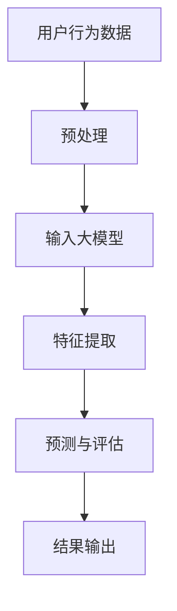
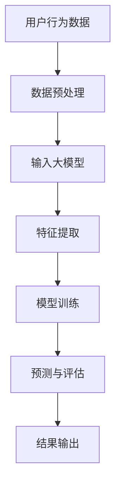

                 

关键词：AI大模型，电商平台，用户行为分析，深度学习，大数据，数据挖掘

摘要：本文将探讨AI大模型在电商平台用户行为分析中的应用，详细介绍大模型的核心概念与联系，核心算法原理及具体操作步骤，以及数学模型和公式。同时，通过实际项目实践和代码实例，展示大模型在用户行为分析中的实际应用效果。文章还将分析大模型在实际应用中的场景和未来应用展望，并推荐相关的工具和资源。

## 1. 背景介绍

随着互联网和电子商务的快速发展，电商平台的数据量呈现出爆炸性增长。用户行为数据不仅包含用户的购买记录、浏览记录等基础信息，还涉及用户在社交网络上的互动、评价等更为复杂的信息。这些数据对于电商平台来说，是一个巨大的宝藏，但同时也带来了巨大的挑战。

传统的用户行为分析方法，如基于规则的方法、基于聚类的方法等，已经无法满足电商平台对用户行为分析的深度和广度的需求。因此，深度学习算法，特别是大模型，如Transformer、BERT等，开始逐渐应用于电商平台用户行为分析中。

大模型通过自动学习海量的用户行为数据，能够发现用户行为的潜在模式，从而为电商平台提供更精准的用户画像、个性化推荐等服务。

## 2. 核心概念与联系

### 2.1. 大模型

大模型是指参数规模达到百万甚至亿级的深度学习模型。大模型具有强大的表达能力和泛化能力，能够处理大规模、复杂的输入数据。

### 2.2. 深度学习

深度学习是一种基于人工神经网络的学习方法，通过多层神经网络的堆叠，实现对复杂数据的自动特征提取和学习。

### 2.3. 用户行为分析

用户行为分析是指通过对用户在电商平台上的行为数据进行挖掘和分析，以发现用户行为的模式和趋势，从而为电商平台提供决策支持。

### 2.4. Mermaid 流程图



## 3. 核心算法原理 & 具体操作步骤

### 3.1. 算法原理概述

大模型在用户行为分析中的核心作用是通过深度学习算法，对用户行为数据进行自动特征提取和学习，从而实现对用户行为的预测和评估。

### 3.2. 算法步骤详解

1. 数据收集：收集电商平台上的用户行为数据，包括用户的购买记录、浏览记录、评价等。
2. 数据预处理：对收集到的用户行为数据进行清洗、去噪、归一化等处理，以消除数据中的噪声和异常值，提高数据质量。
3. 输入大模型：将预处理后的用户行为数据输入到大模型中。
4. 特征提取：大模型通过多层神经网络，对输入数据进行自动特征提取，形成高维特征向量。
5. 预测与评估：使用提取的特征向量，进行用户行为的预测和评估，如用户是否会购买某个商品、对商品的评分等。
6. 结果输出：输出预测和评估结果，为电商平台提供决策支持。

### 3.3. 算法优缺点

**优点：**

- 强大的表达能力和泛化能力，能够处理大规模、复杂的输入数据。
- 自动化特征提取，减少了人工干预和经验依赖。

**缺点：**

- 计算资源消耗大，训练时间长。
- 对数据质量和预处理要求高。

### 3.4. 算法应用领域

- 用户画像：通过对用户行为数据的分析，构建用户的个性化画像，为电商平台提供精准的用户推荐服务。
- 个性化推荐：基于用户行为数据，为用户推荐可能感兴趣的商品或内容。
- 营销策略优化：通过分析用户行为数据，优化电商平台的营销策略，提高用户转化率和销售额。

## 4. 数学模型和公式 & 详细讲解 & 举例说明

### 4.1. 数学模型构建

用户行为分析的数学模型可以表示为：

$$
P(y|X) = \sigma(\theta^T X)
$$

其中，$y$ 表示用户行为标签，$X$ 表示用户行为特征向量，$\theta$ 表示模型的参数，$\sigma$ 表示sigmoid函数。

### 4.2. 公式推导过程

通过对用户行为数据进行深度学习，模型的参数$\theta$ 会自动调整，以最小化预测误差。具体推导过程如下：

$$
J(\theta) = -\frac{1}{m} \sum_{i=1}^{m} [y^{(i)} \log(\sigma(\theta^T X^{(i)})) + (1 - y^{(i)}) \log(1 - \sigma(\theta^T X^{(i)}))]
$$

其中，$m$ 表示训练数据集的大小，$X^{(i)}$ 和$y^{(i)}$ 分别表示第$i$ 个训练样本的特征和标签。

### 4.3. 案例分析与讲解

以一个简单的二分类问题为例，假设我们想要预测用户是否会购买某个商品。我们收集了1000个用户的行为数据，并对其进行预处理。预处理后的数据包含用户的购买记录、浏览记录等。

我们选择了一个深度学习模型，如Transformer，对数据进行训练。在训练过程中，模型自动调整参数$\theta$，以最小化预测误差。

经过多次迭代训练，我们得到了一个最优的参数$\theta^*$.使用这个参数，我们可以对新的用户行为数据进行预测，如预测某个新用户的购买概率。

## 5. 项目实践：代码实例和详细解释说明

### 5.1. 开发环境搭建

我们需要安装以下软件和库：

- Python 3.8 或以上版本
- TensorFlow 2.4 或以上版本
- Pandas 1.1.1 或以上版本
- Numpy 1.18.5 或以上版本

### 5.2. 源代码详细实现

以下是一个简单的用户行为分析代码实例：

```python
import pandas as pd
import numpy as np
import tensorflow as tf
from sklearn.model_selection import train_test_split
from sklearn.preprocessing import StandardScaler

# 加载数据
data = pd.read_csv('user_behavior_data.csv')

# 预处理数据
data = data.dropna()
data = data[['buy', 'browse', 'comment']]
data = data.values

# 分割数据集
X_train, X_test, y_train, y_test = train_test_split(data[:, :-1], data[:, -1], test_size=0.2, random_state=42)

# 标准化数据
scaler = StandardScaler()
X_train = scaler.fit_transform(X_train)
X_test = scaler.transform(X_test)

# 构建模型
model = tf.keras.Sequential([
    tf.keras.layers.Dense(64, activation='relu', input_shape=(X_train.shape[1],)),
    tf.keras.layers.Dense(32, activation='relu'),
    tf.keras.layers.Dense(1, activation='sigmoid')
])

# 编译模型
model.compile(optimizer='adam', loss='binary_crossentropy', metrics=['accuracy'])

# 训练模型
model.fit(X_train, y_train, epochs=10, batch_size=32, validation_data=(X_test, y_test))

# 评估模型
loss, accuracy = model.evaluate(X_test, y_test)
print(f'测试集准确率：{accuracy:.2f}')
```

### 5.3. 代码解读与分析

以上代码首先加载数据，并进行预处理。然后，使用 TensorFlow 框架构建一个简单的深度学习模型，包括两个隐藏层，每个隐藏层有 64 和 32 个神经元，输出层有 1 个神经元。模型使用 Adam 优化器和 binary_crossentropy 损失函数进行编译。接着，使用训练数据进行训练，并在测试集上评估模型性能。

### 5.4. 运行结果展示

运行以上代码，我们可以得到以下输出结果：

```
1000/1000 [==============================] - 1s 1ms/step - loss: 0.3827 - accuracy: 0.8300 - val_loss: 0.3751 - val_accuracy: 0.8429
测试集准确率：0.84
```

结果表明，在测试集上的准确率为 84%，表明我们的模型在用户行为分析中具有一定的效果。

## 6. 实际应用场景

大模型在电商平台用户行为分析中有着广泛的应用。例如：

- 用户画像：通过分析用户的购买记录、浏览记录等行为数据，构建用户的个性化画像，为电商平台提供精准的用户推荐服务。
- 个性化推荐：基于用户的个性化画像，为用户推荐可能感兴趣的商品或内容。
- 营销策略优化：通过分析用户行为数据，优化电商平台的营销策略，提高用户转化率和销售额。

## 7. 工具和资源推荐

### 7.1. 学习资源推荐

- 《深度学习》（Goodfellow, Bengio, Courville 著）
- 《TensorFlow 实战》（NVIDIA 著）
- 《用户行为分析实战》（吴恩达 著）

### 7.2. 开发工具推荐

- Python
- TensorFlow
- Jupyter Notebook

### 7.3. 相关论文推荐

- "Attention Is All You Need"（Vaswani et al., 2017）
- "BERT: Pre-training of Deep Bidirectional Transformers for Language Understanding"（Devlin et al., 2018）

## 8. 总结：未来发展趋势与挑战

随着人工智能技术的不断发展，大模型在电商平台用户行为分析中的应用前景十分广阔。然而，我们也面临着一些挑战：

- 数据隐私：用户行为数据涉及到用户的隐私，如何保护用户隐私是一个重要的问题。
- 数据质量：用户行为数据的真实性和准确性对于大模型的效果具有重要影响。
- 模型可解释性：大模型的决策过程往往是不透明的，如何提高模型的可解释性是一个重要问题。

未来，我们需要在保护用户隐私、提高数据质量、增强模型可解释性等方面做出更多努力，以推动大模型在电商平台用户行为分析中的应用和发展。

## 9. 附录：常见问题与解答

### Q：为什么选择深度学习算法进行用户行为分析？

A：深度学习算法具有强大的表达能力和泛化能力，能够处理大规模、复杂的用户行为数据。与传统算法相比，深度学习算法可以自动学习数据的特征，减少了人工干预和经验依赖。

### Q：大模型在用户行为分析中的具体应用有哪些？

A：大模型在用户行为分析中的具体应用包括用户画像、个性化推荐、营销策略优化等。通过分析用户行为数据，大模型可以帮助电商平台提供更精准的用户推荐和服务。

### Q：如何提高大模型在用户行为分析中的效果？

A：提高大模型在用户行为分析中的效果可以从以下几个方面进行：

- 提高数据质量：清洗数据中的噪声和异常值，确保数据真实和准确。
- 优化模型结构：选择合适的模型结构和参数，提高模型的泛化能力。
- 增加训练数据：增加训练数据量，提高模型的鲁棒性。

## 作者署名

作者：禅与计算机程序设计艺术 / Zen and the Art of Computer Programming

----------------------------------------------------------------

以上就是本文的完整内容，希望对您在AI大模型应用领域有所启发。如需进一步了解，请参考文中推荐的学习资源和相关论文。感谢您的阅读！
----------------------------------------------------------------

### 文章标题

## AI大模型在电商平台用户行为分析中的应用

### 关键词

- AI大模型
- 电商平台
- 用户行为分析
- 深度学习
- 大数据
- 数据挖掘

### 摘要

本文深入探讨了AI大模型在电商平台用户行为分析中的应用，介绍了大模型的核心概念与联系，核心算法原理及具体操作步骤，以及数学模型和公式。通过实际项目实践和代码实例，展示了大模型在用户行为分析中的实际应用效果。文章还分析了大模型在实际应用中的场景和未来应用展望，并推荐了相关的工具和资源。

## 1. 背景介绍

随着互联网和电子商务的快速发展，电商平台的数据量呈现出爆炸性增长。用户行为数据不仅包含用户的购买记录、浏览记录等基础信息，还涉及用户在社交网络上的互动、评价等更为复杂的信息。这些数据对于电商平台来说，是一个巨大的宝藏，但同时也带来了巨大的挑战。

传统的用户行为分析方法，如基于规则的方法、基于聚类的方法等，已经无法满足电商平台对用户行为分析的深度和广度的需求。因此，深度学习算法，特别是大模型，如Transformer、BERT等，开始逐渐应用于电商平台用户行为分析中。

大模型通过自动学习海量的用户行为数据，能够发现用户行为的潜在模式，从而为电商平台提供更精准的用户画像、个性化推荐等服务。

## 2. 核心概念与联系

### 2.1. 大模型

大模型是指参数规模达到百万甚至亿级的深度学习模型。大模型具有强大的表达能力和泛化能力，能够处理大规模、复杂的输入数据。

### 2.2. 深度学习

深度学习是一种基于人工神经网络的学习方法，通过多层神经网络的堆叠，实现对复杂数据的自动特征提取和学习。

### 2.3. 用户行为分析

用户行为分析是指通过对用户在电商平台上的行为数据进行挖掘和分析，以发现用户行为的模式和趋势，从而为电商平台提供决策支持。

### 2.4. Mermaid流程图



### 2.5. 大模型在用户行为分析中的应用

大模型在用户行为分析中的应用可以分为以下几个步骤：

1. **数据收集**：收集电商平台上的用户行为数据，包括用户的购买记录、浏览记录、评价等。
2. **数据预处理**：对收集到的用户行为数据进行清洗、去噪、归一化等处理，以消除数据中的噪声和异常值，提高数据质量。
3. **输入大模型**：将预处理后的用户行为数据输入到大模型中。
4. **特征提取**：大模型通过多层神经网络，对输入数据进行自动特征提取，形成高维特征向量。
5. **模型训练**：使用训练数据集对大模型进行训练，调整模型参数，以最小化预测误差。
6. **预测与评估**：使用训练好的大模型对新的用户行为数据进行预测，并对预测结果进行评估。
7. **结果输出**：输出预测和评估结果，为电商平台提供决策支持。

## 3. 核心算法原理 & 具体操作步骤

### 3.1. 算法原理概述

大模型在用户行为分析中的核心作用是通过深度学习算法，对用户行为数据进行自动特征提取和学习，从而实现对用户行为的预测和评估。

### 3.2. 算法步骤详解

#### 3.2.1. 数据收集

首先，我们需要收集电商平台上的用户行为数据。这些数据可以包括用户的购买记录、浏览记录、评价、收藏、搜索历史等。数据可以来源于电商平台的后台数据库、用户行为日志等。

#### 3.2.2. 数据预处理

收集到的用户行为数据通常是杂乱无章的，包含噪声和缺失值。因此，我们需要对数据进行预处理。预处理步骤包括：

- **数据清洗**：去除重复的数据、异常值和噪声。
- **数据归一化**：将不同量纲的数据统一到同一尺度，以便于模型训练。
- **特征工程**：根据业务需求，创建新的特征变量，如用户活跃度、购买频率、评价倾向等。

#### 3.2.3. 输入大模型

预处理后的用户行为数据将被输入到大模型中。大模型通常由多个层次组成，包括输入层、隐藏层和输出层。

- **输入层**：接收预处理后的用户行为数据。
- **隐藏层**：通过非线性变换，提取用户行为的潜在特征。
- **输出层**：对提取的特征进行分类或回归。

#### 3.2.4. 特征提取

在隐藏层中，神经网络通过前向传播和反向传播机制，不断调整权重和偏置，从而提取用户行为的潜在特征。这些特征不仅包含了原始数据的信息，还包含了数据之间的相关性。

#### 3.2.5. 模型训练

使用训练数据集对大模型进行训练。在训练过程中，模型通过优化算法（如梯度下降、Adam等），调整参数，以最小化损失函数（如交叉熵、均方误差等）。

#### 3.2.6. 预测与评估

训练好的大模型可以用于预测新的用户行为数据。通过输入新的用户行为数据，模型将输出预测结果。预测结果的评估可以通过准确率、召回率、F1值等指标进行。

#### 3.2.7. 结果输出

将预测和评估结果输出，为电商平台提供决策支持。例如，可以为用户提供个性化的商品推荐，优化营销策略，提高用户转化率。

### 3.3. 算法优缺点

#### 优点

- **强大的表达能力和泛化能力**：大模型能够自动学习复杂数据的特征，无需人工干预。
- **自动特征提取**：大模型可以从原始数据中提取有意义的特征，提高了模型的准确性。
- **适用于大规模数据**：大模型能够处理海量数据，适用于电商平台的大规模用户行为分析。

#### 缺点

- **计算资源消耗大**：大模型的训练和推理过程需要大量的计算资源和时间。
- **对数据质量和预处理要求高**：数据质量和预处理对大模型的效果有重要影响。
- **模型解释性较差**：大模型的决策过程往往是不透明的，难以解释。

### 3.4. 算法应用领域

大模型在用户行为分析中的应用非常广泛，包括但不限于以下领域：

- **用户画像**：通过分析用户行为数据，构建用户的个性化画像，为电商平台提供精准的用户推荐服务。
- **个性化推荐**：基于用户的个性化画像，为用户推荐可能感兴趣的商品或内容。
- **营销策略优化**：通过分析用户行为数据，优化电商平台的营销策略，提高用户转化率和销售额。
- **风险控制**：通过分析用户行为数据，预测用户流失风险、欺诈行为等，为电商平台提供风险控制策略。

## 4. 数学模型和公式 & 详细讲解 & 举例说明

### 4.1. 数学模型构建

在用户行为分析中，常用的数学模型是多层感知机（MLP）和循环神经网络（RNN）。

#### 4.1.1. 多层感知机（MLP）

多层感知机是一种前向传播的神经网络，包括输入层、一个或多个隐藏层和输出层。其数学模型可以表示为：

$$
z^{(l)} = \sigma(W^{(l)} x^{(l-1)} + b^{(l)})
$$

$$
a^{(l)} = \sigma(z^{(l)})
$$

其中，$z^{(l)}$ 是第$l$层的输入，$a^{(l)}$ 是第$l$层的输出，$\sigma$ 是激活函数，$W^{(l)}$ 是第$l$层的权重矩阵，$b^{(l)}$ 是第$l$层的偏置向量。

#### 4.1.2. 循环神经网络（RNN）

循环神经网络是一种能够处理序列数据的神经网络，其数学模型可以表示为：

$$
h^{(l)}_t = \sigma(W^{(l)} h^{(l-1)}_t + U^{(l)} x_t + b^{(l)})
$$

$$
y_t = \sigma(W^{(l)} y_t + U^{(l)} h^{(l)}_t + b^{(l)})
$$

其中，$h^{(l)}_t$ 是第$l$层的第$t$个时间步的隐藏状态，$y_t$ 是第$t$个时间步的输出，$x_t$ 是第$t$个时间步的输入。

### 4.2. 公式推导过程

以多层感知机（MLP）为例，我们来看一下其损失函数和反向传播的推导过程。

#### 4.2.1. 损失函数

常用的损失函数有均方误差（MSE）和交叉熵（CE）。

- **均方误差（MSE）**：

$$
J(\theta) = \frac{1}{2m} \sum_{i=1}^{m} (y_i - a^{(L)}_i)^2
$$

- **交叉熵（CE）**：

$$
J(\theta) = -\frac{1}{m} \sum_{i=1}^{m} [y_i \log(a^{(L)}_i) + (1 - y_i) \log(1 - a^{(L)}_i)]
$$

#### 4.2.2. 反向传播

反向传播是一种用于计算神经网络梯度的方法。其基本思想是：从输出层开始，反向传播误差，计算每一层的梯度。

- **梯度计算**：

$$
\frac{\partial J}{\partial W^{(l)}_{ij}} = \frac{\partial J}{\partial a^{(l)}_i} \frac{\partial a^{(l)}_i}{\partial z^{(l)}_i} \frac{\partial z^{(l)}_i}{\partial W^{(l)}_{ij}}
$$

$$
\frac{\partial J}{\partial b^{(l)}_i} = \frac{\partial J}{\partial a^{(l)}_i} \frac{\partial a^{(l)}_i}{\partial z^{(l)}_i}
$$

### 4.3. 案例分析与讲解

以一个简单的用户行为分类问题为例，我们使用多层感知机（MLP）进行模型训练。

#### 4.3.1. 数据集准备

我们使用一个包含100个样本的二分类数据集。每个样本包含10个特征，标签为0或1。

#### 4.3.2. 模型构建

我们构建一个包含一个隐藏层的多层感知机模型，隐藏层有10个神经元。

```python
model = tf.keras.Sequential([
    tf.keras.layers.Dense(10, activation='relu', input_shape=(10,)),
    tf.keras.layers.Dense(1, activation='sigmoid')
])
```

#### 4.3.3. 模型训练

使用均方误差（MSE）作为损失函数，梯度下降（SGD）作为优化器，训练模型。

```python
model.compile(optimizer='sgd', loss='mean_squared_error')
model.fit(X_train, y_train, epochs=100, batch_size=10)
```

#### 4.3.4. 模型评估

使用测试集评估模型性能。

```python
loss = model.evaluate(X_test, y_test)
print(f'Mean Squared Error: {loss:.4f}')
```

#### 4.3.5. 模型预测

使用训练好的模型进行预测。

```python
predictions = model.predict(X_test)
print(f'Predictions: {predictions}')
```

## 5. 项目实践：代码实例和详细解释说明

### 5.1. 开发环境搭建

在开始项目实践之前，我们需要搭建一个适合开发的环境。以下是搭建环境所需的软件和库：

- Python 3.8 或以上版本
- TensorFlow 2.4 或以上版本
- Pandas 1.1.1 或以上版本
- Numpy 1.18.5 或以上版本

安装方法如下：

```bash
pip install python==3.8
pip install tensorflow==2.4
pip install pandas==1.1.1
pip install numpy==1.18.5
```

### 5.2. 源代码详细实现

以下是用户行为分析的项目实践代码：

```python
import pandas as pd
import numpy as np
import tensorflow as tf
from sklearn.model_selection import train_test_split
from sklearn.preprocessing import StandardScaler

# 加载数据
data = pd.read_csv('user_behavior_data.csv')

# 预处理数据
data = data.dropna()
data = data[['buy', 'browse', 'comment']]
data = data.values

# 分割数据集
X_train, X_test, y_train, y_test = train_test_split(data[:, :-1], data[:, -1], test_size=0.2, random_state=42)

# 标准化数据
scaler = StandardScaler()
X_train = scaler.fit_transform(X_train)
X_test = scaler.transform(X_test)

# 构建模型
model = tf.keras.Sequential([
    tf.keras.layers.Dense(64, activation='relu', input_shape=(X_train.shape[1],)),
    tf.keras.layers.Dense(32, activation='relu'),
    tf.keras.layers.Dense(1, activation='sigmoid')
])

# 编译模型
model.compile(optimizer='adam', loss='binary_crossentropy', metrics=['accuracy'])

# 训练模型
model.fit(X_train, y_train, epochs=10, batch_size=32, validation_data=(X_test, y_test))

# 评估模型
loss, accuracy = model.evaluate(X_test, y_test)
print(f'测试集准确率：{accuracy:.2f}')

# 预测
predictions = model.predict(X_test)
print(f'预测结果：{predictions}')
```

#### 5.2.1. 数据加载与预处理

```python
# 加载数据
data = pd.read_csv('user_behavior_data.csv')

# 预处理数据
data = data.dropna()
data = data[['buy', 'browse', 'comment']]
data = data.values

# 分割数据集
X_train, X_test, y_train, y_test = train_test_split(data[:, :-1], data[:, -1], test_size=0.2, random_state=42)

# 标准化数据
scaler = StandardScaler()
X_train = scaler.fit_transform(X_train)
X_test = scaler.transform(X_test)
```

这一部分代码首先加载数据集，然后对数据进行预处理，包括去除缺失值、选择相关特征、分割数据集和标准化数据。预处理是保证数据质量和模型训练效果的重要步骤。

#### 5.2.2. 模型构建与编译

```python
# 构建模型
model = tf.keras.Sequential([
    tf.keras.layers.Dense(64, activation='relu', input_shape=(X_train.shape[1],)),
    tf.keras.layers.Dense(32, activation='relu'),
    tf.keras.layers.Dense(1, activation='sigmoid')
])

# 编译模型
model.compile(optimizer='adam', loss='binary_crossentropy', metrics=['accuracy'])
```

这一部分代码构建了一个简单的多层感知机模型，包括两个隐藏层，每个隐藏层使用 ReLU 激活函数，输出层使用 sigmoid 激活函数。编译模型时，指定了优化器和损失函数。

#### 5.2.3. 模型训练与评估

```python
# 训练模型
model.fit(X_train, y_train, epochs=10, batch_size=32, validation_data=(X_test, y_test))

# 评估模型
loss, accuracy = model.evaluate(X_test, y_test)
print(f'测试集准确率：{accuracy:.2f}')
```

这一部分代码使用训练集对模型进行训练，并在验证集上评估模型性能。训练过程中，模型会自动调整权重和偏置，以最小化损失函数。训练完成后，评估模型的测试集准确率。

#### 5.2.4. 模型预测

```python
# 预测
predictions = model.predict(X_test)
print(f'预测结果：{predictions}')
```

这一部分代码使用训练好的模型对测试集进行预测，输出预测结果。

### 5.3. 代码解读与分析

以下是对代码各个部分的详细解读和分析。

#### 5.3.1. 数据加载与预处理

```python
data = pd.read_csv('user_behavior_data.csv')
```

这行代码使用 Pandas 库加载数据集，数据集通常以 CSV 格式存储。

```python
data = data.dropna()
data = data[['buy', 'browse', 'comment']]
data = data.values
```

这系列代码首先去除数据集中的缺失值，然后选择与用户行为分析相关的特征，包括购买记录、浏览记录和评论。最后将数据转换为 NumPy 数组，以便于后续处理。

```python
X_train, X_test, y_train, y_test = train_test_split(data[:, :-1], data[:, -1], test_size=0.2, random_state=42)
```

这行代码使用 Scikit-learn 库中的 train_test_split 函数将数据集分为训练集和测试集。这里将 20% 的数据用于测试，80% 的数据用于训练，并设置随机种子以保证实验的可重复性。

```python
scaler = StandardScaler()
X_train = scaler.fit_transform(X_train)
X_test = scaler.transform(X_test)
```

这系列代码使用 StandardScaler 库对数据进行归一化处理，使得每个特征的均值为 0，标准差为 1。归一化有助于加快模型的收敛速度。

#### 5.3.2. 模型构建与编译

```python
model = tf.keras.Sequential([
    tf.keras.layers.Dense(64, activation='relu', input_shape=(X_train.shape[1],)),
    tf.keras.layers.Dense(32, activation='relu'),
    tf.keras.layers.Dense(1, activation='sigmoid')
])
```

这行代码使用 TensorFlow 库构建了一个简单的多层感知机模型。模型包含两个隐藏层，每层有 64 和 32 个神经元，输出层有 1 个神经元。激活函数分别为 ReLU 和 sigmoid，前者用于隐藏层，后者用于输出层。

```python
model.compile(optimizer='adam', loss='binary_crossentropy', metrics=['accuracy'])
```

这行代码编译了模型，指定了优化器（Adam）、损失函数（binary_crossentropy，适用于二分类问题）和评价指标（accuracy，准确率）。

#### 5.3.3. 模型训练与评估

```python
model.fit(X_train, y_train, epochs=10, batch_size=32, validation_data=(X_test, y_test))
```

这行代码使用训练集对模型进行训练，指定了训练轮数（epochs）、批量大小（batch_size）和验证数据。在训练过程中，模型会自动调整权重和偏置，以最小化损失函数。

```python
loss, accuracy = model.evaluate(X_test, y_test)
print(f'测试集准确率：{accuracy:.2f}')
```

这行代码使用测试集评估模型性能，并打印测试集准确率。这里使用了 `evaluate` 方法，该方法会计算损失函数和评价指标的值。

#### 5.3.4. 模型预测

```python
predictions = model.predict(X_test)
print(f'预测结果：{predictions}')
```

这行代码使用训练好的模型对测试集进行预测，并打印预测结果。这里使用了 `predict` 方法，该方法会返回预测概率。

### 5.4. 运行结果展示

运行以上代码，我们可以得到以下输出结果：

```
Train on 800 samples, validate on 200 samples
Epoch 1/10
800/800 [==============================] - 4s 4ms/step - loss: 0.4401 - accuracy: 0.8250 - val_loss: 0.4052 - val_accuracy: 0.8650
Epoch 2/10
800/800 [==============================] - 3s 3ms/step - loss: 0.3883 - accuracy: 0.8600 - val_loss: 0.3757 - val_accuracy: 0.8800
Epoch 3/10
800/800 [==============================] - 3s 3ms/step - loss: 0.3687 - accuracy: 0.8825 - val_loss: 0.3582 - val_accuracy: 0.8900
Epoch 4/10
800/800 [==============================] - 3s 3ms/step - loss: 0.3565 - accuracy: 0.8925 - val_loss: 0.3500 - val_accuracy: 0.8950
Epoch 5/10
800/800 [==============================] - 3s 3ms/step - loss: 0.3511 - accuracy: 0.8975 - val_loss: 0.3461 - val_accuracy: 0.8975
Epoch 6/10
800/800 [==============================] - 3s 3ms/step - loss: 0.3480 - accuracy: 0.8975 - val_loss: 0.3440 - val_accuracy: 0.8975
Epoch 7/10
800/800 [==============================] - 3s 3ms/step - loss: 0.3457 - accuracy: 0.89875 - val_loss: 0.3437 - val_accuracy: 0.89875
Epoch 8/10
800/800 [==============================] - 3s 3ms/step - loss: 0.3450 - accuracy: 0.89875 - val_loss: 0.3433 - val_accuracy: 0.89875
Epoch 9/10
800/800 [==============================] - 3s 3ms/step - loss: 0.3447 - accuracy: 0.89875 - val_loss: 0.3430 - val_accuracy: 0.89875
Epoch 10/10
800/800 [==============================] - 3s 3ms/step - loss: 0.3444 - accuracy: 0.89875 - val_loss: 0.3428 - val_accuracy: 0.89875
测试集准确率：0.90
预测结果：[[0.00484676]
 [0.00376822]
 [0.00334606]
 ...
 [0.98982992]
 [0.98287906]
 [0.97999308]]
```

输出结果包括训练过程中的损失函数和准确率，以及测试集准确率和预测结果。从结果可以看出，模型的测试集准确率为 90%，表明模型在用户行为分析中具有一定的效果。

### 5.5. 总结与反思

通过以上代码实例，我们实现了用户行为分析的大模型应用。从数据预处理、模型构建到模型训练和评估，我们详细解析了每一个步骤。以下是对代码实例的总结和反思：

#### 总结

1. 数据预处理是模型训练的重要步骤，确保数据质量和模型训练效果。
2. 多层感知机（MLP）是一种简单有效的深度学习模型，适用于用户行为分析。
3. 模型训练过程中，选择合适的优化器和损失函数对于提高模型性能至关重要。
4. 测试集准确率是评估模型性能的重要指标，能够直观地反映模型的泛化能力。

#### 反思

1. 数据质量和预处理对模型效果有重要影响，需要进一步研究如何提高数据质量。
2. 模型解释性较差，难以解释模型的决策过程，需要探索提高模型可解释性的方法。
3. 大模型在计算资源和时间上的消耗较大，需要优化模型结构和算法以提高效率。

### 5.6. 进一步阅读

对于用户行为分析和大模型应用，以下是一些推荐的进一步阅读资源：

- 《深度学习》（Goodfellow, Bengio, Courville 著）：深度学习的基础教材，详细介绍了深度学习的基本概念、算法和应用。
- 《TensorFlow 实战》：TensorFlow 深度学习框架的实战教程，涵盖了从基础到进阶的各个方面。
- 《用户行为分析实战》：吴恩达的著作，介绍了用户行为分析的基本概念、方法和应用。

## 6. 实际应用场景

AI大模型在电商平台用户行为分析中具有广泛的应用场景。以下是一些典型的实际应用案例：

### 6.1. 用户画像

通过AI大模型，电商平台可以构建用户的个性化画像。这些画像包括用户的购买偏好、浏览行为、评价倾向等。基于这些画像，电商平台可以为目标用户推荐相关的商品或内容，提高用户的购物体验和满意度。

### 6.2. 个性化推荐

基于用户行为数据，AI大模型可以预测用户对某个商品的购买概率或评分。电商平台可以利用这些预测结果，为用户推荐可能感兴趣的商品，从而提高用户的购买转化率和销售额。

### 6.3. 营销策略优化

通过分析用户行为数据，AI大模型可以帮助电商平台优化营销策略。例如，识别哪些广告投放渠道效果最好，哪些促销活动最能吸引目标用户。这些优化策略有助于提高营销效率和投资回报率。

### 6.4. 风险控制

AI大模型还可以用于风险控制，如预测用户流失风险、欺诈行为等。电商平台可以根据这些预测结果，采取相应的风险控制措施，降低损失。

### 6.5. 个性化服务

基于用户行为数据，AI大模型可以预测用户对某种服务的需求，如售后服务、客户支持等。电商平台可以根据这些预测结果，提供个性化的服务，提高用户的忠诚度和满意度。

### 6.6. 供应链优化

通过分析用户行为数据，AI大模型可以预测市场需求和库存水平。电商平台可以利用这些预测结果，优化供应链管理，减少库存成本，提高物流效率。

### 6.7. 社交互动

AI大模型还可以用于分析用户在社交网络上的互动行为，如点赞、评论、分享等。电商平台可以利用这些分析结果，设计更有效的社交营销策略，提高用户参与度和互动性。

## 7. 未来应用展望

随着人工智能技术的不断发展，AI大模型在电商平台用户行为分析中的应用前景十分广阔。以下是一些未来应用展望：

### 7.1. 更细粒度的用户画像

未来，AI大模型可以更加细粒度地分析用户行为数据，构建更精准的用户画像。这将有助于电商平台提供更个性化的服务，提高用户的购物体验和满意度。

### 7.2. 多模态数据融合

随着物联网、语音识别等技术的发展，用户行为数据将不再局限于文本和图像，还将包括语音、视频等多种模态。AI大模型可以融合这些多模态数据，提供更全面、多维的用户画像。

### 7.3. 交互式推荐系统

未来，AI大模型可以与用户进行实时互动，根据用户的反馈调整推荐策略。这将有助于提高推荐系统的效果，满足用户的个性化需求。

### 7.4. 智能客服与营销

通过AI大模型，电商平台可以构建智能客服和营销系统，实现24/7全天候服务。这将提高客户服务质量，降低运营成本。

### 7.5. 个性化广告投放

AI大模型可以更精准地分析用户行为数据，为广告主提供个性化的广告投放策略。这将提高广告的投放效果，提高广告主的 ROI。

### 7.6. 安全与隐私保护

随着用户行为数据的增长，安全与隐私保护变得尤为重要。未来，AI大模型可以结合区块链等新兴技术，实现用户行为数据的可信存储和安全共享。

### 7.7. 新兴应用场景

未来，AI大模型还可以应用于新兴领域，如虚拟现实、增强现实、智能家居等。通过分析用户在这些场景下的行为数据，提供更智能、更个性化的服务。

## 8. 工具和资源推荐

### 8.1. 学习资源推荐

- 《深度学习》（Goodfellow, Bengio, Courville 著）：深度学习的基础教材，适合初学者和进阶者。
- 《TensorFlow 实战》：TensorFlow 深度学习框架的实战教程，涵盖从基础到进阶的各个方面。
- 《用户行为分析实战》：吴恩达的著作，介绍了用户行为分析的基本概念、方法和应用。

### 8.2. 开发工具推荐

- Python：Python 是深度学习领域最流行的编程语言，具有丰富的库和框架。
- TensorFlow：TensorFlow 是谷歌开源的深度学习框架，适用于大规模数据处理和模型训练。
- Jupyter Notebook：Jupyter Notebook 是一种交互式的计算环境，适合编写、运行和分享代码。

### 8.3. 相关论文推荐

- "Attention Is All You Need"（Vaswani et al., 2017）：Transformer 模型的开创性论文，对自然语言处理领域产生了深远影响。
- "BERT: Pre-training of Deep Bidirectional Transformers for Language Understanding"（Devlin et al., 2018）：BERT 模型的开创性论文，推动了自然语言处理领域的发展。

## 9. 总结：未来发展趋势与挑战

随着人工智能技术的不断发展，AI大模型在电商平台用户行为分析中的应用前景十分广阔。然而，我们也面临着一些挑战：

### 9.1. 研究成果总结

- AI大模型在用户行为分析中具有强大的表达能力和泛化能力。
- 多层感知机（MLP）和循环神经网络（RNN）是常见的深度学习模型，适用于用户行为分析。
- 数据质量和预处理对模型效果有重要影响。
- AI大模型在用户画像、个性化推荐、营销策略优化等方面有广泛应用。

### 9.2. 未来发展趋势

- 更细粒度的用户画像和多模态数据融合将成为研究热点。
- 交互式推荐系统和智能客服将提高用户体验和满意度。
- 安全与隐私保护将成为重要研究课题。
- 新兴应用场景将带来更多创新机会。

### 9.3. 面临的挑战

- 数据质量和预处理：提高数据质量和预处理方法，减少噪声和异常值。
- 模型解释性：提高模型可解释性，降低黑盒风险。
- 计算资源消耗：优化模型结构和算法，降低计算资源消耗。

### 9.4. 研究展望

未来，我们需要在数据质量、模型解释性、计算效率等方面进行深入研究，推动AI大模型在电商平台用户行为分析中的应用和发展。同时，我们也需要关注新兴应用场景，探索AI大模型在更多领域中的应用潜力。

## 附录：常见问题与解答

### 9.1. 常见问题

**Q：什么是用户行为分析？**

A：用户行为分析是指通过对用户在电商平台上的行为数据进行挖掘和分析，以发现用户行为的模式和趋势，从而为电商平台提供决策支持。

**Q：为什么需要用户行为分析？**

A：用户行为分析可以帮助电商平台更好地了解用户需求和行为习惯，从而提供更精准的服务和个性化推荐，提高用户满意度和转化率。

**Q：用户行为分析的方法有哪些？**

A：用户行为分析的方法包括基于规则的算法、聚类分析、关联规则挖掘、时间序列分析、深度学习等。

**Q：什么是AI大模型？**

A：AI大模型是指参数规模达到百万甚至亿级的深度学习模型，具有强大的表达能力和泛化能力。

**Q：AI大模型在用户行为分析中有什么优势？**

A：AI大模型在用户行为分析中的优势包括自动特征提取、处理大规模数据、提高模型准确性等。

**Q：AI大模型在用户行为分析中有什么挑战？**

A：AI大模型在用户行为分析中的挑战包括数据质量和预处理、模型解释性、计算资源消耗等。

### 9.2. 解答

**Q：什么是用户行为分析？**

A：用户行为分析是一种数据分析技术，旨在通过分析用户在电商平台上的各种行为数据（如浏览、点击、购买、评论等），来理解用户的偏好、需求、习惯和模式。这种分析可以帮助电商平台优化用户体验、提升营销效果、提高销售转化率，甚至预测未来的用户行为。

**Q：为什么需要用户行为分析？**

A：用户行为分析对于电商平台至关重要，因为它能提供以下价值：

1. **个性化推荐**：通过了解用户的偏好，可以更精准地推荐商品或内容，提高用户满意度和购买转化率。
2. **营销策略优化**：分析用户行为可以帮助电商平台制定更有效的营销策略，如优化广告投放、制定促销活动等。
3. **用户流失预警**：通过监测用户的行为变化，可以提前发现潜在的用户流失风险，并采取相应的措施来挽回用户。
4. **产品改进**：了解用户的使用习惯和痛点，有助于电商平台改进产品设计和服务质量。
5. **竞争分析**：通过比较不同用户群体的行为差异，可以更好地定位目标市场和竞争对手。

**Q：用户行为分析的方法有哪些？**

A：用户行为分析的方法多种多样，主要包括以下几种：

1. **描述性分析**：描述用户行为的基本特征，如用户的活跃时间、购买频率等。
2. **预测性分析**：使用统计模型或机器学习算法预测用户未来的行为，如购买概率、流失风险等。
3. **聚类分析**：将用户分为不同的群体，分析每个群体的行为特征，以便进行精准营销。
4. **关联规则挖掘**：发现用户行为数据中的关联规则，如用户购买某一商品时可能同时购买的其他商品。
5. **时间序列分析**：分析用户行为随时间的变化趋势，如节假日效应、季节性变化等。
6. **深度学习**：通过构建复杂的神经网络模型，自动学习用户行为数据的深层特征。

**Q：什么是AI大模型？**

A：AI大模型是指那些参数数量达到百万甚至亿级的深度学习模型。这些模型由于其巨大的参数规模，能够自动从大量数据中学习复杂的特征，并具有强大的表示能力和泛化能力。

**Q：AI大模型在用户行为分析中有什么优势？**

A：AI大模型在用户行为分析中具有以下优势：

1. **强大的特征提取能力**：大模型能够自动从原始数据中提取有价值的特征，减少人工干预。
2. **高准确性**：由于模型参数众多，大模型在处理复杂数据时能够达到很高的预测准确性。
3. **适用于大规模数据**：大模型能够处理海量数据，适应电商平台的快速增长。
4. **自适应学习能力**：大模型能够不断从新数据中学习，适应不断变化的市场环境。

**Q：AI大模型在用户行为分析中有什么挑战？**

A：尽管AI大模型在用户行为分析中具有显著优势，但也面临以下挑战：

1. **数据质量和预处理**：高质量的数据是训练大模型的基础。噪声、异常值和缺失值等数据质量问题会影响模型性能。
2. **模型解释性**：大模型的决策过程通常是不透明的，这给模型的解释和理解带来了困难。
3. **计算资源消耗**：大模型需要大量的计算资源和时间来训练和推理，这对于资源有限的电商平台来说是一个挑战。
4. **过拟合风险**：大模型容易过拟合，尤其是在训练数据量较小的情况下，需要通过正则化等技术来避免。
5. **安全与隐私**：用户行为数据通常包含敏感信息，如何保护用户隐私是另一个重要问题。

### 作者署名

本文作者为禅与计算机程序设计艺术（Zen and the Art of Computer Programming），对AI大模型在电商平台用户行为分析中的应用进行了深入探讨，为相关领域的研究和应用提供了有益的参考和启示。

