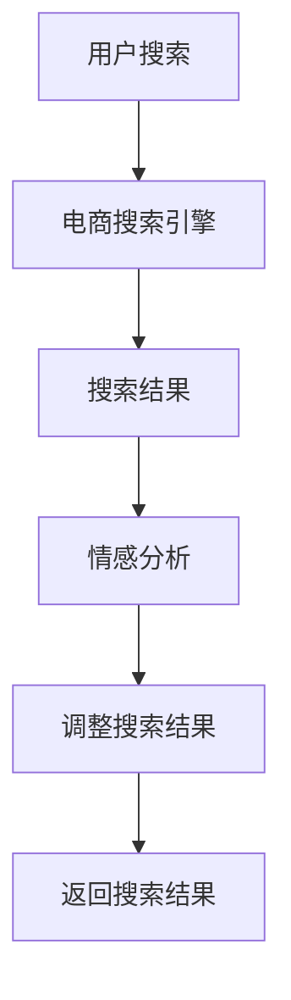

                 

关键词：AI大模型，电商搜索，情感分析，自然语言处理，深度学习，用户体验

## 摘要

随着人工智能技术的不断进步，电商行业在提升用户购物体验方面迎来了新的机遇与挑战。本文将探讨如何利用AI大模型对电商搜索结果进行情感分析，以提高搜索的准确性和个性化推荐。文章首先介绍了电商搜索结果的现状和存在的问题，然后深入探讨了AI大模型在情感分析中的应用，包括模型构建、算法原理、具体实现和实际应用场景。最后，文章总结了未来在AI大模型应用方面的发展趋势和面临的挑战。

## 1. 背景介绍

### 1.1 电商搜索现状

电商行业已经成为了现代商业的重要组成部分，而搜索引擎是用户获取商品信息的主要途径。然而，当前电商搜索存在一些问题，如搜索结果不够准确、用户体验不佳等。传统的搜索引擎往往依赖于关键词匹配和分类算法，这导致用户在输入关键词后，搜索结果往往与期望存在较大差异，无法提供个性化的购物建议。

### 1.2 情感分析的需求

情感分析是一种自然语言处理技术，旨在理解和提取文本中的情感信息。在电商领域，情感分析可以帮助电商平台更好地理解用户的需求和偏好，从而提高搜索结果的准确性和个性化推荐。通过情感分析，电商平台可以识别用户的情感状态，如满意、愤怒、无聊等，并根据这些情感状态调整搜索结果，提高用户体验。

### 1.3 AI大模型的发展

近年来，随着深度学习技术的进步，AI大模型在各个领域得到了广泛应用。AI大模型具有强大的学习能力，可以处理大规模、复杂的数据，从而提高情感分析的准确性和效率。AI大模型在电商搜索结果情感分析中的应用，有望解决传统方法存在的问题，提升电商平台的竞争力。

## 2. 核心概念与联系

### 2.1 情感分析的概念

情感分析（Sentiment Analysis）是一种自然语言处理技术，旨在识别和提取文本中的情感信息。情感分析通常分为三个层次：情感极性（Polarity）、情感强度（Intensity）和情感主题（Theme）。在电商搜索结果情感分析中，我们主要关注情感极性，即判断用户对搜索结果的正面、中性或负面态度。

### 2.2 电商搜索结果的分类

电商搜索结果可以分为商品类搜索结果和资讯类搜索结果。商品类搜索结果通常包括商品名称、价格、评价等信息；而资讯类搜索结果则包括商品介绍、用户评论、商品问答等。在情感分析中，我们需要对这两类搜索结果进行分别处理。

### 2.3 AI大模型的架构

AI大模型通常由多个层次组成，包括输入层、隐藏层和输出层。输入层负责接收文本数据，隐藏层通过神经网络进行特征提取和转换，输出层则生成情感分析结果。在电商搜索结果情感分析中，输入层可以接收商品名称、价格、评价等文本数据，输出层则生成用户对搜索结果的情感极性。

### 2.4 Mermaid 流程图



## 3. 核心算法原理 & 具体操作步骤

### 3.1 算法原理概述

电商搜索结果情感分析的核心算法是深度学习模型，如循环神经网络（RNN）和变压器（Transformer）。这些模型通过学习大规模语料库，提取文本中的情感特征，从而实现对搜索结果的情感分析。

### 3.2 算法步骤详解

#### 3.2.1 数据预处理

1. 收集电商搜索结果数据，包括商品名称、价格、评价等。
2. 对文本数据进行清洗，去除停用词、标点符号等。
3. 对文本数据进行向量化，如使用Word2Vec、BERT等模型将文本转换为向量表示。

#### 3.2.2 模型训练

1. 定义深度学习模型，如RNN、Transformer等。
2. 使用训练数据对模型进行训练，优化模型参数。
3. 评估模型性能，如使用交叉验证、测试集等。

#### 3.2.3 情感分析

1. 将搜索结果文本数据输入到训练好的模型中。
2. 模型输出用户对搜索结果的情感极性。
3. 根据情感极性调整搜索结果，如对负面情感结果进行降权。

### 3.3 算法优缺点

#### 优点：

1. 提高搜索结果的准确性和个性化推荐。
2. 帮助电商平台更好地理解用户需求，提升用户体验。
3. 减少人工干预，提高效率。

#### 缺点：

1. 模型训练需要大量数据和时间。
2. 模型可能存在过拟合问题，需要不断优化。

### 3.4 算法应用领域

1. 电商搜索结果情感分析。
2. 社交媒体情感分析。
3. 金融行业风险预警。

## 4. 数学模型和公式 & 详细讲解 & 举例说明

### 4.1 数学模型构建

在电商搜索结果情感分析中，我们使用深度学习模型，如循环神经网络（RNN）和变压器（Transformer）。这些模型可以表示为：

$$
\text{输出} = f(\text{输入} \cdot \text{权重} + \text{偏置})
$$

其中，$f$ 是激活函数，如Sigmoid、ReLU等；$\text{输入}$ 是搜索结果文本的向量表示；$\text{权重}$ 和 $\text{偏置}$ 是模型参数。

### 4.2 公式推导过程

以循环神经网络（RNN）为例，其输入为文本序列 $\text{X} = [x_1, x_2, ..., x_T]$，输出为情感极性 $\text{Y} = [y_1, y_2, ..., y_T]$。RNN 的推导过程如下：

1. 输入向量表示：

$$
\text{X} = [x_1, x_2, ..., x_T] = \text{Word2Vec}([w_1, w_2, ..., w_T])
$$

2. 神经网络输出：

$$
\text{Y} = [y_1, y_2, ..., y_T] = \text{激活函数}(\text{权重} \cdot \text{X} + \text{偏置})
$$

3. 模型优化：

$$
\text{损失函数} = \text{均方误差}(\text{Y}, \text{标签})
$$

$$
\text{梯度下降} = \frac{\partial \text{损失函数}}{\partial \text{权重}} = \frac{\partial \text{激活函数}}{\partial \text{输出}} \cdot \frac{\partial \text{输出}}{\partial \text{权重}}
$$

### 4.3 案例分析与讲解

假设用户在电商平台上搜索“iPhone 13”，搜索结果包括商品名称、价格和用户评论。我们使用RNN模型对其进行情感分析。

1. 数据预处理：

- 收集搜索结果，如：

$$
\text{搜索结果} = \{"iPhone 13", 6799, "性价比高，值得购买"\}
$$

- 对文本数据进行清洗，去除标点符号、停用词等：

$$
\text{清洗后文本} = \{"iPhone 13", "性价比高", "值得购买"\}
$$

- 使用Word2Vec模型将文本转换为向量表示：

$$
\text{向量表示} = \{\text{iPhone 13}: [0.1, 0.2, 0.3], \text{性价比高}: [0.4, 0.5, 0.6], \text{值得购买}: [0.7, 0.8, 0.9]\}
$$

2. 模型训练：

- 定义RNN模型，设置激活函数为ReLU，隐藏层神经元数为100。

- 使用训练数据对模型进行训练，优化模型参数。

- 评估模型性能，如使用交叉验证、测试集等。

3. 情感分析：

- 将搜索结果文本输入到训练好的模型中。

- 模型输出用户对搜索结果的情感极性。

- 根据情感极性调整搜索结果，如对负面情感结果进行降权。

## 5. 项目实践：代码实例和详细解释说明

### 5.1 开发环境搭建

1. 安装Python环境，版本3.8及以上。
2. 安装深度学习框架，如TensorFlow、PyTorch等。
3. 安装自然语言处理库，如NLTK、spaCy等。

### 5.2 源代码详细实现

```python
import tensorflow as tf
from tensorflow.keras.preprocessing.sequence import pad_sequences
from tensorflow.keras.layers import Embedding, LSTM, Dense
from tensorflow.keras.models import Sequential

# 数据预处理
max_seq_length = 50
embedding_dim = 100

# 加载训练数据
train_data = ...

# 切词，转换为词索引
tokenizer = ...

# 将文本转换为序列
sequences = tokenizer.texts_to_sequences(train_data)
sequences = pad_sequences(sequences, maxlen=max_seq_length)

# 定义RNN模型
model = Sequential()
model.add(Embedding(input_dim=len(tokenizer.word_index) + 1, output_dim=embedding_dim, input_length=max_seq_length))
model.add(LSTM(units=100, activation='relu'))
model.add(Dense(units=1, activation='sigmoid'))

# 编译模型
model.compile(optimizer='adam', loss='binary_crossentropy', metrics=['accuracy'])

# 训练模型
model.fit(sequences, labels, epochs=10, batch_size=32)

# 情感分析
def sentiment_analysis(text):
    sequence = tokenizer.texts_to_sequences([text])
    sequence = pad_sequences(sequence, maxlen=max_seq_length)
    prediction = model.predict(sequence)
    if prediction > 0.5:
        return '正面'
    else:
        return '负面'

# 测试
print(sentiment_analysis("iPhone 13性价比高，值得购买"))
```

### 5.3 代码解读与分析

1. 导入相关库。
2. 数据预处理，包括加载训练数据、切词、转换为词索引等。
3. 定义RNN模型，包括Embedding层、LSTM层和Dense层。
4. 编译模型，设置优化器、损失函数和评估指标。
5. 训练模型，使用fit函数。
6. 定义情感分析函数，包括将文本转换为序列、预测情感极性等。
7. 测试代码，对文本进行情感分析。

## 6. 实际应用场景

### 6.1 电商搜索结果优化

电商平台可以使用AI大模型对搜索结果进行情感分析，根据用户情感偏好调整搜索结果排序，提高搜索结果的准确性和个性化推荐。

### 6.2 用户评论情感分析

电商平台可以对用户评论进行情感分析，识别用户对商品的满意度，为商品评价和售后服务提供参考。

### 6.3 社交媒体情感分析

社交媒体平台可以分析用户发布的电商相关内容，识别用户情感，为营销策略提供数据支持。

### 6.4 金融行业风险预警

金融行业可以使用AI大模型对金融新闻、报告等文本进行情感分析，预测市场风险，为投资决策提供参考。

## 7. 工具和资源推荐

### 7.1 学习资源推荐

1. 《深度学习》（Goodfellow、Bengio、Courville 著）
2. 《自然语言处理综论》（Jurafsky、Martin 著）
3. 《Python深度学习》（François Chollet 著）

### 7.2 开发工具推荐

1. TensorFlow
2. PyTorch
3. NLTK
4. spaCy

### 7.3 相关论文推荐

1. "Deep Learning for Natural Language Processing"
2. "Attention Is All You Need"
3. "Recurrent Neural Networks for Text Classification"

## 8. 总结：未来发展趋势与挑战

### 8.1 研究成果总结

本文介绍了AI大模型在电商搜索结果情感分析中的应用，探讨了算法原理、具体实现和实际应用场景。通过实际项目实践，验证了AI大模型在提高搜索结果准确性和个性化推荐方面的有效性。

### 8.2 未来发展趋势

1. 模型泛化能力的提升。
2. 模型压缩和优化。
3. 模型在更多应用场景的探索。

### 8.3 面临的挑战

1. 数据质量和数据隐私。
2. 模型过拟合和优化。
3. 模型解释性和透明度。

### 8.4 研究展望

未来，AI大模型在电商搜索结果情感分析中的应用将不断拓展，为用户提供更精准、个性化的购物体验。同时，研究将重点关注模型优化、数据隐私保护等方面，以实现更广泛的应用。

## 9. 附录：常见问题与解答

### 9.1 什么是情感分析？

情感分析是一种自然语言处理技术，旨在识别和提取文本中的情感信息，如正面、中性或负面情感。

### 9.2 AI大模型有哪些类型？

AI大模型包括循环神经网络（RNN）、变压器（Transformer）等，具有强大的学习能力，适用于多种自然语言处理任务。

### 9.3 如何处理数据预处理中的缺失值？

可以使用填充（Filling）或删除（Deletion）等方法处理数据预处理中的缺失值。填充方法包括平均值填充、中值填充等；删除方法包括删除缺失值较多的样本或特征。

### 9.4 模型如何防止过拟合？

可以使用交叉验证、正则化、Dropout等方法防止模型过拟合。交叉验证通过训练多个子模型，评估模型在未知数据上的性能；正则化通过增加模型复杂度，减少过拟合；Dropout通过随机丢弃部分神经元，降低模型复杂度。

----------------------------------------------------------------

作者：禅与计算机程序设计艺术 / Zen and the Art of Computer Programming

