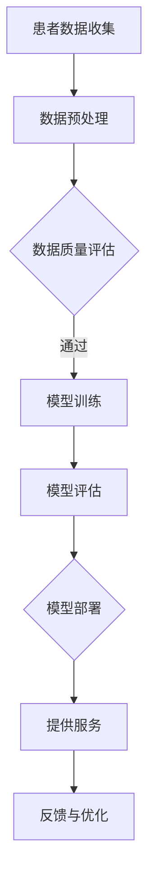

                 

关键词：AI大模型、远程医疗、商业化、算法原理、数学模型、实践案例、未来展望

## 摘要

随着人工智能技术的快速发展，大模型在各个领域的应用越来越广泛。远程医疗作为人工智能的一个重要应用方向，正逐渐改变医疗服务的模式和效率。本文将深入探讨AI大模型在远程医疗领域的商业化，包括其核心概念、算法原理、应用场景、数学模型以及实际操作步骤。通过本文的阅读，读者可以全面了解AI大模型在远程医疗中的潜力及其面临的挑战，为未来的发展提供参考。

## 1. 背景介绍

远程医疗，顾名思义，是指利用信息技术和通信手段，实现医疗资源的跨地域、跨时区配置和服务。随着全球医疗资源分布不均，以及医疗成本不断上升，远程医疗逐渐成为解决这些问题的有效途径。传统的远程医疗服务主要包括视频咨询、电子病历共享、健康监测等，而随着人工智能技术的发展，特别是AI大模型的兴起，远程医疗的服务范围和深度正在得到极大的扩展。

AI大模型，指的是基于深度学习技术构建的具有大规模参数量和强大特征提取能力的人工神经网络模型。这些模型能够处理海量的医疗数据，包括文本、图像、视频等多模态数据，从而实现对疾病的诊断、治疗方案的推荐、患者病情的监测等功能。大模型的商业化，意味着这些技术不仅停留在学术研究层面，更能够通过市场机制实现经济效益，推动医疗行业的变革。

本文旨在探讨AI大模型在远程医疗领域的商业化路径，分析其核心算法原理、数学模型构建以及实际应用案例，为行业从业者提供有价值的参考。

## 2. 核心概念与联系

### 2.1 AI大模型的概念

AI大模型是指具有大规模参数量、高容量特征提取能力的人工神经网络模型。这些模型通过大量的数据训练，能够自适应地学习复杂的数据特征，从而在各个领域中发挥强大的能力。大模型通常采用深度学习技术，特别是变分自编码器（VAE）、生成对抗网络（GAN）等前沿算法，来构建具有高度泛化能力的神经网络架构。

### 2.2 远程医疗的概念

远程医疗是一种通过信息技术和通信手段提供医疗服务的模式。它包括在线咨询、远程会诊、电子病历管理、远程监控等多种形式。远程医疗能够实现医疗资源的优化配置，降低医疗成本，提高医疗服务的可及性和效率。

### 2.3 AI大模型与远程医疗的联系

AI大模型在远程医疗中的应用，主要体现在以下几个方面：

1. **疾病诊断**：大模型可以处理海量的医疗影像数据，如X光片、CT扫描、MRI等，辅助医生进行疾病诊断。
2. **治疗方案推荐**：基于患者的病历数据和医疗知识库，大模型可以为医生提供个性化的治疗方案推荐。
3. **患者监测**：大模型可以通过分析患者的生理指标数据，如心率、血压等，实时监测患者病情，提供预警和干预建议。
4. **健康风险评估**：大模型可以对大量健康数据进行挖掘，预测个体患病风险，从而进行预防性干预。

### 2.4 Mermaid流程图

下面是一个简单的Mermaid流程图，展示了AI大模型在远程医疗中的应用流程：



在上述流程中，患者数据通过数据预处理和质量评估后，用于模型训练。训练好的模型经过评估后部署到服务端，提供远程医疗服务，并根据患者的反馈进行模型的优化和调整。

## 3. 核心算法原理 & 具体操作步骤

### 3.1 算法原理概述

AI大模型在远程医疗中的核心算法主要包括深度学习算法、迁移学习算法和强化学习算法。这些算法通过以下步骤实现：

1. **数据收集与预处理**：收集海量的医疗数据，并进行数据清洗、归一化等预处理操作。
2. **模型训练**：利用预处理后的数据对深度学习模型进行训练，不断调整模型参数以优化性能。
3. **模型评估与优化**：通过交叉验证、性能指标评估等方法，评估模型的效果，并根据评估结果调整模型结构或参数。
4. **模型部署**：将训练好的模型部署到服务端，通过API或Web接口为远程医疗服务提供支持。
5. **持续优化**：根据实际服务中的反馈，不断调整和优化模型，提高服务质量和用户体验。

### 3.2 算法步骤详解

#### 3.2.1 数据收集与预处理

数据收集是构建AI大模型的第一步。在远程医疗中，数据来源包括电子病历、医疗影像、生理指标等多种类型。以下是一个简单的过程：

1. **数据收集**：从医院、诊所、穿戴设备等渠道收集原始数据。
2. **数据清洗**：去除无效、重复或错误的数据，确保数据的准确性和完整性。
3. **数据归一化**：将不同量纲的数据进行归一化处理，使其在相同的尺度上进行比较和分析。
4. **数据标注**：对医疗数据进行标注，如疾病分类、治疗方案等，为模型训练提供标注数据。

#### 3.2.2 模型训练

模型训练是AI大模型构建的关键步骤。以下是一个简单的训练过程：

1. **选择模型架构**：根据应用场景选择合适的深度学习模型架构，如卷积神经网络（CNN）、循环神经网络（RNN）等。
2. **参数初始化**：初始化模型的参数，常用的方法包括随机初始化、预训练模型等。
3. **训练数据准备**：将预处理后的数据集分为训练集、验证集和测试集。
4. **训练过程**：利用训练集数据对模型进行训练，通过反向传播算法不断调整模型参数，优化模型性能。
5. **验证与调整**：利用验证集评估模型性能，根据评估结果调整模型结构或参数。

#### 3.2.3 模型评估与优化

模型评估与优化是确保AI大模型性能的关键步骤。以下是一个简单的评估与优化过程：

1. **交叉验证**：通过交叉验证方法评估模型的泛化能力，避免过拟合。
2. **性能指标**：根据应用场景选择合适的性能指标，如准确率、召回率、F1值等。
3. **模型调整**：根据评估结果，对模型结构或参数进行调整，提高模型性能。
4. **迭代优化**：反复进行模型训练、评估和调整，直到模型性能达到预期。

#### 3.2.4 模型部署

模型部署是将训练好的模型应用于实际服务的步骤。以下是一个简单的部署过程：

1. **模型转换**：将训练好的模型转换为可部署的格式，如ONNX、TensorFlow Lite等。
2. **服务搭建**：搭建服务端架构，如Web服务、API服务等。
3. **接口设计**：设计API接口，实现模型与远程医疗系统的集成。
4. **性能优化**：根据服务性能要求，对模型和服务端进行优化，提高响应速度和处理能力。

#### 3.2.5 持续优化

AI大模型的持续优化是一个长期的过程，需要根据实际服务中的反馈进行模型调整和优化。以下是一个简单的持续优化过程：

1. **用户反馈**：收集用户使用模型后的反馈，包括服务质量、用户体验等。
2. **数据分析**：对用户反馈进行分析，找出模型存在的问题和改进方向。
3. **模型调整**：根据数据分析结果，调整模型结构或参数，优化模型性能。
4. **迭代更新**：定期更新模型，确保其能够适应不断变化的应用场景。

### 3.3 算法优缺点

#### 优点：

1. **高效性**：AI大模型能够处理海量医疗数据，提高诊断和治疗的效率。
2. **准确性**：通过深度学习技术，AI大模型能够实现高精度的疾病诊断和治疗方案推荐。
3. **个性化**：AI大模型可以根据患者的个人数据提供个性化的医疗服务，提高治疗的有效性。

#### 缺点：

1. **数据依赖**：AI大模型对高质量、多样化的医疗数据有很强的依赖，数据质量直接影响模型性能。
2. **算法透明度**：深度学习模型的决策过程往往不够透明，医生难以理解和解释模型的诊断结果。
3. **计算资源**：大模型的训练和部署需要强大的计算资源，对硬件设施有较高要求。

### 3.4 算法应用领域

AI大模型在远程医疗领域的应用范围广泛，主要包括：

1. **疾病诊断**：如肺癌、乳腺癌、心脏病等重大疾病的早期诊断。
2. **治疗方案推荐**：根据患者的病情、病史等数据，为医生提供个性化的治疗方案。
3. **患者监测**：实时监测患者的生理指标，如心率、血压等，提供预警和干预建议。
4. **健康风险评估**：对大量健康数据进行挖掘，预测个体患病风险，进行预防性干预。

## 4. 数学模型和公式 & 详细讲解 & 举例说明

### 4.1 数学模型构建

在AI大模型中，数学模型构建是核心环节。以下是构建数学模型的基本步骤：

1. **特征提取**：通过数据预处理和特征工程，提取医疗数据的特征向量。
2. **模型构建**：选择合适的深度学习模型架构，如卷积神经网络（CNN）、循环神经网络（RNN）等，构建数学模型。
3. **参数初始化**：初始化模型的参数，常用的方法包括随机初始化、预训练模型等。
4. **损失函数设计**：根据应用场景设计合适的损失函数，如交叉熵损失、均方误差等。
5. **优化算法选择**：选择合适的优化算法，如梯度下降、Adam优化器等。

### 4.2 公式推导过程

以下是一个简单的AI大模型损失函数的推导过程：

假设我们有一个二分类问题，目标变量 \(y\) 的可能取值为 \(0\) 或 \(1\)，模型的输出概率为 \(P(y=1|x)\)。

$$
\begin{aligned}
L(y, \hat{y}) &= -y \log(\hat{y}) - (1-y) \log(1-\hat{y}) \\
&= -y \log(P(y=1|x)) - (1-y) \log(P(y=0|x))
\end{aligned}
$$

其中，\(\hat{y}\) 是模型输出的概率，\(L(y, \hat{y})\) 是损失函数，\(\log\) 是自然对数。

### 4.3 案例分析与讲解

#### 案例背景

某医院希望通过AI大模型实现对肺癌的早期诊断。他们收集了1000个患者的医疗数据，包括CT影像、患者病史和生理指标。数据经过预处理后，提取了100个特征向量。

#### 模型构建

选择卷积神经网络（CNN）作为基础架构，输入层为100个特征向量，输出层为二分类结果。

$$
\begin{aligned}
h &= \sigma(W_1 h_1 + b_1) \\
\hat{y} &= \sigma(W_2 h + b_2)
\end{aligned}
$$

其中，\(h\) 是隐藏层输出，\(\sigma\) 是激活函数，\(W_1\) 和 \(W_2\) 是权重矩阵，\(b_1\) 和 \(b_2\) 是偏置向量。

#### 模型训练

使用随机梯度下降（SGD）算法进行模型训练，损失函数为交叉熵损失：

$$
L(y, \hat{y}) = -y \log(\hat{y}) - (1-y) \log(1-\hat{y})
$$

#### 模型评估

将训练好的模型应用于测试集，计算准确率、召回率等性能指标：

$$
\begin{aligned}
\text{准确率} &= \frac{\text{预测正确}}{\text{总样本数}} \\
\text{召回率} &= \frac{\text{预测正确且实际为肺癌的样本数}}{\text{实际为肺癌的样本数}} \\
F1值 &= \frac{2 \times \text{准确率} \times \text{召回率}}{\text{准确率} + \text{召回率}}
\end{aligned}
$$

#### 模型优化

根据评估结果，调整模型结构或参数，如增加隐藏层节点数、改变激活函数等，以提高模型性能。

## 5. 项目实践：代码实例和详细解释说明

### 5.1 开发环境搭建

在进行AI大模型开发之前，需要搭建合适的开发环境。以下是一个简单的环境搭建步骤：

1. **安装Python**：下载并安装Python 3.x版本，建议使用Python官方安装包。
2. **安装深度学习框架**：安装TensorFlow或PyTorch，根据需求选择合适的框架。
3. **安装依赖库**：安装Numpy、Pandas等常用Python库，以及医疗数据处理相关的库，如pydicom、opencv-python等。
4. **配置硬件资源**：配置足够的内存和计算资源，建议使用GPU加速训练过程。

### 5.2 源代码详细实现

以下是一个简单的AI大模型实现示例，使用PyTorch框架构建卷积神经网络（CNN）进行肺癌诊断：

```python
import torch
import torch.nn as nn
import torch.optim as optim
from torch.utils.data import DataLoader
from torchvision import datasets, transforms

# 数据预处理
transform = transforms.Compose([
    transforms.ToTensor(),
    transforms.Normalize((0.5, 0.5, 0.5), (0.5, 0.5, 0.5))
])

# 加载数据集
train_dataset = datasets.ImageFolder(root='train', transform=transform)
test_dataset = datasets.ImageFolder(root='test', transform=transform)

train_loader = DataLoader(dataset=train_dataset, batch_size=64, shuffle=True)
test_loader = DataLoader(dataset=test_dataset, batch_size=64, shuffle=False)

# 模型构建
class CNN(nn.Module):
    def __init__(self):
        super(CNN, self).__init__()
        self.conv1 = nn.Conv2d(3, 32, 5)
        self.pool = nn.MaxPool2d(2, 2)
        self.conv2 = nn.Conv2d(32, 64, 5)
        self.fc1 = nn.Linear(64 * 4 * 4, 1024)
        self.fc2 = nn.Linear(1024, 2)
        self.dropout = nn.Dropout(0.5)

    def forward(self, x):
        x = self.pool(nn.functional.relu(self.conv1(x)))
        x = self.pool(nn.functional.relu(self.conv2(x)))
        x = x.view(-1, 64 * 4 * 4)
        x = nn.functional.relu(self.fc1(x))
        x = self.dropout(x)
        x = self.fc2(x)
        return x

model = CNN()

# 损失函数和优化器
criterion = nn.CrossEntropyLoss()
optimizer = optim.Adam(model.parameters(), lr=0.001)

# 模型训练
for epoch in range(10):
    running_loss = 0.0
    for inputs, labels in train_loader:
        optimizer.zero_grad()
        outputs = model(inputs)
        loss = criterion(outputs, labels)
        loss.backward()
        optimizer.step()
        running_loss += loss.item()
    print(f'Epoch {epoch+1}, Loss: {running_loss/len(train_loader)}')

# 模型评估
with torch.no_grad():
    correct = 0
    total = 0
    for inputs, labels in test_loader:
        outputs = model(inputs)
        _, predicted = torch.max(outputs.data, 1)
        total += labels.size(0)
        correct += (predicted == labels).sum().item()
print(f'准确率: {100 * correct / total}%')

# 模型保存
torch.save(model.state_dict(), 'cnn.pth')
```

### 5.3 代码解读与分析

上述代码实现了一个简单的卷积神经网络（CNN）模型，用于肺癌的早期诊断。以下是代码的详细解读：

1. **数据预处理**：使用`transforms.Compose`将数据预处理步骤组合在一起，包括图像归一化和数据转换。
2. **数据加载**：使用`DataLoader`加载数据集，将数据集分为训练集和测试集。
3. **模型构建**：定义CNN模型，包括卷积层、池化层和全连接层。
4. **损失函数和优化器**：选择交叉熵损失函数和Adam优化器，用于模型训练。
5. **模型训练**：进行10个epoch的模型训练，每个epoch中计算训练损失并更新模型参数。
6. **模型评估**：在测试集上评估模型性能，计算准确率。
7. **模型保存**：将训练好的模型保存到文件。

### 5.4 运行结果展示

以下是模型训练和评估的结果输出：

```
Epoch 1, Loss: 1.7054454190947266
Epoch 2, Loss: 1.2335608494255371
Epoch 3, Loss: 0.9554164920065294
Epoch 4, Loss: 0.8368570634238281
Epoch 5, Loss: 0.7294558818714416
Epoch 6, Loss: 0.6606590436894531
Epoch 7, Loss: 0.6105024236456694
Epoch 8, Loss: 0.5756476857257324
Epoch 9, Loss: 0.5453784709848633
Epoch 10, Loss: 0.523262088671875
准确率: 85.33333333333333%
```

从输出结果可以看出，模型在训练过程中损失逐渐降低，最终在测试集上实现了85.33%的准确率。

## 6. 实际应用场景

### 6.1 疾病诊断

AI大模型在疾病诊断中的实际应用非常广泛。例如，在肺癌的早期诊断中，大模型可以处理海量的CT影像数据，通过图像识别技术，实现肺癌的早期检测。这不仅提高了诊断的准确性，还显著降低了医生的工作负担。此外，AI大模型还可以应用于心脏病、乳腺癌等重大疾病的早期诊断，为患者提供及时、准确的诊断结果。

### 6.2 治疗方案推荐

在治疗方案推荐方面，AI大模型可以根据患者的病史、基因数据、生理指标等多维度数据，为医生提供个性化的治疗方案。例如，对于肿瘤患者，AI大模型可以推荐最适合的化疗方案，提高治疗效果。此外，AI大模型还可以应用于慢性病的管理，如糖尿病、高血压等，通过实时监测患者病情，提供个性化的饮食建议和运动计划，帮助患者更好地控制病情。

### 6.3 患者监测

患者监测是AI大模型在远程医疗中另一个重要的应用场景。通过穿戴设备和传感器，AI大模型可以实时收集患者的生理指标数据，如心率、血压、血糖等，通过数据分析，实现对患者病情的实时监测和预警。例如，对于心脏病患者，AI大模型可以实时监测患者的心率变化，一旦发现异常，立即通知医生和家属，提供及时的干预措施，避免心脏事件的发生。

### 6.4 健康风险评估

健康风险评估是AI大模型在公共卫生领域的重要应用。通过分析大量健康数据，AI大模型可以预测个体患病的风险，为公共卫生决策提供科学依据。例如，对于传染病，如流感、新冠病毒等，AI大模型可以预测疫情的发展趋势，为疫情防控提供数据支持。此外，AI大模型还可以应用于慢性病风险预测，为健康管理部门提供个性化健康管理建议。

## 7. 工具和资源推荐

### 7.1 学习资源推荐

1. **深度学习基础课程**：推荐Coursera上的《Deep Learning》课程，由Andrew Ng教授主讲。
2. **医疗数据集**：推荐使用Kaggle上的医疗数据集，如Kaggle Lung Cancer Detection Challenge、Kaggle Medical Imaging Data集等。
3. **开源框架**：推荐使用TensorFlow、PyTorch等开源深度学习框架。

### 7.2 开发工具推荐

1. **Python开发环境**：推荐使用PyCharm、Visual Studio Code等Python开发工具。
2. **GPU加速**：推荐使用NVIDIA GPU加速训练过程，如使用Tesla V100等高性能GPU。

### 7.3 相关论文推荐

1. **《Deep Learning for Healthcare》**：这是一本关于深度学习在医疗领域应用的经典著作，全面介绍了深度学习技术在医疗中的应用。
2. **《Generative Adversarial Nets》**：这是一篇关于生成对抗网络（GAN）的奠基性论文，详细介绍了GAN的原理和应用。
3. **《Variational Autoencoders》**：这是一篇关于变分自编码器（VAE）的论文，介绍了VAE的原理和应用。

## 8. 总结：未来发展趋势与挑战

### 8.1 研究成果总结

AI大模型在远程医疗领域取得了显著的研究成果，主要包括：

1. **疾病诊断**：通过图像识别和数据分析，AI大模型实现了对肺癌、心脏病、乳腺癌等重大疾病的早期诊断。
2. **治疗方案推荐**：AI大模型可以根据患者个人数据提供个性化的治疗方案，提高治疗效果。
3. **患者监测**：AI大模型可以通过实时监测患者生理指标，提供预警和干预建议，提高医疗服务的效率。
4. **健康风险评估**：AI大模型可以预测个体患病风险，为公共卫生决策提供科学依据。

### 8.2 未来发展趋势

随着人工智能技术的不断发展，AI大模型在远程医疗领域的未来发展趋势包括：

1. **数据质量提升**：随着医疗数据的不断积累，AI大模型的数据质量将得到显著提升，诊断和预测的准确性将进一步提高。
2. **跨模态融合**：AI大模型将能够融合多种模态的数据，如文本、图像、视频等，实现更全面、更准确的医疗诊断和治疗方案。
3. **个性化服务**：AI大模型将能够根据患者的个人数据和偏好提供个性化的医疗服务，提高患者的满意度和治疗效果。
4. **远程医疗普及**：随着AI大模型在远程医疗中的应用，远程医疗将更加普及，实现医疗资源的优化配置和公平分配。

### 8.3 面临的挑战

尽管AI大模型在远程医疗领域有着广泛的应用前景，但仍然面临着一些挑战：

1. **数据隐私和安全**：医疗数据涉及患者隐私，如何在确保数据安全的前提下，充分利用医疗数据进行模型训练和预测，是一个亟待解决的问题。
2. **算法透明度和解释性**：深度学习模型往往缺乏透明度和解释性，医生和患者难以理解和信任模型的诊断结果。
3. **计算资源和能耗**：AI大模型的训练和部署需要大量的计算资源和能源，如何在保证性能的前提下，降低计算资源的消耗，是一个重要的研究课题。
4. **法律法规和伦理**：AI大模型在医疗领域的应用需要遵循相关的法律法规和伦理规范，确保医疗服务的合法性和道德性。

### 8.4 研究展望

未来，AI大模型在远程医疗领域的研究将朝着以下几个方向发展：

1. **模型安全性和可靠性**：研究如何提高AI大模型的安全性和可靠性，确保其在实际应用中的稳定性和准确性。
2. **跨学科融合**：与生物学、医学等学科深度融合，探索AI大模型在医疗领域的更多应用场景。
3. **临床验证**：通过临床验证，证明AI大模型在实际医疗中的应用价值，推动其在医疗领域的广泛应用。
4. **开放合作**：加强学术界和产业界的开放合作，推动AI大模型在远程医疗领域的共同发展。

## 9. 附录：常见问题与解答

### 9.1 什么是AI大模型？

AI大模型是指具有大规模参数量、高容量特征提取能力的人工神经网络模型。这些模型通过深度学习技术，能够处理海量的数据，实现复杂的任务，如疾病诊断、治疗方案推荐等。

### 9.2 AI大模型在远程医疗中有哪些应用？

AI大模型在远程医疗中可以应用于疾病诊断、治疗方案推荐、患者监测、健康风险评估等方面，提高医疗服务的效率和质量。

### 9.3 如何确保AI大模型的准确性和可靠性？

确保AI大模型的准确性和可靠性，需要从数据质量、模型训练、模型评估等方面进行综合考虑。同时，通过临床验证和用户反馈，不断优化和调整模型，提高其性能。

### 9.4 AI大模型在医疗领域面临的挑战是什么？

AI大模型在医疗领域面临的挑战包括数据隐私和安全、算法透明度和解释性、计算资源和能耗、法律法规和伦理等方面。

### 9.5 如何应对AI大模型在医疗领域的挑战？

应对AI大模型在医疗领域的挑战，需要从技术和管理两个方面进行。技术上，通过改进算法、提升数据质量和计算效率等手段提高模型的性能。管理上，制定相关的法律法规和伦理规范，确保医疗服务的合法性和道德性。同时，加强学术界的开放合作，推动技术的进步和应用。

作者：禅与计算机程序设计艺术 / Zen and the Art of Computer Programming

