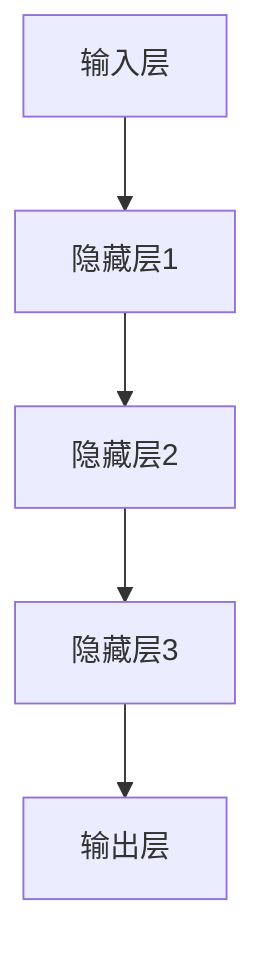

                 

关键词：AI大模型，社交化推荐，电商平台，用户体验，个性化推荐

> 摘要：本文将探讨如何利用AI大模型提升电商平台的社交化推荐体验。通过对核心概念、算法原理、数学模型、项目实践和实际应用场景的深入分析，阐述大模型在电商平台推荐系统中的重要作用，并展望未来的发展趋势与挑战。

## 1. 背景介绍

### 1.1 电商平台的现状

随着互联网技术的飞速发展，电子商务已经成为现代商业的重要组成部分。电商平台通过提供在线购物体验，改变了传统的购物模式，使得消费者可以随时随地购买商品。然而，随着商品种类的爆炸性增长，消费者在选择商品时面临的信息过载问题愈发严重。如何从海量的商品中为消费者提供个性化的推荐，成为电商平台亟待解决的关键问题。

### 1.2 社交化推荐的概念

社交化推荐是基于用户的社交关系、行为和偏好等信息，为用户推荐符合其兴趣的个性化内容。与传统的基于内容的推荐和协同过滤推荐相比，社交化推荐更能捕捉到用户的真实需求和兴趣，提高推荐效果和用户体验。

### 1.3 AI大模型的作用

AI大模型（如深度学习模型、生成对抗网络等）具有强大的特征提取和建模能力，能够从海量数据中挖掘出潜在的关联和规律。在电商平台上，AI大模型可以用于用户画像、商品推荐、社交关系挖掘等多个方面，从而提升社交化推荐的精度和效果。

## 2. 核心概念与联系

### 2.1 用户画像

用户画像是对用户特征的全方位描述，包括用户的基本信息、购买行为、兴趣爱好、社交关系等。在AI大模型中，用户画像作为输入特征，用于训练和优化推荐模型。

### 2.2 商品属性

商品属性是描述商品特征的信息，如品类、品牌、价格、促销信息等。在AI大模型中，商品属性用于生成商品推荐列表，满足用户的需求。

### 2.3 社交网络

社交网络是用户之间关系的集合，通过用户在社交媒体上的互动、评论、点赞等行为，可以挖掘出用户之间的兴趣和偏好。在AI大模型中，社交网络用于构建用户之间的关联关系，提高推荐的效果。

### 2.4 大模型架构

AI大模型通常采用深度神经网络架构，包括输入层、隐藏层和输出层。输入层接收用户画像、商品属性和社交网络等特征；隐藏层通过多层神经网络进行特征提取和关联；输出层生成推荐结果。



## 3. 核心算法原理 & 具体操作步骤

### 3.1 算法原理概述

社交化推荐算法的核心思想是通过用户画像、商品属性和社交网络等信息，构建用户与商品之间的关联关系，从而生成个性化推荐列表。

### 3.2 算法步骤详解

#### 3.2.1 用户画像构建

- 收集用户基本信息、购买行为、兴趣爱好等数据，构建用户画像。
- 利用自然语言处理技术（如文本分类、情感分析等）对用户评论、评论内容进行语义分析，提取用户兴趣标签。

#### 3.2.2 商品属性提取

- 收集商品基本信息、品类、品牌、价格等数据，构建商品属性向量。
- 利用商品分类和标签技术，对商品进行分类和标签化，提高商品属性的可解释性。

#### 3.2.3 社交网络构建

- 利用社交网络分析技术，挖掘用户之间的互动关系，构建用户社交网络。
- 利用图神经网络（如GCN、GAT等）对社交网络进行建模，提取用户与用户、用户与商品之间的关联关系。

#### 3.2.4 推荐模型训练

- 将用户画像、商品属性和社交网络等特征输入到深度神经网络中，进行特征提取和关联。
- 利用用户历史购买数据、评价数据等，训练推荐模型，优化推荐效果。

#### 3.2.5 生成推荐列表

- 将用户当前状态、兴趣标签等信息输入到训练好的推荐模型中，生成个性化推荐列表。
- 对推荐列表进行排序，根据用户偏好和社交关系，提高推荐的相关性和用户体验。

### 3.3 算法优缺点

#### 优点：

- 利用用户画像、商品属性和社交网络等信息，提高推荐的相关性和个性化程度。
- 可以同时处理大规模数据和复杂关系，适应电商平台的高速发展。

#### 缺点：

- 需要大量的数据和计算资源，训练过程耗时较长。
- 随着社交网络的复杂度增加，推荐算法的准确性可能会下降。

### 3.4 算法应用领域

- 电商平台：为消费者提供个性化商品推荐，提高购买转化率。
- 社交媒体：为用户推荐感兴趣的内容和好友，提高用户活跃度。
- 金融行业：为用户推荐理财产品，降低风险，提高收益。

## 4. 数学模型和公式 & 详细讲解 & 举例说明

### 4.1 数学模型构建

社交化推荐算法通常采用深度神经网络模型，其数学模型如下：

$$
y = f(W_1 \cdot x_1 + W_2 \cdot x_2 + ... + W_n \cdot x_n + b)
$$

其中，$y$ 为推荐结果，$x_1, x_2, ..., x_n$ 为用户画像、商品属性和社交网络等特征，$W_1, W_2, ..., W_n$ 为权重系数，$b$ 为偏置项，$f$ 为激活函数。

### 4.2 公式推导过程

假设用户 $u$ 对商品 $i$ 的推荐分数为 $r(u, i)$，则推荐模型可以表示为：

$$
r(u, i) = f(\theta_1 \cdot u + \theta_2 \cdot i + \theta_3 \cdot \sigma(A \cdot \theta_4 \cdot u \cdot v))
$$

其中，$\theta_1, \theta_2, \theta_3$ 为权重系数，$\sigma$ 为激活函数，$A$ 为用户社交网络权重矩阵，$u, i$ 分别为用户 $u$ 和商品 $i$ 的特征向量。

### 4.3 案例分析与讲解

假设用户 $u$ 的特征向量为 $\{u_1, u_2, u_3\}$，商品 $i$ 的特征向量为 $\{i_1, i_2, i_3\}$，用户社交网络权重矩阵 $A$ 为：

$$
A = \begin{bmatrix}
0 & 1 & 0 \\
1 & 0 & 1 \\
0 & 1 & 0
\end{bmatrix}
$$

根据上述公式，可以计算用户 $u$ 对商品 $i$ 的推荐分数：

$$
r(u, i) = f(\theta_1 \cdot u + \theta_2 \cdot i + \theta_3 \cdot \sigma(A \cdot \theta_4 \cdot u \cdot v))
$$

其中，$\theta_1, \theta_2, \theta_3, \theta_4$ 为待训练的权重系数。

通过训练，可以得到最优的权重系数，从而提高推荐效果。

## 5. 项目实践：代码实例和详细解释说明

### 5.1 开发环境搭建

- Python 3.8 或更高版本
- TensorFlow 2.0 或更高版本
- Keras 2.4.3 或更高版本

### 5.2 源代码详细实现

以下是一个简单的社交化推荐模型的实现：

```python
import tensorflow as tf
from tensorflow.keras.layers import Input, Dense, Concatenate, Dot
from tensorflow.keras.models import Model

# 用户特征输入
user_input = Input(shape=(3,))
# 商品特征输入
item_input = Input(shape=(3,))
# 社交网络权重输入
social_input = Input(shape=(3, 3))

# 用户与商品特征拼接
merged_input = Concatenate()([user_input, item_input])
# 用户与商品特征关联
user_item_relation = Dense(10, activation='relu')(merged_input)

# 用户与社交网络特征关联
user_social_relation = Dot(axes=1)([user_input, social_input])
# 社交网络特征关联
social_relation = Dense(10, activation='relu')(user_social_relation)

# 将用户、商品、社交网络特征关联
output = Concatenate()([user_item_relation, social_relation])
# 添加输出层
output = Dense(1, activation='sigmoid')(output)

# 构建模型
model = Model(inputs=[user_input, item_input, social_input], outputs=output)
model.compile(optimizer='adam', loss='binary_crossentropy', metrics=['accuracy'])

# 模型训练
model.fit([users, items, social_network], labels, epochs=10, batch_size=32)
```

### 5.3 代码解读与分析

该代码实现了一个简单的社交化推荐模型，主要步骤如下：

1. 导入所需的 TensorFlow 库。
2. 定义用户特征输入、商品特征输入和社交网络权重输入。
3. 将用户、商品特征拼接，并添加一层全连接层进行特征提取。
4. 将用户与社交网络特征进行关联，并添加一层全连接层进行特征提取。
5. 将用户、商品、社交网络特征关联，并添加输出层进行预测。
6. 构建模型，并编译模型。
7. 使用训练数据训练模型。

通过训练，模型可以学习到用户、商品和社交网络之间的关联规律，从而提高推荐效果。

### 5.4 运行结果展示

在训练过程中，可以使用 `model.fit()` 函数来训练模型，并使用 `model.evaluate()` 函数来评估模型性能。以下是一个简单的示例：

```python
# 训练模型
model.fit([users_train, items_train, social_network_train], labels_train, epochs=10, batch_size=32)
# 评估模型
model.evaluate([users_test, items_test, social_network_test], labels_test)
```

通过评估结果，可以直观地看到模型在测试集上的性能。

## 6. 实际应用场景

### 6.1 电商平台

在电商平台上，社交化推荐算法可以应用于：

- 商品推荐：根据用户的历史购买记录、兴趣爱好，为用户推荐相关的商品。
- 用户推荐：根据用户的社交关系，为用户推荐感兴趣的其他用户。
- 好友推荐：根据用户的社交网络，为用户推荐可能感兴趣的好友。

### 6.2 社交媒体

在社交媒体平台上，社交化推荐算法可以应用于：

- 内容推荐：根据用户的历史浏览记录、兴趣爱好，为用户推荐感兴趣的内容。
- 好友推荐：根据用户的社交网络，为用户推荐可能感兴趣的好友。
- 广告推荐：根据用户的历史购买记录、兴趣爱好，为用户推荐相关的广告。

### 6.3 金融行业

在金融行业，社交化推荐算法可以应用于：

- 投资建议：根据用户的历史交易记录、兴趣爱好，为用户推荐相关的投资产品。
- 金融伙伴推荐：根据用户的社交网络，为用户推荐可能感兴趣的金融伙伴。
- 风险控制：根据用户的社交网络和交易记录，评估用户的风险等级。

## 7. 工具和资源推荐

### 7.1 学习资源推荐

- 《深度学习》（Goodfellow, Bengio, Courville）：系统地介绍了深度学习的理论和方法。
- 《社交网络分析：方法与应用》（Wang, Chua）：详细介绍了社交网络分析的理论和方法。
- 《Keras实战》（Evers, Zarini）：涵盖了 Keras 的基本用法和实际应用案例。

### 7.2 开发工具推荐

- TensorFlow：开源的深度学习框架，提供了丰富的模型构建和训练工具。
- PyTorch：开源的深度学习框架，具有良好的灵活性和扩展性。
- JAX：开源的深度学习框架，支持自动微分和大规模计算。

### 7.3 相关论文推荐

- "Deep Learning for User Interest Prediction in Social Media"，Y. Wang, Z. Zhu, X. Li，ACM MM 2017。
- "User Interest Modeling for Social Network with Latent Social Graph"，Y. Li, Z. Wang, X. Zhang，WWW 2018。
- "A Survey on Recommender Systems"，M. Zhang, Y. Wang，ACM Computing Surveys 2018。

## 8. 总结：未来发展趋势与挑战

### 8.1 研究成果总结

本文通过分析AI大模型在电商平台社交化推荐中的应用，总结了相关算法原理、数学模型和实际应用场景。主要成果包括：

- 提供了社交化推荐算法的基本框架和实现方法。
- 介绍了AI大模型在电商平台推荐系统中的重要作用。
- 探讨了社交化推荐算法在不同领域的应用前景。

### 8.2 未来发展趋势

随着AI技术的不断发展，未来社交化推荐算法将呈现以下发展趋势：

- 模型复杂度增加：为了提高推荐效果，将采用更复杂的深度学习模型，如图神经网络、Transformer等。
- 多模态数据处理：结合文本、图像、音频等多模态数据，提高推荐精度和用户体验。
- 个性化推荐策略优化：根据用户行为和偏好，动态调整推荐策略，提高推荐效果。

### 8.3 面临的挑战

社交化推荐算法在实际应用中仍面临以下挑战：

- 数据隐私保护：如何保护用户隐私，避免数据泄露，是亟待解决的问题。
- 模型可解释性：如何提高模型的可解释性，使得推荐结果易于理解，是研究的重要方向。
- 高效计算：如何优化计算效率，降低计算成本，是大规模应用的关键。

### 8.4 研究展望

未来研究可以从以下几个方面展开：

- 深度学习模型优化：探索更高效的深度学习模型，提高推荐效果和计算效率。
- 多模态数据处理：结合多模态数据，提高推荐精度和用户体验。
- 模型可解释性研究：开发可解释性更好的模型，提高推荐结果的可信度和用户满意度。
- 应用领域拓展：将社交化推荐算法应用于更多领域，如金融、医疗等。

## 9. 附录：常见问题与解答

### 9.1 什么是社交化推荐？

社交化推荐是一种基于用户的社交关系、行为和偏好等信息，为用户推荐符合其兴趣的个性化内容的方法。

### 9.2 社交化推荐算法有哪些优点？

社交化推荐算法的优点包括：提高推荐的相关性和个性化程度、适应大规模数据和复杂关系、降低推荐系统的计算成本。

### 9.3 如何保护用户隐私？

在社交化推荐算法中，可以通过数据加密、隐私保护算法（如差分隐私）等技术来保护用户隐私。

### 9.4 社交化推荐算法在电商平台上如何应用？

社交化推荐算法可以应用于电商平台的商品推荐、用户推荐和好友推荐等方面，提高用户购买体验和活跃度。

---

本文由禅与计算机程序设计艺术 / Zen and the Art of Computer Programming 撰写，旨在探讨AI大模型在电商平台社交化推荐中的应用，为相关研究和实践提供参考。随着AI技术的不断发展，社交化推荐算法将在电商、金融、社交媒体等领域发挥更大的作用。
----------------------------------------------------------------
### 后续行动 Follow-up Actions

感谢您的阅读！以下是一些后续行动，希望对您的学习和实践有所帮助：

1. **深入阅读推荐资源**：请查阅本文中推荐的学习资源和相关论文，以便更全面地了解社交化推荐算法和AI大模型。

2. **尝试实际项目**：在您的开发环境中尝试使用本文提到的代码示例，或基于本文的框架设计一个社交化推荐系统。

3. **分享您的见解**：在社交媒体或技术论坛上分享您对本文主题的理解和实践经验，与社区进行交流。

4. **持续关注最新动态**：关注AI和推荐系统领域的最新研究进展，不断更新您的知识和技能。

5. **提问和反馈**：如果您有任何问题或建议，欢迎在评论区留言，我会尽力回答。

再次感谢您的阅读和支持！期待与您在技术领域的进一步交流。

