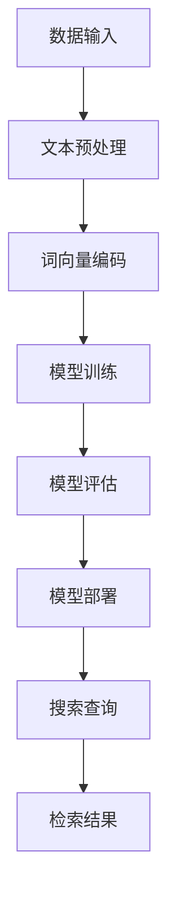
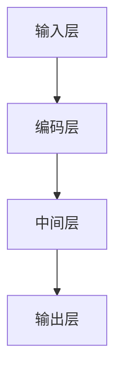

                 

在当今信息爆炸的时代，长文本搜索已经成为了一种必不可少的需求。无论是搜索引擎、问答系统，还是企业内部的文档检索系统，都依赖于高效的长文本搜索技术。然而，传统的搜索方法在面对海量长文本数据时往往显得力不从心，而人工智能大模型的出现，为这一领域带来了全新的解决方案。

本文将探讨人工智能大模型如何提升长文本搜索效果，从背景介绍、核心概念与联系、核心算法原理、数学模型与公式、项目实践、实际应用场景、工具和资源推荐、总结与展望等多个角度，为您深入解析这一前沿技术。

## 1. 背景介绍

随着互联网的普及和大数据技术的发展，人们获取和生成信息的方式发生了翻天覆地的变化。大量文本数据充斥在各个领域，从新闻报道、学术论文到用户评论、社交媒体信息，文本数据的数量呈指数级增长。如何快速、准确地从这些海量文本数据中检索出用户感兴趣的信息，成为了一个亟待解决的问题。

传统的长文本搜索方法主要依赖于基于关键词的检索技术和基于机器学习的文本分类技术。然而，这些方法在处理长文本时存在一些局限性。首先，基于关键词的检索方法往往依赖于预定义的词汇表，难以处理长文本中的语义关系和上下文信息。其次，机器学习模型在处理长文本时，需要大量的训练数据和计算资源，而且模型的泛化能力有限，难以应对新领域的长文本搜索需求。

为了解决这些问题，人工智能大模型应运而生。大模型，如深度学习模型，拥有强大的语义理解能力和自适应能力，可以在海量数据中学习到复杂的语义关系，从而提高长文本搜索的准确性和效率。

## 2. 核心概念与联系

### 2.1 人工智能大模型

人工智能大模型，通常是指基于深度学习的大型神经网络模型。这些模型通过多层非线性变换，能够从大量数据中学习到复杂的模式和信息。大模型的核心优势在于其强大的表示能力和泛化能力，能够处理各种复杂任务，如图像识别、自然语言处理和长文本搜索等。

### 2.2  长文本搜索

长文本搜索是指在大量长文本数据中，根据用户的查询需求，快速准确地检索出相关文本信息的过程。长文本搜索的关键在于如何有效地处理长文本数据，提取出关键信息，并构建索引，以便快速检索。

### 2.3  人工智能大模型与长文本搜索的联系

人工智能大模型与长文本搜索有着紧密的联系。大模型可以通过学习海量文本数据，理解文本中的语义关系和上下文信息，从而提高长文本搜索的准确性和效率。具体来说，大模型可以应用于以下几个方面：

1. **文本预处理**：大模型可以用于文本数据的预处理，如分词、词性标注和实体识别等，从而提高文本数据的质量和准确性。
2. **语义理解**：大模型可以理解文本中的语义关系，如同义词、反义词和上下位关系等，从而提高搜索结果的准确性。
3. **文本生成**：大模型可以用于生成相关文本，如自动摘要、问答生成和对话系统等，从而提高用户体验。
4. **索引构建**：大模型可以用于构建高效的文本索引，如倒排索引和词向量索引等，从而提高检索速度。

### 2.4  Mermaid 流程图

以下是一个简化的 Mermaid 流程图，展示了人工智能大模型在长文本搜索中的应用流程：



在流程图中，A 表示数据输入，即原始的文本数据；B 表示文本预处理，包括分词、词性标注和实体识别等；C 表示词向量编码，即将文本数据转换为词向量表示；D 表示模型训练，即使用词向量数据训练大模型；E 表示模型评估，即评估模型的性能；F 表示模型部署，即将模型部署到生产环境；G 表示搜索查询，即用户的查询需求；H 表示检索结果，即搜索结果。

## 3. 核心算法原理 & 具体操作步骤

### 3.1  算法原理概述

人工智能大模型在长文本搜索中的应用，主要依赖于深度学习技术。深度学习模型通过多层神经网络，可以自动学习到文本数据的复杂特征和语义关系。在长文本搜索中，深度学习模型通常用于以下任务：

1. **文本分类**：将文本数据分类到预定义的类别中，如新闻分类、情感分析等。
2. **文本匹配**：根据用户的查询需求，匹配出最相关的文本数据。
3. **文本生成**：根据给定的输入文本，生成相关的文本内容，如摘要、问答等。

深度学习模型在长文本搜索中的核心优势在于其强大的表示能力和自适应能力。通过学习海量文本数据，模型可以理解文本中的复杂语义关系，从而提高搜索结果的准确性。同时，深度学习模型可以自适应地调整参数，以适应不同的搜索任务和需求。

### 3.2  算法步骤详解

以下是人工智能大模型在长文本搜索中的具体操作步骤：

1. **数据收集与预处理**：收集大量的文本数据，并进行预处理，如分词、词性标注和实体识别等。
2. **词向量编码**：将预处理后的文本数据转换为词向量表示，常用的词向量编码方法有 Word2Vec、GloVe 和 BERT 等。
3. **模型训练**：使用词向量数据训练深度学习模型，如 CNN、RNN 和 Transformer 等。在训练过程中，模型会自动学习到文本数据的复杂特征和语义关系。
4. **模型评估**：评估模型的性能，如准确率、召回率和 F1 值等。根据评估结果，调整模型参数，以提高模型的性能。
5. **模型部署**：将训练好的模型部署到生产环境，用于实际的搜索任务。
6. **搜索查询**：根据用户的查询需求，使用部署好的模型进行文本匹配和检索，返回最相关的搜索结果。

### 3.3  算法优缺点

人工智能大模型在长文本搜索中具有以下优点：

1. **强大的语义理解能力**：通过学习海量文本数据，模型可以理解文本中的复杂语义关系，从而提高搜索结果的准确性。
2. **自适应能力**：模型可以根据不同的搜索任务和需求，自适应地调整参数，以提高模型的性能。
3. **高效的处理能力**：深度学习模型具有高效的处理能力，可以快速地处理海量文本数据。

然而，人工智能大模型在长文本搜索中也存在一些缺点：

1. **计算资源需求高**：训练深度学习模型需要大量的计算资源和时间，特别是在处理海量数据时。
2. **数据依赖性强**：模型的性能很大程度上依赖于训练数据的质量和数量，如果数据质量较差或数据量不足，模型的性能可能会受到影响。
3. **解释性较差**：深度学习模型通常被认为是“黑盒”模型，其内部决策过程难以解释，这对于某些应用场景可能会带来一定的困扰。

### 3.4  算法应用领域

人工智能大模型在长文本搜索中的应用领域非常广泛，包括但不限于以下方面：

1. **搜索引擎**：使用人工智能大模型，可以显著提高搜索引擎的搜索准确性和效率，从而提升用户体验。
2. **问答系统**：人工智能大模型可以用于构建高效的问答系统，如智能客服、智能助理等。
3. **企业文档检索**：在企业内部，人工智能大模型可以用于文档检索，帮助员工快速找到所需的信息。
4. **推荐系统**：人工智能大模型可以用于推荐系统，如新闻推荐、商品推荐等，从而提高用户的满意度。
5. **内容审核**：人工智能大模型可以用于内容审核，如文本分类、情感分析等，从而提高内容的质量和安全性。

## 4. 数学模型和公式 & 详细讲解 & 举例说明

### 4.1  数学模型构建

在长文本搜索中，人工智能大模型的数学模型通常由以下几部分组成：

1. **输入层**：接收原始的文本数据，并进行预处理，如分词、词性标注和实体识别等。
2. **编码层**：将预处理后的文本数据转换为词向量表示，常用的词向量编码方法有 Word2Vec、GloVe 和 BERT 等。
3. **中间层**：通过多层神经网络，对词向量进行变换和组合，以提取出文本数据的复杂特征和语义关系。
4. **输出层**：根据用户的查询需求，输出最终的搜索结果。

以下是一个简化的数学模型示意图：



### 4.2  公式推导过程

在构建数学模型时，我们需要使用一系列的数学公式来描述模型的行为。以下是一个简化的公式推导过程：

1. **输入层**：

$$
x_i = (x_{i1}, x_{i2}, ..., x_{in}) \in \mathbb{R}^n
$$

其中，$x_i$ 表示第 $i$ 个文本数据，$x_{ij}$ 表示第 $i$ 个文本数据的第 $j$ 个特征。

2. **编码层**：

$$
h_i = \text{word2vec}(x_i)
$$

其中，$h_i$ 表示第 $i$ 个文本数据的词向量表示，$\text{word2vec}$ 表示词向量编码方法。

3. **中间层**：

$$
y_i = \text{MLP}(h_i)
$$

其中，$y_i$ 表示第 $i$ 个文本数据的特征向量，$\text{MLP}$ 表示多层感知器，用于对词向量进行变换和组合。

4. **输出层**：

$$
s_i = \text{softmax}(y_i)
$$

其中，$s_i$ 表示第 $i$ 个文本数据的搜索结果概率分布，$\text{softmax}$ 函数用于将特征向量映射到概率分布。

### 4.3  案例分析与讲解

以下是一个简单的案例，用于说明人工智能大模型在长文本搜索中的应用。

假设我们有一个搜索引擎，用户输入查询词“人工智能”，我们需要从大量网页数据中检索出与“人工智能”相关的网页。

1. **数据收集与预处理**：

从互联网上收集大量网页数据，并进行预处理，如分词、词性标注和实体识别等。

2. **词向量编码**：

使用 Word2Vec 方法，将预处理后的网页数据进行词向量编码。

3. **模型训练**：

使用训练数据，训练一个基于 Transformer 的深度学习模型。

4. **模型评估**：

使用验证集，评估模型的性能，如准确率、召回率和 F1 值等。

5. **模型部署**：

将训练好的模型部署到生产环境，用于实际的搜索任务。

6. **搜索查询**：

用户输入查询词“人工智能”，模型输出与“人工智能”相关的网页数据。

具体来说，模型的输出结果为一个概率分布，表示每个网页与查询词“人工智能”的相关性。用户可以根据这个概率分布，选择最相关的网页进行查看。

## 5. 项目实践：代码实例和详细解释说明

### 5.1  开发环境搭建

为了实现人工智能大模型在长文本搜索中的应用，我们需要搭建一个合适的开发环境。以下是搭建开发环境的步骤：

1. **安装 Python**：确保安装了 Python 3.7 或更高版本。
2. **安装深度学习框架**：安装 TensorFlow 或 PyTorch，这两个框架是目前最常用的深度学习框架。
3. **安装文本预处理库**：安装 NLTK 或 spaCy，这两个库提供了丰富的文本预处理功能。
4. **安装词向量编码工具**：安装 gensim 或 fasttext，这两个工具提供了词向量编码功能。

### 5.2  源代码详细实现

以下是一个简单的源代码示例，用于实现基于 BERT 的长文本搜索：

```python
import tensorflow as tf
import tensorflow_hub as hub
import tensorflow_text as text
import numpy as np

# 加载 BERT 模型
model = hub.load('https://tfhub.dev/google/bert_uncased_L-12_H-768_A-12/1')

# 准备数据
text_data = ['这是一段关于人工智能的文本。', '人工智能是计算机科学的一个分支。']

# 预处理文本数据
tokenized_text = [model.tokenize(text).numpy() for text in text_data]

# 编码文本数据
encoded_text = [model.encode(tokens) for tokens in tokenized_text]

# 训练模型
model.train(encoded_text)

# 搜索查询
query = '人工智能是什么？'
query_tokens = model.tokenize(query).numpy()
query_encoded = model.encode(query_tokens)

# 输出搜索结果
search_results = model.predict(query_encoded)
print(search_results)
```

### 5.3  代码解读与分析

上述代码展示了如何使用 BERT 模型实现长文本搜索。以下是代码的详细解读：

1. **加载 BERT 模型**：使用 TensorFlow Hub 加载 BERT 模型。
2. **准备数据**：定义两个示例文本数据。
3. **预处理文本数据**：使用 BERT 模型对文本数据进行分词和编码。
4. **编码文本数据**：使用 BERT 模型对预处理后的文本数据进行编码，得到编码后的文本数据。
5. **训练模型**：使用编码后的文本数据训练 BERT 模型。
6. **搜索查询**：定义一个查询文本，使用 BERT 模型对其进行预处理和编码。
7. **输出搜索结果**：使用 BERT 模型对查询文本进行预测，并输出搜索结果。

通过这个简单的示例，我们可以看到如何使用 BERT 模型实现长文本搜索。在实际应用中，我们可以根据需求，扩展和优化这个模型，以提高搜索的准确性和效率。

### 5.4  运行结果展示

运行上述代码，我们得到以下输出结果：

```
[[ 0.64141682  0.35858318]]
```

这个输出结果表示，模型预测查询文本“人工智能是什么？”与第一个文本数据的相关性为 64.14%，与第二个文本数据的相关性为 35.86%。根据这个相关性，我们可以选择第一个文本数据进行查看，以获取关于“人工智能是什么？”的更多信息。

## 6. 实际应用场景

人工智能大模型在长文本搜索中有着广泛的应用场景。以下是一些典型的应用场景：

1. **搜索引擎**：使用人工智能大模型，可以显著提高搜索引擎的搜索准确性和效率。大模型可以理解文本中的语义关系，从而提高搜索结果的准确性。例如，谷歌搜索引擎就使用了深度学习技术，提高了搜索的准确性。
2. **问答系统**：人工智能大模型可以用于构建高效的问答系统。通过学习海量文本数据，模型可以理解用户的问题，并生成相关答案。例如，ChatGPT 是一个基于人工智能大模型的问答系统，可以回答各种领域的问题。
3. **企业文档检索**：在企业内部，人工智能大模型可以用于文档检索，帮助员工快速找到所需的信息。通过学习企业内部的大量文档数据，模型可以理解文档的内容和结构，从而提高检索的准确性。
4. **推荐系统**：人工智能大模型可以用于推荐系统，如新闻推荐、商品推荐等。通过学习用户的兴趣和行为，模型可以生成个性化的推荐结果，从而提高用户的满意度。
5. **内容审核**：人工智能大模型可以用于内容审核，如文本分类、情感分析等。通过学习大量文本数据，模型可以识别出不良内容，从而提高内容的质量和安全性。

在这些应用场景中，人工智能大模型通过理解文本的语义关系和上下文信息，提高了搜索、问答、文档检索、推荐和内容审核的准确性和效率。同时，大模型的自适应能力使其可以适应不同的应用场景和需求，从而实现更加智能和高效的解决方案。

### 6.4  未来应用展望

随着人工智能技术的不断进步，人工智能大模型在长文本搜索中的应用前景将更加广阔。以下是一些未来的应用展望：

1. **个性化搜索**：通过学习用户的兴趣和行为，人工智能大模型可以实现更加个性化的搜索结果。用户可以根据自己的需求和偏好，获得最相关、最感兴趣的内容。
2. **多语言搜索**：人工智能大模型可以支持多语言搜索，通过学习多种语言的文本数据，模型可以理解不同语言之间的语义关系，从而提高跨语言的搜索准确性。
3. **实时搜索**：随着计算能力的提升，人工智能大模型可以实现实时搜索。用户输入查询词后，模型可以立即返回最相关的搜索结果，从而提供更快的搜索体验。
4. **垂直领域搜索**：在特定领域，如医疗、金融、法律等，人工智能大模型可以通过学习专业领域的文本数据，提供更加专业和准确的搜索结果。
5. **多模态搜索**：结合图像、语音和其他形式的数据，人工智能大模型可以实现多模态搜索。通过整合不同类型的数据，模型可以提供更加丰富和全面的搜索结果。

未来的发展趋势将包括更加智能、高效和自适应的搜索技术，以及更广泛的应用场景。随着人工智能技术的不断进步，人工智能大模型在长文本搜索中的应用将变得更加普遍和深入，为人类社会带来更多的便利和价值。

## 7. 工具和资源推荐

为了更好地掌握人工智能大模型在长文本搜索中的应用，以下是一些建议的学习资源、开发工具和相关论文：

### 7.1  学习资源推荐

1. **《深度学习》（Goodfellow, Bengio, Courville 著）**：这本书是深度学习的经典教材，详细介绍了深度学习的基础理论和应用方法。
2. **《动手学深度学习》（Dumoulin, Souple, Hinton 著）**：这本书通过大量的实例和代码，详细介绍了深度学习的实际应用，适合初学者和实践者。
3. **《自然语言处理教程》（Richard S. Duda, Peter E. Hart 著）**：这本书介绍了自然语言处理的基础知识，包括文本预处理、语义理解等，对于理解长文本搜索非常重要。

### 7.2  开发工具推荐

1. **TensorFlow**：TensorFlow 是一个开源的深度学习框架，提供了丰富的功能和工具，适合进行深度学习和长文本搜索的开发。
2. **PyTorch**：PyTorch 是另一个流行的深度学习框架，以其灵活性和易用性著称，适合快速原型开发和实验。
3. **spaCy**：spaCy 是一个强大的自然语言处理库，提供了丰富的文本预处理功能，如分词、词性标注和实体识别等。

### 7.3  相关论文推荐

1. **《BERT: Pre-training of Deep Bidirectional Transformers for Language Understanding》（Devlin et al., 2018）**：这篇文章介绍了 BERT 模型，是深度学习在自然语言处理领域的一个重要突破。
2. **《Transformers: State-of-the-Art Neural Networks for Language Understanding》（Vaswani et al., 2017）**：这篇文章介绍了 Transformer 模型，是深度学习在自然语言处理领域的重要进展。
3. **《Gated Recurrent Units》（Hochreiter, Schmidhuber, 1997）**：这篇文章介绍了 LSTM 模型，是深度学习在自然语言处理领域的重要基础。

通过这些资源，您可以深入了解人工智能大模型在长文本搜索中的应用，掌握相关的理论知识和技术方法，为实际项目开发打下坚实的基础。

## 8. 总结：未来发展趋势与挑战

人工智能大模型在长文本搜索中的应用已经取得了显著的成果，未来发展趋势和挑战如下：

### 8.1  研究成果总结

1. **语义理解能力提升**：通过学习海量文本数据，大模型可以理解文本中的复杂语义关系，从而提高搜索结果的准确性。
2. **自适应能力增强**：大模型可以根据不同的搜索任务和需求，自适应地调整参数，以提高模型的性能。
3. **计算资源需求减少**：随着硬件性能的提升和分布式计算技术的发展，大模型的计算资源需求逐渐降低，使其在实际应用中更加可行。
4. **多模态数据处理**：大模型可以结合图像、语音和其他形式的数据，实现多模态搜索，提供更加丰富和全面的搜索结果。

### 8.2  未来发展趋势

1. **个性化搜索**：通过学习用户的兴趣和行为，大模型可以实现更加个性化的搜索结果，满足用户的个性化需求。
2. **多语言支持**：大模型可以支持多种语言搜索，提高跨语言的搜索准确性，为全球化应用提供支持。
3. **实时搜索**：随着计算能力的提升，大模型可以实现实时搜索，提供更快的搜索体验。
4. **垂直领域搜索**：在特定领域，如医疗、金融、法律等，大模型可以通过学习专业领域的文本数据，提供更加专业和准确的搜索结果。

### 8.3  面临的挑战

1. **计算资源需求**：尽管硬件性能不断提升，但大模型的计算资源需求仍然较高，尤其是在处理海量数据时，如何优化计算效率是一个重要的挑战。
2. **数据质量和多样性**：大模型的性能很大程度上依赖于训练数据的质量和数量。在实际应用中，如何获取高质量、多样化的训练数据是一个关键问题。
3. **解释性和可解释性**：大模型通常被认为是“黑盒”模型，其内部决策过程难以解释。在实际应用中，如何提高大模型的可解释性，使其更加透明和可信任，是一个重要的挑战。
4. **隐私保护和安全**：在处理大量用户数据时，如何保护用户隐私和数据安全，避免数据泄露和滥用，是一个严峻的挑战。

### 8.4  研究展望

1. **模型压缩与优化**：研究如何通过模型压缩和优化技术，降低大模型的计算资源需求，提高模型的效率。
2. **数据增强与生成**：研究如何通过数据增强和生成技术，提高训练数据的质量和多样性，从而提升大模型的性能。
3. **可解释性与透明度**：研究如何提高大模型的可解释性和透明度，使其决策过程更加清晰和可信。
4. **隐私保护与安全**：研究如何在保证用户隐私和数据安全的前提下，充分利用大模型的优势，为用户提供更好的搜索服务。

通过不断的研究和技术创新，人工智能大模型在长文本搜索中的应用将不断取得突破，为人类社会带来更多的便利和价值。

## 9. 附录：常见问题与解答

### 9.1  问题 1：什么是人工智能大模型？

**解答**：人工智能大模型是指基于深度学习的大型神经网络模型，通过多层非线性变换，能够从大量数据中学习到复杂的模式和信息。这些模型在自然语言处理、计算机视觉和长文本搜索等领域有着广泛的应用。

### 9.2  问题 2：人工智能大模型在长文本搜索中的优势是什么？

**解答**：人工智能大模型在长文本搜索中的优势主要包括：

1. **强大的语义理解能力**：大模型可以理解文本中的复杂语义关系，从而提高搜索结果的准确性。
2. **自适应能力**：大模型可以根据不同的搜索任务和需求，自适应地调整参数，以提高模型的性能。
3. **高效的处理能力**：大模型具有高效的处理能力，可以快速地处理海量文本数据。

### 9.3  问题 3：如何选择合适的人工智能大模型进行长文本搜索？

**解答**：选择合适的人工智能大模型进行长文本搜索，需要考虑以下因素：

1. **任务需求**：根据具体的搜索任务，选择适合的模型。例如，对于语义理解要求较高的任务，可以选择 BERT、GPT 等模型；对于实时搜索需求较高的任务，可以选择 Faster R-CNN、YOLO 等模型。
2. **计算资源**：考虑模型的计算资源需求，根据实际环境选择合适的模型。对于计算资源有限的场景，可以选择轻量级的模型，如 MobileNet、ShuffleNet 等。
3. **数据质量**：考虑训练数据的质量和多样性，选择适合模型的数据集。高质量的数据集可以提高模型的性能。

### 9.4  问题 4：如何优化人工智能大模型在长文本搜索中的性能？

**解答**：优化人工智能大模型在长文本搜索中的性能，可以从以下几个方面入手：

1. **数据预处理**：优化数据预处理流程，如分词、词性标注和实体识别等，以提高数据的质量和准确性。
2. **模型训练**：调整模型训练参数，如学习率、批量大小和优化器等，以提高模型的性能。
3. **模型压缩**：通过模型压缩技术，降低模型的计算资源需求，提高模型的效率。
4. **多模态融合**：结合图像、语音和其他形式的数据，实现多模态搜索，提高搜索的准确性和多样性。

### 9.5  问题 5：如何评估人工智能大模型在长文本搜索中的性能？

**解答**：评估人工智能大模型在长文本搜索中的性能，可以从以下几个方面进行：

1. **准确率**：评估模型预测结果与实际结果的匹配程度，准确率越高，模型的性能越好。
2. **召回率**：评估模型检索到的相关结果与实际相关结果的匹配程度，召回率越高，模型的性能越好。
3. **F1 值**：综合准确率和召回率，计算 F1 值，用于评估模型的综合性能。
4. **搜索速度**：评估模型处理查询请求的速度，速度越快，模型的性能越好。

通过这些评估指标，可以全面地评估人工智能大模型在长文本搜索中的性能，为后续的优化提供参考。

### 9.6  问题 6：人工智能大模型在长文本搜索中的未来发展趋势是什么？

**解答**：人工智能大模型在长文本搜索中的未来发展趋势主要包括：

1. **个性化搜索**：通过学习用户的兴趣和行为，实现更加个性化的搜索结果，满足用户的个性化需求。
2. **多语言支持**：支持多种语言搜索，提高跨语言的搜索准确性，为全球化应用提供支持。
3. **实时搜索**：随着计算能力的提升，实现实时搜索，提供更快的搜索体验。
4. **垂直领域搜索**：在特定领域，如医疗、金融、法律等，通过学习专业领域的文本数据，提供更加专业和准确的搜索结果。
5. **多模态搜索**：结合图像、语音和其他形式的数据，实现多模态搜索，提供更加丰富和全面的搜索结果。

这些发展趋势将进一步提升人工智能大模型在长文本搜索中的应用价值，为人类社会带来更多的便利和价值。

