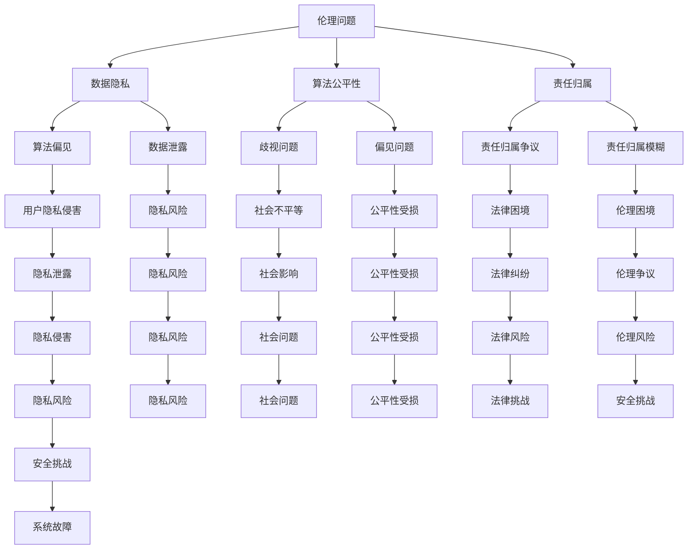

                 

关键词：人工智能，伦理，安全，大模型，应用，风险评估，隐私保护

摘要：本文深入探讨了人工智能大模型在应用过程中面临的伦理和安全问题。通过对当前大模型的发展现状进行概述，分析其在伦理和安全方面的挑战，提出了相应的解决方案和未来研究方向。

## 1. 背景介绍

随着计算能力的提升和大数据的积累，人工智能（AI）技术取得了显著进展。特别是深度学习技术的发展，使得大模型（Large-scale Models）成为了AI领域的研究热点。大模型具有极强的学习和表征能力，已经在自然语言处理、计算机视觉、语音识别等多个领域取得了突破性成果。

然而，随着大模型的广泛应用，其伦理和安全问题也日益凸显。一方面，大模型可能会侵犯用户隐私，加剧社会不平等，甚至被恶意利用；另一方面，大模型的安全漏洞可能导致严重的安全事故。因此，对大模型应用中的伦理和安全问题进行深入研究和探讨，具有重要的现实意义。

## 2. 核心概念与联系

### 2.1 伦理概念

伦理是指关于道德、行为规范和价值判断的学科。在AI领域，伦理问题主要涉及数据隐私、算法公平性、责任归属等方面。

- **数据隐私**：大模型通常需要大量数据进行训练，这些数据往往包含了用户的敏感信息。如何保护用户隐私成为了伦理的重要议题。
- **算法公平性**：大模型的学习能力使其在决策中扮演着越来越重要的角色，但算法的偏见和歧视也可能导致不公平的结果。
- **责任归属**：当大模型出现错误或被恶意利用时，如何确定责任归属，成为了法律和伦理领域面临的挑战。

### 2.2 安全概念

安全是指系统在面临威胁时的抵抗能力。在大模型应用中，安全主要涉及数据安全、算法安全、系统安全等方面。

- **数据安全**：保护大模型训练和存储过程中的数据不被泄露或篡改。
- **算法安全**：防止恶意攻击者利用算法漏洞进行攻击，例如对抗性攻击。
- **系统安全**：确保大模型在运行过程中的稳定性和可靠性，防止系统故障导致的安全事故。

### 2.3 Mermaid 流程图



## 3. 核心算法原理 & 具体操作步骤

### 3.1 算法原理概述

大模型的核心在于其深度神经网络结构。深度神经网络由多个层次组成，每个层次包含多个神经元。通过逐层学习，大模型能够从原始数据中提取出有意义的特征，并完成复杂的任务。

### 3.2 算法步骤详解

1. **数据预处理**：对原始数据进行清洗、归一化等处理，以减少噪声和异常值的影响。
2. **模型构建**：设计深度神经网络结构，包括输入层、隐藏层和输出层。
3. **模型训练**：使用训练数据对模型进行训练，通过反向传播算法不断调整模型参数。
4. **模型评估**：使用测试数据对模型进行评估，以确定模型的性能。
5. **模型应用**：将训练好的模型应用于实际问题，如自然语言处理、计算机视觉等。

### 3.3 算法优缺点

**优点**：
- **强大的学习能力和表征能力**：大模型能够从大量数据中学习出复杂的关系和模式。
- **广泛的适用性**：大模型可以应用于多种领域，如自然语言处理、计算机视觉、语音识别等。

**缺点**：
- **计算资源消耗大**：大模型训练需要大量的计算资源和时间。
- **对数据质量要求高**：数据质量直接影响大模型的学习效果。
- **安全风险**：大模型可能存在隐私泄露、算法偏见等问题。

### 3.4 算法应用领域

- **自然语言处理**：大模型在文本分类、情感分析、机器翻译等领域取得了显著成果。
- **计算机视觉**：大模型在图像分类、目标检测、图像生成等领域表现优异。
- **语音识别**：大模型在语音识别、语音合成等领域取得了突破性进展。

## 4. 数学模型和公式 & 详细讲解 & 举例说明

### 4.1 数学模型构建

大模型的数学模型主要基于深度神经网络。深度神经网络由多个层次组成，每个层次包含多个神经元。神经元之间的连接权重通过训练数据不断调整，以实现预期的任务。

### 4.2 公式推导过程

假设我们有输入向量 $x$ 和输出向量 $y$，通过多层神经网络进行映射，得到预测输出向量 $\hat{y}$。神经元的激活函数通常采用 sigmoid 函数或 ReLU 函数。

$$
\hat{y} = \sigma(\theta_1 \cdot x + b_1)
$$

其中，$\sigma$ 表示激活函数，$\theta_1$ 表示权重矩阵，$b_1$ 表示偏置向量。

### 4.3 案例分析与讲解

以自然语言处理中的文本分类任务为例。假设我们有一个包含 100 个单词的词汇表，每个单词对应一个唯一的索引。我们使用一个二分类任务，判断文本是否包含某个特定关键词。

1. **数据预处理**：将文本数据转换为向量表示，使用词袋模型或词嵌入方法。
2. **模型构建**：设计一个包含两个隐藏层的深度神经网络，输入层和输出层分别包含 100 个神经元。
3. **模型训练**：使用标记数据进行训练，通过反向传播算法调整模型参数。
4. **模型评估**：使用测试数据对模型进行评估，计算准确率、召回率等指标。
5. **模型应用**：将训练好的模型应用于实际文本分类任务，判断文本是否包含特定关键词。

## 5. 项目实践：代码实例和详细解释说明

### 5.1 开发环境搭建

在 Python 中，我们使用 TensorFlow 和 Keras 库构建和训练深度神经网络。

```bash
pip install tensorflow
pip install keras
```

### 5.2 源代码详细实现

```python
from keras.models import Sequential
from keras.layers import Dense, Activation
from keras.optimizers import SGD
from keras.callbacks import Callback

# 构建模型
model = Sequential()
model.add(Dense(100, input_dim=100, activation='sigmoid'))
model.add(Dense(100, activation='sigmoid'))
model.add(Dense(1, activation='sigmoid'))

# 编译模型
model.compile(optimizer=SGD(lr=0.01), loss='binary_crossentropy', metrics=['accuracy'])

# 定义回调函数
class Callback(Callback):
    def on_train_end(self, logs={}):
        print("训练结束，最终准确率：{:.2f}%".format(logs.get('acc') * 100))

# 训练模型
model.fit(x_train, y_train, epochs=10, callbacks=[Callback()])

# 评估模型
loss, accuracy = model.evaluate(x_test, y_test)
print("测试准确率：{:.2f}%".format(accuracy * 100))
```

### 5.3 代码解读与分析

- **模型构建**：使用 `Sequential` 类构建深度神经网络，依次添加输入层、隐藏层和输出层。隐藏层使用 sigmoid 激活函数，输出层使用 sigmoid 激活函数进行二分类。
- **模型编译**：编译模型，指定优化器、损失函数和评估指标。
- **模型训练**：使用 `fit` 方法训练模型，指定训练数据和训练轮数，并添加回调函数。
- **模型评估**：使用 `evaluate` 方法评估模型在测试数据上的性能。

## 6. 实际应用场景

大模型在自然语言处理、计算机视觉、语音识别等领域有广泛的应用。例如，在自然语言处理领域，大模型可以用于文本分类、情感分析、机器翻译等任务；在计算机视觉领域，大模型可以用于图像分类、目标检测、图像生成等任务；在语音识别领域，大模型可以用于语音识别、语音合成等任务。

### 6.4 未来应用展望

随着大模型技术的不断进步，未来将会有更多领域受益于大模型的应用。例如，在医疗领域，大模型可以用于疾病诊断、药物研发等任务；在金融领域，大模型可以用于风险管理、股票预测等任务；在智能交通领域，大模型可以用于交通流量预测、自动驾驶等任务。

## 7. 工具和资源推荐

### 7.1 学习资源推荐

- **《深度学习》**：Goodfellow、Bengio 和 Courville 著，是一本经典的深度学习教材。
- **《动手学深度学习》**：阿斯顿·张等著，是一本适合初学者的深度学习教材。

### 7.2 开发工具推荐

- **TensorFlow**：一个开源的深度学习框架，提供了丰富的API和工具。
- **PyTorch**：一个开源的深度学习框架，提供了灵活的动态计算图。

### 7.3 相关论文推荐

- **“DQN: Deep Q-Network”**：一种基于深度学习的强化学习算法。
- **“BERT: Pre-training of Deep Bidirectional Transformers for Language Understanding”**：一种基于 Transformer 的预训练模型，广泛应用于自然语言处理任务。

## 8. 总结：未来发展趋势与挑战

大模型技术在未来将继续发展，并在更多领域发挥重要作用。然而，我们也需要关注大模型应用中的伦理和安全问题。通过加强伦理和安全研究，我们可以更好地应对这些挑战，确保大模型的健康发展。

### 8.1 研究成果总结

本文通过对大模型在应用中的伦理和安全问题进行深入探讨，总结了当前的研究成果和存在的问题，并提出了一些解决方案。

### 8.2 未来发展趋势

随着大模型技术的不断进步，未来将在更多领域得到广泛应用。同时，伦理和安全研究也将得到更多关注。

### 8.3 面临的挑战

大模型应用面临的挑战主要包括数据隐私、算法公平性和安全风险等方面。

### 8.4 研究展望

未来，我们需要在以下几个方面进行深入研究：

- **数据隐私保护**：研究更有效的隐私保护技术和方法，确保用户隐私不受侵犯。
- **算法公平性**：研究算法公平性评估和改进方法，消除算法偏见和歧视。
- **安全防护**：研究大模型的安全防护技术，防止恶意攻击和系统故障。

## 9. 附录：常见问题与解答

### 9.1 什么是大模型？

大模型是指具有大规模参数和复杂结构的深度学习模型。它们通常包含数十亿个参数，能够从大量数据中学习出复杂的关系和模式。

### 9.2 大模型有哪些应用领域？

大模型在自然语言处理、计算机视觉、语音识别、医疗、金融、智能交通等多个领域有广泛应用。

### 9.3 如何保证大模型的安全？

保证大模型的安全需要从数据安全、算法安全和系统安全等方面进行综合防护。具体措施包括加密数据传输、加强算法安全性检测和确保系统稳定性。

### 9.4 大模型的伦理问题有哪些？

大模型的伦理问题主要包括数据隐私、算法公平性和责任归属等方面。如何保护用户隐私、消除算法偏见和明确责任归属是当前研究的重要方向。

### 9.5 大模型面临的主要安全风险是什么？

大模型面临的主要安全风险包括隐私泄露、算法被恶意利用和系统故障等。这些风险可能导致严重的安全事故和不良社会影响。

### 9.6 如何缓解大模型的隐私泄露风险？

缓解大模型隐私泄露风险的方法包括数据加密、匿名化处理和差分隐私等。通过这些方法，可以在一定程度上保护用户隐私。

### 9.7 大模型的算法偏见如何消除？

消除大模型算法偏见的方法包括数据增强、算法公平性评估和改进等。通过这些方法，可以在一定程度上消除算法偏见和歧视。

### 9.8 大模型的责任归属如何确定？

确定大模型的责任归属需要法律和伦理领域的深入研究。可以通过制定相关法律法规和伦理规范，明确责任归属和责任承担。

### 9.9 如何评估大模型的安全性？

评估大模型的安全性需要从多个维度进行。具体方法包括漏洞扫描、安全测试和风险评估等。

### 9.10 大模型的安全防护有哪些技术？

大模型的安全防护技术包括加密技术、防火墙、入侵检测系统、安全审计等。通过这些技术，可以确保大模型在运行过程中的安全性。----------------------------------------------------------------

### 文章末尾作者署名

作者：禅与计算机程序设计艺术 / Zen and the Art of Computer Programming


