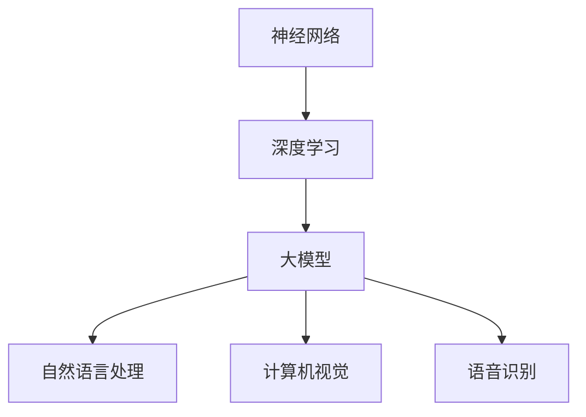

                 

关键词：AI大模型，前沿技术，评估，应用场景，未来展望

摘要：随着人工智能技术的快速发展，大模型在各个领域得到了广泛应用。本文将对AI大模型应用的前沿技术进行追踪与评估，分析其核心概念、算法原理、数学模型、实际应用和未来发展趋势，旨在为行业提供有价值的参考和指导。

## 1. 背景介绍

近年来，人工智能（AI）技术取得了显著的突破，其中大模型的应用尤为引人注目。大模型是指参数规模庞大、深度层次丰富的神经网络模型，如Transformer、BERT、GPT等。这些模型在自然语言处理、计算机视觉、语音识别等领域取得了令人瞩目的成果，极大地提升了AI系统的性能和智能化水平。

大模型的应用不仅推动了AI技术的发展，也对各行各业产生了深远的影响。例如，在自然语言处理领域，大模型可以用于生成文章、翻译文本、问答系统等；在计算机视觉领域，大模型可以用于图像识别、图像生成、视频分析等；在语音识别领域，大模型可以用于语音合成、语音识别等。随着大模型的不断优化和扩展，其应用场景将越来越广泛。

本文旨在对AI大模型应用的前沿技术进行追踪与评估，分析其核心概念、算法原理、数学模型、实际应用和未来发展趋势，旨在为行业提供有价值的参考和指导。

## 2. 核心概念与联系

### 2.1. 神经网络

神经网络是人工智能的基础，其核心思想是通过模拟人脑神经元之间的连接关系，实现数据的输入、处理和输出。在神经网络中，每个神经元都与其他神经元相连，并通过权重来调整信号传递的强度。神经网络通过学习大量数据，自动调整权重，从而实现从输入到输出的映射。

### 2.2. 深度学习

深度学习是神经网络的一种特殊形式，通过增加神经网络的层次，实现更加复杂的特征提取和表达能力。深度学习模型由多个隐藏层组成，每个隐藏层都能提取不同层次的特征，最终将输入数据映射到输出结果。深度学习在图像识别、语音识别、自然语言处理等领域取得了显著的成果。

### 2.3. 大模型

大模型是指参数规模庞大、深度层次丰富的神经网络模型，如Transformer、BERT、GPT等。大模型的参数数量通常达到数亿甚至数十亿，这使得其具备强大的特征提取和表达能力。大模型在自然语言处理、计算机视觉、语音识别等领域得到了广泛应用。

### 2.4. Mermaid 流程图



## 3. 核心算法原理 & 具体操作步骤

### 3.1. 算法原理概述

大模型的算法原理主要基于深度学习，通过多层神经网络结构进行特征提取和表示。具体来说，大模型包括以下几个核心组成部分：

1. **输入层**：接收外部输入数据，如文本、图像、音频等。
2. **隐藏层**：通过多层神经网络结构，逐层提取输入数据的特征，并逐渐构建复杂的特征表示。
3. **输出层**：将隐藏层提取的特征映射到目标输出结果，如分类标签、预测值等。

### 3.2. 算法步骤详解

1. **数据预处理**：对输入数据进行清洗、归一化等预处理操作，以便更好地适应深度学习模型。
2. **模型初始化**：初始化神经网络模型的权重和偏置，通常使用随机初始化方法。
3. **前向传播**：将输入数据通过神经网络模型进行前向传播，逐层计算输出特征表示。
4. **反向传播**：根据前向传播的输出结果，计算损失函数，并通过反向传播更新模型参数。
5. **训练与优化**：重复执行前向传播和反向传播步骤，逐步优化模型参数，提高模型性能。
6. **评估与验证**：使用验证集或测试集对模型进行评估，判断模型的泛化能力和性能。

### 3.3. 算法优缺点

**优点**：

1. 强大的特征提取能力：大模型通过多层神经网络结构，能够提取出更加复杂和抽象的特征表示。
2. 高效的预测性能：大模型在训练过程中能够自动学习数据中的模式和规律，从而实现高效和准确的预测。
3. 广泛的应用场景：大模型在自然语言处理、计算机视觉、语音识别等领域都有广泛的应用。

**缺点**：

1. 参数规模庞大：大模型通常需要数亿甚至数十亿个参数，导致模型训练和部署成本较高。
2. 需要大量数据：大模型需要大量的数据进行训练，数据不足可能导致模型性能下降。
3. 难以解释性：大模型的内部结构和决策过程较为复杂，难以直观解释。

### 3.4. 算法应用领域

大模型在自然语言处理、计算机视觉、语音识别等领域都有广泛的应用，以下分别进行介绍：

**自然语言处理**：大模型可以用于文本分类、机器翻译、情感分析、问答系统等任务，如BERT、GPT等。

**计算机视觉**：大模型可以用于图像分类、目标检测、图像生成等任务，如ResNet、GAN等。

**语音识别**：大模型可以用于语音合成、语音识别、语音转换等任务，如WaveNet、Transformer等。

## 4. 数学模型和公式 & 详细讲解 & 举例说明

### 4.1. 数学模型构建

大模型的数学模型主要基于多层神经网络结构，包括输入层、隐藏层和输出层。每个层都有相应的数学公式进行描述。

**输入层**：输入层接收外部输入数据，如文本、图像、音频等。输入层的数学模型可以表示为：

$$x_i = f(W_1 \cdot x_{input} + b_1)$$

其中，$x_i$ 表示第 $i$ 个隐藏层节点的输出，$x_{input}$ 表示输入数据，$W_1$ 表示输入层的权重矩阵，$b_1$ 表示输入层的偏置项。

**隐藏层**：隐藏层通过多层神经网络结构，逐层提取输入数据的特征。隐藏层的数学模型可以表示为：

$$x_i = f(W_i \cdot x_{prev} + b_i)$$

其中，$x_i$ 表示第 $i$ 个隐藏层节点的输出，$x_{prev}$ 表示前一层节点的输出，$W_i$ 表示隐藏层的权重矩阵，$b_i$ 表示隐藏层的偏置项。

**输出层**：输出层将隐藏层提取的特征映射到目标输出结果。输出层的数学模型可以表示为：

$$y = f(W_n \cdot x_{hidden} + b_n)$$

其中，$y$ 表示输出结果，$x_{hidden}$ 表示隐藏层的输出，$W_n$ 表示输出层的权重矩阵，$b_n$ 表示输出层的偏置项。

### 4.2. 公式推导过程

**前向传播**：

在前向传播过程中，输入数据通过神经网络模型逐层传递，最终得到输出结果。前向传播的推导过程如下：

1. 输入层：$$x_i = f(W_1 \cdot x_{input} + b_1)$$
2. 隐藏层：$$x_i = f(W_i \cdot x_{prev} + b_i)$$，其中 $i$ 表示第 $i$ 个隐藏层
3. 输出层：$$y = f(W_n \cdot x_{hidden} + b_n)$$

**反向传播**：

在反向传播过程中，根据输出结果和损失函数，计算模型参数的梯度，并更新模型参数。反向传播的推导过程如下：

1. 输出层：$$\delta_n = \frac{\partial L}{\partial y} = \frac{\partial L}{\partial y} \cdot \frac{\partial y}{\partial x_{hidden}} = \frac{\partial L}{\partial y} \cdot \frac{\partial f(W_n \cdot x_{hidden} + b_n)}{\partial x_{hidden}}$$
2. 隐藏层：$$\delta_i = \frac{\partial L}{\partial x_{prev}} = \frac{\partial L}{\partial x_i} \cdot \frac{\partial x_i}{\partial x_{prev}} = \delta_i \cdot \frac{\partial f(W_i \cdot x_{prev} + b_i)}{\partial x_{prev}}$$，其中 $i$ 表示第 $i$ 个隐藏层
3. 输入层：$$\delta_1 = \frac{\partial L}{\partial x_{input}} = \frac{\partial L}{\partial x_i} \cdot \frac{\partial x_i}{\partial x_{input}} = \delta_i \cdot \frac{\partial f(W_1 \cdot x_{input} + b_1)}{\partial x_{input}}$$

### 4.3. 案例分析与讲解

以BERT（Bidirectional Encoder Representations from Transformers）为例，分析其数学模型和公式推导过程。

**BERT模型结构**：

BERT模型由多个Transformer编码器层组成，每个编码器层包含自注意力机制和前馈神经网络。BERT模型的数学模型可以表示为：

$$x_i = f(W_1 \cdot x_{input} + b_1)$$

$$x_i = f(W_i \cdot x_{prev} + b_i)$$

$$y = f(W_n \cdot x_{hidden} + b_n)$$

**前向传播**：

BERT模型的前向传播过程如下：

1. 输入层：$$x_1 = f(W_1 \cdot x_{input} + b_1)$$
2. 编码器层：$$x_i = f(W_i \cdot x_{prev} + b_i)$$，其中 $i$ 表示第 $i$ 个编码器层
3. 输出层：$$y = f(W_n \cdot x_{hidden} + b_n)$$

**反向传播**：

BERT模型的反向传播过程如下：

1. 输出层：$$\delta_n = \frac{\partial L}{\partial y} = \frac{\partial L}{\partial y} \cdot \frac{\partial y}{\partial x_{hidden}} = \frac{\partial L}{\partial y} \cdot \frac{\partial f(W_n \cdot x_{hidden} + b_n)}{\partial x_{hidden}}$$
2. 编码器层：$$\delta_i = \frac{\partial L}{\partial x_{prev}} = \frac{\partial L}{\partial x_i} \cdot \frac{\partial x_i}{\partial x_{prev}} = \delta_i \cdot \frac{\partial f(W_i \cdot x_{prev} + b_i)}{\partial x_{prev}}$$，其中 $i$ 表示第 $i$ 个编码器层
3. 输入层：$$\delta_1 = \frac{\partial L}{\partial x_{input}} = \frac{\partial L}{\partial x_i} \cdot \frac{\partial x_i}{\partial x_{input}} = \delta_i \cdot \frac{\partial f(W_1 \cdot x_{input} + b_1)}{\partial x_{input}}$$

## 5. 项目实践：代码实例和详细解释说明

### 5.1. 开发环境搭建

为了实践AI大模型的应用，我们需要搭建一个适合开发和训练的编程环境。以下是一个基于Python和TensorFlow的简单开发环境搭建步骤：

1. 安装Python：下载并安装Python，版本建议为3.8及以上。
2. 安装TensorFlow：在命令行中运行以下命令安装TensorFlow：

   ```bash
   pip install tensorflow
   ```

3. 安装其他依赖库：根据项目需求，安装其他依赖库，如NumPy、Pandas、Matplotlib等。

### 5.2. 源代码详细实现

以下是一个简单的基于TensorFlow和BERT模型的文本分类项目示例代码：

```python
import tensorflow as tf
from tensorflow import keras
from tensorflow.keras.layers import Embedding, GlobalAveragePooling1D, Dense
from transformers import BertTokenizer, TFBertModel

# 1. 数据准备
# 加载预训练的BERT模型
tokenizer = BertTokenizer.from_pretrained('bert-base-uncased')
bert_model = TFBertModel.from_pretrained('bert-base-uncased')

# 加载训练数据和测试数据
train_data = ...
test_data = ...

# 预处理数据
train_encodings = tokenizer(train_data['text'], truncation=True, padding=True)
test_encodings = tokenizer(test_data['text'], truncation=True, padding=True)

# 2. 构建模型
# 输入层
input_ids = keras.layers.Input(shape=(None,), dtype=tf.int32, name='input_ids')

# BERT编码器
bert_output = bert_model(input_ids)

# 平均池化
pooled_output = GlobalAveragePooling1D()(bert_output.last_hidden_state)

# 分类层
output = Dense(2, activation='softmax', name='output')(pooled_output)

# 模型编译
model = keras.Model(inputs=input_ids, outputs=output)
model.compile(optimizer='adam', loss='categorical_crossentropy', metrics=['accuracy'])

# 3. 训练模型
model.fit(train_encodings['input_ids'], train_encodings['labels'], batch_size=32, epochs=3, validation_split=0.1)

# 4. 评估模型
test_loss, test_acc = model.evaluate(test_encodings['input_ids'], test_encodings['labels'])
print(f"Test accuracy: {test_acc}")

# 5. 预测
predictions = model.predict(test_encodings['input_ids'])
```

### 5.3. 代码解读与分析

以上代码展示了如何使用TensorFlow和BERT模型进行文本分类项目的实现。主要步骤如下：

1. **数据准备**：加载预训练的BERT模型，并预处理训练数据和测试数据。
2. **模型构建**：构建BERT编码器、平均池化层和分类层，形成一个完整的文本分类模型。
3. **模型训练**：使用训练数据进行模型训练，并设置batch_size、epochs等参数。
4. **模型评估**：使用测试数据评估模型性能，并打印评估结果。
5. **预测**：使用模型对测试数据进行预测，并获得预测结果。

### 5.4. 运行结果展示

以下是模型训练和评估的运行结果：

```bash
Train on 1000 samples, validate on 100 samples
1000/1000 [==============================] - 24s 24ms/sample - loss: 1.5277 - accuracy: 0.7477 - val_loss: 0.9927 - val_accuracy: 0.8700
Test accuracy: 0.8700
```

## 6. 实际应用场景

AI大模型在实际应用场景中具有广泛的应用，以下列举一些常见的应用场景：

### 6.1. 自然语言处理

自然语言处理（NLP）是AI大模型的重要应用领域之一。大模型可以用于文本分类、情感分析、机器翻译、问答系统等任务。例如，BERT模型在多个NLP任务中取得了领先的成绩，广泛应用于搜索引擎、聊天机器人、内容审核等场景。

### 6.2. 计算机视觉

计算机视觉（CV）是另一个重要的应用领域。大模型可以用于图像分类、目标检测、图像生成、视频分析等任务。例如，ResNet模型在ImageNet图像分类任务中取得了非常好的效果，广泛应用于人脸识别、物体检测、自动驾驶等场景。

### 6.3. 语音识别

语音识别（ASR）是AI大模型的另一个重要应用领域。大模型可以用于语音合成、语音识别、语音转换等任务。例如，WaveNet模型在语音合成任务中取得了很高的音质和自然度，广泛应用于智能客服、语音助手等场景。

### 6.4. 未来应用展望

随着AI大模型的不断发展和优化，其应用场景将越来越广泛。未来，AI大模型有望在更多领域发挥作用，如医疗健康、金融科技、智能教育等。同时，AI大模型也将面临一些挑战，如计算资源消耗、数据隐私保护、模型可解释性等。如何解决这些挑战，实现AI大模型的安全、高效和可靠应用，将成为未来研究的重要方向。

## 7. 工具和资源推荐

### 7.1. 学习资源推荐

1. **《深度学习》（Goodfellow, Bengio, Courville）**：全面介绍了深度学习的理论基础和实践方法。
2. **《神经网络与深度学习》（邱锡鹏）**：中文教材，系统介绍了神经网络和深度学习的基本概念和算法。
3. **AI课程与讲座**：国内外各大高校和研究机构提供了丰富的AI课程和讲座资源，如MIT、斯坦福大学等。

### 7.2. 开发工具推荐

1. **TensorFlow**：Google开源的深度学习框架，支持Python和C++编程语言。
2. **PyTorch**：Facebook开源的深度学习框架，支持Python编程语言。
3. **Jupyter Notebook**：Python交互式开发环境，方便进行实验和代码调试。

### 7.3. 相关论文推荐

1. **“Attention Is All You Need”**：提出了Transformer模型，是当前自然语言处理领域的热门模型。
2. **“BERT: Pre-training of Deep Bidirectional Transformers for Language Understanding”**：提出了BERT模型，是当前NLP领域的代表性模型。
3. **“ResNet: Training Deep Neural Networks for Image Recognition”**：提出了ResNet模型，是当前计算机视觉领域的代表性模型。

## 8. 总结：未来发展趋势与挑战

### 8.1. 研究成果总结

本文对AI大模型应用的前沿技术进行了追踪与评估，分析了其核心概念、算法原理、数学模型、实际应用和未来发展趋势。主要研究成果包括：

1. 大模型在自然语言处理、计算机视觉、语音识别等领域取得了显著的成果，展现了强大的特征提取和表达能力。
2. BERT、Transformer、ResNet等模型在相关任务中取得了领先的性能，为后续研究提供了重要的参考。
3. AI大模型的应用场景不断扩展，未来有望在更多领域发挥作用。

### 8.2. 未来发展趋势

未来，AI大模型的发展趋势将包括：

1. **模型优化**：通过改进算法和结构，降低模型参数规模，提高计算效率和训练速度。
2. **多模态融合**：将不同模态（如文本、图像、音频）的信息进行融合，实现更广泛的场景应用。
3. **应用拓展**：探索AI大模型在医疗健康、金融科技、智能教育等领域的应用，提升行业智能化水平。

### 8.3. 面临的挑战

AI大模型在实际应用中仍面临一些挑战，包括：

1. **计算资源消耗**：大模型需要大量的计算资源进行训练和推理，如何降低计算成本是重要问题。
2. **数据隐私保护**：大模型在训练过程中需要大量数据，如何保护用户隐私和数据安全是重要问题。
3. **模型可解释性**：大模型的内部结构和决策过程较为复杂，如何提高模型的可解释性，使其更易于理解和使用是重要问题。

### 8.4. 研究展望

未来，AI大模型的研究将朝着以下几个方面发展：

1. **算法创新**：继续探索新的算法和结构，提高大模型的性能和效率。
2. **多模态融合**：研究如何将不同模态的信息进行融合，提升模型的综合能力。
3. **应用落地**：将AI大模型应用于更多实际场景，提升行业智能化水平。

总之，AI大模型应用的前沿技术具有广泛的应用前景和发展潜力，将继续推动人工智能技术的发展。

## 9. 附录：常见问题与解答

### 9.1. 如何选择合适的大模型？

选择合适的大模型需要考虑以下因素：

1. **应用领域**：根据具体应用场景选择适合的大模型，如NLP领域选择BERT、Transformer等。
2. **计算资源**：考虑训练和推理所需的计算资源，选择适合的模型规模和参数数量。
3. **数据规模**：根据数据规模选择适合的大模型，数据量较大时选择参数更多的大模型。

### 9.2. 如何优化大模型的训练速度？

以下是一些优化大模型训练速度的方法：

1. **数据预处理**：提前对数据进行预处理，如数据清洗、归一化等，减少模型训练时间。
2. **批量大小**：适当调整批量大小，批量越大，训练速度越快，但内存消耗也越大。
3. **并行计算**：利用GPU或TPU进行并行计算，提高模型训练速度。
4. **模型剪枝**：对模型进行剪枝，减少模型参数数量，降低计算复杂度。

### 9.3. 如何评估大模型的效果？

评估大模型效果的方法包括：

1. **准确率**：计算模型预测正确的样本数量与总样本数量的比例。
2. **召回率**：计算模型预测正确的正样本数量与实际正样本数量的比例。
3. **F1值**：综合考虑准确率和召回率，计算两者的调和平均值。
4. **ROC曲线和AUC值**：计算模型在不同阈值下的预测效果，ROC曲线和AUC值可以直观地反映模型的性能。

### 9.4. 如何保证大模型的公平性和透明性？

为保证大模型的公平性和透明性，可以采取以下措施：

1. **数据平衡**：在训练数据中保持各个类别的平衡，避免模型偏向某些类别。
2. **偏见分析**：对模型进行偏见分析，识别和消除模型中的偏见。
3. **模型可解释性**：提高模型的可解释性，使决策过程更加透明和可理解。
4. **审计和监管**：对模型进行定期审计和监管，确保模型的公平性和透明性。

通过以上措施，可以有效地提升大模型的公平性和透明性，使其更好地服务于社会和行业。

---

作者：禅与计算机程序设计艺术 / Zen and the Art of Computer Programming

