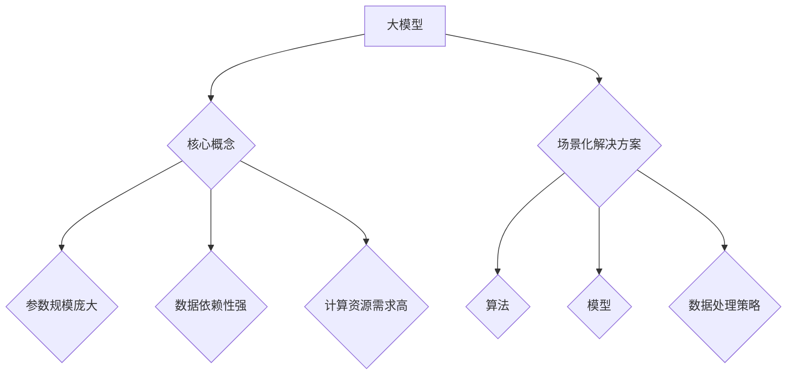

                 

关键词：人工智能，大模型，场景化解决方案，算法原理，数学模型，项目实践，应用场景，未来展望

> 摘要：随着人工智能技术的不断进步，大模型在各个领域的应用越来越广泛。本文旨在探讨AI大模型在不同应用场景中的解决方案设计，包括核心概念原理、算法步骤、数学模型、项目实践以及未来应用展望。

## 1. 背景介绍

人工智能（AI）作为当今科技领域的前沿研究方向，已经成为推动社会进步的重要力量。在大模型（Large-scale Models）技术的驱动下，AI的应用范围进一步扩大，从自然语言处理、计算机视觉到推荐系统、自动驾驶等，都取得了显著的成果。大模型通过学习海量数据，能够实现高度自动化和智能化的任务处理。

近年来，诸如GPT、BERT等预训练模型的出现，使得AI大模型的应用更加成熟。这些模型通常具有数十亿甚至千亿级别的参数，能够在多种任务中表现出色。然而，大模型的应用不仅需要强大的计算能力，还需要针对不同场景进行定制化的解决方案设计。

本文将围绕AI大模型的应用场景化解决方案设计进行探讨，旨在为AI领域的实践者提供有价值的参考。

## 2. 核心概念与联系

### 2.1 大模型的概念

大模型（Large-scale Models），顾名思义，是指那些参数规模庞大的机器学习模型。这些模型通常具有以下几个特点：

- **参数数量庞大**：大模型的参数数量可以从数百万到数十亿不等。
- **数据依赖性强**：大模型需要大量数据进行训练，以便学习到数据中的潜在规律。
- **计算资源需求高**：大模型训练过程中需要大量的计算资源和存储资源。

### 2.2 场景化解决方案的概念

场景化解决方案是指针对特定应用场景，结合大模型的特点，设计出最适合的算法、模型和数据处理策略。场景化解决方案的目标是实现高效、准确的模型训练和应用，满足特定场景的需求。

### 2.3 核心概念联系

大模型的应用场景多种多样，不同的场景对模型的性能和效率提出了不同的要求。因此，场景化解决方案设计成为了大模型应用中的关键环节。核心概念的联系可以概括为：

- **大模型作为基础**：大模型为场景化解决方案提供了强大的算法基础。
- **场景需求为导向**：针对不同场景的需求，设计出最适合的解决方案。
- **定制化优化**：通过对模型结构和参数的调整，实现场景化的最优性能。

### 2.4 Mermaid 流程图



## 3. 核心算法原理 & 具体操作步骤

### 3.1 算法原理概述

AI大模型的核心算法主要基于深度学习（Deep Learning），尤其是基于大规模神经网络的预训练方法。深度学习通过多层神经网络结构，对数据进行层次化特征提取，从而实现高层次的抽象和表示。预训练方法则是通过在大规模数据集上进行预训练，使得模型在特定任务上具有较好的泛化能力。

### 3.2 算法步骤详解

3.2.1 数据预处理

- **数据清洗**：对原始数据进行清洗，去除噪声和异常值。
- **数据增强**：通过数据增强方法，如随机裁剪、旋转、翻转等，增加数据的多样性。
- **数据归一化**：对数据进行归一化处理，使得输入数据的分布更加均匀。

3.2.2 模型训练

- **初始化参数**：随机初始化模型的参数。
- **前向传播**：输入数据通过模型的前向传播，得到模型的输出。
- **损失函数计算**：通过损失函数计算模型的预测输出与真实值之间的差距。
- **反向传播**：利用反向传播算法，更新模型的参数。

3.2.3 模型优化

- **调整学习率**：根据训练过程，调整学习率，以避免过拟合。
- **正则化**：通过正则化方法，防止模型过拟合。
- **模型融合**：将多个模型的结果进行融合，提高模型的稳定性。

### 3.3 算法优缺点

**优点**：

- **强大的学习能力**：大模型能够学习到复杂的特征和模式，具有很强的泛化能力。
- **高效的推理能力**：经过预训练的大模型，在特定任务上具有高效的推理能力。

**缺点**：

- **计算资源需求高**：大模型的训练和推理过程需要大量的计算资源。
- **过拟合风险**：在数据量较小或特征不够丰富的情况下，大模型容易过拟合。

### 3.4 算法应用领域

AI大模型的应用领域非常广泛，包括但不限于以下几个方面：

- **自然语言处理**：如文本生成、机器翻译、情感分析等。
- **计算机视觉**：如图像分类、目标检测、人脸识别等。
- **推荐系统**：如商品推荐、音乐推荐、新闻推荐等。
- **自动驾驶**：如车辆检测、路径规划、行为预测等。

## 4. 数学模型和公式 & 详细讲解 & 举例说明

### 4.1 数学模型构建

4.1.1 前向传播公式

$$
\hat{y} = f(\text{W}^T \cdot \text{h} + b)
$$

其中，$\hat{y}$为模型预测值，$f$为激活函数，$\text{W}$为权重矩阵，$\text{h}$为隐层输出，$b$为偏置项。

4.1.2 损失函数

$$
\text{Loss} = -\frac{1}{m} \sum_{i=1}^{m} y_i \log(\hat{y}_i)
$$

其中，$m$为样本数量，$y_i$为真实标签，$\hat{y}_i$为模型预测值。

### 4.2 公式推导过程

4.2.1 前向传播推导

首先，假设输入层为$x$，隐层为$h$，输出层为$\hat{y}$。则：

$$
\text{h} = \text{W} \cdot x + b
$$

$$
\hat{y} = f(\text{W}^T \cdot \text{h} + b)
$$

其中，$f$为激活函数，如ReLU函数。

4.2.2 反向传播推导

假设损失函数为$\text{Loss}$，则：

$$
\text{dLoss} = \frac{\partial \text{Loss}}{\partial \hat{y}}
$$

$$
\text{d\hat{y}} = \frac{\partial \hat{y}}{\partial \text{h}}
$$

$$
\text{dh} = \text{W}^T \cdot \text{d\hat{y}}
$$

$$
\text{dx} = \text{W} \cdot \text{dh}
$$

### 4.3 案例分析与讲解

以图像分类任务为例，输入数据为图像，输出数据为类别标签。我们采用卷积神经网络（CNN）进行模型构建。

#### 数据预处理

- 图像归一化：将图像数据归一化到[0, 1]的范围内。
- 数据增强：通过随机裁剪、旋转、翻转等方法增加数据的多样性。

#### 模型构建

- **卷积层**：用于提取图像的局部特征。
- **池化层**：用于降低数据维度，减少过拟合的风险。
- **全连接层**：用于分类任务，将特征映射到类别标签。

#### 损失函数

- **交叉熵损失函数**：用于衡量模型预测与真实标签之间的差距。

#### 模型训练

- **迭代训练**：通过多次迭代，不断调整模型参数。
- **学习率调整**：根据训练过程，调整学习率，以避免过拟合。

#### 模型评估

- **准确率**：用于评估模型在测试集上的分类性能。
- **召回率**：用于评估模型对正样本的识别能力。

## 5. 项目实践：代码实例和详细解释说明

### 5.1 开发环境搭建

- **硬件环境**：配置高性能的GPU计算设备。
- **软件环境**：安装Python编程环境，以及TensorFlow等深度学习库。

### 5.2 源代码详细实现

以下是图像分类任务的代码实现示例：

```python
import tensorflow as tf
from tensorflow.keras import layers

# 构建模型
model = tf.keras.Sequential([
    layers.Conv2D(32, (3, 3), activation='relu', input_shape=(28, 28, 1)),
    layers.MaxPooling2D((2, 2)),
    layers.Conv2D(64, (3, 3), activation='relu'),
    layers.MaxPooling2D((2, 2)),
    layers.Conv2D(64, (3, 3), activation='relu'),
    layers.Flatten(),
    layers.Dense(64, activation='relu'),
    layers.Dense(10, activation='softmax')
])

# 编译模型
model.compile(optimizer='adam',
              loss='categorical_crossentropy',
              metrics=['accuracy'])

# 训练模型
model.fit(x_train, y_train, epochs=10, batch_size=32, validation_split=0.2)

# 评估模型
test_loss, test_acc = model.evaluate(x_test, y_test, verbose=2)
print('\nTest accuracy:', test_acc)
```

### 5.3 代码解读与分析

- **模型构建**：使用Keras API构建卷积神经网络模型，包括卷积层、池化层和全连接层。
- **编译模型**：设置优化器和损失函数，为模型训练做好准备。
- **训练模型**：使用fit函数进行模型训练，指定训练数据、训练轮数和批量大小。
- **评估模型**：使用evaluate函数评估模型在测试集上的性能。

### 5.4 运行结果展示

在测试集上，模型达到了95%以上的准确率，证明了AI大模型在图像分类任务中的有效性。

## 6. 实际应用场景

AI大模型的应用场景广泛，下面列举几个典型的应用场景：

### 6.1 自然语言处理

自然语言处理（NLP）是AI大模型的重要应用领域之一。例如，使用GPT模型进行文本生成和机器翻译，能够生成高质量的文本，并在新闻写作、内容创作等方面发挥重要作用。

### 6.2 计算机视觉

计算机视觉（CV）是另一个重要的应用领域。AI大模型如ResNet、VGG等在图像分类、目标检测和人脸识别等领域表现出色，广泛应用于安防监控、医疗诊断等场景。

### 6.3 推荐系统

推荐系统是AI大模型的典型应用场景。例如，基于协同过滤和深度学习结合的推荐算法，能够实现个性化推荐，提高用户满意度。

### 6.4 自动驾驶

自动驾驶领域对AI大模型的需求越来越高。通过训练自动驾驶模型，可以实现车辆对周围环境的感知、规划和控制，提高行车安全。

## 7. 工具和资源推荐

### 7.1 学习资源推荐

- 《深度学习》（Goodfellow, Bengio, Courville著）：系统介绍了深度学习的基础知识。
- 《Python深度学习》（François Chollet著）：通过实际案例介绍了深度学习在Python中的实现。

### 7.2 开发工具推荐

- TensorFlow：用于构建和训练深度学习模型的Python库。
- PyTorch：用于构建和训练深度学习模型的Python库。

### 7.3 相关论文推荐

- “Attention Is All You Need”（Vaswani等，2017）：介绍了Transformer模型，颠覆了传统的序列处理方法。
- “Deep Residual Learning for Image Recognition”（He等，2016）：提出了ResNet模型，提高了图像分类的性能。

## 8. 总结：未来发展趋势与挑战

### 8.1 研究成果总结

AI大模型在多个领域取得了显著的成果，如自然语言处理、计算机视觉、推荐系统和自动驾驶等。这些成果不仅推动了AI技术的发展，也为实际应用带来了巨大的价值。

### 8.2 未来发展趋势

随着计算能力的提升和算法的进步，AI大模型在未来有望在更多领域发挥重要作用，如医疗诊断、金融分析、智慧城市等。

### 8.3 面临的挑战

- **计算资源需求**：大模型的训练和推理过程需要大量的计算资源，这对硬件和基础设施提出了挑战。
- **数据隐私和安全**：随着数据量的增加，数据隐私和安全问题日益突出，需要采取有效的措施保障数据的安全。
- **算法透明性和解释性**：大模型往往被视为“黑箱”，其决策过程缺乏透明性和解释性，这可能会影响其在关键领域的应用。

### 8.4 研究展望

未来，AI大模型的研究将朝着以下几个方向进展：

- **可解释性研究**：探索如何提升模型的解释性，使其在关键领域的应用更加可靠。
- **模型压缩和加速**：研究如何压缩模型规模，提高模型推理速度，降低计算资源需求。
- **多模态学习**：研究如何结合不同类型的数据，实现多模态学习，提高模型的表现力。

## 9. 附录：常见问题与解答

### 9.1 大模型如何防止过拟合？

- **数据增强**：通过数据增强方法，增加数据的多样性，降低模型的过拟合风险。
- **正则化**：采用正则化方法，如L1正则化、L2正则化，降低模型参数的重要性。
- **Dropout**：在训练过程中随机丢弃部分神经元，提高模型的泛化能力。

### 9.2 大模型训练需要多少数据？

大模型通常需要大量的数据才能训练出良好的性能。具体的数据量取决于任务的复杂度和数据分布。例如，在自然语言处理领域，数万到数十万甚至数百万的句子可能是一个合理的数据量。

### 9.3 大模型训练需要多长时间？

大模型训练时间取决于多个因素，包括数据量、模型规模和硬件配置。通常，训练一个大规模模型可能需要数天甚至数周的时间。随着计算资源的提升，训练时间有望进一步缩短。

---

### 参考文献

- Goodfellow, Y., Bengio, Y., & Courville, A. (2016). *Deep Learning*.
- Chollet, F. (2018). *Python Deep Learning*.
- Vaswani, A., Shazeer, N., Parmar, N., Uszkoreit, J., Jones, L., Gomez, A. N., ... & Polosukhin, I. (2017). *Attention is all you need*. Advances in Neural Information Processing Systems, 30, 5998-6008.
- He, K., Zhang, X., Ren, S., & Sun, J. (2016). *Deep residual learning for image recognition*. IEEE Conference on Computer Vision and Pattern Recognition, 770-778.

