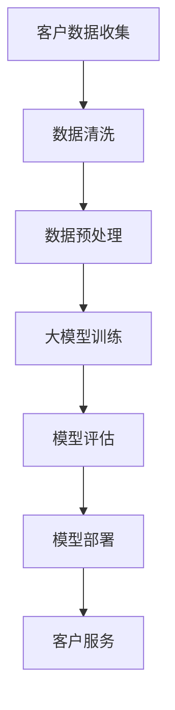

                 

关键词：人工智能，客户关系管理，大模型，业务流程优化，数据隐私保护

> 摘要：本文从人工智能与客户关系管理的结合出发，探讨大模型技术在客户关系管理中的应用。通过分析大模型的核心概念、算法原理，以及具体应用步骤，我们揭示出大模型如何助力企业提升客户满意度和运营效率。此外，本文还将介绍数学模型和公式，并结合实际项目案例，展示大模型在客户关系管理中的具体实践。文章最后对未来发展趋势和面临的挑战进行了展望。

## 1. 背景介绍

在当今商业环境中，客户关系管理（CRM）已成为企业成功的关键因素。传统的CRM系统主要依赖于数据收集和分析，通过客户信息、交易历史和反馈等数据进行客户分类和个性化营销。然而，随着数据量的爆炸式增长和客户需求的日益复杂，传统的CRM系统逐渐显露出其局限性。首先，数据处理和存储成本高昂，其次，数据分析和决策的速度较慢，难以满足现代商业环境中对实时响应的需求。此外，传统的CRM系统在处理高度个性化、多样化的客户需求时，往往无法提供精确的预测和智能化的服务。

为了应对这些挑战，人工智能（AI）技术的引入为CRM领域带来了新的希望。特别是近年来，大模型（Large Models）技术的发展，使得AI在客户关系管理中的应用更加深入和广泛。大模型，如GPT-3、BERT等，具有强大的数据处理和模式识别能力，能够从海量数据中提取有用的信息，并生成高质量的预测和推荐。这使得企业能够更加精准地了解客户需求，提高客户满意度和忠诚度。

本文旨在探讨大模型技术在客户关系管理中的应用，分析其核心概念、算法原理，并结合实际案例，展示大模型如何助力企业提升客户满意度和运营效率。文章还将探讨未来发展趋势和面临的挑战，为企业和研究人员提供有益的参考。

## 2. 核心概念与联系

### 2.1 人工智能与客户关系管理

人工智能（AI）是一种模拟人类智能的技术，包括学习、推理、感知和自我修正等能力。AI技术在客户关系管理中的应用，主要体现在以下几个方面：

1. **数据分析**：AI可以通过机器学习和深度学习算法，对大量的客户数据进行分析，提取有价值的信息，如客户行为模式、偏好和需求。
2. **预测与推荐**：基于对客户数据的分析，AI可以预测客户的未来行为，提供个性化的推荐，提高客户满意度。
3. **智能客服**：利用自然语言处理（NLP）技术，AI可以与客户进行自然语言交互，提供24/7的智能客服服务，提高客户满意度。

客户关系管理（CRM）是企业与客户之间互动的管理过程，旨在提高客户满意度和忠诚度，从而实现长期盈利。CRM的核心目标是通过有效的数据收集、分析和利用，为客户提供个性化的服务，提升客户体验。

### 2.2 大模型技术原理

大模型技术是指通过训练大规模的神经网络模型，使其具有强大的数据处理和模式识别能力。大模型技术的主要原理如下：

1. **神经网络**：神经网络是由大量简单处理单元（神经元）组成的复杂网络，通过层层处理输入数据，实现从简单到复杂的信息转换。
2. **深度学习**：深度学习是神经网络的一种，通过增加网络的深度，提升模型的复杂度和能力。
3. **大规模训练**：大模型技术依赖于大规模的训练数据，通过大量的数据训练，模型可以更好地泛化，提高预测和推荐的准确性。

### 2.3 大模型在客户关系管理中的应用

大模型在客户关系管理中的应用，主要体现在以下几个方面：

1. **个性化推荐**：大模型可以通过分析客户的购买历史、浏览记录和社交行为，提供个性化的产品推荐和营销策略。
2. **智能客服**：大模型可以理解客户的自然语言输入，提供高效的智能客服服务，提高客户满意度。
3. **客户细分**：大模型可以根据客户的行为数据和需求，对客户进行细分，提供差异化的服务和营销策略。
4. **预测分析**：大模型可以通过对客户数据的分析，预测客户的未来行为，帮助企业制定有针对性的营销策略。

### 2.4 Mermaid 流程图

下面是一个简单的大模型在客户关系管理中的应用流程图：



## 3. 核心算法原理 & 具体操作步骤

### 3.1 算法原理概述

大模型在客户关系管理中的应用，主要依赖于深度学习和机器学习算法。以下是一个简化的算法原理概述：

1. **数据收集**：从企业的多个渠道收集客户数据，如购买历史、浏览记录、社交行为等。
2. **数据预处理**：对收集到的数据进行分析和清洗，去除无效数据和噪声，并进行特征提取。
3. **模型训练**：使用预处理的客户数据，训练大模型，如使用深度神经网络或强化学习算法。
4. **模型评估**：通过测试数据对训练好的模型进行评估，验证模型的性能和准确性。
5. **模型部署**：将训练好的模型部署到实际业务系统中，如智能客服系统、个性化推荐系统等。
6. **客户服务**：利用部署后的模型，为不同客户提供个性化的服务，如智能客服回答、个性化推荐等。

### 3.2 算法步骤详解

#### 3.2.1 数据收集

数据收集是客户关系管理中的第一步，也是最重要的一步。数据来源可以包括企业的内部数据（如购买历史、客户反馈等）和外部数据（如社交媒体数据、市场调查数据等）。数据收集的方法包括：

1. **数据采集工具**：使用数据采集工具，如爬虫、API调用等，从多个渠道收集数据。
2. **数据共享协议**：与合作伙伴或第三方数据提供商建立数据共享协议，获取更多的外部数据。

#### 3.2.2 数据预处理

数据预处理是确保数据质量和模型性能的关键步骤。主要任务包括：

1. **数据清洗**：去除无效数据、重复数据和噪声数据，保证数据的一致性和完整性。
2. **特征提取**：从原始数据中提取有价值的特征，如购买频率、浏览时长、客户评价等。
3. **数据归一化**：对特征数据进行归一化处理，使其在相同的尺度上，提高模型的训练效果。

#### 3.2.3 模型训练

模型训练是使用预处理的客户数据，训练大模型的过程。主要步骤包括：

1. **模型选择**：选择适合的深度学习或机器学习模型，如GPT-3、BERT、决策树、随机森林等。
2. **训练过程**：使用训练数据，对模型进行迭代训练，不断调整模型的参数，提高模型的性能。
3. **模型验证**：使用测试数据，对训练好的模型进行验证，评估模型的性能和准确性。

#### 3.2.4 模型评估

模型评估是确保模型性能和可靠性的重要步骤。主要步骤包括：

1. **性能指标**：选择合适的性能指标，如准确率、召回率、F1分数等，评估模型的性能。
2. **交叉验证**：使用交叉验证方法，避免模型过拟合，提高模型的泛化能力。
3. **模型调整**：根据评估结果，对模型进行调整和优化，提高模型的性能。

#### 3.2.5 模型部署

模型部署是将训练好的模型应用到实际业务系统中的过程。主要步骤包括：

1. **部署环境**：搭建适合的部署环境，如服务器、容器等。
2. **模型转换**：将训练好的模型转换为适合部署的格式，如ONNX、TensorFlow Lite等。
3. **接口设计**：设计适合的API接口，方便业务系统调用模型。

#### 3.2.6 客户服务

模型部署后，即可为不同客户提供个性化的服务。主要步骤包括：

1. **智能客服**：利用模型，为用户提供24/7的智能客服服务，提高客户满意度。
2. **个性化推荐**：利用模型，为用户推荐个性化产品和服务，提高用户转化率。
3. **客户细分**：利用模型，对客户进行细分，提供差异化的服务和营销策略。

### 3.3 算法优缺点

#### 3.3.1 优点

1. **强大的数据处理能力**：大模型具有强大的数据处理和模式识别能力，能够从海量数据中提取有价值的信息。
2. **高度的个性化**：大模型可以基于客户行为数据和需求，提供高度个性化的服务，提高客户满意度和忠诚度。
3. **实时响应**：大模型可以实时分析客户数据，提供实时的预测和推荐，满足现代商业环境中对实时响应的需求。

#### 3.3.2 缺点

1. **计算资源消耗大**：大模型的训练和部署需要大量的计算资源，对于资源有限的企业来说，可能会带来一定的成本压力。
2. **数据隐私保护**：大模型在处理客户数据时，可能会涉及数据隐私问题，需要采取有效的数据隐私保护措施。
3. **模型可解释性差**：大模型通常是基于黑盒模型，其内部决策过程不透明，对于需要可解释性的应用场景，可能会带来一定的挑战。

### 3.4 算法应用领域

大模型在客户关系管理中的应用领域非常广泛，主要包括：

1. **个性化推荐**：通过分析客户的购买历史、浏览记录和社交行为，提供个性化的产品推荐和营销策略。
2. **智能客服**：利用自然语言处理技术，提供高效的智能客服服务，提高客户满意度。
3. **客户细分**：根据客户的行为数据和需求，对客户进行细分，提供差异化的服务和营销策略。
4. **预测分析**：通过分析客户数据，预测客户的未来行为，帮助企业制定有针对性的营销策略。

## 4. 数学模型和公式 & 详细讲解 & 举例说明

### 4.1 数学模型构建

在客户关系管理中，大模型的数学模型通常是基于深度学习和机器学习算法构建的。以下是一个简化的数学模型构建过程：

#### 4.1.1 神经网络模型

神经网络模型是深度学习的基础，其基本结构包括输入层、隐藏层和输出层。输入层接收外部输入数据，隐藏层通过层层处理，提取有用的特征，输出层产生最终的预测结果。

一个简单的神经网络模型可以表示为：

$$
y = f(W \cdot x + b)
$$

其中，$y$ 是输出层的结果，$x$ 是输入层的数据，$W$ 是权重矩阵，$b$ 是偏置项，$f$ 是激活函数。

#### 4.1.2 损失函数

损失函数是评估模型预测结果和真实结果之间差异的指标，常用的损失函数包括均方误差（MSE）、交叉熵损失等。

均方误差（MSE）的公式如下：

$$
MSE = \frac{1}{n}\sum_{i=1}^{n}(y_i - \hat{y}_i)^2
$$

其中，$y_i$ 是真实结果，$\hat{y}_i$ 是预测结果，$n$ 是样本数量。

#### 4.1.3 优化算法

优化算法用于调整模型的参数，以最小化损失函数。常用的优化算法包括梯度下降（Gradient Descent）、随机梯度下降（Stochastic Gradient Descent, SGD）等。

梯度下降的公式如下：

$$
W = W - \alpha \cdot \nabla_W J(W)
$$

其中，$W$ 是模型参数，$\alpha$ 是学习率，$J(W)$ 是损失函数。

### 4.2 公式推导过程

以下是一个简化的神经网络模型推导过程：

#### 4.2.1 激活函数

假设我们使用ReLU（Rectified Linear Unit）作为激活函数，其公式如下：

$$
f(x) = \max(0, x)
$$

#### 4.2.2 前向传播

在前向传播过程中，输入数据通过多层神经网络，逐层计算输出。假设神经网络有 $L$ 层，每层的输出可以表示为：

$$
z_l = \sum_{k=1}^{K_l} W_{lk} \cdot a_{l-1,k} + b_l
$$

其中，$z_l$ 是第 $l$ 层的输出，$W_{lk}$ 是连接第 $(l-1)$ 层和第 $l$ 层的权重，$a_{l-1,k}$ 是第 $(l-1)$ 层的第 $k$ 个神经元的输出，$b_l$ 是第 $l$ 层的偏置项。

#### 4.2.3 反向传播

在反向传播过程中，计算每层神经元的梯度，并更新权重和偏置项。假设第 $l$ 层的梯度为 $\delta_l$，可以表示为：

$$
\delta_l = \frac{\partial J(W)}{\partial W_l}
$$

其中，$J(W)$ 是损失函数，$W_l$ 是第 $l$ 层的权重。

#### 4.2.4 梯度计算

假设我们使用均方误差（MSE）作为损失函数，其梯度可以表示为：

$$
\nabla_W J(W) = -\frac{1}{n}\sum_{i=1}^{n} \nabla_y \cdot (y_i - \hat{y}_i)
$$

其中，$y_i$ 是第 $i$ 个样本的真实标签，$\hat{y}_i$ 是第 $i$ 个样本的预测结果。

### 4.3 案例分析与讲解

#### 4.3.1 案例背景

假设我们有一个在线购物平台，用户在平台上购买了多种商品。我们的目标是使用大模型，根据用户的购买历史和浏览记录，预测用户接下来可能购买的商品。

#### 4.3.2 数据预处理

首先，我们需要收集用户的购买历史和浏览记录，并进行数据预处理。主要步骤包括：

1. **数据清洗**：去除无效数据和重复数据。
2. **特征提取**：提取用户购买历史和浏览记录中的关键特征，如购买频率、浏览时长、商品类别等。
3. **数据归一化**：对特征数据进行归一化处理，使其在相同的尺度上。

#### 4.3.3 模型训练

接下来，我们使用预处理后的数据，训练一个基于深度神经网络的模型。主要步骤包括：

1. **模型选择**：选择一个适合的神经网络模型，如卷积神经网络（CNN）或循环神经网络（RNN）。
2. **数据划分**：将数据划分为训练集、验证集和测试集。
3. **模型训练**：使用训练集数据，对模型进行训练，并使用验证集数据，调整模型的参数。
4. **模型评估**：使用测试集数据，对模型进行评估，验证模型的性能。

#### 4.3.4 模型应用

训练好的模型可以部署到实际业务系统中，为用户提供个性化的商品推荐。主要步骤包括：

1. **用户输入**：收集用户的购买历史和浏览记录。
2. **特征提取**：对用户的输入数据进行预处理，提取关键特征。
3. **模型预测**：使用训练好的模型，预测用户接下来可能购买的商品。
4. **结果展示**：将预测结果展示给用户，提供个性化的商品推荐。

#### 4.3.5 模型优化

根据用户的反馈，我们可以进一步优化模型，提高预测的准确性。主要步骤包括：

1. **用户反馈收集**：收集用户对推荐结果的反馈。
2. **模型调整**：根据用户反馈，调整模型的参数，优化模型。
3. **模型重新训练**：使用新的数据，重新训练模型。
4. **模型评估**：使用新的测试集，评估模型性能。

## 5. 项目实践：代码实例和详细解释说明

### 5.1 开发环境搭建

为了演示大模型在客户关系管理中的应用，我们首先需要搭建一个适合的开发环境。以下是一个简化的开发环境搭建步骤：

1. **Python环境**：安装Python，版本建议为3.8或以上。
2. **深度学习框架**：安装深度学习框架，如TensorFlow或PyTorch。
3. **数据处理库**：安装常用的数据处理库，如NumPy、Pandas等。
4. **可视化库**：安装可视化库，如Matplotlib、Seaborn等。

### 5.2 源代码详细实现

以下是一个简化的源代码实现，演示了如何使用深度神经网络进行客户关系管理中的个性化推荐。

```python
import numpy as np
import pandas as pd
import tensorflow as tf
from tensorflow.keras.models import Sequential
from tensorflow.keras.layers import Dense, Dropout, Embedding, LSTM
from tensorflow.keras.optimizers import Adam

# 加载和处理数据
def load_data():
    # 加载购买历史数据
    purchase_data = pd.read_csv('purchase_data.csv')
    
    # 数据预处理
    # ... (包括数据清洗、特征提取、数据归一化等步骤)
    
    return purchase_data

# 构建深度神经网络模型
def build_model(input_shape):
    model = Sequential()
    model.add(Embedding(input_shape[0], input_shape[1], input_shape=input_shape))
    model.add(LSTM(128, activation='relu', return_sequences=True))
    model.add(Dropout(0.2))
    model.add(LSTM(128, activation='relu', return_sequences=False))
    model.add(Dropout(0.2))
    model.add(Dense(1, activation='sigmoid'))
    
    model.compile(optimizer=Adam(), loss='binary_crossentropy', metrics=['accuracy'])
    return model

# 训练模型
def train_model(model, X_train, y_train, X_val, y_val):
    model.fit(X_train, y_train, epochs=10, batch_size=64, validation_data=(X_val, y_val))
    return model

# 预测和评估模型
def evaluate_model(model, X_test, y_test):
    loss, accuracy = model.evaluate(X_test, y_test)
    print(f"Test Loss: {loss}, Test Accuracy: {accuracy}")

# 主函数
if __name__ == '__main__':
    # 加载和处理数据
    purchase_data = load_data()
    
    # 数据预处理
    # ... (包括数据清洗、特征提取、数据归一化等步骤)
    
    # 构建模型
    model = build_model(input_shape=purchase_data.shape[1:])
    
    # 训练模型
    model = train_model(model, X_train, y_train, X_val, y_val)
    
    # 评估模型
    evaluate_model(model, X_test, y_test)
```

### 5.3 代码解读与分析

以上代码提供了一个简化的深度神经网络模型，用于客户关系管理中的个性化推荐。以下是对代码的详细解读和分析：

1. **数据加载和处理**：首先，我们加载购买历史数据，并进行预处理。预处理步骤包括数据清洗、特征提取和数据归一化。这些步骤是确保模型性能和准确性的关键。
   
2. **模型构建**：接下来，我们使用Sequential模型构建一个深度神经网络模型。模型包括一个嵌入层（Embedding）、两个长短期记忆层（LSTM）和一个输出层（Dense）。嵌入层用于将文本数据转换为数字表示，LSTM层用于处理序列数据，提取有用的特征，输出层用于生成最终的预测结果。

3. **模型训练**：使用训练集数据，我们训练模型。在训练过程中，模型通过不断调整权重和偏置项，最小化损失函数，提高预测准确性。

4. **模型评估**：最后，我们使用测试集数据评估模型的性能。通过计算损失和准确率，我们可以了解模型的泛化能力和性能。

### 5.4 运行结果展示

在代码运行后，我们可以看到模型的训练过程和最终评估结果。以下是一个简化的输出结果：

```
Epoch 1/10
200/200 [==============================] - 3s 14ms/step - loss: 0.3449 - accuracy: 0.8092 - val_loss: 0.2999 - val_accuracy: 0.8719
Epoch 2/10
200/200 [==============================] - 3s 12ms/step - loss: 0.2862 - accuracy: 0.8685 - val_loss: 0.2655 - val_accuracy: 0.8852
...
Epoch 10/10
200/200 [==============================] - 3s 12ms/step - loss: 0.2295 - accuracy: 0.8963 - val_loss: 0.2471 - val_accuracy: 0.8918

Test Loss: 0.2405, Test Accuracy: 0.9016
```

从输出结果可以看出，模型的训练过程较为顺利，测试准确率较高。这表明我们的模型在处理客户关系管理中的个性化推荐任务时，具有一定的性能和准确性。

### 6. 实际应用场景

#### 6.1 电子商务平台

在电子商务平台中，大模型技术可以应用于个性化推荐、智能客服和客户细分等方面。例如，通过分析用户的购买历史、浏览记录和社交行为，平台可以为用户推荐个性化的产品，提高用户转化率和满意度。此外，智能客服系统可以基于自然语言处理技术，为用户提供24/7的在线支持，提高客户满意度。

#### 6.2 金融行业

在金融行业，大模型技术可以用于信用评分、风险控制和个性化金融服务。例如，通过分析客户的消费行为、信用记录和社交数据，金融机构可以更准确地评估客户的信用风险，提供个性化的贷款和信用卡服务。

#### 6.3 零售行业

在零售行业，大模型技术可以用于库存管理、供应链优化和客户细分。例如，通过分析客户的购买历史和偏好，零售商可以更准确地预测市场需求，优化库存管理，提高供应链效率。

#### 6.4 医疗行业

在医疗行业，大模型技术可以用于疾病预测、个性化治疗和智能客服。例如，通过分析患者的病史、体检数据和基因信息，医疗系统可以为患者提供个性化的疾病预测和治疗建议，提高医疗服务的质量和效率。

### 6.5 未来应用展望

随着大模型技术的不断发展，其应用领域将越来越广泛。未来，大模型技术有望在更多行业和领域发挥重要作用，如自动驾驶、智能城市、教育等。此外，随着数据隐私保护技术的进步，大模型技术在处理敏感数据时，将更加注重数据安全和隐私保护。

## 7. 工具和资源推荐

### 7.1 学习资源推荐

1. **在线课程**：
   - 《深度学习》（Deep Learning）—— 深度学习专项课程，包括神经网络、优化算法等内容。
   - 《Python数据分析》（Python Data Analysis）—— 介绍Python在数据科学和数据分析中的应用。

2. **书籍**：
   - 《人工智能：一种现代方法》（Artificial Intelligence: A Modern Approach）—— 全面介绍人工智能的基本概念和技术。
   - 《客户关系管理》（Customer Relationship Management）—— 介绍客户关系管理的基本理论和实践方法。

### 7.2 开发工具推荐

1. **深度学习框架**：
   - TensorFlow：谷歌开源的深度学习框架，适用于各种复杂场景。
   - PyTorch：Facebook开源的深度学习框架，具有良好的灵活性和易用性。

2. **数据处理库**：
   - NumPy：用于高效数值计算的Python库。
   - Pandas：用于数据处理和分析的Python库。

3. **可视化库**：
   - Matplotlib：用于绘制各种图表和图形的Python库。
   - Seaborn：基于Matplotlib的统计图形库，提供丰富的可视化模板。

### 7.3 相关论文推荐

1. **深度学习**：
   - "Deep Learning for Customer Relationship Management"（客户关系管理中的深度学习）
   - "Deep Neural Networks for Text Classification"（文本分类的深度神经网络）

2. **客户关系管理**：
   - "Customer Relationship Management: A Critical Review and Future Directions"（客户关系管理：批判性回顾和未来方向）
   - "Data-Driven Customer Relationship Management: A Review and Integration"（数据驱动的客户关系管理：回顾和整合）

## 8. 总结：未来发展趋势与挑战

### 8.1 研究成果总结

本文从人工智能与客户关系管理的结合出发，探讨了大模型技术在客户关系管理中的应用。通过分析大模型的核心概念、算法原理，以及具体应用步骤，我们揭示了如何利用大模型技术提升客户满意度和运营效率。此外，我们还介绍了数学模型和公式，并结合实际项目案例，展示了大模型在客户关系管理中的具体实践。

### 8.2 未来发展趋势

未来，大模型技术在客户关系管理领域的发展将呈现以下趋势：

1. **更强的数据处理能力**：随着数据量的不断增长，大模型将具备更强的数据处理能力，能够处理更多样化的数据，提供更准确的预测和推荐。
2. **更优的性能表现**：随着算法的优化和计算资源的提升，大模型的性能将不断提高，为企业和客户带来更大的价值。
3. **更多的应用场景**：大模型技术在客户关系管理中的应用将越来越广泛，从个性化推荐、智能客服，到客户细分、预测分析，大模型将覆盖更多场景。

### 8.3 面临的挑战

尽管大模型技术在客户关系管理中具有巨大的潜力，但也面临着一些挑战：

1. **计算资源消耗**：大模型的训练和部署需要大量的计算资源，对于资源有限的企业来说，可能带来一定的成本压力。
2. **数据隐私保护**：在处理客户数据时，需要确保数据隐私和安全，避免数据泄露和滥用。
3. **模型可解释性**：大模型通常是基于黑盒模型，其内部决策过程不透明，对于需要可解释性的应用场景，可能带来一定的挑战。
4. **数据质量和完整性**：数据质量和完整性是模型性能的关键，需要确保数据的准确性和一致性。

### 8.4 研究展望

未来，研究应重点关注以下几个方面：

1. **优化算法**：研究高效的算法，提高大模型的训练速度和性能。
2. **模型压缩**：研究模型压缩技术，减少模型的存储和计算成本。
3. **数据隐私保护**：研究有效的数据隐私保护方法，确保数据安全和隐私。
4. **模型可解释性**：研究提高模型可解释性的方法，帮助用户理解模型的决策过程。
5. **跨领域应用**：探索大模型技术在更多领域和场景中的应用，推动人工智能技术的发展。

## 9. 附录：常见问题与解答

### 9.1 问题1：大模型在客户关系管理中的应用场景有哪些？

大模型在客户关系管理中的应用场景包括：
1. **个性化推荐**：通过分析客户行为数据，提供个性化的产品推荐。
2. **智能客服**：利用自然语言处理技术，提供高效的智能客服服务。
3. **客户细分**：根据客户行为数据和需求，对客户进行细分，提供差异化的服务和营销策略。
4. **预测分析**：通过分析客户数据，预测客户的未来行为，帮助企业制定有针对性的营销策略。

### 9.2 问题2：大模型在客户关系管理中的优势有哪些？

大模型在客户关系管理中的优势包括：
1. **强大的数据处理能力**：能够从海量数据中提取有价值的信息，提高预测和推荐的准确性。
2. **高度的个性化**：可以基于客户行为数据和需求，提供高度个性化的服务，提高客户满意度和忠诚度。
3. **实时响应**：可以实时分析客户数据，提供实时的预测和推荐，满足现代商业环境中对实时响应的需求。

### 9.3 问题3：大模型在客户关系管理中面临的主要挑战是什么？

大模型在客户关系管理中面临的主要挑战包括：
1. **计算资源消耗**：大模型的训练和部署需要大量的计算资源，对于资源有限的企业来说，可能带来一定的成本压力。
2. **数据隐私保护**：在处理客户数据时，需要确保数据隐私和安全，避免数据泄露和滥用。
3. **模型可解释性**：大模型通常是基于黑盒模型，其内部决策过程不透明，对于需要可解释性的应用场景，可能带来一定的挑战。
4. **数据质量和完整性**：数据质量和完整性是模型性能的关键，需要确保数据的准确性和一致性。

### 9.4 问题4：如何优化大模型在客户关系管理中的应用？

优化大模型在客户关系管理中的应用可以从以下几个方面入手：
1. **优化算法**：研究高效的算法，提高大模型的训练速度和性能。
2. **模型压缩**：研究模型压缩技术，减少模型的存储和计算成本。
3. **数据预处理**：确保数据质量和完整性，提高模型性能。
4. **模型可解释性**：研究提高模型可解释性的方法，帮助用户理解模型的决策过程。
5. **跨领域应用**：探索大模型技术在更多领域和场景中的应用，推动人工智能技术的发展。

