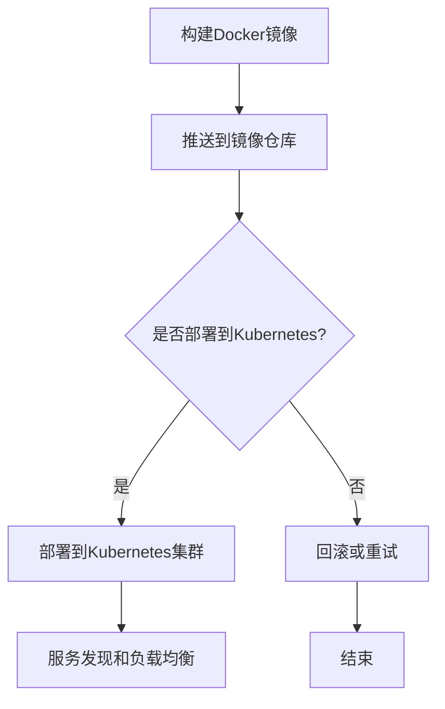

                 

在当今快速发展的AI领域，大型AI模型的应用越来越广泛，从自然语言处理到图像识别，再到推荐系统，AI大模型都在不断推动技术进步。然而，这些模型的部署和运维挑战也日益凸显。本文将探讨如何通过容器化技术来简化AI大模型的部署过程，提高其可移植性和可靠性。

## 关键词

- AI大模型
- 容器化
- 部署方案
- Kubernetes
- Docker
- DevOps

## 摘要

本文将介绍AI大模型应用的容器化部署方案，首先阐述AI大模型的背景和挑战，然后介绍容器化技术的优势和常用工具，接着详细描述部署流程和关键步骤，最后讨论未来应用前景和潜在挑战。

## 1. 背景介绍

### AI大模型的发展

近年来，AI大模型如BERT、GPT-3和AlphaFold等取得了显著的成果，它们在处理复杂数据和任务时展现出强大的能力。然而，这些模型往往需要大量的计算资源和时间来训练和部署，使得传统部署方式面临诸多挑战。

### 部署挑战

- **计算资源依赖**：AI大模型通常需要GPU或TPU等高性能硬件，这对硬件资源和电力供应提出了高要求。
- **分布式部署**：大型模型可能需要在多个节点上分布式部署，这对网络带宽和协调机制提出了挑战。
- **环境一致性**：不同环境（开发、测试、生产）之间的依赖和环境配置差异，可能导致部署过程中的不一致性问题。

### 容器化技术的出现

为了解决上述问题，容器化技术逐渐成为AI大模型部署的重要手段。容器提供了一种轻量级、可移植的部署环境，使得开发人员可以更轻松地将模型部署到不同的环境中。

## 2. 核心概念与联系

### 容器化技术

容器是一种轻量级的、可移植的计算环境，它包含了应用程序及其依赖的库、框架和配置文件。常用的容器技术包括Docker和Kubernetes。

### 容器化部署流程

1. **Docker镜像**：使用Dockerfile构建应用程序的镜像，包含所有必要的依赖和环境。
2. **Kubernetes集群**：在Kubernetes集群上部署和管理容器，实现自动化、弹性扩展和负载均衡。
3. **服务发现和负载均衡**：通过Kubernetes的服务发现机制和负载均衡器，实现多个容器的分布式部署和流量分发。

### Mermaid流程图



## 3. 核心算法原理 & 具体操作步骤

### 3.1 算法原理概述

容器化部署的核心算法是Docker镜像构建和Kubernetes集群管理。Docker镜像构建基于Dockerfile，通过定义镜像的构建步骤和依赖，将应用程序打包为一个独立的容器镜像。Kubernetes集群管理则基于Kubernetes API，通过定义部署配置（Deployment Configurations）来管理和调度容器。

### 3.2 算法步骤详解

1. **编写Dockerfile**：定义应用程序的构建步骤和依赖，例如安装Python和TensorFlow等库。
2. **构建Docker镜像**：使用Docker CLI构建镜像，例如`docker build -t my-model:latest .`。
3. **推送到镜像仓库**：将构建好的镜像推送到镜像仓库，例如Docker Hub或私有镜像仓库。
4. **编写Kubernetes配置文件**：定义部署配置，包括容器镜像、资源限制、服务发现和负载均衡策略等。
5. **部署到Kubernetes集群**：使用kubectl工具部署配置文件，例如`kubectl apply -f deployment.yaml`。
6. **监控和运维**：通过Kubernetes的监控和日志系统，实现对容器集群的监控和运维。

### 3.3 算法优缺点

**优点**：

- **轻量级和可移植性**：容器化技术使得应用程序可以在不同环境中一致地运行。
- **自动化和弹性扩展**：Kubernetes集群管理提供了自动化部署、扩展和故障转移功能。
- **隔离和安全性**：容器提供了应用级别的隔离和安全性。

**缺点**：

- **初始学习和使用成本**：容器化技术需要一定的学习和使用成本，特别是对于非专业用户。
- **配置复杂度**：容器化部署涉及Docker镜像构建、Kubernetes配置等多个步骤，配置复杂度较高。

### 3.4 算法应用领域

容器化技术广泛应用于AI大模型的部署和管理，例如自然语言处理、图像识别和推荐系统等领域。通过容器化技术，可以简化部署流程、提高可移植性和可靠性，从而加速AI模型的开发和应用。

## 4. 数学模型和公式 & 详细讲解 & 举例说明

### 4.1 数学模型构建

在容器化部署中，我们可以使用一个简单的数学模型来描述部署过程。假设有一个由N个容器组成的集群，每个容器需要执行一个特定的任务，那么部署时间T可以表示为：

$$ T = \frac{N}{\sum_{i=1}^{N} C_i} $$

其中，$C_i$表示第i个容器的执行时间。

### 4.2 公式推导过程

部署时间T可以看作是N个容器执行时间的总和。为了简化问题，我们假设每个容器的执行时间相同，即$C_i = C$，那么：

$$ T = N \times C $$

### 4.3 案例分析与讲解

假设有一个由5个容器组成的集群，每个容器的执行时间都是10分钟，那么部署时间T为：

$$ T = 5 \times 10 = 50 \text{分钟} $$

如果我们将容器数量增加到10个，而每个容器的执行时间减少到5分钟，那么部署时间T为：

$$ T = 10 \times 5 = 50 \text{分钟} $$

这个例子说明，通过优化容器的执行时间，可以在相同的时间内完成更多的部署任务。

## 5. 项目实践：代码实例和详细解释说明

### 5.1 开发环境搭建

在开始容器化部署之前，我们需要搭建一个开发环境。首先，安装Docker和Kubernetes。以Ubuntu为例，可以使用以下命令：

```bash
sudo apt update
sudo apt install docker.io
sudo systemctl start docker
sudo systemctl enable docker

# 安装Kubernetes
sudo apt install kubeadm kubelet kubectl
sudo systemctl start kubelet
sudo systemctl enable kubelet
```

### 5.2 源代码详细实现

接下来，我们创建一个简单的AI模型，并将其容器化。首先，创建一个Python文件`main.py`，包含一个简单的AI模型：

```python
# main.py
import tensorflow as tf

# 定义一个简单的线性模型
model = tf.keras.Sequential([
    tf.keras.layers.Dense(1, input_shape=(1,))
])

# 编译模型
model.compile(optimizer='sgd', loss='mean_squared_error')

# 训练模型
model.fit([1, 2, 3], [1, 2, 3], epochs=10)
```

然后，创建一个Dockerfile，用于构建容器镜像：

```Dockerfile
# Dockerfile
FROM tensorflow/tensorflow:2.6.0

WORKDIR /app

COPY main.py .

RUN pip install -r requirements.txt

CMD ["python", "main.py"]
```

### 5.3 代码解读与分析

Dockerfile中使用了TensorFlow官方镜像作为基础镜像，同时复制了`main.py`文件到容器中，并安装了依赖库。最后，指定了容器的启动命令为`python main.py`。

### 5.4 运行结果展示

构建并运行容器：

```bash
# 构建镜像
docker build -t my-model:latest .

# 运行容器
docker run -it my-model:latest
```

在容器中，我们可以看到模型训练的过程和结果。

## 6. 实际应用场景

### 6.1 自然语言处理

在自然语言处理领域，容器化技术可以帮助开发人员更轻松地将预训练模型部署到不同的环境中，例如生产环境、测试环境和开发环境。通过Kubernetes集群管理，可以实现模型的高可用性和弹性扩展。

### 6.2 图像识别

在图像识别领域，容器化技术可以帮助快速部署和测试不同的图像识别模型，例如基于CNN的模型和基于Transformer的模型。通过Kubernetes的服务发现和负载均衡机制，可以实现图像识别任务的分布式处理。

### 6.3 推荐系统

在推荐系统领域，容器化技术可以帮助开发人员快速部署和测试不同的推荐算法，例如基于协同过滤的推荐算法和基于深度学习的推荐算法。通过Kubernetes集群管理，可以实现推荐系统的弹性扩展和故障转移。

## 7. 工具和资源推荐

### 7.1 学习资源推荐

- Kubernetes官方文档（https://kubernetes.io/docs/）
- Docker官方文档（https://docs.docker.com/）
- AI容器化部署实践（https://github.com/kubernetes/sig-release/tree/master/ideas/ai-containerization）

### 7.2 开发工具推荐

- Visual Studio Code（https://code.visualstudio.com/）
- Kubernetes命令行工具（kubectl）（https://kubernetes.io/docs/user-guide/kubectl/）
- Docker命令行工具（docker）（https://docs.docker.com/engine/reference/cli/）

### 7.3 相关论文推荐

- "Kubernetes: A System for Large-Scale Cluster Management" by Kubelet Authors, et al.
- "Docker: Lightweight Containers for Developing, Shipping, and Running Applications" by Docker Authors, et al.

## 8. 总结：未来发展趋势与挑战

### 8.1 研究成果总结

容器化技术在AI大模型部署领域取得了显著成果，为开发人员提供了简单、高效、可靠的部署方案。通过容器化技术，可以简化部署流程、提高可移植性和可靠性，从而加速AI模型的开发和应用。

### 8.2 未来发展趋势

- **自动化和智能化**：未来容器化技术将更加自动化和智能化，通过机器学习等技术实现自动化的部署和管理。
- **多云和混合云**：随着云计算的发展，容器化技术将支持更多云平台，实现多云和混合云部署。
- **高效能计算**：针对AI大模型的高性能计算需求，容器化技术将更加关注高效能计算资源的利用和调度。

### 8.3 面临的挑战

- **安全性**：容器化技术面临的安全挑战，包括容器逃逸、恶意容器和容器镜像的完整性验证等。
- **兼容性**：容器化技术在兼容性方面存在挑战，如何确保容器在不同环境中的一致性。
- **人才需求**：容器化技术需要专业人才来管理和维护，人才需求将持续增长。

### 8.4 研究展望

未来，容器化技术将在AI大模型部署领域发挥更大作用。通过不断的创新和优化，容器化技术将更好地满足AI模型的高性能计算、高可用性和高可移植性需求，为AI技术的发展提供有力支持。

## 9. 附录：常见问题与解答

### 9.1 容器化部署与传统部署的区别是什么？

容器化部署与传统部署的主要区别在于：

- **环境一致性**：容器化部署可以在不同环境中保持一致，而传统部署往往依赖于特定环境的配置。
- **资源隔离**：容器化部署提供了应用级别的资源隔离，而传统部署可能无法实现如此细粒度的资源隔离。
- **自动化和扩展性**：容器化部署支持自动化部署和扩展，而传统部署可能需要手动操作。

### 9.2 如何解决容器化部署中的安全性问题？

解决容器化部署中的安全性问题，可以采取以下措施：

- **使用安全的容器镜像**：确保容器镜像来自可信的来源，并进行安全性验证。
- **最小权限原则**：容器应遵循最小权限原则，仅拥有必需的权限。
- **容器安全工具**：使用容器安全工具，如Docker Bench for Security，来检测和修复容器安全问题。

### 9.3 容器化部署需要哪些技能和知识？

容器化部署需要以下技能和知识：

- **Docker基础知识**：了解Docker的基本概念和命令，如镜像、容器和仓库。
- **Kubernetes基础知识**：了解Kubernetes的基本概念和工作原理，如集群、节点、Pod和服务。
- **容器安全知识**：了解容器安全的最佳实践和工具，如容器镜像扫描和访问控制。

## 作者署名

本文由禅与计算机程序设计艺术 / Zen and the Art of Computer Programming 撰写。如果您有任何疑问或建议，欢迎在评论区留言讨论。希望本文对您在AI大模型容器化部署方面的学习和实践有所帮助。

