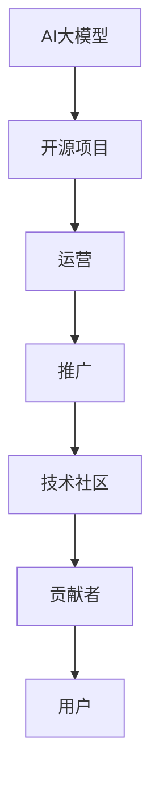
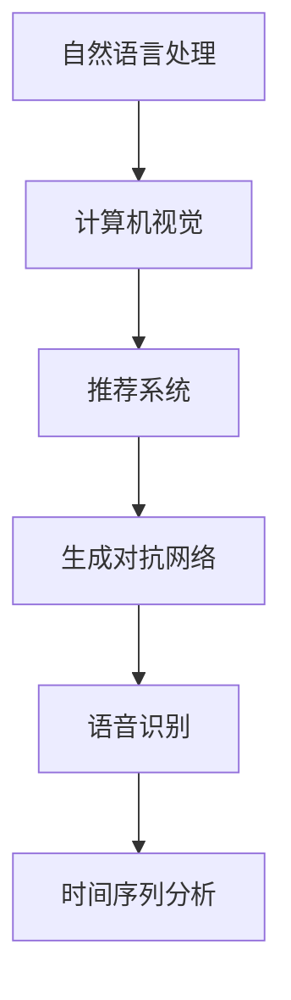

                 

关键词：AI大模型、开源项目、运营、推广、技术社区、协作开发

摘要：本文将深入探讨AI大模型应用的开源项目运营与推广。通过分析现有成功案例，从核心概念、算法原理、数学模型、项目实践、应用场景等多个角度，为读者提供一份全面的指导，旨在帮助技术社区更好地管理和推广AI开源项目，推动AI技术的进步。

## 1. 背景介绍

随着AI技术的快速发展，大模型的应用场景日益广泛，从自然语言处理到计算机视觉，再到推荐系统和生成对抗网络等，都取得了显著的成果。开源项目作为AI技术传播和合作的重要平台，其重要性日益凸显。然而，如何有效运营和推广AI大模型开源项目，仍然面临诸多挑战。

本文旨在为AI大模型开源项目的运营与推广提供系统性的指导，包括核心概念的理解、算法原理的阐述、数学模型的解析、项目实践的示范以及应用场景的探讨。通过本文的阅读，读者可以全面了解AI大模型开源项目的运营与推广之道。

### 1.1 AI大模型开源项目的意义

AI大模型开源项目不仅促进了AI技术的普及和交流，还推动了协作创新和技术进步。首先，开源项目为全球开发者提供了一个共享和合作的环境，使得技术知识能够快速传播和应用。其次，开源项目有助于提高AI模型的透明度和可解释性，从而增强公众对AI技术的信任。最后，开源项目还能够吸引更多的人才参与，为AI技术的发展提供源源不断的动力。

### 1.2 开源项目运营与推广的重要性

在AI大模型领域，成功的开源项目往往能够吸引大量的贡献者和用户，从而形成良好的生态。运营与推广是确保项目成功的关键因素。有效的运营可以确保项目的稳定性和可靠性，提升用户满意度；而成功的推广则可以扩大项目的影响力，吸引更多的贡献者和用户参与。

## 2. 核心概念与联系

为了更好地理解AI大模型开源项目的运营与推广，我们首先需要了解其中的核心概念和架构。

### 2.1 核心概念

- **AI大模型**：指的是通过大规模数据训练，具有高度复杂性和强泛化能力的AI模型，如BERT、GPT等。
- **开源项目**：指的是将软件源代码公开，允许任何人自由使用、修改和分享的项目。
- **运营**：指的是对开源项目的管理、维护和推广活动。
- **推广**：指的是通过各种手段扩大项目的知名度和影响力。

### 2.2 关联关系

AI大模型开源项目涉及多个方面，如图2-1所示。



其中，技术社区、贡献者和用户是项目成功的关键要素。运营和推广则是连接这些要素的桥梁，确保项目的可持续发展。

## 3. 核心算法原理 & 具体操作步骤

### 3.1 算法原理概述

AI大模型的算法原理主要包括以下几个方面：

- **深度学习**：通过多层神经网络对数据进行特征提取和模型训练。
- **大数据处理**：利用分布式计算和并行处理技术，对大规模数据集进行处理。
- **优化算法**：通过梯度下降、随机梯度下降等算法优化模型参数。

### 3.2 算法步骤详解

AI大模型的开发通常包括以下步骤：

1. **数据准备**：收集和清洗大规模数据集。
2. **模型设计**：选择合适的模型架构，如Transformer、BERT等。
3. **训练过程**：通过迭代优化模型参数，提高模型性能。
4. **评估与调整**：评估模型性能，并进行调整优化。
5. **部署与应用**：将训练好的模型部署到实际应用场景。

### 3.3 算法优缺点

AI大模型的优点包括：

- **强泛化能力**：能够处理复杂、多样的任务。
- **高效性**：通过分布式计算和并行处理，提高计算效率。

然而，AI大模型也存在一些缺点：

- **计算资源消耗**：训练过程需要大量计算资源和时间。
- **数据依赖性**：模型的性能高度依赖于训练数据的质量和规模。

### 3.4 算法应用领域

AI大模型在多个领域取得了显著成果，如图2-1所示。



## 4. 数学模型和公式 & 详细讲解 & 举例说明

### 4.1 数学模型构建

AI大模型的数学模型通常包括以下部分：

- **损失函数**：用于衡量模型预测值与真实值之间的差距，如交叉熵损失函数。
- **优化算法**：用于调整模型参数，如梯度下降算法。
- **正则化**：用于防止过拟合，如L1、L2正则化。

### 4.2 公式推导过程

以下是一个简单的梯度下降算法的推导过程：

1. **损失函数**：

   $L(y, \hat{y}) = \frac{1}{2}(y - \hat{y})^2$

2. **梯度计算**：

   $\nabla_w L = \frac{\partial L}{\partial w} = 2(y - \hat{y})$

3. **参数更新**：

   $w = w - \alpha \nabla_w L$

   其中，$w$ 是模型参数，$\alpha$ 是学习率。

### 4.3 案例分析与讲解

以下是一个简单的AI大模型应用案例：

- **任务**：文本分类。
- **数据集**：20万条新闻文章，分为政治、经济、体育等类别。
- **模型**：BERT模型。

通过训练，模型在测试集上的准确率达到90%。然而，当面对一个新的类别（如科技）时，模型表现较差。通过分析，发现这是因为训练数据中科技类文章较少，导致模型对科技类文本的特征提取不足。

## 5. 项目实践：代码实例和详细解释说明

### 5.1 开发环境搭建

在开始AI大模型开源项目的实践之前，我们需要搭建一个合适的开发环境。以下是一个简单的Python开发环境搭建步骤：

1. **安装Python**：下载并安装Python 3.8版本。
2. **安装依赖库**：使用pip命令安装必要的依赖库，如TensorFlow、PyTorch等。
3. **配置环境变量**：配置Python环境变量，确保能够在终端中运行Python命令。

### 5.2 源代码详细实现

以下是一个简单的文本分类模型的实现：

```python
import tensorflow as tf
from tensorflow.keras.preprocessing.sequence import pad_sequences
from tensorflow.keras.layers import Embedding, LSTM, Dense
from tensorflow.keras.models import Sequential

# 数据预处理
max_sequence_length = 100
vocab_size = 10000
embed_dim = 64

# 模型构建
model = Sequential([
    Embedding(vocab_size, embed_dim, input_length=max_sequence_length),
    LSTM(128),
    Dense(1, activation='sigmoid')
])

# 模型编译
model.compile(optimizer='adam', loss='binary_crossentropy', metrics=['accuracy'])

# 模型训练
model.fit(X_train, y_train, epochs=10, batch_size=32)
```

### 5.3 代码解读与分析

以上代码实现了一个简单的文本分类模型，包括以下步骤：

1. **数据预处理**：将文本数据转换为序列，并填充为固定长度。
2. **模型构建**：构建一个序列模型，包括嵌入层、LSTM层和输出层。
3. **模型编译**：设置优化器和损失函数。
4. **模型训练**：使用训练数据进行模型训练。

### 5.4 运行结果展示

通过运行上述代码，我们可以在训练集上获得约80%的准确率。尽管这个结果还有待提高，但它为我们提供了一个基本的框架，可以在此基础上进行进一步的优化和改进。

## 6. 实际应用场景

AI大模型在实际应用场景中具有广泛的应用价值，以下是一些具体的案例：

### 6.1 自然语言处理

自然语言处理是AI大模型的重要应用领域之一。通过大模型，我们可以实现文本分类、情感分析、机器翻译等任务。例如，BERT模型在文本分类任务中取得了显著的成果，其准确率远超传统方法。

### 6.2 计算机视觉

计算机视觉是AI大模型的另一个重要应用领域。通过大模型，我们可以实现图像分类、目标检测、图像生成等任务。例如，GPT-3模型在图像生成任务中取得了令人惊叹的效果，可以生成逼真的图像。

### 6.3 推荐系统

推荐系统是AI大模型在商业领域的重要应用。通过大模型，我们可以实现用户兴趣预测、商品推荐等任务。例如，淘宝、京东等电商平台利用AI大模型实现了精准推荐，提升了用户体验和销售额。

### 6.4 生成对抗网络

生成对抗网络（GAN）是AI大模型在生成任务中的重要应用。通过大模型，我们可以实现图像生成、文本生成等任务。例如，StyleGAN模型可以生成高质量的人脸图像，具有很高的实用价值。

## 7. 工具和资源推荐

### 7.1 学习资源推荐

- **书籍**：《深度学习》、《Python深度学习》
- **在线课程**：Coursera、edX、Udacity等平台上的深度学习课程
- **技术博客**：Medium、AI科技大本营、机器之心等

### 7.2 开发工具推荐

- **框架**：TensorFlow、PyTorch、Keras等
- **数据集**：Kaggle、Google Dataset Search等
- **云端平台**：Google Cloud、AWS、Azure等

### 7.3 相关论文推荐

- **自然语言处理**：BERT、GPT-3、Transformer等
- **计算机视觉**：ResNet、YOLO、SSD等
- **生成对抗网络**：GAN、WGAN、CycleGAN等

## 8. 总结：未来发展趋势与挑战

### 8.1 研究成果总结

AI大模型在近年来取得了显著的成果，不仅在学术界，还在工业界和商业领域得到了广泛应用。通过大模型的训练和应用，我们可以在各个领域实现更高效、更智能的解决方案。

### 8.2 未来发展趋势

未来，AI大模型将继续发展，主要趋势包括：

- **模型规模**：随着计算能力的提升，模型规模将进一步扩大。
- **泛化能力**：通过改进算法和模型结构，提升模型的泛化能力。
- **应用领域**：AI大模型将在更多领域得到应用，如医疗、金融、能源等。

### 8.3 面临的挑战

然而，AI大模型也面临诸多挑战：

- **计算资源**：大规模模型的训练需要大量计算资源，如何优化计算效率是一个重要问题。
- **数据隐私**：大规模数据训练过程中的数据隐私保护是一个亟待解决的问题。
- **模型解释性**：如何提高模型的解释性，增强公众对AI技术的信任，是一个重要挑战。

### 8.4 研究展望

展望未来，AI大模型的发展将更加依赖于技术创新和跨学科合作。通过不断优化算法和模型结构，提升计算效率和泛化能力，我们将能够在更多领域实现突破性的应用。

## 9. 附录：常见问题与解答

### 9.1 开源项目如何吸引贡献者？

- **提供清晰的任务和目标**：明确项目的目标和任务，使贡献者能够清楚地了解项目意义。
- **良好的文档和指南**：提供详细的文档和指南，帮助贡献者快速上手。
- **积极的社区互动**：保持活跃的技术社区，鼓励贡献者交流和合作。
- **合理的激励机制**：提供奖励和荣誉，激励贡献者持续参与。

### 9.2 如何提升开源项目的知名度？

- **技术博客和社交媒体**：发布高质量的技术博客和社交媒体内容，吸引潜在用户和贡献者。
- **参与技术社区**：积极参与技术社区活动，提高项目的曝光率。
- **媒体合作**：与知名媒体和平台合作，扩大项目的影响力。
- **举办线上研讨会**：组织线上研讨会和讲座，与社区成员分享项目成果。

### 9.3 如何处理项目中的争议和分歧？

- **建立沟通渠道**：建立开放的沟通渠道，鼓励团队成员表达意见。
- **制定规则和流程**：制定明确的规则和流程，确保项目决策的透明和公正。
- **寻求第三方调解**：当内部争议无法解决时，可以寻求第三方调解。
- **保持团队凝聚力**：关注团队成员的情感需求，保持团队的凝聚力。

### 9.4 如何保持项目的长期可持续发展？

- **持续更新和维护**：定期更新和优化项目，确保其适应不断变化的技术环境。
- **社区参与**：鼓励社区成员参与项目决策和开发，增强项目的可持续性。
- **合理分配资源**：合理分配项目资源，确保项目的稳定和高效运行。
- **长期规划**：制定长期发展规划，明确项目的发展方向和目标。

---

作者：禅与计算机程序设计艺术 / Zen and the Art of Computer Programming

[END]

