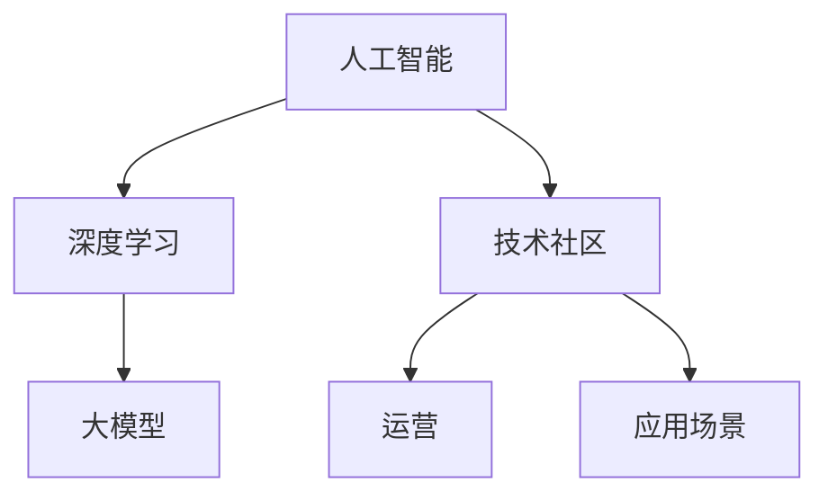

                 

关键词：AI大模型，技术社区，运营，算法原理，数学模型，项目实践，应用场景，未来展望

摘要：随着人工智能技术的迅猛发展，大模型的应用越来越广泛，如何在技术社区中进行有效运营成为一个重要的课题。本文将从背景介绍、核心概念与联系、核心算法原理与操作步骤、数学模型与公式、项目实践、实际应用场景、未来展望等多个方面，详细探讨AI大模型应用的技术社区运营。

## 1. 背景介绍

近年来，人工智能（AI）技术取得了显著的发展，特别是在深度学习和大数据分析领域。大模型（Large Models）作为一种重要的技术手段，因其能够处理海量数据和复杂任务，而备受关注。这些大模型如GPT-3、BERT等，已经在自然语言处理、计算机视觉、语音识别等领域取得了显著的成果。

与此同时，技术社区作为AI大模型应用的重要载体，也逐渐成为研究人员、开发者和用户的交流平台。如何在一个技术社区中有效地运营AI大模型，提高其应用价值和影响力，成为了一个亟待解决的问题。

## 2. 核心概念与联系

为了更好地理解AI大模型应用的技术社区运营，我们首先需要了解一些核心概念和它们之间的联系。以下是几个关键概念及其关系：

### 2.1. 人工智能（AI）

人工智能是指由人制造出来的具有一定智能的系统，能够完成人类智能的某些任务。

### 2.2. 深度学习（Deep Learning）

深度学习是一种基于多层神经网络的学习方法，可以自动提取数据中的特征。

### 2.3. 大模型（Large Models）

大模型是指参数量巨大、能够处理海量数据的模型，如GPT-3、BERT等。

### 2.4. 技术社区（Technical Community）

技术社区是指一群对特定技术领域有共同兴趣的人组成的交流平台。

### 2.5. 运营（Operation）

运营是指通过一系列策略和手段，提高技术社区的质量和活跃度。

### 2.6. 应用场景（Application Scenarios）

应用场景是指大模型在实际中的使用场景，如自然语言处理、计算机视觉等。

以下是这些概念之间的Mermaid流程图：



## 3. 核心算法原理 & 具体操作步骤

### 3.1 算法原理概述

大模型的算法原理主要基于深度学习，尤其是基于神经网络的学习方法。具体来说，大模型通过训练大量数据和参数，能够自动提取数据中的特征，并进行复杂的任务处理。

### 3.2 算法步骤详解

大模型的应用步骤可以分为以下几个阶段：

1. 数据采集：收集与任务相关的数据。
2. 数据预处理：对数据进行清洗、标准化等处理。
3. 模型训练：使用训练数据训练模型，调整模型参数。
4. 模型评估：使用验证数据评估模型性能。
5. 模型部署：将训练好的模型部署到实际应用场景中。
6. 模型优化：根据实际应用效果，对模型进行优化。

### 3.3 算法优缺点

**优点：**

- **处理能力强大：** 大模型可以处理海量数据和复杂任务。
- **自适应性强：** 大模型能够自动提取数据中的特征，适应不同任务需求。
- **效果显著：** 大模型在多个任务上取得了显著的效果。

**缺点：**

- **训练时间长：** 大模型的训练时间较长，需要大量计算资源。
- **数据需求高：** 大模型的训练需要大量高质量的数据。
- **模型可解释性差：** 大模型的内部结构复杂，难以解释。

### 3.4 算法应用领域

大模型的应用领域非常广泛，包括但不限于：

- 自然语言处理：如文本分类、机器翻译、文本生成等。
- 计算机视觉：如图像分类、目标检测、图像生成等。
- 语音识别：如语音识别、语音生成等。
- 推荐系统：如商品推荐、内容推荐等。

## 4. 数学模型和公式 & 详细讲解 & 举例说明

### 4.1 数学模型构建

大模型的数学模型主要包括以下几个部分：

1. 神经网络结构：包括输入层、隐藏层和输出层。
2. 损失函数：用于衡量模型预测结果与真实结果之间的差距。
3. 优化算法：用于调整模型参数，减小损失函数。

### 4.2 公式推导过程

以下是神经网络中的一些关键公式：

1. 激活函数：$$ f(x) = \frac{1}{1 + e^{-x}} $$
2. 前向传播：$$ z_i = \sum_{j} w_{ij} \cdot x_j + b_i $$
$$ a_i = f(z_i) $$
3. 反向传播：$$ \delta_i = \frac{\partial L}{\partial z_i} $$
$$ \Delta w_{ij} = \eta \cdot x_j \cdot \delta_i $$
$$ \Delta b_i = \eta \cdot \delta_i $$

### 4.3 案例分析与讲解

以下是一个关于大模型在自然语言处理中应用的案例：

假设我们有一个文本分类任务，需要将文本分为两个类别。我们可以使用一个基于深度学习的大模型来实现。

1. 数据采集：收集包含两个类别的文本数据。
2. 数据预处理：对文本进行分词、去停用词等处理。
3. 模型训练：使用训练数据训练模型，调整模型参数。
4. 模型评估：使用验证数据评估模型性能。
5. 模型部署：将训练好的模型部署到实际应用场景中。
6. 模型优化：根据实际应用效果，对模型进行优化。

具体实现中，我们可以使用一个基于循环神经网络（RNN）的模型，如LSTM（Long Short-Term Memory）。LSTM模型可以有效地处理序列数据，如文本。

## 5. 项目实践：代码实例和详细解释说明

### 5.1 开发环境搭建

1. 安装Python环境。
2. 安装TensorFlow库：`pip install tensorflow`。

### 5.2 源代码详细实现

以下是一个简单的基于LSTM的文本分类模型的实现：

```python
import tensorflow as tf
from tensorflow.keras.models import Sequential
from tensorflow.keras.layers import LSTM, Dense, Embedding

# 参数设置
vocab_size = 10000
embedding_dim = 16
max_sequence_length = 100
lstm_units = 64
num_classes = 2

# 构建模型
model = Sequential([
    Embedding(vocab_size, embedding_dim, input_length=max_sequence_length),
    LSTM(lstm_units, return_sequences=True),
    LSTM(lstm_units),
    Dense(num_classes, activation='softmax')
])

# 编译模型
model.compile(optimizer='adam', loss='categorical_crossentropy', metrics=['accuracy'])

# 模型总结
model.summary()
```

### 5.3 代码解读与分析

- **Embedding层**：用于将文本词向量转换为嵌入向量。
- **LSTM层**：用于处理序列数据，提取特征。
- **Dense层**：用于输出分类结果。
- **编译模型**：设置优化器、损失函数和评估指标。

### 5.4 运行结果展示

运行模型，可以使用训练集和验证集进行评估：

```python
# 训练模型
model.fit(x_train, y_train, epochs=10, batch_size=32, validation_data=(x_val, y_val))

# 评估模型
model.evaluate(x_test, y_test)
```

## 6. 实际应用场景

大模型在技术社区中的应用场景非常广泛，以下是一些具体的应用场景：

1. **自然语言处理**：如文本分类、机器翻译、文本生成等。
2. **计算机视觉**：如图像分类、目标检测、图像生成等。
3. **语音识别**：如语音识别、语音生成等。
4. **推荐系统**：如商品推荐、内容推荐等。
5. **数据挖掘**：如异常检测、关联规则挖掘等。

## 7. 未来应用展望

随着人工智能技术的不断发展，大模型的应用前景非常广阔。未来，大模型将在以下几个方面得到进一步发展：

1. **计算能力提升**：随着计算能力的提升，大模型的训练速度将得到显著提高。
2. **数据质量提升**：随着数据采集和处理技术的进步，数据质量将得到提升，为大模型训练提供更好的数据支持。
3. **跨领域应用**：大模型将在多个领域实现跨领域应用，推动人工智能技术的发展。
4. **可解释性提升**：随着对大模型研究深入，其可解释性将得到提升，为实际应用提供更好的指导。

## 8. 工具和资源推荐

### 8.1 学习资源推荐

- **书籍**：《深度学习》、《Python机器学习》
- **在线课程**：Coursera、edX、Udacity
- **博客**：Towards Data Science、AI应用技术社区

### 8.2 开发工具推荐

- **框架**：TensorFlow、PyTorch
- **库**：NumPy、Pandas、Scikit-learn
- **云平台**：AWS、Google Cloud、Azure

### 8.3 相关论文推荐

- **《A Neural Network for Machine Translation, with Attention》**：介绍注意力机制的神经网络机器翻译模型。
- **《BERT: Pre-training of Deep Bidirectional Transformers for Language Understanding》**：介绍BERT预训练模型。
- **《GPT-3: Language Models are Few-Shot Learners》**：介绍GPT-3模型及其在零样本学习中的应用。

## 9. 总结：未来发展趋势与挑战

大模型应用的技术社区运营是一个充满机遇和挑战的领域。随着人工智能技术的不断发展，大模型将在技术社区中得到更广泛的应用。然而，如何提高大模型的可解释性、降低训练成本、提高数据质量等，仍然是未来研究的重要方向。

### 附录：常见问题与解答

1. **什么是大模型？**
   大模型是指参数量巨大、能够处理海量数据的模型，如GPT-3、BERT等。

2. **大模型有哪些应用领域？**
   大模型的应用领域非常广泛，包括自然语言处理、计算机视觉、语音识别、推荐系统等。

3. **如何搭建大模型的开发环境？**
   可以使用Python和TensorFlow等工具搭建大模型的开发环境。

4. **大模型有哪些优缺点？**
   大模型具有处理能力强大、自适应性强、效果显著等优点，但也存在训练时间长、数据需求高、模型可解释性差等缺点。

5. **如何进行大模型的技术社区运营？**
   可以通过提高数据质量、优化模型训练、提供学习资源等方式进行大模型的技术社区运营。

### 参考文献

1. Goodfellow, I., Bengio, Y., & Courville, A. (2016). Deep Learning. MIT Press.
2. Murphy, K. P. (2012). Machine Learning: A Probabilistic Perspective. MIT Press.
3. Bengio, Y. (2009). Learning Deep Architectures for AI. Foundations and Trends in Machine Learning, 2(1), 1-127.
4. Vaswani, A., Shazeer, N., Parmar, N., Uszkoreit, J., Jones, L., Gomez, A. N., ... & Polosukhin, I. (2017). Attention is all you need. Advances in Neural Information Processing Systems, 30, 5998-6008.
5. Devlin, J., Chang, M. W., Lee, K., & Toutanova, K. (2019). BERT: Pre-training of deep bidirectional transformers for language understanding. Advances in Neural Information Processing Systems, 32.

