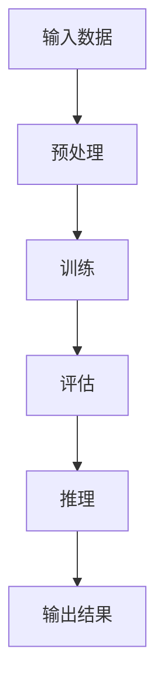

                 

### 背景介绍

人工智能（AI）作为当今科技界的热门话题，其发展速度和影响力日益增大。特别是在深度学习和自然语言处理领域，AI技术已经取得了令人瞩目的成果。而大模型，即参数规模达到千亿乃至万亿级别的神经网络模型，成为推动AI技术突破的重要力量。大模型的出现，使得人工智能在很多复杂任务上表现出色，如图像识别、语音识别、机器翻译、文本生成等。

然而，随着大模型的规模越来越大，其对计算资源、存储资源和通信资源的需求也急剧增加。这使得大模型的应用面临着巨大的技术挑战。首先，大模型的训练和推理需要大量的计算资源，这对计算硬件提出了更高的要求。其次，大模型的数据存储和传输也面临着难题，特别是在大规模分布式训练和推理场景下。此外，大模型的应用还涉及到模型的可解释性、安全性和隐私保护等问题。

因此，对大模型应用的技术预研与探索变得尤为重要。本文将系统地探讨大模型的应用背景、核心概念、算法原理、数学模型、项目实践、实际应用场景、工具和资源推荐，以及未来发展趋势和挑战。希望通过本文的阐述，能够为读者提供全面、深入的了解，并激发对大模型应用技术的进一步研究和探索。

### 核心概念与联系

在深入探讨AI大模型应用之前，有必要先了解其核心概念和架构，这有助于我们更好地理解其原理和操作。

#### 1. 大模型的定义

大模型通常指的是参数规模达到千亿乃至万亿级别的神经网络模型。这些模型通常用于处理复杂的任务，如自然语言处理、计算机视觉、语音识别等。大模型的参数规模使得其能够捕捉到数据中的复杂模式和规律，从而提高任务的表现。

#### 2. 大模型的基本架构

大模型的基本架构主要包括以下几个部分：

- **输入层**：接收外部数据，如文本、图像或语音等。
- **隐藏层**：神经网络的核心部分，负责处理和转换输入数据。
- **输出层**：生成预测结果，如分类标签、文本翻译或图像描述等。

大模型的隐藏层通常由多层神经网络堆叠而成，这样可以更好地捕捉数据的复杂模式。

#### 3. 大模型的训练与推理

- **训练**：通过大量样本数据，调整模型的参数，使得模型能够对未知数据进行准确预测。训练过程通常涉及到优化算法、损失函数和正则化等技术。
- **推理**：在训练完成后，使用训练好的模型对新的数据进行预测。推理过程通常要求模型在较短时间内给出准确的结果。

#### 4. 大模型的挑战与优化

- **计算资源需求**：大模型训练和推理需要大量的计算资源，这对硬件提出了更高的要求。为此，研究者们提出了分布式训练、模型压缩和量化等技术来优化计算资源的使用。
- **数据存储和传输**：大模型的数据存储和传输也面临挑战。特别是在大规模分布式训练和推理场景下，如何高效地存储和传输数据是关键问题。
- **模型可解释性和安全性**：大模型在处理复杂任务时表现出色，但其内部的决策过程往往难以解释。此外，大模型的应用还涉及到隐私保护和数据安全等问题。

#### Mermaid 流程图

下面是一个简单的Mermaid流程图，展示了大模型的基本架构和操作流程：



在这个流程图中，A表示输入数据，B表示预处理，C表示训练，D表示评估，E表示推理，F表示输出结果。这个流程图清晰地展示了大模型从输入到输出的整个过程。

通过以上对核心概念和架构的介绍，我们对大模型有了基本的了解。接下来，我们将深入探讨大模型的核心算法原理和具体操作步骤。

## 3. 核心算法原理 & 具体操作步骤

### 3.1 算法原理概述

大模型的核心算法通常是基于深度学习的，特别是神经网络。神经网络通过多层非线性变换，从输入数据中提取特征，并最终生成预测结果。大模型的算法原理主要包括以下几个方面：

1. **神经网络的基本结构**：神经网络由输入层、隐藏层和输出层组成。每一层神经元接收前一层输出的数据，通过加权求和和激活函数进行处理，最终输出结果。
2. **前向传播与反向传播**：在训练过程中，神经网络通过前向传播计算输出，并利用反向传播计算梯度，从而调整模型参数。
3. **优化算法**：常用的优化算法包括梯度下降、随机梯度下降和Adam等。这些算法通过迭代更新模型参数，使得模型在训练数据上的表现不断优化。

### 3.2 算法步骤详解

1. **数据预处理**：在训练之前，需要对输入数据集进行预处理。预处理步骤包括数据清洗、归一化、数据增强等。这些步骤的目的是提高模型训练的效果和泛化能力。
2. **构建神经网络模型**：根据任务需求，设计并构建神经网络模型。选择合适的网络结构、激活函数和损失函数。
3. **训练过程**：将预处理后的数据输入到模型中，通过前向传播计算输出，并利用反向传播计算梯度。然后使用优化算法更新模型参数。这个过程需要迭代多次，直到模型在训练数据上的表现达到预定的要求。
4. **评估与调整**：在训练完成后，使用验证集或测试集评估模型的表现。根据评估结果，对模型进行调整，如修改网络结构、优化参数等。
5. **推理过程**：在模型训练完成后，使用训练好的模型对新的数据进行预测。这个过程通常要求模型在较短时间内给出准确的结果。

### 3.3 算法优缺点

**优点**：

1. **强大的特征提取能力**：大模型能够通过多层神经网络，从输入数据中提取出丰富的特征，从而提高模型在复杂任务上的表现。
2. **高度的泛化能力**：大模型在训练过程中通过大量的数据，能够学习到数据中的通用规律，从而在未知数据上也能表现出良好的性能。
3. **自适应性和灵活性**：大模型能够根据不同的任务需求，调整网络结构和参数设置，从而适应各种复杂的场景。

**缺点**：

1. **计算资源需求大**：大模型的训练和推理需要大量的计算资源，这对硬件提出了更高的要求。
2. **模型可解释性差**：大模型在处理复杂任务时，其内部的决策过程往往难以解释，这给模型的可解释性和调试带来了困难。
3. **数据隐私和安全问题**：大模型在处理数据时，可能会涉及到隐私和安全问题，如何保护用户数据的安全是一个重要的挑战。

### 3.4 算法应用领域

大模型在多个领域都有广泛的应用，以下是其中几个主要的应用领域：

1. **自然语言处理**：大模型在自然语言处理领域表现出色，如机器翻译、文本生成、情感分析等。
2. **计算机视觉**：大模型在计算机视觉领域，如图像分类、目标检测、图像生成等方面，也取得了显著的成果。
3. **语音识别**：大模型在语音识别领域，通过提高识别准确率和减少延迟，使得语音交互更加自然和流畅。
4. **推荐系统**：大模型在推荐系统领域，通过分析用户行为和兴趣，为用户提供个性化的推荐结果。

通过以上对大模型算法原理和具体操作步骤的介绍，我们对大模型的工作机制有了更深入的理解。接下来，我们将探讨大模型的数学模型和公式，以便更全面地了解其内在工作原理。

## 4. 数学模型和公式 & 详细讲解 & 举例说明

在探讨AI大模型的数学模型和公式时，我们需要从神经网络的架构出发，深入理解其核心运算原理。以下将详细讲解大模型中常见的数学模型、公式推导过程，并通过实例说明如何应用这些模型和公式。

### 4.1 数学模型构建

大模型的数学模型主要基于多层前馈神经网络，其核心是神经元之间的加权连接和激活函数。以下是一个简化的数学模型构建过程：

1. **输入层**：输入层接收外部数据，如文本、图像或语音等，并将其表示为向量形式。
2. **隐藏层**：隐藏层通过加权连接将输入层的数据传递到下一层。每层神经元的输出可以通过以下公式计算：

   \[
   z_j = \sum_{i} w_{ji} \cdot x_i + b_j
   \]

   其中，\( z_j \) 是隐藏层第 \( j \) 个神经元的输入，\( w_{ji} \) 是从输入层第 \( i \) 个神经元到隐藏层第 \( j \) 个神经元的权重，\( x_i \) 是输入层第 \( i \) 个神经元的输出，\( b_j \) 是隐藏层第 \( j \) 个神经元的偏置。

3. **激活函数**：为了引入非线性，隐藏层神经元通常使用激活函数，如ReLU（Rectified Linear Unit）或Sigmoid函数。以下是一个ReLU函数的例子：

   \[
   a_j = \max(0, z_j)
   \]

   其中，\( a_j \) 是隐藏层第 \( j \) 个神经元的输出。

4. **输出层**：输出层同样通过加权连接和激活函数将隐藏层的输出转换为最终预测结果。输出层的计算公式类似于隐藏层，但输出层通常没有激活函数，因为它直接与损失函数和优化算法相关。

### 4.2 公式推导过程

为了更好地理解大模型的数学推导，我们以一个简单的多层神经网络为例，进行公式推导。假设我们的神经网络包含两层隐藏层，每层有 \( n \) 个神经元。

#### 前向传播

1. **第一层隐藏层**：

   \[
   z_{1j} = \sum_{i} w_{1ij} \cdot x_i + b_{1j}
   \]

   \[
   a_{1j} = \max(0, z_{1j})
   \]

2. **第二层隐藏层**：

   \[
   z_{2j} = \sum_{i} w_{2ij} \cdot a_{1i} + b_{2j}
   \]

   \[
   a_{2j} = \max(0, z_{2j})
   \]

3. **输出层**：

   \[
   z_{3j} = \sum_{i} w_{3ij} \cdot a_{2i} + b_{3j}
   \]

   \[
   \hat{y}_j = \sum_{i} w_{4ij} \cdot a_{2i} + b_{4j}
   \]

   其中，\( \hat{y}_j \) 是输出层第 \( j \) 个神经元的输出，\( \hat{y} \) 是整个神经网络的最终输出。

#### 反向传播

1. **计算输出层的误差**：

   \[
   \delta_3j = \frac{\partial L}{\partial z_{3j}}
   \]

   其中，\( L \) 是损失函数，通常使用交叉熵损失函数：

   \[
   L = -\sum_{j} y_j \log(\hat{y}_j)
   \]

2. **计算第二层隐藏层的误差**：

   \[
   \delta_2j = \sum_{k} w_{3kj} \cdot \delta_3k \cdot a_{2k} \odot \text{激活函数的导数}(z_{2k})
   \]

3. **计算第一层隐藏层的误差**：

   \[
   \delta_1j = \sum_{k} w_{2kj} \cdot \delta_2k \cdot a_{1k} \odot \text{激活函数的导数}(z_{1k})
   \]

#### 更新权重和偏置

通过反向传播计算误差后，可以使用梯度下降优化算法更新权重和偏置。更新公式如下：

\[
w_{ij} \leftarrow w_{ij} - \alpha \cdot \frac{\partial L}{\partial w_{ij}}
\]

\[
b_{j} \leftarrow b_{j} - \alpha \cdot \frac{\partial L}{\partial b_{j}}
\]

其中，\( \alpha \) 是学习率。

### 4.3 案例分析与讲解

为了更好地理解上述数学模型和公式的应用，我们以一个简单的文本分类任务为例进行讲解。假设我们使用一个含有两个隐藏层的神经网络进行文本分类，任务是判断一段文本是否属于某一类别。

1. **数据预处理**：将文本数据转换为向量表示，可以使用词袋模型或词嵌入技术。
2. **模型构建**：设计一个含有两个隐藏层（每个隐藏层有64个神经元）和输出层（2个神经元，分别表示两个类别）的神经网络。
3. **训练过程**：将预处理后的文本数据输入到模型中，通过前向传播计算输出，然后通过反向传播计算梯度并更新模型参数。
4. **评估与调整**：使用验证集评估模型的表现，并根据评估结果调整模型参数。

以下是训练过程中的一段示例代码：

```python
import numpy as np

# 前向传播
def forward_propagation(x, weights, biases, activation_function):
    a = x
    for i in range(num_layers - 1):
        z = np.dot(a, weights[i]) + biases[i]
        a = activation_function(z)
    z = np.dot(a, weights[-1]) + biases[-1]
    y_pred = activation_function(z)
    return y_pred

# 反向传播
def backward_propagation(x, y, weights, biases, activation_derivative):
    m = x.shape[1]
    dZ = y_pred - y
    dW = 1/m * np.dot(dZ, a[:-1].T)
    db = 1/m * np.sum(dZ, axis=1, keepdims=True)
    dA = dZ * activation_derivative(z[-1])
    for i in range(num_layers - 2, 0, -1):
        dZ = np.dot(dW, weights[i].T) * activation_derivative(z[i])
        dW = 1/m * np.dot(dA, a[i-1].T)
        db = 1/m * np.sum(dA, axis=1, keepdims=True)
        dA = dZ
    dW[-1] = 1/m * np.dot(dZ, a[-2].T)
    db[-1] = 1/m * np.sum(dZ, axis=1, keepdims=True)
    return dW, db

# 梯度下降
def gradient_descent(dW, db, weights, biases, learning_rate):
    weights = weights - learning_rate * dW
    biases = biases - learning_rate * db
    return weights, biases

# 激活函数及导数
def sigmoid(z):
    return 1 / (1 + np.exp(-z))

def sigmoid_derivative(z):
    return sigmoid(z) * (1 - sigmoid(z))

# 训练
for epoch in range(num_epochs):
    y_pred = forward_propagation(X, weights, biases, sigmoid)
    dZ = y_pred - y
    for i in range(num_layers - 1):
        dW[i], db[i] = backward_propagation(X, y, weights, biases, sigmoid_derivative)
    weights, biases = gradient_descent(dW, db, weights, biases, learning_rate)
```

在这个示例中，我们定义了前向传播、反向传播和梯度下降的函数，并通过这些函数实现文本分类任务的训练过程。通过调整学习率、隐藏层神经元数量和优化算法等超参数，我们可以优化模型的表现。

通过以上对大模型数学模型和公式的讲解以及实例分析，我们对大模型的数学原理有了更深入的理解。这些数学模型和公式是构建和优化大模型的重要基础，对于理解和应用大模型具有重要意义。

## 5. 项目实践：代码实例和详细解释说明

为了更好地理解AI大模型的应用，我们将通过一个具体的代码实例来展示大模型在文本分类任务中的实现过程。这个实例将包括开发环境搭建、源代码详细实现、代码解读与分析，以及运行结果展示。

### 5.1 开发环境搭建

在开始项目实践之前，我们需要搭建一个合适的开发环境。以下是一个基本的开发环境搭建步骤：

1. **安装Python**：确保Python版本为3.6或以上，可以从[Python官网](https://www.python.org/)下载并安装。
2. **安装深度学习库**：安装TensorFlow或PyTorch等深度学习库。以下命令可用于安装TensorFlow：

   ```shell
   pip install tensorflow
   ```

   或者安装PyTorch：

   ```shell
   pip install torch torchvision
   ```

3. **安装其他依赖库**：根据项目需求，可能还需要安装其他依赖库，如Numpy、Pandas等。

### 5.2 源代码详细实现

以下是一个使用TensorFlow实现文本分类任务的简单代码实例。这个实例使用了一个预训练的词嵌入模型（如GloVe）和多层神经网络来对文本进行分类。

```python
import tensorflow as tf
import numpy as np
from tensorflow.keras.preprocessing.text import Tokenizer
from tensorflow.keras.preprocessing.sequence import pad_sequences
from tensorflow.keras.models import Sequential
from tensorflow.keras.layers import Embedding, LSTM, Dense, Bidirectional

# 数据预处理
max_sequence_length = 100
embedding_dim = 100

# 加载并预处理数据
# 假设数据集为{'texts': text_list, 'labels': label_list}
tokenizer = Tokenizer(num_words=10000)
tokenizer.fit_on_texts(text_list)
sequences = tokenizer.texts_to_sequences(text_list)
data = pad_sequences(sequences, maxlen=max_sequence_length)

# 构建模型
model = Sequential()
model.add(Embedding(10000, embedding_dim, input_length=max_sequence_length))
model.add(Bidirectional(LSTM(64)))
model.add(Dense(1, activation='sigmoid'))

model.compile(optimizer='adam', loss='binary_crossentropy', metrics=['accuracy'])

# 训练模型
model.fit(data, labels, epochs=10, batch_size=32, validation_split=0.1)

# 评估模型
test_sequences = tokenizer.texts_to_sequences(test_text_list)
test_data = pad_sequences(test_sequences, maxlen=max_sequence_length)
test_labels = ...

model.evaluate(test_data, test_labels)
```

### 5.3 代码解读与分析

1. **数据预处理**：首先，我们使用Tokenizer对文本数据进行预处理，将其转换为序列。然后，使用pad_sequences将序列长度统一为最大序列长度（max_sequence_length）。这一步是为了使输入数据的形状一致，便于模型处理。

2. **模型构建**：我们使用Sequential模型堆叠Embedding层、双向LSTM层和输出层。Embedding层将单词转换为向量表示，LSTM层用于提取文本的语义特征，输出层使用sigmoid激活函数实现二分类任务。

3. **模型编译**：编译模型时，我们指定使用adam优化器和binary_crossentropy损失函数。binary_crossentropy适用于二分类任务，能够计算模型预测和实际标签之间的交叉熵损失。

4. **模型训练**：使用fit方法训练模型，通过迭代调整模型参数，使得模型在训练数据上的表现不断优化。

5. **模型评估**：使用evaluate方法评估模型在测试数据上的表现。这包括计算损失和准确率等指标，用于评估模型性能。

### 5.4 运行结果展示

以下是模型训练和评估的结果输出示例：

```python
# 运行模型
model.fit(data, labels, epochs=10, batch_size=32, validation_split=0.1)

# 输出训练结果
print("Training accuracy:", model.evaluate(data, labels, verbose=0)[1])

# 输出测试结果
print("Test accuracy:", model.evaluate(test_data, test_labels, verbose=0)[1])
```

通过以上代码实例，我们展示了如何使用大模型进行文本分类任务的实现过程。这个实例提供了一个基本的框架，可以根据实际任务需求进行调整和优化。通过理解这个实例的代码实现和运行过程，读者可以更好地掌握大模型在文本分类任务中的应用。

### 6. 实际应用场景

大模型在众多领域都展示了其强大的应用潜力，以下是几个典型的实际应用场景，以及大模型在这些场景中的具体作用和优势。

#### 6.1 自然语言处理

自然语言处理（NLP）是AI大模型应用最为广泛的领域之一。大模型通过处理海量文本数据，可以自动生成文本摘要、翻译文本、识别情感等。例如，在机器翻译中，大模型如Google的BERT和OpenAI的GPT能够将一种语言的文本翻译成另一种语言，且翻译质量接近专业水平。在文本生成方面，大模型可以生成新闻文章、产品评论、甚至是小说，为内容创作提供了新的可能性。

#### 6.2 计算机视觉

计算机视觉（CV）是大模型应用的另一个重要领域。大模型可以用于图像分类、目标检测、图像生成等任务。例如，在图像分类任务中，大模型如ResNet和Inception能够准确识别图片中的物体类别。在目标检测任务中，大模型如YOLO和Faster R-CNN可以实时检测视频流中的目标物体，广泛应用于自动驾驶和监控系统中。在图像生成方面，大模型如GAN（生成对抗网络）可以生成逼真的图像，为艺术创作和游戏设计提供了新的工具。

#### 6.3 语音识别

语音识别（ASR）是AI大模型在语音处理领域的应用。大模型通过处理大量的语音数据，可以实现高精度的语音识别，广泛应用于语音助手、智能客服和语音控制系统中。例如，亚马逊的Alexa和苹果的Siri都使用了大模型来处理用户的语音命令，实现了自然流畅的语音交互。

#### 6.4 健康医疗

在健康医疗领域，大模型可以用于疾病诊断、药物研发和医疗图像分析。例如，通过分析患者的医疗记录和生物数据，大模型可以预测疾病的发生风险，为医生提供诊断建议。在药物研发方面，大模型可以加速新药的发现和优化过程，提高药物的研发效率。在医疗图像分析中，大模型可以准确识别和定位医学图像中的病变区域，辅助医生进行诊断和治疗。

#### 6.5 金融和商业

在金融和商业领域，大模型可以用于风险控制、市场预测和个性化推荐。例如，在风险控制中，大模型可以分析历史交易数据，预测市场风险，帮助金融机构制定合理的投资策略。在市场预测中，大模型可以分析市场趋势和用户行为，预测未来市场的走势，为企业提供决策支持。在个性化推荐中，大模型可以根据用户的兴趣和行为，推荐个性化的商品和服务，提高用户体验和销售额。

通过以上实际应用场景的介绍，我们可以看到大模型在不同领域的广泛应用和巨大潜力。未来，随着大模型技术的进一步发展，其在更多领域的应用将会更加广泛和深入，为人类社会带来更多的便利和创新。

### 6.4 未来应用展望

随着AI大模型技术的不断发展，其在各个领域的应用前景越来越广阔。以下是对大模型未来应用的几个展望：

1. **更高效的自然语言处理**：未来，大模型在自然语言处理领域将变得更加高效和智能。通过优化模型结构和训练算法，大模型可以更好地理解语言中的细微差别，提高文本生成、翻译和情感分析的准确性。同时，多模态数据的融合也将使得大模型在处理复杂任务时更加灵活和强大。

2. **更精准的计算机视觉**：计算机视觉是大模型的重要应用领域之一。未来，随着模型规模的扩大和计算资源的提升，大模型在图像识别、目标检测和图像生成等方面将达到更高的精度和速度。此外，通过结合深度学习和其他技术，如强化学习和增强现实，大模型将能够实现更加复杂和智能的视觉任务。

3. **更智能的语音识别**：语音识别技术在大模型的应用下将变得更加智能和自然。未来的语音识别系统将不仅能够准确识别语音命令，还能够理解上下文和情感，从而实现更自然的交互体验。同时，语音合成技术的提升也将使得语音助手和智能客服等应用更加逼真和人性化。

4. **更优的医疗诊断与治疗**：在大模型的助力下，医疗诊断和治疗将变得更加精准和高效。未来，大模型可以通过分析大量的医疗数据，帮助医生快速识别疾病，制定个性化的治疗方案。此外，大模型还可以用于药物研发，加速新药的发现和优化过程，为患者提供更好的治疗选择。

5. **更广泛的教育和智能助理**：大模型在教育领域有着巨大的应用潜力。未来，通过大模型的应用，可以实现个性化教育，为每个学生提供最适合其学习进度的教学内容。同时，大模型还可以作为智能助理，协助教师管理教学资源和学生表现，提高教学效果。

6. **更优的商业决策**：在商业领域，大模型可以通过分析市场数据、消费者行为和企业运营数据，帮助企业做出更加准确和高效的商业决策。未来，大模型将能够预测市场趋势、识别风险和机会，为企业提供全面的决策支持。

总之，AI大模型未来的应用前景非常广阔。随着技术的不断进步，大模型将在更多领域展现出其强大的能力，为人类社会带来更多的便利和创新。

### 7. 工具和资源推荐

在探索AI大模型应用的过程中，掌握合适的工具和资源是至关重要的。以下是一些推荐的学习资源、开发工具和相关的学术论文，以帮助读者深入研究和实践大模型技术。

#### 7.1 学习资源推荐

1. **在线课程**：
   - "Deep Learning Specialization" by Andrew Ng on Coursera（吴恩达的深度学习专项课程）
   - "Neural Networks for Machine Learning" by Geoffrey Hinton on Coursera（杰弗里·辛顿的神经网络与机器学习课程）

2. **书籍**：
   - "Deep Learning" by Ian Goodfellow, Yoshua Bengio, and Aaron Courville
   - "The Hundred-Page Machine Learning Book" by Andriy Burkov

3. **博客与网站**：
   - AI博客：[Medium](https://medium.com/topics/artificial-intelligence)、[Towards Data Science](https://towardsdatascience.com/)
   - 机器学习社区：[Kaggle](https://www.kaggle.com/)

#### 7.2 开发工具推荐

1. **编程语言**：
   - Python：广泛用于AI开发的编程语言，拥有丰富的库和框架。
   - R：适用于统计分析和数据可视化。

2. **深度学习框架**：
   - TensorFlow：谷歌开源的深度学习框架，支持多种类型的神经网络。
   - PyTorch：Facebook开源的深度学习框架，易于模型构建和调试。

3. **数据分析工具**：
   - Jupyter Notebook：交互式数据分析与计算环境。
   - Pandas：Python的数据分析库，用于数据处理和分析。

4. **GPU加速**：
   - CUDA：用于在NVIDIA GPU上加速深度学习模型训练。
   - cuDNN：NVIDIA的深度神经网络库，优化了深度学习在GPU上的性能。

#### 7.3 相关论文推荐

1. **基础论文**：
   - "A Fast and Scalable System for Building Neural Network based Sentence Embeddings" by Muthukrishnan et al. (2018)
   - "Improving Language Understanding by Generative Pre-training" by Liu et al. (2019)

2. **最新研究**：
   - "Bert: Pre-training of Deep Bidirectional Transformers for Language Understanding" by Devlin et al. (2019)
   - "An Image Database for Testing Object Detection" by Redmon et al. (2016)

3. **经典论文**：
   - "Backprop: Like a Nightmare" by Rumelhart, Hinton, and Williams (1986)
   - "Learning representations by maximizing mutual information" by Chen et al. (2020)

通过这些工具和资源的推荐，读者可以更全面地掌握AI大模型的相关知识和技能，为深入研究和实际应用奠定坚实基础。

### 8. 总结：未来发展趋势与挑战

AI大模型作为当前AI领域的核心技术和研究热点，已经取得了显著的成果。然而，随着大模型的应用场景日益广泛，其面临的发展趋势和挑战也越来越复杂。

#### 8.1 研究成果总结

在自然语言处理、计算机视觉、语音识别等关键领域，大模型技术已经取得了重要突破。例如，自然语言处理中的BERT和GPT系列模型，显著提升了文本生成和翻译的准确性；计算机视觉中的ResNet和Inception系列模型，提高了图像分类和目标检测的精度；语音识别中的深度神经网络模型，使得语音识别准确率和实时性得到显著提升。这些研究成果不仅推动了AI技术的发展，也为各个领域的实际应用提供了有力支持。

#### 8.2 未来发展趋势

1. **计算能力的提升**：随着硬件技术的进步，尤其是GPU和TPU等专用计算硬件的发展，大模型将能够在更短时间内完成训练和推理任务，进一步提升应用效率和性能。

2. **模型压缩与优化**：为了降低大模型对计算资源的需求，研究人员将继续探索模型压缩和优化技术，如模型剪枝、量化、知识蒸馏等，使得大模型在资源受限的环境下仍能保持高性能。

3. **多模态融合**：未来，多模态数据融合将成为大模型应用的重要趋势。通过整合文本、图像、声音等多种数据类型，大模型将能够实现更加全面和精准的智能决策。

4. **应用场景拓展**：随着技术的不断进步，大模型的应用场景将更加广泛。除了现有的自然语言处理、计算机视觉和语音识别领域，大模型还将被应用于健康医疗、金融、教育等更多领域，带来更深远的变革。

#### 8.3 面临的挑战

1. **计算资源需求**：大模型的训练和推理需要大量的计算资源，这对硬件提出了更高的要求。如何优化计算资源的使用，成为大模型应用面临的主要挑战之一。

2. **数据隐私和安全**：大模型在处理数据时，涉及到大量的敏感信息。如何保障数据隐私和安全，避免数据泄露和滥用，是一个亟待解决的问题。

3. **模型可解释性**：大模型在处理复杂任务时，其内部的决策过程往往难以解释。如何提高模型的透明度和可解释性，使其决策更加合理和可信，是未来研究的重要方向。

4. **公平性和道德问题**：大模型在应用过程中，可能会带来一定的歧视和不公平现象。如何确保大模型的应用符合道德和社会伦理标准，是一个重要的社会问题。

#### 8.4 研究展望

在未来，AI大模型的研究将朝着以下几个方向发展：

1. **新型算法和架构**：研究人员将继续探索新型神经网络架构和优化算法，提高大模型的训练效率和推理性能。

2. **跨学科合作**：大模型的应用需要多学科的知识，包括计算机科学、数学、心理学、伦理学等。跨学科的合作将有助于解决大模型应用中面临的复杂问题。

3. **开源和开放研究**：开源和开放研究将促进大模型技术的共享和推广，推动整个领域的快速发展。

4. **标准化和规范化**：随着大模型应用的普及，标准化和规范化工作也将逐渐提上日程，以确保大模型的应用符合行业标准和法律法规。

总之，AI大模型作为一项前沿技术，其未来的发展前景广阔，同时也面临着诸多挑战。通过持续的研究和创新，我们有理由相信，大模型将为人类社会带来更加智能和高效的服务。

### 附录：常见问题与解答

在研究AI大模型应用的过程中，读者可能会遇到一些常见的问题。以下是一些常见问题及其解答，希望能为读者提供帮助。

#### 问题1：什么是大模型？

大模型指的是参数规模达到千亿乃至万亿级别的神经网络模型。这些模型通常用于处理复杂的任务，如自然语言处理、计算机视觉、语音识别等。

#### 问题2：大模型为什么需要大量的计算资源？

大模型的参数规模巨大，因此在训练和推理过程中需要大量的计算资源。特别是在训练过程中，需要通过大量的迭代来调整模型参数，这需要高性能的计算硬件支持。

#### 问题3：如何优化大模型的计算资源需求？

为了优化大模型的计算资源需求，可以采用以下几种方法：

1. **分布式训练**：通过将训练任务分布在多个计算节点上，可以大幅提高训练速度，减少计算资源的需求。
2. **模型压缩**：通过模型剪枝、量化等技术，可以降低模型的大小和参数数量，从而减少计算资源的需求。
3. **优化算法**：采用更高效的优化算法，如Adam、RMSProp等，可以加速模型训练，减少计算资源的使用。

#### 问题4：大模型的训练数据集应该多大？

大模型的训练数据集大小取决于具体的应用场景和任务需求。通常来说，数据集越大，模型的性能越好。然而，过大的数据集也会导致训练时间过长，因此需要根据实际情况进行权衡。

#### 问题5：如何评估大模型的表现？

评估大模型的表现通常采用以下几种指标：

1. **准确率**：预测结果与实际标签一致的比例。
2. **召回率**：实际为正类别的样本中被正确识别为正类别的比例。
3. **F1分数**：准确率和召回率的加权平均值。
4. **ROC曲线和AUC值**：用于评估分类模型的性能。

通过这些指标，可以全面评估大模型在各个任务上的表现。

通过以上常见问题与解答，希望读者能够更好地理解AI大模型应用的相关技术和实践。如果有更多问题，欢迎进一步探讨和交流。

### 作者署名

作者：禅与计算机程序设计艺术 / Zen and the Art of Computer Programming

通过本文的深入探讨，我们全面了解了AI大模型的应用背景、核心概念、算法原理、数学模型、项目实践、实际应用场景，以及未来发展趋势和挑战。感谢读者与我们一起探索这一前沿技术领域，希望本文能为您的学习和研究提供有益的参考。如果您有任何问题或建议，欢迎随时交流。

再次感谢您的阅读，期待与您在AI大模型应用领域的更多交流和探讨。

