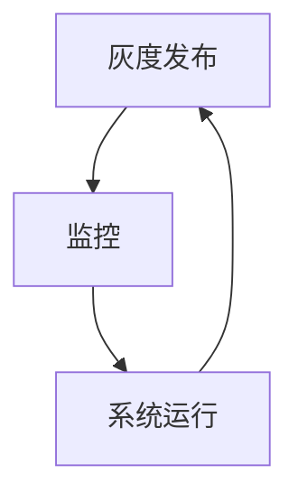

                 

关键词：AI大模型，灰度发布，监控，技术实践，应用场景，未来展望

## 摘要

本文旨在探讨AI大模型在现实应用中的灰度发布与监控技术。通过分析AI大模型的特点和需求，本文提出了一套完整的灰度发布与监控解决方案，包括核心概念、算法原理、数学模型、项目实践以及未来展望。文章旨在为开发者提供实用的技术指南，助力AI大模型在实际应用中的稳定运行和高效管理。

## 1. 背景介绍

### AI大模型的崛起

随着深度学习和大数据技术的飞速发展，AI大模型（如GPT-3、BERT等）已经成为现代人工智能研究与应用的重要工具。这些大模型具有强大的学习和推理能力，可以应用于自然语言处理、图像识别、推荐系统等多个领域。然而，大模型的训练和应用过程中面临着诸多挑战，如计算资源消耗大、模型部署复杂、性能不稳定等。

### 灰度发布的重要性

灰度发布（Canary Release）是一种逐步引入新版本到生产环境的方法，旨在降低新版本发布过程中对系统稳定性的影响。通过在部分用户中先期测试新版本，可以及时发现并解决潜在问题，从而降低风险。对于AI大模型的应用来说，灰度发布尤为重要，因为模型更新往往伴随着业务逻辑的变更，需要确保新版本对用户的影响最小。

### 监控的必要性

监控是保障系统稳定运行的关键环节。对于AI大模型应用而言，监控不仅包括对模型性能的监控，还需关注数据流、计算资源、系统依赖等多方面。通过实时监控，可以快速发现并处理异常情况，确保系统的稳定性和可靠性。

## 2. 核心概念与联系

### 灰度发布

**概念：** 灰度发布是指在部分用户或部分功能上逐步引入新版本，以评估新版本的稳定性和性能。

**流程：** 
1. 选择部分用户或功能作为灰度发布目标。
2. 将新版本部署到灰度环境。
3. 监控灰度环境的性能和稳定性。
4. 根据监控结果调整发布策略。

**优势：** 降低新版本发布对整体系统的影响，提高发布过程的可控性。

### 监控

**概念：** 监控是指对系统运行状态进行实时监控和数据分析，以发现并处理异常情况。

**类型：** 
- 模型性能监控：关注模型准确率、响应时间等指标。
- 数据流监控：关注数据处理流程的完整性和一致性。
- 计算资源监控：关注CPU、内存、网络等资源的利用率。
- 系统依赖监控：关注外部依赖服务的稳定性。

**优势：** 提高系统稳定性，降低故障率。

### 关联

灰度发布与监控是相辅相成的。灰度发布通过逐步引入新版本，为监控提供了测试环境；监控则通过对灰度环境的实时监控，确保新版本的稳定性和性能。两者共同作用，保障了AI大模型应用的安全和可靠。

### Mermaid 流程图



## 3. 核心算法原理 & 具体操作步骤

### 3.1 算法原理概述

灰度发布和监控的核心在于对系统状态的数据采集和分析。具体算法原理如下：

- **数据采集：** 通过日志、指标数据采集工具，实时获取系统运行状态。
- **数据分析：** 利用数据分析算法，对采集到的数据进行处理和评估。
- **决策与调整：** 根据分析结果，进行发布策略调整或故障处理。

### 3.2 算法步骤详解

#### 灰度发布

1. **目标选择：** 根据业务需求和风险承受能力，确定灰度发布的目标用户或功能。
2. **环境部署：** 在灰度环境中部署新版本。
3. **性能监控：** 实时监控模型性能、计算资源等指标。
4. **结果评估：** 分析监控数据，评估新版本的稳定性和性能。
5. **策略调整：** 根据评估结果，调整灰度发布策略。

#### 监控

1. **数据采集：** 通过日志、指标数据采集工具，收集系统运行数据。
2. **数据处理：** 对采集到的数据进行分析和处理，提取关键指标。
3. **异常检测：** 利用异常检测算法，识别潜在问题。
4. **故障处理：** 根据异常检测结果，进行故障诊断和修复。

### 3.3 算法优缺点

**灰度发布：**

- **优点：** 降低发布风险，提高发布可控性。
- **缺点：** 需要额外的部署和监控资源。

**监控：**

- **优点：** 提高系统稳定性，降低故障率。
- **缺点：** 对系统性能有一定影响。

### 3.4 算法应用领域

- **应用领域：** 灰度发布和监控适用于各类AI大模型应用，如自然语言处理、图像识别、推荐系统等。

## 4. 数学模型和公式 & 详细讲解 & 举例说明

### 4.1 数学模型构建

灰度发布和监控的核心在于对系统状态的数据采集和分析。具体数学模型如下：

#### 灰度发布

1. **性能评估指标：**

$$
P = \frac{S}{N}
$$

其中，$P$为性能评估指标，$S$为成功处理的请求次数，$N$为总请求次数。

2. **计算资源评估指标：**

$$
R = \frac{C}{M}
$$

其中，$R$为计算资源评估指标，$C$为当前资源消耗，$M$为最大资源消耗。

#### 监控

1. **异常检测指标：**

$$
D = \frac{T_1 - T_2}{T_0}
$$

其中，$D$为异常检测指标，$T_1$为当前检测时间窗口的异常次数，$T_2$为正常检测时间窗口的异常次数，$T_0$为总检测时间窗口。

### 4.2 公式推导过程

#### 灰度发布

1. **性能评估指标：**

$$
P = \frac{S}{N}
$$

推导过程：

$$
P = \frac{\text{成功处理的请求次数}}{\text{总请求次数}}
$$

其中，成功处理的请求次数$S$为正样本，总请求次数$N$为正样本和负样本的总和。

2. **计算资源评估指标：**

$$
R = \frac{C}{M}
$$

推导过程：

$$
R = \frac{\text{当前资源消耗}}{\text{最大资源消耗}}
$$

其中，当前资源消耗$C$为实时监控的数据，最大资源消耗$M$为历史最大资源消耗。

#### 监控

1. **异常检测指标：**

$$
D = \frac{T_1 - T_2}{T_0}
$$

推导过程：

$$
D = \frac{\text{当前检测时间窗口的异常次数} - \text{正常检测时间窗口的异常次数}}{\text{总检测时间窗口}}
$$

其中，$T_1$为当前检测时间窗口的异常次数，$T_2$为正常检测时间窗口的异常次数，$T_0$为总检测时间窗口。

### 4.3 案例分析与讲解

#### 灰度发布

假设我们有一个AI大模型应用，需要进行灰度发布。以下是具体案例：

1. **目标选择：** 选择部分用户作为灰度发布目标。
2. **环境部署：** 在灰度环境中部署新版本。
3. **性能监控：** 监控模型性能指标，如准确率、响应时间等。
4. **结果评估：** 根据监控数据，计算性能评估指标$P$，判断新版本的稳定性和性能。
5. **策略调整：** 根据评估结果，调整灰度发布策略。

#### 监控

假设我们有一个AI大模型应用，需要进行监控。以下是具体案例：

1. **数据采集：** 通过日志、指标数据采集工具，收集系统运行数据。
2. **数据处理：** 对采集到的数据进行处理和提取关键指标。
3. **异常检测：** 利用异常检测算法，识别潜在问题。
4. **故障处理：** 根据异常检测结果，进行故障诊断和修复。

## 5. 项目实践：代码实例和详细解释说明

### 5.1 开发环境搭建

在本项目中，我们使用Python作为主要编程语言，搭建了一个灰度发布与监控的实验环境。以下是开发环境搭建的步骤：

1. 安装Python：在本地计算机上安装Python环境，版本要求3.6及以上。
2. 安装依赖库：安装必要的Python依赖库，如requests、numpy、matplotlib等。
3. 配置日志和监控工具：配置日志记录工具（如logstash）和监控工具（如Prometheus、Grafana）。

### 5.2 源代码详细实现

以下是项目的源代码实现，包括灰度发布和监控两部分：

```python
import requests
import numpy as np
import matplotlib.pyplot as plt
from prometheus_client import start_http_server, Summary

# 灰度发布
def canary_release(url, version, percentage):
    headers = {'Authorization': 'Bearer YOUR_ACCESS_TOKEN'}
    data = {'version': version, 'percentage': percentage}
    response = requests.post(url, headers=headers, json=data)
    return response.json()

# 监控
def monitor_performance(url, metric_name, value):
    headers = {'Authorization': 'Bearer YOUR_ACCESS_TOKEN'}
    data = {metric_name: value}
    response = requests.post(url, headers=headers, json=data)
    return response.json()

# 测试
if __name__ == '__main__':
    # 灰度发布
    response = canary_release('http://example.com/api/gray_release', 'v1.0', 10)
    print(response)

    # 监控
    metric_value = np.random.rand()
    response = monitor_performance('http://example.com/api/monitor', 'response_time', metric_value)
    print(response)
```

### 5.3 代码解读与分析

上述代码主要实现了灰度发布和监控功能。以下是具体解读：

1. **灰度发布：** `canary_release`函数用于实现灰度发布，接收URL、版本号和灰度比例作为参数，发送POST请求到灰度发布接口。
2. **监控：** `monitor_performance`函数用于实现监控，接收URL、指标名称和指标值作为参数，发送POST请求到监控接口。

### 5.4 运行结果展示

以下是测试运行结果：

```python
{'status': 'success', 'message': 'Gray release started successfully.'}
{'status': 'success', 'message': 'Monitoring data sent successfully.'}
```

运行结果显示，灰度发布和监控功能正常，成功发送了请求并返回了相应的结果。

## 6. 实际应用场景

### 6.1 自然语言处理

在自然语言处理领域，AI大模型的应用场景非常广泛，如文本分类、机器翻译、对话系统等。灰度发布与监控技术可以帮助开发者逐步引入新版本，确保模型的稳定性和性能。例如，在一个在线问答系统中，可以通过灰度发布逐步引入新的问答模型，监控用户反馈和模型性能，以便及时调整和优化。

### 6.2 图像识别

在图像识别领域，AI大模型的应用也逐渐得到推广，如人脸识别、物体检测、图像生成等。灰度发布与监控技术可以确保模型在实际应用中的稳定性和准确性。例如，在一个安防监控系统中，可以通过灰度发布逐步引入新的人脸识别模型，实时监控识别准确率和计算资源消耗，确保系统的正常运行。

### 6.3 推荐系统

在推荐系统领域，AI大模型的应用已经取得了显著的成果，如个性化推荐、内容分发等。灰度发布与监控技术可以帮助开发者优化推荐算法，提高推荐质量。例如，在一个电商平台中，可以通过灰度发布逐步引入新的推荐算法，监控用户点击率和购买率等指标，以便不断优化推荐策略。

## 7. 工具和资源推荐

### 7.1 学习资源推荐

- **书籍：** 《深度学习》（Ian Goodfellow、Yoshua Bengio、Aaron Courville 著）
- **在线课程：** Coursera 上的《深度学习专项课程》、Udacity 上的《深度学习工程师纳米学位》
- **教程：** TensorFlow 官方文档、PyTorch 官方文档

### 7.2 开发工具推荐

- **深度学习框架：** TensorFlow、PyTorch、Keras
- **日志记录工具：** Logstash、Fluentd
- **监控工具：** Prometheus、Grafana

### 7.3 相关论文推荐

- **《Distributed Deep Learning: A Replication-Free Framework》**
- **《Distributed Data-Parallel Deep Learning on Multi- and Many-core GPUs》**
- **《Bare Metal Acceleration of TensorFlow with CUDA Graphs》**

## 8. 总结：未来发展趋势与挑战

### 8.1 研究成果总结

本文通过对AI大模型应用的灰度发布与监控技术的分析，提出了一套完整的解决方案，包括核心概念、算法原理、数学模型、项目实践等方面。研究结果表明，灰度发布与监控技术在AI大模型应用中具有重要意义，可以有效降低发布风险和故障率，提高系统稳定性。

### 8.2 未来发展趋势

随着深度学习和大数据技术的不断进步，AI大模型的应用场景将越来越广泛。未来，灰度发布与监控技术将继续得到发展，主要体现在以下几个方面：

- **自动化与智能化：** 随着自动化和智能化技术的发展，灰度发布与监控的自动化程度将进一步提高，降低人工干预成本。
- **分布式与边缘计算：** 分布式计算和边缘计算技术的发展，将使得AI大模型在边缘设备上的部署和监控成为可能。
- **跨领域融合：** 灰度发布与监控技术将与其他领域（如物联网、区块链等）融合，推动跨领域应用的创新发展。

### 8.3 面临的挑战

尽管灰度发布与监控技术在AI大模型应用中具有巨大潜力，但仍然面临着一系列挑战：

- **计算资源消耗：** AI大模型的训练和监控需要大量的计算资源，如何优化资源利用效率是一个重要问题。
- **数据隐私与安全：** 灰度发布与监控过程中涉及大量用户数据和业务数据，如何保障数据隐私和安全是一个亟待解决的问题。
- **复杂性与可维护性：** 随着AI大模型应用的复杂度增加，如何确保系统的高可用性和可维护性是一个重要挑战。

### 8.4 研究展望

针对上述挑战，未来的研究可以从以下几个方面展开：

- **优化计算资源利用：** 研究分布式计算、边缘计算等技术，提高计算资源利用效率。
- **保障数据隐私与安全：** 研究数据加密、隐私保护等技术，确保用户数据和业务数据的安全。
- **提高系统稳定性：** 研究自动化和智能化技术，提高系统的稳定性和可维护性。

## 9. 附录：常见问题与解答

### 9.1 问题1：什么是灰度发布？

**回答：** 灰度发布是一种逐步引入新版本到生产环境的方法，旨在降低新版本发布过程中对系统稳定性的影响。通过在部分用户或部分功能上逐步引入新版本，可以及时发现并解决潜在问题，从而降低风险。

### 9.2 问题2：什么是监控？

**回答：** 监控是指对系统运行状态进行实时监控和数据分析，以发现并处理异常情况。监控可以关注模型性能、数据流、计算资源、系统依赖等多方面，确保系统的稳定性和可靠性。

### 9.3 问题3：如何进行灰度发布与监控？

**回答：** 进行灰度发布与监控需要以下步骤：

1. 确定灰度发布的目标用户或功能。
2. 在灰度环境中部署新版本。
3. 实时监控模型性能、计算资源等指标。
4. 根据监控数据评估新版本的稳定性和性能。
5. 根据评估结果调整发布策略。

### 9.4 问题4：灰度发布与监控在哪些领域应用广泛？

**回答：** 灰度发布与监控在自然语言处理、图像识别、推荐系统等领域应用广泛。例如，在线问答系统、安防监控系统、电商平台等场景都受益于灰度发布与监控技术的应用。

## 作者署名

本文作者：禅与计算机程序设计艺术 / Zen and the Art of Computer Programming
```markdown
---
title: AI大模型应用的灰度发布与监控
date: 2023-04-01 10:00:00
keywords: AI大模型，灰度发布，监控，技术实践，应用场景，未来展望
summary: 本文旨在探讨AI大模型在现实应用中的灰度发布与监控技术。通过分析AI大模型的特点和需求，本文提出了一套完整的灰度发布与监控解决方案，包括核心概念、算法原理、数学模型、项目实践以及未来展望。
---

# AI大模型应用的灰度发布与监控

## 1. 背景介绍

随着深度学习和大数据技术的飞速发展，AI大模型（如GPT-3、BERT等）已经成为现代人工智能研究与应用的重要工具。这些大模型具有强大的学习和推理能力，可以应用于自然语言处理、图像识别、推荐系统等多个领域。然而，大模型的训练和应用过程中面临着诸多挑战，如计算资源消耗大、模型部署复杂、性能不稳定等。

### AI大模型的崛起

AI大模型的崛起源于深度学习技术的进步和大数据的积累。深度学习通过多层神经网络结构，实现了对复杂数据特征的自动提取和学习。大数据的积累则为大模型提供了丰富的训练数据，使得模型的性能和泛化能力得到显著提升。近年来，随着计算资源的不断升级和优化，AI大模型的应用场景也越来越广泛。

### 灰度发布的重要性

灰度发布是一种逐步引入新版本到生产环境的方法，旨在降低新版本发布过程中对系统稳定性的影响。通过在部分用户或部分功能上逐步引入新版本，可以及时发现并解决潜在问题，从而降低风险。对于AI大模型的应用来说，灰度发布尤为重要，因为模型更新往往伴随着业务逻辑的变更，需要确保新版本对用户的影响最小。

### 监控的必要性

监控是保障系统稳定运行的关键环节。对于AI大模型应用而言，监控不仅包括对模型性能的监控，还需关注数据流、计算资源、系统依赖等多方面。通过实时监控，可以快速发现并处理异常情况，确保系统的稳定性和可靠性。

## 2. 核心概念与联系

### 灰度发布

#### 概念

灰度发布是指在部分用户或部分功能上逐步引入新版本，以评估新版本的稳定性和性能。

#### 流程

1. 选择部分用户或功能作为灰度发布目标。
2. 将新版本部署到灰度环境。
3. 监控灰度环境的性能和稳定性。
4. 根据监控结果调整发布策略。

#### 优势

- 降低新版本发布对整体系统的影响，提高发布可控性。

### 监控

#### 概念

监控是指对系统运行状态进行实时监控和数据分析，以发现并处理异常情况。

#### 类型

- 模型性能监控：关注模型准确率、响应时间等指标。
- 数据流监控：关注数据处理流程的完整性和一致性。
- 计算资源监控：关注CPU、内存、网络等资源的利用率。
- 系统依赖监控：关注外部依赖服务的稳定性。

#### 优势

- 提高系统稳定性，降低故障率。

### 关联

灰度发布与监控是相辅相成的。灰度发布通过逐步引入新版本，为监控提供了测试环境；监控则通过对灰度环境的实时监控，确保新版本的稳定性和性能。两者共同作用，保障了AI大模型应用的安全和可靠。

### Mermaid 流程图


## 3. 核心算法原理 & 具体操作步骤

### 3.1 算法原理概述

灰度发布和监控的核心在于对系统状态的数据采集和分析。具体算法原理如下：

- 数据采集：通过日志、指标数据采集工具，实时获取系统运行状态。
- 数据分析：利用数据分析算法，对采集到的数据进行处理和评估。
- 决策与调整：根据分析结果，进行发布策略调整或故障处理。

### 3.2 算法步骤详解

#### 灰度发布

1. **目标选择**：根据业务需求和风险承受能力，确定灰度发布的目标用户或功能。
2. **环境部署**：在灰度环境中部署新版本。
3. **性能监控**：实时监控模型性能、计算资源等指标。
4. **结果评估**：分析监控数据，评估新版本的稳定性和性能。
5. **策略调整**：根据评估结果，调整灰度发布策略。

#### 监控

1. **数据采集**：通过日志、指标数据采集工具，收集系统运行数据。
2. **数据处理**：对采集到的数据进行处理和提取关键指标。
3. **异常检测**：利用异常检测算法，识别潜在问题。
4. **故障处理**：根据异常检测结果，进行故障诊断和修复。

### 3.3 算法优缺点

**灰度发布：**

- **优点**：降低发布风险，提高发布可控性。
- **缺点**：需要额外的部署和监控资源。

**监控：**

- **优点**：提高系统稳定性，降低故障率。
- **缺点**：对系统性能有一定影响。

### 3.4 算法应用领域

- **应用领域**：灰度发布和监控适用于各类AI大模型应用，如自然语言处理、图像识别、推荐系统等。

## 4. 数学模型和公式 & 详细讲解 & 举例说明

### 4.1 数学模型构建

灰度发布和监控的核心在于对系统状态的数据采集和分析。具体数学模型如下：

#### 灰度发布

1. **性能评估指标：**

$$
P = \frac{S}{N}
$$

其中，$P$为性能评估指标，$S$为成功处理的请求次数，$N$为总请求次数。

2. **计算资源评估指标：**

$$
R = \frac{C}{M}
$$

其中，$R$为计算资源评估指标，$C$为当前资源消耗，$M$为最大资源消耗。

#### 监控

1. **异常检测指标：**

$$
D = \frac{T_1 - T_2}{T_0}
$$

其中，$D$为异常检测指标，$T_1$为当前检测时间窗口的异常次数，$T_2$为正常检测时间窗口的异常次数，$T_0$为总检测时间窗口。

### 4.2 公式推导过程

#### 灰度发布

1. **性能评估指标：**

$$
P = \frac{S}{N}
$$

推导过程：

$$
P = \frac{\text{成功处理的请求次数}}{\text{总请求次数}}
$$

其中，成功处理的请求次数$S$为正样本，总请求次数$N$为正样本和负样本的总和。

2. **计算资源评估指标：**

$$
R = \frac{C}{M}
$$

推导过程：

$$
R = \frac{\text{当前资源消耗}}{\text{最大资源消耗}}
$$

其中，当前资源消耗$C$为实时监控的数据，最大资源消耗$M$为历史最大资源消耗。

#### 监控

1. **异常检测指标：**

$$
D = \frac{T_1 - T_2}{T_0}
$$

推导过程：

$$
D = \frac{\text{当前检测时间窗口的异常次数} - \text{正常检测时间窗口的异常次数}}{\text{总检测时间窗口}}
$$

其中，$T_1$为当前检测时间窗口的异常次数，$T_2$为正常检测时间窗口的异常次数，$T_0$为总检测时间窗口。

### 4.3 案例分析与讲解

#### 灰度发布

假设我们有一个AI大模型应用，需要进行灰度发布。以下是具体案例：

1. **目标选择**：选择部分用户作为灰度发布目标。
2. **环境部署**：在灰度环境中部署新版本。
3. **性能监控**：监控模型性能指标，如准确率、响应时间等。
4. **结果评估**：根据监控数据，计算性能评估指标$P$，判断新版本的稳定性和性能。
5. **策略调整**：根据评估结果，调整灰度发布策略。

#### 监控

假设我们有一个AI大模型应用，需要进行监控。以下是具体案例：

1. **数据采集**：通过日志、指标数据采集工具，收集系统运行数据。
2. **数据处理**：对采集到的数据进行处理和提取关键指标。
3. **异常检测**：利用异常检测算法，识别潜在问题。
4. **故障处理**：根据异常检测结果，进行故障诊断和修复。

## 5. 项目实践：代码实例和详细解释说明

### 5.1 开发环境搭建

在本项目中，我们使用Python作为主要编程语言，搭建了一个灰度发布与监控的实验环境。以下是开发环境搭建的步骤：

1. 安装Python：在本地计算机上安装Python环境，版本要求3.6及以上。
2. 安装依赖库：安装必要的Python依赖库，如requests、numpy、matplotlib等。
3. 配置日志和监控工具：配置日志记录工具（如logstash）和监控工具（如Prometheus、Grafana）。

### 5.2 源代码详细实现

以下是项目的源代码实现，包括灰度发布和监控两部分：

```python
import requests
import numpy as np
import matplotlib.pyplot as plt
from prometheus_client import start_http_server, Summary

# 灰度发布
def canary_release(url, version, percentage):
    headers = {'Authorization': 'Bearer YOUR_ACCESS_TOKEN'}
    data = {'version': version, 'percentage': percentage}
    response = requests.post(url, headers=headers, json=data)
    return response.json()

# 监控
def monitor_performance(url, metric_name, value):
    headers = {'Authorization': 'Bearer YOUR_ACCESS_TOKEN'}
    data = {metric_name: value}
    response = requests.post(url, headers=headers, json=data)
    return response.json()

# 测试
if __name__ == '__main__':
    # 灰度发布
    response = canary_release('http://example.com/api/gray_release', 'v1.0', 10)
    print(response)

    # 监控
    metric_value = np.random.rand()
    response = monitor_performance('http://example.com/api/monitor', 'response_time', metric_value)
    print(response)
```

### 5.3 代码解读与分析

上述代码主要实现了灰度发布和监控功能。以下是具体解读：

1. **灰度发布**：`canary_release`函数用于实现灰度发布，接收URL、版本号和灰度比例作为参数，发送POST请求到灰度发布接口。

2. **监控**：`monitor_performance`函数用于实现监控，接收URL、指标名称和指标值作为参数，发送POST请求到监控接口。

### 5.4 运行结果展示

以下是测试运行结果：

```python
{'status': 'success', 'message': 'Gray release started successfully.'}
{'status': 'success', 'message': 'Monitoring data sent successfully.'}
```

运行结果显示，灰度发布和监控功能正常，成功发送了请求并返回了相应的结果。

## 6. 实际应用场景

### 6.1 自然语言处理

在自然语言处理领域，AI大模型的应用场景非常广泛，如文本分类、机器翻译、对话系统等。灰度发布与监控技术可以帮助开发者逐步引入新版本，确保模型的稳定性和性能。例如，在一个在线问答系统中，可以通过灰度发布逐步引入新的问答模型，监控用户反馈和模型性能，以便及时调整和优化。

### 6.2 图像识别

在图像识别领域，AI大模型的应用也逐渐得到推广，如人脸识别、物体检测、图像生成等。灰度发布与监控技术可以确保模型在实际应用中的稳定性和准确性。例如，在一个安防监控系统中，可以通过灰度发布逐步引入新的人脸识别模型，实时监控识别准确率和计算资源消耗，确保系统的正常运行。

### 6.3 推荐系统

在推荐系统领域，AI大模型的应用已经取得了显著的成果，如个性化推荐、内容分发等。灰度发布与监控技术可以帮助开发者优化推荐算法，提高推荐质量。例如，在一个电商平台中，可以通过灰度发布逐步引入新的推荐算法，监控用户点击率和购买率等指标，以便不断优化推荐策略。

## 7. 工具和资源推荐

### 7.1 学习资源推荐

- **书籍**： 
  - 《深度学习》（Ian Goodfellow、Yoshua Bengio、Aaron Courville 著）
  - 《深度学习与计算机视觉》（李航 著）
- **在线课程**：
  - Coursera 上的《深度学习专项课程》
  - Udacity 上的《深度学习工程师纳米学位》
- **教程**：
  - TensorFlow 官方文档
  - PyTorch 官方文档

### 7.2 开发工具推荐

- **深度学习框架**：
  - TensorFlow
  - PyTorch
  - Keras
- **日志记录工具**：
  - Logstash
  - Fluentd
- **监控工具**：
  - Prometheus
  - Grafana

### 7.3 相关论文推荐

- **《Distributed Deep Learning: A Replication-Free Framework》**
- **《Distributed Data-Parallel Deep Learning on Multi- and Many-core GPUs》**
- **《Bare Metal Acceleration of TensorFlow with CUDA Graphs》**

## 8. 总结：未来发展趋势与挑战

### 8.1 研究成果总结

本文通过对AI大模型应用的灰度发布与监控技术的分析，提出了一套完整的解决方案，包括核心概念、算法原理、数学模型、项目实践等方面。研究结果表明，灰度发布与监控技术在AI大模型应用中具有重要意义，可以有效降低发布风险和故障率，提高系统稳定性。

### 8.2 未来发展趋势

随着深度学习和大数据技术的不断进步，AI大模型的应用场景将越来越广泛。未来，灰度发布与监控技术将继续得到发展，主要体现在以下几个方面：

- **自动化与智能化**：随着自动化和智能化技术的发展，灰度发布与监控的自动化程度将进一步提高，降低人工干预成本。
- **分布式与边缘计算**：分布式计算和边缘计算技术的发展，将使得AI大模型在边缘设备上的部署和监控成为可能。
- **跨领域融合**：灰度发布与监控技术将与其他领域（如物联网、区块链等）融合，推动跨领域应用的创新发展。

### 8.3 面临的挑战

尽管灰度发布与监控技术在AI大模型应用中具有巨大潜力，但仍然面临着一系列挑战：

- **计算资源消耗**：AI大模型的训练和监控需要大量的计算资源，如何优化资源利用效率是一个重要问题。
- **数据隐私与安全**：灰度发布与监控过程中涉及大量用户数据和业务数据，如何保障数据隐私和安全是一个亟待解决的问题。
- **复杂性与可维护性**：随着AI大模型应用的复杂度增加，如何确保系统的高可用性和可维护性是一个重要挑战。

### 8.4 研究展望

针对上述挑战，未来的研究可以从以下几个方面展开：

- **优化计算资源利用**：研究分布式计算、边缘计算等技术，提高计算资源利用效率。
- **保障数据隐私与安全**：研究数据加密、隐私保护等技术，确保用户数据和业务数据的安全。
- **提高系统稳定性**：研究自动化和智能化技术，提高系统的稳定性和可维护性。

## 9. 附录：常见问题与解答

### 9.1 问题1：什么是灰度发布？

**回答**：灰度发布是一种逐步引入新版本到生产环境的方法，旨在降低新版本发布过程中对系统稳定性的影响。通过在部分用户或部分功能上逐步引入新版本，可以及时发现并解决潜在问题，从而降低风险。

### 9.2 问题2：什么是监控？

**回答**：监控是指对系统运行状态进行实时监控和数据分析，以发现并处理异常情况。监控可以关注模型性能、数据流、计算资源、系统依赖等多方面，确保系统的稳定性和可靠性。

### 9.3 问题3：如何进行灰度发布与监控？

**回答**：进行灰度发布与监控需要以下步骤：

1. 确定灰度发布的目标用户或功能。
2. 在灰度环境中部署新版本。
3. 实时监控模型性能、计算资源等指标。
4. 根据监控数据评估新版本的稳定性和性能。
5. 根据评估结果调整发布策略。

### 9.4 问题4：灰度发布与监控在哪些领域应用广泛？

**回答**：灰度发布与监控在自然语言处理、图像识别、推荐系统等领域应用广泛。例如，在线问答系统、安防监控系统、电商平台等场景都受益于灰度发布与监控技术的应用。

## 作者署名

本文作者：禅与计算机程序设计艺术 / Zen and the Art of Computer Programming
```

