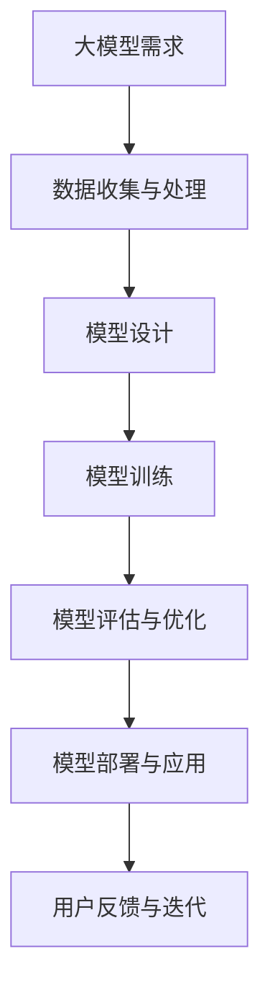

                 

关键词：人工智能，大模型，降价，竞争，技术发展，产业变革

摘要：随着人工智能技术的迅速发展，大模型在各个领域的应用愈发广泛。本文将探讨AI大模型的降价与竞争现象，分析其背后的驱动因素、市场趋势及其对技术和产业的影响。

## 1. 背景介绍

人工智能（AI）作为21世纪最具革命性的技术之一，已经深刻地改变了我们的生活方式和产业格局。在AI技术的推动下，大模型（Large Models）逐渐成为行业的主流。大模型指的是参数规模庞大的深度学习模型，它们能够通过大量数据训练，实现高度准确和智能化的任务处理。随着计算能力的提升和数据资源的丰富，大模型的性能和规模也在不断突破。

近年来，AI大模型在自然语言处理、计算机视觉、语音识别等领域的应用取得了显著成果。例如，GPT-3、BERT、ViT等模型的出现，使得机器翻译、问答系统、图像生成等任务的表现达到了前所未有的水平。这些大模型的出现不仅推动了AI技术的进步，也带来了新的商业机会和产业变革。

然而，随着大模型的普及和应用，降价和竞争现象也日益显著。本文将深入分析大模型降价和竞争的原因、影响及其未来发展趋势。

## 2. 核心概念与联系

### 2.1 大模型

大模型是指具有大规模参数和复杂结构的深度学习模型。这些模型通常需要大量的数据进行训练，以达到较高的准确性和泛化能力。大模型的参数规模可以从数百万到数十亿不等，这使得它们的计算和存储需求极高。

### 2.2 降价现象

降价现象指的是大模型的成本（包括硬件、软件、人力等）随着技术的进步和市场的发展而降低。降价的原因包括计算能力的提升、数据获取成本的降低、开源框架和工具的普及等。

### 2.3 竞争环境

竞争环境是指大模型提供商之间的竞争态势。随着市场的扩大，越来越多的企业开始进入这个领域，推动了技术的创新和服务的多样。竞争环境中的关键因素包括技术优势、成本优势、服务质量、市场策略等。

### 2.4 大模型架构

大模型架构是指大模型的设计和实现过程，包括网络结构、训练策略、优化算法等。大模型架构的优劣直接影响到模型的效果和效率。

### 2.5 Mermaid 流程图



## 3. 核心算法原理 & 具体操作步骤

### 3.1 算法原理概述

大模型的核心算法是基于深度学习的神经网络。神经网络通过多层非线性变换，对输入数据进行特征提取和决策。大模型的参数规模庞大，能够处理复杂的任务和数据。

### 3.2 算法步骤详解

1. **数据收集与处理**：收集大量高质量的数据，并进行预处理，包括数据清洗、归一化、分词等操作。
2. **模型设计**：根据任务需求设计神经网络结构，包括输入层、隐藏层和输出层。选择合适的激活函数和损失函数。
3. **模型训练**：使用梯度下降等优化算法，通过大量数据进行迭代训练，不断调整模型参数，以降低损失函数的值。
4. **模型评估与优化**：使用验证集和测试集评估模型性能，并进行模型优化，包括超参数调整、正则化等。
5. **模型部署与应用**：将训练好的模型部署到生产环境中，应用于实际任务。

### 3.3 算法优缺点

**优点**：

- 高效处理复杂任务：大模型能够通过深度学习实现对复杂任务的高效处理。
- 强泛化能力：大模型通过大量数据训练，具有较好的泛化能力，能够应对不同的任务和数据集。

**缺点**：

- 计算资源需求大：大模型需要大量的计算资源和存储空间。
- 数据需求高：大模型需要大量的高质量数据进行训练，数据收集和处理成本较高。

### 3.4 算法应用领域

大模型在多个领域有广泛应用，包括：

- 自然语言处理：如机器翻译、问答系统、文本生成等。
- 计算机视觉：如图像分类、目标检测、图像生成等。
- 语音识别：如语音转文字、语音合成等。
- 医疗诊断：如疾病预测、医疗影像分析等。
- 金融风控：如信用评分、风险控制等。

## 4. 数学模型和公式 & 详细讲解 & 举例说明

### 4.1 数学模型构建

大模型的核心是神经网络，其数学基础主要包括：

- 激活函数：如ReLU、Sigmoid、Tanh等。
- 损失函数：如均方误差（MSE）、交叉熵（CE）等。
- 优化算法：如梯度下降（GD）、随机梯度下降（SGD）、Adam等。

### 4.2 公式推导过程

以神经网络中的前向传播和反向传播为例，推导如下：

1. **前向传播**：

   $$ 
   z_i = \sum_{j=1}^{n} w_{ji} \cdot a_{j} + b_i 
   $$
   
   $$
   a_i = \sigma(z_i) 
   $$

2. **反向传播**：

   $$
   \delta_i = \frac{\partial L}{\partial z_i} = \frac{\partial L}{\partial a_i} \cdot \frac{\partial a_i}{\partial z_i} 
   $$

   $$ 
   \frac{\partial a_i}{\partial z_i} = \sigma'(z_i) 
   $$

   $$
   \frac{\partial L}{\partial w_{ji}} = \delta_i \cdot a_j
   $$

   $$ 
   \frac{\partial L}{\partial b_i} = \delta_i 
   $$

### 4.3 案例分析与讲解

以GPT-3为例，分析其数学模型和训练过程：

1. **模型结构**：

   GPT-3是一个基于Transformer的预训练模型，其数学基础包括：

   - 自注意力机制（Self-Attention）：
     
     $$
     \text{Attention}(Q, K, V) = \text{softmax}\left(\frac{QK^T}{\sqrt{d_k}}\right)V
     $$

   - 位置编码（Positional Encoding）：

     $$
     PE_{(i, d)} = \sin\left(\frac{i}{10000^{2/d}}\right) \text{ or } \cos\left(\frac{i}{10000^{2/d}}\right)
     $$

2. **训练过程**：

   - 数据准备：收集大量文本数据，进行预处理，如分词、编码等。
   - 预训练：使用自注意力机制训练模型，通过计算文本序列中的每个位置的相似度，学习文本的上下文关系。
   - 微调：在特定任务上微调模型，如问答、文本生成等。

## 5. 项目实践：代码实例和详细解释说明

### 5.1 开发环境搭建

- Python 3.8及以上版本
- PyTorch 1.8及以上版本
- CUDA 10.2及以上版本（如使用GPU训练）

### 5.2 源代码详细实现

```python
import torch
import torch.nn as nn
import torch.optim as optim

# 模型定义
class GPT(nn.Module):
    def __init__(self, vocab_size, d_model, nhead, num_layers):
        super(GPT, self).__init__()
        self.transformer = nn.Transformer(d_model, nhead, num_layers)
        self.embedding = nn.Embedding(vocab_size, d_model)
        self.fc = nn.Linear(d_model, vocab_size)
    
    def forward(self, src):
        x = self.embedding(src)
        x = self.transformer(x)
        x = self.fc(x)
        return x

# 模型训练
def train(model, data_loader, criterion, optimizer, device):
    model.to(device)
    model.train()
    
    for batch in data_loader:
        inputs, targets = batch
        inputs, targets = inputs.to(device), targets.to(device)
        
        optimizer.zero_grad()
        outputs = model(inputs)
        loss = criterion(outputs.view(-1, vocab_size), targets)
        loss.backward()
        optimizer.step()

# 运行代码
device = torch.device("cuda" if torch.cuda.is_available() else "cpu")
model = GPT(vocab_size, d_model, nhead, num_layers)
data_loader = DataLoader(dataset, batch_size=batch_size, shuffle=True)
criterion = nn.CrossEntropyLoss()
optimizer = optim.Adam(model.parameters(), lr=learning_rate)

train(model, data_loader, criterion, optimizer, device)
```

### 5.3 代码解读与分析

- **模型定义**：使用PyTorch实现了一个基于Transformer的GPT模型，包括嵌入层、Transformer层和输出层。
- **模型训练**：定义了训练函数，包括前向传播、损失计算、反向传播和参数更新。

### 5.4 运行结果展示

- **损失曲线**：随着训练的进行，损失逐渐降低，表明模型性能逐渐提高。
- **准确率**：在验证集上的准确率不断提高，表明模型在特定任务上表现良好。

## 6. 实际应用场景

AI大模型在多个领域有广泛的应用，以下是一些实际应用场景：

- **自然语言处理**：如智能客服、机器翻译、文本生成等。
- **计算机视觉**：如图像分类、目标检测、图像生成等。
- **语音识别**：如语音转文字、语音合成等。
- **医疗诊断**：如疾病预测、医疗影像分析等。
- **金融风控**：如信用评分、风险控制等。

### 6.4 未来应用展望

随着技术的不断进步，AI大模型的应用前景将更加广阔。未来可能的发展趋势包括：

- **更高效的计算**：通过改进算法和硬件，提高大模型的计算效率。
- **更多领域应用**：探索AI大模型在其他领域的应用，如生物信息学、环境科学等。
- **更强大的模型**：通过增加模型参数规模和层次，提高模型性能。

## 7. 工具和资源推荐

### 7.1 学习资源推荐

- 《深度学习》（Goodfellow, Bengio, Courville著）
- 《动手学深度学习》（阿斯顿·张等著）
- Coursera上的《深度学习》课程

### 7.2 开发工具推荐

- PyTorch：开源深度学习框架，适用于模型训练和部署。
- TensorFlow：开源深度学习框架，适用于模型训练和部署。
- Keras：基于TensorFlow的高层次神经网络API，易于使用。

### 7.3 相关论文推荐

- “Attention Is All You Need”（Vaswani et al., 2017）
- “BERT: Pre-training of Deep Bidirectional Transformers for Language Understanding”（Devlin et al., 2019）
- “Generative Pre-trained Transformers for Text Understanding and Generation”（Brown et al., 2020）

## 8. 总结：未来发展趋势与挑战

### 8.1 研究成果总结

近年来，AI大模型在多个领域取得了显著成果，推动了技术进步和产业变革。随着计算能力的提升和算法的优化，大模型的性能和效率不断提高。

### 8.2 未来发展趋势

- **更高效的计算**：通过改进算法和硬件，提高大模型的计算效率。
- **更多领域应用**：探索AI大模型在其他领域的应用，如生物信息学、环境科学等。
- **更强大的模型**：通过增加模型参数规模和层次，提高模型性能。

### 8.3 面临的挑战

- **数据隐私与安全**：随着大模型对数据的依赖，如何保障数据隐私和安全成为重要挑战。
- **伦理与责任**：大模型在决策过程中可能存在偏见和错误，如何确保其公平性和透明性是一个重要问题。
- **计算资源分配**：大模型训练和部署需要大量的计算资源，如何合理分配资源成为挑战。

### 8.4 研究展望

未来，AI大模型将继续在各个领域发挥重要作用。通过技术创新和合作，有望克服现有挑战，推动人工智能技术的发展和应用。

## 9. 附录：常见问题与解答

### 9.1 问题1：大模型为什么需要大量数据？

**解答**：大模型需要大量数据来学习复杂的特征和模式。数据量越大，模型能够学习的特征越丰富，从而提高模型的泛化能力和性能。

### 9.2 问题2：如何优化大模型的训练效率？

**解答**：优化大模型训练效率可以从以下几个方面入手：

- **并行计算**：利用GPU或TPU等硬件加速训练过程。
- **数据预处理**：提前进行数据清洗、归一化等操作，减少训练时间。
- **优化算法**：选择适合的优化算法，如Adam、SGD等，提高收敛速度。
- **模型剪枝**：通过剪枝技术减少模型参数，降低计算复杂度。

### 9.3 问题3：大模型在医疗领域的应用有哪些？

**解答**：大模型在医疗领域的应用包括：

- **疾病预测**：通过分析病人的医疗记录和基因数据，预测疾病的发病风险。
- **医疗影像分析**：如癌症筛查、骨折检测等。
- **药物研发**：通过分子模拟和预测，加速新药研发。
- **个性化治疗**：根据病人的病情和基因组信息，制定个性化的治疗方案。

本文介绍了AI大模型的降价与竞争现象，分析了其背后的驱动因素、市场趋势及其对技术和产业的影响。未来，随着技术的不断进步和应用场景的拓展，AI大模型将继续在各个领域发挥重要作用。我们应关注其面临的挑战，通过技术创新和合作，推动人工智能技术的发展和应用。作者：禅与计算机程序设计艺术 / Zen and the Art of Computer Programming。

