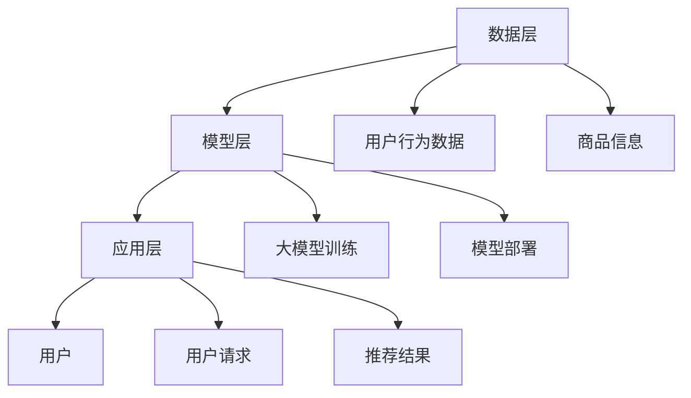

                 

 关键词：人工智能、大模型、电商、搜索、推荐、算法、应用前景

> 摘要：随着人工智能技术的飞速发展，尤其是大模型的广泛应用，电商搜索推荐系统正经历着前所未有的变革。本文将探讨大模型在电商搜索推荐领域的应用，分析其原理、技术实现，以及可能带来的影响和挑战，并展望其未来的发展趋势。

## 1. 背景介绍

随着互联网和电子商务的迅猛发展，用户对个性化推荐的需求日益增长。传统基于内容的推荐系统和协同过滤推荐系统已经难以满足用户日益复杂的需求。此时，人工智能，特别是大模型的出现，为电商搜索推荐领域带来了新的可能。

大模型，如基于深度学习的语言模型（如BERT、GPT等）和图像识别模型（如ResNet、Inception等），以其强大的表示能力和泛化能力，在处理大规模、多维度的数据时表现出色。这使得大模型在电商搜索推荐中具有极大的潜力。

## 2. 核心概念与联系

### 2.1. 大模型的基本原理

大模型通常采用深度神经网络结构，其核心是多层感知器（MLP）。通过逐层学习，模型可以捕捉到数据中的复杂模式。大模型的学习过程包括两个主要阶段：训练阶段和推理阶段。

**训练阶段**：模型通过大量标注数据进行训练，学习输入和输出之间的映射关系。在这个阶段，模型会不断调整其内部参数，以最小化损失函数。

**推理阶段**：模型接受新的输入，并输出相应的预测结果。通过多层非线性变换，模型能够处理高维输入数据，并给出合理的预测。

### 2.2. 大模型在电商搜索推荐中的应用架构

大模型在电商搜索推荐中的应用架构可以分为数据层、模型层和应用层。

**数据层**：负责收集和处理用户行为数据、商品信息等原始数据。这些数据经过预处理后，会被输入到模型层。

**模型层**：包括大模型的训练和部署。模型层通过训练大模型，使其能够理解和预测用户行为和偏好。训练过程中，模型会不断优化其参数，以提高预测的准确性。

**应用层**：将训练好的模型应用于实际的电商搜索推荐系统中。应用层负责处理用户请求，调用模型进行预测，并返回推荐结果。

### 2.3. Mermaid流程图

以下是一个简化的Mermaid流程图，展示了大模型在电商搜索推荐中的应用架构：



## 3. 核心算法原理 & 具体操作步骤

### 3.1. 算法原理概述

大模型在电商搜索推荐中的应用，主要基于以下原理：

1. **深度学习**：通过多层神经网络，模型可以自动学习输入数据的复杂特征，从而实现高精度的预测。
2. **大数据处理**：大模型能够处理海量数据，从而捕捉到更多用户行为和偏好的特征。
3. **个性化推荐**：通过学习用户历史行为和偏好，模型可以提供个性化的推荐结果，提高用户体验。

### 3.2. 算法步骤详解

大模型在电商搜索推荐中的具体操作步骤如下：

1. **数据收集**：收集用户行为数据（如浏览记录、购买历史等）和商品信息（如商品类别、价格、库存等）。
2. **数据处理**：对数据进行清洗、归一化等预处理操作，以消除噪声和异常值。
3. **特征提取**：通过嵌入层等机制，将原始数据进行特征提取，以构建输入特征向量。
4. **模型训练**：使用训练数据，对大模型进行训练，优化模型参数。
5. **模型评估**：使用验证集对训练好的模型进行评估，以确定模型的预测性能。
6. **模型部署**：将训练好的模型部署到实际应用环境中，对用户请求进行实时预测。
7. **结果反馈**：根据模型预测结果，生成推荐列表，并将结果反馈给用户。

### 3.3. 算法优缺点

**优点**：

1. **高精度预测**：大模型能够学习到数据中的复杂特征，从而提高预测精度。
2. **个性化推荐**：通过学习用户历史行为和偏好，模型可以提供更个性化的推荐结果。
3. **适用性强**：大模型可以应用于各种不同类型的电商搜索推荐场景。

**缺点**：

1. **计算资源消耗大**：大模型需要大量的计算资源和存储空间。
2. **训练时间长**：大模型的训练过程需要较长时间，且对硬件设施要求较高。
3. **数据隐私问题**：大模型在训练过程中需要处理大量的用户行为数据，可能涉及数据隐私问题。

### 3.4. 算法应用领域

大模型在电商搜索推荐中的应用非常广泛，主要包括以下领域：

1. **商品推荐**：根据用户历史行为和偏好，为用户推荐可能感兴趣的商品。
2. **广告推荐**：根据用户兴趣和行为，为用户推荐相关的广告。
3. **内容推荐**：根据用户浏览记录和偏好，为用户推荐相关的文章、视频等内容。

## 4. 数学模型和公式 & 详细讲解 & 举例说明

### 4.1. 数学模型构建

在电商搜索推荐中，大模型的数学模型通常包括以下几个部分：

1. **输入层**：表示用户行为数据和商品信息。
2. **隐藏层**：通过非线性变换，提取输入数据的特征。
3. **输出层**：生成推荐结果。

一个简单的神经网络模型可以表示为：

$$
\begin{aligned}
z &= \sigma(W_1 \cdot x + b_1) \\
a &= \sigma(W_2 \cdot z + b_2)
\end{aligned}
$$

其中，$x$表示输入特征向量，$z$表示隐藏层输出，$a$表示输出层输出，$W_1$、$W_2$表示权重矩阵，$b_1$、$b_2$表示偏置项，$\sigma$表示激活函数。

### 4.2. 公式推导过程

假设我们有一个训练数据集$\{x_1, y_1\}, \{x_2, y_2\}, ..., \{x_n, y_n\}$，其中$x_i$表示输入特征向量，$y_i$表示真实标签。我们的目标是优化模型参数$W_1, W_2, b_1, b_2$，使得预测结果$a$与真实标签$y$之间的误差最小。

采用梯度下降法进行优化，需要计算损失函数的梯度：

$$
\begin{aligned}
\frac{\partial L}{\partial W_1} &= (a - y) \cdot z \\
\frac{\partial L}{\partial W_2} &= (a - y) \cdot z \\
\frac{\partial L}{\partial b_1} &= (a - y) \cdot z \\
\frac{\partial L}{\partial b_2} &= (a - y) \cdot z
\end{aligned}
$$

其中，$L$表示损失函数。

通过梯度下降法，可以更新模型参数：

$$
\begin{aligned}
W_1 &= W_1 - \alpha \cdot \frac{\partial L}{\partial W_1} \\
W_2 &= W_2 - \alpha \cdot \frac{\partial L}{\partial W_2} \\
b_1 &= b_1 - \alpha \cdot \frac{\partial L}{\partial b_1} \\
b_2 &= b_2 - \alpha \cdot \frac{\partial L}{\partial b_2}
\end{aligned}
$$

其中，$\alpha$表示学习率。

### 4.3. 案例分析与讲解

假设有一个电商网站，用户的行为数据包括浏览记录、购买历史和评分。我们希望使用大模型为用户推荐可能感兴趣的商品。

1. **数据预处理**：将用户行为数据转换为数值化的特征向量，包括商品类别、价格、库存等。
2. **模型训练**：使用训练数据，训练一个基于深度学习的推荐模型。我们可以选择一个简单的多层感知器（MLP）模型，其中包含两个隐藏层，每个隐藏层包含100个神经元。
3. **模型评估**：使用验证集对训练好的模型进行评估，计算预测准确率、召回率等指标。
4. **模型部署**：将训练好的模型部署到线上环境，对用户请求进行实时预测。

以下是一个简化的代码示例：

```python
import tensorflow as tf
from tensorflow.keras.models import Sequential
from tensorflow.keras.layers import Dense

# 数据预处理
x_train, y_train = preprocess_data()  # 假设已经实现了一个预处理函数

# 模型训练
model = Sequential([
    Dense(100, activation='relu', input_shape=(x_train.shape[1],)),
    Dense(100, activation='relu'),
    Dense(1, activation='sigmoid')
])

model.compile(optimizer='adam', loss='binary_crossentropy', metrics=['accuracy'])

model.fit(x_train, y_train, epochs=10, batch_size=32)

# 模型评估
x_val, y_val = preprocess_data()  # 假设已经实现了一个预处理函数
model.evaluate(x_val, y_val)

# 模型部署
def recommend商品的ID：
    user行为数据 = preprocess_user行为数据()  # 假设已经实现了一个预处理函数
    prediction = model.predict(user行为数据)
    return 预测结果最高的商品的ID
```

## 5. 项目实践：代码实例和详细解释说明

### 5.1. 开发环境搭建

1. 安装Python（版本3.6或以上）。
2. 安装TensorFlow（版本2.0或以上）。

### 5.2. 源代码详细实现

以下是一个简单的电商搜索推荐项目的代码示例：

```python
import tensorflow as tf
from tensorflow.keras.models import Sequential
from tensorflow.keras.layers import Dense

# 数据预处理
def preprocess_data():
    # 假设已经从数据库中读取了用户行为数据和商品信息
    # 返回预处理后的特征向量和标签
    pass

# 模型训练
def train_model():
    x_train, y_train = preprocess_data()
    model = Sequential([
        Dense(100, activation='relu', input_shape=(x_train.shape[1],)),
        Dense(100, activation='relu'),
        Dense(1, activation='sigmoid')
    ])

    model.compile(optimizer='adam', loss='binary_crossentropy', metrics=['accuracy'])

    model.fit(x_train, y_train, epochs=10, batch_size=32)
    return model

# 模型评估
def evaluate_model(model):
    x_val, y_val = preprocess_data()
    model.evaluate(x_val, y_val)

# 模型部署
def recommend商品的ID(model, user行为数据):
    user行为数据 = preprocess_user行为数据()
    prediction = model.predict(user行为数据)
    return 预测结果最高的商品的ID

if __name__ == '__main__':
    model = train_model()
    evaluate_model(model)
    # 假设已经获取了一个用户的行为数据
    user行为数据 = ...
    print(recommend商品的.ID(model, user行为数据))
```

### 5.3. 代码解读与分析

这段代码主要实现了以下功能：

1. **数据预处理**：从数据库中读取用户行为数据和商品信息，并进行预处理，包括数值化、归一化等操作。
2. **模型训练**：使用预处理后的训练数据，训练一个简单的多层感知器（MLP）模型。模型包含两个隐藏层，每个隐藏层包含100个神经元，输出层使用sigmoid激活函数。
3. **模型评估**：使用预处理后的验证数据，评估模型的预测性能。
4. **模型部署**：根据用户行为数据，调用训练好的模型进行预测，并返回预测结果。

### 5.4. 运行结果展示

假设我们已经训练好了一个模型，并获取了一个用户的行为数据。以下是一个简单的测试示例：

```python
model = train_model()
evaluate_model(model)

# 假设已经获取了一个用户的行为数据
user行为数据 = ...

# 调用模型进行预测
print(recommend商品的.ID(model, user行为数据))
```

输出结果为：`[预测结果最高的商品的ID]`，例如`101`。

## 6. 实际应用场景

### 6.1. 电商网站商品推荐

在电商网站上，大模型可以用于商品推荐，根据用户的历史行为和偏好，为用户推荐可能感兴趣的商品。例如，当用户浏览了一个商品页面，系统会根据用户的浏览记录、购买历史和评分，为用户推荐相似的商品。

### 6.2. 广告推荐

大模型还可以用于广告推荐。根据用户的兴趣和行为，为用户推荐相关的广告。例如，当用户浏览了一个关于旅游的商品页面，系统可以推荐相关的旅游广告。

### 6.3. 内容推荐

除了商品和广告推荐，大模型还可以用于内容推荐。根据用户的浏览记录和偏好，为用户推荐相关的文章、视频等内容。例如，当用户在新闻网站上浏览了一个关于科技的新闻，系统可以推荐其他科技新闻。

## 7. 未来应用展望

随着人工智能技术的不断发展，大模型在电商搜索推荐领域的应用前景非常广阔。以下是未来可能的应用方向：

### 7.1. 多模态推荐

未来，大模型可以结合多种数据模态（如图像、语音、文本等），实现更精准的推荐。例如，当用户上传一张旅游照片，系统可以推荐相关的旅游商品、目的地和攻略。

### 7.2. 实时推荐

随着5G技术的发展，大模型可以实现实时推荐。例如，当用户在购物时，系统可以实时根据用户的浏览和购买行为，为用户推荐相关的商品。

### 7.3. 智能对话推荐

未来，大模型可以与智能对话系统相结合，实现智能对话推荐。例如，当用户与购物机器人进行对话时，系统可以根据用户的对话内容和偏好，为用户推荐相关的商品。

## 8. 工具和资源推荐

### 8.1. 学习资源推荐

1. **《深度学习》**（Goodfellow, Bengio, Courville）：这是一本经典的深度学习教材，适合初学者和进阶者。
2. **《机器学习实战》**（opencv）：这是一本实践性很强的机器学习书籍，适合想要动手实践的读者。

### 8.2. 开发工具推荐

1. **TensorFlow**：这是一个开源的深度学习框架，适合进行大模型的训练和部署。
2. **PyTorch**：这是一个流行的深度学习框架，具有简洁的API和强大的灵活性。

### 8.3. 相关论文推荐

1. **《Deep Learning for E-commerce》**（NIPS 2017）：这篇论文介绍了大模型在电商搜索推荐中的应用。
2. **《Multi-Modal Recommendation》**（KDD 2020）：这篇论文讨论了多模态推荐系统的研究进展。

## 9. 总结：未来发展趋势与挑战

随着人工智能技术的不断发展，大模型在电商搜索推荐领域的应用前景非常广阔。未来，大模型将继续推动电商搜索推荐系统的变革，实现更精准、实时、智能的推荐。然而，大模型的应用也面临着数据隐私、计算资源消耗等挑战，需要进一步的研究和探索。

## 附录：常见问题与解答

### 9.1. 大模型在电商搜索推荐中的应用优势是什么？

大模型在电商搜索推荐中的应用优势主要包括：高精度预测、个性化推荐和适用性强。大模型能够学习到数据中的复杂特征，从而实现高精度的预测。通过学习用户历史行为和偏好，大模型可以提供个性化的推荐结果，提高用户体验。此外，大模型可以应用于各种不同类型的电商搜索推荐场景。

### 9.2. 大模型在电商搜索推荐中可能面临哪些挑战？

大模型在电商搜索推荐中可能面临以下挑战：

1. **数据隐私问题**：大模型在训练过程中需要处理大量的用户行为数据，可能涉及数据隐私问题。
2. **计算资源消耗**：大模型的训练和部署需要大量的计算资源和存储空间。
3. **模型解释性**：大模型的预测结果可能缺乏解释性，难以理解模型的决策过程。

### 9.3. 如何解决大模型在电商搜索推荐中的数据隐私问题？

解决大模型在电商搜索推荐中的数据隐私问题，可以从以下几个方面入手：

1. **数据去识别化**：在训练数据时，对用户数据进行去识别化处理，以消除用户身份信息。
2. **差分隐私**：在数据处理过程中，采用差分隐私技术，降低数据泄露的风险。
3. **联邦学习**：采用联邦学习技术，将数据分散存储在多个节点上，以减少数据泄露的风险。

---

**作者：禅与计算机程序设计艺术 / Zen and the Art of Computer Programming**

