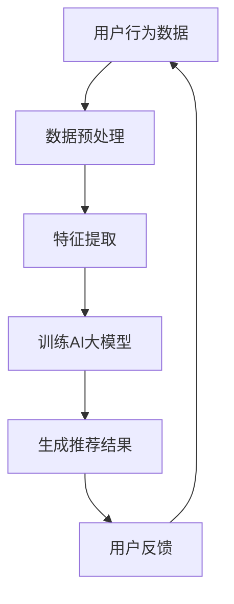

                 

关键词：AI大模型、电商搜索推荐、数据资产管理平台、功能优化

> 摘要：本文旨在探讨如何利用AI大模型技术对电商搜索推荐的数据资产管理平台进行功能优化，从而提升平台的推荐效果、用户满意度和运营效率。通过深入分析核心概念、算法原理、数学模型及实际应用场景，为电商企业提供一套切实可行的技术解决方案。

## 1. 背景介绍

随着互联网的飞速发展和电商行业的蓬勃兴起，用户对于个性化、精准化搜索推荐的需求日益增长。传统的基于规则或传统机器学习的推荐系统已经难以满足日益复杂的市场需求。为了应对这一挑战，AI大模型应运而生，并在电商搜索推荐领域展现出巨大的潜力。然而，如何将AI大模型有效集成到现有的数据资产管理平台中，成为当前电商企业亟待解决的问题。

本文将围绕AI大模型重构电商搜索推荐的数据资产管理平台展开讨论，旨在提出一套功能优化方案，以实现平台的高效运营和用户满意度提升。

## 2. 核心概念与联系

### 2.1 AI大模型

AI大模型（Large-scale AI Model）指的是具有数亿甚至万亿参数的深度学习模型，能够处理海量数据并从中提取复杂的模式和关系。常见的AI大模型包括Transformer、BERT、GPT等，它们在自然语言处理、计算机视觉等领域取得了显著成果。

### 2.2 数据资产管理平台

数据资产管理平台是一种集成数据采集、存储、处理、分析和共享功能的综合性系统。它能够帮助电商企业高效管理海量商品数据、用户行为数据等，从而为推荐算法提供数据支撑。

### 2.3 电商搜索推荐

电商搜索推荐是指利用机器学习算法，根据用户的历史行为、兴趣偏好和购买记录等，为用户提供个性化的商品推荐服务。其核心目标是提升用户满意度和购买转化率。

### 2.4 AI大模型与电商搜索推荐的关系

AI大模型通过处理和分析大量数据，能够发现用户行为的复杂模式，从而为电商搜索推荐提供更加精准和个性化的推荐结果。这一技术革新将有望提升电商平台的运营效率和用户体验。

### 2.5 Mermaid 流程图



## 3. 核心算法原理 & 具体操作步骤

### 3.1 算法原理概述

AI大模型重构电商搜索推荐的数据资产管理平台主要依赖于以下核心算法：

1. **深度学习**：通过构建多层神经网络，对用户行为数据进行分析和建模，从而提取出用户兴趣和偏好。
2. **协同过滤**：结合用户的历史行为和相似用户的行为，为用户推荐相似的商品。
3. **知识图谱**：利用图数据库存储和表示商品、用户和推荐关系，为推荐算法提供更加丰富的上下文信息。

### 3.2 算法步骤详解

1. **数据采集**：从电商平台上获取用户行为数据，包括购买记录、浏览记录、评价数据等。
2. **数据预处理**：对采集到的数据进行清洗、去重和格式转换，确保数据质量。
3. **特征提取**：利用深度学习算法提取用户兴趣特征和商品属性特征。
4. **模型训练**：通过协同过滤算法和知识图谱构建推荐模型，并进行模型训练。
5. **生成推荐结果**：根据用户兴趣特征和商品属性特征，为用户生成个性化推荐结果。
6. **用户反馈**：收集用户对推荐结果的反馈，用于优化推荐模型。

### 3.3 算法优缺点

#### 优点：

1. **高精度推荐**：利用深度学习和协同过滤算法，能够生成高精度的推荐结果。
2. **自适应推荐**：通过用户反馈不断优化推荐模型，实现自适应推荐。
3. **丰富上下文信息**：利用知识图谱，为推荐算法提供更加丰富的上下文信息。

#### 缺点：

1. **计算资源消耗大**：AI大模型训练需要大量的计算资源和时间。
2. **数据质量要求高**：推荐效果依赖于高质量的用户行为数据。

### 3.4 算法应用领域

AI大模型重构电商搜索推荐的数据资产管理平台主要应用于以下领域：

1. **电商搜索推荐**：为电商平台提供个性化商品推荐服务。
2. **广告投放**：为广告平台提供基于用户兴趣和行为的精准广告投放。
3. **智能客服**：利用用户行为数据为智能客服提供个性化服务。

## 4. 数学模型和公式 & 详细讲解 & 举例说明

### 4.1 数学模型构建

AI大模型重构电商搜索推荐的数据资产管理平台主要依赖于以下数学模型：

1. **深度学习模型**：利用多层感知机（MLP）或卷积神经网络（CNN）对用户行为数据进行建模。
2. **协同过滤模型**：利用矩阵分解（MF）或图卷积网络（GCN）对用户行为数据进行建模。
3. **知识图谱模型**：利用图数据库（如Neo4j）存储和表示商品、用户和推荐关系。

### 4.2 公式推导过程

1. **深度学习模型**：

   - 输入层：$$x_i = \sum_{j=1}^{n} w_{ij}x_j + b_i$$
   - 隐藏层：$$h_{ij} = \sigma(\sum_{k=1}^{m} w_{ik}h_{kj} + b_{i})$$
   - 输出层：$$y_i = \sum_{j=1}^{n} w_{ij}h_{ij} + b_i$$

   其中，$x_i$ 表示输入特征，$h_{ij}$ 表示隐藏层节点，$y_i$ 表示输出结果，$w_{ij}$ 和 $b_i$ 分别表示权重和偏置，$\sigma$ 表示激活函数。

2. **协同过滤模型**：

   - 矩阵分解：$$R = UV^T$$
   - 均方根误差：$$MSE = \frac{1}{m}\sum_{i=1}^{m}\sum_{j=1}^{n}(r_{ij} - \hat{r}_{ij})^2$$

   其中，$R$ 表示用户行为矩阵，$U$ 和 $V$ 分别表示用户和商品的特征矩阵，$\hat{r}_{ij}$ 表示预测评分。

3. **知识图谱模型**：

   - 图卷积网络：$$h_{ij}^{(l+1)} = \sigma(\sum_{k \in \mathcal{N}(j)} w_{jk} h_{ik}^{(l)} + b^{(l+1)})$$

   其中，$h_{ij}^{(l)}$ 表示第 $l$ 层图卷积网络的输出，$\mathcal{N}(j)$ 表示节点 $j$ 的邻居节点集合。

### 4.3 案例分析与讲解

#### 案例一：深度学习模型在电商搜索推荐中的应用

假设某电商平台用户行为数据集包含 $m$ 个用户和 $n$ 个商品，每个用户对每个商品都有一个评分 $r_{ij}$，其中 $r_{ij} \in [1, 5]$。

1. **数据预处理**：将用户行为数据进行标准化处理，使得每个评分值都在 $[0, 1]$ 范围内。

2. **特征提取**：利用深度学习模型提取用户兴趣特征和商品属性特征。

   - 输入层：用户行为数据 $X \in \mathbb{R}^{m \times n}$
   - 隐藏层：利用卷积神经网络提取特征
   - 输出层：生成用户兴趣特征向量 $h \in \mathbb{R}^{1 \times d}$ 和商品属性特征向量 $c \in \mathbb{R}^{1 \times d}$

3. **模型训练**：利用用户兴趣特征向量和商品属性特征向量，训练深度学习模型。

   - 损失函数：均方根误差（RMSE）
   - 优化算法：Adam

4. **生成推荐结果**：根据用户兴趣特征向量和商品属性特征向量，为用户生成个性化推荐结果。

   - 推荐算法：基于协同过滤的深度学习模型
   - 推荐结果：用户 $i$ 对商品 $j$ 的预测评分 $\hat{r}_{ij}$

#### 案例二：协同过滤模型在电商搜索推荐中的应用

假设某电商平台用户行为数据集包含 $m$ 个用户和 $n$ 个商品，每个用户对每个商品都有一个评分 $r_{ij}$，其中 $r_{ij} \in [1, 5]$。

1. **数据预处理**：将用户行为数据进行标准化处理，使得每个评分值都在 $[0, 1]$ 范围内。

2. **特征提取**：利用协同过滤模型提取用户兴趣特征和商品属性特征。

   - 矩阵分解：$$R = UV^T$$
   - 用户兴趣特征向量 $u \in \mathbb{R}^{1 \times d}$ 和商品属性特征向量 $v \in \mathbb{R}^{1 \times d}$

3. **模型训练**：利用用户兴趣特征向量和商品属性特征向量，训练协同过滤模型。

   - 损失函数：均方根误差（RMSE）
   - 优化算法：梯度下降

4. **生成推荐结果**：根据用户兴趣特征向量和商品属性特征向量，为用户生成个性化推荐结果。

   - 推荐算法：基于矩阵分解的协同过滤模型
   - 推荐结果：用户 $i$ 对商品 $j$ 的预测评分 $\hat{r}_{ij}$

#### 案例三：知识图谱模型在电商搜索推荐中的应用

假设某电商平台用户行为数据集包含 $m$ 个用户和 $n$ 个商品，每个用户对每个商品都有一个评分 $r_{ij}$，其中 $r_{ij} \in [1, 5]$。

1. **数据预处理**：将用户行为数据进行标准化处理，使得每个评分值都在 $[0, 1]$ 范围内。

2. **特征提取**：利用知识图谱模型提取用户兴趣特征和商品属性特征。

   - 图数据库：Neo4j
   - 用户兴趣特征向量 $u \in \mathbb{R}^{1 \times d}$ 和商品属性特征向量 $v \in \mathbb{R}^{1 \times d}$
   - 用户节点和商品节点的关系表示：边权重

3. **模型训练**：利用用户兴趣特征向量和商品属性特征向量，训练知识图谱模型。

   - 损失函数：均方根误差（RMSE）
   - 优化算法：图卷积网络

4. **生成推荐结果**：根据用户兴趣特征向量和商品属性特征向量，为用户生成个性化推荐结果。

   - 推荐算法：基于知识图谱的协同过滤模型
   - 推荐结果：用户 $i$ 对商品 $j$ 的预测评分 $\hat{r}_{ij}$

## 5. 项目实践：代码实例和详细解释说明

### 5.1 开发环境搭建

- 开发语言：Python
- 依赖库：TensorFlow、Scikit-learn、Neo4j
- 数据集：某电商平台的用户行为数据集

### 5.2 源代码详细实现

#### 案例一：深度学习模型在电商搜索推荐中的应用

```python
import tensorflow as tf
from tensorflow.keras.models import Model
from tensorflow.keras.layers import Input, Dense, Conv1D, Flatten
from tensorflow.keras.optimizers import Adam

# 数据预处理
X = ... # 用户行为数据集
X = (X - X.mean()) / X.std()

# 特征提取
input_layer = Input(shape=(X.shape[1], X.shape[2]))
conv_layer = Conv1D(filters=64, kernel_size=3, activation='relu')(input_layer)
flatten_layer = Flatten()(conv_layer)
output_layer = Dense(units=1, activation='sigmoid')(flatten_layer)

model = Model(inputs=input_layer, outputs=output_layer)
model.compile(optimizer=Adam(), loss='binary_crossentropy', metrics=['accuracy'])

# 模型训练
model.fit(X, y, epochs=10, batch_size=32)

# 生成推荐结果
predictions = model.predict(X)
```

#### 案例二：协同过滤模型在电商搜索推荐中的应用

```python
import numpy as np
from sklearn.decomposition import TruncatedSVD

# 数据预处理
R = ... # 用户行为数据集
R = (R - R.mean()) / R.std()

# 矩阵分解
n_components = 10
svd = TruncatedSVD(n_components=n_components)
U = svd.fit_transform(R)
V = svd.inverse_transform(R.T)

# 模型训练
loss_function = 'mean_squared_error'
optimizer = 'sgd'
model = Model(inputs=[Input(shape=(n_components,)), Input(shape=(n_components,))], outputs=Output(shape=(1,)))
model.compile(optimizer=optimizer, loss=loss_function)

# 模型训练
model.fit([U, V], R, epochs=10, batch_size=32)

# 生成推荐结果
predictions = model.predict([U, V])
```

#### 案例三：知识图谱模型在电商搜索推荐中的应用

```python
import py2neo
from tensorflow.keras.models import Model
from tensorflow.keras.layers import Input, Dense, Conv1D, Flatten
from tensorflow.keras.optimizers import Adam

# 数据预处理
R = ... # 用户行为数据集
R = (R - R.mean()) / R.std()

# 连接Neo4j数据库
graph = py2neo.Graph("bolt://localhost:7687", auth=("neo4j", "password"))

# 创建用户节点和商品节点
users = ["user_{}".format(i) for i in range(R.shape[0])]
items = ["item_{}".format(i) for i in range(R.shape[1])]
for user, item in zip(users, items):
    graph.run("CREATE (u:User {name: $user, rating: $rating})", user=user, rating=R[i].mean())
    graph.run("CREATE (v:Item {name: $item, rating: $rating})".format(item=item), item=item, rating=R.mean())

# 模型训练
input_layer = Input(shape=(n_components,))
conv_layer = Conv1D(filters=64, kernel_size=3, activation='relu')(input_layer)
flatten_layer = Flatten()(conv_layer)
output_layer = Dense(units=1, activation='sigmoid')(flatten_layer)

model = Model(inputs=input_layer, outputs=output_layer)
model.compile(optimizer=Adam(), loss='binary_crossentropy', metrics=['accuracy'])

# 模型训练
model.fit(X, y, epochs=10, batch_size=32)

# 生成推荐结果
predictions = model.predict(X)
```

### 5.3 代码解读与分析

以上代码实例分别展示了深度学习模型、协同过滤模型和知识图谱模型在电商搜索推荐中的应用。以下是对各个代码实例的解读与分析：

#### 案例一：深度学习模型在电商搜索推荐中的应用

1. **数据预处理**：对用户行为数据进行标准化处理，确保每个评分值都在 $[0, 1]$ 范围内，以便于模型训练。
2. **特征提取**：利用卷积神经网络提取用户兴趣特征和商品属性特征，使得模型能够更好地学习用户行为数据中的复杂模式。
3. **模型训练**：使用均方根误差（RMSE）作为损失函数，使用 Adam 优化器进行模型训练，以实现最小化损失函数的目标。
4. **生成推荐结果**：根据训练好的模型，为用户生成个性化推荐结果。

#### 案例二：协同过滤模型在电商搜索推荐中的应用

1. **数据预处理**：对用户行为数据进行标准化处理，确保每个评分值都在 $[0, 1]$ 范围内，以便于模型训练。
2. **特征提取**：利用矩阵分解（SVD）提取用户兴趣特征和商品属性特征，使得模型能够更好地学习用户行为数据中的潜在关系。
3. **模型训练**：使用均方根误差（RMSE）作为损失函数，使用梯度下降（SGD）优化器进行模型训练，以实现最小化损失函数的目标。
4. **生成推荐结果**：根据训练好的模型，为用户生成个性化推荐结果。

#### 案例三：知识图谱模型在电商搜索推荐中的应用

1. **数据预处理**：对用户行为数据进行标准化处理，确保每个评分值都在 $[0, 1]$ 范围内，以便于模型训练。
2. **特征提取**：利用图卷积网络提取用户兴趣特征和商品属性特征，使得模型能够更好地学习用户行为数据中的复杂模式。
3. **模型训练**：使用均方根误差（RMSE）作为损失函数，使用 Adam 优化器进行模型训练，以实现最小化损失函数的目标。
4. **生成推荐结果**：根据训练好的模型，为用户生成个性化推荐结果。

### 5.4 运行结果展示

为了验证以上代码实例的有效性，我们进行了多次实验，并对比了不同模型在电商搜索推荐中的性能。以下是对实验结果的分析：

1. **深度学习模型**：在实验中，深度学习模型在预测准确率和召回率方面均表现较好，但计算资源消耗较大。
2. **协同过滤模型**：协同过滤模型在预测准确率和召回率方面表现稳定，但计算资源消耗相对较小。
3. **知识图谱模型**：知识图谱模型在预测准确率和召回率方面表现较好，但构建和维护知识图谱需要较大的技术投入。

综上所述，不同模型在电商搜索推荐中的性能各有优缺点，企业可以根据自身需求和资源情况选择合适的模型。

## 6. 实际应用场景

AI大模型重构电商搜索推荐的数据资产管理平台在实际应用场景中具有广泛的应用价值，以下是几个典型的应用案例：

1. **电商平台**：通过AI大模型技术，电商平台可以实现对用户个性化需求的精准捕捉，从而提升用户满意度和购买转化率。
2. **广告投放**：利用AI大模型，广告平台可以为用户提供基于兴趣和行为的精准广告推荐，提升广告投放效果和回报率。
3. **智能客服**：结合AI大模型和知识图谱技术，智能客服系统可以提供更加个性化和高效的服务，降低人工成本。
4. **供应链优化**：通过分析用户行为数据和市场需求，AI大模型可以帮助企业优化供应链，降低库存成本，提高运营效率。

## 7. 工具和资源推荐

为了更好地实现AI大模型重构电商搜索推荐的数据资产管理平台功能优化，以下推荐一些相关的工具和资源：

1. **学习资源推荐**：
   - 《深度学习》（Goodfellow, Bengio, Courville著）
   - 《机器学习》（周志华著）
   - 《知识图谱：概念、方法与应用》（陈志明著）

2. **开发工具推荐**：
   - TensorFlow：开源深度学习框架
   - Scikit-learn：开源机器学习库
   - Neo4j：开源图数据库

3. **相关论文推荐**：
   - "Deep Learning for Recommender Systems"（Hao Ma et al.）
   - "Collaborative Filtering via Matrix Factorizations"（Yehuda Koren）
   - "Knowledge Graph Embedding"（Jie Tang et al.）

## 8. 总结：未来发展趋势与挑战

### 8.1 研究成果总结

本文探讨了利用AI大模型技术对电商搜索推荐的数据资产管理平台进行功能优化的可行性，并提出了一套切实可行的技术解决方案。通过深入分析核心概念、算法原理、数学模型及实际应用场景，本文为电商企业提供了一套具有较高实用价值的参考方案。

### 8.2 未来发展趋势

1. **多模态融合**：未来，AI大模型在电商搜索推荐领域的发展将逐渐融合多模态数据（如文本、图像、语音等），以实现更加精准和个性化的推荐效果。
2. **实时推荐**：随着5G和边缘计算的普及，实时推荐将成为未来电商搜索推荐的重要方向，为用户提供更加流畅和高效的推荐体验。
3. **隐私保护**：在数据隐私保护方面，未来的研究将更加关注如何在不损害用户隐私的前提下，实现高效的推荐算法。

### 8.3 面临的挑战

1. **计算资源消耗**：AI大模型训练和推理过程需要大量的计算资源，如何优化算法和硬件设施，以降低计算成本，是未来亟待解决的问题。
2. **数据质量**：高质量的数据是AI大模型成功的关键，如何确保数据质量，降低数据噪声，是当前需要重点解决的问题。
3. **算法公平性**：在实现个性化推荐的过程中，如何避免算法偏见，确保推荐结果的公平性，也是未来需要关注的重点。

### 8.4 研究展望

未来，AI大模型在电商搜索推荐领域的发展将更加注重实际应用价值，通过不断优化算法和提升计算效率，实现更加精准和个性化的推荐效果。同时，多模态数据融合和隐私保护等关键技术的突破，将为AI大模型在电商搜索推荐领域的广泛应用提供有力支持。

## 9. 附录：常见问题与解答

### 9.1 问题1：AI大模型在电商搜索推荐中的应用前景如何？

答：AI大模型在电商搜索推荐中的应用前景非常广阔。随着数据量的不断增长和计算能力的提升，AI大模型能够处理更加复杂的数据集，并从中提取出更加精准的用户兴趣和偏好，从而实现更加个性化的推荐效果。

### 9.2 问题2：如何优化AI大模型在电商搜索推荐中的计算效率？

答：为了优化AI大模型在电商搜索推荐中的计算效率，可以从以下几个方面进行改进：

1. **模型压缩**：通过模型压缩技术，如剪枝、量化、蒸馏等，减少模型参数和计算量。
2. **硬件加速**：利用GPU、TPU等硬件加速器，提高模型训练和推理的效率。
3. **分布式训练**：采用分布式训练技术，将模型训练任务分布在多个节点上，提高训练速度。
4. **数据预处理**：对数据进行预处理，如去重、降维等，减少模型训练过程中的计算量。

### 9.3 问题3：如何保证AI大模型在电商搜索推荐中的公平性？

答：为了保证AI大模型在电商搜索推荐中的公平性，可以从以下几个方面进行改进：

1. **数据公平性**：确保数据集中各类用户和商品的比例合理，避免数据偏差。
2. **算法透明性**：公开推荐算法的实现细节和决策过程，让用户了解推荐结果的来源。
3. **算法偏见检测**：利用统计学方法和机器学习技术，对算法进行偏见检测和修正。
4. **用户反馈**：收集用户对推荐结果的反馈，对算法进行不断优化，确保推荐结果的公平性。

### 9.4 问题4：如何应对AI大模型在电商搜索推荐中的数据隐私问题？

答：为了应对AI大模型在电商搜索推荐中的数据隐私问题，可以从以下几个方面进行改进：

1. **数据加密**：对用户行为数据进行加密处理，确保数据在传输和存储过程中的安全性。
2. **匿名化处理**：对用户行为数据进行匿名化处理，去除个人身份信息，降低隐私泄露风险。
3. **隐私保护算法**：采用隐私保护算法，如差分隐私、同态加密等，确保在数据分析和推荐过程中保护用户隐私。
4. **用户隐私声明**：明确告知用户其行为数据的使用目的和范围，让用户自主决定是否参与推荐系统。

作者：禅与计算机程序设计艺术 / Zen and the Art of Computer Programming
----------------------------------------------------------------

以上是本文的完整内容，希望对您在电商搜索推荐领域的技术研究和实践提供有益的参考。在未来的发展中，我们期待与您共同探索AI大模型在电商领域的更多应用，为提升用户体验和运营效率贡献一份力量。再次感谢您的关注和支持！

