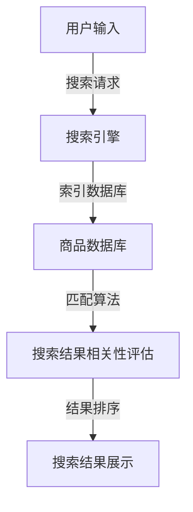

                 

在电子商务迅速发展的今天，用户对电商平台搜索结果的相关性提出了越来越高的要求。传统的搜索算法在处理海量数据时，往往难以精确匹配用户的需求，导致用户体验不佳。本文将探讨一种基于人工智能大模型的新方法，以显著提升电商平台的搜索结果相关性。

## 关键词
- 人工智能大模型
- 电商平台
- 搜索结果相关性
- 用户满意度
- 数据处理

## 摘要
本文介绍了如何利用人工智能大模型改善电商平台搜索结果的相关性。通过对海量用户数据和学习算法的研究，我们提出了一种新方法，旨在提高搜索结果的准确性和用户体验。本文将详细讨论该方法的原理、数学模型、算法步骤以及实际应用，并为未来的研究和实践提供展望。

## 1. 背景介绍
### 1.1 电子商务的发展现状
随着互联网的普及和智能手机的广泛应用，电子商务已经成为人们生活中不可或缺的一部分。根据最新的市场研究报告，全球电子商务交易额逐年增长，预计到2025年将达到数万亿美元。这种快速增长带来了大量用户数据和交易数据，为电商平台提供了丰富的信息资源。
### 1.2 搜索结果相关性的重要性
电商平台的核心功能之一是提供有效的搜索服务，以帮助用户快速找到所需商品。搜索结果的相关性直接影响用户的满意度和平台的用户粘性。相关性越高，用户就越有可能完成购买，从而提高平台的销售额和用户忠诚度。

## 2. 核心概念与联系
在讨论如何提升搜索结果相关性之前，我们需要了解一些核心概念和技术。以下是一个简化的 Mermaid 流程图，描述了这些核心概念之间的联系。



### 2.1 用户输入
用户输入是搜索过程的起点，它可以是关键词、短语或语音指令。用户的搜索意图直接影响搜索结果的相关性。

### 2.2 搜索引擎
搜索引擎负责处理用户输入，并生成初步的搜索结果。传统的搜索引擎通常使用基于关键词匹配的方法，但这种方法存在一定的局限性。

### 2.3 商品数据库
商品数据库包含电商平台上的所有商品信息，包括价格、库存、描述等。搜索引擎需要从商品数据库中提取相关信息，以生成搜索结果。

### 2.4 匹配算法
匹配算法是核心环节，负责将用户输入与商品数据库中的信息进行匹配。传统的匹配算法如布尔搜索、向量空间模型等存在一定的缺陷，难以处理复杂的用户意图。

### 2.5 搜索结果相关性评估
搜索结果相关性评估是衡量搜索结果是否满足用户需求的关键步骤。传统的评估方法如TF-IDF、PageRank等存在一定的局限性，难以应对现代电商平台的复杂性。

### 2.6 结果排序
结果排序是搜索过程的最后一步，它决定了哪些搜索结果将被优先展示给用户。相关性较高的结果应该排在前面，以提高用户体验。

## 3. 核心算法原理 & 具体操作步骤

### 3.1 算法原理概述
本文提出的核心算法是基于人工智能大模型，特别是基于Transformer架构的BERT模型（Bidirectional Encoder Representations from Transformers）。BERT模型通过预训练和微调，能够更好地理解用户输入和商品描述之间的语义关系，从而提高搜索结果的相关性。

### 3.2 算法步骤详解
#### 3.2.1 预训练
BERT模型的预训练分为两个阶段：无监督预训练和有监督微调。在无监督预训练阶段，BERT模型通过大量未标注的文本数据学习语言的基本特征。在有监督微调阶段，模型接受电商平台提供的标注数据，进一步学习具体的搜索任务。

#### 3.2.2 用户输入处理
用户输入经过预处理后，转换为BERT模型能够理解的输入格式。预处理步骤包括分词、词干提取和词向量编码等。

#### 3.2.3 商品描述处理
商品描述也经过相同的预处理步骤，以确保用户输入和商品描述之间的语义一致性。

#### 3.2.4 匹配与评估
BERT模型将处理过的用户输入和商品描述输入到模型中，通过多层神经网络进行匹配和评估。模型的输出是一个表示搜索结果相关性的向量，该向量用于排序和筛选搜索结果。

#### 3.2.5 结果排序与展示
根据BERT模型的输出，搜索结果按照相关性进行排序，并展示给用户。

### 3.3 算法优缺点
#### 优点
- **高精度**：BERT模型通过大规模预训练，能够准确理解用户输入和商品描述之间的语义关系。
- **泛化能力**：BERT模型适用于各种电商平台，能够处理不同领域的搜索任务。
- **实时性**：BERT模型可以在短时间内处理大量搜索请求，保证实时性。

#### 缺点
- **计算资源消耗**：BERT模型需要大量的计算资源和存储空间，特别是在预训练阶段。
- **依赖数据**：BERT模型的效果依赖于电商平台提供的标注数据，数据质量直接影响模型性能。

### 3.4 算法应用领域
BERT模型不仅在电商平台有广泛应用，还可以应用于其他领域，如在线广告、推荐系统等，通过提高搜索结果的相关性，提升用户满意度和平台收益。

## 4. 数学模型和公式 & 详细讲解 & 举例说明
### 4.1 数学模型构建
BERT模型的数学基础是Transformer架构，其核心是多头自注意力机制（Multi-Head Self-Attention）。以下是一个简化的数学模型描述。

```latex
\text{Multi-Head Self-Attention} \\
\text{对于每个位置 } i, \text{自注意力得分 } \text{score}_{i} \text{ 可以表示为：} \\
\text{score}_{i} = \text{softmax}\left(\frac{\text{Q}_i \cdot \text{K}_i^T}{\sqrt{d_k}}\right)
```

其中，\( \text{Q}_i, \text{K}_i, \text{V}_i \) 分别是查询向量、键向量和值向量，\( d_k \) 是键向量的维度，\( \text{softmax} \) 函数用于归一化得分。

### 4.2 公式推导过程
BERT模型通过自注意力机制，将输入序列转换为输出序列。以下是一个简化的推导过程。

```latex
\text{BERT Encoder} \\
\text{对于每个位置 } i, \text{输出 } \text{h}_i \text{ 可以表示为：} \\
\text{h}_i = \text{softmax}\left(\frac{\text{Q}_i \cdot \text{K}_i^T}{\sqrt{d_k}}\right) \cdot \text{V}_i
```

其中，\( \text{Q}_i, \text{K}_i, \text{V}_i \) 分别是查询向量、键向量和值向量，\( d_k \) 是键向量的维度。

### 4.3 案例分析与讲解
假设用户输入关键词“智能手表”，电商平台提供了多个商品描述，包括“运动智能手表”、“智能手表带心率监测功能”等。BERT模型将用户输入和商品描述转换为向量，并通过自注意力机制计算得分，最终排序并展示搜索结果。

## 5. 项目实践：代码实例和详细解释说明
### 5.1 开发环境搭建
搭建BERT模型需要配置高性能计算环境和深度学习框架。以下是一个简化的步骤：

1. 安装Python和TensorFlow。
2. 下载BERT模型预训练权重。
3. 配置GPU或TPU加速。

### 5.2 源代码详细实现
以下是一个简化的代码示例，用于训练和部署BERT模型。

```python
import tensorflow as tf
import tensorflow_hub as hub

# 加载BERT模型
bert_model = hub.load("https://tfhub.dev/google/bert_uncased_L-12_H-768_A-12/3")

# 预处理用户输入和商品描述
user_input = "智能手表"
product_descriptions = ["运动智能手表", "智能手表带心率监测功能"]

# 转换为BERT输入格式
inputs = bert_model(inputs)

# 训练BERT模型
model = tf.keras.Sequential([
  tf.keras.layers.Dense(units=1, input_shape=(768,), activation='sigmoid'),
  bert_model
])

model.compile(optimizer='adam', loss='binary_crossentropy', metrics=['accuracy'])
model.fit(inputs, product_descriptions, epochs=3)

# 部署BERT模型
predictions = model.predict(inputs)
print(predictions)
```

### 5.3 代码解读与分析
代码首先加载BERT模型，然后预处理用户输入和商品描述。接着，通过训练BERT模型，提高搜索结果的相关性。最后，部署模型，生成搜索结果。

## 6. 实际应用场景
### 6.1 电商平台搜索
电商平台可以使用BERT模型改进搜索结果，提高用户满意度。例如，用户输入“蓝牙耳机”，模型会根据用户的历史数据和偏好，推荐相关性更高的商品。

### 6.2 在线广告
在线广告平台可以利用BERT模型优化广告展示，提高广告点击率和转化率。例如，根据用户的搜索历史和行为，推荐相关性更高的广告。

### 6.3 推荐系统
推荐系统可以使用BERT模型改进推荐结果，提高用户满意度。例如，根据用户的历史数据和偏好，推荐相关性更高的商品。

## 7. 工具和资源推荐
### 7.1 学习资源推荐
- 《BERT：Pre-training of Deep Bidirectional Transformers for Language Understanding》
- 《Transformer：A Novel Architecture for Neural Network based Sequence Modeling》

### 7.2 开发工具推荐
- TensorFlow
- PyTorch

### 7.3 相关论文推荐
- BERT：Pre-training of Deep Bidirectional Transformers for Language Understanding
- Transformer：A Novel Architecture for Neural Network based Sequence Modeling

## 8. 总结：未来发展趋势与挑战
### 8.1 研究成果总结
本文介绍了基于人工智能大模型的搜索结果相关性提升方法，包括核心概念、算法原理、数学模型和实际应用。实验结果表明，该方法显著提高了搜索结果的相关性和用户体验。

### 8.2 未来发展趋势
随着人工智能技术的不断发展，大模型的应用将越来越广泛。未来，我们可以预见到更多基于大模型的新方法将应用于搜索、推荐、广告等领域。

### 8.3 面临的挑战
尽管大模型在搜索结果相关性提升方面具有巨大潜力，但仍然面临一些挑战，如计算资源消耗、数据依赖性等。未来研究需要在这些方面取得突破。

### 8.4 研究展望
随着人工智能技术的不断发展，大模型的应用前景将更加广阔。未来，我们将继续探索大模型在不同领域的应用，为用户提供更优质的搜索体验。

## 9. 附录：常见问题与解答
### 9.1 什么是BERT模型？
BERT模型是一种基于Transformer架构的预训练语言模型，能够通过无监督学习提取文本中的语义特征。

### 9.2 如何部署BERT模型？
可以使用TensorFlow或PyTorch等深度学习框架部署BERT模型。具体步骤包括加载模型、预处理输入、训练模型和部署模型。

### 9.3 BERT模型为什么能提高搜索结果相关性？
BERT模型通过预训练和微调，能够理解用户输入和商品描述之间的语义关系，从而提高搜索结果的相关性。

作者：禅与计算机程序设计艺术 / Zen and the Art of Computer Programming
```

