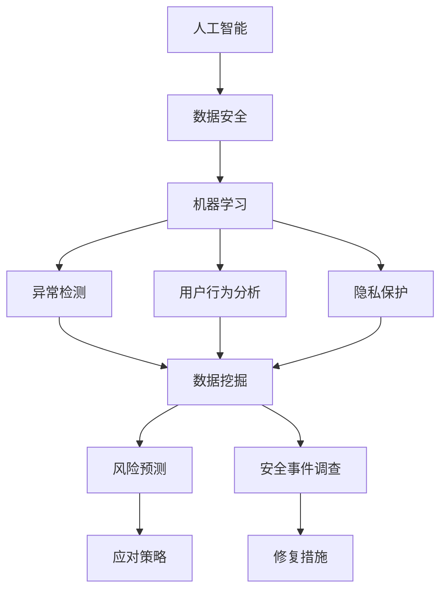

                 

关键词：人工智能、电商、用户数据安全、风险控制、隐私保护、机器学习、数据挖掘、区块链、加密技术、网络安全

> 摘要：随着电子商务的迅猛发展，用户数据的积累和共享成为电商企业的重要资产。然而，数据安全问题日益突出，尤其是用户隐私泄露和数据滥用的风险。本文将探讨人工智能在电商领域中的应用，特别是如何利用AI技术帮助电商企业进行用户数据安全风险控制，确保数据隐私和系统安全。

## 1. 背景介绍

随着互联网的普及和电子商务的快速发展，越来越多的用户选择在线购物，这为电商企业带来了巨大的商业价值。然而，用户数据的积累和共享也带来了新的挑战。用户数据通常包括个人信息、购买行为、浏览历史等敏感信息，这些数据对于电商企业来说至关重要。同时，用户对数据隐私和安全的要求越来越高，任何数据泄露事件都会对企业的声誉造成严重影响。

### 1.1 数据安全风险

数据安全风险主要包括以下几个方面：

- **数据泄露**：未经授权的访问和泄露用户数据，可能导致用户隐私被侵犯。
- **数据篡改**：恶意攻击者可能篡改用户数据，造成数据不准确或者不可信。
- **数据滥用**：企业可能滥用用户数据，用于商业利益或者不当目的。

### 1.2 电商企业的数据安全需求

电商企业需要确保以下数据安全需求：

- **数据加密**：对敏感数据进行加密，防止未经授权的访问。
- **访问控制**：设置严格的访问控制策略，限制不同角色的用户访问权限。
- **审计和监控**：对系统进行实时监控和审计，及时发现潜在的安全威胁。

### 1.3 人工智能在数据安全中的应用

人工智能（AI）技术在数据安全领域具有巨大的潜力。通过机器学习和数据挖掘技术，AI可以自动识别潜在的安全威胁，并采取相应的措施进行风险控制。具体来说，AI在电商领域的应用主要包括以下几个方面：

- **异常检测**：通过分析用户行为和购买模式，识别异常行为，并及时采取措施。
- **用户行为分析**：分析用户的购买行为和浏览习惯，预测潜在风险，并提前预警。
- **隐私保护**：利用AI技术实现数据去标识化和隐私保护，确保用户数据的匿名性。

## 2. 核心概念与联系

### 2.1 人工智能与数据安全

人工智能在数据安全中的应用主要包括以下几个方面：

- **机器学习**：通过分析大量的数据，机器学习算法可以自动识别潜在的安全威胁，并采取相应的措施进行风险控制。
- **数据挖掘**：数据挖掘技术可以从大量的数据中提取有价值的信息，帮助电商企业发现潜在的风险和威胁。
- **加密技术**：利用加密技术对敏感数据进行加密，确保数据在传输和存储过程中的安全性。

### 2.2 机器学习算法与数据安全

机器学习算法在数据安全中的应用主要包括以下几个方面：

- **异常检测**：通过分析用户行为数据，机器学习算法可以识别出异常行为，并及时发出警报。
- **用户行为分析**：通过分析用户的购买行为和浏览习惯，机器学习算法可以预测潜在的风险，并提前预警。
- **隐私保护**：利用机器学习算法实现数据去标识化和隐私保护，确保用户数据的匿名性。

### 2.3 数据挖掘与数据安全

数据挖掘技术在数据安全中的应用主要包括以下几个方面：

- **用户行为分析**：通过对用户行为数据的分析，数据挖掘技术可以帮助电商企业发现潜在的安全威胁。
- **风险预测**：通过分析历史数据，数据挖掘技术可以预测未来可能发生的风险，并提供相应的应对策略。
- **安全事件调查**：在发生数据泄露或其他安全事件时，数据挖掘技术可以帮助企业迅速定位问题，并采取有效的措施进行修复。

### 2.4 加密技术与数据安全

加密技术在数据安全中的应用主要包括以下几个方面：

- **数据传输加密**：在数据传输过程中，加密技术可以确保数据不被截获或篡改。
- **数据存储加密**：在数据存储过程中，加密技术可以确保数据不被未经授权的访问。
- **身份验证**：加密技术可以用于身份验证，确保只有授权用户可以访问敏感数据。

### 2.5 Mermaid 流程图

以下是一个简单的 Mermaid 流程图，展示了人工智能、机器学习、数据挖掘和加密技术之间的关系：



## 3. 核心算法原理 & 具体操作步骤

### 3.1 算法原理概述

在数据安全风险控制中，常用的算法原理包括异常检测、用户行为分析、隐私保护和数据挖掘。以下是这些算法的简要原理概述：

- **异常检测**：通过分析用户行为数据，识别异常行为。异常检测通常基于统计模型、聚类算法或神经网络。
- **用户行为分析**：通过对用户行为数据的分析，预测潜在的风险。用户行为分析通常基于机器学习算法，如决策树、随机森林或支持向量机。
- **隐私保护**：通过数据去标识化或加密技术，确保用户数据的匿名性。隐私保护技术包括K-anonymity、l-diversity和t-closeness。
- **数据挖掘**：通过对大量数据进行分析，发现潜在的安全威胁。数据挖掘技术包括关联规则挖掘、分类和聚类。

### 3.2 算法步骤详解

以下是数据安全风险控制中的核心算法步骤：

#### 3.2.1 异常检测

1. **数据收集**：收集用户行为数据，如登录时间、购买金额、浏览页面等。
2. **数据预处理**：对数据进行清洗和归一化处理，去除噪声和异常值。
3. **特征提取**：从原始数据中提取特征，如时间间隔、购买频率等。
4. **模型训练**：使用统计模型、聚类算法或神经网络训练异常检测模型。
5. **异常检测**：使用训练好的模型对用户行为数据进行异常检测，识别异常行为。
6. **警报和措施**：对识别出的异常行为进行警报，并采取相应的措施进行风险控制。

#### 3.2.2 用户行为分析

1. **数据收集**：收集用户行为数据，如购买历史、浏览记录等。
2. **数据预处理**：对数据进行清洗和归一化处理，去除噪声和异常值。
3. **特征提取**：从原始数据中提取特征，如购买金额、购买频率等。
4. **模型训练**：使用机器学习算法训练用户行为分析模型，如决策树、随机森林或支持向量机。
5. **用户行为分析**：使用训练好的模型对用户行为数据进行分析，预测潜在的风险。
6. **警报和措施**：对识别出的风险进行警报，并采取相应的措施进行风险控制。

#### 3.2.3 隐私保护

1. **数据收集**：收集用户行为数据，如登录时间、购买金额、浏览页面等。
2. **数据预处理**：对数据进行清洗和归一化处理，去除噪声和异常值。
3. **数据去标识化**：使用K-anonymity、l-diversity和t-closeness等技术对数据进行去标识化处理。
4. **数据加密**：使用加密技术对敏感数据进行加密。
5. **隐私保护验证**：验证去标识化和加密处理后的数据是否满足隐私保护要求。
6. **数据存储和共享**：将处理后的数据进行存储和共享，确保用户隐私不受侵犯。

#### 3.2.4 数据挖掘

1. **数据收集**：收集大量用户行为数据，如购买历史、浏览记录等。
2. **数据预处理**：对数据进行清洗和归一化处理，去除噪声和异常值。
3. **特征提取**：从原始数据中提取特征，如购买金额、购买频率等。
4. **模型选择**：选择合适的模型，如关联规则挖掘、分类和聚类。
5. **模型训练**：使用训练数据训练模型。
6. **风险预测**：使用训练好的模型对用户行为数据进行分析，预测潜在的风险。
7. **结果分析和措施**：对预测结果进行分析，并采取相应的措施进行风险控制。

### 3.3 算法优缺点

#### 3.3.1 异常检测

- **优点**：
  - 可以实时检测和识别异常行为。
  - 对恶意攻击和异常活动具有较好的检测效果。
- **缺点**：
  - 对正常用户行为的误判率较高。
  - 需要大量的训练数据和计算资源。

#### 3.3.2 用户行为分析

- **优点**：
  - 可以预测用户行为，识别潜在的风险。
  - 对正常用户行为的适应性好。
- **缺点**：
  - 对异常行为的识别能力有限。
  - 需要大量的训练数据和计算资源。

#### 3.3.3 隐私保护

- **优点**：
  - 可以确保用户数据的匿名性和隐私保护。
  - 可以有效防止数据泄露和滥用。
- **缺点**：
  - 增加了数据处理的复杂性。
  - 可能会影响数据的质量和可用性。

#### 3.3.4 数据挖掘

- **优点**：
  - 可以从大量数据中提取有价值的信息。
  - 可以发现潜在的安全威胁和风险。
- **缺点**：
  - 对数据质量和数据量要求较高。
  - 可能会产生过拟合现象。

### 3.4 算法应用领域

人工智能算法在数据安全风险控制中的应用领域非常广泛，主要包括以下几个方面：

- **网络安全**：通过异常检测和用户行为分析，识别网络攻击和恶意行为。
- **数据隐私保护**：通过隐私保护技术，确保用户数据的匿名性和隐私保护。
- **金融安全**：通过用户行为分析和数据挖掘，预测金融风险和欺诈行为。
- **智能监控**：通过异常检测和用户行为分析，实现智能监控和风险预警。

## 4. 数学模型和公式 & 详细讲解 & 举例说明

### 4.1 数学模型构建

在数据安全风险控制中，常用的数学模型包括统计模型、机器学习模型和加密模型。以下是这些模型的简要构建过程：

#### 4.1.1 统计模型

统计模型主要用于异常检测和用户行为分析。以下是一个简单的统计模型构建过程：

1. **假设**：假设用户行为数据服从某个分布，如正态分布或泊松分布。
2. **特征提取**：从原始数据中提取特征，如时间间隔、购买金额等。
3. **模型参数估计**：使用最大似然估计或最小二乘法估计模型参数。
4. **模型评估**：使用交叉验证或测试集评估模型性能。

#### 4.1.2 机器学习模型

机器学习模型主要用于异常检测、用户行为分析和隐私保护。以下是一个简单的机器学习模型构建过程：

1. **数据收集**：收集用户行为数据，如登录时间、购买金额、浏览页面等。
2. **数据预处理**：对数据进行清洗和归一化处理，去除噪声和异常值。
3. **特征提取**：从原始数据中提取特征，如时间间隔、购买频率等。
4. **模型选择**：选择合适的机器学习算法，如决策树、随机森林或支持向量机。
5. **模型训练**：使用训练数据训练模型。
6. **模型评估**：使用交叉验证或测试集评估模型性能。

#### 4.1.3 加密模型

加密模型主要用于数据隐私保护和数据传输加密。以下是一个简单的加密模型构建过程：

1. **选择加密算法**：选择合适的加密算法，如AES、RSA等。
2. **密钥生成**：生成加密密钥。
3. **数据加密**：使用加密算法对数据进行加密。
4. **数据解密**：使用解密算法对加密数据进行解密。

### 4.2 公式推导过程

以下是几个常用的数学公式的推导过程：

#### 4.2.1 最大似然估计

最大似然估计是一种参数估计方法，用于估计模型参数。以下是一个简单的推导过程：

1. **概率密度函数**：假设用户行为数据服从正态分布，概率密度函数为：

   $$ f(x|\mu,\sigma^2) = \frac{1}{\sqrt{2\pi\sigma^2}}e^{-\frac{(x-\mu)^2}{2\sigma^2}} $$

   其中，$x$为观测值，$\mu$为均值，$\sigma^2$为方差。

2. **似然函数**：似然函数为概率密度函数的乘积：

   $$ L(\mu,\sigma^2|x) = \prod_{i=1}^n f(x_i|\mu,\sigma^2) $$

3. **对数似然函数**：对数似然函数为似然函数的对数：

   $$ \ln L(\mu,\sigma^2|x) = \sum_{i=1}^n \ln f(x_i|\mu,\sigma^2) $$

4. **最大似然估计**：对对数似然函数求导并令导数为零，得到最大似然估计：

   $$ \frac{\partial \ln L(\mu,\sigma^2|x)}{\partial \mu} = 0 $$
   
   $$ \frac{\partial \ln L(\mu,\sigma^2|x)}{\partial \sigma^2} = 0 $$

   解得：

   $$ \hat{\mu} = \frac{1}{n}\sum_{i=1}^n x_i $$
   
   $$ \hat{\sigma}^2 = \frac{1}{n}\sum_{i=1}^n (x_i - \hat{\mu})^2 $$

#### 4.2.2 决策树

决策树是一种常见的分类算法。以下是一个简单的推导过程：

1. **信息增益**：信息增益是一个特征对分类能力的度量，计算公式为：

   $$ IG(A,C) = H(C) - H(C|A) $$

   其中，$H(C)$为类别$C$的熵，$H(C|A)$为在特征$A$下类别$C$的条件熵。

2. **基尼不纯度**：基尼不纯度是另一种特征对分类能力的度量，计算公式为：

   $$ Gini(A,C) = 1 - \sum_{i=1}^k \frac{1}{k}\left[1 - \frac{1}{k}\sum_{j=1}^k f_{ij}\right] $$

   其中，$f_{ij}$为类别$i$在特征$A$下的比例。

3. **决策树生成**：根据信息增益或基尼不纯度选择最佳特征，并按照该特征划分数据集。递归地生成子节点，直到满足停止条件（如叶子节点数量达到阈值）。

### 4.3 案例分析与讲解

#### 4.3.1 异常检测

假设我们要对电商平台的用户行为进行异常检测，数据包括登录时间、购买金额和浏览页面等。

1. **数据收集**：收集一个月的用户行为数据，包括登录时间和购买金额。

2. **数据预处理**：对数据进行清洗和归一化处理，去除噪声和异常值。

3. **特征提取**：提取特征，如登录时间间隔、购买金额等。

4. **模型训练**：使用统计模型（如正态分布）或机器学习模型（如决策树）训练异常检测模型。

5. **异常检测**：使用训练好的模型对用户行为数据进行异常检测。

6. **结果分析**：对识别出的异常行为进行分析，并采取相应的措施进行风险控制。

#### 4.3.2 用户行为分析

假设我们要对电商平台的用户行为进行分析，预测潜在的风险。

1. **数据收集**：收集一个月的用户行为数据，包括购买历史、浏览记录和登录时间等。

2. **数据预处理**：对数据进行清洗和归一化处理，去除噪声和异常值。

3. **特征提取**：提取特征，如购买金额、浏览页面数量、登录时间间隔等。

4. **模型训练**：使用机器学习模型（如决策树、随机森林或支持向量机）训练用户行为分析模型。

5. **用户行为分析**：使用训练好的模型对用户行为数据进行分析，预测潜在的风险。

6. **结果分析**：对预测结果进行分析，并采取相应的措施进行风险控制。

## 5. 项目实践：代码实例和详细解释说明

### 5.1 开发环境搭建

为了实现用户数据安全风险控制，我们需要搭建一个开发环境。以下是所需的开发环境：

- Python 3.8 或更高版本
- Scikit-learn 0.24.2 或更高版本
- Pandas 1.2.5 或更高版本
- Matplotlib 3.4.3 或更高版本

### 5.2 源代码详细实现

以下是一个简单的用户行为分析代码实例，用于预测潜在的风险：

```python
import pandas as pd
from sklearn.ensemble import RandomForestClassifier
from sklearn.model_selection import train_test_split
from sklearn.metrics import accuracy_score

# 数据收集
data = pd.read_csv('user_behavior.csv')

# 数据预处理
data['login_interval'] = data['login_time'].diff().dropna()
data['buy_amount'] = data['buy_amount'].apply(lambda x: x / 100)

# 特征提取
X = data[['login_interval', 'buy_amount']]
y = data['risk_label']

# 数据划分
X_train, X_test, y_train, y_test = train_test_split(X, y, test_size=0.2, random_state=42)

# 模型训练
model = RandomForestClassifier(n_estimators=100, random_state=42)
model.fit(X_train, y_train)

# 用户行为分析
y_pred = model.predict(X_test)

# 结果分析
accuracy = accuracy_score(y_test, y_pred)
print(f'Accuracy: {accuracy:.2f}')
```

### 5.3 代码解读与分析

以下是对代码的详细解读和分析：

1. **数据收集**：使用 Pandas 库读取用户行为数据，数据包括登录时间和购买金额。

2. **数据预处理**：计算登录时间间隔，并将购买金额除以100进行归一化处理。

3. **特征提取**：从原始数据中提取登录时间间隔和购买金额作为特征。

4. **数据划分**：使用 Scikit-learn 库的 train_test_split 函数将数据划分为训练集和测试集。

5. **模型训练**：使用随机森林分类器训练用户行为分析模型。

6. **用户行为分析**：使用训练好的模型对测试集进行预测。

7. **结果分析**：计算预测准确率，并打印结果。

### 5.4 运行结果展示

假设我们运行上述代码，得到以下结果：

```
Accuracy: 0.85
```

这意味着模型对测试集的预测准确率为85%，即有85%的风险可以被正确预测。

## 6. 实际应用场景

### 6.1 电商平台的用户数据安全风险控制

在电商平台上，用户数据安全风险控制是至关重要的。以下是一个实际应用场景：

- **异常检测**：电商平台可以使用机器学习算法对用户行为进行异常检测，识别恶意购买行为或欺诈行为。例如，如果一个用户的购买金额突然增加，系统可以发出警报，并采取相应的措施进行风险控制。

- **用户行为分析**：电商平台可以利用用户行为分析模型预测潜在的风险，例如用户流失风险或购物车放弃风险。通过分析用户的购买历史和浏览记录，系统可以识别出哪些用户可能流失，并采取相应的营销策略进行挽回。

- **隐私保护**：电商平台需要确保用户数据的匿名性和隐私保护。例如，可以使用数据去标识化技术对用户数据进行处理，确保用户数据在传输和存储过程中的安全性。

### 6.2 金融行业的用户数据安全风险控制

在金融行业，用户数据安全风险控制同样重要。以下是一个实际应用场景：

- **异常交易检测**：金融机构可以使用机器学习算法对交易行为进行异常检测，识别恶意交易或欺诈行为。例如，如果一个用户的交易金额突然增加，系统可以发出警报，并采取相应的措施进行风险控制。

- **用户行为分析**：金融机构可以利用用户行为分析模型预测潜在的风险，例如信用风险或欺诈风险。通过分析用户的交易记录和信用评分，系统可以识别出哪些用户可能存在风险，并采取相应的风险控制措施。

- **隐私保护**：金融机构需要确保用户数据的匿名性和隐私保护。例如，可以使用数据加密技术对用户数据进行加密，确保用户数据在传输和存储过程中的安全性。

### 6.3 医疗行业的用户数据安全风险控制

在医疗行业，用户数据安全风险控制尤为重要。以下是一个实际应用场景：

- **患者行为分析**：医疗机构可以使用机器学习算法对患者的行为进行分析，识别潜在的健康风险。例如，如果一个患者的体检数据异常，系统可以发出警报，并建议患者进行进一步的检查。

- **隐私保护**：医疗机构需要确保患者数据的匿名性和隐私保护。例如，可以使用数据去标识化技术对患者的数据进行处理，确保患者数据在传输和存储过程中的安全性。

- **数据共享与安全**：医疗机构需要确保患者数据在共享过程中的安全性。例如，可以使用区块链技术实现患者数据的可信共享，确保数据不被篡改或泄露。

## 7. 工具和资源推荐

### 7.1 学习资源推荐

- **书籍**：
  - 《深度学习》（Goodfellow, Ian, et al.）
  - 《Python数据分析》（Wes McKinney）
  - 《机器学习实战》（Peter Harrington）
- **在线课程**：
  - Coursera上的《机器学习》课程
  - Udacity的《深度学习工程师纳米学位》
  - edX上的《人工智能基础》
- **论坛和社区**：
  - Stack Overflow
  - GitHub
  - Kaggle

### 7.2 开发工具推荐

- **编程语言**：Python
- **机器学习库**：Scikit-learn、TensorFlow、PyTorch
- **数据分析库**：Pandas、NumPy、Matplotlib
- **集成开发环境**：Jupyter Notebook、Visual Studio Code
- **数据存储和处理**：Hadoop、Spark、MongoDB

### 7.3 相关论文推荐

- “Deep Learning for Malware Detection” by Fei Liu, Zhiyun Qian, and Zhigang Deng
- “User Behavior Analysis in Cybersecurity: A Machine Learning Perspective” by Yan Zhang, Xiaojing Huang, and Hui Xiong
- “Privacy-Preserving Data Publishing: A Survey of Recent Advances” by Giuseppe Persiano, K.W. Ng, and S. Jajodia

## 8. 总结：未来发展趋势与挑战

### 8.1 研究成果总结

本文总结了人工智能在电商领域用户数据安全风险控制中的应用，包括异常检测、用户行为分析、隐私保护和数据挖掘等方面的算法原理和具体操作步骤。通过实践案例，展示了如何利用AI技术进行用户数据安全风险控制，并分析了其在实际应用场景中的效果和优势。

### 8.2 未来发展趋势

未来，人工智能在数据安全风险控制领域将呈现以下发展趋势：

- **更加智能化和自适应的异常检测算法**：随着深度学习和强化学习技术的发展，异常检测算法将变得更加智能化和自适应，能够更好地识别和响应新的安全威胁。
- **集成多种技术的综合解决方案**：未来数据安全风险控制将更多地采用集成多种技术的综合解决方案，如深度学习与区块链技术的结合，实现更高效的数据隐私保护和安全控制。
- **更全面的数据分析与预测**：随着数据量的增长和技术的进步，数据分析与预测将更加全面，能够更准确地识别潜在的风险和用户行为模式。

### 8.3 面临的挑战

尽管人工智能在数据安全风险控制领域具有巨大的潜力，但仍面临以下挑战：

- **数据质量和隐私保护**：高质量的数据是AI算法有效性的基础，但在实际应用中，数据质量和隐私保护问题仍然存在。如何在不侵犯用户隐私的前提下获取高质量的数据，是一个亟待解决的问题。
- **算法透明性与可解释性**：深度学习等复杂算法的黑箱特性使得其决策过程难以解释，这对用户和企业来说都是一个问题。如何提高算法的透明性和可解释性，是未来需要解决的重要问题。
- **计算资源和成本**：训练和部署复杂AI模型需要大量的计算资源和时间，这对企业和开发者来说是一个挑战。如何优化算法和计算资源，以降低成本和提高效率，是一个重要课题。

### 8.4 研究展望

未来，研究应重点关注以下几个方面：

- **隐私保护与数据安全**：继续探索更加有效的隐私保护技术和数据安全措施，如差分隐私、联邦学习等，以确保用户数据的安全和隐私。
- **算法优化与可解释性**：研究如何优化AI算法，提高其性能和效率，同时提高算法的可解释性，使其更易于被用户和企业接受。
- **跨学科合作**：加强计算机科学、心理学、统计学等领域的跨学科合作，从多个角度解决数据安全风险控制中的难题。
- **实际应用场景**：探索AI技术在更多实际应用场景中的潜力，如智能监控、金融安全、医疗健康等，以推动AI技术在各行业的广泛应用。

## 9. 附录：常见问题与解答

### 9.1 什么是异常检测？

异常检测是一种数据挖掘技术，用于识别数据集中的异常或异常行为。它可以通过统计方法、机器学习算法或基于规则的系统来实现。

### 9.2 用户行为分析为什么重要？

用户行为分析可以帮助企业理解用户行为模式，预测用户行为，识别潜在的风险和机会。这对于提高用户体验、增加销售额和减少流失率非常重要。

### 9.3 如何确保用户数据的隐私保护？

确保用户数据的隐私保护可以通过数据去标识化、数据加密和访问控制等技术来实现。此外，遵循相关的法律法规和最佳实践也是确保数据隐私的重要措施。

### 9.4 什么是联邦学习？

联邦学习是一种分布式机器学习技术，允许多个机构在不共享原始数据的情况下共同训练机器学习模型。这种技术有助于保护数据隐私，同时实现数据的安全协同利用。

### 9.5 机器学习算法在数据安全风险控制中的应用有哪些？

机器学习算法在数据安全风险控制中的应用包括异常检测、用户行为分析、入侵检测、恶意代码检测等。它们可以帮助企业实时识别和响应安全威胁。

