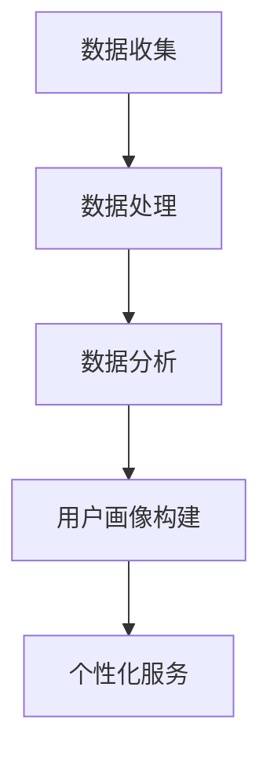

                 

关键词：人工智能、用户画像、数据处理、机器学习、个性化推荐

> 摘要：本文将探讨人工智能如何通过先进的数据处理技术和机器学习算法建立详细的用户画像，以实现更精准的市场细分和个性化服务。文章首先介绍了用户画像的概念和重要性，然后详细讲解了构建用户画像的技术原理和步骤，最后探讨了用户画像的应用场景和未来发展趋势。

## 1. 背景介绍

用户画像（User Profiling）是一种基于用户数据和行为特征创建的虚拟用户模型，用于描述用户的兴趣、行为、偏好和需求。随着大数据和人工智能技术的不断发展，用户画像已经成为市场营销、客户关系管理和个性化推荐等领域的重要工具。

在互联网时代，用户产生的数据量呈指数级增长。这些数据包括用户在社交媒体上的互动、在线购物行为、浏览历史、搜索记录等。如何有效地处理和利用这些数据，成为企业提升竞争力、优化营销策略的关键。

人工智能技术，特别是机器学习和深度学习，为用户画像的构建提供了强大的工具。通过分析海量用户数据，AI系统能够识别用户的潜在需求和偏好，从而实现精准营销和个性化服务。

## 2. 核心概念与联系

### 2.1. 数据收集

用户画像的第一步是数据收集。这些数据可以从多种渠道获取，包括：

- **社交媒体**：如微博、微信、Twitter、Facebook等，可以收集用户的公开信息、互动内容等。
- **网站行为**：用户的浏览历史、点击行为、搜索关键词等。
- **交易数据**：用户的购买记录、支付方式、购买频率等。

### 2.2. 数据处理

收集到的用户数据通常是杂乱无章的，需要通过数据清洗、数据整合等技术进行预处理。这一步骤包括：

- **数据清洗**：去除重复、错误或不完整的数据。
- **数据整合**：将来自不同渠道的数据进行合并，形成统一的数据视图。

### 2.3. 数据分析

在数据处理完成后，利用机器学习算法进行数据分析，提取用户的特征和模式。常见的算法包括：

- **聚类分析**：将用户划分为不同的群体。
- **关联规则学习**：发现用户行为之间的关联。
- **分类算法**：将用户归类到不同的类别。

### 2.4. 用户画像构建

基于分析结果，构建详细的用户画像。用户画像可以包括以下几个部分：

- **基础信息**：如年龄、性别、地理位置等。
- **兴趣偏好**：如喜欢的电影、音乐、书籍等。
- **行为特征**：如购买习惯、浏览习惯等。
- **社会属性**：如职业、收入水平等。

### 2.5. Mermaid 流程图

下面是一个使用Mermaid绘制的用户画像构建流程图：



## 3. 核心算法原理 & 具体操作步骤

### 3.1. 算法原理概述

用户画像的构建主要依赖于机器学习算法，这些算法可以分为以下几个类别：

- **聚类算法**：如K-均值、层次聚类等，用于发现用户群体的相似性。
- **分类算法**：如逻辑回归、决策树、随机森林等，用于将用户归类。
- **协同过滤**：如基于用户的协同过滤、基于物品的协同过滤等，用于推荐相似的用户或物品。

### 3.2. 算法步骤详解

1. **数据预处理**：包括数据清洗、归一化、缺失值处理等。
2. **特征工程**：提取用户行为、偏好、社会属性等特征。
3. **模型选择**：根据业务需求选择合适的机器学习算法。
4. **模型训练**：使用训练数据集训练模型。
5. **模型评估**：使用验证数据集评估模型效果。
6. **模型优化**：调整模型参数，提高模型效果。
7. **用户画像构建**：基于训练好的模型对用户数据进行分类、聚类等操作，构建用户画像。

### 3.3. 算法优缺点

- **聚类算法**：优点是无需预先设定类别数量，适用于发现用户群体间的相似性；缺点是可能产生重叠的聚类结果。
- **分类算法**：优点是能够明确地将用户划分为不同的类别，适用于目标明确的场景；缺点是训练时间较长，对大数据集效果不佳。
- **协同过滤**：优点是能够根据用户的历史行为推荐相似的用户或物品；缺点是可能产生冷启动问题，对新用户或新物品效果不佳。

### 3.4. 算法应用领域

用户画像算法广泛应用于以下领域：

- **个性化推荐**：根据用户画像推荐个性化的商品、内容和服务。
- **精准营销**：针对不同用户群体定制营销策略，提高营销效果。
- **客户关系管理**：通过用户画像了解客户需求，提供更好的客户服务。
- **风险管理**：识别高风险用户，降低风险。

## 4. 数学模型和公式 & 详细讲解 & 举例说明

### 4.1. 数学模型构建

用户画像的构建可以基于以下数学模型：

- **K-均值聚类算法**：
  $$ 
  \min_{C} \sum_{i=1}^{n} \sum_{j=1}^{k} d(c_j, x_i)^2 
  $$
  其中，$C = \{c_1, c_2, ..., c_k\}$表示聚类中心，$x_i$表示用户$i$的特征向量。

- **逻辑回归模型**：
  $$ 
  P(y=1|x; \theta) = \frac{1}{1 + e^{-(\theta^T x)}} 
  $$
  其中，$\theta$表示模型参数，$x$表示用户特征向量，$y$表示用户类别。

### 4.2. 公式推导过程

- **K-均值聚类算法**：
  1. 随机初始化聚类中心$c_j$。
  2. 计算每个用户$x_i$与聚类中心的距离$d(c_j, x_i)$。
  3. 将用户$x_i$分配给最近的聚类中心$c_j$。
  4. 重新计算聚类中心$c_j$，即每个聚类中心的均值。
  5. 重复步骤2-4，直到聚类中心不再发生变化。

- **逻辑回归模型**：
  1. 给定训练数据集，使用梯度下降法优化模型参数$\theta$。
  2. 计算每个样本的预测概率$P(y=1|x; \theta)$。
  3. 计算损失函数$J(\theta) = -\frac{1}{m} \sum_{i=1}^{m} [y_i \log(P(y=1|x; \theta)) + (1 - y_i) \log(1 - P(y=1|x; \theta))]$。
  4. 更新参数$\theta$，即$\theta = \theta - \alpha \nabla_{\theta} J(\theta)$，其中$\alpha$为学习率。

### 4.3. 案例分析与讲解

假设有一个电商网站，我们需要构建用户的购物画像。用户特征包括性别、年龄、购买历史、浏览历史等。

1. **数据预处理**：
   - 处理缺失值：使用均值、中位数等方法填补缺失值。
   - 特征归一化：将特征值缩放到相同的范围。

2. **特征工程**：
   - 新特征：计算用户的平均购买金额、购买频率等。
   - 降维：使用主成分分析（PCA）等方法降低特征维度。

3. **模型选择**：
   - 聚类算法：K-均值。
   - 分类算法：逻辑回归。

4. **模型训练**：
   - 使用K-均值算法将用户划分为多个群体。
   - 使用逻辑回归模型对每个群体的用户进行分类。

5. **模型评估**：
   - 使用交叉验证方法评估模型效果。
   - 调整模型参数，提高分类准确率。

6. **用户画像构建**：
   - 基于聚类结果，为每个用户分配一个群体标签。
   - 构建用户画像，包括用户的基本信息、兴趣偏好、行为特征等。

## 5. 项目实践：代码实例和详细解释说明

### 5.1. 开发环境搭建

- **Python**：安装Python 3.7及以上版本。
- **NumPy**：用于数据处理。
- **Scikit-learn**：用于机器学习算法。
- **Matplotlib**：用于数据可视化。

### 5.2. 源代码详细实现

以下是使用Python实现用户画像构建的示例代码：

```python
import numpy as np
from sklearn.cluster import KMeans
from sklearn.linear_model import LogisticRegression
from sklearn.model_selection import train_test_split
from sklearn.metrics import accuracy_score
import matplotlib.pyplot as plt

# 数据加载
data = np.load('user_data.npy')  # 假设用户数据存储为numpy数组

# 数据预处理
# ... (处理缺失值、归一化等)

# 特征工程
# ... (计算新特征、降维等)

# 模型训练
# K-均值聚类
kmeans = KMeans(n_clusters=3, random_state=0)
clusters = kmeans.fit_predict(data)

# 逻辑回归分类
X_train, X_test, y_train, y_test = train_test_split(data, clusters, test_size=0.2, random_state=0)
logreg = LogisticRegression()
logreg.fit(X_train, y_train)

# 模型评估
y_pred = logreg.predict(X_test)
accuracy = accuracy_score(y_test, y_pred)
print(f'Accuracy: {accuracy}')

# 用户画像构建
user_clusters = kmeans.predict(data)
for i, cluster in enumerate(set(user_clusters)):
    print(f'Cluster {i}:')
    print(f'Users in cluster {cluster}: {np.where(user_clusters == cluster)[0]}')

# 数据可视化
plt.scatter(data[:, 0], data[:, 1], c=user_clusters, cmap='viridis')
plt.scatter(kmeans.cluster_centers_[:, 0], kmeans.cluster_centers_[:, 1], s=300, c='red', label='Centroids')
plt.xlabel('Feature 1')
plt.ylabel('Feature 2')
plt.title('User Clustering')
plt.show()
```

### 5.3. 代码解读与分析

- **数据加载**：从numpy数组中加载用户数据。
- **数据预处理**：处理缺失值、归一化等。
- **特征工程**：计算新特征、降维等。
- **模型训练**：
  - K-均值聚类：将用户划分为3个聚类。
  - 逻辑回归分类：对每个聚类进行分类。
- **模型评估**：计算分类准确率。
- **用户画像构建**：输出每个聚类中的用户ID。
- **数据可视化**：使用散点图展示用户聚类结果。

## 6. 实际应用场景

用户画像技术在多个领域都有广泛的应用：

- **电子商务**：根据用户画像推荐个性化商品，提高销售额。
- **社交媒体**：推送用户可能感兴趣的内容，增加用户活跃度。
- **金融业**：识别高风险用户，进行精准风控。
- **医疗健康**：分析患者数据，提供个性化治疗方案。

## 7. 工具和资源推荐

### 7.1. 学习资源推荐

- **书籍**：《Python机器学习》、《机器学习实战》。
- **在线课程**：Coursera、Udacity、edX上的机器学习课程。
- **教程**：scikit-learn官方文档、Kaggle教程。

### 7.2. 开发工具推荐

- **Python**：Jupyter Notebook、PyCharm。
- **机器学习库**：scikit-learn、TensorFlow、PyTorch。
- **数据可视化**：Matplotlib、Seaborn。

### 7.3. 相关论文推荐

- "User Profiling for Personalization and Recommendation" by GroupLens Research.
- "LDA: A Probabilistic Topic Model for Document Classification" by David M. Blei et al.
- "Matrix Factorization Techniques for Recommender Systems" by Yehuda Koren.

## 8. 总结：未来发展趋势与挑战

### 8.1. 研究成果总结

用户画像技术在人工智能和大数据的推动下取得了显著成果，为各个领域提供了强有力的数据支持。未来的研究方向包括：

- **多模态用户画像**：结合文本、图像、语音等多模态数据进行用户画像构建。
- **实时用户画像**：利用实时数据流技术，实现用户画像的实时更新。
- **隐私保护**：如何在保护用户隐私的前提下，有效利用用户数据。

### 8.2. 未来发展趋势

- **个性化服务**：用户画像技术将进一步推动个性化服务的普及，提高用户体验。
- **跨领域应用**：用户画像将在更多领域得到应用，如智慧城市、智能制造等。
- **可持续发展**：用户画像技术在保护用户隐私和数据安全方面将面临更多挑战。

### 8.3. 面临的挑战

- **数据质量**：用户画像构建依赖于高质量的数据，如何确保数据的质量是一个挑战。
- **隐私保护**：在数据收集和处理过程中，如何保护用户隐私是一个重要的伦理问题。
- **技术进步**：随着技术的不断发展，用户画像算法需要不断更新，以适应新的应用场景。

### 8.4. 研究展望

用户画像技术将在未来继续发挥重要作用，为实现更加智能、个性化的服务和应用提供基础。研究人员和开发者需要关注以下几点：

- **数据隐私**：开发更加完善的隐私保护机制，确保用户数据的合法使用。
- **跨领域合作**：加强不同领域之间的合作，推动用户画像技术的应用创新。
- **持续优化**：不断优化用户画像算法，提高其准确性和实时性。

## 9. 附录：常见问题与解答

### 9.1. 用户画像与用户数据的区别是什么？

用户画像是对用户特征和行为的抽象和总结，而用户数据是原始的、具体的数据点。用户画像是对用户数据的处理和分析结果。

### 9.2. 如何保护用户隐私？

在构建用户画像时，可以通过以下方法保护用户隐私：

- **数据匿名化**：对用户数据进行匿名处理，消除个人身份信息。
- **数据加密**：对用户数据进行加密存储和传输。
- **隐私预算**：限制对用户数据的访问和使用，确保隐私保护。

### 9.3. 用户画像技术在医疗健康领域有哪些应用？

用户画像技术在医疗健康领域的应用包括：

- **个性化诊断**：根据患者的健康数据提供个性化诊断建议。
- **疾病预测**：基于患者历史数据和流行病学数据预测疾病风险。
- **药物推荐**：根据患者特征推荐合适的药物。

### 9.4. 用户画像技术在电子商务领域的应用有哪些？

用户画像技术在电子商务领域的应用包括：

- **个性化推荐**：根据用户画像推荐个性化商品。
- **精准营销**：针对不同用户群体定制营销策略。
- **客户关系管理**：分析客户需求，提供更好的客户服务。 
----------------------------------------------------------------

### 作者署名

本文作者：禅与计算机程序设计艺术 / Zen and the Art of Computer Programming

