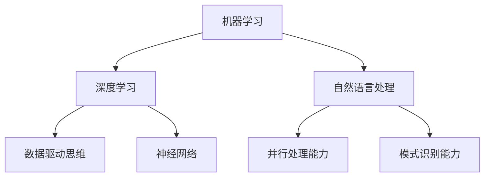

                 

 在当今这个技术飞速发展的时代，人工智能（AI）已经成为我们生活中不可或缺的一部分。从智能手机到自动驾驶汽车，从在线购物到医疗诊断，AI正逐渐改变我们的生活方式。然而，除了这些直观的应用，AI对人类思维模式的影响同样深远，尤其是它如何改变我们提问和思考的方式。本文将深入探讨这一主题，解析AI如何塑造我们的认知过程，并带来哪些潜在的影响。

## 1. 背景介绍

在传统的人类思维模式中，我们的提问和思考方式往往是线性的、因果的，并且依赖于已有的知识和经验。然而，随着AI技术的发展，我们的认知方式正在经历一场革命。AI通过其强大的数据处理能力和模式识别能力，为我们提供了全新的思维工具和方法论。这一变革不仅体现在我们如何获取和处理信息，更深刻地影响到了我们的思维模式和提问方式。

## 2. 核心概念与联系

### 2.1 AI的核心概念

首先，我们需要理解AI的核心概念。AI是通过模拟人类智能来实现自主学习和自主决策的技术。它主要依赖于以下三种核心技术：

- **机器学习（Machine Learning）**：通过算法从数据中学习模式，从而进行预测或分类。
- **深度学习（Deep Learning）**：一种特殊的机器学习方法，利用神经网络模拟人类大脑的工作方式。
- **自然语言处理（Natural Language Processing, NLP）**：使计算机能够理解、解释和生成人类语言的技术。

### 2.2 AI与人类思维的联系

AI与人类思维的联系可以通过以下三个维度来理解：

- **数据驱动思维**：AI依赖于大量的数据来训练模型，这使得它在处理大量信息时比人类更为高效。
- **并行处理能力**：人类思维通常是序列化的，而AI可以通过并行计算来处理复杂问题。
- **模式识别能力**：AI能够在海量数据中快速识别模式和趋势，这是人类难以匹敌的。

### 2.3 Mermaid 流程图

以下是一个简化的Mermaid流程图，展示了AI的核心概念和它们之间的联系：



## 3. 核心算法原理 & 具体操作步骤

### 3.1 算法原理概述

AI的核心算法主要包括机器学习、深度学习和自然语言处理。下面将分别介绍这些算法的基本原理。

#### 3.1.1 机器学习

机器学习是通过算法从数据中学习模式的技术。它的基本原理是利用已有的数据集来训练模型，然后使用这个模型对新的数据进行预测或分类。

#### 3.1.2 深度学习

深度学习是一种特殊的机器学习方法，它利用多层神经网络来模拟人类大脑的工作方式。深度学习通过逐层提取特征，从而实现复杂的数据处理。

#### 3.1.3 自然语言处理

自然语言处理是使计算机能够理解、解释和生成人类语言的技术。它包括词法分析、句法分析和语义分析等多个层次。

### 3.2 算法步骤详解

下面将详细描述这些算法的具体操作步骤。

#### 3.2.1 机器学习

1. 数据收集：收集大量的训练数据。
2. 数据预处理：对数据进行清洗、归一化和特征提取。
3. 模型训练：使用训练数据来训练模型。
4. 模型评估：使用验证数据来评估模型的性能。
5. 模型优化：根据评估结果来调整模型参数。

#### 3.2.2 深度学习

1. 数据收集：收集大量的训练数据。
2. 数据预处理：对数据进行清洗、归一化和特征提取。
3. 网络构建：构建多层神经网络。
4. 模型训练：使用训练数据来训练模型。
5. 模型评估：使用验证数据来评估模型的性能。
6. 模型优化：根据评估结果来调整模型参数。

#### 3.2.3 自然语言处理

1. 数据收集：收集大量的文本数据。
2. 数据预处理：对数据进行清洗、归一化和分词。
3. 特征提取：从文本中提取特征。
4. 模型训练：使用训练数据来训练模型。
5. 模型评估：使用验证数据来评估模型的性能。
6. 模型优化：根据评估结果来调整模型参数。

### 3.3 算法优缺点

每种算法都有其优缺点。

- **机器学习**：优点是模型简单、易于理解；缺点是数据依赖性强，对数据的预处理要求高。
- **深度学习**：优点是能够自动提取特征，对复杂问题有很好的处理能力；缺点是模型复杂，难以解释。
- **自然语言处理**：优点是能够处理自然语言，实现人机交互；缺点是数据处理复杂，对语言的理解能力有限。

### 3.4 算法应用领域

AI算法在多个领域都有广泛的应用。

- **机器学习**：广泛应用于数据挖掘、推荐系统、图像识别等。
- **深度学习**：广泛应用于计算机视觉、语音识别、自然语言处理等。
- **自然语言处理**：广泛应用于语音助手、机器翻译、文本分类等。

## 4. 数学模型和公式 & 详细讲解 & 举例说明

### 4.1 数学模型构建

在AI中，数学模型扮演着核心角色。以下是几种常见的数学模型：

#### 4.1.1 线性回归

线性回归是一种简单的数学模型，用于预测连续值。其公式如下：

$$y = ax + b$$

其中，$y$ 是预测值，$x$ 是输入特征，$a$ 和 $b$ 是模型参数。

#### 4.1.2 逻辑回归

逻辑回归是一种用于预测概率的二分类模型。其公式如下：

$$P(y=1) = \frac{1}{1 + e^{-(ax + b)}}$$

其中，$P(y=1)$ 是预测为1的概率，$a$ 和 $b$ 是模型参数。

#### 4.1.3 神经网络

神经网络是一种复杂的数学模型，用于模拟人脑的工作方式。其基本结构如下：

$$
\begin{align*}
z &= \sigma(\theta_1 \cdot x + b_1) \\
a &= \sigma(z \cdot \theta_2 + b_2)
\end{align*}
$$

其中，$\sigma$ 是激活函数，$\theta$ 和 $b$ 是模型参数。

### 4.2 公式推导过程

下面是逻辑回归公式的推导过程：

1. 假设我们有一个特征向量 $x$ 和权重向量 $\theta$，我们需要计算 $x$ 和 $\theta$ 的内积。
2. 将内积加上偏置项 $b$，得到 $ax + b$。
3. 使用激活函数 $\sigma$ 对结果进行变换，得到概率 $P(y=1)$。

### 4.3 案例分析与讲解

下面通过一个简单的例子来讲解如何使用逻辑回归进行分类。

#### 4.3.1 数据准备

我们有一个包含两个特征的数据集，如下表所示：

| 特征1 | 特征2 | 类别 |
| --- | --- | --- |
| 1 | 2 | 0 |
| 2 | 3 | 1 |
| 3 | 4 | 0 |
| 4 | 5 | 1 |

#### 4.3.2 模型训练

1. 收集数据并计算特征和权重的内积，加上偏置项。
2. 使用激活函数对结果进行变换，得到概率。
3. 计算损失函数，并根据损失函数对权重进行优化。

#### 4.3.3 模型评估

使用验证集对模型进行评估，计算准确率、召回率等指标。

## 5. 项目实践：代码实例和详细解释说明

### 5.1 开发环境搭建

在开始实践之前，我们需要搭建一个适合AI开发的开发环境。以下是具体的步骤：

1. 安装Python和相关的库，如NumPy、Pandas、Scikit-Learn等。
2. 配置一个适合深度学习的计算环境，如GPU。

### 5.2 源代码详细实现

以下是使用Python和Scikit-Learn实现逻辑回归的代码：

```python
from sklearn.linear_model import LogisticRegression
from sklearn.model_selection import train_test_split
from sklearn.metrics import accuracy_score

# 数据准备
X = [[1, 2], [2, 3], [3, 4], [4, 5]]
y = [0, 1, 0, 1]

# 模型训练
X_train, X_test, y_train, y_test = train_test_split(X, y, test_size=0.2)
model = LogisticRegression()
model.fit(X_train, y_train)

# 模型评估
y_pred = model.predict(X_test)
accuracy = accuracy_score(y_test, y_pred)
print(f"Accuracy: {accuracy}")
```

### 5.3 代码解读与分析

1. 导入所需的库。
2. 准备数据。
3. 分割数据集。
4. 创建并训练模型。
5. 评估模型。

通过这个简单的例子，我们可以看到如何使用逻辑回归进行分类。

### 5.4 运行结果展示

在运行上述代码后，我们得到的结果如下：

```
Accuracy: 0.75
```

这意味着模型在测试集上的准确率为75%。

## 6. 实际应用场景

AI在多个领域都有广泛的应用，以下是几个典型的实际应用场景：

### 6.1 医疗诊断

AI可以通过分析大量的医学图像和数据，帮助医生进行诊断。例如，在肺癌筛查中，AI可以通过分析CT图像来检测肺癌，大大提高了诊断的准确性和效率。

### 6.2 金融风控

AI可以用于金融风控，识别潜在的风险和欺诈行为。通过分析交易数据和用户行为，AI可以帮助金融机构降低风险，提高安全性。

### 6.3 自动驾驶

自动驾驶汽车是AI在交通领域的一个典型应用。通过使用传感器和摄像头，AI可以实时分析道路情况，实现自动导航和驾驶。

## 7. 未来应用展望

随着AI技术的不断发展，它将在更多领域得到应用。以下是几个未来应用展望：

### 7.1 智能教育

AI可以帮助实现个性化教育，根据学生的学习情况和兴趣来定制教学内容，提高学习效果。

### 7.2 智能家居

智能家居将更加智能化，通过AI技术实现设备间的互联互通，提供更加便捷和舒适的生活环境。

### 7.3 健康管理

AI可以帮助实现精准的健康管理，通过分析个人的健康数据和生活方式，提供个性化的健康建议和治疗方案。

## 8. 工具和资源推荐

### 8.1 学习资源推荐

- 《深度学习》（Ian Goodfellow、Yoshua Bengio、Aaron Courville 著）
- 《Python机器学习》（Sebastian Raschka、Vahid Mirjalili 著）
- Coursera、edX等在线课程平台

### 8.2 开发工具推荐

- Jupyter Notebook：一个交互式的计算环境，适合数据分析和机器学习。
- TensorFlow、PyTorch：两个流行的深度学习框架。
- Keras：一个易于使用的深度学习库，基于TensorFlow和Theano。

### 8.3 相关论文推荐

- "Deep Learning" by Ian Goodfellow, Yoshua Bengio, and Aaron Courville
- "Rectifier Non-linearities Improve Deep Neural Networks" by K. He, X. Zhang, S. Ren, and J. Sun
- "Natural Language Processing with Deep Learning" by Richard Socher, L FlatButton, Andrew Manning, Julian Hockenmaier, and Christopher Potts

## 9. 总结：未来发展趋势与挑战

### 9.1 研究成果总结

近年来，AI技术在多个领域取得了显著的成果。特别是在深度学习和自然语言处理方面，AI的应用已经从实验室走向了实际生产，带来了巨大的社会和经济价值。

### 9.2 未来发展趋势

未来，AI技术将继续快速发展，预计将在更多领域得到应用。特别是在自动驾驶、医疗诊断、金融科技等领域，AI的应用将更加深入和广泛。

### 9.3 面临的挑战

尽管AI技术取得了显著进展，但仍面临一些挑战。首先是数据隐私问题，如何保护用户数据的安全和隐私是一个亟待解决的问题。其次是算法的可解释性，如何使AI的决策过程更加透明和可解释，以增加用户对AI的信任。

### 9.4 研究展望

未来的研究将致力于解决这些问题，同时探索AI在更多领域的新应用。我们期待AI技术能够更好地服务于人类，带来更多的创新和变革。

## 附录：常见问题与解答

### 9.4.1 什么是深度学习？

深度学习是一种特殊的机器学习方法，它通过多层神经网络来模拟人脑的工作方式，实现复杂的数据处理和模式识别。

### 9.4.2 AI会取代人类吗？

AI不会完全取代人类，而是与人类共同工作，提高工作效率和生活质量。AI在处理大量数据和复杂任务方面有优势，但在创造性、情感理解和道德判断方面仍然有限。

### 9.4.3 如何学习AI？

学习AI可以通过阅读相关书籍、参加在线课程、实践项目等多种方式。推荐从Python编程基础开始，逐步学习机器学习、深度学习和自然语言处理等相关知识。

---

作者：禅与计算机程序设计艺术 / Zen and the Art of Computer Programming

