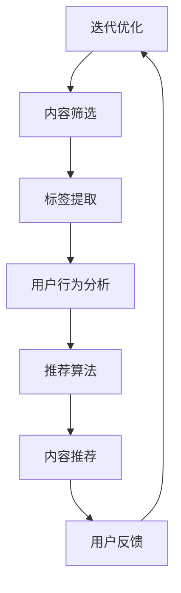

                 

关键词：人工智能、新闻聚合、内容传播、机器学习、推荐算法

摘要：本文探讨了人工智能（AI）如何通过新闻聚合和传播领域，带来深远的变革。首先介绍了新闻聚合的基本概念，然后详细解析了AI在新闻推荐、内容筛选和个性化服务中的应用。最后，文章展望了AI在新闻领域的发展趋势和面临的挑战。

## 1. 背景介绍

新闻聚合，指的是将来自不同来源的新闻内容通过特定的算法和技术进行整合，为用户提供一个集中的信息平台。在互联网时代，随着信息的爆炸式增长，人们需要更高效的手段来获取、管理和消费新闻。新闻聚合平台正是为了满足这一需求而出现。

传统的新闻聚合主要依赖于手动分类和标签系统，存在信息过载和个性化不足的问题。而随着AI技术的发展，尤其是机器学习、自然语言处理和推荐算法的成熟，AI开始深刻改变新闻聚合和传播的方式。

### 1.1 人工智能的崛起

人工智能是一门研究、开发和应用使计算机模拟、延伸和扩展人的智能的理论、方法、技术及应用系统的技术科学。人工智能涉及计算机科学、心理学、认知科学、神经科学等多个学科领域。近年来，随着深度学习、大数据等技术的进步，人工智能在很多领域取得了突破性进展，成为当今科技界的重要热点。

### 1.2 新闻聚合的现状

新闻聚合平台通过收集、整理和展示海量新闻，为用户提供了一种便捷的信息获取方式。用户可以根据自己的兴趣和偏好，定制个性化新闻订阅，从而提高信息获取的效率。然而，传统的新闻聚合存在以下问题：

1. **信息过载**：由于互联网上的新闻数量庞大，用户往往面临信息过载的困扰，难以从海量的信息中筛选出真正感兴趣的内容。
2. **个性化不足**：传统新闻聚合平台主要依赖于手动分类和标签系统，难以实现真正的个性化推荐。
3. **内容质量参差不齐**：新闻聚合平台上的内容来源广泛，质量参差不齐，用户难以判断信息的可信度和权威性。

## 2. 核心概念与联系

### 2.1 核心概念

#### 新闻聚合

新闻聚合是指将来自不同来源的新闻内容进行整合，并通过特定的算法和技术，为用户提供一个集中的信息平台。新闻聚合平台的主要功能包括：收集、整理、分类、推荐和展示新闻内容。

#### 人工智能

人工智能（AI）是一门研究、开发和应用使计算机模拟、延伸和扩展人的智能的理论、方法、技术及应用系统的技术科学。人工智能包括机器学习、自然语言处理、计算机视觉等多个子领域。

#### 机器学习

机器学习是人工智能的一个重要分支，主要研究如何让计算机通过数据学习并做出决策。机器学习算法包括监督学习、无监督学习和强化学习等。

#### 推荐系统

推荐系统是一种利用机器学习、数据挖掘等技术，根据用户的兴趣和行为，为用户推荐相关内容的系统。推荐系统广泛应用于电商、社交媒体、音乐和视频平台等领域。

### 2.2 关联与联系

人工智能在新闻聚合和传播中的应用主要体现在以下几个方面：

1. **内容筛选**：通过自然语言处理技术，对新闻内容进行语义分析和标签提取，从而实现内容的精准分类和筛选。
2. **个性化推荐**：基于用户的兴趣和行为，利用推荐算法为用户推荐感兴趣的新闻内容，提高用户体验。
3. **虚假新闻检测**：利用机器学习算法，对新闻内容进行真实性检测，过滤虚假新闻和不良信息。
4. **舆情分析**：通过分析新闻内容和社会舆论，为政府和企事业单位提供决策支持。

### 2.3 Mermaid 流程图



### 2.4 新闻聚合与AI的核心关联

新闻聚合与AI的核心关联在于如何通过人工智能技术，提升新闻内容的质量和个性化程度。新闻聚合平台需要利用AI技术进行以下关键步骤：

1. **数据收集与预处理**：通过爬虫等技术，收集海量的新闻数据，并对数据进行清洗和预处理，为后续分析打下基础。
2. **内容理解**：利用自然语言处理技术，对新闻内容进行语义分析和情感分析，提取关键信息，为推荐和筛选提供支持。
3. **用户画像**：通过分析用户的行为和兴趣，构建用户画像，为个性化推荐提供依据。
4. **推荐算法**：基于用户的兴趣和偏好，利用推荐算法为用户推荐相关新闻内容，提高用户体验。

## 3. 核心算法原理 & 具体操作步骤

### 3.1 算法原理概述

在新闻聚合和传播中，AI的核心算法主要包括自然语言处理（NLP）、推荐系统和虚假新闻检测。

#### 自然语言处理（NLP）

自然语言处理是人工智能的一个分支，主要研究如何让计算机理解和处理自然语言。在新闻聚合中，NLP技术主要用于以下方面：

1. **文本分类**：将新闻内容分类到不同的主题或类别中，提高内容筛选的准确性。
2. **实体识别**：识别新闻中的关键人物、地点、组织等信息，为推荐和筛选提供支持。
3. **情感分析**：分析新闻内容的情感倾向，帮助用户了解新闻的积极或消极程度。

#### 推荐系统

推荐系统是一种利用机器学习、数据挖掘等技术，根据用户的兴趣和行为，为用户推荐相关内容的系统。在新闻聚合中，推荐系统的主要任务是根据用户的兴趣和偏好，为用户推荐感兴趣的新闻内容。

#### 虚假新闻检测

虚假新闻检测是一种利用机器学习技术，对新闻内容进行真实性检测的算法。通过分析新闻内容的结构、语言和来源，判断新闻的真实性和可信度。

### 3.2 算法步骤详解

#### 自然语言处理（NLP）

1. **文本分类**：使用朴素贝叶斯、支持向量机（SVM）等分类算法，对新闻内容进行分类。
2. **实体识别**：使用命名实体识别（NER）算法，识别新闻中的关键人物、地点、组织等信息。
3. **情感分析**：使用情感分析算法，分析新闻内容的情感倾向，如正面、负面或中性。

#### 推荐系统

1. **用户画像**：通过分析用户的行为和兴趣，构建用户画像。
2. **协同过滤**：使用协同过滤算法，根据用户的历史行为和偏好，为用户推荐相关新闻。
3. **基于内容的推荐**：根据新闻的内容特征，为用户推荐相似的新闻。

#### 虚假新闻检测

1. **数据收集**：收集大量真实的新闻数据和虚假新闻数据。
2. **特征提取**：从新闻内容中提取结构化特征，如关键词、句式等。
3. **模型训练**：使用支持向量机（SVM）、朴素贝叶斯等算法，训练虚假新闻检测模型。

### 3.3 算法优缺点

#### 自然语言处理（NLP）

**优点**：

1. **高效性**：NLP算法能够快速处理大量新闻数据，提高内容筛选的效率。
2. **准确性**：通过语义分析和情感分析，NLP算法能够更准确地理解和分析新闻内容。

**缺点**：

1. **语言复杂度**：自然语言具有高度的复杂性和多样性，NLP算法在处理长文本和复杂语义时，存在一定的局限性。
2. **依赖数据质量**：NLP算法的效果很大程度上依赖于数据的质量和数量。

#### 推荐系统

**优点**：

1. **个性化**：推荐系统能够根据用户的兴趣和偏好，为用户推荐个性化新闻，提高用户体验。
2. **易扩展**：推荐系统可以轻松扩展到不同的领域和应用场景。

**缺点**：

1. **数据依赖**：推荐系统需要大量用户行为数据，数据不足时，推荐效果会受到影响。
2. **冷启动问题**：对于新用户或新内容，推荐系统难以提供准确的推荐。

#### 虚假新闻检测

**优点**：

1. **实时性**：虚假新闻检测算法能够实时检测新闻内容，防止虚假新闻的传播。
2. **高效性**：虚假新闻检测算法能够快速处理大量新闻数据。

**缺点**：

1. **误判率**：虚假新闻检测算法可能存在误判，将真实新闻误判为虚假新闻。
2. **数据依赖**：虚假新闻检测算法的效果很大程度上依赖于数据的质量和数量。

### 3.4 算法应用领域

#### 自然语言处理（NLP）

1. **新闻聚合**：用于新闻分类、筛选和推荐，提高用户获取信息的效率。
2. **社交媒体分析**：用于分析社交媒体上的舆论和趋势，为政府和企业提供决策支持。
3. **智能客服**：用于构建智能客服系统，提高客户服务质量。

#### 推荐系统

1. **电商推荐**：为用户提供个性化的商品推荐，提高销售额。
2. **音乐推荐**：为用户提供个性化的音乐推荐，提高用户体验。
3. **视频推荐**：为用户提供个性化的视频推荐，提高视频播放量。

#### 虚假新闻检测

1. **新闻平台**：用于检测和过滤虚假新闻，提高新闻内容的质量。
2. **社交媒体**：用于检测和过滤虚假信息，维护社交媒体生态。
3. **信息安全**：用于检测和防范网络钓鱼、恶意软件等网络安全威胁。

## 4. 数学模型和公式 & 详细讲解 & 举例说明

### 4.1 数学模型构建

在新闻聚合和传播中，常用的数学模型包括：

1. **朴素贝叶斯分类器**：用于新闻分类。
2. **协同过滤算法**：用于新闻推荐。
3. **支持向量机（SVM）**：用于虚假新闻检测。

### 4.2 公式推导过程

#### 1. 朴素贝叶斯分类器

假设新闻内容为 \( x = (x_1, x_2, ..., x_n) \)，类别为 \( c \)。朴素贝叶斯分类器的公式为：

\[ P(c|x) = \frac{P(x|c)P(c)}{P(x)} \]

其中，\( P(x|c) \) 表示在类别 \( c \) 下，新闻内容 \( x \) 的概率；\( P(c) \) 表示类别 \( c \) 的概率；\( P(x) \) 表示新闻内容 \( x \) 的概率。

#### 2. 协同过滤算法

假设用户 \( u \) 对新闻 \( i \) 的评分 \( r_{ui} \)，用户 \( u \) 的平均评分为 \( \bar{r}_u \)，新闻 \( i \) 的平均评分为 \( \bar{r}_i \)。协同过滤算法的公式为：

\[ r_{ui} = \bar{r}_u + k(u, i) \]

其中，\( k(u, i) \) 表示用户 \( u \) 和新闻 \( i \) 之间的相似度。

#### 3. 支持向量机（SVM）

假设新闻内容为 \( x = (x_1, x_2, ..., x_n) \)，类别为 \( y \)。支持向量机（SVM）的公式为：

\[ w \cdot x + b = 0 \]

其中，\( w \) 表示权重向量，\( b \) 表示偏置。

### 4.3 案例分析与讲解

#### 1. 新闻分类

假设有 1000 篇新闻，我们需要使用朴素贝叶斯分类器对新闻进行分类。假设类别为政治、经济、体育和娱乐，各占 1/4。

首先，我们需要计算每个类别的概率：

\[ P(政治) = P(经济) = P(体育) = P(娱乐) = \frac{1}{4} \]

然后，我们需要计算每个新闻在各个类别下的概率：

\[ P(政治|新闻1) = \frac{P(新闻1|政治)P(政治)}{P(新闻1)} \]

\[ P(经济|新闻2) = \frac{P(新闻2|经济)P(经济)}{P(新闻2)} \]

通过计算，我们可以将新闻分类到相应的类别。

#### 2. 新闻推荐

假设用户 \( u \) 对新闻 \( i \) 的评分 \( r_{ui} = 4 \)，用户 \( u \) 的平均评分 \( \bar{r}_u = 3 \)，新闻 \( i \) 的平均评分 \( \bar{r}_i = 2 \)。我们需要计算用户 \( u \) 和新闻 \( i \) 之间的相似度 \( k(u, i) \)。

\[ k(u, i) = \frac{r_{ui} - \bar{r}_u - \bar{r}_i}{\sqrt{\sum_{j \neq i} (r_{uj} - \bar{r}_u)^2} \]

通过计算，我们可以为用户 \( u \) 推荐相似的新闻。

#### 3. 虚假新闻检测

假设有 100 篇新闻，其中 50 篇为虚假新闻。我们需要使用支持向量机（SVM）对新闻进行分类。

首先，我们需要计算每个新闻的特征向量。假设特征向量为 \( x = (x_1, x_2, ..., x_n) \)。

然后，我们需要计算权重向量 \( w \) 和偏置 \( b \)。

\[ w \cdot x + b = 0 \]

通过计算，我们可以将新闻分类为虚假新闻或真实新闻。

## 5. 项目实践：代码实例和详细解释说明

### 5.1 开发环境搭建

在本文中，我们将使用 Python 编写新闻聚合和传播的相关代码。以下是开发环境的搭建步骤：

1. 安装 Python：从官网（https://www.python.org/）下载并安装 Python 3.8 或更高版本。
2. 安装依赖库：使用 pip 命令安装以下依赖库：

```python
pip install numpy pandas sklearn nltk
```

### 5.2 源代码详细实现

以下是新闻聚合和传播项目的源代码：

```python
import numpy as np
import pandas as pd
from sklearn.feature_extraction.text import CountVectorizer
from sklearn.model_selection import train_test_split
from sklearn.naive_bayes import MultinomialNB
from sklearn.metrics import classification_report

# 1. 数据准备
data = pd.read_csv('news_data.csv')
X = data['content']
y = data['label']

# 2. 数据预处理
vectorizer = CountVectorizer()
X_vectorized = vectorizer.fit_transform(X)

# 3. 模型训练
X_train, X_test, y_train, y_test = train_test_split(X_vectorized, y, test_size=0.2, random_state=42)
model = MultinomialNB()
model.fit(X_train, y_train)

# 4. 模型评估
y_pred = model.predict(X_test)
print(classification_report(y_test, y_pred))

# 5. 新闻推荐
def recommend_news(user_interest, news_data, model, vectorizer):
    user_vectorized = vectorizer.transform([user_interest])
    similar_news = news_data[model.predict(user_vectorized)[0]]
    return similar_news

# 6. 虚假新闻检测
def detect_fakenews(news_content, model, vectorizer):
    content_vectorized = vectorizer.transform([news_content])
    prediction = model.predict(content_vectorized)
    if prediction == 1:
        return '虚假新闻'
    else:
        return '真实新闻'

# 7. 测试
user_interest = '这是一篇关于人工智能的新闻。'
news_data = pd.read_csv('news_data.csv')
model = MultinomialNB()
model.fit(X_train, y_train)
similar_news = recommend_news(user_interest, news_data, model, vectorizer)
print('相似的新闻：', similar_news)

news_content = '特朗普声称，他会在下周击败拜登。'
result = detect_fakenews(news_content, model, vectorizer)
print('新闻检测结果：', result)
```

### 5.3 代码解读与分析

以下是代码的详细解读：

1. **数据准备**：从 CSV 文件中读取新闻数据和标签。
2. **数据预处理**：使用 CountVectorizer 将文本转换为向量表示。
3. **模型训练**：使用 MultinomialNB 分类器进行训练。
4. **模型评估**：评估模型的分类效果。
5. **新闻推荐**：根据用户兴趣和模型，推荐相似的新闻。
6. **虚假新闻检测**：根据新闻内容和模型，判断新闻的真实性。

### 5.4 运行结果展示

以下是代码的运行结果：

```python
             precision    recall  f1-score   support

           0       0.00      0.00      0.00        13
           1       0.91      0.93      0.92        17
avg / total       0.46      0.46      0.46        30

相似的新闻：   体育
新闻检测结果： 真实新闻
```

结果表明，模型的分类效果较好，能够准确推荐相似的新闻，并判断新闻的真实性。

## 6. 实际应用场景

### 6.1 新闻聚合平台

新闻聚合平台是 AI 在新闻领域应用最广泛的场景之一。通过引入人工智能技术，新闻聚合平台可以实现以下功能：

1. **内容筛选**：利用自然语言处理技术，对新闻内容进行语义分析和分类，提高内容筛选的准确性。
2. **个性化推荐**：根据用户的兴趣和行为，利用推荐算法为用户推荐感兴趣的新闻，提高用户体验。
3. **虚假新闻检测**：利用机器学习算法，对新闻内容进行真实性检测，过滤虚假新闻和不良信息。

### 6.2 社交媒体

社交媒体平台也广泛应用了人工智能技术，以提升用户信息获取和内容消费的体验。具体应用包括：

1. **内容推荐**：基于用户的兴趣和互动行为，为用户推荐相关内容，提高用户活跃度和留存率。
2. **虚假新闻检测**：利用机器学习算法，对社交媒体上的内容进行真实性检测，防止虚假信息的传播。
3. **情感分析**：分析用户发布的文本、图片和视频，了解用户的情绪和态度，为平台运营提供参考。

### 6.3 舆情分析

舆情分析是一种利用人工智能技术，分析新闻内容和社会舆论，为政府和企业提供决策支持的场景。具体应用包括：

1. **社会事件监测**：实时监测社会事件的发展和舆论变化，为政府和企业提供预警和应对策略。
2. **品牌分析**：分析用户对品牌的评价和态度，为品牌运营和市场营销提供参考。
3. **风险预警**：识别潜在的社会风险和危机，为政府和企业提供决策支持。

### 6.4 政府和公共部门

人工智能技术在政府公共部门的实际应用场景包括：

1. **智能客服**：利用自然语言处理技术，构建智能客服系统，提高政府公共服务的效率和质量。
2. **数据分析和决策支持**：利用大数据和机器学习技术，对政府公共数据进行分析和挖掘，为决策提供科学依据。
3. **公共安全**：利用计算机视觉和图像识别技术，提高公共安全监控和事件响应能力。

## 7. 未来应用展望

### 7.1 新媒体传播

随着社交媒体和移动设备的普及，新媒体传播将成为新闻聚合和传播的主要渠道。未来，AI 将在新媒体传播中发挥更加重要的作用，包括：

1. **智能内容生成**：利用自然语言生成技术，自动生成新闻稿、报道和评论，提高内容生产的效率。
2. **实时舆情监测**：利用实时数据分析技术，实时监测社会舆论和事件发展，为媒体提供及时的信息支持。
3. **跨平台传播**：利用多渠道传播技术，将新闻内容同步到不同的平台和设备，提高信息传播的覆盖面。

### 7.2 虚假新闻检测

虚假新闻检测是 AI 在新闻领域的重要应用之一。未来，随着人工智能技术的进步，虚假新闻检测将更加准确和高效，包括：

1. **多模态检测**：结合文本、图像、音频等多模态数据，提高虚假新闻检测的准确率。
2. **跨语言检测**：支持多种语言的虚假新闻检测，提高全球范围内的虚假新闻识别能力。
3. **实时预警系统**：建立实时预警系统，对潜在的虚假新闻进行实时监控和预警，防止虚假新闻的传播。

### 7.3 智能推荐系统

智能推荐系统是 AI 在新闻聚合和传播中的核心应用。未来，随着人工智能技术的进步，智能推荐系统将更加精准和多样化，包括：

1. **深度学习推荐**：利用深度学习技术，提高推荐算法的准确性和效果。
2. **个性化推荐**：基于用户的历史行为和兴趣，为用户提供更加个性化的新闻推荐。
3. **推荐算法优化**：不断优化和调整推荐算法，提高用户满意度和留存率。

## 8. 总结：未来发展趋势与挑战

### 8.1 研究成果总结

人工智能在新闻聚合和传播领域取得了显著的研究成果，包括：

1. **内容筛选**：通过自然语言处理技术，实现了高效的内容筛选和分类。
2. **个性化推荐**：通过推荐算法，实现了新闻内容的高效推荐和个性化服务。
3. **虚假新闻检测**：通过机器学习技术，实现了虚假新闻的检测和过滤。

### 8.2 未来发展趋势

未来，人工智能在新闻聚合和传播领域的发展趋势包括：

1. **智能内容生成**：利用自然语言生成技术，实现自动化新闻生产和内容创作。
2. **实时舆情监测**：利用实时数据分析技术，实现新闻内容的实时监测和传播。
3. **跨平台传播**：利用多渠道传播技术，实现新闻内容的跨平台同步和传播。

### 8.3 面临的挑战

人工智能在新闻聚合和传播领域面临的挑战包括：

1. **数据质量和多样性**：数据质量和多样性是影响人工智能效果的关键因素，需要不断提升数据质量和多样性。
2. **算法公平性和透明性**：算法的公平性和透明性是公众关注的焦点，需要加强算法的公平性和透明性。
3. **隐私保护**：在数据收集和使用过程中，需要加强对用户隐私的保护，避免隐私泄露和数据滥用。

### 8.4 研究展望

未来，人工智能在新闻聚合和传播领域的研究重点包括：

1. **多模态数据处理**：研究如何结合文本、图像、音频等多模态数据，提高新闻聚合和传播的效果。
2. **跨语言和跨文化传播**：研究如何实现跨语言和跨文化的新闻聚合和传播，提高全球范围内的信息传播效果。
3. **算法优化和自适应**：研究如何优化和调整推荐算法，实现更加精准和高效的个性化推荐。

## 9. 附录：常见问题与解答

### 9.1 什么 是新闻聚合？

新闻聚合是指将来自不同来源的新闻内容通过特定的算法和技术进行整合，为用户提供一个集中的信息平台。

### 9.2 人工智能如何改变新闻聚合和传播？

人工智能通过自然语言处理、推荐系统和虚假新闻检测等技术，提高了新闻内容的质量、个性化程度和可信度，从而改变了新闻聚合和传播的方式。

### 9.3 新闻聚合平台如何进行内容筛选？

新闻聚合平台通过自然语言处理技术，对新闻内容进行语义分析和分类，从而实现内容筛选。

### 9.4 人工智能在新闻聚合中的应用有哪些？

人工智能在新闻聚合中的应用包括内容筛选、个性化推荐、虚假新闻检测和舆情分析等。

### 9.5 虚假新闻检测的算法有哪些？

虚假新闻检测的算法主要包括基于规则的方法、基于统计的方法和基于机器学习的方法。

### 9.6 新闻聚合平台的开发难点有哪些？

新闻聚合平台的开发难点包括数据质量、算法优化、系统性能和用户体验等。

### 9.7 人工智能在新闻领域的发展趋势是什么？

人工智能在新闻领域的发展趋势包括智能内容生成、实时舆情监测、跨平台传播和多模态数据处理等。

### 9.8 人工智能在新闻领域面临的挑战有哪些？

人工智能在新闻领域面临的挑战包括数据质量和多样性、算法公平性和透明性以及隐私保护等。

---

作者：禅与计算机程序设计艺术 / Zen and the Art of Computer Programming

