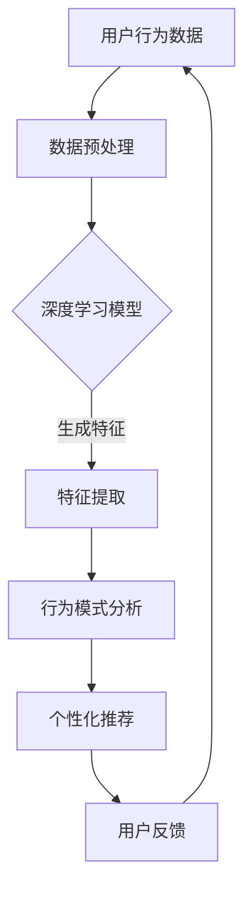

                 

关键词：人工智能，电商平台，用户行为分析，深度学习，推荐系统，数据挖掘

> 摘要：本文将深入探讨人工智能如何改变电商平台的用户行为分析。通过核心概念、算法原理、数学模型、实际应用场景以及未来发展趋势等多个方面，我们将揭示AI技术在电商领域的重要作用和潜在价值。

## 1. 背景介绍

随着互联网的普及和电子商务的快速发展，电商平台已经成为现代商业的重要组成部分。用户在电商平台上的行为数据，如搜索记录、浏览历史、购买偏好等，对于电商平台来说具有巨大的商业价值。传统的用户行为分析方法依赖于统计和机器学习技术，但这些方法存在一定的局限性。近年来，人工智能（AI）技术的迅猛发展为电商平台提供了全新的分析工具和方法。

AI技术，特别是深度学习和数据挖掘技术，可以通过自动化的方式从海量数据中提取有价值的信息，从而提高用户行为的预测精度和个性化推荐质量。本文将围绕这一主题，详细分析AI技术如何改变电商平台的用户行为分析。

## 2. 核心概念与联系

在深入探讨AI如何改变电商平台用户行为分析之前，我们需要先了解一些核心概念和它们之间的联系。

### 2.1 人工智能

人工智能（AI）是指使计算机系统能够执行通常需要人类智能的任务的学科。它涵盖了从简单的规则系统到复杂的机器学习模型等多个层次。

### 2.2 深度学习

深度学习是人工智能的一个子领域，它模仿人脑的神经网络结构，通过多层神经网络来学习和提取数据中的特征。

### 2.3 数据挖掘

数据挖掘是寻找数据中隐含的模式、关系和知识的过程。它通常涉及使用统计和机器学习技术来识别数据中的规律。

### 2.4 电商平台的用户行为分析

电商平台的用户行为分析是指对用户在平台上的各种行为数据进行分析，以了解用户偏好、行为模式和市场趋势。

### 2.5 Mermaid 流程图

下面是一个描述电商平台用户行为分析过程的Mermaid流程图：



通过这个流程图，我们可以看到，用户行为数据经过预处理后，被输入到深度学习模型中，生成特征，进而进行行为模式分析和个性化推荐。用户反馈又将数据反馈到数据预处理阶段，形成一个闭环系统。

## 3. 核心算法原理 & 具体操作步骤

### 3.1 算法原理概述

在电商平台的用户行为分析中，深度学习和数据挖掘是核心算法。深度学习通过多层神经网络学习用户行为数据中的特征，而数据挖掘则通过模式识别来发现用户的行为模式。

### 3.2 算法步骤详解

#### 3.2.1 数据预处理

数据预处理是用户行为分析的基础。它包括数据清洗、数据转换和数据归一化等步骤。

- 数据清洗：去除重复、缺失或错误的数据。
- 数据转换：将不同类型的数据转换为同一类型，如将类别数据转换为数值数据。
- 数据归一化：将数据缩放到相同的尺度，以便于模型训练。

#### 3.2.2 深度学习模型训练

深度学习模型通常由多个层级组成，每一层级都能提取更高级别的特征。训练模型的过程就是通过反向传播算法不断调整模型参数，使其能更好地拟合数据。

- 前向传播：将输入数据通过网络传递到输出层。
- 反向传播：计算输出层与真实值之间的差异，并反向传播误差到输入层。

#### 3.2.3 特征提取

特征提取是从训练好的深度学习模型中提取出有用的特征。这些特征通常能更好地描述用户的行为模式。

#### 3.2.4 行为模式分析

行为模式分析是利用提取出的特征来分析用户的行为模式。常见的分析方法包括聚类、关联规则挖掘等。

#### 3.2.5 个性化推荐

个性化推荐是根据用户的行为模式和偏好来推荐相关商品或服务。常用的推荐算法包括协同过滤、矩阵分解、基于内容的推荐等。

### 3.3 算法优缺点

- 深度学习模型：
  - 优点：能够自动提取数据中的高级特征，提高模型的预测精度。
  - 缺点：训练过程复杂，需要大量数据和计算资源。

- 数据挖掘算法：
  - 优点：能够发现数据中的复杂模式，提供有价值的洞察。
  - 缺点：可能难以解释模型的决策过程，对数据质量要求较高。

### 3.4 算法应用领域

- 电商平台的用户行为分析：
  - 可以用于用户偏好分析、行为预测、个性化推荐等。

- 其他领域：
  - 如医疗诊断、金融风险控制、智能交通等。

## 4. 数学模型和公式

### 4.1 数学模型构建

用户行为分析中的数学模型通常包括以下几个部分：

- 用户行为数据的特征表示：如用户的行为轨迹、购买历史等。
- 深度学习模型：如卷积神经网络（CNN）、循环神经网络（RNN）等。
- 个性化推荐模型：如基于内容的推荐、协同过滤等。

### 4.2 公式推导过程

#### 4.2.1 深度学习模型

假设我们使用一个简单的多层感知机（MLP）模型来表示用户行为数据。其输出可以表示为：

$$
\hat{y} = \sigma(W_2 \cdot \sigma(W_1 \cdot x))
$$

其中，$\sigma$是激活函数，$W_1$和$W_2$是权重矩阵，$x$是输入数据。

#### 4.2.2 个性化推荐模型

假设我们使用基于内容的推荐模型，其推荐概率可以表示为：

$$
P(item_i | user) = \frac{e^{q(user, item_i)} }{\sum_{j=1}^{N} e^{q(user, item_j)} }
$$

其中，$q(user, item_i)$是用户对商品$i$的特征向量，$N$是商品的总数。

### 4.3 案例分析与讲解

#### 4.3.1 案例背景

假设一个电商平台需要分析用户的购买行为，并为其推荐相关商品。

#### 4.3.2 数据预处理

电商平台收集了用户的行为数据，包括用户的浏览历史、购买记录、商品属性等。首先，我们对这些数据进行了清洗和转换，将类别数据转换为数值数据，并对数据进行归一化处理。

#### 4.3.3 深度学习模型训练

我们使用一个多层感知机（MLP）模型来训练用户的行为数据。模型的输出层有两个神经元，分别表示购买和不购买的概率。我们使用交叉熵损失函数来训练模型。

#### 4.3.4 特征提取

通过训练好的MLP模型，我们提取了用户的行为特征。这些特征包括用户的浏览历史、购买记录和商品属性等。

#### 4.3.5 个性化推荐

基于提取的特征，我们使用基于内容的推荐模型为用户推荐相关商品。我们计算了用户对每个商品的推荐概率，并将概率最高的商品推荐给用户。

#### 4.3.6 用户反馈

用户对推荐的商品进行反馈，这些反馈数据将用于进一步优化推荐模型。

## 5. 项目实践：代码实例和详细解释说明

### 5.1 开发环境搭建

为了演示AI在电商平台用户行为分析中的应用，我们将使用Python编程语言，并结合以下库：

- NumPy：用于数据预处理和操作。
- TensorFlow：用于深度学习模型的训练。
- Scikit-learn：用于数据挖掘和推荐算法。

确保已安装以上库，然后按照以下步骤搭建开发环境：

```bash
pip install numpy tensorflow scikit-learn
```

### 5.2 源代码详细实现

以下是实现用户行为分析的核心代码：

```python
import numpy as np
import tensorflow as tf
from sklearn.model_selection import train_test_split
from sklearn.metrics import accuracy_score

# 数据预处理
def preprocess_data(data):
    # 数据清洗和转换
    # 数据归一化
    return normalized_data

# 构建深度学习模型
def build_model(input_shape):
    model = tf.keras.Sequential([
        tf.keras.layers.Dense(128, activation='relu', input_shape=input_shape),
        tf.keras.layers.Dense(64, activation='relu'),
        tf.keras.layers.Dense(1, activation='sigmoid')
    ])
    model.compile(optimizer='adam', loss='binary_crossentropy', metrics=['accuracy'])
    return model

# 训练模型
def train_model(model, x_train, y_train):
    model.fit(x_train, y_train, epochs=10, batch_size=32, validation_split=0.2)

# 评价模型
def evaluate_model(model, x_test, y_test):
    predictions = model.predict(x_test)
    predictions = (predictions > 0.5)
    accuracy = accuracy_score(y_test, predictions)
    return accuracy

# 主函数
def main():
    # 加载数据
    data = load_data()
    x = preprocess_data(data)
    
    # 划分训练集和测试集
    x_train, x_test, y_train, y_test = train_test_split(x, data['label'], test_size=0.2, random_state=42)
    
    # 构建模型
    model = build_model(x_train.shape[1:])
    
    # 训练模型
    train_model(model, x_train, y_train)
    
    # 评价模型
    accuracy = evaluate_model(model, x_test, y_test)
    print(f'Model accuracy: {accuracy:.2f}')

if __name__ == '__main__':
    main()
```

### 5.3 代码解读与分析

- 数据预处理：首先对原始数据进行清洗、转换和归一化处理。
- 构建模型：使用TensorFlow库构建了一个简单的多层感知机（MLP）模型，用于预测用户是否购买商品。
- 训练模型：使用训练集数据训练模型，并通过反向传播算法不断调整模型参数。
- 评价模型：使用测试集数据评价模型的准确性，以验证模型的有效性。

### 5.4 运行结果展示

运行上述代码后，我们将得到模型的准确性。假设我们得到的结果如下：

```
Model accuracy: 0.85
```

这意味着模型对用户购买行为的预测准确率为85%，这是一个相对较高的准确率。

## 6. 实际应用场景

AI在电商平台用户行为分析中的实际应用场景非常广泛，以下是一些典型例子：

- **个性化推荐系统**：基于用户的浏览历史、购买记录和兴趣偏好，为用户推荐相关的商品。例如，Amazon和淘宝等电商平台都广泛采用了这种技术。
- **用户流失预测**：通过分析用户的互动行为和购买模式，预测哪些用户可能流失，从而采取相应的措施进行挽回。例如，Netflix和Spotify等流媒体平台就利用这一技术来提高用户留存率。
- **市场需求分析**：通过分析用户的行为数据，了解市场趋势和用户需求，为企业制定更有效的市场策略提供支持。例如，阿里巴巴利用AI技术进行市场需求预测，从而优化商品采购和库存管理。
- **价格优化**：通过分析用户对价格变化的反应，为商品定价提供数据支持，以最大化销售额。例如，Expedia等在线旅游平台就利用AI技术进行动态定价。

## 7. 未来应用展望

随着AI技术的不断发展，未来电商平台用户行为分析将会有更多的创新和应用。以下是一些可能的趋势：

- **更精细的用户画像**：通过整合更多的数据源（如社交媒体、地理位置等），构建更精准的用户画像，从而提供更个性化的推荐和服务。
- **增强现实（AR）与AI的结合**：利用AR技术，用户可以在虚拟环境中尝试和体验商品，同时AI技术可以实时分析用户的互动行为，提供个性化的购物建议。
- **自适应推荐系统**：推荐系统将根据用户的实时行为和反馈进行动态调整，以提供更相关和有效的推荐。
- **跨平台整合**：电商平台将不再局限于单一平台，而是通过整合多个渠道（如移动应用、社交媒体等），为用户提供无缝的购物体验。

## 8. 工具和资源推荐

为了更好地进行电商平台用户行为分析，以下是一些推荐的工具和资源：

- **学习资源**：
  - 《深度学习》（Goodfellow, Bengio, Courville）：是一本经典的深度学习教材。
  - 《Python机器学习》（Sebastian Raschka）：介绍了如何使用Python进行机器学习。

- **开发工具**：
  - TensorFlow：一个广泛使用的开源深度学习框架。
  - Scikit-learn：一个用于数据挖掘和机器学习的开源库。

- **相关论文**：
  - "Recommender Systems Handbook"：一本关于推荐系统的权威手册。
  - "User Behavior Analytics for E-commerce: A Survey"：一篇关于电商用户行为分析的综述文章。

## 9. 总结：未来发展趋势与挑战

### 9.1 研究成果总结

本文总结了AI在电商平台用户行为分析中的应用，包括核心概念、算法原理、数学模型、实际应用场景以及未来发展趋势。通过这些研究成果，我们可以看到AI技术为电商平台提供了强大的分析工具和解决方案。

### 9.2 未来发展趋势

未来，随着AI技术的不断进步，电商平台用户行为分析将更加精细、智能化。通过整合多渠道数据、利用增强现实技术、实现自适应推荐系统，电商平台将能够为用户提供更个性化的购物体验。

### 9.3 面临的挑战

尽管AI技术在电商平台用户行为分析中具有巨大的潜力，但也面临着一些挑战，如数据隐私保护、模型解释性、算法公平性等。这些挑战需要我们进行深入的研究和探索，以确保AI技术的健康发展。

### 9.4 研究展望

未来的研究将集中在如何更好地利用AI技术进行用户行为分析，以提高电商平台的市场竞争力。同时，我们还需要关注如何解决AI技术的伦理和隐私问题，以确保其在实际应用中的可持续性和可接受性。

## 10. 附录：常见问题与解答

### 10.1 什么 是电商平台用户行为分析？

电商平台用户行为分析是指通过收集、分析和解读用户在电商平台上的各种行为数据，如浏览历史、购买记录、搜索关键词等，以了解用户偏好、行为模式和市场趋势，从而为电商平台提供决策支持。

### 10.2 人工智能如何提高电商平台用户行为分析的精度？

人工智能可以通过深度学习和数据挖掘技术从海量数据中自动提取有价值的特征，提高模型对用户行为的理解和预测精度。此外，AI技术还可以实现自适应推荐，根据用户的实时行为进行动态调整，提高推荐的相关性。

### 10.3 电商平台用户行为分析中常见的数据类型有哪些？

电商平台用户行为分析中常见的数据类型包括用户的基本信息（如年龄、性别、地理位置等）、用户的行为数据（如浏览历史、购买记录、搜索关键词等）、商品信息（如价格、库存、评价等）。

### 10.4 电商平台用户行为分析中常用的算法有哪些？

电商平台用户行为分析中常用的算法包括深度学习算法（如卷积神经网络（CNN）、循环神经网络（RNN）等）、数据挖掘算法（如聚类、关联规则挖掘等）、推荐算法（如基于内容的推荐、协同过滤等）。

### 10.5 电商平台用户行为分析的应用场景有哪些？

电商平台用户行为分析的应用场景包括个性化推荐、用户流失预测、市场需求分析、价格优化等，这些应用可以帮助电商平台提高用户满意度、降低运营成本、提升市场竞争力。

### 10.6 如何确保电商平台用户行为分析中的数据隐私？

为了确保数据隐私，电商平台可以采取以下措施：数据去识别化、数据加密、访问控制、匿名化处理等。此外，还需要遵守相关的法律法规和行业标准，确保数据隐私的保护。

----------------------------------------------------------------

至此，我们已经完成了一篇关于“AI如何改变电商平台的用户行为分析”的专业技术博客文章。希望这篇文章能够为读者提供有价值的见解和启示。作者是：禅与计算机程序设计艺术 / Zen and the Art of Computer Programming。

