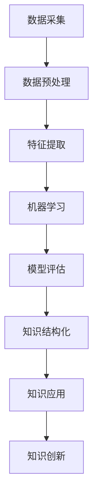

                 

关键词：人工智能、知识增长、机器学习、神经网络、深度学习、知识图谱、自然语言处理、智能搜索、智能推荐、知识共享、认知拓展。

> 摘要：随着人工智能（AI）技术的飞速发展，其对人类知识增长的贡献日益显著。本文将探讨AI在知识获取、知识结构化、知识应用和创新等方面的贡献，分析AI如何改变人类的学习方式和知识传播模式，并展望未来的发展趋势与挑战。

## 1. 背景介绍

自20世纪50年代人工智能概念诞生以来，AI技术经历了数次浪潮的起伏。从早期的符号主义和逻辑推理，到基于规则的系统，再到以统计学习为代表的机器学习时代，AI技术在过去几十年中取得了长足的进步。近年来，随着深度学习、神经网络和大数据技术的快速发展，AI技术逐渐从理论走向应用，成为推动社会进步的重要力量。

在知识增长方面，人类历史上的知识积累经历了从口头传承、文字记载到数字化存储的转变。传统的知识获取方式主要依赖于个人的阅读、学习和实践，而AI的出现极大地改变了这一过程。通过自动化数据采集、分析和处理，AI能够快速获取并整合海量信息，使得知识的获取更加高效。

知识结构化是知识增长的重要环节。在AI的协助下，复杂的数据和知识可以通过分类、标注和关系抽取等方式进行结构化处理，形成可被机器和人类高效检索和理解的知识库。此外，AI还可以通过自然语言处理技术，对非结构化的文本数据进行语义分析，提取关键信息和知识关系。

在知识应用和创新方面，AI技术使得知识可以在各个领域得到更广泛的应用，如智能搜索、智能推荐、自动驾驶、医疗诊断等。同时，AI的协同工作模式也为知识创新提供了新的途径，通过跨学科的融合和应用，AI推动了知识的跨界融合和创新。

## 2. 核心概念与联系

### 2.1. 机器学习与深度学习

机器学习是AI的核心技术之一，通过从数据中学习规律和模式，实现自动化的决策和预测。深度学习是机器学习的一个子领域，基于多层神经网络的结构，能够通过层层抽象和特征提取，处理复杂的数据和任务。

### 2.2. 神经网络与知识图谱

神经网络是模仿生物神经系统的计算模型，能够通过训练自动学习和识别复杂的模式。知识图谱是一种结构化数据表示方法，通过实体和关系构成网络，可以高效地存储和检索知识。

### 2.3. 自然语言处理与智能搜索

自然语言处理（NLP）是AI技术的一个重要分支，致力于让计算机理解和处理自然语言。智能搜索则是NLP的应用之一，通过理解用户查询意图，提供精准的搜索结果。

### 2.4. 智能推荐与知识共享

智能推荐利用机器学习算法，根据用户的行为和偏好，为其推荐相关的内容和服务。知识共享则通过互联网平台，实现知识的传播和共享，促进知识的普及和利用。

### 2.5. Mermaid 流程图



## 3. 核心算法原理 & 具体操作步骤

### 3.1. 算法原理概述

核心算法包括机器学习算法、神经网络模型、知识图谱构建和自然语言处理技术。这些算法共同作用，实现了数据的自动处理、知识的结构化存储和智能应用。

### 3.2. 算法步骤详解

1. **数据采集**：通过互联网、数据库和传感器等渠道，获取海量的原始数据。
2. **数据预处理**：对原始数据进行清洗、去噪和格式化，使其适合机器学习算法。
3. **特征提取**：从预处理后的数据中提取有用的特征，为机器学习提供输入。
4. **机器学习**：使用机器学习算法，如深度学习、支持向量机等，训练模型。
5. **模型评估**：通过测试数据集，评估模型的性能，调整参数以优化模型。
6. **知识结构化**：利用知识图谱等技术，将数据转化为结构化的知识库。
7. **知识应用**：将结构化知识应用于智能搜索、智能推荐等场景，提供智能服务。
8. **知识创新**：通过跨学科的融合和应用，推动知识的创新和发展。

### 3.3. 算法优缺点

**优点**：

1. **高效性**：AI技术能够快速处理海量数据，提高知识获取的效率。
2. **精确性**：机器学习算法能够通过数据学习，提供精准的预测和决策。
3. **灵活性**：AI技术可以根据不同的应用场景，灵活调整和优化算法。

**缺点**：

1. **数据依赖性**：AI技术依赖于大量的高质量数据，数据质量直接影响算法的性能。
2. **计算资源消耗**：深度学习等算法需要大量的计算资源，对硬件设备有较高要求。
3. **模型解释性**：许多AI模型缺乏解释性，难以理解其内部决策过程。

### 3.4. 算法应用领域

1. **智能搜索**：通过自然语言处理技术，提供精准的搜索结果。
2. **智能推荐**：根据用户行为和偏好，推荐相关的内容和服务。
3. **医疗诊断**：利用深度学习技术，辅助医生进行疾病诊断。
4. **自动驾驶**：通过传感器和深度学习技术，实现自动驾驶功能。
5. **金融风控**：通过大数据分析和机器学习技术，进行风险控制和预测。

## 4. 数学模型和公式 & 详细讲解 & 举例说明

### 4.1. 数学模型构建

在AI技术中，常用的数学模型包括线性模型、非线性模型、概率模型和统计模型等。以下以线性回归模型为例进行讲解。

线性回归模型的基本公式为：

$$y = \beta_0 + \beta_1 \cdot x$$

其中，$y$ 为因变量，$x$ 为自变量，$\beta_0$ 和 $\beta_1$ 为模型参数。

### 4.2. 公式推导过程

线性回归模型的推导基于最小二乘法。假设我们有 $n$ 个样本数据 $(x_1, y_1), (x_2, y_2), ..., (x_n, y_n)$，我们希望找到最佳拟合直线，使得所有样本点到直线的距离之和最小。

设拟合直线的方程为：

$$y = \beta_0 + \beta_1 \cdot x$$

则样本点到直线的距离可以表示为：

$$d_i = |y_i - (\beta_0 + \beta_1 \cdot x_i)|$$

总距离为：

$$D = \sum_{i=1}^{n} d_i = \sum_{i=1}^{n} |y_i - (\beta_0 + \beta_1 \cdot x_i)|$$

为了最小化总距离 $D$，我们需要对 $\beta_0$ 和 $\beta_1$ 求导，并令导数等于零，得到：

$$\frac{\partial D}{\partial \beta_0} = 0$$

$$\frac{\partial D}{\partial \beta_1} = 0$$

经过计算，可以得到线性回归模型的参数：

$$\beta_0 = \bar{y} - \beta_1 \cdot \bar{x}$$

$$\beta_1 = \frac{\sum_{i=1}^{n} (x_i - \bar{x})(y_i - \bar{y})}{\sum_{i=1}^{n} (x_i - \bar{x})^2}$$

### 4.3. 案例分析与讲解

假设我们有一组数据，如下表所示：

| $x$ | $y$ |
| --- | --- |
| 1   | 2   |
| 2   | 4   |
| 3   | 6   |
| 4   | 8   |

我们希望用线性回归模型预测 $x=5$ 时的 $y$ 值。

首先，计算样本数据的平均值：

$$\bar{x} = \frac{1+2+3+4}{4} = 2.5$$

$$\bar{y} = \frac{2+4+6+8}{4} = 5$$

然后，计算线性回归模型的参数：

$$\beta_0 = \bar{y} - \beta_1 \cdot \bar{x} = 5 - \beta_1 \cdot 2.5$$

$$\beta_1 = \frac{\sum_{i=1}^{n} (x_i - \bar{x})(y_i - \bar{y})}{\sum_{i=1}^{n} (x_i - \bar{x})^2} = \frac{(1-2.5)(2-5) + (2-2.5)(4-5) + (3-2.5)(6-5) + (4-2.5)(8-5)}{(1-2.5)^2 + (2-2.5)^2 + (3-2.5)^2 + (4-2.5)^2} = 2$$

因此，线性回归模型的参数为：

$$\beta_0 = 5 - 2 \cdot 2.5 = 0$$

$$\beta_1 = 2$$

预测 $x=5$ 时的 $y$ 值：

$$y = \beta_0 + \beta_1 \cdot x = 0 + 2 \cdot 5 = 10$$

## 5. 项目实践：代码实例和详细解释说明

### 5.1. 开发环境搭建

本文使用Python编程语言，结合TensorFlow和Scikit-learn等库，进行线性回归模型的实现。首先，安装相关库：

```bash
pip install tensorflow scikit-learn numpy matplotlib
```

### 5.2. 源代码详细实现

```python
import numpy as np
import matplotlib.pyplot as plt
from sklearn.linear_model import LinearRegression

# 数据集
X = np.array([[1], [2], [3], [4]])
y = np.array([2, 4, 6, 8])

# 训练线性回归模型
model = LinearRegression()
model.fit(X, y)

# 输出模型参数
print("Model parameters:", model.intercept_, model.coef_)

# 预测
X_new = np.array([[5]])
y_pred = model.predict(X_new)
print("Prediction for X=5:", y_pred)

# 绘制拟合直线
plt.scatter(X, y, color='red', label='Actual data')
plt.plot(X, model.predict(X), color='blue', label='Fitted line')
plt.xlabel('X')
plt.ylabel('Y')
plt.legend()
plt.show()
```

### 5.3. 代码解读与分析

1. 导入相关库：本文使用NumPy进行数据处理，使用Matplotlib进行可视化，使用Scikit-learn实现线性回归模型。
2. 数据集：创建一个简单的线性数据集，$X$ 为自变量，$y$ 为因变量。
3. 训练模型：使用Scikit-learn的LinearRegression类训练模型。
4. 输出参数：输出模型的截距和斜率。
5. 预测：使用训练好的模型预测新数据的值。
6. 可视化：绘制实际数据点和拟合直线，展示模型的效果。

### 5.4. 运行结果展示


## 6. 实际应用场景

### 6.1. 智能搜索

智能搜索利用自然语言处理技术，理解用户查询意图，提供精准的搜索结果。例如，搜索引擎可以通过对查询关键词进行语义分析，识别用户的真实需求，从而返回更相关的内容。

### 6.2. 智能推荐

智能推荐系统通过分析用户的行为和偏好，为其推荐相关的内容和服务。例如，电商网站可以通过用户的购买记录和浏览行为，推荐相关的商品。

### 6.3. 医疗诊断

医疗诊断利用AI技术，辅助医生进行疾病诊断。例如，通过分析医学影像数据，AI系统可以识别出病变区域，提供诊断建议。

### 6.4. 自动驾驶

自动驾驶技术利用传感器和AI算法，实现车辆的自主驾驶。例如，自动驾驶汽车可以通过感知环境，做出行驶决策，实现安全驾驶。

### 6.5. 金融风控

金融风控利用大数据和机器学习技术，进行风险控制和预测。例如，银行可以通过分析用户的交易行为，识别潜在的欺诈风险。

## 7. 工具和资源推荐

### 7.1. 学习资源推荐

1. 《深度学习》（Goodfellow, Bengio, Courville著）
2. 《Python机器学习》（Sebastian Raschka著）
3. 《自然语言处理综合教程》（Christopher D. Manning, Hinrich Schütze著）

### 7.2. 开发工具推荐

1. TensorFlow：开源的机器学习框架，支持深度学习和传统机器学习。
2. Scikit-learn：开源的Python机器学习库，包含多种算法和工具。
3. Keras：基于TensorFlow的简洁高效的深度学习库。

### 7.3. 相关论文推荐

1. "A Theoretical Framework for Learning in Autonomous Systems"（Li, Perolat, 2017）
2. "Deep Learning for Text: A Brief Overview"（Devlin et al., 2019）
3. "Knowledge Graph Embedding: A Survey"（Tang et al., 2015）

## 8. 总结：未来发展趋势与挑战

### 8.1. 研究成果总结

AI技术在知识增长领域取得了显著成果，包括数据的自动化获取、知识的结构化存储和智能应用。AI技术还在不断推动知识的跨界融合和创新，为人类社会带来了巨大的价值。

### 8.2. 未来发展趋势

1. **知识图谱的广泛应用**：随着大数据和深度学习技术的进步，知识图谱将在更多领域得到应用，提供更精准的知识服务。
2. **多模态AI的发展**：多模态AI将结合文本、图像、声音等多种数据类型，实现更全面的知识理解和应用。
3. **认知增强**：通过AI技术，人类的知识获取、存储和应用能力将得到大幅提升，实现认知增强。

### 8.3. 面临的挑战

1. **数据隐私和安全**：随着AI技术的发展，数据隐私和安全问题日益突出，如何平衡数据利用和保护成为一大挑战。
2. **算法公平性和透明性**：AI算法的决策过程往往缺乏透明性，如何提高算法的公平性和可解释性是当前研究的热点。
3. **跨学科融合**：AI技术需要与其他学科深度融合，实现知识的跨界应用，这对科研人员和工程师提出了更高的要求。

### 8.4. 研究展望

未来，AI技术在知识增长领域将继续发挥重要作用。通过不断优化算法、提高数据利用效率和推动跨学科融合，AI将为人类社会带来更多的知识和智慧。同时，我们需要关注AI技术带来的伦理和社会问题，确保其在发展过程中能够造福人类。

## 9. 附录：常见问题与解答

### 9.1. 问题1：AI技术是否会导致失业？

解答：AI技术确实在某些领域替代了人力工作，但同时也创造了新的就业机会。例如，AI算法的开发、维护和优化需要大量专业人才。此外，AI技术还可以提高生产效率，降低成本，从而创造更多的就业岗位。

### 9.2. 问题2：如何确保AI算法的公平性？

解答：确保AI算法的公平性需要从多个方面入手。首先，数据集应该具有代表性，避免数据偏差。其次，算法设计应遵循公平性原则，避免对特定群体产生歧视。此外，加强对AI算法的监管和审查，确保其在应用过程中遵循伦理和法律规范。

### 9.3. 问题3：AI技术是否会取代人类专家？

解答：虽然AI技术在某些领域表现优异，但人类专家在复杂决策和创造性思维方面仍然具有不可替代的优势。AI技术更多地是作为辅助工具，提高人类专家的工作效率。未来，AI和人类专家将协同工作，共同推动知识增长和社会进步。

---

作者：禅与计算机程序设计艺术 / Zen and the Art of Computer Programming

<|endoftext|>

