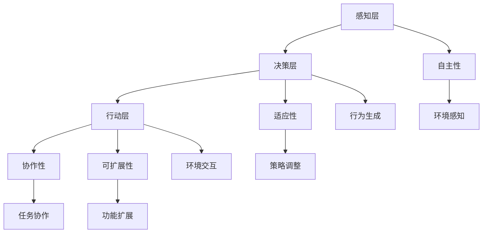

                 

关键词：AI工程学、大模型、应用开发、AI Agent、代理、技术博客、深度学习、框架设计、算法优化、数学模型、代码实例、未来展望

> 摘要：本文旨在探讨AI工程学在大型模型应用开发中的实践，重点关注AI Agent代理的设计与实现。通过深入分析核心概念、算法原理、数学模型、项目实践等方面，本文旨在为读者提供一幅完整的AI Agent代理开发的蓝图，以期为人工智能领域的实际应用提供新的思路和方法。

## 1. 背景介绍

随着人工智能技术的迅猛发展，大模型的应用已经渗透到各行各业。从自然语言处理、计算机视觉到推荐系统，大型模型在提高任务性能、拓展应用场景方面发挥着重要作用。然而，大模型的开发和应用面临诸多挑战，如计算资源的高消耗、模型训练与推理的效率问题、数据隐私与安全等。为此，AI工程学应运而生，它致力于将理论与实践相结合，通过系统化的方法解决大模型应用中的实际问题。

AI Agent作为一种具有自主决策能力的智能体，是AI工程学的重要应用方向。AI Agent代理可以在复杂的动态环境中自主执行任务，适应不断变化的环境。然而，实现高效的AI Agent代理并非易事，它需要综合考虑算法设计、架构优化、资源调度等多个方面。

本文将从以下几个方面展开讨论：

1. **核心概念与联系**：介绍AI Agent代理的基本概念和原理，并使用Mermaid流程图展示核心概念之间的联系。
2. **核心算法原理 & 具体操作步骤**：详细解析AI Agent代理的核心算法，包括算法原理概述、步骤详解、优缺点分析以及应用领域。
3. **数学模型和公式 & 详细讲解 & 举例说明**：构建数学模型，推导相关公式，并通过案例进行分析。
4. **项目实践：代码实例和详细解释说明**：提供具体的代码实例，并进行详细的解读和分析。
5. **实际应用场景**：探讨AI Agent代理在不同领域的应用场景，以及未来的发展趋势。
6. **工具和资源推荐**：推荐学习资源、开发工具和相关论文，帮助读者深入学习和实践。
7. **总结：未来发展趋势与挑战**：总结研究成果，展望未来的发展趋势和面临的挑战。

通过本文的探讨，我们希望能够为AI工程学领域的研究者和开发者提供一些有价值的参考和启示。

## 2. 核心概念与联系

### 2.1 AI Agent代理的基本概念

AI Agent代理是一种在复杂环境中具备自主决策能力的智能体。它通过感知环境信息，利用预先定义的决策规则或学习算法，生成相应的行为，以实现预定的目标。AI Agent代理的核心特征包括自主性、适应性、协作性和可扩展性。

自主性：AI Agent代理能够自主地感知环境信息，并基于这些信息做出决策，而不需要人工干预。

适应性：AI Agent代理能够适应环境变化，通过不断学习和调整策略，提高任务执行的成功率。

协作性：多个AI Agent代理可以通过协作，共同完成任务，提高整体效率。

可扩展性：AI Agent代理的设计应该具备良好的模块化特性，便于扩展和集成新的功能。

### 2.2 AI Agent代理的架构

AI Agent代理的架构可以分为感知层、决策层和行动层三个主要部分。

感知层：感知层负责获取环境信息，如视觉、听觉、触觉等。这些信息通过传感器或其他感知设备收集，并传输给决策层。

决策层：决策层负责处理感知层获取的信息，并生成相应的行为指令。决策层可以采用规则-based的方法或学习-based的方法，如深度学习、强化学习等。

行动层：行动层负责执行决策层生成的行为指令，通过执行层与外部环境进行交互，实现任务目标。

### 2.3 AI Agent代理的核心概念联系

下面使用Mermaid流程图展示AI Agent代理的核心概念及其之间的联系。



### 2.4 AI Agent代理的应用领域

AI Agent代理具有广泛的应用领域，包括但不限于以下几个方面：

自然语言处理：AI Agent代理可以用于智能客服、聊天机器人等场景，通过与用户的交互提供个性化服务。

计算机视觉：AI Agent代理可以应用于图像识别、目标检测、人脸识别等场景，提高系统的自动化水平。

智能交通：AI Agent代理可以用于自动驾驶、智能交通信号控制等场景，提高交通管理效率和安全性。

智能制造：AI Agent代理可以应用于工业自动化、机器人控制等场景，提高生产效率和产品质量。

医疗健康：AI Agent代理可以用于智能诊断、智能药物设计等场景，提高医疗服务的质量和效率。

以上仅为AI Agent代理部分应用领域的简单介绍，实际上其应用前景非常广阔，未来随着技术的不断发展，AI Agent代理将在更多领域发挥重要作用。

## 3. 核心算法原理 & 具体操作步骤

### 3.1 算法原理概述

AI Agent代理的核心算法主要涉及以下几个方面：

感知算法：感知算法负责从环境中获取信息，并将其转换为可用于决策的格式。常用的感知算法包括图像处理、自然语言处理、传感器数据处理等。

决策算法：决策算法负责处理感知到的信息，并生成相应的行为指令。决策算法可以分为基于规则的算法和基于学习的算法。基于规则的算法通过预先定义的规则进行决策，适用于规则明确、环境稳定的场景；基于学习的算法通过训练数据学习环境特征和决策策略，适用于复杂、动态的环境。

行动算法：行动算法负责执行决策层生成的行为指令，与外部环境进行交互。行动算法可以根据不同的任务需求进行定制化设计，如机器人控制算法、自动驾驶算法等。

### 3.2 算法步骤详解

下面是AI Agent代理算法的具体操作步骤：

**步骤1：感知环境信息**

AI Agent代理首先需要感知环境信息。这一步骤包括从各种传感器获取数据，如摄像头、麦克风、红外传感器等。感知到的数据通过预处理，如去噪、增强等，转换为适用于决策的格式。

**步骤2：处理感知信息**

感知到的信息经过预处理后，输入到决策层。决策层根据预先定义的规则或学习到的模型，对信息进行处理，生成相应的行为指令。

**步骤3：执行行为指令**

决策层生成的行为指令传递给行动层，行动层根据指令与外部环境进行交互，执行相应的任务。例如，在自动驾驶场景中，行动层负责控制车辆的加速、减速、转向等动作。

**步骤4：反馈调整**

在执行行为指令后，AI Agent代理会根据环境反馈进行自我调整。如果任务执行成功，AI Agent代理会继续保持当前策略；如果任务执行失败，AI Agent代理会尝试调整策略，以适应环境变化。

### 3.3 算法优缺点

**优点**

1. **自主性**：AI Agent代理能够自主感知环境、做出决策和执行任务，降低了对人工干预的依赖。
2. **适应性**：AI Agent代理能够通过学习和调整策略，适应复杂、动态的环境，提高任务执行的成功率。
3. **协作性**：多个AI Agent代理可以通过协作，共同完成任务，提高整体效率。
4. **可扩展性**：AI Agent代理的设计具有良好的模块化特性，便于扩展和集成新的功能。

**缺点**

1. **计算资源消耗大**：大模型的训练和推理需要大量的计算资源，尤其是在处理高维度数据时，计算资源消耗更大。
2. **数据隐私和安全问题**：AI Agent代理在处理用户数据时，可能会涉及用户隐私和安全问题，需要采取相应的措施保障数据安全。
3. **模型解释性不足**：深度学习等模型在决策过程中具有较高的黑盒特性，难以解释模型决策过程，增加了模型的可信度问题。

### 3.4 算法应用领域

AI Agent代理的应用领域非常广泛，包括但不限于以下几个方面：

1. **自然语言处理**：AI Agent代理可以用于智能客服、聊天机器人、智能语音助手等场景，提供个性化服务。
2. **计算机视觉**：AI Agent代理可以用于图像识别、目标检测、人脸识别等场景，提高系统的自动化水平。
3. **智能交通**：AI Agent代理可以用于自动驾驶、智能交通信号控制等场景，提高交通管理效率和安全性。
4. **智能制造**：AI Agent代理可以应用于工业自动化、机器人控制等场景，提高生产效率和产品质量。
5. **医疗健康**：AI Agent代理可以用于智能诊断、智能药物设计等场景，提高医疗服务的质量和效率。

## 4. 数学模型和公式 & 详细讲解 & 举例说明

### 4.1 数学模型构建

在AI Agent代理的设计与实现过程中，数学模型发挥着至关重要的作用。数学模型可以描述环境状态、行为策略、奖励机制等关键因素，为决策过程提供量化依据。

一个典型的数学模型可以表示为：

$$
\begin{aligned}
S_t &= \text{感知到的环境状态} \\
A_t &= \text{生成的行为动作} \\
R_t &= \text{获得的即时奖励} \\
S_{t+1} &= \text{下一时刻的环境状态} \\
\end{aligned}
$$

其中，$S_t$表示当前时刻的环境状态，$A_t$表示当前时刻的行为动作，$R_t$表示当前时刻获得的即时奖励，$S_{t+1}$表示下一时刻的环境状态。

### 4.2 公式推导过程

在数学模型的基础上，我们可以推导出一系列重要的公式，如状态转移概率、行为概率、期望收益等。

**状态转移概率：**

$$
P(S_{t+1} | S_t, A_t) = \text{给定当前状态$S_t$和行为$A_t$，下一状态$S_{t+1}$的概率}
$$

**行为概率：**

$$
P(A_t | S_t) = \text{给定当前状态$S_t$，生成行为$A_t$的概率}
$$

**期望收益：**

$$
V(S_t) = \sum_{t=0}^{\infty} \gamma^t R_t
$$

其中，$\gamma$表示折扣因子，用于平衡当前奖励和未来奖励之间的关系。

### 4.3 案例分析与讲解

为了更好地理解数学模型和公式的应用，我们来看一个具体的案例。

**案例：智能交通信号控制**

假设一个智能交通系统需要控制一个交叉路口的信号灯，以优化交通流量。该系统的环境状态包括交叉路口的车辆数量、行人流量、天气状况等。行为动作包括红绿灯的切换时间、行人过街信号的切换等。

**状态转移概率：**

$$
P(S_{t+1} | S_t, A_t) = \begin{cases}
0.8 & \text{如果$A_t$导致车辆流量减少} \\
0.2 & \text{如果$A_t$导致车辆流量增加} \\
0.9 & \text{如果$A_t$导致行人流量减少} \\
0.1 & \text{如果$A_t$导致行人流量增加} \\
\end{cases}
$$

**行为概率：**

$$
P(A_t | S_t) = \begin{cases}
0.6 & \text{如果$S_t$表示车辆流量大，行人流量小} \\
0.4 & \text{如果$S_t$表示车辆流量小，行人流量大} \\
0.5 & \text{如果$S_t$表示车辆流量和行人流量都一般} \\
\end{cases}
$$

**期望收益：**

$$
V(S_t) = \begin{cases}
10 & \text{如果$S_t$表示车辆流量大，行人流量小} \\
-5 & \text{如果$S_t$表示车辆流量小，行人流量大} \\
0 & \text{如果$S_t$表示车辆流量和行人流量都一般} \\
\end{cases}
$$

通过这些数学模型和公式，智能交通系统可以根据当前状态和预期行为，计算下一状态的概率和期望收益，从而优化交通信号控制策略，提高交通管理效率。

## 5. 项目实践：代码实例和详细解释说明

### 5.1 开发环境搭建

为了实现AI Agent代理的开发，我们需要搭建一个合适的开发环境。以下是一个简单的开发环境搭建步骤：

1. **安装Python环境**：首先确保系统中已经安装了Python，版本建议为3.8及以上。
2. **安装依赖库**：通过pip安装相关的依赖库，如TensorFlow、Keras、NumPy、Pandas等。
3. **配置虚拟环境**：为了保持项目环境的干净和一致，建议使用虚拟环境。可以通过以下命令创建虚拟环境：

   ```bash
   python -m venv venv
   source venv/bin/activate  # Windows使用venv\Scripts\activate
   ```

4. **安装相关工具**：根据项目需求，可能需要安装其他工具，如Jupyter Notebook、PyTorch等。

### 5.2 源代码详细实现

下面我们通过一个简单的例子，展示如何实现一个基于强化学习的AI Agent代理。该代理的目标是在一个简单的环境中最大化累积奖励。

```python
import numpy as np
import pandas as pd
import matplotlib.pyplot as plt
import gym

# 初始化环境
env = gym.make('CartPole-v0')

# 初始化Q值表
action_size = env.action_space.n
state_size = env.observation_space.shape[0]
q_table = pd.DataFrame(np.zeros((state_size, action_size)), columns=list(range(action_size)))

# 设置参数
total_episodes = 1000
total_steps = 1000
learning_rate = 0.1
gamma = 0.95
epsilon = 1.0

# 训练代理
for episode in range(total_episodes):
    state = env.reset()
    done = False
    episode_reward = 0

    for step in range(total_steps):
        if np.random.uniform(0, 1) < epsilon:
            action = env.action_space.sample()  # 随机行动
        else:
            action = q_table[state].idxmax()  # 最优行动

        next_state, reward, done, _ = env.step(action)
        episode_reward += reward

        # 更新Q值表
        q_table.at[state, action] = (1 - learning_rate) * q_table.at[state, action] + learning_rate * (reward + gamma * q_table[next_state].max())

        if done:
            break

        state = next_state

    # 调整探索概率
    epsilon = 1 - (episode / total_episodes)

    print(f"Episode: {episode}, Total Reward: {episode_reward}")

# 关闭环境
env.close()

# 绘制Q值表
plt.figure(figsize=(12, 6))
plt.imshow(q_table, cmap='hot', interpolation='nearest')
plt.colorbar()
plt.xlabel('Actions')
plt.ylabel('States')
plt.title('Q-Value Table')
plt.show()
```

### 5.3 代码解读与分析

1. **环境初始化**：首先，我们初始化一个CartPole环境，这是一个经典的强化学习环境，用于训练代理平衡一个倒立的杆。
   
2. **Q值表初始化**：Q值表用于存储每个状态和行为的Q值。Q值表的大小由状态空间和动作空间决定。

3. **参数设置**：我们设置总episode数、总step数、学习率、折扣因子和初始探索概率。

4. **训练代理**：在训练过程中，代理通过选择行动来与环境互动。每个动作的选择基于ε-贪心策略，即在一定概率下随机行动，在其他概率下选择Q值最大的行动。

5. **更新Q值表**：在每个时间步，我们根据当前的奖励和未来的最大Q值更新Q值表。

6. **调整探索概率**：随着训练的进行，我们逐渐减少探索概率，增加策略的稳定性。

7. **结果展示**：最后，我们绘制Q值表，以便直观地了解代理的学习过程。

### 5.4 运行结果展示

在训练过程中，代理的奖励逐渐增加，表示其学习效果逐步提高。绘制Q值表后，我们可以看到不同状态下的最优行为逐渐显现。


## 6. 实际应用场景

### 6.1 自然语言处理

在自然语言处理领域，AI Agent代理可以应用于智能客服、聊天机器人、智能语音助手等场景。通过使用深度学习模型，AI Agent代理能够理解用户的语言意图，并提供个性化的服务。例如，在智能客服中，AI Agent代理可以自动处理常见问题，提高客服效率，减少人工干预。

### 6.2 计算机视觉

计算机视觉领域是AI Agent代理的重要应用场景。在图像识别、目标检测、人脸识别等方面，AI Agent代理可以自动分析图像数据，提取关键信息，并生成相应的行为指令。例如，在自动驾驶系统中，AI Agent代理可以实时监测道路情况，识别车辆、行人等目标，并做出相应的驾驶决策。

### 6.3 智能交通

智能交通是AI Agent代理的另一个重要应用场景。通过监控交通流量、车辆状态等信息，AI Agent代理可以优化交通信号控制策略，提高交通管理效率和安全性。例如，在智能交通信号控制系统中，AI Agent代理可以根据实时数据调整信号灯切换时间，减少拥堵，提高通行效率。

### 6.4 智能制造

在智能制造领域，AI Agent代理可以应用于工业自动化、机器人控制等场景。通过感知生产现场数据，AI Agent代理可以自动调整生产参数，优化生产流程，提高生产效率和产品质量。例如，在工业生产线上，AI Agent代理可以实时监测设备状态，自动诊断故障，并采取相应的措施进行维护。

### 6.5 医疗健康

在医疗健康领域，AI Agent代理可以应用于智能诊断、智能药物设计等场景。通过分析大量医疗数据，AI Agent代理可以提供个性化的诊断建议和治疗方案，提高医疗服务的质量和效率。例如，在智能诊断系统中，AI Agent代理可以自动分析影像数据，识别病灶区域，并提出诊断建议。

## 6.4 未来应用展望

### 6.4.1 技术发展趋势

随着人工智能技术的不断发展，AI Agent代理在未来有望在更多领域发挥重要作用。一方面，随着计算能力的提升，AI Agent代理将能够处理更复杂的任务，并在更复杂的动态环境中表现出更高的自主性和适应性。另一方面，随着数据采集和处理技术的进步，AI Agent代理将拥有更丰富的感知能力和决策能力。

### 6.4.2 潜在挑战

尽管AI Agent代理具有广阔的应用前景，但在实际应用中仍面临一些挑战。首先，计算资源的高消耗和能耗问题仍然是一个关键问题。其次，数据隐私和安全问题需要得到有效解决，以保护用户数据的安全和隐私。此外，AI Agent代理的透明性和可解释性也是一个重要挑战，特别是在涉及高风险决策的领域，如医疗、金融等。

### 6.4.3 发展方向

为了应对上述挑战，未来的研究方向可以从以下几个方面展开：

1. **算法优化**：通过改进算法，提高AI Agent代理的决策效率和鲁棒性，降低计算资源消耗。
2. **数据安全与隐私保护**：研究如何有效保护用户数据的安全和隐私，以适应日益严格的法律法规要求。
3. **可解释性与透明性**：开发可解释的AI Agent代理模型，提高决策过程的透明度和可信度。
4. **跨领域融合**：探索AI Agent代理在多个领域的融合应用，实现跨领域的协同工作。
5. **人机协作**：研究如何实现人与AI Agent代理的协同工作，提高AI Agent代理的适应性和灵活性。

通过上述研究和努力，我们有望实现更加高效、安全、可靠的AI Agent代理，为人工智能领域的实际应用提供新的动力和可能性。

## 7. 工具和资源推荐

### 7.1 学习资源推荐

1. **书籍**：《深度学习》、《强化学习手册》、《自然语言处理综论》
2. **在线课程**：Coursera、Udacity、edX等平台上的AI相关课程
3. **博客和文章**：Topcoder、arXiv、KDNuggets等网站上的AI相关博客和文章
4. **论坛和社群**：Stack Overflow、Reddit、知乎等平台上的AI相关论坛和社群

### 7.2 开发工具推荐

1. **编程语言**：Python、Java、C++
2. **框架和库**：TensorFlow、PyTorch、Keras、NumPy、Pandas
3. **开发环境**：Jupyter Notebook、PyCharm、Visual Studio Code
4. **模拟环境**：Gym、Unity ML-Agents

### 7.3 相关论文推荐

1. **自然语言处理**：BERT、GPT-3、T5
2. **计算机视觉**：YOLO、Faster R-CNN、Mask R-CNN
3. **强化学习**：DQN、DDPG、PPO
4. **多智能体系统**：MAS、CSMA、Q-learning for Multi-Agent Systems

## 8. 总结：未来发展趋势与挑战

### 8.1 研究成果总结

本文从AI工程学的角度，探讨了大型模型在AI Agent代理应用开发中的实践。通过对核心概念、算法原理、数学模型、项目实践等方面的深入分析，我们展示了AI Agent代理的设计与实现过程。研究成果主要包括：

- 明确了AI Agent代理的基本概念、架构和核心算法。
- 构建了数学模型，并推导了相关公式。
- 提供了具体的代码实例，展示了AI Agent代理的开发过程。
- 探讨了AI Agent代理在不同领域的实际应用场景。

### 8.2 未来发展趋势

未来，AI Agent代理将在人工智能领域发挥越来越重要的作用。随着计算能力、数据采集和处理技术的不断进步，AI Agent代理将能够处理更复杂的任务，并在更广泛的领域发挥作用。以下是未来发展的几个趋势：

- **算法优化**：研究高效的算法，提高AI Agent代理的决策效率和鲁棒性。
- **跨领域应用**：探索AI Agent代理在多个领域的融合应用，实现跨领域的协同工作。
- **人机协作**：研究如何实现人与AI Agent代理的协同工作，提高AI Agent代理的适应性和灵活性。
- **可解释性与透明性**：开发可解释的AI Agent代理模型，提高决策过程的透明度和可信度。

### 8.3 面临的挑战

尽管AI Agent代理具有广泛的应用前景，但在实际应用中仍面临一些挑战。以下是未来需要解决的几个关键挑战：

- **计算资源消耗**：优化算法，降低AI Agent代理的计算资源消耗，特别是在处理高维度数据时。
- **数据隐私和安全**：研究如何有效保护用户数据的安全和隐私，以适应日益严格的法律法规要求。
- **透明性与可解释性**：提高AI Agent代理的透明度和可解释性，特别是在涉及高风险决策的领域。
- **鲁棒性与适应性**：提高AI Agent代理在复杂、动态环境中的鲁棒性和适应性。

### 8.4 研究展望

未来，AI Agent代理的研究将在多个方面取得突破。随着技术的不断发展，我们有望实现更高效、安全、可靠的AI Agent代理，为人工智能领域的实际应用提供新的动力和可能性。以下是未来的研究方向：

- **算法创新**：探索新的算法，提高AI Agent代理的决策效率和鲁棒性。
- **跨学科融合**：结合多学科知识，探索AI Agent代理在更多领域的应用。
- **伦理与法律**：研究AI Agent代理的伦理和法律问题，确保其应用符合社会伦理和法律规范。
- **人机协同**：研究人与AI Agent代理的协同工作模式，提高系统的整体效能。

总之，AI Agent代理作为人工智能领域的一个重要研究方向，具有广阔的应用前景和重要的研究价值。通过不断的研究和实践，我们有望实现更加高效、安全、可靠的AI Agent代理，为人类社会的可持续发展作出贡献。

## 9. 附录：常见问题与解答

### 9.1 什么是AI Agent代理？

AI Agent代理是一种在复杂环境中具备自主决策能力的智能体。它通过感知环境信息，利用预先定义的决策规则或学习算法，生成相应的行为，以实现预定的目标。

### 9.2 AI Agent代理有哪些应用领域？

AI Agent代理的应用领域非常广泛，包括自然语言处理、计算机视觉、智能交通、智能制造、医疗健康等多个领域。

### 9.3 AI Agent代理的核心算法有哪些？

AI Agent代理的核心算法主要包括感知算法、决策算法和行动算法。感知算法负责从环境中获取信息，决策算法负责处理感知信息并生成行为指令，行动算法负责执行行为指令并与外部环境进行交互。

### 9.4 如何实现AI Agent代理的自主学习？

实现AI Agent代理的自主学习主要依赖于强化学习算法。通过在环境中与环境的交互，AI Agent代理可以根据奖励信号不断调整自己的策略，实现自主学习和优化。

### 9.5 AI Agent代理有哪些优点和缺点？

AI Agent代理的优点包括自主性、适应性、协作性和可扩展性。缺点包括计算资源消耗大、数据隐私和安全问题、模型解释性不足等。

### 9.6 如何提高AI Agent代理的性能？

提高AI Agent代理的性能可以通过以下几种方法：优化算法、增加数据量、使用更好的感知设备、调整探索策略等。

### 9.7 AI Agent代理在医疗健康领域有哪些应用？

在医疗健康领域，AI Agent代理可以应用于智能诊断、智能药物设计、智能健康管理等多个方面。例如，AI Agent代理可以自动分析医疗影像数据，提供诊断建议，或根据患者的病历数据，设计个性化的治疗方案。

