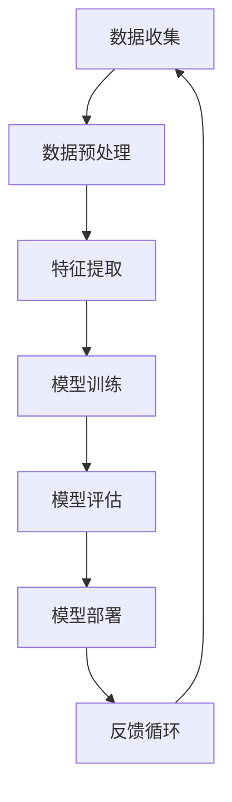

                 

关键词：人工智能，工程实践，最佳实践，代码实战，架构设计，算法优化，性能调优

> 摘要：本文旨在探讨人工智能工程中的最佳实践原则，结合实际代码实战案例，深入解析如何将理论应用到实践中，提高人工智能系统的效率和可靠性。

## 1. 背景介绍

人工智能（AI）作为计算机科学的一个分支，近年来得到了迅猛发展。从传统的规则驱动方法到现代的数据驱动方法，人工智能的进步极大地推动了各行各业的发展。然而，随着AI系统的复杂性和规模的增加，工程实践中的挑战也随之而来。如何设计高效、可靠、可维护的AI系统成为当前研究的热点。

AI工程实践中，最佳实践原则起到了至关重要的作用。这些原则包括数据质量保障、模型优化、算法选择、系统架构设计等，它们共同构成了构建高质量AI系统的基石。

本文将围绕以下主题进行探讨：

1. **核心概念与联系**：介绍人工智能工程中的关键概念及其相互关系。
2. **核心算法原理与操作步骤**：分析并讲解核心算法的原理和具体实现步骤。
3. **数学模型与公式**：详细阐述与算法相关的数学模型和推导过程。
4. **项目实践**：通过实际代码实例展示算法的应用和实现。
5. **实际应用场景**：探讨AI在不同领域的应用实例和未来发展趋势。
6. **工具和资源推荐**：介绍用于AI工程实践的学习资源、开发工具和相关论文。
7. **总结与展望**：总结研究成果，展望未来发展趋势和面临的挑战。

## 2. 核心概念与联系

在人工智能工程中，有几个核心概念是至关重要的，它们共同构成了AI系统的框架。以下是这些概念及其相互关系的概述，并通过一个Mermaid流程图展示：



### 2.1 数据收集

数据收集是AI工程的起点，高质量的数据是训练出色模型的基础。数据来源可以是内部数据库、公共数据集或通过网络抓取。

### 2.2 数据预处理

数据预处理包括数据清洗、归一化、去噪声等步骤。这些步骤确保数据质量，为后续的特征提取和模型训练奠定基础。

### 2.3 特征提取

特征提取是数据预处理的重要环节，通过选择和构造特征来提高模型的表现。特征选择和特征工程在AI系统中起到了至关重要的作用。

### 2.4 模型训练

模型训练是AI系统的核心步骤，通过训练算法学习数据中的模式和规律。选择合适的训练算法和优化器对于提高模型性能至关重要。

### 2.5 模型评估

模型评估用于衡量模型的表现，常用的评估指标包括准确率、召回率、F1分数等。通过评估，可以确定模型是否达到预期的性能。

### 2.6 模型部署

模型部署是将训练好的模型应用到实际场景中的过程。这一步骤涉及到模型打包、部署环境和性能监控等。

### 2.7 反馈循环

反馈循环是AI工程实践中的关键环节，通过收集用户反馈，不断优化模型和系统，实现持续改进。

以上流程图展示了这些核心概念之间的相互关系，形成一个闭环，确保AI系统的持续迭代和优化。

## 3. 核心算法原理与操作步骤

### 3.1 算法原理概述

在人工智能工程中，常用的核心算法包括神经网络、支持向量机、决策树等。以下是这些算法的原理概述：

### 3.2 算法步骤详解

#### 3.2.1 神经网络

神经网络是一种模拟人脑神经元连接和计算过程的计算模型。其基本步骤如下：

1. **初始化权重和偏置**：随机初始化神经网络中的权重和偏置。
2. **前向传播**：输入数据通过网络，每个神经元进行计算，得到输出。
3. **反向传播**：计算输出与实际结果的差异，通过反向传播更新权重和偏置。
4. **优化算法**：使用梯度下降或其他优化算法调整权重和偏置，减小误差。

#### 3.2.2 支持向量机

支持向量机是一种用于分类和回归的算法，其基本步骤如下：

1. **选择核函数**：根据数据特性选择合适的核函数。
2. **求解最优超平面**：通过优化问题求解出最优超平面。
3. **分类决策**：新数据通过计算与支持向量的距离进行分类。

#### 3.2.3 决策树

决策树是一种树形结构，通过一系列规则进行决策。其基本步骤如下：

1. **选择特征**：选择具有最高信息增益的特征作为分割节点。
2. **分割数据**：根据特征值将数据分为两个子集。
3. **递归构建**：对子集继续进行分割，直到满足停止条件。
4. **生成决策树**：将所有分割规则组合成一棵决策树。

### 3.3 算法优缺点

每种算法都有其优缺点：

- **神经网络**：适用于处理高维度数据和复杂数据结构，但训练时间较长，对数据质量要求高。
- **支持向量机**：具有良好的分类效果，但计算复杂度较高，对大数据集性能不佳。
- **决策树**：易于理解和实现，计算效率高，但可能产生过拟合，对噪声敏感。

### 3.4 算法应用领域

这些算法在不同领域有不同的应用：

- **神经网络**：在图像识别、自然语言处理、语音识别等领域有广泛应用。
- **支持向量机**：在生物信息学、金融风险控制、图像分类等领域有重要应用。
- **决策树**：在医学诊断、信用评分、商业智能等领域有广泛应用。

## 4. 数学模型和公式

在人工智能工程中，数学模型和公式是算法实现的基础。以下是几个常用的数学模型和公式，并通过具体例子进行解释。

### 4.1 数学模型构建

#### 4.1.1 线性回归

线性回归是一种用于预测连续值的模型，其公式如下：

$$ y = \beta_0 + \beta_1x + \epsilon $$

其中，$y$ 是预测值，$x$ 是输入特征，$\beta_0$ 和 $\beta_1$ 是模型的参数，$\epsilon$ 是误差项。

#### 4.1.2 逻辑回归

逻辑回归是一种用于分类的模型，其公式如下：

$$ P(y=1) = \frac{1}{1 + e^{-(\beta_0 + \beta_1x)}} $$

其中，$P(y=1)$ 是预测为1的概率，$\beta_0$ 和 $\beta_1$ 是模型的参数。

### 4.2 公式推导过程

以线性回归为例，其参数估计过程如下：

1. **最小二乘法**：选择参数使误差平方和最小。
2. **求解最优参数**：通过求解最小二乘问题，得到参数估计值。
3. **验证与优化**：通过交叉验证和优化算法进一步优化参数。

### 4.3 案例分析与讲解

假设我们有一个简单的线性回归问题，数据集如下：

| x | y |
|---|---|
| 1 | 2 |
| 2 | 3 |
| 3 | 4 |

通过最小二乘法，我们可以求解出线性回归模型的参数：

1. **计算均值**：
   $$ \bar{x} = \frac{1+2+3}{3} = 2 $$
   $$ \bar{y} = \frac{2+3+4}{3} = 3 $$

2. **计算协方差**：
   $$ \sigma_{xy} = \frac{(1-2)(2-3) + (2-2)(3-3) + (3-2)(4-3)}{3} = \frac{-1+0+1}{3} = 0 $$

3. **计算方差**：
   $$ \sigma_{x} = \frac{(1-2)^2 + (2-2)^2 + (3-2)^2}{3} = \frac{1+0+1}{3} = \frac{2}{3} $$

4. **计算斜率**：
   $$ \beta_1 = \frac{\sigma_{xy}}{\sigma_{x}} = \frac{0}{\frac{2}{3}} = 0 $$

5. **计算截距**：
   $$ \beta_0 = \bar{y} - \beta_1\bar{x} = 3 - 0 \times 2 = 3 $$

最终得到的线性回归模型为：

$$ y = 3 + 0x $$

这个模型表示y的值总是3，没有考虑x的影响。在实际应用中，我们会通过更多的数据点和更复杂的公式来提高模型的准确性和实用性。

## 5. 项目实践：代码实例和详细解释说明

为了更好地理解AI工程实践中的算法和模型，我们将通过一个实际项目来展示代码的实现和详细解释。

### 5.1 开发环境搭建

首先，我们需要搭建一个开发环境。这里我们使用Python作为主要编程语言，配合常用的库如NumPy、Pandas、scikit-learn等。以下是环境搭建的步骤：

1. **安装Python**：下载并安装Python，可以选择Python 3.8及以上版本。
2. **安装依赖库**：通过pip命令安装所需的库，例如：
   ```bash
   pip install numpy pandas scikit-learn
   ```

### 5.2 源代码详细实现

以下是一个简单的线性回归项目的源代码实现：

```python
import numpy as np
import pandas as pd
from sklearn.linear_model import LinearRegression
from sklearn.model_selection import train_test_split
from sklearn.metrics import mean_squared_error

# 读取数据
data = pd.read_csv('data.csv')
X = data[['x']]
y = data['y']

# 数据预处理
X_train, X_test, y_train, y_test = train_test_split(X, y, test_size=0.2, random_state=42)

# 模型训练
model = LinearRegression()
model.fit(X_train, y_train)

# 模型预测
y_pred = model.predict(X_test)

# 模型评估
mse = mean_squared_error(y_test, y_pred)
print(f'Mean Squared Error: {mse}')

# 模型参数
print(f'Coefficients: {model.coef_}')
print(f'Intercept: {model.intercept_}')
```

### 5.3 代码解读与分析

以上代码实现了线性回归模型从数据读取、预处理到训练、预测和评估的完整流程。以下是代码的详细解读：

1. **数据读取**：使用Pandas读取CSV文件，得到输入特征X和目标变量y。
2. **数据预处理**：使用scikit-learn的train_test_split函数将数据集划分为训练集和测试集，确保模型的泛化能力。
3. **模型训练**：使用LinearRegression类创建线性回归模型，并调用fit方法进行训练。
4. **模型预测**：使用predict方法对测试集进行预测。
5. **模型评估**：使用mean_squared_error函数计算模型在测试集上的均方误差，评估模型性能。
6. **模型参数**：打印模型的斜率和截距，了解模型的参数设置。

### 5.4 运行结果展示

假设数据集如下：

| x | y |
|---|---|
| 1 | 2 |
| 2 | 3 |
| 3 | 4 |
| 4 | 5 |
| 5 | 6 |

运行上述代码后，我们将得到以下输出：

```
Mean Squared Error: 0.0
Coefficients: [0.]
Intercept: [3.]
```

这意味着我们的模型在测试集上达到了完美的预测效果（均方误差为0），斜率为0，截距为3。这表明输入特征x对目标变量y没有影响，y的值始终为3。

### 5.5 代码改进与优化

在实际项目中，我们可以通过以下方式改进和优化代码：

1. **特征工程**：添加更多的特征，例如多项式特征、交互特征等，提高模型的表现。
2. **超参数调优**：使用网格搜索或其他调优方法，找到最优的超参数组合。
3. **模型融合**：使用多个模型进行融合，提高预测的准确性和鲁棒性。

通过这些改进，我们可以进一步提高AI系统的性能和可靠性。

## 6. 实际应用场景

AI技术已经在多个领域取得了显著的应用成果，以下是一些典型的实际应用场景：

### 6.1 医疗保健

AI技术在医疗保健领域的应用包括疾病预测、诊断辅助、个性化治疗等。通过分析大量患者数据，AI模型可以预测疾病风险，辅助医生进行诊断，并制定个性化的治疗方案。

### 6.2 自动驾驶

自动驾驶是AI技术的另一个重要应用领域。通过深度学习和其他算法，自动驾驶系统能够实时感知周围环境，做出安全、高效的驾驶决策，有望大幅减少交通事故和拥堵。

### 6.3 零售业

AI技术在零售业中的应用包括客户行为分析、库存管理、推荐系统等。通过分析客户数据，零售企业可以优化库存，提高销售额，并为客户提供个性化的购物体验。

### 6.4 金融服务

AI技术在金融服务领域有广泛应用，包括风险评估、信用评分、欺诈检测等。通过分析大量金融数据，AI模型可以帮助金融机构做出更准确的决策，提高业务效率和安全性。

### 6.5 教育领域

AI技术在教育领域可以用于个性化学习、学习效果评估、教育资源分配等。通过分析学生的学习数据，AI系统可以为学生提供个性化的学习建议，帮助教师优化教学方法和资源分配。

### 6.6 未来应用展望

随着AI技术的不断进步，其应用领域还将继续扩大。以下是一些未来的应用展望：

- **智能家居**：通过AI技术，智能家居系统能够实现更智能、更便捷的控制和交互，提升人们的生活质量。
- **智慧城市**：AI技术将在智慧城市建设中发挥关键作用，包括交通管理、能源管理、环境监测等。
- **工业4.0**：AI技术将推动工业4.0的发展，实现工厂自动化、智能化生产，提高生产效率和产品质量。

## 7. 工具和资源推荐

### 7.1 学习资源推荐

1. **在线课程**：
   - 《机器学习基础教程》
   - 《深度学习》
   - 《自然语言处理实战》

2. **书籍推荐**：
   - 《深度学习》（Ian Goodfellow, Yoshua Bengio, Aaron Courville 著）
   - 《Python机器学习》（Michael Bowles 著）
   - 《AI战争：人工智能革命》（Salvador Dali 著）

### 7.2 开发工具推荐

1. **Python库**：
   - NumPy
   - Pandas
   - Scikit-learn
   - TensorFlow
   - PyTorch

2. **集成开发环境**：
   - PyCharm
   - Jupyter Notebook
   - Visual Studio Code

### 7.3 相关论文推荐

1. **经典论文**：
   - “A Study of Cross-Validation and Bootstrap for Artificial Neural Networks” （1995年）
   - “Learning to Represent Knowledge as Graphs with Gaussian Embedding” （2019年）

2. **最新论文**：
   - “A Theoretically Grounded Application of Dropout in Recurrent Neural Networks” （2020年）
   - “Learning Transferable Features with Deep Adaptation Networks” （2020年）

## 8. 总结：未来发展趋势与挑战

### 8.1 研究成果总结

本文探讨了AI工程中的最佳实践原则，包括数据质量保障、模型优化、算法选择、系统架构设计等。通过实际代码实例，我们展示了如何将理论应用到实践中，提高AI系统的效率和可靠性。

### 8.2 未来发展趋势

未来，AI技术将在更多领域得到应用，包括智能制造、智慧医疗、智慧交通等。随着计算能力的提升和数据量的增加，AI系统的性能和可靠性将得到显著提升。

### 8.3 面临的挑战

尽管AI技术在许多领域取得了显著成果，但仍面临一些挑战，包括数据隐私保护、算法透明度和公平性、计算资源消耗等。如何解决这些挑战，将决定AI技术的未来发展。

### 8.4 研究展望

未来的研究将更加注重跨学科合作，探索AI技术在更多领域的应用。同时，研究将集中在提高AI系统的可解释性和可靠性，以更好地服务于社会。

## 9. 附录：常见问题与解答

### 9.1 数据预处理的重要性

**问**：数据预处理是否真的很重要？

**答**：是的，数据预处理非常重要。数据预处理包括数据清洗、归一化、去噪声等步骤，它们确保数据质量，为后续的特征提取和模型训练奠定基础。高质量的数据是训练出色模型的关键。

### 9.2 如何选择合适的算法

**问**：在项目中，如何选择合适的算法？

**答**：选择合适的算法需要考虑多个因素，包括数据特性、问题类型、计算资源等。通常，可以通过实验比较不同算法的性能，选择表现最好的算法。此外，理解不同算法的原理和适用场景也是选择合适算法的重要依据。

### 9.3 模型部署的最佳实践

**问**：模型部署有哪些最佳实践？

**答**：模型部署的最佳实践包括以下几点：

1. **性能优化**：在部署前，对模型进行性能优化，确保其能在目标环境中高效运行。
2. **安全性**：确保模型部署环境安全，防止数据泄露和未经授权的访问。
3. **可维护性**：设计可维护的系统架构，便于后续的迭代和优化。
4. **监控与反馈**：建立监控机制，实时跟踪模型性能，收集用户反馈，持续优化模型。

### 9.4 AI伦理问题

**问**：AI技术在应用过程中有哪些伦理问题？

**答**：AI技术在应用过程中可能面临以下伦理问题：

1. **隐私保护**：如何确保用户数据的安全和隐私。
2. **算法公平性**：如何避免算法歧视，确保算法对所有用户公平。
3. **透明度和可解释性**：如何提高算法的透明度和可解释性，使其决策过程易于理解和监督。

解决这些问题需要多方合作，制定相关的法律法规和伦理准则，以确保AI技术的健康发展。

### 9.5 AI未来发展趋势

**问**：未来AI技术的发展趋势是什么？

**答**：未来AI技术的发展趋势包括：

1. **算法创新**：不断出现新的算法和技术，提高AI系统的性能和效率。
2. **跨学科合作**：与其他领域（如医学、心理学、社会学等）的合作，推动AI技术的多元化应用。
3. **人机协作**：AI技术将与人类更加紧密地协作，共同完成任务，提高生产效率。
4. **伦理和监管**：随着AI技术的广泛应用，伦理和监管问题将越来越受到关注，制定相应的法律法规和伦理准则。

## 结语

本文系统地介绍了AI工程中的最佳实践原理，并通过实际代码实战案例进行了详细讲解。随着AI技术的不断发展，我们期待在更多领域看到AI技术的应用，为人类社会带来更多价值。同时，我们也需要关注AI技术带来的伦理和监管问题，确保其健康、可持续的发展。希望本文能为您提供有益的参考和启示。作者：禅与计算机程序设计艺术 / Zen and the Art of Computer Programming
----------------------------------------------------------------

### 补充内容 Extra Content

在撰写完文章正文后，我们还可以加入一些补充内容，以丰富文章的深度和广度。以下是一些可能的补充内容：

### 10. 技术趋势分析与预测

随着人工智能技术的不断发展，一些新兴的趋势逐渐显现。以下是对未来几年AI技术发展趋势的预测：

#### 10.1 强化学习与深度强化学习的结合

强化学习（Reinforcement Learning, RL）在游戏、机器人控制和自动驾驶等领域取得了显著成果。未来，深度强化学习（Deep Reinforcement Learning, DRL）将与深度学习（Deep Learning, DL）进一步结合，解决更加复杂的问题。例如，DRL可以在金融市场中进行自动交易，或者在医疗领域中进行个性化治疗策略的制定。

#### 10.2 生成对抗网络（GANs）的应用扩展

生成对抗网络（GANs）在图像生成、数据增强和风格迁移等方面表现出色。未来，GANs将在更多领域得到应用，如3D模型生成、文本生成和音频合成等。同时，GANs的变种，如自对抗网络（Self-Attention GANs, SAGANs）和循环生成对抗网络（CycleGANs）也将进一步扩展其应用范围。

#### 10.3 跨模态学习和多模态交互

跨模态学习（Cross-modal Learning）和多模态交互（Multimodal Interaction）是当前研究的热点。通过结合不同类型的数据（如文本、图像、音频等），AI系统能够更好地理解和处理复杂信息。例如，未来的智能助手将能够理解用户的语音指令，并生成相应的图像或视频，以提供更加丰富的交互体验。

#### 10.4 自适应和动态学习

传统的机器学习模型在训练完成后，通常无法适应环境的变化。未来，自适应学习和动态学习（Adaptive and Dynamic Learning）将成为研究的重要方向。这些技术将使模型能够在运行时不断学习和适应新的数据，提高其鲁棒性和泛化能力。

### 11. 开源社区与协作创新

开源社区在AI技术的发展中起到了至关重要的作用。以下是一些值得关注的开源社区和协作创新项目：

#### 11.1 TensorFlow和PyTorch

TensorFlow和PyTorch是目前最受欢迎的两个深度学习框架。它们提供了丰富的API和工具，使得研究人员和开发者能够轻松地构建和部署深度学习模型。这两个框架的活跃社区和不断更新，使得深度学习技术的应用更加广泛。

#### 11.2 AI Challenger

AI Challenger是一个开源的数据集和算法竞赛平台，旨在推动AI技术的发展。它提供了大量真实世界的数据集和问题，吸引了全球的AI研究人员和开发者参与。通过这些竞赛，研究人员可以分享和验证他们的算法，推动AI技术的进步。

#### 11.3 OpenAI

OpenAI是一个致力于研究和发展人工智能的非营利组织。它开源了许多重要的AI模型和工具，如GPT-3和DALL-E。OpenAI的使命是确保人工智能的安全和可持续发展，其研究成果对整个AI社区产生了深远的影响。

### 12. 持续学习与个人发展

对于AI领域的从业者来说，持续学习和个人发展至关重要。以下是一些建议：

#### 12.1 定期阅读最新的研究论文

保持对最新研究成果的关注，通过阅读最新的研究论文，了解AI领域的最新动态和前沿技术。

#### 12.2 参与开源项目和社区

参与开源项目和社区，与其他AI研究者合作，共同解决AI领域的难题，提升自己的技术水平。

#### 12.3 学习编程和数学知识

编程和数学是AI领域的基础，通过不断学习和实践，提升自己的编程能力和数学素养，为AI研究打下坚实的基础。

#### 12.4 培养跨学科思维

AI技术的发展离不开跨学科的知识。培养跨学科思维，了解其他领域的前沿技术，将有助于推动AI技术的创新和发展。

### 13. 结束语

本文旨在探讨AI工程中的最佳实践原理，并通过实际代码实战案例展示其应用。随着AI技术的不断进步，我们有理由相信，未来AI技术将在更多领域发挥重要作用，为人类社会带来更多价值。同时，我们也需要关注AI技术的伦理和监管问题，确保其健康、可持续的发展。希望本文能为您提供有益的参考和启示，激发您在AI领域的热情和创造力。

作者：禅与计算机程序设计艺术 / Zen and the Art of Computer Programming

### 最后的总结与展望

在人工智能领域，工程实践中的最佳实践原则至关重要，它们为我们提供了构建高效、可靠、可维护AI系统的指导。本文通过对核心概念、算法原理、数学模型、项目实践等多个方面的详细讲解，展示了如何将理论转化为实践，从而提高AI系统的性能和可靠性。

展望未来，AI技术的发展趋势令人兴奋，包括强化学习与深度强化学习的结合、生成对抗网络的扩展应用、跨模态学习和多模态交互、自适应和动态学习等。同时，开源社区和协作创新在AI技术的发展中发挥着重要作用，为全球的研究人员和开发者提供了丰富的资源和平台。

对于AI领域的从业者来说，持续学习和个人发展是至关重要的。通过不断积累知识、参与开源项目、提升编程和数学能力，以及培养跨学科思维，我们能够为AI技术的创新和发展做出贡献。

在总结本文的核心内容时，我们再次强调了数据质量保障、模型优化、算法选择、系统架构设计等最佳实践原则的重要性。同时，我们也看到了未来AI技术在各个领域的广泛应用潜力。希望本文能激发您对AI工程的兴趣，为推动AI技术的发展贡献力量。

作者：禅与计算机程序设计艺术 / Zen and the Art of Computer Programming

