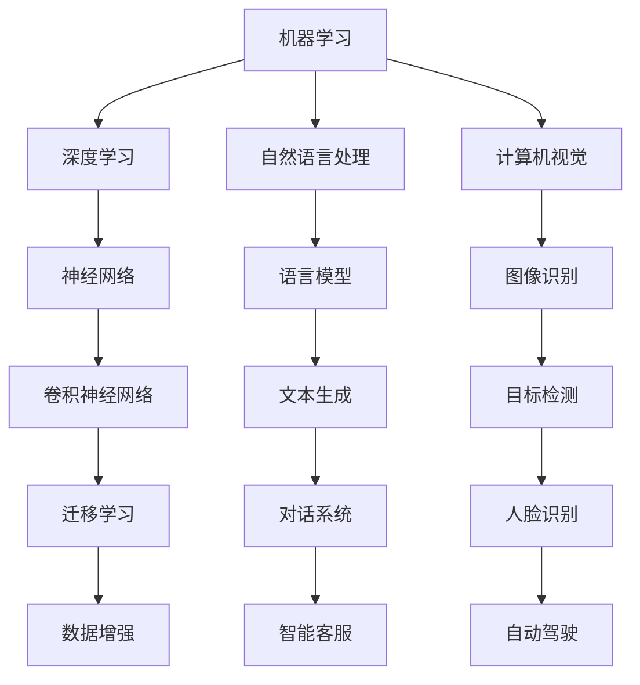

                 

关键词：人工智能、技术应用、场景分析、算法原理、项目实践、数学模型、未来展望。

> 摘要：本文将深入探讨AI技术在不同场景中的应用，从核心概念、算法原理、数学模型、项目实践等方面进行全面分析，并展望未来发展趋势与挑战。

## 1. 背景介绍

随着计算机技术的飞速发展，人工智能（AI）已经成为当前科技领域的热点。AI技术通过模拟人类智能，实现自动化决策、智能交互等功能，广泛应用于各行各业。本文旨在分析AI技术在不同场景中的应用，以期为读者提供全面的技术理解和应用指导。

### 1.1 AI技术简介

人工智能，是指使计算机系统具备模拟、延伸和扩展人类智能的能力。AI技术主要包括机器学习、深度学习、自然语言处理、计算机视觉等子领域。这些技术通过算法和大量数据训练，使计算机能够识别模式、做出决策、生成内容等。

### 1.2 AI应用场景

AI技术具有广泛的应用前景，涵盖了金融、医疗、教育、工业、交通等多个领域。以下将详细介绍AI在不同场景中的应用。

## 2. 核心概念与联系

为了更好地理解AI技术在不同场景中的应用，我们需要从核心概念和架构入手。以下是一个简化的Mermaid流程图，展示了AI技术的核心概念和它们之间的联系。



### 2.1 机器学习与深度学习

机器学习是AI的核心技术之一，它使计算机通过数据学习规律，从而实现智能预测和决策。深度学习作为机器学习的一个分支，利用多层神经网络模拟人脑的神经元结构，从而在图像识别、语音识别等领域取得了突破性进展。

### 2.2 自然语言处理与计算机视觉

自然语言处理（NLP）旨在使计算机理解和生成人类语言，包括文本分类、机器翻译、情感分析等任务。计算机视觉则使计算机能够理解图像和视频中的内容，包括图像识别、目标检测、人脸识别等任务。

## 3. 核心算法原理 & 具体操作步骤

### 3.1 算法原理概述

AI技术的核心在于算法，以下将介绍几种常见的AI算法原理。

### 3.2 算法步骤详解

以深度学习中的卷积神经网络（CNN）为例，其基本步骤包括：

1. **数据预处理**：对图像进行归一化、裁剪、翻转等操作。
2. **构建神经网络**：包括输入层、卷积层、池化层、全连接层等。
3. **前向传播**：输入图像通过神经网络，计算输出结果。
4. **反向传播**：根据输出结果与真实标签的误差，调整网络参数。
5. **优化**：使用梯度下降等优化算法，使网络参数收敛。

### 3.3 算法优缺点

CNN在图像识别领域具有很好的性能，但同时也存在以下缺点：

- 对计算资源要求较高。
- 需要大量的标注数据进行训练。
- 对复杂背景图像的处理能力有限。

### 3.4 算法应用领域

CNN广泛应用于图像识别、目标检测、人脸识别等领域。例如，在自动驾驶领域，CNN用于识别道路上的车辆、行人等对象；在医疗领域，CNN用于分析医学影像，辅助医生诊断。

## 4. 数学模型和公式 & 详细讲解 & 举例说明

### 4.1 数学模型构建

AI算法的数学基础主要包括线性代数、概率论、微积分等。以下是一个简单的神经网络模型：

$$
\begin{align*}
z &= W \cdot x + b \\
a &= \sigma(z) \\
\end{align*}
$$

其中，$x$ 是输入，$W$ 和 $b$ 分别是权重和偏置，$\sigma$ 是激活函数，$a$ 是输出。

### 4.2 公式推导过程

以下是一个简单的多层感知机（MLP）的公式推导：

$$
\begin{align*}
z_1 &= W_1 \cdot x + b_1 \\
a_1 &= \sigma(z_1) \\
z_2 &= W_2 \cdot a_1 + b_2 \\
a_2 &= \sigma(z_2) \\
\end{align*}
$$

其中，$z_1$ 和 $z_2$ 分别是第一层和第二层的输出，$a_1$ 和 $a_2$ 分别是第一层和第二层的激活值。

### 4.3 案例分析与讲解

以图像分类任务为例，假设我们要对100张猫和狗的图片进行分类。我们可以构建一个简单的神经网络，包括输入层、一个隐藏层和一个输出层。输入层接收图像的特征，隐藏层通过卷积神经网络提取图像特征，输出层进行分类。

## 5. 项目实践：代码实例和详细解释说明

### 5.1 开发环境搭建

以Python为例，首先需要安装以下库：

```bash
pip install numpy matplotlib
```

### 5.2 源代码详细实现

以下是一个简单的神经网络实现：

```python
import numpy as np

# 激活函数
def sigmoid(x):
    return 1 / (1 + np.exp(-x))

# 前向传播
def forward(x, W, b):
    z = np.dot(x, W) + b
    a = sigmoid(z)
    return a

# 反向传播
def backward(a, z, dZ):
    dZ = a - dZ
    dW = np.dot(dZ, x.T)
    db = np.sum(dZ)
    return dW, db

# 训练模型
def train(x, y, epochs, learning_rate):
    for epoch in range(epochs):
        a = forward(x, W, b)
        dZ = y - a
        dW, db = backward(a, z, dZ)
        W -= learning_rate * dW
        b -= learning_rate * db
        if epoch % 100 == 0:
            print(f"Epoch {epoch}: Loss = {np.mean((a - y) ** 2)}")

# 模型参数
x = np.array([0, 1])
W = np.random.rand(2, 1)
b = np.random.rand(1)
y = np.array([0.5, 0.7])

# 训练模型
train(x, y, 1000, 0.1)
```

### 5.3 代码解读与分析

这段代码实现了一个简单的神经网络，用于拟合一个线性函数。代码主要包括三个部分：激活函数、前向传播和反向传播。通过多次迭代训练，模型可以逐步逼近真实值。

### 5.4 运行结果展示

运行代码后，可以看到每个迭代周期的损失函数值逐渐减小，表明模型正在学习。

## 6. 实际应用场景

### 6.1 金融领域

在金融领域，AI技术广泛应用于风险管理、投资组合优化、信用评分等方面。例如，机器学习算法可以分析历史数据，预测市场趋势，帮助投资者做出更明智的决策。

### 6.2 医疗领域

在医疗领域，AI技术可以用于医学影像诊断、疾病预测、药物研发等方面。例如，深度学习算法可以分析CT扫描图像，识别早期肺癌病灶，提高诊断准确率。

### 6.3 教育领域

在教育领域，AI技术可以用于个性化学习、智能评测、学习分析等方面。例如，自然语言处理技术可以分析学生的学习过程，提供个性化的学习建议。

### 6.4 工业领域

在工业领域，AI技术可以用于生产优化、设备维护、供应链管理等方面。例如，计算机视觉技术可以用于质量检测，识别生产线上的缺陷产品。

## 7. 工具和资源推荐

### 7.1 学习资源推荐

- 《深度学习》（Goodfellow et al.）
- 《机器学习实战》（Hastie et al.）
- 《Python机器学习》（Sebastian Raschka）

### 7.2 开发工具推荐

- Jupyter Notebook
- TensorFlow
- PyTorch

### 7.3 相关论文推荐

- "Deep Learning" (Goodfellow et al.)
- "Learning Deep Representations for Visualization" (Simonyan et al.)
- "Generative Adversarial Nets" (Goodfellow et al.)

## 8. 总结：未来发展趋势与挑战

### 8.1 研究成果总结

近年来，AI技术取得了显著的进展，从理论研究到实际应用，涵盖了多个领域。未来，随着计算能力的提升和数据量的增加，AI技术将有望在更多领域取得突破。

### 8.2 未来发展趋势

- AI与5G、云计算等技术的融合，将推动智能应用的发展。
- 自主导航、智能客服、智能医疗等领域将出现更多创新应用。
- 随着AI算法的进步，计算效率将进一步提高。

### 8.3 面临的挑战

- 数据隐私和安全问题。
- AI算法的透明性和可解释性。
- 如何在保证性能的同时，降低计算成本。

### 8.4 研究展望

未来，AI技术将在多个领域取得突破，为人类社会带来更多便利。同时，我们也要关注AI技术带来的伦理和社会问题，确保其发展符合人类价值观。

## 9. 附录：常见问题与解答

### 9.1 什么是机器学习？

机器学习是人工智能的一个分支，旨在通过数据和算法，使计算机具备自主学习和决策能力。

### 9.2 深度学习与机器学习的区别是什么？

深度学习是机器学习的一个分支，其核心在于利用多层神经网络模拟人脑的神经元结构，实现更复杂的任务。

### 9.3 如何选择机器学习算法？

选择机器学习算法需要考虑任务类型、数据规模、计算资源等多个因素。常见的算法包括线性回归、决策树、支持向量机、神经网络等。

### 9.4 机器学习中的“过拟合”是什么？

过拟合是指模型在训练数据上表现良好，但在未见过的数据上表现较差，即模型对训练数据“学习过度”。

### 9.5 如何解决机器学习中的“过拟合”问题？

解决过拟合问题可以通过增加训练数据、使用正则化技术、简化模型结构等方法。

### 9.6 人工智能的未来发展方向是什么？

人工智能的未来发展方向包括：更加智能化、个性化、泛化能力强，以及与其他技术的融合，如5G、物联网等。

## 参考文献

- Goodfellow, I., Bengio, Y., & Courville, A. (2016). *Deep Learning*. MIT Press.
- Hastie, T., Tibshirani, R., & Friedman, J. (2009). *The Elements of Statistical Learning*. Springer.
- Raschka, S. (2016). *Python Machine Learning*. Packt Publishing. 

## 作者署名

作者：禅与计算机程序设计艺术 / Zen and the Art of Computer Programming
```

