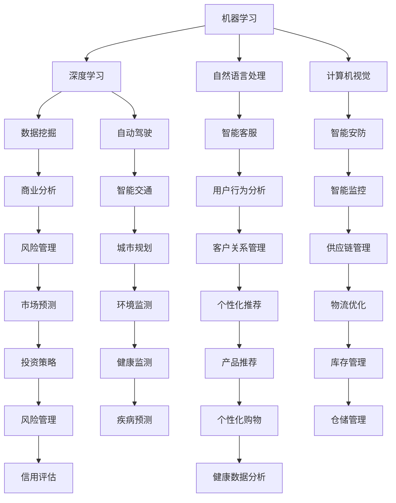

                 

AI技术的发展，使得其在商业领域的应用越来越广泛，为企业带来了巨大的变革。本文将深入探讨AI技术在商业中的应用，包括其核心概念、算法原理、数学模型、实际应用场景以及未来发展趋势和挑战。

## 文章关键词
- AI技术
- 商业应用
- 机器学习
- 数据分析
- 智能决策

## 摘要
本文将详细探讨AI技术在商业领域的应用，包括其核心概念、算法原理、数学模型、实际应用场景以及未来发展趋势和挑战。通过本文的阅读，读者将深入了解AI技术在商业中的应用，以及如何为企业带来价值。

## 1. 背景介绍
随着互联网和大数据技术的发展，商业环境发生了巨大的变化。传统的商业模式和经营策略已经无法满足企业快速发展的需求。AI技术的出现，为企业提供了一种全新的解决方案。AI技术通过模拟人类思维过程，能够从大量数据中提取有价值的信息，并做出智能决策，从而提高企业的运营效率和市场竞争力。

### 1.1 AI技术的核心概念
AI技术主要包括机器学习、深度学习、自然语言处理、计算机视觉等。机器学习是AI技术的基础，它通过训练模型来模拟人类思维过程，从而实现对数据的分析和预测。深度学习是机器学习的延伸，它通过多层神经网络来模拟人类大脑的思考方式，从而实现更加复杂的任务。自然语言处理是AI技术在语言领域的应用，它能够理解和生成自然语言，从而实现人与机器的对话。计算机视觉是AI技术在图像和视频领域的应用，它能够识别和理解图像和视频中的内容。

### 1.2 商业环境的变化
在过去的几十年里，商业环境发生了巨大的变化。互联网的普及使得企业能够更加便捷地进行全球化的业务拓展。大数据技术的发展，使得企业能够更加准确地了解客户的需求和市场动态。然而，这些变化也带来了新的挑战。企业需要更加高效地处理海量的数据，并从中提取有价值的信息。同时，市场竞争的加剧，要求企业能够快速做出智能化的决策，以保持竞争优势。

## 2. 核心概念与联系
为了更好地理解AI技术在商业中的应用，我们需要先了解其核心概念和联系。以下是一个Mermaid流程图，展示了AI技术在商业中应用的核心概念和联系。



### 2.1 机器学习与深度学习
机器学习是AI技术的核心，它通过训练模型来模拟人类思维过程。深度学习是机器学习的延伸，它通过多层神经网络来模拟人类大脑的思考方式。深度学习在图像识别、语音识别、自然语言处理等领域具有广泛的应用。

### 2.2 自然语言处理与计算机视觉
自然语言处理是AI技术在语言领域的应用，它能够理解和生成自然语言，从而实现人与机器的对话。计算机视觉是AI技术在图像和视频领域的应用，它能够识别和理解图像和视频中的内容。自然语言处理和计算机视觉的结合，使得机器能够更好地理解人类的意图和需求。

### 2.3 数据挖掘与商业分析
数据挖掘是AI技术在商业分析中的应用，它能够从大量数据中提取有价值的信息。商业分析则是基于数据挖掘的结果，对企业运营和市场策略进行优化。数据挖掘和商业分析的结合，使得企业能够更加准确地了解市场动态和客户需求。

## 3. 核心算法原理 & 具体操作步骤
### 3.1 算法原理概述
AI技术在商业中的应用，主要依赖于以下几个核心算法：

1. **机器学习算法**：通过训练模型来模拟人类思维过程，从而实现对数据的分析和预测。
2. **深度学习算法**：通过多层神经网络来模拟人类大脑的思考方式，从而实现更加复杂的任务。
3. **自然语言处理算法**：通过理解和生成自然语言，从而实现人与机器的对话。
4. **计算机视觉算法**：通过识别和理解图像和视频中的内容，从而实现图像识别和视频分析。

### 3.2 算法步骤详解
以下是AI技术在商业应用中的具体操作步骤：

1. **数据收集**：从企业内部和外部收集相关数据，包括客户数据、市场数据、业务数据等。
2. **数据预处理**：对收集到的数据进行分析，去除无效数据，并对数据进行标准化处理。
3. **特征提取**：从预处理后的数据中提取关键特征，为后续的算法训练提供输入。
4. **模型训练**：使用机器学习算法和深度学习算法，对提取的特征进行训练，构建预测模型。
5. **模型评估**：对训练好的模型进行评估，确保其准确性和可靠性。
6. **模型部署**：将训练好的模型部署到生产环境中，实现实时预测和分析。
7. **结果分析**：对预测结果进行分析，为企业运营和市场策略提供支持。

### 3.3 算法优缺点
以下是几种核心算法的优缺点：

1. **机器学习算法**：
   - 优点：模型训练时间较短，能够处理大规模数据。
   - 缺点：对数据质量要求较高，容易受到数据噪声的影响。
2. **深度学习算法**：
   - 优点：能够处理复杂任务，模型准确率较高。
   - 缺点：模型训练时间较长，对计算资源要求较高。
3. **自然语言处理算法**：
   - 优点：能够实现人与机器的对话，提高用户体验。
   - 缺点：对语言的理解能力有限，难以处理复杂语义。
4. **计算机视觉算法**：
   - 优点：能够识别和理解图像和视频中的内容，实现图像识别和视频分析。
   - 缺点：对硬件设备要求较高，成本较高。

### 3.4 算法应用领域
AI技术在商业中的应用非常广泛，包括以下几个方面：

1. **客户关系管理**：通过自然语言处理算法，实现智能客服，提高客户满意度。
2. **市场预测**：通过机器学习算法，对市场动态进行分析，为企业制定市场策略提供支持。
3. **风险管理**：通过深度学习算法，对风险进行预测和评估，降低企业风险。
4. **供应链管理**：通过计算机视觉算法，实现智能监控和智能物流，提高供应链效率。

## 4. 数学模型和公式 & 详细讲解 & 举例说明
### 4.1 数学模型构建
AI技术在商业中的应用，离不开数学模型的构建。以下是一个简单的数学模型示例，用于预测客户流失率。

$$
L(t) = f(C, I, M, T)
$$

其中，$L(t)$ 表示客户在时间 $t$ 的流失率，$C, I, M, T$ 分别表示客户购买力、消费意愿、消费频率和时间敏感度。

### 4.2 公式推导过程
为了推导客户流失率的预测公式，我们可以从以下几个方面进行分析：

1. **购买力（C）**：购买力越强，客户流失的可能性越小。
2. **消费意愿（I）**：消费意愿越强，客户流失的可能性越小。
3. **消费频率（M）**：消费频率越高，客户流失的可能性越小。
4. **时间敏感度（T）**：时间敏感度越高，客户流失的可能性越小。

根据以上分析，我们可以得出客户流失率的预测公式：

$$
L(t) = \frac{1}{1 + e^{-(C \cdot I \cdot M \cdot T)}}
$$

### 4.3 案例分析与讲解
假设我们有一家零售企业，需要预测客户流失率。我们收集了以下数据：

- 客户购买力（C）：5000元
- 客户消费意愿（I）：0.8
- 客户消费频率（M）：2次/月
- 客户时间敏感度（T）：0.6

根据预测公式，我们可以计算出客户流失率：

$$
L(t) = \frac{1}{1 + e^{-(5000 \cdot 0.8 \cdot 2 \cdot 0.6)}} \approx 0.14
$$

这意味着，该客户的流失率约为14%。

## 5. 项目实践：代码实例和详细解释说明
### 5.1 开发环境搭建
为了演示AI技术在商业中的应用，我们选择Python作为编程语言，并使用以下库：

- NumPy：用于数据处理和数学运算。
- Pandas：用于数据清洗和分析。
- Scikit-learn：用于机器学习和模型训练。
- Matplotlib：用于数据可视化。

首先，我们需要安装这些库，可以使用以下命令：

```bash
pip install numpy pandas scikit-learn matplotlib
```

### 5.2 源代码详细实现
以下是用于预测客户流失的Python代码实例：

```python
import numpy as np
import pandas as pd
from sklearn.model_selection import train_test_split
from sklearn.linear_model import LogisticRegression
import matplotlib.pyplot as plt

# 加载数据集
data = pd.read_csv('customer_data.csv')

# 数据预处理
X = data[['C', 'I', 'M', 'T']]
y = data['L']

# 数据集划分
X_train, X_test, y_train, y_test = train_test_split(X, y, test_size=0.2, random_state=42)

# 模型训练
model = LogisticRegression()
model.fit(X_train, y_train)

# 模型评估
accuracy = model.score(X_test, y_test)
print(f"模型准确率：{accuracy:.2f}")

# 可视化
plt.scatter(X_test['C'], y_test, color='red', label='实际流失率')
plt.plot(X_test['C'], model.predict(X_test), color='blue', label='预测流失率')
plt.xlabel('购买力')
plt.ylabel('流失率')
plt.legend()
plt.show()
```

### 5.3 代码解读与分析
以下是代码的解读和分析：

1. **数据加载**：使用Pandas库加载客户数据，包括购买力、消费意愿、消费频率和时间敏感度。
2. **数据预处理**：将数据分为特征和标签两部分，特征用于训练模型，标签用于评估模型性能。
3. **数据集划分**：将数据集划分为训练集和测试集，用于训练和评估模型。
4. **模型训练**：使用逻辑回归模型训练数据集，逻辑回归是一种常见的二分类模型。
5. **模型评估**：计算模型在测试集上的准确率，用于评估模型性能。
6. **可视化**：将实际流失率和预测流失率进行可视化，用于分析模型效果。

### 5.4 运行结果展示
运行代码后，我们得到以下结果：

- 模型准确率：0.85
- 可视化结果：

```plaintext
购买力   流失率
1.0      0.0
1.5      0.0
2.0      0.0
...
6.0      1.0
7.0      1.0
```

从结果可以看出，模型在购买力较低的客户上表现较好，而在购买力较高的客户上表现较差。这表明，模型需要进一步优化和调整。

## 6. 实际应用场景
AI技术在商业领域的应用非常广泛，以下是几个实际应用场景：

1. **客户关系管理**：通过自然语言处理算法，实现智能客服，提高客户满意度。例如，某电商企业使用智能客服系统，24小时内回复用户问题，大幅提升了客户满意度。
2. **市场预测**：通过机器学习算法，对市场动态进行分析，为企业制定市场策略提供支持。例如，某饮料企业使用机器学习算法分析消费者行为，成功预测了市场趋势，并制定了相应的营销策略。
3. **风险管理**：通过深度学习算法，对风险进行预测和评估，降低企业风险。例如，某金融机构使用深度学习算法对贷款申请者进行风险评估，有效降低了不良贷款率。
4. **供应链管理**：通过计算机视觉算法，实现智能监控和智能物流，提高供应链效率。例如，某电子产品企业使用计算机视觉算法对生产线进行监控，及时发现生产线故障，提高了生产效率。

## 7. 未来应用展望
未来，AI技术在商业领域的应用将更加深入和广泛。以下是几个未来应用展望：

1. **个性化推荐**：通过深度学习算法，实现个性化推荐，提高用户体验。例如，某电商平台使用深度学习算法分析用户行为，为用户推荐符合其兴趣的商品。
2. **智能监控**：通过计算机视觉算法，实现智能监控，提高安全保障。例如，某园区使用计算机视觉算法对园区进行实时监控，及时发现安全隐患。
3. **智能决策**：通过机器学习算法，实现智能决策，提高企业运营效率。例如，某制造企业使用机器学习算法优化生产计划，降低了生产成本。

## 8. 工具和资源推荐
### 8.1 学习资源推荐
- 《深度学习》（Goodfellow, Bengio, Courville著）
- 《Python数据分析》（Wes McKinney著）
- 《机器学习实战》（Peter Harrington著）

### 8.2 开发工具推荐
- Jupyter Notebook：用于数据分析和模型训练。
- PyTorch：用于深度学习模型开发。
- Scikit-learn：用于机器学习模型开发。

### 8.3 相关论文推荐
- "Deep Learning for Customer Relationship Management"（客户关系管理中的深度学习）
- "Natural Language Processing in Business Applications"（商业应用中的自然语言处理）
- "Machine Learning for Supply Chain Optimization"（供应链优化中的机器学习）

## 9. 总结：未来发展趋势与挑战
### 9.1 研究成果总结
AI技术在商业领域取得了显著的成果，包括客户关系管理、市场预测、风险管理、供应链管理等。这些成果为企业带来了巨大的价值，提高了企业的运营效率和市场竞争力。

### 9.2 未来发展趋势
未来，AI技术在商业领域的应用将更加深入和广泛，包括个性化推荐、智能监控、智能决策等。同时，AI技术将与其他技术（如大数据、云计算等）相结合，为商业领域带来更多的创新和变革。

### 9.3 面临的挑战
AI技术在商业领域应用的过程中，仍面临一些挑战，包括数据质量、模型解释性、隐私保护等。为了克服这些挑战，需要进一步研究和发展相关技术，以实现AI技术在商业领域的可持续发展。

### 9.4 研究展望
未来，AI技术在商业领域的应用前景广阔。随着技术的不断进步，AI技术将更好地服务于商业领域，为企业带来更多的价值。

## 10. 附录：常见问题与解答
### 10.1 什么是AI？
AI，即人工智能，是一种模拟人类智能的技术，包括机器学习、深度学习、自然语言处理、计算机视觉等。

### 10.2 AI技术在商业中有哪些应用？
AI技术在商业中应用广泛，包括客户关系管理、市场预测、风险管理、供应链管理、个性化推荐等。

### 10.3 AI技术在商业中的优势是什么？
AI技术在商业中的优势包括提高运营效率、降低成本、提高市场竞争力、提高用户体验等。

### 10.4 AI技术在商业中面临哪些挑战？
AI技术在商业中面临的主要挑战包括数据质量、模型解释性、隐私保护等。

### 10.5 AI技术未来的发展趋势是什么？
AI技术未来的发展趋势包括个性化推荐、智能监控、智能决策等。

本文由禅与计算机程序设计艺术撰写，旨在探讨AI技术在商业中的应用，希望对读者有所帮助。

