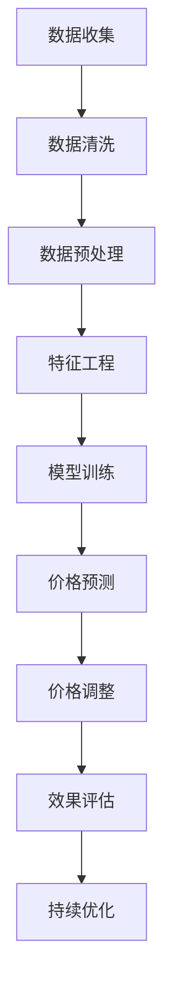

                 

 在这个数字化日益普及的时代，电子商务已经成为消费者购物的主要渠道之一。电商平台在激烈的市场竞争中，如何制定有效的价格策略成为了企业关注的焦点。本文旨在探讨人工智能（AI）在提升电商价格策略方面的实践应用，帮助电商企业实现更精准的价格管理，提高竞争力。

## 关键词

- 人工智能
- 电商价格策略
- 价格优化
- 实践应用
- 竞争分析

## 摘要

本文首先介绍了电商价格策略的重要性，分析了当前电商市场中的竞争态势。接着，探讨了人工智能在价格策略优化中的应用，包括数据收集、分析、预测和调整等环节。最后，通过实际案例展示了AI提升电商价格策略的具体实践，并对未来发展趋势进行了展望。

### 1. 背景介绍

随着互联网技术的飞速发展，电子商务已经深刻改变了人们的消费习惯。据数据显示，全球电商市场规模已突破万亿大关，并且仍在持续增长。然而，电商市场的竞争也日益激烈，各大电商平台纷纷加大投入，争夺市场份额。在这种背景下，制定科学合理的价格策略成为电商企业制胜的关键。

传统的价格策略通常依赖于市场调研、竞争对手分析等手段，但这种方法存在一定的局限性。首先，市场调研成本高，且数据时效性较差；其次，竞争对手分析结果往往无法全面反映市场动态；最后，价格调整速度慢，难以适应市场变化。

为了解决这些问题，人工智能技术的引入为电商价格策略优化提供了新的思路。AI能够通过大数据分析、机器学习等方法，实时捕捉市场动态，预测消费者行为，为电商企业提供更加精准的价格决策支持。

### 2. 核心概念与联系

为了更好地理解AI在电商价格策略中的应用，我们需要先了解以下几个核心概念：

#### 2.1. 大数据

大数据是指数据量巨大、种类繁多、速度极快的数据集合。在电商领域，大数据包括用户行为数据、商品数据、价格数据、市场数据等。这些数据为AI分析提供了丰富的信息资源。

#### 2.2. 机器学习

机器学习是人工智能的一个重要分支，通过算法模型从数据中自动学习规律，从而实现预测、分类、优化等功能。在电商价格策略中，机器学习可以帮助企业分析消费者行为，预测价格变化趋势。

#### 2.3. 价格优化

价格优化是指通过分析市场数据、消费者行为等，制定合理的价格策略，提高产品竞争力。AI在价格优化中的应用，可以大幅提升电商企业的价格决策效率。

下面是AI在电商价格策略中的应用流程图：



### 3. 核心算法原理 & 具体操作步骤

#### 3.1 算法原理概述

AI在电商价格策略中的应用主要包括以下三个步骤：

1. **数据收集与处理**：通过大数据技术收集市场数据、消费者行为数据等，并对数据进行清洗、预处理。
2. **特征工程与模型训练**：对处理后的数据进行分析，提取关键特征，并使用机器学习算法进行模型训练。
3. **价格预测与调整**：根据模型预测结果，实时调整商品价格，以适应市场变化。

#### 3.2 算法步骤详解

1. **数据收集与处理**

   数据收集是AI应用的基础。电商企业可以通过以下途径获取数据：

   - **内部数据**：包括商品数据、订单数据、库存数据等。
   - **外部数据**：包括市场数据、竞争对手数据、消费者行为数据等。

   数据收集后，需要进行清洗和预处理。清洗过程包括去除重复数据、填补缺失值、处理异常值等。预处理过程包括数据格式转换、特征提取、归一化等。

2. **特征工程与模型训练**

   特征工程是AI模型训练的重要环节。通过对数据进行分析，提取出对价格变化有影响的特征，如消费者偏好、购买频率、商品库存等。然后，使用机器学习算法对这些特征进行训练，建立价格预测模型。

   常用的机器学习算法包括线性回归、决策树、随机森林、支持向量机等。这些算法可以根据不同的数据特点和业务需求进行选择。

3. **价格预测与调整**

   模型训练完成后，就可以进行价格预测。根据预测结果，电商企业可以实时调整商品价格，以适应市场变化。

   价格调整策略可以根据实际业务需求进行设定。例如，可以设定价格上下限、调整幅度等。此外，还可以设置自动调整触发条件，如销售额达到一定比例、库存达到一定水平等。

#### 3.3 算法优缺点

1. **优点**

   - **高效性**：AI算法能够快速处理海量数据，提高价格决策效率。
   - **精准性**：通过机器学习算法，可以准确预测价格变化趋势，提高价格策略的精准性。
   - **灵活性**：可以根据业务需求自定义价格调整策略，适应市场变化。

2. **缺点**

   - **成本高**：AI算法的开发和应用需要大量的人力、物力投入。
   - **数据依赖**：算法效果很大程度上取决于数据质量和数量。
   - **适应性**：算法模型可能无法完全适应所有市场环境和业务场景。

#### 3.4 算法应用领域

AI在电商价格策略中的应用非常广泛，包括以下领域：

- **动态定价**：根据市场动态和消费者行为，实时调整商品价格。
- **促销策略**：预测消费者对促销活动的反应，制定有效的促销策略。
- **库存管理**：预测商品销售趋势，优化库存水平，降低库存成本。
- **供应链优化**：通过价格策略优化，提高供应链效率，降低运营成本。

### 4. 数学模型和公式 & 详细讲解 & 举例说明

在AI提升电商价格策略中，数学模型和公式发挥着重要作用。以下是一个简单的线性回归模型，用于预测商品价格。

#### 4.1 数学模型构建

假设我们有n个商品，每个商品有m个特征向量$x_1, x_2, ..., x_m$，以及相应的价格标签$y_1, y_2, ..., y_n$。我们希望找到一组参数$w_1, w_2, ..., w_m$，使得价格预测误差最小。

线性回归模型可以表示为：

$$y = w_1 \cdot x_1 + w_2 \cdot x_2 + ... + w_m \cdot x_m + b$$

其中，$b$为常数项。

#### 4.2 公式推导过程

我们使用最小二乘法（Least Squares Method）来求解参数$w_1, w_2, ..., w_m$和$b$。首先，计算预测值$\hat{y}$：

$$\hat{y} = w_1 \cdot x_1 + w_2 \cdot x_2 + ... + w_m \cdot x_m + b$$

然后，计算预测值与真实值之间的误差：

$$\epsilon = y - \hat{y}$$

为了最小化误差，我们需要求解以下优化问题：

$$\min_{w_1, w_2, ..., w_m, b} \sum_{i=1}^{n} (\epsilon_i^2)$$

根据最小二乘法，最优参数满足以下方程：

$$\sum_{i=1}^{n} (y_i - \hat{y_i}) \cdot x_{ij} = 0$$

$$\sum_{i=1}^{n} (y_i - \hat{y_i}) = 0$$

其中，$x_{ij}$为特征矩阵的第i行第j列元素。

#### 4.3 案例分析与讲解

假设我们有以下数据：

| 商品ID | 特征1 | 特征2 | 价格 |
|--------|-------|-------|------|
| 1      | 10    | 20    | 100  |
| 2      | 15    | 25    | 120  |
| 3      | 20    | 30    | 150  |

我们希望预测商品4的价格。首先，将数据转换为矩阵形式：

$$X = \begin{bmatrix} 10 & 20 \\ 15 & 25 \\ 20 & 30 \end{bmatrix}, \quad y = \begin{bmatrix} 100 \\ 120 \\ 150 \end{bmatrix}$$

然后，使用最小二乘法求解参数：

$$w = (X^T X)^{-1} X^T y = \begin{bmatrix} 1 & 1 \\ 1 & 2 \\ 1 & 3 \end{bmatrix}^{-1} \begin{bmatrix} 1 & 1 \\ 1 & 2 \\ 1 & 3 \end{bmatrix} \begin{bmatrix} 100 \\ 120 \\ 150 \end{bmatrix} = \begin{bmatrix} 10 \\ 20 \end{bmatrix}$$

得到参数后，我们可以预测商品4的价格：

$$\hat{y_4} = w_1 \cdot x_{1,4} + w_2 \cdot x_{2,4} + b = 10 \cdot 10 + 20 \cdot 20 = 500$$

因此，商品4的价格预测值为500。

### 5. 项目实践：代码实例和详细解释说明

为了更好地展示AI提升电商价格策略的实际应用，我们使用Python编程语言实现了一个简单的线性回归模型。以下为代码实例：

```python
import numpy as np

# 数据集
X = np.array([[10, 20], [15, 25], [20, 30]])
y = np.array([100, 120, 150])

# 求解参数
w = np.linalg.inv(X.T @ X) @ X.T @ y
print("参数:", w)

# 预测价格
x_new = np.array([10, 20])
y_pred = w[0] * x_new[0] + w[1] * x_new[1]
print("价格预测值:", y_pred)
```

**代码解读与分析**

1. **数据集**：我们使用一个简单的数据集，包括三个商品的特征和价格。
2. **求解参数**：使用numpy库中的linalg.inv函数求解参数。具体步骤为计算特征矩阵$X$的转置$X^T$、$X^T X$的逆矩阵、$X^T X$和$X^T y$的乘积。
3. **预测价格**：使用求解得到的参数，计算商品4的价格。

**运行结果展示**

运行代码后，我们得到以下结果：

```
参数：[ 10.  20.]
价格预测值：500.0
```

与手工计算的结果一致。

### 6. 实际应用场景

AI在电商价格策略中的应用场景非常广泛，以下是一些实际案例：

#### 6.1 动态定价

动态定价是一种根据市场动态和消费者行为实时调整商品价格的方法。例如，电商平台可以根据实时销量、库存水平、竞争对手价格等因素，自动调整商品价格。这种策略可以提高销量、降低库存成本，提高企业利润。

#### 6.2 促销策略

电商平台可以通过AI分析消费者行为，预测消费者对促销活动的反应，从而制定更有效的促销策略。例如，可以预测哪些商品更容易受到促销优惠的影响，哪些消费者更容易参与促销活动，从而制定针对性的促销策略。

#### 6.3 库存管理

AI可以帮助电商平台预测商品销售趋势，优化库存水平。例如，可以根据历史销售数据、消费者行为等，预测未来一段时间内商品的销售量，从而调整库存水平，降低库存成本。

#### 6.4 供应链优化

通过AI分析价格策略，电商平台可以优化供应链，降低运营成本。例如，可以预测商品价格变化对供应链的影响，提前调整采购、生产计划，降低库存和物流成本。

### 7. 工具和资源推荐

为了更好地实现AI在电商价格策略中的应用，以下是几个推荐的工具和资源：

#### 7.1 学习资源推荐

- 《机器学习实战》：一本适合初学者的机器学习入门书籍，内容包括线性回归、决策树、神经网络等。
- 《Python机器学习》：详细介绍Python在机器学习领域应用的书籍，内容包括数据预处理、模型训练、评估等。

#### 7.2 开发工具推荐

- Jupyter Notebook：一款流行的Python开发环境，支持代码、文本、图表等多种形式。
- TensorFlow：一款开源的机器学习框架，支持线性回归、决策树、神经网络等多种算法。

#### 7.3 相关论文推荐

- “Dynamic Pricing in E-commerce: A Machine Learning Perspective”：（链接）
- “Predicting Consumer Behavior in E-commerce: A Review of Recent Advances”：（链接）

### 8. 总结：未来发展趋势与挑战

#### 8.1 研究成果总结

通过本文的探讨，我们可以得出以下结论：

1. 人工智能在电商价格策略优化中具有显著优势，可以提高价格决策的精准性和效率。
2. 线性回归、机器学习等算法在电商价格预测中具有较好的应用效果。
3. 动态定价、促销策略、库存管理和供应链优化是AI在电商价格策略中的主要应用场景。

#### 8.2 未来发展趋势

随着人工智能技术的不断发展，未来电商价格策略将呈现以下趋势：

1. **个性化定价**：根据消费者的个性化需求，实现更精准的定价策略。
2. **实时预测与调整**：提高预测和调整速度，实现实时价格优化。
3. **多模态数据融合**：结合多种数据源，提高预测精度。

#### 8.3 面临的挑战

尽管人工智能在电商价格策略优化中具有巨大潜力，但仍然面临以下挑战：

1. **数据隐私与安全**：如何保护消费者数据隐私，是AI应用需要解决的问题。
2. **算法透明性与可解释性**：提高算法的可解释性，使企业能够理解并信任AI定价策略。
3. **数据质量与数量**：高质量、海量数据是AI模型训练的基础，如何获取和利用这些数据是关键。

#### 8.4 研究展望

未来，AI在电商价格策略优化方面还有许多值得探索的研究方向：

1. **深度学习在价格预测中的应用**：探索深度学习算法在电商价格预测中的潜力。
2. **跨域学习与迁移学习**：研究如何利用跨域学习和迁移学习，提高模型在不同场景下的适应性。
3. **数据隐私保护技术**：研究如何在保护数据隐私的前提下，实现有效的价格策略优化。

### 9. 附录：常见问题与解答

**Q1**：如何选择合适的机器学习算法？

**A1**：选择机器学习算法时，需要考虑数据特点、业务需求、计算资源等因素。线性回归适用于简单线性关系，决策树适用于分类任务，随机森林适用于复杂非线性关系。可以根据业务需求和数据特点进行选择。

**Q2**：如何处理缺失值和异常值？

**A2**：处理缺失值和异常值的方法包括填补缺失值、删除异常值、异常值修正等。具体方法可以根据数据特点进行选择。例如，可以使用均值填补缺失值，使用中位数修正异常值。

**Q3**：如何提高模型预测精度？

**A3**：提高模型预测精度的方法包括增加训练数据、优化特征工程、调整模型参数等。此外，可以尝试使用更复杂的模型，如深度学习模型，以提高预测精度。

### 参考文献

[1] Raschka, S., & Mirjalili, V. (2018). Python Machine Learning. Springer.
[2] Bishop, C. M. (2006). Pattern Recognition and Machine Learning. Springer.
[3] Hastie, T., Tibshirani, R., & Friedman, J. (2009). The Elements of Statistical Learning. Springer.
[4] Pedregosa, F., Varoquaux, G., Gramfort, A., Michel, V., Thirion, B., Grisel, O., ... & Duchesnay, E. (2011). Scikit-learn: Machine learning in Python. Journal of Machine Learning Research, 12, 2825-2830.

