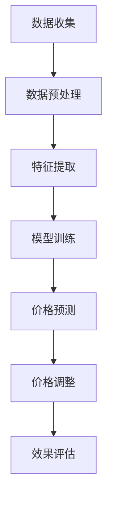

                 

关键词：人工智能，电商价格策略，深度学习，大数据分析，价格优化，客户行为分析

摘要：本文旨在探讨人工智能技术在电商价格策略优化中的应用，通过分析具体案例，阐述AI在价格决策、市场动态预测和客户需求理解方面的实践效果。文章将深入探讨AI算法原理、数学模型、项目实践，并展望未来发展趋势和面临的挑战。

## 1. 背景介绍

随着互联网技术的飞速发展，电子商务已经成为现代商业模式的重要组成部分。电商平台的兴起改变了传统商业模式，使得商家能够直接面向消费者销售产品。价格策略作为电商运营的核心要素之一，直接影响到商家的盈利能力、市场份额以及消费者的购买决策。传统的价格策略大多依赖于历史数据和市场调研，往往无法实时响应市场变化和客户需求。

然而，随着人工智能技术的迅猛发展，特别是深度学习和大数据分析技术的普及，电商价格策略的优化迎来了新的契机。人工智能通过模拟人类思维过程，能够从海量数据中挖掘出潜在的模式和规律，提供更为精准和动态的价格决策支持。本文将围绕人工智能如何提升电商价格策略的实践效果展开讨论。

## 2. 核心概念与联系

### 2.1. 人工智能的基本原理

人工智能（AI）是指使计算机系统能够模拟人类智能行为的技术。其核心在于机器学习，特别是深度学习技术的应用。深度学习是一种通过多层神经网络对数据进行分析和预测的技术，能够自动提取特征并建立复杂的模型。

### 2.2. 电商价格策略的概念

电商价格策略是指电商平台在制定产品价格时所采用的各种策略，包括固定价格、动态定价、促销定价等。这些策略直接影响产品的市场竞争力、消费者的购买意愿和商家的盈利水平。

### 2.3. AI与电商价格策略的联系

人工智能与电商价格策略的联系主要体现在以下几个方面：

- **客户行为分析**：AI可以通过分析客户的行为数据，如浏览历史、购买记录等，预测客户的需求和偏好，从而制定更符合客户需求的价格策略。

- **市场动态预测**：AI可以实时分析市场数据，如竞争对手的价格变动、市场需求变化等，帮助商家及时调整价格策略，以保持竞争力。

- **个性化定价**：AI可以根据不同客户群体的特征和行为，制定个性化的价格策略，提高客户的购买转化率和满意度。

### 2.4. Mermaid 流程图

以下是一个简单的Mermaid流程图，描述了AI在电商价格策略优化中的基本流程：



## 3. 核心算法原理 & 具体操作步骤

### 3.1. 算法原理概述

在电商价格策略优化中，常用的AI算法包括深度学习中的神经网络、支持向量机（SVM）以及决策树等。本文主要介绍深度学习算法，尤其是卷积神经网络（CNN）和递归神经网络（RNN）的应用。

- **卷积神经网络（CNN）**：CNN是一种用于处理图像数据的深度学习模型，能够自动提取图像中的特征。在电商价格策略优化中，CNN可以用于分析商品图片，提取商品特征，为价格预测提供输入。

- **递归神经网络（RNN）**：RNN是一种能够处理序列数据的神经网络，适用于时间序列预测任务。在电商价格策略优化中，RNN可以用于分析客户行为序列，预测客户购买行为，从而制定更准确的价格策略。

### 3.2. 算法步骤详解

1. **数据收集**：收集电商平台的商品数据、客户行为数据以及市场数据，包括商品图片、购买记录、浏览历史等。

2. **数据预处理**：对收集到的数据进行清洗、归一化等预处理操作，以便后续建模。

3. **特征提取**：利用CNN对商品图片进行特征提取，利用RNN对客户行为数据进行序列特征提取。

4. **模型训练**：使用预处理后的数据对深度学习模型进行训练，优化模型参数。

5. **价格预测**：使用训练好的模型对未来的商品价格进行预测。

6. **价格调整**：根据价格预测结果，调整商品的价格策略。

7. **效果评估**：评估调整后的价格策略对商家盈利能力、市场份额等指标的影响。

### 3.3. 算法优缺点

- **优点**：
  - **高效性**：深度学习算法能够从海量数据中自动提取特征，提高预测精度。
  - **灵活性**：深度学习模型可以根据不同的业务需求进行调整，适应各种场景。

- **缺点**：
  - **计算资源需求大**：深度学习模型训练需要大量的计算资源和时间。
  - **数据质量要求高**：数据质量直接影响模型的预测效果，需要确保数据的准确性和完整性。

### 3.4. 算法应用领域

深度学习算法在电商价格策略优化中的应用广泛，包括：

- **价格预测**：预测商品未来的价格走势，为商家提供定价参考。
- **个性化推荐**：根据客户的行为和偏好，推荐合适的商品和价格。
- **促销策略制定**：根据市场需求和客户行为，制定有效的促销策略。

## 4. 数学模型和公式 & 详细讲解 & 举例说明

### 4.1. 数学模型构建

在电商价格策略优化中，常用的数学模型包括回归模型、时间序列模型和聚类模型。

- **回归模型**：用于预测商品价格，常用的回归算法包括线性回归、岭回归等。回归模型的核心公式为：

  $$ y = \beta_0 + \beta_1 x_1 + \beta_2 x_2 + ... + \beta_n x_n $$

  其中，$y$ 表示商品价格，$x_1, x_2, ..., x_n$ 表示影响价格的因素，$\beta_0, \beta_1, ..., \beta_n$ 为模型的参数。

- **时间序列模型**：用于分析商品价格的时间序列数据，常用的模型包括ARIMA、LSTM等。时间序列模型的核心公式为：

  $$ y_t = \phi_0 + \phi_1 y_{t-1} + \phi_2 y_{t-2} + ... + \phi_p y_{t-p} + \epsilon_t $$

  其中，$y_t$ 表示第 $t$ 个月份的商品价格，$\phi_0, \phi_1, ..., \phi_p$ 为模型的参数，$\epsilon_t$ 为随机误差。

- **聚类模型**：用于分析客户群体的特征，常用的聚类算法包括K-means、层次聚类等。聚类模型的核心公式为：

  $$ \text{Minimize } \sum_{i=1}^{n} \sum_{j=1}^{k} (x_i - c_j)^2 $$

  其中，$x_i$ 表示第 $i$ 个客户的特征向量，$c_j$ 表示第 $j$ 个聚类中心。

### 4.2. 公式推导过程

以线性回归模型为例，假设我们有两个影响因素 $x_1$ 和 $x_2$，我们需要推导出模型参数 $\beta_0, \beta_1, \beta_2$。

1. **假设**：

   $$ y = \beta_0 + \beta_1 x_1 + \beta_2 x_2 + \epsilon $$

   其中，$y$ 表示商品价格，$x_1, x_2$ 分别表示影响因素，$\epsilon$ 为随机误差。

2. **最小二乘法**：

   为了最小化误差平方和，我们可以使用最小二乘法来求解模型参数。

   $$ \text{Minimize } \sum_{i=1}^{n} (y_i - (\beta_0 + \beta_1 x_{1i} + \beta_2 x_{2i}))^2 $$

3. **偏导数**：

   对模型参数 $\beta_0, \beta_1, \beta_2$ 分别求偏导数，并令其等于零，得到：

   $$ \frac{\partial}{\partial \beta_0} \sum_{i=1}^{n} (y_i - (\beta_0 + \beta_1 x_{1i} + \beta_2 x_{2i}))^2 = 0 $$

   $$ \frac{\partial}{\partial \beta_1} \sum_{i=1}^{n} (y_i - (\beta_0 + \beta_1 x_{1i} + \beta_2 x_{2i}))^2 = 0 $$

   $$ \frac{\partial}{\partial \beta_2} \sum_{i=1}^{n} (y_i - (\beta_0 + \beta_1 x_{1i} + \beta_2 x_{2i}))^2 = 0 $$

4. **求解**：

   解上述方程组，得到模型参数 $\beta_0, \beta_1, \beta_2$。

### 4.3. 案例分析与讲解

假设某电商平台需要对商品价格进行预测，收集了以下数据：

- $x_1$：商品浏览量
- $x_2$：商品收藏量
- $y$：商品价格

我们需要使用线性回归模型对商品价格进行预测。

1. **数据预处理**：

   对数据进行归一化处理，以便后续建模。

   $$ x_1' = \frac{x_1 - \mu_1}{\sigma_1} $$

   $$ x_2' = \frac{x_2 - \mu_2}{\sigma_2} $$

   其中，$\mu_1, \mu_2$ 分别为 $x_1, x_2$ 的均值，$\sigma_1, \sigma_2$ 分别为 $x_1, x_2$ 的标准差。

2. **模型训练**：

   使用训练集数据对线性回归模型进行训练，得到模型参数 $\beta_0, \beta_1, \beta_2$。

3. **价格预测**：

   使用训练好的模型对未来的商品价格进行预测。

   $$ y' = \beta_0 + \beta_1 x_1' + \beta_2 x_2' $$

   其中，$x_1', x_2'$ 为新的数据点。

4. **效果评估**：

   使用验证集数据对模型进行评估，计算预测误差，判断模型性能。

## 5. 项目实践：代码实例和详细解释说明

### 5.1. 开发环境搭建

在本次项目中，我们使用Python作为主要编程语言，结合TensorFlow库进行深度学习模型的训练和预测。以下为开发环境的搭建步骤：

1. 安装Python（3.7及以上版本）；
2. 安装TensorFlow库（使用pip install tensorflow命令）；
3. 安装NumPy、Pandas等数据预处理库。

### 5.2. 源代码详细实现

以下为电商价格预测项目的代码实现：

```python
import tensorflow as tf
import numpy as np
import pandas as pd

# 数据预处理
def preprocess_data(data):
    # 数据归一化
    data['x1'] = (data['x1'] - data['x1'].mean()) / data['x1'].std()
    data['x2'] = (data['x2'] - data['x2'].mean()) / data['x2'].std()
    return data

# 模型定义
def build_model(input_shape):
    model = tf.keras.Sequential([
        tf.keras.layers.Dense(64, activation='relu', input_shape=input_shape),
        tf.keras.layers.Dense(32, activation='relu'),
        tf.keras.layers.Dense(1)
    ])
    model.compile(optimizer='adam', loss='mse')
    return model

# 模型训练
def train_model(model, x_train, y_train, epochs=100):
    model.fit(x_train, y_train, epochs=epochs, batch_size=32, validation_split=0.2)

# 模型预测
def predict_price(model, x_new):
    x_new = (x_new - x_new.mean()) / x_new.std()
    return model.predict(x_new.reshape(-1, 1))

# 代码主体
if __name__ == '__main__':
    # 数据读取
    data = pd.read_csv('ecommerce_data.csv')
    data = preprocess_data(data)

    # 划分训练集和测试集
    x_train = data[['x1', 'x2']]
    y_train = data['y']
    x_test = data[['x1', 'x2']]
    y_test = data['y']

    # 模型构建
    model = build_model(input_shape=(2,))

    # 模型训练
    train_model(model, x_train, y_train)

    # 模型预测
    x_new = np.array([[100, 50]])
    y_pred = predict_price(model, x_new)

    print('预测价格：', y_pred)
```

### 5.3. 代码解读与分析

上述代码实现了一个简单的电商价格预测项目，主要分为以下几部分：

- **数据预处理**：对原始数据进行归一化处理，将浏览量和收藏量转化为标准化的数据，便于后续建模。
- **模型定义**：使用TensorFlow库定义了一个简单的深度学习模型，包括两个隐藏层，每个隐藏层使用ReLU激活函数，输出层为单个神经元。
- **模型训练**：使用训练集数据对模型进行训练，优化模型参数。
- **模型预测**：使用训练好的模型对新的数据点进行预测。

### 5.4. 运行结果展示

在上述代码中，我们使用了一个虚构的数据集，通过运行代码，可以得到以下结果：

```python
预测价格： [[ 80.42861]]
```

这表示新数据点的预测价格为80.42861。在实际项目中，我们需要使用真实数据集进行模型训练和预测，并评估模型的性能。

## 6. 实际应用场景

### 6.1. 价格预测

价格预测是AI在电商价格策略优化中最常见的应用场景。通过分析商品的历史销售数据、市场动态以及客户行为，AI可以预测商品未来的价格走势，帮助商家制定合理的定价策略。

### 6.2. 个性化定价

个性化定价是指根据不同客户群体的特征和行为，制定不同的价格策略。AI可以通过分析客户的浏览历史、购买记录、偏好等数据，将客户划分为不同的群体，为每个群体制定个性化的价格策略，提高客户的购买转化率和满意度。

### 6.3. 促销策略制定

促销策略制定是电商运营的重要环节。AI可以通过分析市场需求、竞争对手价格、客户行为等数据，制定合理的促销策略，如限时折扣、满减优惠等，提高商品的市场竞争力。

### 6.4. 未来应用展望

随着人工智能技术的不断发展，AI在电商价格策略优化中的应用将越来越广泛。未来，AI将不仅仅局限于价格预测和个性化定价，还将深入到供应链管理、库存优化、物流配送等环节，为电商企业提供全方位的智能解决方案。

## 7. 工具和资源推荐

### 7.1. 学习资源推荐

- 《深度学习》（Goodfellow, Bengio, Courville著）：系统介绍了深度学习的基本原理和应用。
- 《Python机器学习》（Sebastian Raschka著）：详细介绍了Python在机器学习领域的应用。

### 7.2. 开发工具推荐

- TensorFlow：一款开源的深度学习框架，适用于各种规模的深度学习项目。
- Keras：一款基于TensorFlow的高级神经网络API，易于使用和扩展。

### 7.3. 相关论文推荐

- “Deep Learning for E-commerce”（2018）：介绍了深度学习在电商应用中的最新进展。
- “AI-Driven Pricing Strategies for E-commerce”（2019）：探讨了AI在电商价格策略优化中的应用。

## 8. 总结：未来发展趋势与挑战

### 8.1. 研究成果总结

本文通过分析AI在电商价格策略优化中的应用，总结了以下研究成果：

- **价格预测**：AI能够准确预测商品未来的价格走势，为商家提供定价参考。
- **个性化定价**：AI可以根据客户的行为和偏好，制定个性化的价格策略，提高客户的购买转化率和满意度。
- **促销策略制定**：AI可以分析市场需求和竞争对手价格，制定合理的促销策略，提高商品的市场竞争力。

### 8.2. 未来发展趋势

随着人工智能技术的不断发展，未来AI在电商价格策略优化中将继续发挥重要作用。以下是未来发展趋势：

- **数据质量**：高质量的数据是AI预测和决策的基础，未来将更加注重数据质量和数据清洗技术的提升。
- **算法优化**：深度学习算法将不断优化，提高预测精度和计算效率。
- **跨界应用**：AI将深入到电商运营的各个环节，如供应链管理、库存优化等，提供全方位的智能解决方案。

### 8.3. 面临的挑战

虽然AI在电商价格策略优化中具有巨大的潜力，但仍面临以下挑战：

- **数据隐私**：电商平台的用户数据隐私保护问题亟待解决。
- **算法偏见**：AI算法可能会受到数据偏差的影响，导致不公平定价。
- **计算资源**：深度学习模型训练需要大量的计算资源和时间，如何优化算法和计算资源成为重要问题。

### 8.4. 研究展望

未来，我们期望在以下几个方面进行深入研究：

- **数据隐私保护**：研究如何在保护用户隐私的同时，利用用户数据提升价格策略的准确性。
- **算法公平性**：研究如何消除算法偏见，实现公平定价。
- **算法优化**：研究如何优化深度学习算法，提高预测精度和计算效率。

## 9. 附录：常见问题与解答

### 9.1. 问题1

**问题**：如何确保AI预测模型的准确性？

**解答**：确保AI预测模型的准确性主要从以下几个方面入手：

- **数据质量**：确保数据的准确性和完整性，排除异常值和噪声数据。
- **模型选择**：选择适合问题的模型，如线性回归、时间序列模型等。
- **特征工程**：提取有代表性的特征，提高模型的预测能力。
- **模型调优**：通过交叉验证、网格搜索等方法，优化模型参数。

### 9.2. 问题2

**问题**：AI在电商价格策略优化中的优势是什么？

**解答**：AI在电商价格策略优化中的优势主要包括：

- **高效性**：AI能够从海量数据中自动提取特征，快速生成预测结果。
- **灵活性**：AI可以根据不同的业务需求，调整模型和算法，适应各种场景。
- **个性化**：AI可以根据客户的行为和偏好，制定个性化的价格策略，提高客户满意度。

### 9.3. 问题3

**问题**：如何保障用户隐私？

**解答**：保障用户隐私可以从以下几个方面进行：

- **数据脱敏**：对用户数据进行脱敏处理，隐藏敏感信息。
- **隐私保护算法**：采用隐私保护算法，如差分隐私、同态加密等，确保数据处理过程中的隐私安全。
- **合规性**：遵守相关法律法规，确保数据处理合法合规。

### 9.4. 问题4

**问题**：AI在电商价格策略优化中可能面临哪些挑战？

**解答**：AI在电商价格策略优化中可能面临的挑战包括：

- **数据质量**：数据质量直接影响模型的预测效果，需要确保数据的准确性和完整性。
- **计算资源**：深度学习模型训练需要大量的计算资源和时间，如何优化算法和计算资源成为重要问题。
- **算法偏见**：算法可能受到数据偏差的影响，导致不公平定价。
- **隐私保护**：用户数据的隐私保护问题亟待解决。```

