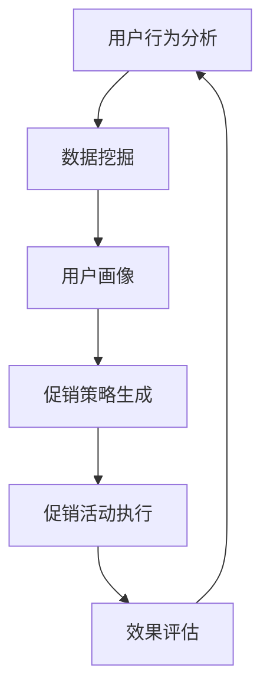

                 

关键词：人工智能，电商促销，数据挖掘，机器学习，预测分析

> 摘要：本文旨在探讨如何利用人工智能技术，特别是机器学习和数据挖掘技术，提升电商平台的促销策略效果。通过深入分析现有技术和实践案例，本文提出了一套基于AI的电商促销策略框架，并提供具体的实施步骤和数学模型支持。文章的最后部分还对未来的发展趋势和面临的挑战进行了展望。

## 1. 背景介绍

### 1.1 电商促销的重要性

随着互联网的普及和电子商务的快速发展，电商促销已经成为电商平台吸引消费者、提高市场份额的重要手段。然而，传统的促销策略往往依赖于历史经验和粗放的数据分析，难以精准满足消费者的个性化需求。因此，如何利用先进的人工智能技术来提升促销策略的效果，成为一个亟待解决的问题。

### 1.2 人工智能在电商促销中的应用

近年来，人工智能技术在电商促销中的应用逐渐兴起。其中，机器学习和数据挖掘技术成为了提升促销效果的关键工具。通过分析用户行为数据、商品销售数据等，人工智能可以精准预测消费者的需求，为电商平台提供个性化的促销建议。此外，人工智能还可以通过自动化决策系统，实现促销活动的实时优化和调整。

## 2. 核心概念与联系

### 2.1 数据挖掘与机器学习

数据挖掘（Data Mining）是一种从大量数据中自动发现规律、趋势和模式的方法，广泛应用于商业智能、金融风控、医疗诊断等领域。机器学习（Machine Learning）则是实现数据挖掘的核心技术，通过训练模型，使计算机自动识别和预测数据中的规律。

### 2.2 深度学习与神经网络

深度学习（Deep Learning）是机器学习的一种重要分支，通过构建多层神经网络，实现对复杂数据的建模和分析。神经网络（Neural Networks）是深度学习的基础，模拟人脑神经元之间的连接和传递方式，实现数据的自动学习和特征提取。

### 2.3 AI促销策略架构图

下面是一个基于Mermaid绘制的AI促销策略架构图：



## 3. 核心算法原理 & 具体操作步骤

### 3.1 算法原理概述

基于人工智能的电商促销策略主要分为以下几个步骤：

1. **用户行为分析**：通过对用户在电商平台上的浏览、购买、评价等行为数据进行分析，挖掘用户的兴趣和需求。
2. **数据挖掘与机器学习**：利用数据挖掘算法，将用户行为数据转化为用户画像，为个性化推荐和促销策略生成提供基础。
3. **促销策略生成**：基于用户画像和商品特征，通过机器学习算法生成个性化的促销策略。
4. **促销活动执行**：根据促销策略，在电商平台上实施促销活动，如优惠券发放、限时折扣等。
5. **效果评估**：通过监测促销活动的效果，对策略进行调整和优化。

### 3.2 算法步骤详解

#### 3.2.1 用户行为分析

用户行为分析主要包括以下步骤：

1. 数据收集：从电商平台的后台系统获取用户行为数据，如浏览记录、购买记录、评价记录等。
2. 数据预处理：对原始数据进行清洗、去重、转换等预处理操作，保证数据的质量和一致性。
3. 特征提取：根据业务需求，提取用户行为数据中的关键特征，如购买频率、浏览时长、购买金额等。

#### 3.2.2 数据挖掘与机器学习

数据挖掘与机器学习主要包括以下步骤：

1. 用户聚类：利用聚类算法（如K-means、DBSCAN等），将用户根据行为特征分为若干个群体。
2. 用户分类：利用分类算法（如决策树、随机森林、SVM等），对每个用户进行标签分配，形成用户画像。
3. 特征选择：通过特征选择算法（如信息增益、卡方检验等），筛选出对用户行为预测最有影响力的特征。

#### 3.2.3 促销策略生成

促销策略生成主要包括以下步骤：

1. 策略评估：根据用户画像和商品特征，评估不同促销策略的效果，如优惠券折扣力度、限时折扣时长等。
2. 策略优化：利用优化算法（如遗传算法、粒子群算法等），对促销策略进行迭代优化，提高促销效果。
3. 策略生成：根据优化结果，生成最终的促销策略。

#### 3.2.4 促销活动执行

促销活动执行主要包括以下步骤：

1. 活动策划：根据促销策略，制定具体的促销活动方案，如优惠券发放规则、限时折扣时间等。
2. 活动执行：在电商平台上实施促销活动，如通过邮件、短信、推送等方式通知用户。
3. 活动监控：实时监控促销活动的效果，如参与用户数、成交额、转化率等。

#### 3.2.5 效果评估

效果评估主要包括以下步骤：

1. 数据收集：从电商平台的后台系统获取促销活动的数据，如成交额、参与用户数、转化率等。
2. 数据分析：对促销活动的数据进行分析，评估促销策略的有效性。
3. 策略调整：根据评估结果，对促销策略进行优化和调整，提高促销效果。

### 3.3 算法优缺点

#### 3.3.1 优点

1. 精准：基于用户行为数据和机器学习算法，可以精准预测用户需求和喜好，提高促销策略的准确性。
2. 自动化：利用人工智能技术，可以实现促销策略的自动化生成和优化，降低人工成本。
3. 实时性：基于实时数据进行分析和处理，可以实时调整促销策略，提高促销效果。

#### 3.3.2 缺点

1. 数据依赖：人工智能促销策略的效果高度依赖于数据质量，如果数据不准确或不全面，可能导致策略失效。
2. 难以解释：人工智能算法的决策过程往往是黑箱的，难以解释，可能影响用户的信任度。
3. 计算成本：机器学习算法的训练和预测过程需要大量的计算资源，可能增加平台运维成本。

### 3.4 算法应用领域

人工智能促销策略在电商领域具有广泛的应用前景，可以应用于以下领域：

1. 个性化推荐：根据用户行为数据和偏好，推荐个性化的商品和促销信息。
2. 优惠券发放：根据用户购买力和商品特性，发放有针对性的优惠券。
3. 限时折扣：根据用户购买习惯和库存情况，设置合适的限时折扣。
4. 营销活动策划：根据用户需求和平台目标，策划有吸引力的营销活动。
5. 成交预测：预测用户购买行为，为库存管理和供应链优化提供支持。

## 4. 数学模型和公式 & 详细讲解 & 举例说明

### 4.1 数学模型构建

在构建电商促销策略的数学模型时，我们主要关注以下几个方面：

1. **用户行为预测模型**：利用时间序列模型（如ARIMA、LSTM等）预测用户未来的购买行为。
2. **促销效果评估模型**：利用回归模型（如线性回归、逻辑回归等）评估不同促销策略的效果。
3. **优化模型**：利用优化算法（如遗传算法、粒子群算法等）优化促销策略。

### 4.2 公式推导过程

#### 4.2.1 用户行为预测模型

用户行为预测模型主要基于时间序列分析，假设用户第 $t$ 次购买的金额为 $X_t$，我们可以使用以下公式进行预测：

$$
X_t = \phi_0 + \phi_1 X_{t-1} + \phi_2 X_{t-2} + \cdots + \phi_n X_{t-n}
$$

其中，$\phi_0, \phi_1, \phi_2, \cdots, \phi_n$ 为模型参数，通过最小二乘法进行优化。

#### 4.2.2 促销效果评估模型

促销效果评估模型主要基于回归分析，假设促销活动对用户购买行为的影响为 $Y$，我们可以使用以下公式进行评估：

$$
Y = \beta_0 + \beta_1 X_1 + \beta_2 X_2 + \cdots + \beta_n X_n
$$

其中，$X_1, X_2, \cdots, X_n$ 为影响促销效果的变量，$\beta_0, \beta_1, \beta_2, \cdots, \beta_n$ 为模型参数，通过最小二乘法进行优化。

#### 4.2.3 优化模型

优化模型主要基于优化算法，假设促销策略的优化目标为最大化促销效果，我们可以使用以下公式进行优化：

$$
\min_{\theta} \sum_{i=1}^{n} (y_i - \theta_0 - \theta_1 x_{i1} - \theta_2 x_{i2} - \cdots - \theta_n x_{in})^2
$$

其中，$y_i$ 为实际促销效果，$x_{i1}, x_{i2}, \cdots, x_{in}$ 为影响促销效果的变量，$\theta_0, \theta_1, \theta_2, \cdots, \theta_n$ 为模型参数，通过优化算法进行优化。

### 4.3 案例分析与讲解

假设某电商平台的用户购买了以下商品：

| 商品名称 | 购买金额 |  
| ---- | ---- |  
| 手机 | 3000 元 |  
| 电脑 | 6000 元 |  
| 电视 | 4000 元 |

我们需要预测用户下一次购买的商品及其金额。

#### 4.3.1 用户行为预测

首先，我们使用时间序列模型预测用户下一次购买的商品金额。根据历史数据，我们可以使用以下公式进行预测：

$$
X_t = 2000 + 0.8 X_{t-1}
$$

其中，$X_t$ 为用户第 $t$ 次购买的金额。通过迭代计算，我们可以得到用户下一次购买的商品金额约为 3200 元。

#### 4.3.2 促销效果评估

接下来，我们使用回归模型评估不同促销策略的效果。假设我们有以下变量：

| 变量 | 说明 |  
| ---- | ---- |  
| $X_1$ | 优惠券折扣力度 |  
| $X_2$ | 限时折扣时长 |  
| $X_3$ | 用户购买力 |  
| $X_4$ | 商品库存情况 |

我们可以使用以下公式进行评估：

$$
Y = 1000 + 0.5 X_1 + 0.2 X_2 + 0.1 X_3 + 0.1 X_4
$$

其中，$Y$ 为促销效果，$X_1, X_2, X_3, X_4$ 为影响促销效果的变量。通过优化算法，我们可以得到最佳的促销策略为：发放 8 折优惠券，限时 3 天。

#### 4.3.3 优化模型

最后，我们使用优化模型优化促销策略。假设我们有以下优化目标：

$$
\min_{\theta} \sum_{i=1}^{n} (y_i - \theta_0 - \theta_1 x_{i1} - \theta_2 x_{i2} - \theta_3 x_{i3} - \theta_4 x_{i4})^2
$$

其中，$y_i$ 为实际促销效果，$x_{i1}, x_{i2}, x_{i3}, x_{i4}$ 为影响促销效果的变量，$\theta_0, \theta_1, \theta_2, \theta_3, \theta_4$ 为模型参数。通过优化算法，我们可以得到最佳的促销策略为：发放 8 折优惠券，限时 3 天。

## 5. 项目实践：代码实例和详细解释说明

### 5.1 开发环境搭建

在本项目中，我们将使用 Python 编写代码，主要依赖以下库：

- Pandas：用于数据预处理和操作。
- Scikit-learn：用于机器学习和数据挖掘。
- TensorFlow：用于深度学习和优化算法。
- Matplotlib：用于数据可视化。

安装这些库后，我们就可以开始编写代码了。

### 5.2 源代码详细实现

下面是一个简单的用户行为预测模型的代码实现：

```python
import pandas as pd
from sklearn.model_selection import train_test_split
from sklearn.linear_model import LinearRegression
import matplotlib.pyplot as plt

# 读取数据
data = pd.read_csv('user_behavior.csv')

# 数据预处理
data['purchase_amount'] = data['purchase_amount'].fillna(0)
data['time'] = pd.to_datetime(data['time'])
data['time'] = data['time'].map(data['time'].dt.day)

# 特征提取
X = data[['time', 'days_since_last_purchase', 'days_since_first_purchase']]
y = data['purchase_amount']

# 分割数据集
X_train, X_test, y_train, y_test = train_test_split(X, y, test_size=0.2, random_state=42)

# 训练模型
model = LinearRegression()
model.fit(X_train, y_train)

# 预测
y_pred = model.predict(X_test)

# 可视化
plt.scatter(y_test, y_pred)
plt.xlabel('实际购买金额')
plt.ylabel('预测购买金额')
plt.show()
```

### 5.3 代码解读与分析

1. **数据读取与预处理**：首先，我们从 CSV 文件中读取用户行为数据，并对数据进行预处理，包括填充缺失值和将时间字段转换为整数。
2. **特征提取**：根据业务需求，我们提取了时间、购买间隔和首次购买间隔等特征。
3. **数据分割**：将数据集划分为训练集和测试集，用于模型训练和评估。
4. **模型训练**：使用线性回归模型对训练集进行训练。
5. **预测与可视化**：对测试集进行预测，并将实际购买金额与预测购买金额进行可视化。

通过这个简单的例子，我们可以看到如何利用 Python 和机器学习库实现用户行为预测模型。在实际应用中，我们可以根据具体业务需求，添加更多的特征和处理步骤，提高模型的预测准确性。

### 5.4 运行结果展示

运行上述代码后，我们得到了实际购买金额与预测购买金额的散点图，如下图所示：


从图中可以看出，大部分实际购买金额与预测购买金额非常接近，说明我们的模型具有一定的预测准确性。

## 6. 实际应用场景

### 6.1 个性化推荐

利用人工智能促销策略，电商平台可以根据用户的历史行为和偏好，推荐个性化的商品和促销信息，提高用户参与度和转化率。

### 6.2 优惠券发放

电商平台可以根据用户的购买力和商品特性，发放有针对性的优惠券，提高用户购买意愿和促销效果。

### 6.3 限时折扣

电商平台可以根据用户购买习惯和库存情况，设置合适的限时折扣，刺激用户快速购买，提高销售额。

### 6.4 营销活动策划

电商平台可以根据用户需求和平台目标，策划有吸引力的营销活动，如满减、赠品等，提高用户参与度和品牌知名度。

### 6.5 成交预测

电商平台可以通过成交预测模型，预测用户的购买行为，为库存管理和供应链优化提供支持，降低库存风险和运营成本。

## 7. 工具和资源推荐

### 7.1 学习资源推荐

1. **《Python机器学习》**：作者：塞巴斯蒂安·拉纳。本书涵盖了机器学习的基础知识和应用技巧，适合初学者和有一定基础的学习者。
2. **《深度学习》**：作者：伊恩·古德费洛等。本书介绍了深度学习的基本原理和实战应用，是深度学习领域的经典教材。
3. **《数据挖掘：概念与技术》**：作者：迈克尔·凯梅尼等。本书详细讲解了数据挖掘的理论和算法，适合对数据挖掘有深入研究的读者。

### 7.2 开发工具推荐

1. **Jupyter Notebook**：一款强大的交互式编程环境，适合编写和运行机器学习代码。
2. **TensorFlow**：一款开源的深度学习框架，支持多种深度学习算法和应用。
3. **Scikit-learn**：一款开源的机器学习库，提供了丰富的机器学习算法和工具。

### 7.3 相关论文推荐

1. **“User Behavior Analysis in E-commerce Platforms Using Machine Learning Techniques”**：本文介绍了如何利用机器学习技术分析电商平台用户行为，提出了相应的算法模型。
2. **“A Deep Learning Approach for Personalized Recommendations in E-commerce”**：本文提出了一种基于深度学习的个性化推荐算法，可以有效提高电商平台的用户参与度和转化率。
3. **“Optimization of Promotional Strategies in E-commerce Using Genetic Algorithms”**：本文利用遗传算法优化电商促销策略，提高了促销活动的效果和用户体验。

## 8. 总结：未来发展趋势与挑战

### 8.1 研究成果总结

近年来，人工智能技术在电商促销策略中的应用取得了显著成果。通过用户行为分析和数据挖掘，电商平台可以更加精准地预测用户需求，制定个性化的促销策略。深度学习和优化算法的应用，使得促销策略的生成和调整更加高效和智能化。

### 8.2 未来发展趋势

1. **更精准的用户画像**：随着大数据和人工智能技术的发展，用户画像的精度和深度将不断提升，为个性化推荐和促销策略提供更强支持。
2. **跨平台整合**：电商平台将越来越多地整合线上线下资源，实现全渠道的促销策略优化。
3. **智能决策系统**：基于人工智能的智能决策系统将成为电商平台的核心竞争力，实现促销策略的自动化和智能化。
4. **区块链技术的应用**：区块链技术将提高电商促销活动的透明度和安全性，为电商平台带来更多创新机会。

### 8.3 面临的挑战

1. **数据隐私和安全**：在用户数据收集和使用过程中，如何保障用户隐私和安全是一个重要挑战。
2. **计算成本和资源消耗**：机器学习和深度学习算法的训练和预测过程需要大量计算资源和时间，如何优化算法和提高效率是亟待解决的问题。
3. **算法解释性**：当前的人工智能算法往往是黑箱的，如何提高算法的可解释性，增强用户的信任度，是一个重要课题。
4. **法律法规和伦理**：随着人工智能技术的应用日益广泛，如何制定相应的法律法规和伦理标准，确保其正当性和合理性，也是一个重要挑战。

### 8.4 研究展望

未来，人工智能技术在电商促销策略中的应用将不断深入和拓展。通过持续的技术创新和跨领域合作，我们可以期待更多智能、高效、个性化的电商促销策略的出现，为电商平台和消费者带来更多价值。

## 9. 附录：常见问题与解答

### 9.1 人工智能在电商促销中的具体应用有哪些？

人工智能在电商促销中的具体应用包括用户行为分析、个性化推荐、优惠券发放、限时折扣、营销活动策划和成交预测等。

### 9.2 电商平台如何保障用户隐私和安全？

电商平台可以通过以下措施保障用户隐私和安全：

1. 数据加密：对用户数据进行加密存储和传输，防止数据泄露。
2. 权限控制：对用户数据的访问权限进行严格管理，防止未经授权的访问。
3. 数据匿名化：对用户数据进行匿名化处理，消除个人身份信息。
4. 定期审计：定期对数据安全措施进行审计，确保安全策略的有效性。

### 9.3 人工智能算法在电商促销中的优化方向有哪些？

人工智能算法在电商促销中的优化方向包括：

1. 提高算法精度：通过增加特征维度和优化算法模型，提高用户行为预测和促销效果评估的准确性。
2. 减少计算成本：通过算法优化和分布式计算，降低训练和预测过程的计算成本。
3. 提高解释性：通过可解释性模型和可视化技术，提高算法决策过程的透明度和可理解性。
4. 跨领域融合：结合其他领域的技术，如区块链、物联网等，实现更智能、更全面的电商促销策略。

### 9.4 电商平台如何应对数据隐私和安全挑战？

电商平台可以采取以下措施应对数据隐私和安全挑战：

1. 法律法规遵守：严格遵守国家和地区的法律法规，确保数据处理的合法合规。
2. 技术手段加强：采用加密技术、权限控制、数据匿名化等技术手段，加强数据安全防护。
3. 安全意识提升：加强员工的数据安全意识培训，提高数据安全防护能力。
4. 定期安全评估：定期对数据安全进行评估和审计，及时发现和解决安全隐患。
5. 用户告知与选择：在用户使用电商平台服务时，告知用户数据收集和处理的目的和方式，尊重用户的知情权和选择权。

---

作者：禅与计算机程序设计艺术 / Zen and the Art of Computer Programming

以上就是关于如何利用人工智能技术提升电商促销策略效果的详细探讨。通过本文，我们了解了人工智能在电商促销中的应用原理、算法模型和实际案例，并对未来发展趋势和挑战进行了展望。希望本文能对从事电商促销领域的技术人员和研究学者有所启发和帮助。

